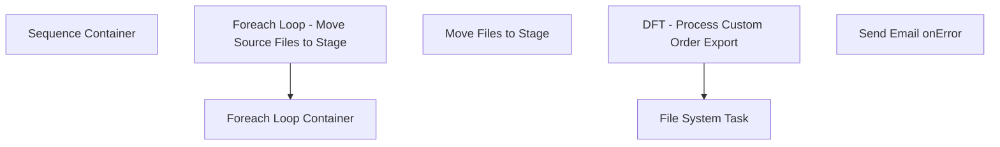

# SSIS Package: OMSCustomOrderExportImport

**Project:** WebOrderProcessing  
**Folder:** SSIS  
**Server:** STL-SSIS-P-01  

## Connection Managers

| Name | Type | Server | Catalog | Connection (sanitized) |
|---|---|---|---|---|
| OMSCustomOrderExport | FLATFILE |  |  |  |
| OMSTransactionDetailReport_v2 | FLATFILE |  |  |  |
| SMTP_EMAIL | SMTP |  |  |  |
| SQL_LOG | OLEDB | stl-ssis-p-01 | msdb | Data Source=stl-ssis-p-01; Initial Catalog=msdb; Provider=SQLNCLI11.1; Integrated Security=SSPI; Auto Translate=False |

## Control Flow Tasks

| Task | Type |
|---|---|
| OMSCustomOrderExportImport | Package |
| Sequence Container | SEQUENCE |
| Foreach Loop - Move Source Files to Stage | FOREACHLOOP |
| Move Files to Stage | FileSystemTask |
| Foreach Loop Container | FOREACHLOOP |
| DFT - Process Custom Order Export | Pipeline |
| File System Task | FileSystemTask |
| Send Email onError | SendMailTask |

## Control Flow Outline

```text
- Send Email onError [SendMailTask]
- Sequence Container [SEQUENCE]
  - Foreach Loop - Move Source Files to Stage [FOREACHLOOP]
    - Move Files to Stage [FileSystemTask]
  - Foreach Loop Container [FOREACHLOOP]
    - DFT - Process Custom Order Export [Pipeline]
    - File System Task [FileSystemTask]
```

## Architecture Diagram



## Variables

| Namespace | Name | Expression-bound |
|---|---|---|
| System | Propagate | No |
| User | OMSFileName | No |

## Execute SQL Tasks

_None detected._

## Data Flow: Sources

| Component | Source Object | Type | Data Flow Task | Connection | SQL Kind |
|---|---|---|---|---|---|
| FFS - Read Custom Order Export |  | FlatFileSource | DFT - Process Custom Order Export | OMSCustomOrderExport |  |

## Data Flow: Destinations

| Component | Target Table | Type | Data Flow Task | Connection | SQL Kind |
|---|---|---|---|---|---|
| InsertCustomOrderExport |  | OLEDBDestination | DFT - Process Custom Order Export | {6c71ac67-bc98-46e8-9678-412afb3961fd}:external |  |
