# SSIS Package: OMSTransactionDetailImport

**Project:** WebOrderProcessing  
**Folder:** SSIS  
**Server:** STL-SSIS-P-01  

## Architecture Diagram

```mermaid
flowchart TD
    subgraph Connections
        OMSTransactionDetailReport_conn(["OMSTransactionDetailReport [FLATFILE]"])
        OMSTransactionDetailReport_v2_conn(["OMSTransactionDetailReport_v2 [FLATFILE]"])
        SMTP_EMAIL_conn(["SMTP_EMAIL [SMTP]"])
        SQL_LOG_conn(["SQL_LOG [OLEDB]"])
        TransactionDetailCSV_conn(["TransactionDetailCSV [FILE]"])
    end
    subgraph ControlFlow
        OMSTransactionDetailImport_task["OMSTransactionDetailImport"]
        Sequence_Container_task["Sequence Container"]
        OMSTransactionDetailImport_task --> Sequence_Container_task
        Foreach_Loop___Move_Source_Files_to_Stage_task["Foreach Loop - Move Source Files to Stage"]
        Sequence_Container_task --> Foreach_Loop___Move_Source_Files_to_Stage_task
        Move_Files_to_Stage_task["Move Files to Stage"]
        Foreach_Loop___Move_Source_Files_to_Stage_task --> Move_Files_to_Stage_task
        Foreach_Loop_Container_task["Foreach Loop Container"]
        Move_Files_to_Stage_task --> Foreach_Loop_Container_task
        DFT___Transaction_Details_task["DFT - Transaction Details"]
        Foreach_Loop_Container_task --> DFT___Transaction_Details_task
        File_System_Task_task["File System Task"]
        DFT___Transaction_Details_task --> File_System_Task_task
        File_System_Task_1_task["File System Task 1"]
        File_System_Task_task --> File_System_Task_1_task
        ST___Fix_Input_Files_task["ST - Fix Input Files"]
        File_System_Task_1_task --> ST___Fix_Input_Files_task
        Send_Email_onError_task["Send Email onError"]
        ST___Fix_Input_Files_task --> Send_Email_onError_task
    end
```

## Connection Managers

| Name | Type |
|---|---|
| OMSTransactionDetailReport | FLATFILE |
| OMSTransactionDetailReport_v2 | FLATFILE |
| SMTP_EMAIL | SMTP |
| SQL_LOG | OLEDB |
| TransactionDetailCSV | FILE |

## Control Flow Tasks

| Task | Type |
|---|---|
| OMSTransactionDetailImport | Microsoft.Package |
| Sequence Container | STOCK:SEQUENCE |
| Foreach Loop - Move Source Files to Stage | STOCK:FOREACHLOOP |
| Move Files to Stage | Microsoft.FileSystemTask |
| Foreach Loop Container | STOCK:FOREACHLOOP |
| DFT - Transaction Details | Microsoft.Pipeline |
| File System Task | Microsoft.FileSystemTask |
| File System Task 1 | Microsoft.FileSystemTask |
| ST - Fix Input Files | Microsoft.ScriptTask |
| Send Email onError | Microsoft.SendMailTask |

## Data Flow: Sources

| Component | SQL Preview |
|---|---|
|  | select * from [WM].[Transactions] |
|  | select * from [WM].[OMSTransactionDetails] |
|  |         UPDATE  [WebOrderProcessing].[WM].[OMSTransactionDetails]   SET [ShipmentNumber] = ?       ,[TransactionDate] = ?       ,[SubTotal] = ?       ,[Shipping] = ?       ,[ProcessingFee] = ?       ,[Tax] = ?       ,[TotalCharges] = ?       ,[PaymentTransactionType] = ?       ,[PaymentType] = ?       ,[TransactionAmount] = ?       ,[OrderDiscount] = ?       ,[ItemDiscount] = ?       ,[InvoiceAmou |

## Data Flow: Destinations

| Component | Destination |
|---|---|
|  | [WM].[OMSTransactionDetails] |
|  | [WM].[OMSTransactionDetailsMissingTransactions] |

