# SSIS Package: SalesAuditTranslateFromOMS

**Project:** WebOrderProcessing  
**Folder:** SSIS  
**Server:** STL-SSIS-P-01  

## Architecture Diagram

```mermaid
flowchart TD
    subgraph Connections
        SMTP_EMAIL_conn(["SMTP_EMAIL [SMTP]"])
        SQL_LOG_conn(["SQL_LOG [OLEDB]"])
    end
    subgraph ControlFlow
        SalesAuditTranslateFromOMS_task["SalesAuditTranslateFromOMS"]
        SEQ___File_Cleanup_task["SEQ - File Cleanup"]
        SalesAuditTranslateFromOMS_task --> SEQ___File_Cleanup_task
        FST___Delete_SA_Files_After_Move_task["FST - Delete SA Files After Move"]
        SEQ___File_Cleanup_task --> FST___Delete_SA_Files_After_Move_task
        Sequence_Container_task["Sequence Container"]
        FST___Delete_SA_Files_After_Move_task --> Sequence_Container_task
        Execute_SQL_Task_task["Execute SQL Task"]
        Sequence_Container_task --> Execute_SQL_Task_task
        FST___Delete_SA_Files_After_Move_task["FST - Delete SA Files After Move"]
        Execute_SQL_Task_task --> FST___Delete_SA_Files_After_Move_task
        FST___Move_SA_Files_to_SaApp01_task["FST - Move SA Files to SaApp01"]
        FST___Delete_SA_Files_After_Move_task --> FST___Move_SA_Files_to_SaApp01_task
        SQL___Get_Customer_Bill_To_task["SQL - Get Customer Bill To"]
        FST___Move_SA_Files_to_SaApp01_task --> SQL___Get_Customer_Bill_To_task
        SQL___Get_Customer_Ship_To_task["SQL - Get Customer Ship To"]
        SQL___Get_Customer_Bill_To_task --> SQL___Get_Customer_Ship_To_task
        SQL___Get_Donation_Info_task["SQL - Get Donation Info"]
        SQL___Get_Customer_Ship_To_task --> SQL___Get_Donation_Info_task
        SQL___Get_Gift_Card_Info_task["SQL - Get Gift Card Info"]
        SQL___Get_Donation_Info_task --> SQL___Get_Gift_Card_Info_task
        SQL___Get_Order_Item_Discounts_task["SQL - Get Order Item Discounts"]
        SQL___Get_Gift_Card_Info_task --> SQL___Get_Order_Item_Discounts_task
        SQL___Get_Order_Items_task["SQL - Get Order Items"]
        SQL___Get_Order_Item_Discounts_task --> SQL___Get_Order_Items_task
        SQL___Get_Payments_task["SQL - Get Payments"]
        SQL___Get_Order_Items_task --> SQL___Get_Payments_task
        SQL___Get_Previous_Order_Item_Discounts_task["SQL - Get Previous Order Item Discounts"]
        SQL___Get_Payments_task --> SQL___Get_Previous_Order_Item_Discounts_task
        SQL___Get_Return_Orders_Taxes_task["SQL - Get Return Orders Taxes"]
        SQL___Get_Previous_Order_Item_Discounts_task --> SQL___Get_Return_Orders_Taxes_task
        SQL___Get_Return_Payments_task["SQL - Get Return Payments"]
        SQL___Get_Return_Orders_Taxes_task --> SQL___Get_Return_Payments_task
        SQL___Get_Shipped_Orders_task["SQL - Get Shipped Orders"]
        SQL___Get_Return_Payments_task --> SQL___Get_Shipped_Orders_task
        SQL___Get_Shipped_Orders_Taxes_task["SQL - Get Shipped Orders Taxes"]
        SQL___Get_Shipped_Orders_task --> SQL___Get_Shipped_Orders_Taxes_task
        SQL___Get_Shipping_Discounts_task["SQL - Get Shipping Discounts"]
        SQL___Get_Shipped_Orders_Taxes_task --> SQL___Get_Shipping_Discounts_task
        SQL___SAItemOverrideInfo_task["SQL - SAItemOverrideInfo"]
        SQL___Get_Shipping_Discounts_task --> SQL___SAItemOverrideInfo_task
        SQL___Truncate_and_Reload_tmpOrderOrderTransactionIdentifier_task["SQL - Truncate and Reload tmpOrderOrderTransactionIdentifier"]
        SQL___SAItemOverrideInfo_task --> SQL___Truncate_and_Reload_tmpOrderOrderTransactionIdentifier_task
        SQL___Update_OrderSatus_task["SQL - Update OrderSatus"]
        SQL___Truncate_and_Reload_tmpOrderOrderTransactionIdentifier_task --> SQL___Update_OrderSatus_task
        ST___Send_Order_to_Sales_Audit_Translate_task["ST - Send Order to Sales Audit Translate"]
        SQL___Update_OrderSatus_task --> ST___Send_Order_to_Sales_Audit_Translate_task
        Send_Email_onError_task["Send Email onError"]
        ST___Send_Order_to_Sales_Audit_Translate_task --> Send_Email_onError_task
    end
```

## Connection Managers

| Name | Type |
|---|---|
| SMTP_EMAIL | SMTP |
| SQL_LOG | OLEDB |

## Control Flow Tasks

| Task | Type |
|---|---|
| SalesAuditTranslateFromOMS | Microsoft.Package |
| SEQ - File Cleanup | STOCK:SEQUENCE |
| FST - Delete SA Files After Move | Microsoft.FileSystemTask |
| Sequence Container | STOCK:SEQUENCE |
| Execute SQL Task | Microsoft.ExecuteSQLTask |
| FST - Delete SA Files After Move | Microsoft.FileSystemTask |
| FST - Move SA Files to SaApp01 | Microsoft.FileSystemTask |
| SQL - Get Customer Bill To | Microsoft.ExecuteSQLTask |
| SQL - Get Customer Ship To | Microsoft.ExecuteSQLTask |
| SQL - Get Donation Info | Microsoft.ExecuteSQLTask |
| SQL - Get Gift Card Info | Microsoft.ExecuteSQLTask |
| SQL - Get Order Item Discounts | Microsoft.ExecuteSQLTask |
| SQL - Get Order Items | Microsoft.ExecuteSQLTask |
| SQL - Get Payments | Microsoft.ExecuteSQLTask |
| SQL - Get Previous Order Item Discounts | Microsoft.ExecuteSQLTask |
| SQL - Get Return Orders Taxes | Microsoft.ExecuteSQLTask |
| SQL - Get Return Payments | Microsoft.ExecuteSQLTask |
| SQL - Get Shipped Orders | Microsoft.ExecuteSQLTask |
| SQL - Get Shipped Orders Taxes | Microsoft.ExecuteSQLTask |
| SQL - Get Shipping Discounts | Microsoft.ExecuteSQLTask |
| SQL - SAItemOverrideInfo | Microsoft.ExecuteSQLTask |
| SQL - Truncate and Reload tmpOrderOrderTransactionIdentifier | Microsoft.ExecuteSQLTask |
| SQL - Update OrderSatus | Microsoft.ExecuteSQLTask |
| ST - Send Order to Sales Audit Translate | Microsoft.ScriptTask |
| Send Email onError | Microsoft.SendMailTask |

## Data Flow: Sources

_None detected._

## Data Flow: Destinations

_None detected._

