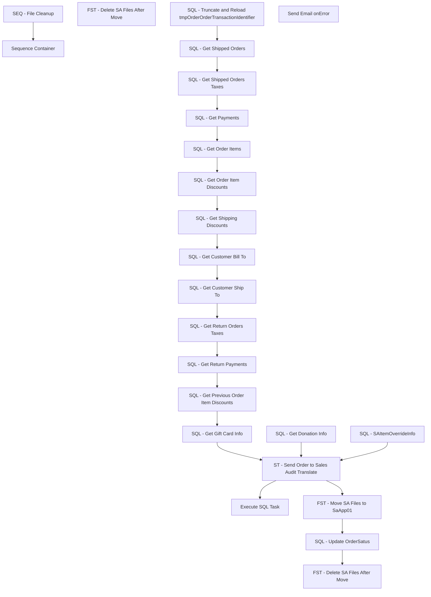

# SSIS Package: SalesAuditTranslateFromOMS

**Project:** WebOrderProcessing  
**Folder:** SSIS  
**Server:** STL-SSIS-P-01  

## Connection Managers

| Name | Type | Server | Catalog | Connection (sanitized) |
|---|---|---|---|---|
| SMTP_EMAIL | SMTP |  |  |  |
| SQL_LOG | OLEDB | stl-ssis-p-01 | msdb | Data Source=stl-ssis-p-01; Initial Catalog=msdb; Provider=SQLNCLI11.1; Integrated Security=SSPI; Auto Translate=False |

## Control Flow Tasks

| Task | Type |
|---|---|
| SalesAuditTranslateFromOMS | Package |
| SEQ - File Cleanup | SEQUENCE |
| FST - Delete SA Files After Move | FileSystemTask |
| Sequence Container | SEQUENCE |
| Execute SQL Task | ExecuteSQLTask |
| FST - Delete SA Files After Move | FileSystemTask |
| FST - Move SA Files to SaApp01 | FileSystemTask |
| SQL - Get Customer Bill To | ExecuteSQLTask |
| SQL - Get Customer Ship To | ExecuteSQLTask |
| SQL - Get Donation Info | ExecuteSQLTask |
| SQL - Get Gift Card Info | ExecuteSQLTask |
| SQL - Get Order Item Discounts | ExecuteSQLTask |
| SQL - Get Order Items | ExecuteSQLTask |
| SQL - Get Payments | ExecuteSQLTask |
| SQL - Get Previous Order Item Discounts | ExecuteSQLTask |
| SQL - Get Return Orders Taxes | ExecuteSQLTask |
| SQL - Get Return Payments | ExecuteSQLTask |
| SQL - Get Shipped Orders | ExecuteSQLTask |
| SQL - Get Shipped Orders Taxes | ExecuteSQLTask |
| SQL - Get Shipping Discounts | ExecuteSQLTask |
| SQL - SAItemOverrideInfo | ExecuteSQLTask |
| SQL - Truncate and Reload tmpOrderOrderTransactionIdentifier | ExecuteSQLTask |
| SQL - Update OrderSatus | ExecuteSQLTask |
| ST - Send Order to Sales Audit Translate | ScriptTask |
| Send Email onError | SendMailTask |

## Control Flow Outline

```text
- Send Email onError [SendMailTask]
- SEQ - File Cleanup [SEQUENCE]
  - FST - Delete SA Files After Move [FileSystemTask]
- Sequence Container [SEQUENCE]
  - Execute SQL Task [ExecuteSQLTask]
  - FST - Delete SA Files After Move [FileSystemTask]
  - FST - Move SA Files to SaApp01 [FileSystemTask]
  - SQL - Get Customer Bill To [ExecuteSQLTask]
  - SQL - Get Customer Ship To [ExecuteSQLTask]
  - SQL - Get Donation Info [ExecuteSQLTask]
  - SQL - Get Gift Card Info [ExecuteSQLTask]
  - SQL - Get Order Item Discounts [ExecuteSQLTask]
  - SQL - Get Order Items [ExecuteSQLTask]
  - SQL - Get Payments [ExecuteSQLTask]
  - SQL - Get Previous Order Item Discounts [ExecuteSQLTask]
  - SQL - Get Return Orders Taxes [ExecuteSQLTask]
  - SQL - Get Return Payments [ExecuteSQLTask]
  - SQL - Get Shipped Orders [ExecuteSQLTask]
  - SQL - Get Shipped Orders Taxes [ExecuteSQLTask]
  - SQL - Get Shipping Discounts [ExecuteSQLTask]
  - SQL - SAItemOverrideInfo [ExecuteSQLTask]
  - SQL - Truncate and Reload tmpOrderOrderTransactionIdentifier [ExecuteSQLTask]
  - SQL - Update OrderSatus [ExecuteSQLTask]
  - ST - Send Order to Sales Audit Translate [ScriptTask]
```

## Architecture Diagram



## Variables

| Namespace | Name | Expression-bound |
|---|---|---|
| System | Propagate | No |
| User | DonationInfo | No |
| User | ErrorMessage | No |
| User | ErrorStackTrace | No |
| User | GiftCardInfo | No |
| User | OrderBillTo | No |
| User | OrderItemDiscounts | No |
| User | OrderItems | No |
| User | OrderPayments | No |
| User | OrderReturnPayments | No |
| User | OrderShipTo | No |
| User | PreviousOrderItemDiscounts | No |
| User | ReturnOrdersTaxes | No |
| User | SAItemOverrideInfo | No |
| User | ShippedOrders | No |
| User | ShippedOrdersTaxes | No |
| User | ShippingDiscounts | No |

## Execute SQL Tasks

### Execute SQL Task

**Path:** `Package\Sequence Container\Execute SQL Task`  
**Connection:** {F1291F69-7277-411F-B6EC-AF91B8D3B89A}  

```sql
  INSERT INTO [ApplicationResources].[dbo].[ServiceLoggingGeneralUsage] ([IsAnException]
      ,[ExceptionMessage]
      ,[ExceptionStacktrace]
      ,[ServiceID])
  VALUES (1, ?, ?, 7)
```

### SQL - Get Customer Bill To

**Path:** `Package\Sequence Container\SQL - Get Customer Bill To`  
**Connection:** {6c71ac67-bc98-46e8-9678-412afb3961fd}  

```sql
EXEC [WM].[spGetShippedWMOrderBillTo_V3_1] 
```

### SQL - Get Customer Ship To

**Path:** `Package\Sequence Container\SQL - Get Customer Ship To`  
**Connection:** {6c71ac67-bc98-46e8-9678-412afb3961fd}  

```sql
EXEC [WM].[spGetShippedWMOrderShipTo_V3_1] 
```

### SQL - Get Donation Info

**Path:** `Package\Sequence Container\SQL - Get Donation Info`  
**Connection:** {6c71ac67-bc98-46e8-9678-412afb3961fd}  

```sql
EXEC [WM].[spGetDonationInfo]
```

### SQL - Get Gift Card Info

**Path:** `Package\Sequence Container\SQL - Get Gift Card Info`  
**Connection:** {6c71ac67-bc98-46e8-9678-412afb3961fd}  

```sql
EXEC [WM].[spGetGiftCardInfo]
```

### SQL - Get Order Item Discounts

**Path:** `Package\Sequence Container\SQL - Get Order Item Discounts`  
**Connection:** {6c71ac67-bc98-46e8-9678-412afb3961fd}  

```sql
EXEC [WM].[spGetShippedWMOrderItemDiscounts_V3_1] 
```

### SQL - Get Order Items

**Path:** `Package\Sequence Container\SQL - Get Order Items`  
**Connection:** {6c71ac67-bc98-46e8-9678-412afb3961fd}  

```sql
EXEC [WM].[spGetShippedWMOrderItems_V3_1]
```

### SQL - Get Payments

**Path:** `Package\Sequence Container\SQL - Get Payments`  
**Connection:** {6c71ac67-bc98-46e8-9678-412afb3961fd}  

```sql
EXEC WM.spGetShippedWMOrderPayments_V3_2
```

### SQL - Get Previous Order Item Discounts

**Path:** `Package\Sequence Container\SQL - Get Previous Order Item Discounts`  
**Connection:** {6c71ac67-bc98-46e8-9678-412afb3961fd}  

```sql
EXEC WM.spGetPreviousWMOrderItemDiscounts_V3_1
```

### SQL - Get Return Orders Taxes

**Path:** `Package\Sequence Container\SQL - Get Return Orders Taxes`  
**Connection:** {6c71ac67-bc98-46e8-9678-412afb3961fd}  

```sql
EXEC WM.spGetReturnWMOrdersTaxes_V3_1
```

### SQL - Get Return Payments

**Path:** `Package\Sequence Container\SQL - Get Return Payments`  
**Connection:** {6c71ac67-bc98-46e8-9678-412afb3961fd}  

```sql
EXEC WM.spGetReturnWMOrderPayments_V3_2
```

### SQL - Get Shipped Orders

**Path:** `Package\Sequence Container\SQL - Get Shipped Orders`  
**Connection:** {6c71ac67-bc98-46e8-9678-412afb3961fd}  

```sql
EXEC WM.spGetShippedWMOrders_V3_1
```

### SQL - Get Shipped Orders Taxes

**Path:** `Package\Sequence Container\SQL - Get Shipped Orders Taxes`  
**Connection:** {6c71ac67-bc98-46e8-9678-412afb3961fd}  

```sql
EXEC WM.spGetShippedWMOrdersTaxes_V3_1
```

### SQL - Get Shipping Discounts

**Path:** `Package\Sequence Container\SQL - Get Shipping Discounts`  
**Connection:** {6c71ac67-bc98-46e8-9678-412afb3961fd}  

```sql
EXEC [WM].[spGetShippedWMOrderShippingDiscounts_V3_1] 
```

### SQL - SAItemOverrideInfo

**Path:** `Package\Sequence Container\SQL - SAItemOverrideInfo`  
**Connection:** {6c71ac67-bc98-46e8-9678-412afb3961fd}  

```sql
SELECT [StoreMDMRangeID]
      ,[CNTRY_ID]
      ,[RGN_ID]
      ,[BEARITORY_ID]
      ,[STR_ID]
      ,[DisplayValue]
      ,[SAOrderItemOverrideId]
      ,[OriginalSku]
      ,[OverrideSku]
      ,[OverrideDescription]
      ,[OverrideStartDate]
      ,[OverrideEndDate]
      ,[OverrideRangeId]
      ,[RangeId]
  FROM [WebOrderProcessing].[WM].[vwSAOrderItemOverrideOptions]
```

### SQL - Truncate and Reload tmpOrderOrderTransactionIdentifier

**Path:** `Package\Sequence Container\SQL - Truncate and Reload tmpOrderOrderTransactionIdentifier`  
**Connection:** {6c71ac67-bc98-46e8-9678-412afb3961fd}  

```sql
EXEC WM.spTruncateAndReloadtmpOrderOrderTransactionIdentifier
```

### SQL - Update OrderSatus

**Path:** `Package\Sequence Container\SQL - Update OrderSatus`  
**Connection:** {6c71ac67-bc98-46e8-9678-412afb3961fd}  

```sql
EXEC [WM].[spUpdateWMItemStatus_to_SalesAuditComplete]
```

## Data Flow: Sources

_None detected._

## Data Flow: Destinations

_None detected._
