# SSIS Package: UkImportOMS

**Project:** WebOrderProcessing  
**Folder:** SSIS  
**Server:** STL-SSIS-P-01  

## Architecture Diagram

```mermaid
flowchart TD
    subgraph Connections
        Failure3_conn(["Failure3 [FILE]"])
        stl_sql_p_02_BABWOrderManagement_conn(["stl-sql-p-02.BABWOrderManagement [OLEDB]"])
    end
    subgraph ControlFlow
        UkImportOMS_task["UkImportOMS"]
        Foreach_Loop_Container_task["Foreach Loop Container"]
        UkImportOMS_task --> Foreach_Loop_Container_task
        Execute_SQL_Task_task["Execute SQL Task"]
        Foreach_Loop_Container_task --> Execute_SQL_Task_task
        UK_Orders_Process_1_task["UK Orders Process 1"]
        Execute_SQL_Task_task --> UK_Orders_Process_1_task
        Execute_Process_Task_task["Execute Process Task"]
        UK_Orders_Process_1_task --> Execute_Process_Task_task
        Send_Email_onError_task["Send Email onError"]
        Execute_Process_Task_task --> Send_Email_onError_task
        Delete_bad_files_UK_task["Delete bad files UK"]
        Send_Email_onError_task --> Delete_bad_files_UK_task
        File_System_Task_task["File System Task"]
        Delete_bad_files_UK_task --> File_System_Task_task
        File_System_Task_1_task["File System Task 1"]
        File_System_Task_task --> File_System_Task_1_task
        Delete_bad_files_US_task["Delete bad files US"]
        File_System_Task_1_task --> Delete_bad_files_US_task
        File_System_Task_task["File System Task"]
        Delete_bad_files_US_task --> File_System_Task_task
        File_System_Task_1_task["File System Task 1"]
        File_System_Task_task --> File_System_Task_1_task
        Send_Email_onError_task["Send Email onError"]
        File_System_Task_1_task --> Send_Email_onError_task
    end
```

## Connection Managers

| Name | Type |
|---|---|
| Failure3 | FILE |
| stl-sql-p-02.BABWOrderManagement | OLEDB |

## Control Flow Tasks

| Task | Type |
|---|---|
| UkImportOMS | Microsoft.Package |
| Foreach Loop Container | STOCK:FOREACHLOOP |
| Execute SQL Task | Microsoft.ExecuteSQLTask |
| UK Orders Process 1 | STOCK:SEQUENCE |
| Execute Process Task | Microsoft.ExecuteProcess |
| Send Email onError | Microsoft.SendMailTask |
| Delete bad files UK | STOCK:FOREACHLOOP |
| File System Task | Microsoft.FileSystemTask |
| File System Task 1 | Microsoft.FileSystemTask |
| Delete bad files US | STOCK:FOREACHLOOP |
| File System Task | Microsoft.FileSystemTask |
| File System Task 1 | Microsoft.FileSystemTask |
| Send Email onError | Microsoft.SendMailTask |

## Data Flow: Sources

_None detected._

## Data Flow: Destinations

_None detected._

