# SSIS Package: UkImportOMS

**Project:** WebOrderProcessing  
**Folder:** SSIS  
**Server:** STL-SSIS-P-01  

## Connection Managers

| Name | Type | Server | Catalog | Connection (sanitized) |
|---|---|---|---|---|
| Failure3 | FILE |  |  |  |
| stl-sql-p-02.BABWOrderManagement | OLEDB | stl-sql-p-02 | BABWOrderManagement | Data Source=stl-sql-p-02; Initial Catalog=BABWOrderManagement; Provider=SQLNCLI11.1; Integrated Security=SSPI; Auto Translate=False |

## Control Flow Tasks

| Task | Type |
|---|---|
| UkImportOMS | Package |
| Foreach Loop Container | FOREACHLOOP |
| Execute SQL Task | ExecuteSQLTask |
| UK Orders Process 1 | SEQUENCE |
| Execute Process Task | ExecuteProcess |
| Send Email onError | SendMailTask |
| Delete bad files UK | FOREACHLOOP |
| File System Task | FileSystemTask |
| File System Task 1 | FileSystemTask |
| Delete bad files US | FOREACHLOOP |
| File System Task | FileSystemTask |
| File System Task 1 | FileSystemTask |
| Send Email onError | SendMailTask |

## Control Flow Outline

```text
- Send Email onError [SendMailTask]
- Delete bad files UK [FOREACHLOOP]
  - File System Task [FileSystemTask]
  - File System Task 1 [FileSystemTask]
- Delete bad files US [FOREACHLOOP]
  - File System Task [FileSystemTask]
  - File System Task 1 [FileSystemTask]
- Send Email onError [SendMailTask]
- Foreach Loop Container [FOREACHLOOP]
  - Execute SQL Task [ExecuteSQLTask]
- UK Orders Process 1 [SEQUENCE]
  - Execute Process Task [ExecuteProcess]
```

## Architecture Diagram

```mermaid
flowchart TD
    n_Package_Foreach_Loop_Container["Foreach Loop Container"]
    n_Package_Foreach_Loop_Container_Execute_SQL_Task["Execute SQL Task"]
    n_Package_UK_Orders_Process_1["UK Orders Process 1"]
    n_Package_UK_Orders_Process_1_Execute_Process_Task["Execute Process Task"]
    n_Package_EventHandlers_OnError__Send_Email_onError["Send Email onError"]
    n_Package_EventHandlers_OnTaskFailed__Delete_bad_files_UK["Delete bad files UK"]
    n_Package_EventHandlers_OnTaskFailed__Delete_bad_files_UK_File_System_Task["File System Task"]
    n_Package_EventHandlers_OnTaskFailed__Delete_bad_files_UK_File_System_Task_1["File System Task 1"]
    n_Package_EventHandlers_OnTaskFailed__Delete_bad_files_US["Delete bad files US"]
    n_Package_EventHandlers_OnTaskFailed__Delete_bad_files_US_File_System_Task["File System Task"]
    n_Package_EventHandlers_OnTaskFailed__Delete_bad_files_US_File_System_Task_1["File System Task 1"]
    n_Package_EventHandlers_OnTaskFailed__Send_Email_onError["Send Email onError"]
    n_Package_EventHandlers_OnTaskFailed__Delete_bad_files_UK_File_System_Task --> n_Package_EventHandlers_OnTaskFailed__Delete_bad_files_UK_File_System_Task_1
    n_Package_EventHandlers_OnTaskFailed__Delete_bad_files_US_File_System_Task --> n_Package_EventHandlers_OnTaskFailed__Delete_bad_files_US_File_System_Task_1
    n_Package_EventHandlers_OnTaskFailed__Delete_bad_files_US --> n_Package_EventHandlers_OnTaskFailed__Delete_bad_files_UK
    n_Package_EventHandlers_OnTaskFailed__Send_Email_onError --> n_Package_EventHandlers_OnTaskFailed__Delete_bad_files_US
```



## Variables

| Namespace | Name | Expression-bound |
|---|---|---|
| System | Propagate | No |
| System | Propagate | No |
| User | CartonFileName | Yes |
| User | CartonNumber | No |
| User | ErrorFileList | No |
| User | FileName | No |
| User | FilePath | No |
| User | FileTest | No |
| User | FileTest2 | Yes |
| User | FileToDelete | Yes |
| User | FileToDeleteUK | Yes |
| User | FileToMove | Yes |
| User | FileToMoveUK | Yes |
| User | FullFile | Yes |
| User | LabelDestinationFolder | No |
| User | LabelFileName | No |
| User | OrderInd | No |
| User | OrderNumber | Yes |
| User | SortedFileList | No |
| User | SuccessFile | No |
| User | TempFileName | Yes |
| User | UKDoNotFTPFile | Yes |
| User | UKSortedFileList | No |
| User | UKSuccessFile | Yes |
| User | Variable | No |
| User | Variable2 | No |
| User | WMSXMLFileName | Yes |

### Expression-bound variable values

#### User::CartonFileName

**Expression:**

```sql
@[User::LabelDestinationFolder]  +  @[User::CartonNumber]
```

**Evaluated value:**

```sql
\\sharebear1\shared\warehouseprinting\success\
```

#### User::FileTest2

**Expression:**

```sql
RIGHT( LEFT( @[User::FileTest] ,25),10)
```

#### User::FileToDelete

**Expression:**

```sql
@[$Project::OmsXmlFolder] +  @[User::FileName]
```

**Evaluated value:**

```sql
\\kermode\FileRepository\omsTestOrders\babw-us\
```

#### User::FileToDeleteUK

**Expression:**

```sql
@[$Project::ukOMSFolder]  + @[User::FileName]
```

**Evaluated value:**

```sql
\\kermode\f$\FileRepository\omsTestOrders\babw-uk\
```

#### User::FileToMove

**Expression:**

```sql
@[$Project::OmsXmlFolder] +"Temp\\"+  @[User::FileName]
```

**Evaluated value:**

```sql
\\kermode\FileRepository\omsTestOrders\babw-us\Temp\
```

#### User::FileToMoveUK

**Expression:**

```sql
@[$Project::ukOMSFolder] +"TempFailure\\"+  @[User::FileName]
```

**Evaluated value:**

```sql
\\kermode\f$\FileRepository\omsTestOrders\babw-uk\TempFailure\
```

#### User::FullFile

**Expression:**

```sql
@[User::FilePath] +  @[User::FileName]
```

#### User::OrderNumber

**Expression:**

```sql
REPLACE( @[User::FileName] , @[$Project::ukOMSFolder] , @[$Project::ukOMSFolder] +"Temp\\" )
```

#### User::TempFileName

**Expression:**

```sql
REPLACE( @[User::FileName] , @[$Project::ukOMSFolder] , @[$Project::ukOMSFolder] +"Temp\\" )
```

#### User::UKDoNotFTPFile

**Expression:**

```sql
REPLACE( @[User::FileName] , @[$Project::ukOMSFolder] , @[$Project::ukOMSFolder] +"Success\\DoNotFTP\\" )
```

#### User::UKSuccessFile

**Expression:**

```sql
REPLACE( @[User::FileName] , @[$Project::ukOMSFolder] , @[$Project::ukOMSFolder] +"Success\\")
```

#### User::WMSXMLFileName

**Expression:**

```sql
Replace(@[$Project::WmsXmlFileName]  ,".",
 Left(REPLACE(  REPLACE( REPLACE(  REPLACE(   (DT_STR, 30, 1252) GETDATE(),"-",""),":",""),".","")," ",""),17) + ".")
```

**Evaluated value:**

```sql
PickTicket20220225092229823.xml
```

## Execute SQL Tasks

### Execute SQL Task

**Path:** `Package\Foreach Loop Container\Execute SQL Task`  
**Connection:** stl-sql-p-02.BABWOrderManagement (stl-sql-p-02/BABWOrderManagement)  

```sql
 insert into dbo.tmpOrderList select ?
```

## Data Flow: Sources

_None detected._

## Data Flow: Destinations

_None detected._
