# SSIS Package: UpDateUKStatus

**Project:** WebOrderProcessing  
**Folder:** SSIS  
**Server:** STL-SSIS-P-01  

## Architecture Diagram

```mermaid
flowchart TD
    subgraph ControlFlow
        UpDateUKStatus_task["UpDateUKStatus"]
        Generate_Ordered_List_of_files_task["Generate Ordered List of files"]
        UpDateUKStatus_task --> Generate_Ordered_List_of_files_task
        Loop_Through_Files_task["Loop Through Files"]
        Generate_Ordered_List_of_files_task --> Loop_Through_Files_task
        Sequence_Container_task["Sequence Container"]
        Loop_Through_Files_task --> Sequence_Container_task
        Clear_Staging_task["Clear Staging"]
        Sequence_Container_task --> Clear_Staging_task
        DFT___Load_XML_Files_to_Staging_task["DFT - Load XML Files to Staging"]
        Clear_Staging_task --> DFT___Load_XML_Files_to_Staging_task
        Move_files_to_success_folder_task["Move files to success folder"]
        DFT___Load_XML_Files_to_Staging_task --> Move_files_to_success_folder_task
        UpdateTracking_Number_task["UpdateTracking Number"]
        Move_files_to_success_folder_task --> UpdateTracking_Number_task
        Execute_SQL_Task_task["Execute SQL Task"]
        UpdateTracking_Number_task --> Execute_SQL_Task_task
        Update_Shipped_Orders_task["Update Shipped Orders"]
        Execute_SQL_Task_task --> Update_Shipped_Orders_task
        Foreach_Loop_Container_task["Foreach Loop Container"]
        Update_Shipped_Orders_task --> Foreach_Loop_Container_task
        Add_new_Item_Status_task["Add new Item Status"]
        Foreach_Loop_Container_task --> Add_new_Item_Status_task
        Add_new_Status_task["Add new Status"]
        Add_new_Item_Status_task --> Add_new_Status_task
        Clear_Old_Iterm_Status_task["Clear Old Iterm Status"]
        Add_new_Status_task --> Clear_Old_Iterm_Status_task
        Clear_Old_Order_Status_task["Clear Old Order Status"]
        Clear_Old_Iterm_Status_task --> Clear_Old_Order_Status_task
        Delete_from_Processing_table_task["Delete from Processing table"]
        Clear_Old_Order_Status_task --> Delete_from_Processing_table_task
        Log_Deck_Response_task["Log Deck Response"]
        Delete_from_Processing_table_task --> Log_Deck_Response_task
        UK_UpdateShippedOrders_task["UK UpdateShippedOrders"]
        Log_Deck_Response_task --> UK_UpdateShippedOrders_task
        ListShippedOrders_task["ListShippedOrders"]
        UK_UpdateShippedOrders_task --> ListShippedOrders_task
        Update_WAved_Orders_task["Update WAved Orders"]
        ListShippedOrders_task --> Update_WAved_Orders_task
        Foreach_Loop_Container_task["Foreach Loop Container"]
        Update_WAved_Orders_task --> Foreach_Loop_Container_task
        Add_new_Item_Status_task["Add new Item Status"]
        Foreach_Loop_Container_task --> Add_new_Item_Status_task
        Add_new_Order_Status_task["Add new Order Status"]
        Add_new_Item_Status_task --> Add_new_Order_Status_task
        Clear_Old_Item_Status_task["Clear Old Item Status"]
        Add_new_Order_Status_task --> Clear_Old_Item_Status_task
        Clear_Old_Order_Status_task["Clear Old Order Status"]
        Clear_Old_Item_Status_task --> Clear_Old_Order_Status_task
        Delete_from_Processing_table_task["Delete from Processing table"]
        Clear_Old_Order_Status_task --> Delete_from_Processing_table_task
        Log_Deck_Response_task["Log Deck Response"]
        Delete_from_Processing_table_task --> Log_Deck_Response_task
        UK_UpdateToWaved_task["UK UpdateToWaved"]
        Log_Deck_Response_task --> UK_UpdateToWaved_task
        ListWavedOrders_task["ListWavedOrders"]
        UK_UpdateToWaved_task --> ListWavedOrders_task
        Send_Email_onError_task["Send Email onError"]
        ListWavedOrders_task --> Send_Email_onError_task
    end
```

## Connection Managers

_None detected._

## Control Flow Tasks

| Task | Type |
|---|---|
| UpDateUKStatus | Microsoft.Package |
| Generate Ordered List of files | Microsoft.ScriptTask |
| Loop Through Files | STOCK:FOREACHLOOP |
| Sequence Container | STOCK:SEQUENCE |
| Clear Staging | Microsoft.ExecuteSQLTask |
| DFT - Load XML Files to Staging | Microsoft.Pipeline |
| Move files to success folder | Microsoft.FileSystemTask |
| UpdateTracking Number | STOCK:FOREACHLOOP |
| Execute SQL Task | Microsoft.ExecuteSQLTask |
| Update Shipped Orders | STOCK:SEQUENCE |
| Foreach Loop Container | STOCK:FOREACHLOOP |
| Add new Item Status | Microsoft.ExecuteSQLTask |
| Add new Status | Microsoft.ExecuteSQLTask |
| Clear Old Iterm Status | Microsoft.ExecuteSQLTask |
| Clear Old Order Status | Microsoft.ExecuteSQLTask |
| Delete from Processing table | Microsoft.ExecuteSQLTask |
| Log Deck Response | Microsoft.ExecuteSQLTask |
| UK UpdateShippedOrders | Microsoft.ScriptTask |
| ListShippedOrders | Microsoft.Pipeline |
| Update WAved Orders | STOCK:SEQUENCE |
| Foreach Loop Container | STOCK:FOREACHLOOP |
| Add new Item Status | Microsoft.ExecuteSQLTask |
| Add new Order Status | Microsoft.ExecuteSQLTask |
| Clear Old Item Status | Microsoft.ExecuteSQLTask |
| Clear Old Order Status | Microsoft.ExecuteSQLTask |
| Delete from Processing table | Microsoft.ExecuteSQLTask |
| Log Deck Response | Microsoft.ExecuteSQLTask |
| UK UpdateToWaved | Microsoft.ScriptTask |
| ListWavedOrders | Microsoft.Pipeline |
| Send Email onError | Microsoft.SendMailTask |

## Data Flow: Sources

| Component | SQL Preview |
|---|---|
|  | SELECT        OrderNum, OrderStatus FROM            WMstg.stgOrderUpdateList |
|  | Insert into ServiceLoggingGeneralUsage  select GetDate(),'Order Still in Pending Status', 1 ,NULL,NULL,NULL,'UpdateShippedOrders\\|' + ? |
|  | SELECT        OrderNum, OrderStatus FROM            WMstg.stgOrderUpdateList WHERE        (OrderStatus = 'Shipped') |
|  | SELECT        WM.Orders.OrderNum, COUNT(WM.OrderItems.OrderItemID) AS ItemCount,                           'XXXXXXXXXXXXXXXXXXXXXXXXXXXXXXXXXXXXXXXXXXXXXXXXXXXXXXXXXXXXXXXXXXXXXXXXXXXXXXXXXXXXXXXXXXXXXXXXXXXXXXXXXXXXXXXXXXXXXXXXXXXXXXXXXXXXXXXXXXXXXXXXXXXX' AS DeckMessage,                           WM.OrderStatus.Status, WM.Orders.OrderId FROM            WM.Orders INNER JOIN                        |
|  | SELECT        OrderNum, OrderStatus,LoadDate FROM            WMstg.stgOrderUpdateList WHERE        (OrderStatus = 'Waved') |
|  | SELECT        WM.Orders.OrderNum, COUNT(WM.OrderItems.OrderItemID) AS ItemCount,                           'XXXXXXXXXXXXXXXXXXXXXXXXXXXXXXXXXXXXXXXXXXXXXXXXXXXXXXXXXXXXXXXXXXXXXXXXXXXXXXXXXXXXXXXXXXXXXXXXXXXXXXXXXXXXXXXXXXXXXXXXXXXXXXXXXXXXXXXXXXXXXXXXXXXX' AS DeckMessage,                           WM.Orders.OrderId FROM            WM.Orders INNER JOIN                          WM.OrderItems ON WM. |

## Data Flow: Destinations

| Component | Destination |
|---|---|
|  | [WMstg].[stgOrderUpdateList] |
|  | [WMstg].[stgUkItems] |
|  | [WMstg].[stgUKOrders] |

