# SSIS Package: UpDateUKStatus

**Project:** WebOrderProcessing  
**Folder:** SSIS  
**Server:** STL-SSIS-P-01  

## Connection Managers

_None detected._

## Control Flow Tasks

| Task | Type |
|---|---|
| UpDateUKStatus | Package |
| Generate Ordered List of files | ScriptTask |
| Loop Through Files | FOREACHLOOP |
| Sequence Container | SEQUENCE |
| Clear Staging | ExecuteSQLTask |
| DFT - Load XML Files to Staging | Pipeline |
| Move files to success folder | FileSystemTask |
| UpdateTracking Number | FOREACHLOOP |
| Execute SQL Task | ExecuteSQLTask |
| Update Shipped Orders | SEQUENCE |
| Foreach Loop Container | FOREACHLOOP |
| Add new Item Status | ExecuteSQLTask |
| Add new Status | ExecuteSQLTask |
| Clear Old Iterm Status | ExecuteSQLTask |
| Clear Old Order Status | ExecuteSQLTask |
| Delete from Processing table | ExecuteSQLTask |
| Log Deck Response | ExecuteSQLTask |
| UK UpdateShippedOrders | ScriptTask |
| ListShippedOrders | Pipeline |
| Update WAved Orders | SEQUENCE |
| Foreach Loop Container | FOREACHLOOP |
| Add new Item Status | ExecuteSQLTask |
| Add new Order Status | ExecuteSQLTask |
| Clear Old Item Status | ExecuteSQLTask |
| Clear Old Order Status | ExecuteSQLTask |
| Delete from Processing table | ExecuteSQLTask |
| Log Deck Response | ExecuteSQLTask |
| UK UpdateToWaved | ScriptTask |
| ListWavedOrders | Pipeline |
| Send Email onError | SendMailTask |

## Control Flow Outline

```text
- Send Email onError [SendMailTask]
- Generate Ordered List of files [ScriptTask]
- Loop Through Files [FOREACHLOOP]
  - Sequence Container [SEQUENCE]
    - Clear Staging [ExecuteSQLTask]
    - DFT - Load XML Files to Staging [Pipeline]
    - Move files to success folder [FileSystemTask]
    - UpdateTracking Number [FOREACHLOOP]
      - Execute SQL Task [ExecuteSQLTask]
- Update Shipped Orders [SEQUENCE]
  - Foreach Loop Container [FOREACHLOOP]
    - Add new Item Status [ExecuteSQLTask]
    - Add new Status [ExecuteSQLTask]
    - Clear Old Iterm Status [ExecuteSQLTask]
    - Clear Old Order Status [ExecuteSQLTask]
    - Delete from Processing table [ExecuteSQLTask]
    - Log Deck Response [ExecuteSQLTask]
    - UK UpdateShippedOrders [ScriptTask]
  - ListShippedOrders [Pipeline]
- Update WAved Orders [SEQUENCE]
  - Foreach Loop Container [FOREACHLOOP]
    - Add new Item Status [ExecuteSQLTask]
    - Add new Order Status [ExecuteSQLTask]
    - Clear Old Item Status [ExecuteSQLTask]
    - Clear Old Order Status [ExecuteSQLTask]
    - Delete from Processing table [ExecuteSQLTask]
    - Log Deck Response [ExecuteSQLTask]
    - UK UpdateToWaved [ScriptTask]
  - ListWavedOrders [Pipeline]
```

## Architecture Diagram

```mermaid
flowchart TD
    n_Package_Generate_Ordered_List_of_files["Generate Ordered List of files"]
    n_Package_Loop_Through_Files["Loop Through Files"]
    n_Package_Loop_Through_Files_Sequence_Container["Sequence Container"]
    n_Package_Loop_Through_Files_Sequence_Container_Clear_Staging["Clear Staging"]
    n_Package_Loop_Through_Files_Sequence_Container_DFT___Load_XML_Files_to_Staging["DFT - Load XML Files to Staging"]
    n_Package_Loop_Through_Files_Sequence_Container_Move_files_to_success_folder["Move files to success folder"]
    n_Package_Loop_Through_Files_Sequence_Container_UpdateTracking_Number["UpdateTracking Number"]
    n_Package_Loop_Through_Files_Sequence_Container_UpdateTracking_Number_Execute_SQL_Task["Execute SQL Task"]
    n_Package_Update_Shipped_Orders["Update Shipped Orders"]
    n_Package_Update_Shipped_Orders_Foreach_Loop_Container["Foreach Loop Container"]
    n_Package_Update_Shipped_Orders_Foreach_Loop_Container_Add_new_Item_Status["Add new Item Status"]
    n_Package_Update_Shipped_Orders_Foreach_Loop_Container_Add_new_Status["Add new Status"]
    n_Package_Update_Shipped_Orders_Foreach_Loop_Container_Clear_Old_Iterm_Status["Clear Old Iterm Status"]
    n_Package_Update_Shipped_Orders_Foreach_Loop_Container_Clear_Old_Order_Status["Clear Old Order Status"]
    n_Package_Update_Shipped_Orders_Foreach_Loop_Container_Delete_from_Processing_table["Delete from Processing table"]
    n_Package_Update_Shipped_Orders_Foreach_Loop_Container_Log_Deck_Response["Log Deck Response"]
    n_Package_Update_Shipped_Orders_Foreach_Loop_Container_UK_UpdateShippedOrders["UK UpdateShippedOrders"]
    n_Package_Update_Shipped_Orders_ListShippedOrders["ListShippedOrders"]
    n_Package_Update_WAved_Orders["Update WAved Orders"]
    n_Package_Update_WAved_Orders_Foreach_Loop_Container["Foreach Loop Container"]
    n_Package_Update_WAved_Orders_Foreach_Loop_Container_Add_new_Item_Status["Add new Item Status"]
    n_Package_Update_WAved_Orders_Foreach_Loop_Container_Add_new_Order_Status["Add new Order Status"]
    n_Package_Update_WAved_Orders_Foreach_Loop_Container_Clear_Old_Item_Status["Clear Old Item Status"]
    n_Package_Update_WAved_Orders_Foreach_Loop_Container_Clear_Old_Order_Status["Clear Old Order Status"]
    n_Package_Update_WAved_Orders_Foreach_Loop_Container_Delete_from_Processing_table["Delete from Processing table"]
    n_Package_Update_WAved_Orders_Foreach_Loop_Container_Log_Deck_Response["Log Deck Response"]
    n_Package_Update_WAved_Orders_Foreach_Loop_Container_UK_UpdateToWaved["UK UpdateToWaved"]
    n_Package_Update_WAved_Orders_ListWavedOrders["ListWavedOrders"]
    n_Package_EventHandlers_OnError__Send_Email_onError["Send Email onError"]
    n_Package_Loop_Through_Files_Sequence_Container_DFT___Load_XML_Files_to_Staging --> n_Package_Loop_Through_Files_Sequence_Container_UpdateTracking_Number
    n_Package_Loop_Through_Files_Sequence_Container_UpdateTracking_Number --> n_Package_Loop_Through_Files_Sequence_Container_Move_files_to_success_folder
    n_Package_Loop_Through_Files_Sequence_Container_Clear_Staging --> n_Package_Loop_Through_Files_Sequence_Container_DFT___Load_XML_Files_to_Staging
    n_Package_Update_Shipped_Orders_Foreach_Loop_Container_UK_UpdateShippedOrders --> n_Package_Update_Shipped_Orders_Foreach_Loop_Container_Log_Deck_Response
    n_Package_Update_Shipped_Orders_Foreach_Loop_Container_Log_Deck_Response --> n_Package_Update_Shipped_Orders_Foreach_Loop_Container_Clear_Old_Order_Status
    n_Package_Update_Shipped_Orders_Foreach_Loop_Container_Clear_Old_Order_Status --> n_Package_Update_Shipped_Orders_Foreach_Loop_Container_Clear_Old_Iterm_Status
    n_Package_Update_Shipped_Orders_Foreach_Loop_Container_Clear_Old_Iterm_Status --> n_Package_Update_Shipped_Orders_Foreach_Loop_Container_Add_new_Status
    n_Package_Update_Shipped_Orders_Foreach_Loop_Container_Add_new_Status --> n_Package_Update_Shipped_Orders_Foreach_Loop_Container_Add_new_Item_Status
    n_Package_Update_Shipped_Orders_Foreach_Loop_Container_Add_new_Item_Status --> n_Package_Update_Shipped_Orders_Foreach_Loop_Container_Delete_from_Processing_table
    n_Package_Update_Shipped_Orders_ListShippedOrders --> n_Package_Update_Shipped_Orders_Foreach_Loop_Container
    n_Package_Update_WAved_Orders_Foreach_Loop_Container_Log_Deck_Response --> n_Package_Update_WAved_Orders_Foreach_Loop_Container_Clear_Old_Order_Status
    n_Package_Update_WAved_Orders_Foreach_Loop_Container_UK_UpdateToWaved --> n_Package_Update_WAved_Orders_Foreach_Loop_Container_Log_Deck_Response
    n_Package_Update_WAved_Orders_Foreach_Loop_Container_Clear_Old_Order_Status --> n_Package_Update_WAved_Orders_Foreach_Loop_Container_Clear_Old_Item_Status
    n_Package_Update_WAved_Orders_Foreach_Loop_Container_Clear_Old_Item_Status --> n_Package_Update_WAved_Orders_Foreach_Loop_Container_Add_new_Order_Status
    n_Package_Update_WAved_Orders_Foreach_Loop_Container_Add_new_Order_Status --> n_Package_Update_WAved_Orders_Foreach_Loop_Container_Add_new_Item_Status
    n_Package_Update_WAved_Orders_Foreach_Loop_Container_Add_new_Item_Status --> n_Package_Update_WAved_Orders_Foreach_Loop_Container_Delete_from_Processing_table
    n_Package_Update_WAved_Orders_ListWavedOrders --> n_Package_Update_WAved_Orders_Foreach_Loop_Container
    n_Package_Generate_Ordered_List_of_files --> n_Package_Loop_Through_Files
    n_Package_Update_WAved_Orders --> n_Package_Update_Shipped_Orders
    n_Package_Loop_Through_Files --> n_Package_Update_WAved_Orders
```



## Variables

| Namespace | Name | Expression-bound |
|---|---|---|
| System | Propagate | No |
| User | ConnectionString | Yes |
| User | ShippingMethod | No |
| User | SortedFileList | No |
| User | UKDeckMessage | No |
| User | UKDeckMessage | No |
| User | UKFileName | No |
| User | UKItemsToUpdate | No |
| User | UKOrderXML | No |
| User | UKOrderXML | No |
| User | UKOrdersToUpdate | No |
| User | UKShippedOrders | No |
| User | UKShippedQTY | No |
| User | UKWavedOrderID | No |
| User | UKWavedOrderID | No |
| User | UKWavedOrderNUM | No |
| User | UKWavedOrders | No |
| User | UKWavedQTY | No |
| User | UkItemID | No |
| User | UkUpdateFile | No |
| User | UkUpdateSuccessFolder | Yes |
| User | UktrackingNumber | No |
| User | UpdateStatusURL | Yes |

### Expression-bound variable values

#### User::ConnectionString

**Expression:**

```sql
"Data Source = " +  @[$Project::ProductionServer]  + "; Initial Catalog = WebOrderProcessing;Integrated Security = SSPI;"
```

**Evaluated value:**

```sql
Data Source = stl-sql-t-02; Initial Catalog = WebOrderProcessing;Integrated Security = SSPI;
```

#### User::UkUpdateSuccessFolder

**Expression:**

```sql
@[$Project::UKUpdateFileSource] + "Success\\"
```

**Evaluated value:**

```sql
\\kermode\FileRepository\WarehouseTestOrderStatusUpdates\Success\
```

#### User::UpdateStatusURL

**Expression:**

```sql
@[$Project::DeckOrderManagementServiceAPIURL]
```

**Evaluated value:**

```sql
https://testwebservices.buildabear.com/BABW.Services/DeckOrderManagementServiceAPI.svc
```

## Execute SQL Tasks

### Clear Staging

**Path:** `Package\Loop Through Files\Sequence Container\Clear Staging`  
**Connection:** {744FE313-1064-4E79-9385-E22229882EC8}  

```sql
truncate table wmstg.stgUKOrders
truncate table wmstg.stgUKItems
truncate table wmstg.stgUKItems2
```

### Execute SQL Task

**Path:** `Package\Loop Through Files\Sequence Container\UpdateTracking Number\Execute SQL Task`  
**Connection:** {6c71ac67-bc98-46e8-9678-412afb3961fd}  

```sql
update wm.OrderItems set TrackingNumber = ? where orderItemID = ?
```

### Add new Item Status

**Path:** `Package\Update Shipped Orders\Foreach Loop Container\Add new Item Status`  
**Connection:** {6c71ac67-bc98-46e8-9678-412afb3961fd}  

```sql

Insert into  wm.ItemStatus 
select I.OrderItemId, 'Shipped',GetDate() ,1,O.OrderID,SequenceNo,QTY, Price,DiscountedPrice  from Wm.Orders O inner join wm.OrderItems I on o.OrderId = I.OrderId
where  O.OrderNum = ? and ? > 0

```

### Add new Status

**Path:** `Package\Update Shipped Orders\Foreach Loop Container\Add new Status`  
**Connection:** {6c71ac67-bc98-46e8-9678-412afb3961fd}  

```sql

Insert into  wm.OrderStatus 
select O.OrderId, 'Shipped',GetDate(),1 from Wm.Orders O
where  O.OrderNum = ? and ? > 0

Update wm.Orders
Set OrderStatus = 'Shipped' 
where  OrderNum = ? and ? > 0
```

### Clear Old Iterm Status

**Path:** `Package\Update Shipped Orders\Foreach Loop Container\Clear Old Iterm Status`  
**Connection:** {6c71ac67-bc98-46e8-9678-412afb3961fd}  

```sql

Update wm.ItemStatus set CurrentStatus = 0 where orderID  = ? and ? > 0  and currentStatus = 1

```

### Clear Old Order Status

**Path:** `Package\Update Shipped Orders\Foreach Loop Container\Clear Old Order Status`  
**Connection:** {6c71ac67-bc98-46e8-9678-412afb3961fd}  

```sql

Update wm.OrderStatus set CurrentStatus = 0 where orderID = ? and ? > 0
and currentstatus = 1

```

### Delete from Processing table

**Path:** `Package\Update Shipped Orders\Foreach Loop Container\Delete from Processing table`  
**Connection:** {744FE313-1064-4E79-9385-E22229882EC8}  

```sql
Delete from wmstg.stgOrderUpdateList where orderNum = ? and ? > 0 and orderstatus = 'Pending'
```

### Log Deck Response

**Path:** `Package\Update Shipped Orders\Foreach Loop Container\Log Deck Response`  
**Connection:** {F1291F69-7277-411F-B6EC-AF91B8D3B89A}  

```sql
Insert into ServiceLoggingGeneralUsage 
select GetDate(),?,Case ? when 0 then 1 else  0 end,NULL,NULL,NULL,'UpdateShippedOrders|' + ?
```

### Add new Item Status

**Path:** `Package\Update WAved Orders\Foreach Loop Container\Add new Item Status`  
**Connection:** {6c71ac67-bc98-46e8-9678-412afb3961fd}  

```sql

Insert into  wm.ItemStatus 
select I.OrderItemId, 'Waved',GetDate(),1,O.OrderID ,SequenceNo ,QTY, Price,DiscountedPrice
 from Wm.Orders O inner join wm.OrderItems I on o.OrderId = I.OrderId
where  O.OrderNum = ? and ? > 0

```

### Add new Order Status

**Path:** `Package\Update WAved Orders\Foreach Loop Container\Add new Order Status`  
**Connection:** {6c71ac67-bc98-46e8-9678-412afb3961fd}  

```sql

Insert into  wm.OrderStatus 
select O.OrderId, 'Waved',GetDate(),1 from Wm.Orders O
where  O.OrderNum = ? and ? > 0

Update wm.Orders
Set OrderStatus = 'Waved' 
where  OrderNum = ? and ? > 0

```

### Clear Old Item Status

**Path:** `Package\Update WAved Orders\Foreach Loop Container\Clear Old Item Status`  
**Connection:** {6c71ac67-bc98-46e8-9678-412afb3961fd}  

```sql

Update wm.ItemStatus set CurrentStatus = 0 where orderID  = ? and ? > 0  and currentStatus = 1

```

### Clear Old Order Status

**Path:** `Package\Update WAved Orders\Foreach Loop Container\Clear Old Order Status`  
**Connection:** {6c71ac67-bc98-46e8-9678-412afb3961fd}  

```sql

Update wm.OrderStatus set CurrentStatus = 0 where orderID  = ? and ? > 0 and currentStatus = 1


```

### Delete from Processing table

**Path:** `Package\Update WAved Orders\Foreach Loop Container\Delete from Processing table`  
**Connection:** {744FE313-1064-4E79-9385-E22229882EC8}  

```sql
Delete from wmstg.stgOrderUpdateList where orderNum = ? and ? > 0 and orderstatus = 'Waved'
```

### Log Deck Response

**Path:** `Package\Update WAved Orders\Foreach Loop Container\Log Deck Response`  
**Connection:** {F1291F69-7277-411F-B6EC-AF91B8D3B89A}  

```sql
Insert into ServiceLoggingGeneralUsage 
select GetDate(),?,Case ? when 0 then 1 else  0 end,NULL,NULL,NULL,'UpdateWavedOrders|' + ?
```

## Data Flow: Sources

| Component | Source Object | Type | Data Flow Task | Connection | SQL Kind |
|---|---|---|---|---|---|
| OLE DB Source |  | OLEDBSource | ListShippedOrders | {744FE313-1064-4E79-9385-E22229882EC8}:external | SqlCommand |
| OLE DB Source 1 |  | OLEDBSource | ListShippedOrders | {6c71ac67-bc98-46e8-9678-412afb3961fd}:external | SqlCommand |
| OLE DB Source |  | OLEDBSource | ListWavedOrders | {744FE313-1064-4E79-9385-E22229882EC8}:external | SqlCommand |
| OLE DB Source 1 |  | OLEDBSource | ListWavedOrders | {6c71ac67-bc98-46e8-9678-412afb3961fd}:external | SqlCommand |

#### OLE DB Source — SqlCommand

```sql
SELECT        OrderNum, OrderStatus
FROM            WMstg.stgOrderUpdateList
WHERE        (OrderStatus = 'Shipped')
```

#### OLE DB Source 1 — SqlCommand

```sql
SELECT        WM.Orders.OrderNum, COUNT(WM.OrderItems.OrderItemID) AS ItemCount, 
                         'XXXXXXXXXXXXXXXXXXXXXXXXXXXXXXXXXXXXXXXXXXXXXXXXXXXXXXXXXXXXXXXXXXXXXXXXXXXXXXXXXXXXXXXXXXXXXXXXXXXXXXXXXXXXXXXXXXXXXXXXXXXXXXXXXXXXXXXXXXXXXXXXXXXX' AS DeckMessage,
                          WM.OrderStatus.Status, WM.Orders.OrderId
FROM            WM.Orders INNER JOIN
                         WM.OrderItems ON WM.Orders.OrderId = WM.OrderItems.OrderId INNER JOIN
                         WM.OrderStatus ON WM.Orders.OrderId = WM.OrderStatus.OrderId
WHERE        (WM.OrderStatus.CurrentStatus = 1) AND (WM.OrderStatus.Status IN ('Pending', 'Waved'))
GROUP BY WM.Orders.OrderNum, WM.OrderStatus.Status, WM.Orders.OrderId
```

#### OLE DB Source — SqlCommand

```sql
SELECT        OrderNum, OrderStatus,LoadDate
FROM            WMstg.stgOrderUpdateList
WHERE        (OrderStatus = 'Waved')
```

#### OLE DB Source 1 — SqlCommand

```sql
SELECT        WM.Orders.OrderNum, COUNT(WM.OrderItems.OrderItemID) AS ItemCount, 
                         'XXXXXXXXXXXXXXXXXXXXXXXXXXXXXXXXXXXXXXXXXXXXXXXXXXXXXXXXXXXXXXXXXXXXXXXXXXXXXXXXXXXXXXXXXXXXXXXXXXXXXXXXXXXXXXXXXXXXXXXXXXXXXXXXXXXXXXXXXXXXXXXXXXXX' AS DeckMessage,
                          WM.Orders.OrderId
FROM            WM.Orders INNER JOIN
                         WM.OrderItems ON WM.Orders.OrderId = WM.OrderItems.OrderId
WHERE        (WM.Orders.OrderStatus <> 'Shipped')
GROUP BY WM.Orders.OrderNum, WM.Orders.OrderId
order by Ordernum
```

## Data Flow: Destinations

| Component | Target Table | Type | Data Flow Task | Connection | SQL Kind |
|---|---|---|---|---|---|
| Load to variable to update Tracking |  | RecordsetDestination | DFT - Load XML Files to Staging |  |  |
| OLE DB Destination |  | OLEDBDestination | DFT - Load XML Files to Staging | {744FE313-1064-4E79-9385-E22229882EC8}:external |  |
| UkItems |  | OLEDBDestination | DFT - Load XML Files to Staging | {744FE313-1064-4E79-9385-E22229882EC8}:external |  |
| UkOrders |  | OLEDBDestination | DFT - Load XML Files to Staging | {744FE313-1064-4E79-9385-E22229882EC8}:external |  |
| Recordset Destination |  | RecordsetDestination | ListShippedOrders |  |  |
| Recordset Destination |  | RecordsetDestination | ListWavedOrders |  |  |
