# SSIS Package: UpdateDeckStatus

**Project:** WebOrderProcessing  
**Folder:** SSIS  
**Server:** STL-SSIS-P-01  

## Connection Managers

| Name | Type | Server | Catalog | Connection (sanitized) |
|---|---|---|---|---|
| Azure Service Bus Connection Manager | Azure Service Bus (KingswaySoft) |  |  |  |
| PickTickets.pdf | FILE |  |  |  |
| WMI Connection Manager | WMI |  |  |  |

## Control Flow Tasks

| Task | Type |
|---|---|
| UpdateDeckStatus | Package |
| Clear Stage table | ExecuteSQLTask |
| Clear Waving Status OH | ExecuteSQLTask |
| Clear Waving Status Prod | ExecuteSQLTask |
| CreateWaveJob | Pipeline |
| Data Flow Task | Pipeline |
| Data Flow Task 1 | Pipeline |
| Delete old PickTickets | FOREACHLOOP |
| File System Task | FileSystemTask |
| Execute SQL Task | ExecuteSQLTask |
| Load Cartons to production | Pipeline |
| Send data to OH | SEQUENCE |
| Clear Staging | ExecuteSQLTask |
| Load Cartons | ExecuteSQLTask |
| Load waves | ExecuteSQLTask |
| Load Work | ExecuteSQLTask |
| Move Cartons and waves to OH Staging | Pipeline |
| Send Orders to Deck | SEQUENCE |
| List Waved Orders | ExecuteSQLTask |
| Update Status and Log result | FOREACHLOOP |
| check Failure Count | ExecuteSQLTask |
| Clear Old Item Status | ExecuteSQLTask |
| Clear Old Order Status | ExecuteSQLTask |
| Log Deck Response | ExecuteSQLTask |
| Set Item status to Waved | ExecuteSQLTask |
| Set Order Status to Waved | ExecuteSQLTask |
| US UpdateToWaved | ScriptTask |
| Sequence Container | SEQUENCE |
| File Watcher Task | Konesans.FileWatcherTask |
| Generate Report File | ExecuteSQLTask |
| GetCount of PickTickets | ExecuteSQLTask |
| Pause to allow report to run | ExecuteSQLTask |
| Print PickTickets loop | FOREACHLOOP |
| archivePickTicket | FileSystemTask |
| Execute Process Task | ExecuteProcess |
| Execute SQL Task | ExecuteSQLTask |
| Sequence Container | SEQUENCE |
| Sequence Container 1 | SEQUENCE |
| Execute SQL Task | ExecuteSQLTask |
| Foreach Loop Container | FOREACHLOOP |
| Execute Process Task | ExecuteProcess |
| Execute SQL Task | ExecuteSQLTask |
| Sequence Container 2 | SEQUENCE |
| Execute Process Task | ExecuteProcess |
| Verify waved orders in OH | SEQUENCE |
| Clear OH staging | ExecuteSQLTask |
| Load Discounts from OH Staging | ExecuteSQLTask |
| Load GiftMessages from OH Staging | ExecuteSQLTask |
| Load Items from OH stg | ExecuteSQLTask |
| Load Orders from OH stg | ExecuteSQLTask |
| Load to OH Stg | Pipeline |
| Load Transaction from OH stage | ExecuteSQLTask |
| Send Email onError | SendMailTask |

## Control Flow Outline

```text
- Send Email onError [SendMailTask]
- Clear Stage table [ExecuteSQLTask]
- Clear Waving Status OH [ExecuteSQLTask]
- Clear Waving Status Prod [ExecuteSQLTask]
- CreateWaveJob [Pipeline]
- Data Flow Task [Pipeline]
- Data Flow Task 1 [Pipeline]
- Delete old PickTickets [FOREACHLOOP]
  - File System Task [FileSystemTask]
- Execute SQL Task [ExecuteSQLTask]
- Load Cartons to production [Pipeline]
- Send Orders to Deck [SEQUENCE]
  - List Waved Orders [ExecuteSQLTask]
  - Update Status and Log result [FOREACHLOOP]
    - Clear Old Item Status [ExecuteSQLTask]
    - Clear Old Order Status [ExecuteSQLTask]
    - Log Deck Response [ExecuteSQLTask]
    - Set Item status to Waved [ExecuteSQLTask]
    - Set Order Status to Waved [ExecuteSQLTask]
    - US UpdateToWaved [ScriptTask]
    - check Failure Count [ExecuteSQLTask]
- Send data to OH [SEQUENCE]
  - Clear Staging [ExecuteSQLTask]
  - Load Cartons [ExecuteSQLTask]
  - Load Work [ExecuteSQLTask]
  - Load waves [ExecuteSQLTask]
  - Move Cartons and waves to OH Staging [Pipeline]
- Sequence Container [SEQUENCE]
- Sequence Container 1 [SEQUENCE]
  - Execute SQL Task [ExecuteSQLTask]
  - Foreach Loop Container [FOREACHLOOP]
    - Execute Process Task [ExecuteProcess]
    - Execute SQL Task [ExecuteSQLTask]
- Sequence Container 2 [SEQUENCE]
  - Execute Process Task [ExecuteProcess]
  - File Watcher Task [Konesans.FileWatcherTask]
  - Generate Report File [ExecuteSQLTask]
  - GetCount of PickTickets [ExecuteSQLTask]
  - Pause to allow report to run [ExecuteSQLTask]
  - Print PickTickets loop [FOREACHLOOP]
    - Execute Process Task [ExecuteProcess]
    - Execute SQL Task [ExecuteSQLTask]
    - archivePickTicket [FileSystemTask]
  - Sequence Container [SEQUENCE]
- Verify waved orders in OH [SEQUENCE]
  - Clear OH staging [ExecuteSQLTask]
  - Load Discounts from OH Staging [ExecuteSQLTask]
  - Load GiftMessages from OH Staging [ExecuteSQLTask]
  - Load Items from OH stg [ExecuteSQLTask]
  - Load Orders from OH stg [ExecuteSQLTask]
  - Load Transaction from OH stage [ExecuteSQLTask]
  - Load to OH Stg [Pipeline]
```

## Architecture Diagram

```mermaid
flowchart TD
    n_Package_Clear_Stage_table["Clear Stage table"]
    n_Package_Clear_Waving_Status_OH["Clear Waving Status OH"]
    n_Package_Clear_Waving_Status_Prod["Clear Waving Status Prod"]
    n_Package_CreateWaveJob["CreateWaveJob"]
    n_Package_Data_Flow_Task["Data Flow Task"]
    n_Package_Data_Flow_Task_1["Data Flow Task 1"]
    n_Package_Delete_old_PickTickets["Delete old PickTickets"]
    n_Package_Delete_old_PickTickets_File_System_Task["File System Task"]
    n_Package_Execute_SQL_Task["Execute SQL Task"]
    n_Package_Load_Cartons_to_production["Load Cartons to production"]
    n_Package_Send_data_to_OH["Send data to OH"]
    n_Package_Send_data_to_OH_Clear_Staging["Clear Staging"]
    n_Package_Send_data_to_OH_Load_Cartons["Load Cartons"]
    n_Package_Send_data_to_OH_Load_waves["Load waves"]
    n_Package_Send_data_to_OH_Load_Work["Load Work"]
    n_Package_Send_data_to_OH_Move_Cartons_and_waves_to_OH_Staging["Move Cartons and waves to OH Staging"]
    n_Package_Send_Orders_to_Deck["Send Orders to Deck"]
    n_Package_Send_Orders_to_Deck_List_Waved_Orders["List Waved Orders"]
    n_Package_Send_Orders_to_Deck_Update_Status_and_Log_result["Update Status and Log result"]
    n_Package_Send_Orders_to_Deck_Update_Status_and_Log_result_check_Failure_Count["check Failure Count"]
    n_Package_Send_Orders_to_Deck_Update_Status_and_Log_result_Clear_Old_Item_Status["Clear Old Item Status"]
    n_Package_Send_Orders_to_Deck_Update_Status_and_Log_result_Clear_Old_Order_Status["Clear Old Order Status"]
    n_Package_Send_Orders_to_Deck_Update_Status_and_Log_result_Log_Deck_Response["Log Deck Response"]
    n_Package_Send_Orders_to_Deck_Update_Status_and_Log_result_Set_Item_status_to_Waved["Set Item status to Waved"]
    n_Package_Send_Orders_to_Deck_Update_Status_and_Log_result_Set_Order_Status_to_Waved["Set Order Status to Waved"]
    n_Package_Send_Orders_to_Deck_Update_Status_and_Log_result_US_UpdateToWaved["US UpdateToWaved"]
    n_Package_Sequence_Container["Sequence Container"]
    n_Package_Sequence_Container_File_Watcher_Task["File Watcher Task"]
    n_Package_Sequence_Container_Generate_Report_File["Generate Report File"]
    n_Package_Sequence_Container_GetCount_of_PickTickets["GetCount of PickTickets"]
    n_Package_Sequence_Container_Pause_to_allow_report_to_run["Pause to allow report to run"]
    n_Package_Sequence_Container_Print_PickTickets_loop["Print PickTickets loop"]
    n_Package_Sequence_Container_Print_PickTickets_loop_archivePickTicket["archivePickTicket"]
    n_Package_Sequence_Container_Print_PickTickets_loop_Execute_Process_Task["Execute Process Task"]
    n_Package_Sequence_Container_Print_PickTickets_loop_Execute_SQL_Task["Execute SQL Task"]
    n_Package_Sequence_Container_Sequence_Container["Sequence Container"]
    n_Package_Sequence_Container_1["Sequence Container 1"]
    n_Package_Sequence_Container_1_Execute_SQL_Task["Execute SQL Task"]
    n_Package_Sequence_Container_1_Foreach_Loop_Container["Foreach Loop Container"]
    n_Package_Sequence_Container_1_Foreach_Loop_Container_Execute_Process_Task["Execute Process Task"]
    n_Package_Sequence_Container_1_Foreach_Loop_Container_Execute_SQL_Task["Execute SQL Task"]
    n_Package_Sequence_Container_2["Sequence Container 2"]
    n_Package_Sequence_Container_2_Execute_Process_Task["Execute Process Task"]
    n_Package_Verify_waved_orders_in_OH["Verify waved orders in OH"]
    n_Package_Verify_waved_orders_in_OH_Clear_OH_staging["Clear OH staging"]
    n_Package_Verify_waved_orders_in_OH_Load_Discounts_from_OH_Staging["Load Discounts from OH Staging"]
    n_Package_Verify_waved_orders_in_OH_Load_GiftMessages_from_OH_Staging["Load GiftMessages from OH Staging"]
    n_Package_Verify_waved_orders_in_OH_Load_Items_from_OH_stg["Load Items from OH stg"]
    n_Package_Verify_waved_orders_in_OH_Load_Orders_from_OH_stg["Load Orders from OH stg"]
    n_Package_Verify_waved_orders_in_OH_Load_to_OH_Stg["Load to OH Stg"]
    n_Package_Verify_waved_orders_in_OH_Load_Transaction_from_OH_stage["Load Transaction from OH stage"]
    n_Package_EventHandlers_OnError__Send_Email_onError["Send Email onError"]
    n_Package_Send_data_to_OH_Move_Cartons_and_waves_to_OH_Staging --> n_Package_Send_data_to_OH_Load_waves
    n_Package_Send_data_to_OH_Load_Work --> n_Package_Send_data_to_OH_Load_Cartons
    n_Package_Send_data_to_OH_Clear_Staging --> n_Package_Send_data_to_OH_Move_Cartons_and_waves_to_OH_Staging
    n_Package_Send_data_to_OH_Load_waves --> n_Package_Send_data_to_OH_Load_Work
    n_Package_Send_Orders_to_Deck_Update_Status_and_Log_result_Log_Deck_Response --> n_Package_Send_Orders_to_Deck_Update_Status_and_Log_result_check_Failure_Count
    n_Package_Send_Orders_to_Deck_Update_Status_and_Log_result_US_UpdateToWaved --> n_Package_Send_Orders_to_Deck_Update_Status_and_Log_result_Log_Deck_Response
    n_Package_Send_Orders_to_Deck_Update_Status_and_Log_result_Clear_Old_Order_Status --> n_Package_Send_Orders_to_Deck_Update_Status_and_Log_result_Clear_Old_Item_Status
    n_Package_Send_Orders_to_Deck_Update_Status_and_Log_result_Clear_Old_Item_Status --> n_Package_Send_Orders_to_Deck_Update_Status_and_Log_result_Set_Order_Status_to_Waved
    n_Package_Send_Orders_to_Deck_Update_Status_and_Log_result_Set_Order_Status_to_Waved --> n_Package_Send_Orders_to_Deck_Update_Status_and_Log_result_Set_Item_status_to_Waved
    n_Package_Send_Orders_to_Deck_Update_Status_and_Log_result_check_Failure_Count --> n_Package_Send_Orders_to_Deck_Update_Status_and_Log_result_Clear_Old_Order_Status
    n_Package_Send_Orders_to_Deck_List_Waved_Orders --> n_Package_Send_Orders_to_Deck_Update_Status_and_Log_result
    n_Package_Sequence_Container_Print_PickTickets_loop_Execute_SQL_Task --> n_Package_Sequence_Container_Print_PickTickets_loop_archivePickTicket
    n_Package_Sequence_Container_Print_PickTickets_loop_Execute_Process_Task --> n_Package_Sequence_Container_Print_PickTickets_loop_Execute_SQL_Task
    n_Package_Sequence_Container_File_Watcher_Task --> n_Package_Sequence_Container_Print_PickTickets_loop
    n_Package_Sequence_Container_Generate_Report_File --> n_Package_Sequence_Container_Pause_to_allow_report_to_run
    n_Package_Sequence_Container_Pause_to_allow_report_to_run --> n_Package_Sequence_Container_File_Watcher_Task
    n_Package_Sequence_Container_File_Watcher_Task --> n_Package_Sequence_Container_Sequence_Container
    n_Package_Sequence_Container_GetCount_of_PickTickets --> n_Package_Sequence_Container_Generate_Report_File
    n_Package_Sequence_Container_1_Foreach_Loop_Container_Execute_Process_Task --> n_Package_Sequence_Container_1_Foreach_Loop_Container_Execute_SQL_Task
    n_Package_Sequence_Container_1_Execute_SQL_Task --> n_Package_Sequence_Container_1_Foreach_Loop_Container
    n_Package_Verify_waved_orders_in_OH_Load_Transaction_from_OH_stage --> n_Package_Verify_waved_orders_in_OH_Load_Orders_from_OH_stg
    n_Package_Verify_waved_orders_in_OH_Load_Orders_from_OH_stg --> n_Package_Verify_waved_orders_in_OH_Load_Items_from_OH_stg
    n_Package_Verify_waved_orders_in_OH_Load_Items_from_OH_stg --> n_Package_Verify_waved_orders_in_OH_Load_Discounts_from_OH_Staging
    n_Package_Verify_waved_orders_in_OH_Load_Discounts_from_OH_Staging --> n_Package_Verify_waved_orders_in_OH_Load_GiftMessages_from_OH_Staging
    n_Package_Verify_waved_orders_in_OH_Load_GiftMessages_from_OH_Staging --> n_Package_Verify_waved_orders_in_OH_Clear_OH_staging
    n_Package_Verify_waved_orders_in_OH_Load_to_OH_Stg --> n_Package_Verify_waved_orders_in_OH_Load_Transaction_from_OH_stage
    n_Package_Delete_old_PickTickets --> n_Package_CreateWaveJob
    n_Package_Load_Cartons_to_production --> n_Package_Verify_waved_orders_in_OH
    n_Package_Data_Flow_Task --> n_Package_Clear_Stage_table
    n_Package_Execute_SQL_Task --> n_Package_Data_Flow_Task
    n_Package_Sequence_Container_1 --> n_Package_Sequence_Container_2
    n_Package_Send_data_to_OH --> n_Package_Sequence_Container_1
    n_Package_Clear_Waving_Status_Prod --> n_Package_Clear_Waving_Status_OH
    n_Package_Clear_Waving_Status_OH --> n_Package_Delete_old_PickTickets
    n_Package_CreateWaveJob --> n_Package_Load_Cartons_to_production
    n_Package_Data_Flow_Task_1 --> n_Package_Data_Flow_Task
    n_Package_Verify_waved_orders_in_OH --> n_Package_Send_data_to_OH
    n_Package_Clear_Stage_table --> n_Package_Clear_Waving_Status_Prod
```



## Variables

| Namespace | Name | Expression-bound |
|---|---|---|
| System | Propagate | No |
| System | Propagate | No |
| User | CartonFileName | Yes |
| User | CartonLabelDestinationFolder | Yes |
| User | CartonNumber | No |
| User | ConnectionString | Yes |
| User | CopiedPickTicketFile | Yes |
| User | DeckMessage | No |
| User | FinalFileName | Yes |
| User | ItemCount | No |
| User | LabelFile | No |
| User | LabelOrderNum | No |
| User | LabelTempFolder | Yes |
| User | LastWave | No |
| User | NewWaves | No |
| User | PickSlipPDF | No |
| User | PickTicketPrintFlag | No |
| User | PrintCommandParameter | Yes |
| User | RepeatedFailureFlag | No |
| User | StatusUpdateURL | Yes |
| User | TempLabelFile | Yes |
| User | UKOrderXML | No |
| User | WaveToPrint | No |
| User | WavedFlag | No |
| User | WavedOrderID | No |
| User | WavedOrderNum | No |
| User | WavedOrders | No |
| User | WavesToPrint | No |

### Expression-bound variable values

#### User::CartonFileName

**Expression:**

```sql
@[User::CartonLabelDestinationFolder] +  @[User::CartonNumber]
```

**Evaluated value:**

```sql
\\clb-ssrs-p-01\integrationstaging\babw\test\shippinglabels\\
```

#### User::CartonLabelDestinationFolder

**Expression:**

```sql
@[$Project::LabelFolder]  +  @[User::LabelOrderNum] + "\\"
```

**Evaluated value:**

```sql
\\clb-ssrs-p-01\integrationstaging\babw\test\shippinglabels\\
```

#### User::ConnectionString

**Expression:**

```sql
"Data Source = " +  @[$Project::ProductionServer]  + "; Initial Catalog = WebOrderProcessing;Integrated Security = SSPI;"
```

**Evaluated value:**

```sql
Data Source = stl-sql-t-02; Initial Catalog = WebOrderProcessing;Integrated Security = SSPI;
```

#### User::CopiedPickTicketFile

**Expression:**

```sql
Replace(REPLACE( @[User::PickSlipPDF] , @[$Project::PickTicketFolder] , @[$Project::PickTicketFolder] +"Archive\\" ),".pdf",
 (Left(REPLACE(  REPLACE( REPLACE(  REPLACE(   (DT_STR, 30, 1252) GETDATE(),"-",""),":",""),".","")," ",""),17) ) + ".pdf")
```

#### User::FinalFileName

**Expression:**

```sql
@[User::CartonLabelDestinationFolder] +  @[User::CartonNumber]
```

**Evaluated value:**

```sql
\\clb-ssrs-p-01\integrationstaging\babw\test\shippinglabels\\
```

#### User::LabelTempFolder

**Expression:**

```sql
@[$Project::LabelFolder] + "Temp\\"
```

**Evaluated value:**

```sql
\\clb-ssrs-p-01\integrationstaging\babw\test\shippinglabels\Temp\
```

#### User::PrintCommandParameter

**Expression:**

```sql
"exec xp_cmdshell 'print \\\\clb-ssrs-p-01\\IntegrationStaging\\BABW\\PickSlipPDFs\\picktickets.pdf" +  @[User::PickSlipPDF] + " /d:" +  @[$Project::PickTicketPrinter] + "'"
```

**Evaluated value:**

```sql
exec xp_cmdshell 'print \\clb-ssrs-p-01\IntegrationStaging\BABW\PickSlipPDFs\picktickets.pdf /d:\pawprint01\BQCopierWest'
```

#### User::StatusUpdateURL

**Expression:**

```sql
@[$Project::DeckOrderManagementServiceAPIURL]
```

**Evaluated value:**

```sql
https://testwebservices.buildabear.com/BABW.Services/DeckOrderManagementServiceAPI.svc
```

#### User::TempLabelFile

**Expression:**

```sql
REPLACE( @[User::LabelFile] ,@[$Project::LabelFolder], @[User::LabelTempFolder]  )
```

## Execute SQL Tasks

### Clear Stage table

**Path:** `Package\Clear Stage table`  
**Connection:** {744FE313-1064-4E79-9385-E22229882EC8}  

```sql
truncate table WMstg.stgCarton
```

### Clear Waving Status OH

**Path:** `Package\Clear Waving Status OH`  
**Connection:** {34FF5DB7-1D20-4D0A-BE81-08E42737C21D}  

```sql
update wm.carton
set status = 'Waved'
where status = 'Waving'
```

### Clear Waving Status Prod

**Path:** `Package\Clear Waving Status Prod`  
**Connection:** {6c71ac67-bc98-46e8-9678-412afb3961fd}  

```sql
update wm.carton
set status = 'Waved'
where status = 'Waving' 
```

### Execute SQL Task

**Path:** `Package\Execute SQL Task`  
**Connection:** {6c71ac67-bc98-46e8-9678-412afb3961fd}  

```sql
select Max(ReleasedDateAndTime) from wm.WaveJob w inner join wm.carton c on w.waveid = c.waveid
```

### List Waved Orders

**Path:** `Package\Send Orders to Deck\List Waved Orders`  
**Connection:** {6c71ac67-bc98-46e8-9678-412afb3961fd}  

```sql
select  OrderNum, o.orderID , count(distinct(OrderItemID)) as ItemCount,'xxxxxxxxxxxxxxxxxxxxxxxxxxxxxxxxxxxxxxxxxxxxxxxxxxxxxxxxxxxxxxxxxxxxxxxxxxxxxxxxxxxxxxxxxxxxxxxxxxxxxxxxxxxxxxxxxxxxxxxxxxxxxxxxxxxxxxxxxxxxxxxxxxxxxxxxxxxxxxxxxxxxxxxxxxxxxxxxxxxxxxxxxxxxxxxxxxxxxxxxxxxxxxxxxxxxxxxxxxxxxxxxxxxxxxxxxxxxxxxxxxxxxxxxxxxxxxxxxxxxxxxxxxxxxxxxxxxxxxxxxxxxxxxxxxxxxxxxxxxxxxxxxxxxxxxxxxxxxxxxxxxxxxxxxxxxxxxxxxxxxxxxxxxxxxxxxxxxxxxxxxxxxxxxxxxxxxxxxxxxxxxxxxxxxxxxxxxxxxxxxxxxxxxxxxxxxxxxxxxxxxxxxxxxxxxxxxxxxxxxxxxxxxxxxxxxxxxxxxxxxxxxxxxxxxxxxxxxxxxxxxxxxxxxxxxxxxxxxxxxxxxxxxxxxxxxxxxxxxxxxxxxxxxxxxx' as DeckMessage
 from wm.Orders O inner join wm.carton C on O.OrderID = c.OrderID
inner join wm.OrderItems OI on O.OrderID = OI.OrderID
where status = 'Waving' or orderStatus = 'StatusFailed' or (Status = 'Waved' and OrderStatus = 'Pending')
group by OrderNUm, o.orderid

```

### Clear Old Item Status

**Path:** `Package\Send Orders to Deck\Update Status and Log result\Clear Old Item Status`  
**Connection:** {6c71ac67-bc98-46e8-9678-412afb3961fd}  

```sql

Update wm.ItemStatus set CurrentStatus = 0 where 
 orderID = ? and ? > 0 and currentStatus = 1 

```

### Clear Old Order Status

**Path:** `Package\Send Orders to Deck\Update Status and Log result\Clear Old Order Status`  
**Connection:** {6c71ac67-bc98-46e8-9678-412afb3961fd}  

```sql

Update wm.OrderStatus set CurrentStatus = 0 where orderID  = ? and ? > 0 and currentStatus = 1


```

### Log Deck Response

**Path:** `Package\Send Orders to Deck\Update Status and Log result\Log Deck Response`  
**Connection:** {F1291F69-7277-411F-B6EC-AF91B8D3B89A}  

```sql
Insert into ServiceLoggingGeneralUsage 
select GetDate(),?,Case ? when 0 then 1 else  0 end,NULL,NULL,NULL,'UpdateWavedOrders|' + ?
```

### Set Item status to Waved

**Path:** `Package\Send Orders to Deck\Update Status and Log result\Set Item status to Waved`  
**Connection:** {6c71ac67-bc98-46e8-9678-412afb3961fd}  

```sql

Insert into  wm.ItemStatus 
select I.OrderItemId, 'Waved',GetDate(),1,O.OrderID,SequenceNo,QTY, Price,DiscountedPrice from Wm.Orders O inner join wm.OrderItems I on o.OrderId = I.OrderId
where  O.OrderNum = ? and ? > 0

```

### Set Order Status to Waved

**Path:** `Package\Send Orders to Deck\Update Status and Log result\Set Order Status to Waved`  
**Connection:** {6c71ac67-bc98-46e8-9678-412afb3961fd}  

```sql

Update wm.Orders Set OrderStatus = 'Waved' where orderID = ? and ? >0

Insert into wm.OrderStatus
select Orderid,'Waved',GetDate(),1 from wm.Orders O where orderId = ? and ? > 0


Update wm.Orders Set OrderStatus = 'Suspended' where orderID = ? and ?  =0 and ? > 5
```

### check Failure Count

**Path:** `Package\Send Orders to Deck\Update Status and Log result\check Failure Count`  
**Connection:** {F1291F69-7277-411F-B6EC-AF91B8D3B89A}  

```sql
Select ISNULL(count(*),0) as FailedMessages
from ServiceLoggingGeneralUsage
where right(functionName,10) =? and isanexception = 1 and functionName like '%wave%'
```

### Clear Staging

**Path:** `Package\Send data to OH\Clear Staging`  
**Connection:** {34FF5DB7-1D20-4D0A-BE81-08E42737C21D}  

```sql
delete from wm.stgCarton delete from wm.stgwaveJob delete from wm.stgWork
```

### Load Cartons

**Path:** `Package\Send data to OH\Load Cartons`  
**Connection:** {34FF5DB7-1D20-4D0A-BE81-08E42737C21D}  

```sql

Set Identity_insert babwordermanagement.wm.Carton  ON
insert into wm.Carton( [CartonId]      ,[OrderId]      ,[CartonNum]      ,[Status]      ,[WaveID], [WorkId] )
select S.* from wm.stgCarton s left join wm.Carton t on s.CartonID = t.CartonID
where t.CartonId is NULL
Set Identity_insert babwordermanagement.wm.Carton OFF
```

### Load Work

**Path:** `Package\Send data to OH\Load Work`  
**Connection:** {34FF5DB7-1D20-4D0A-BE81-08E42737C21D}  

```sql
Set Identity_insert babwordermanagement.wm.Work  ON
insert into wm.Work( [WorkId]      ,[D365WorkId] ) 
select s.* from wm.stgWork s left join wm.Work w on s.WorkId = w.WorkId
where w.WorkId IS NULL
Set Identity_insert babwordermanagement.wm.Work OFF
```

### Load waves

**Path:** `Package\Send data to OH\Load waves`  
**Connection:** {34FF5DB7-1D20-4D0A-BE81-08E42737C21D}  

```sql

Set Identity_insert babwordermanagement.wm.WaveJob  ON
insert into wm.WaveJob( [WaveID]      ,[WaveNum] )
select S.* from wm.stgWaveJob s left join wm.WaveJob t on s.WaveID = t.WaveID
where t.WaveId is NULL
Set Identity_insert babwordermanagement.wm.WaveJob OFF

```

### Execute SQL Task

**Path:** `Package\Sequence Container 1\Execute SQL Task`  
**Connection:** {34FF5DB7-1D20-4D0A-BE81-08E42737C21D}  

```sql
  SELECT DISTINCT w.WaveNum
  FROM [BABWOrderManagement].[WM].[Carton] c
  INNER JOIN [BABWOrderManagement].[WM].[WaveJob] w ON c.WaveID = w.WaveID
  WHERE STATUS = 'Waving'
```

### Execute SQL Task

**Path:** `Package\Sequence Container 1\Foreach Loop Container\Execute SQL Task`  
**Connection:** {F1291F69-7277-411F-B6EC-AF91B8D3B89A}  

```sql
PRINT 'HELLO'
```

### Generate Report File

**Path:** `Package\Sequence Container\Generate Report File`  
**Connection:** {44d6ee1c-5873-4933-9e8a-470dd50c7ec6}  

```sql
If ? > 0
Begin

 exec sp_start_job ?

End
	
```

### GetCount of PickTickets

**Path:** `Package\Sequence Container\GetCount of PickTickets`  
**Connection:** {34FF5DB7-1D20-4D0A-BE81-08E42737C21D}  

```sql
select count(*) from wm.carton where status = 'Waving'
```

### Pause to allow report to run

**Path:** `Package\Sequence Container\Pause to allow report to run`  
**Connection:** {44d6ee1c-5873-4933-9e8a-470dd50c7ec6}  

```sql
if ? > 0

Begin
exec BABWOrderManagement.[WM].[spCheckIfJobCompletedRecently] 
@jobName = '3B14F86D-55C9-430D-B951-1217A5FCF415', 
@maxCount = 12
End

```

### Execute SQL Task

**Path:** `Package\Sequence Container\Print PickTickets loop\Execute SQL Task`  
**Connection:** {744FE313-1064-4E79-9385-E22229882EC8}  

```sql
exec wm.PrintFiles ?,?
```

### Clear OH staging

**Path:** `Package\Verify waved orders in OH\Clear OH staging`  
**Connection:** {34FF5DB7-1D20-4D0A-BE81-08E42737C21D}  

```sql
delete from wm.stgItemDiscounts2
delete from wm.stgOrderItems2
delete from wm.stgOrders2
delete from wm.stgTransactions2
delete from wm.stgGiftMessage
```

### Load Discounts from OH Staging

**Path:** `Package\Verify waved orders in OH\Load Discounts from OH Staging`  
**Connection:** {34FF5DB7-1D20-4D0A-BE81-08E42737C21D}  

```sql
Set Identity_insert babwordermanagement.wm.ItemDiscounts ON

INSERT INTO [WM].[ItemDiscounts]
           (DiscountID,[OrderItemID]
           ,[PromoCode]
           ,[DiscountAmount]
           ,[IsOrderDiscount]
           ,[DiscountName]
           ,[OrderID])
     
select S.DiscountID,s.OrderItemID  , s.PromoCode , s.DiscountAmount , s.IsOrderDiscount , s.DiscountName, s.OrderID
     From wm.stgItemDiscounts2 s  left join wm.ItemDiscounts p on s.DiscountID = P.DiscountID
where p.discountid is null
Set Identity_insert babwordermanagement.wm.ItemDiscounts OFF
```

### Load GiftMessages from OH Staging

**Path:** `Package\Verify waved orders in OH\Load GiftMessages from OH Staging`  
**Connection:** {34FF5DB7-1D20-4D0A-BE81-08E42737C21D}  

```sql
SET IDENTITY_INSERT [BABWOrderManagement].[WM].[GiftMessage] ON

INSERT INTO [WM].[GiftMessage]
           ([GiftMessageId]
           ,[GiftMessageToken]
           ,[GiftMessage]
           ,[StyleCode]
           ,[OrderItemID]
           ,[CreatedOn]
           ,[CreatedBy]
           ,[UpdatedOn]
           ,[UpdatedBy])
     
SELECT sgm.[GiftMessageId]
      ,sgm.[GiftMessageToken]
      ,sgm.[GiftMessage]
      ,sgm.[StyleCode]
      ,sgm.[OrderItemID]
      ,sgm.[CreatedOn]
      ,sgm.[CreatedBy]
      ,sgm.[UpdatedOn]
      ,sgm.[UpdatedBy]
     FROM [WM].[stgGiftMessage] sgm  
	 LEFT JOIN [WM].[GiftMessage] gm  on sgm.[GiftMessageId] = gm.[GiftMessageId]
WHERE gm.[GiftMessageId] IS NULL

SET IDENTITY_INSERT [BABWOrderManagement].[WM].[GiftMessage] OFF
```

### Load Items from OH stg

**Path:** `Package\Verify waved orders in OH\Load Items from OH stg`  
**Connection:** {34FF5DB7-1D20-4D0A-BE81-08E42737C21D}  

```sql

insert into wm.orderItems ( [OrderItemID]      ,[OrderId]      ,[sku]      ,[qty]      ,[ItemDescription]      ,[Price]
      ,[DiscountedPrice]      ,[PreviousQTY]      ,[PreviousOriginalPrice]      ,[PreviousDiscountedPrice]      ,[GuestSatisfactionRefund]      ,[GiftCardNumber]    ,[Note]
         ,[RecordYourVoiceOrder]      ,[EmbroideryCode]      ,[DateofBirth]      ,[FullName]      ,[Height]
      ,[Weight]      ,[FurColor]      ,[EyeColor]      ,[BelongsTo]      ,[StuffedBy]      ,[idNum]      ,[tmpItemID]
      ,[ParentItem]      ,[ItemId]      ,[TrackingNumber]      ,[TransactionID])
select S.* from wm.stgOrderItems2 s left join wm.OrderItems t on s.OrderItemID = t.OrderItemID and s.OrderID = t.OrderID
where t.OrderItemID is NULL
```

### Load Orders from OH stg

**Path:** `Package\Verify waved orders in OH\Load Orders from OH stg`  
**Connection:** {34FF5DB7-1D20-4D0A-BE81-08E42737C21D}  

```sql

Set Identity_insert babwordermanagement.wm.Orders  ON
insert into wm.Orders ( [OrderId] ,[TransactionID] ,[OrderNum] ,[EnterpriseSellingID]  ,[OrderDate] ,[OrderStatus]
      ,[OrderType]      ,[PickupStore]      ,[OrderAuthentication]      ,[SourceSite]      ,[BatchNo]
      ,[SequenceNo]      ,[DatePrinted]      ,[HouseOrder]      ,[HouseOrderReason]      ,[GiftSender]
      ,[GiftMessage]      ,[SpecialInstructions]      ,[ServiceRep]      ,[BillToFName]      ,[BillToLName]
      ,[BillToAddress1]      ,[BillToAddress2]      ,[BillToCity]      ,[BillToState]      ,[BillToPostalCode]
      ,[BillToCountry]      ,[BillToPhone]      ,[BillToEmail]      ,[ShipToFName]      ,[ShipToLName]
      ,[ShipToAddress1]      ,[ShipToAddress2]      ,[ShipToCity]      ,[ShipToState]      ,[ShipToPostalCode]
      ,[ShipToCountry]      ,[ShipToPhone]      ,[ShipToEmail]      ,[ShippingAmount]      ,[ShippingMethod]
      ,[PickTicketFlag]      )
select  s.[OrderId] ,s.[TransactionID] ,s.[OrderNum] ,s.[EnterpriseSellingID]  ,s.[OrderDate] ,s.[OrderStatus]
      ,s.[OrderType]      ,s.[PickupStore]      ,s.[OrderAuthentication]      ,s.[SourceSite]      ,s.[BatchNo]
      ,s.[SequenceNo]      ,s.[DatePrinted]      ,s.[HouseOrder]      ,s.[HouseOrderReason]      ,s.[GiftSender]
      ,s.[GiftMessage]      ,s.[SpecialInstructions]      ,s.[ServiceRep]      ,s.[BillToFName]      ,s.[BillToLName]
      ,s.[BillToAddress1]      ,s.[BillToAddress2]      ,s.[BillToCity]      ,s.[BillToState]      ,s.[BillToPostalCode]
      ,s.[BillToCountry]      ,s.[BillToPhone]      ,s.[BillToEmail]      ,s.[ShipToFName]      ,s.[ShipToLName]
      ,s.[ShipToAddress1]      ,s.[ShipToAddress2]      ,s.[ShipToCity]      ,s.[ShipToState]      ,s.[ShipToPostalCode]
      ,s.[ShipToCountry]      ,s.[ShipToPhone]      ,s.[ShipToEmail]      ,s.[ShippingAmount]      ,s.[ShippingMethod]
      ,s.[PickTicketFlag]   from wm.stgOrders2 s left join wm.Orders t on s.OrderID = t.OrderID
where t.OrderID is NULL
Set Identity_insert babwordermanagement.wm.Orders  OFF
```

### Load Transaction from OH stage

**Path:** `Package\Verify waved orders in OH\Load Transaction from OH stage`  
**Connection:** {34FF5DB7-1D20-4D0A-BE81-08E42737C21D}  

```sql
Set Identity_insert babwordermanagement.wm.Transactions  ON
insert into wm.transactions ( [TransactionID]      ,[TransactionNum]      ,[ClientID]      ,[TransactionDateTime]
      ,[TaxAmount]      ,[TaxJurisdiction]      ,[TaxAuthority]      ,[TaxType]      ,[tmpTransID])
select S.* from wm.stgTransactions2 s left join wm.transactions t on s.transactionID = t.transactionID
where t.transactionID is NULL
Set Identity_insert babwordermanagement.wm.Transactions  OFF
```

## Data Flow: Sources

| Component | Source Object | Type | Data Flow Task | Connection | SQL Kind |
|---|---|---|---|---|---|
| Recently waved cartons |  | OLEDBSource | CreateWaveJob | {744FE313-1064-4E79-9385-E22229882EC8}:external | SqlCommand |
| Todays Waves |  | OLEDBSource | Data Flow Task | {744FE313-1064-4E79-9385-E22229882EC8}:external | SqlCommand |
| Stg_Cartons |  | OLEDBSource | Load Cartons to production | {744FE313-1064-4E79-9385-E22229882EC8}:external |  |
| OLE DB Source |  | OLEDBSource | Move Cartons and waves to OH Staging | {6c71ac67-bc98-46e8-9678-412afb3961fd}:external | SqlCommand |
| OLE DB Source 1 |  | OLEDBSource | Move Cartons and waves to OH Staging | {6c71ac67-bc98-46e8-9678-412afb3961fd}:external | SqlCommand |
| OLE DB Source 2 |  | OLEDBSource | Move Cartons and waves to OH Staging | {6c71ac67-bc98-46e8-9678-412afb3961fd}:external | SqlCommand |
| OLE DB Source |  | OLEDBSource | Load to OH Stg | {6c71ac67-bc98-46e8-9678-412afb3961fd}:external | SqlCommand |
| OLE DB Source 1 |  | OLEDBSource | Load to OH Stg | {6c71ac67-bc98-46e8-9678-412afb3961fd}:external | SqlCommand |
| OLE DB Source 2 |  | OLEDBSource | Load to OH Stg | {6c71ac67-bc98-46e8-9678-412afb3961fd}:external | SqlCommand |
| OLE DB Source 3 |  | OLEDBSource | Load to OH Stg | {6c71ac67-bc98-46e8-9678-412afb3961fd}:external | SqlCommand |
| OLE DB Source 4 |  | OLEDBSource | Load to OH Stg | {6c71ac67-bc98-46e8-9678-412afb3961fd}:external | SqlCommand |

#### Recently waved cartons — SqlCommand

```sql
SELECT ContainerId AS 'carton_nbr'
        ,DeckSalesOrderReferenceNumber AS 'pkt_ctrl_nbr'
		,WaveNum AS 'ship_wave_nbr'
		,ItemId AS 'style'
		,MasterTrackingNumber AS 'trkg_nbr'
                                     ,WorkId
                                     ,ReleasedDateAndTime
  FROM [IntegrationStaging].[WMS].[vwSalesOrderStatusUpdateWaved] v
  INNER JOIN [IntegrationStaging].[WMS].[eCommWaveStatus] e ON v.WaveId = e.WaveID
  WHERE ReleasedDateAndTime >=  dateadd("dd",-1,GetDate()) 
  AND e.isWaved = 1
```

#### Todays Waves — SqlCommand

```sql
SELECT WaveNum
FROM [WMS].[vwSalesOrderStatusUpdateWaved] v
INNER JOIN [IntegrationStaging].[WMS].[eCommWaveStatus] e ON v.WaveId = e.WaveID
WHERE        ReleasedDateAndTime > ?
AND e.isWaved = 1
```

#### OLE DB Source — SqlCommand

```sql
SELECT        WM.Carton.*
FROM            WM.Carton
WHERE        (Status = 'Waving')
```

#### OLE DB Source 1 — SqlCommand

```sql
SELECT DISTINCT WM.vwWaveJob_D365.WaveID, WM.vwWaveJob_D365.WaveNum
FROM            WM.Carton INNER JOIN
                         WM.vwWaveJob_D365 ON WM.Carton.WaveID = WM.vwWaveJob_D365.WaveID
WHERE        (WM.Carton.Status = 'Waving')
```

#### OLE DB Source 2 — SqlCommand

```sql
SELECT DISTINCT WM.Work.WorkId, D365WorkId
FROM            WM.Carton INNER JOIN
                         WM.Work ON WM.Carton.WorkId = WM.Work.WorkId
WHERE        (WM.Carton.Status = 'Waving')
```

#### OLE DB Source — SqlCommand

```sql
SELECT     distinct   WM.Transactions.TransactionID, WM.Transactions.TransactionNum, WM.Transactions.ClientID, WM.Transactions.TransactionDateTime, WM.Transactions.TaxAmount, WM.Transactions.TaxJurisdiction, 
                         WM.Transactions.TaxAuthority, WM.Transactions.TaxType, WM.Transactions.tmpTransID
FROM            WM.Transactions INNER JOIN
                         WM.Orders ON WM.Transactions.TransactionID = WM.Orders.TransactionID INNER JOIN
                         WM.Carton ON WM.Orders.OrderId = WM.Carton.OrderId
WHERE      status = 'Waving'
```

#### OLE DB Source 1 — SqlCommand

```sql
SELECT      distinct   WM.Orders.OrderId, WM.Orders.TransactionID, WM.Orders.OrderNum, WM.Orders.EnterpriseSellingID, WM.Orders.OrderDate, WM.Orders.OrderStatus, WM.Orders.OrderType, WM.Orders.PickupStore, 
                         WM.Orders.OrderAuthentication, WM.Orders.SourceSite, WM.Orders.BatchNo, WM.Orders.SequenceNo, WM.Orders.DatePrinted, WM.Orders.HouseOrder, WM.Orders.HouseOrderReason, WM.Orders.GiftSender, 
                         WM.Orders.GiftMessage, WM.Orders.SpecialInstructions, WM.Orders.ServiceRep, WM.Orders.BillToFName, WM.Orders.BillToLName, WM.Orders.BillToAddress1, WM.Orders.BillToAddress2, 
                         WM.Orders.BillToCity, WM.Orders.BillToState, WM.Orders.BillToPostalCode, WM.Orders.BillToCountry, WM.Orders.BillToPhone, WM.Orders.BillToEmail, WM.Orders.ShipToFName, WM.Orders.ShipToLName, 
                         WM.Orders.ShipToAddress1, WM.Orders.ShipToAddress2, WM.Orders.ShipToCity, WM.Orders.ShipToState, WM.Orders.ShipToPostalCode, WM.Orders.ShipToCountry, WM.Orders.ShipToPhone, 
                         WM.Orders.ShipToEmail, WM.Orders.ShippingAmount, WM.Orders.ShippingMethod, WM.Orders.PickTicketFlag, WM.Orders.OrderNumber, WM.Orders.ShipmentNumber
FROM            WM.Orders INNER JOIN
                         WM.Carton ON WM.Orders.OrderId = WM.Carton.OrderId
WHERE        (WM.Carton.Status = 'Waving')
```

#### OLE DB Source 2 — SqlCommand

```sql
SELECT      distinct  WM.OrderItems.OrderItemID, WM.OrderItems.OrderId, WM.OrderItems.sku, WM.OrderItems.qty, WM.OrderItems.ItemDescription, WM.OrderItems.Price, WM.OrderItems.DiscountedPrice, 
                         WM.OrderItems.PreviousQTY, WM.OrderItems.PreviousOriginalPrice, WM.OrderItems.PreviousDiscountedPrice, WM.OrderItems.GuestSatisfactionRefund, WM.OrderItems.GiftCardNumber, WM.OrderItems.Note, 
                         WM.OrderItems.RecordYourVoiceOrder, WM.OrderItems.EmbroideryCode, WM.OrderItems.DateofBirth, WM.OrderItems.FullName, WM.OrderItems.Height, WM.OrderItems.Weight, WM.OrderItems.FurColor, 
                         WM.OrderItems.EyeColor, WM.OrderItems.BelongsTo, WM.OrderItems.StuffedBy, WM.OrderItems.idNum, WM.OrderItems.tmpItemID, WM.OrderItems.ParentItem, WM.OrderItems.ItemId, 
                         WM.OrderItems.TrackingNumber, WM.OrderItems.TransactionID
FROM            WM.OrderItems INNER JOIN
                         WM.Carton ON WM.OrderItems.OrderId = WM.Carton.OrderId
WHERE        (WM.Carton.Status = 'Waving')
```

#### OLE DB Source 3 — SqlCommand

```sql
SELECT     distinct    WM.ItemDiscounts.*
FROM            WM.ItemDiscounts INNER JOIN
                         WM.OrderItems ON WM.ItemDiscounts.OrderItemID = WM.OrderItems.OrderItemID AND WM.ItemDiscounts.OrderID = WM.OrderItems.OrderId INNER JOIN
                         WM.Orders ON WM.OrderItems.OrderId = WM.Orders.OrderId INNER JOIN
                         WM.Carton ON WM.Orders.OrderId = WM.Carton.OrderId
WHERE        (WM.Carton.Status = 'Waving')
```

#### OLE DB Source 4 — SqlCommand

```sql
SELECT DISTINCT gm.*
FROM WM.GiftMessage gm
INNER JOIN WM.OrderItems ON gm.OrderItemID = WM.OrderItems.OrderItemID 
INNER JOIN WM.Orders ON WM.OrderItems.OrderId = WM.Orders.OrderId 
INNER JOIN WM.Carton ON WM.Orders.OrderId = WM.Carton.OrderId
WHERE        (WM.Carton.Status = 'Waving')
```

## Data Flow: Destinations

| Component | Target Table | Type | Data Flow Task | Connection | SQL Kind |
|---|---|---|---|---|---|
| Load Cartons to Stage |  | OLEDBDestination | CreateWaveJob | {744FE313-1064-4E79-9385-E22229882EC8}:external |  |
| Load to wave table |  | OLEDBDestination | CreateWaveJob | {6c71ac67-bc98-46e8-9678-412afb3961fd}:external |  |
| OLE DB Destination |  | OLEDBDestination | CreateWaveJob | {6c71ac67-bc98-46e8-9678-412afb3961fd}:external |  |
| OLE DB Destination |  | OLEDBDestination | Data Flow Task 1 | {744FE313-1064-4E79-9385-E22229882EC8}:external |  |
| Production |  | OLEDBDestination | Load Cartons to production | {6c71ac67-bc98-46e8-9678-412afb3961fd}:external |  |
| OLE DB Destination |  | OLEDBDestination | Move Cartons and waves to OH Staging | {34FF5DB7-1D20-4D0A-BE81-08E42737C21D}:external |  |
| OLE DB Destination 1 |  | OLEDBDestination | Move Cartons and waves to OH Staging | {34FF5DB7-1D20-4D0A-BE81-08E42737C21D}:external |  |
| OLE DB Destination 2 |  | OLEDBDestination | Move Cartons and waves to OH Staging | {34FF5DB7-1D20-4D0A-BE81-08E42737C21D}:external | SqlCommand |
| OLE DB Destination |  | OLEDBDestination | Load to OH Stg | {34FF5DB7-1D20-4D0A-BE81-08E42737C21D}:external |  |
| OLE DB Destination 1 |  | OLEDBDestination | Load to OH Stg | {34FF5DB7-1D20-4D0A-BE81-08E42737C21D}:external |  |
| OLE DB Destination 2 |  | OLEDBDestination | Load to OH Stg | {34FF5DB7-1D20-4D0A-BE81-08E42737C21D}:external |  |
| OLE DB Destination 3 |  | OLEDBDestination | Load to OH Stg | {34FF5DB7-1D20-4D0A-BE81-08E42737C21D}:external |  |
| OLE DB Destination 4 |  | OLEDBDestination | Load to OH Stg | {34FF5DB7-1D20-4D0A-BE81-08E42737C21D}:external |  |
