# SSIS Package: UpdateDeckStatus

**Project:** WebOrderProcessing  
**Folder:** SSIS  
**Server:** STL-SSIS-P-01  

## Architecture Diagram

```mermaid
flowchart TD
    subgraph Connections
        Azure_Service_Bus_Connection_Manager_conn(["Azure Service Bus Connection Manager [Azure Service Bus (KingswaySoft)]"])
        PickTickets_pdf_conn(["PickTickets.pdf [FILE]"])
        WMI_Connection_Manager_conn(["WMI Connection Manager [WMI]"])
    end
    subgraph ControlFlow
        UpdateDeckStatus_task["UpdateDeckStatus"]
        Clear_Stage_table_task["Clear Stage table"]
        UpdateDeckStatus_task --> Clear_Stage_table_task
        Clear_Waving_Status_OH_task["Clear Waving Status OH"]
        Clear_Stage_table_task --> Clear_Waving_Status_OH_task
        Clear_Waving_Status_Prod_task["Clear Waving Status Prod"]
        Clear_Waving_Status_OH_task --> Clear_Waving_Status_Prod_task
        CreateWaveJob_task["CreateWaveJob"]
        Clear_Waving_Status_Prod_task --> CreateWaveJob_task
        Data_Flow_Task_task["Data Flow Task"]
        CreateWaveJob_task --> Data_Flow_Task_task
        Data_Flow_Task_1_task["Data Flow Task 1"]
        Data_Flow_Task_task --> Data_Flow_Task_1_task
        Delete_old_PickTickets_task["Delete old PickTickets"]
        Data_Flow_Task_1_task --> Delete_old_PickTickets_task
        File_System_Task_task["File System Task"]
        Delete_old_PickTickets_task --> File_System_Task_task
        Execute_SQL_Task_task["Execute SQL Task"]
        File_System_Task_task --> Execute_SQL_Task_task
        Load_Cartons_to_production_task["Load Cartons to production"]
        Execute_SQL_Task_task --> Load_Cartons_to_production_task
        Send_data_to_OH_task["Send data to OH"]
        Load_Cartons_to_production_task --> Send_data_to_OH_task
        Clear_Staging_task["Clear Staging"]
        Send_data_to_OH_task --> Clear_Staging_task
        Load_Cartons_task["Load Cartons"]
        Clear_Staging_task --> Load_Cartons_task
        Load_waves_task["Load waves"]
        Load_Cartons_task --> Load_waves_task
        Load_Work_task["Load Work"]
        Load_waves_task --> Load_Work_task
        Move_Cartons_and_waves_to_OH_Staging_task["Move Cartons and waves to OH Staging"]
        Load_Work_task --> Move_Cartons_and_waves_to_OH_Staging_task
        Send_Orders_to_Deck_task["Send Orders to Deck"]
        Move_Cartons_and_waves_to_OH_Staging_task --> Send_Orders_to_Deck_task
        List_Waved_Orders_task["List Waved Orders"]
        Send_Orders_to_Deck_task --> List_Waved_Orders_task
        Update_Status_and_Log_result_task["Update Status and Log result"]
        List_Waved_Orders_task --> Update_Status_and_Log_result_task
        check_Failure_Count_task["check Failure Count"]
        Update_Status_and_Log_result_task --> check_Failure_Count_task
        Clear_Old_Item_Status_task["Clear Old Item Status"]
        check_Failure_Count_task --> Clear_Old_Item_Status_task
        Clear_Old_Order_Status_task["Clear Old Order Status"]
        Clear_Old_Item_Status_task --> Clear_Old_Order_Status_task
        Log_Deck_Response_task["Log Deck Response"]
        Clear_Old_Order_Status_task --> Log_Deck_Response_task
        Set_Item_status_to_Waved_task["Set Item status to Waved"]
        Log_Deck_Response_task --> Set_Item_status_to_Waved_task
        Set_Order_Status_to_Waved_task["Set Order Status to Waved"]
        Set_Item_status_to_Waved_task --> Set_Order_Status_to_Waved_task
        US_UpdateToWaved_task["US UpdateToWaved"]
        Set_Order_Status_to_Waved_task --> US_UpdateToWaved_task
        Sequence_Container_task["Sequence Container"]
        US_UpdateToWaved_task --> Sequence_Container_task
        File_Watcher_Task_task["File Watcher Task"]
        Sequence_Container_task --> File_Watcher_Task_task
        Generate_Report_File_task["Generate Report File"]
        File_Watcher_Task_task --> Generate_Report_File_task
        GetCount_of_PickTickets_task["GetCount of PickTickets"]
        Generate_Report_File_task --> GetCount_of_PickTickets_task
        Pause_to_allow_report_to_run_task["Pause to allow report to run"]
        GetCount_of_PickTickets_task --> Pause_to_allow_report_to_run_task
        Print_PickTickets_loop_task["Print PickTickets loop"]
        Pause_to_allow_report_to_run_task --> Print_PickTickets_loop_task
        archivePickTicket_task["archivePickTicket"]
        Print_PickTickets_loop_task --> archivePickTicket_task
        Execute_Process_Task_task["Execute Process Task"]
        archivePickTicket_task --> Execute_Process_Task_task
        Execute_SQL_Task_task["Execute SQL Task"]
        Execute_Process_Task_task --> Execute_SQL_Task_task
        Sequence_Container_task["Sequence Container"]
        Execute_SQL_Task_task --> Sequence_Container_task
        Sequence_Container_1_task["Sequence Container 1"]
        Sequence_Container_task --> Sequence_Container_1_task
        Execute_SQL_Task_task["Execute SQL Task"]
        Sequence_Container_1_task --> Execute_SQL_Task_task
        Foreach_Loop_Container_task["Foreach Loop Container"]
        Execute_SQL_Task_task --> Foreach_Loop_Container_task
        Execute_Process_Task_task["Execute Process Task"]
        Foreach_Loop_Container_task --> Execute_Process_Task_task
        Execute_SQL_Task_task["Execute SQL Task"]
        Execute_Process_Task_task --> Execute_SQL_Task_task
        Sequence_Container_2_task["Sequence Container 2"]
        Execute_SQL_Task_task --> Sequence_Container_2_task
        Execute_Process_Task_task["Execute Process Task"]
        Sequence_Container_2_task --> Execute_Process_Task_task
        Verify_waved_orders_in_OH_task["Verify waved orders in OH"]
        Execute_Process_Task_task --> Verify_waved_orders_in_OH_task
        Clear_OH_staging_task["Clear OH staging"]
        Verify_waved_orders_in_OH_task --> Clear_OH_staging_task
        Load_Discounts_from_OH_Staging_task["Load Discounts from OH Staging"]
        Clear_OH_staging_task --> Load_Discounts_from_OH_Staging_task
        Load_GiftMessages_from_OH_Staging_task["Load GiftMessages from OH Staging"]
        Load_Discounts_from_OH_Staging_task --> Load_GiftMessages_from_OH_Staging_task
        Load_Items_from_OH_stg_task["Load Items from OH stg"]
        Load_GiftMessages_from_OH_Staging_task --> Load_Items_from_OH_stg_task
        Load_Orders_from_OH_stg_task["Load Orders from OH stg"]
        Load_Items_from_OH_stg_task --> Load_Orders_from_OH_stg_task
        Load_to_OH_Stg_task["Load to OH Stg"]
        Load_Orders_from_OH_stg_task --> Load_to_OH_Stg_task
        Load_Transaction_from_OH_stage_task["Load Transaction from OH stage"]
        Load_to_OH_Stg_task --> Load_Transaction_from_OH_stage_task
        Send_Email_onError_task["Send Email onError"]
        Load_Transaction_from_OH_stage_task --> Send_Email_onError_task
    end
```

## Connection Managers

| Name | Type |
|---|---|
| Azure Service Bus Connection Manager | Azure Service Bus (KingswaySoft) |
| PickTickets.pdf | FILE |
| WMI Connection Manager | WMI |

## Control Flow Tasks

| Task | Type |
|---|---|
| UpdateDeckStatus | Microsoft.Package |
| Clear Stage table | Microsoft.ExecuteSQLTask |
| Clear Waving Status OH | Microsoft.ExecuteSQLTask |
| Clear Waving Status Prod | Microsoft.ExecuteSQLTask |
| CreateWaveJob | Microsoft.Pipeline |
| Data Flow Task | Microsoft.Pipeline |
| Data Flow Task 1 | Microsoft.Pipeline |
| Delete old PickTickets | STOCK:FOREACHLOOP |
| File System Task | Microsoft.FileSystemTask |
| Execute SQL Task | Microsoft.ExecuteSQLTask |
| Load Cartons to production | Microsoft.Pipeline |
| Send data to OH | STOCK:SEQUENCE |
| Clear Staging | Microsoft.ExecuteSQLTask |
| Load Cartons | Microsoft.ExecuteSQLTask |
| Load waves | Microsoft.ExecuteSQLTask |
| Load Work | Microsoft.ExecuteSQLTask |
| Move Cartons and waves to OH Staging | Microsoft.Pipeline |
| Send Orders to Deck | STOCK:SEQUENCE |
| List Waved Orders | Microsoft.ExecuteSQLTask |
| Update Status and Log result | STOCK:FOREACHLOOP |
| check Failure Count | Microsoft.ExecuteSQLTask |
| Clear Old Item Status | Microsoft.ExecuteSQLTask |
| Clear Old Order Status | Microsoft.ExecuteSQLTask |
| Log Deck Response | Microsoft.ExecuteSQLTask |
| Set Item status to Waved | Microsoft.ExecuteSQLTask |
| Set Order Status to Waved | Microsoft.ExecuteSQLTask |
| US UpdateToWaved | Microsoft.ScriptTask |
| Sequence Container | STOCK:SEQUENCE |
| File Watcher Task | Konesans.FileWatcherTask |
| Generate Report File | Microsoft.ExecuteSQLTask |
| GetCount of PickTickets | Microsoft.ExecuteSQLTask |
| Pause to allow report to run | Microsoft.ExecuteSQLTask |
| Print PickTickets loop | STOCK:FOREACHLOOP |
| archivePickTicket | Microsoft.FileSystemTask |
| Execute Process Task | Microsoft.ExecuteProcess |
| Execute SQL Task | Microsoft.ExecuteSQLTask |
| Sequence Container | STOCK:SEQUENCE |
| Sequence Container 1 | STOCK:SEQUENCE |
| Execute SQL Task | Microsoft.ExecuteSQLTask |
| Foreach Loop Container | STOCK:FOREACHLOOP |
| Execute Process Task | Microsoft.ExecuteProcess |
| Execute SQL Task | Microsoft.ExecuteSQLTask |
| Sequence Container 2 | STOCK:SEQUENCE |
| Execute Process Task | Microsoft.ExecuteProcess |
| Verify waved orders in OH | STOCK:SEQUENCE |
| Clear OH staging | Microsoft.ExecuteSQLTask |
| Load Discounts from OH Staging | Microsoft.ExecuteSQLTask |
| Load GiftMessages from OH Staging | Microsoft.ExecuteSQLTask |
| Load Items from OH stg | Microsoft.ExecuteSQLTask |
| Load Orders from OH stg | Microsoft.ExecuteSQLTask |
| Load to OH Stg | Microsoft.Pipeline |
| Load Transaction from OH stage | Microsoft.ExecuteSQLTask |
| Send Email onError | Microsoft.SendMailTask |

## Data Flow: Sources

| Component | SQL Preview |
|---|---|
|  | select * from [WM].[Work] |
|  | select distinct wavenum, ReleasedDateAndTime from wm.waveJob |
|  | SELECT ContainerId AS 'carton_nbr'         ,DeckSalesOrderReferenceNumber AS 'pkt_ctrl_nbr' 		,WaveNum AS 'ship_wave_nbr' 		,ItemId AS 'style' 		,MasterTrackingNumber AS 'trkg_nbr'                                      ,WorkId                                      ,ReleasedDateAndTime   FROM [IntegrationStaging].[WMS].[vwSalesOrderStatusUpdateWaved] v   INNER JOIN [IntegrationStaging].[WMS].[eCommWa |
|  | SELECT WaveNum FROM [WMS].[vwSalesOrderStatusUpdateWaved] v INNER JOIN [IntegrationStaging].[WMS].[eCommWaveStatus] e ON v.WaveId = e.WaveID WHERE        ReleasedDateAndTime > ? AND e.isWaved = 1 |
|  | select * from [WMS].[SalesOrderStatusUpdateWaved] |
|  | select * from [WM].[Work] |
|  | SELECT        WaveNum, WaveID, ReleasedDateAndTime  FROM            WM.WaveJob |
|  | select cartonNum, waveid from wm.carton where waveID > = 314  order by cartonNum |
|  | SELECT        OrderId, OrderNum FROM            WM.Orders |
|  | update wm.orderitems set trackingnumber = ? where orderid = ? |
|  | SELECT WM.Work.WorkId, D365WorkId FROM            WM.Carton INNER JOIN                          WM.Work ON WM.Carton.WorkId = WM.Work.WorkId WHERE        (WM.Carton.Status = 'Waving') |
|  | SELECT        WM.Carton.* FROM            WM.Carton WHERE        (Status = 'Waving') |
|  | SELECT DISTINCT WM.vwWaveJob_D365.WaveID, WM.vwWaveJob_D365.WaveNum FROM            WM.Carton INNER JOIN                          WM.vwWaveJob_D365 ON WM.Carton.WaveID = WM.vwWaveJob_D365.WaveID WHERE        (WM.Carton.Status = 'Waving') |
|  | SELECT DISTINCT WM.Work.WorkId, D365WorkId FROM            WM.Carton INNER JOIN                          WM.Work ON WM.Carton.WorkId = WM.Work.WorkId WHERE        (WM.Carton.Status = 'Waving') |
|  | SELECT     distinct   WM.Transactions.TransactionID, WM.Transactions.TransactionNum, WM.Transactions.ClientID, WM.Transactions.TransactionDateTime, WM.Transactions.TaxAmount, WM.Transactions.TaxJurisdiction,                           WM.Transactions.TaxAuthority, WM.Transactions.TaxType, WM.Transactions.tmpTransID FROM            WM.Transactions INNER JOIN                          WM.Orders ON WM. |
|  | SELECT      distinct   WM.Orders.OrderId, WM.Orders.TransactionID, WM.Orders.OrderNum, WM.Orders.EnterpriseSellingID, WM.Orders.OrderDate, WM.Orders.OrderStatus, WM.Orders.OrderType, WM.Orders.PickupStore,                           WM.Orders.OrderAuthentication, WM.Orders.SourceSite, WM.Orders.BatchNo, WM.Orders.SequenceNo, WM.Orders.DatePrinted, WM.Orders.HouseOrder, WM.Orders.HouseOrderReason, W |
|  | SELECT      distinct  WM.OrderItems.OrderItemID, WM.OrderItems.OrderId, WM.OrderItems.sku, WM.OrderItems.qty, WM.OrderItems.ItemDescription, WM.OrderItems.Price, WM.OrderItems.DiscountedPrice,                           WM.OrderItems.PreviousQTY, WM.OrderItems.PreviousOriginalPrice, WM.OrderItems.PreviousDiscountedPrice, WM.OrderItems.GuestSatisfactionRefund, WM.OrderItems.GiftCardNumber, WM.OrderI |
|  | SELECT     distinct    WM.ItemDiscounts.* FROM            WM.ItemDiscounts INNER JOIN                          WM.OrderItems ON WM.ItemDiscounts.OrderItemID = WM.OrderItems.OrderItemID AND WM.ItemDiscounts.OrderID = WM.OrderItems.OrderId INNER JOIN                          WM.Orders ON WM.OrderItems.OrderId = WM.Orders.OrderId INNER JOIN                          WM.Carton ON WM.Orders.OrderId = WM |
|  | SELECT DISTINCT gm.* FROM WM.GiftMessage gm INNER JOIN WM.OrderItems ON gm.OrderItemID = WM.OrderItems.OrderItemID  INNER JOIN WM.Orders ON WM.OrderItems.OrderId = WM.Orders.OrderId  INNER JOIN WM.Carton ON WM.Orders.OrderId = WM.Carton.OrderId WHERE        (WM.Carton.Status = 'Waving') |

## Data Flow: Destinations

| Component | Destination |
|---|---|
|  | [WMstg].[stgCarton] |
|  | [WM].[WaveJob] |
|  | [WM].[Work] |
|  | [WMS].[SalesOrderStatusUpdateWaved] |
|  | [WM].[Carton] |
|  | [WMstg].[stgCarton] |
|  | [WM].[stgCarton] |
|  | [WM].[stgWaveJob] |
|  | [WM].[stgWork] |
|  | [WM].[stgTransactions2] |
|  | [WM].[stgOrders2] |
|  | [WM].[stgOrderItems2] |
|  | [WM].[stgItemDiscounts2] |
|  | [WM].[stgGiftMessage] |

