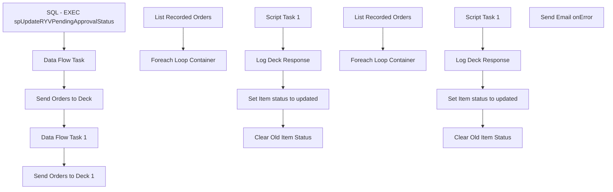

# SSIS Package: UpdateSoundOrders

**Project:** WebOrderProcessing  
**Folder:** SSIS  
**Server:** STL-SSIS-P-01  

## Connection Managers

_None detected._

## Control Flow Tasks

| Task | Type |
|---|---|
| UpdateSoundOrders | Package |
| Data Flow Task | Pipeline |
| Data Flow Task 1 | Pipeline |
| Send Orders to Deck | SEQUENCE |
| Foreach Loop Container | FOREACHLOOP |
| Clear Old Item Status | ExecuteSQLTask |
| Log Deck Response | ExecuteSQLTask |
| Script Task 1 | ScriptTask |
| Set Item status to updated | ExecuteSQLTask |
| List Recorded Orders | ExecuteSQLTask |
| Send Orders to Deck 1 | SEQUENCE |
| Foreach Loop Container | FOREACHLOOP |
| Clear Old Item Status | ExecuteSQLTask |
| Log Deck Response | ExecuteSQLTask |
| Script Task 1 | ScriptTask |
| Set Item status to updated | ExecuteSQLTask |
| List Recorded Orders | ExecuteSQLTask |
| SQL - EXEC spUpdateRYVPendingApprovalStatus | ExecuteSQLTask |
| Send Email onError | SendMailTask |

## Control Flow Outline

```text
- Send Email onError [SendMailTask]
- Data Flow Task [Pipeline]
- Data Flow Task 1 [Pipeline]
- SQL - EXEC spUpdateRYVPendingApprovalStatus [ExecuteSQLTask]
- Send Orders to Deck [SEQUENCE]
- Send Orders to Deck 1 [SEQUENCE]
  - Foreach Loop Container [FOREACHLOOP]
    - Clear Old Item Status [ExecuteSQLTask]
    - Log Deck Response [ExecuteSQLTask]
    - Script Task 1 [ScriptTask]
    - Set Item status to updated [ExecuteSQLTask]
  - List Recorded Orders [ExecuteSQLTask]
  - Foreach Loop Container [FOREACHLOOP]
    - Clear Old Item Status [ExecuteSQLTask]
    - Log Deck Response [ExecuteSQLTask]
    - Script Task 1 [ScriptTask]
    - Set Item status to updated [ExecuteSQLTask]
  - List Recorded Orders [ExecuteSQLTask]
```

## Architecture Diagram



## Variables

| Namespace | Name | Expression-bound |
|---|---|---|
| System | Propagate | No |
| User | ConnectionString | Yes |
| User | DeckMessage | No |
| User | ItemCount | No |
| User | ItemCount | No |
| User | OrderNumber | No |
| User | SourceSite | No |
| User | SourceSite | No |
| User | StatusUpdateURL | Yes |
| User | TransferOrders | No |
| User | UpdateFlag | No |
| User | Variable | No |
| User | Variable | No |
| User | WavedOrderID | No |
| User | WavedOrderID | No |
| User | WavedOrderNum | No |
| User | WavedOrderNum | No |
| User | WavedOrders | No |

### Expression-bound variable values

#### User::ConnectionString

**Expression:**

```sql
"Data Source = " +  @[$Project::ProductionServer]  + "; Initial Catalog = WebOrderProcessing;Integrated Security = SSPI;"
```

**Evaluated value:**

```sql
Data Source = stl-sql-t-02; Initial Catalog = WebOrderProcessing;Integrated Security = SSPI;
```

#### User::StatusUpdateURL

**Expression:**

```sql
@[$Project::DeckOrderManagementServiceAPIURL]
```

**Evaluated value:**

```sql
https://testwebservices.buildabear.com/BABW.Services/DeckOrderManagementServiceAPI.svc
```

## Execute SQL Tasks

### SQL - EXEC spUpdateRYVPendingApprovalStatus

**Path:** `Package\SQL - EXEC spUpdateRYVPendingApprovalStatus`  
**Connection:** {53A39879-5A29-4760-84CF-EF8A27F2A7A2}  

```sql
EXEC dbo.spUpdateRYVPendingApprovalStatus
```

### Clear Old Item Status

**Path:** `Package\Send Orders to Deck 1\Foreach Loop Container\Clear Old Item Status`  
**Connection:** {6c71ac67-bc98-46e8-9678-412afb3961fd}  

```sql

Update wm.ItemStatus set CurrentStatus = 0 where 
 orderID = ? and ? > 0 and currentStatus = 1 and status = 'RYVApproved'

```

### Log Deck Response

**Path:** `Package\Send Orders to Deck 1\Foreach Loop Container\Log Deck Response`  
**Connection:** {F1291F69-7277-411F-B6EC-AF91B8D3B89A}  

```sql
Insert into ServiceLoggingGeneralUsage 
select GetDate(),?,Case ? when 0 then 1 else  0 end,NULL,NULL,NULL,'UpdateSoundOrders|' + ?
```

### Set Item status to updated

**Path:** `Package\Send Orders to Deck 1\Foreach Loop Container\Set Item status to updated`  
**Connection:** {6c71ac67-bc98-46e8-9678-412afb3961fd}  

```sql

Insert into  wm.ItemStatus 
select I.OrderItemId, 'RYVUpdated',GetDate(),1,O.OrderID,SequenceNo,i.QTY, i.Price,i.DiscountedPrice from Wm.Orders O inner join wm.OrderItems I on o.OrderId = I.OrderId Inner join wm.ItemStatus s on O.OrderID = s.Orderid and I.OrderItemID = s.OrderItemID and Status = 'RYVApproved'  and currentStatus = 1
where  O.OrderNum = ? and ? > 0

```

### List Recorded Orders

**Path:** `Package\Send Orders to Deck 1\List Recorded Orders`  
**Connection:** {6c71ac67-bc98-46e8-9678-412afb3961fd}  

```sql
select  O.OrderNum , count(distinct(OI.OrderItemID))  as ItemCount,SourceSite ,O.OrderID from wm.Orders O
inner join wm.OrderItems OI on O.OrderID = OI.OrderID
inner join wm.ItemStatus S on OI.orderitemid = s.OrderItemID AND S.ORDERID = OI.ORDERID
where Status = 'RYVApproved' and currentStatus = 1
group by OrderNUm,SourceSite,O.OrderID
```

### Clear Old Item Status

**Path:** `Package\Send Orders to Deck\Foreach Loop Container\Clear Old Item Status`  
**Connection:** {6c71ac67-bc98-46e8-9678-412afb3961fd}  

```sql

Update wm.ItemStatus set CurrentStatus = 0 where 
 orderID = ? and ? > 0 and currentStatus = 1 and status = 'RYVTransferred'

```

### Log Deck Response

**Path:** `Package\Send Orders to Deck\Foreach Loop Container\Log Deck Response`  
**Connection:** {F1291F69-7277-411F-B6EC-AF91B8D3B89A}  

```sql
Insert into ServiceLoggingGeneralUsage 
select GetDate(),?,Case ? when 0 then 1 else  0 end,NULL,NULL,NULL,'UpdateSoundOrders|' + ?
```

### Set Item status to updated

**Path:** `Package\Send Orders to Deck\Foreach Loop Container\Set Item status to updated`  
**Connection:** {6c71ac67-bc98-46e8-9678-412afb3961fd}  

```sql

Insert into  wm.ItemStatus 
select I.OrderItemId, 'RYVPendingApproval',GetDate(),1,O.OrderID,SequenceNo,i.QTY, i.Price,i.DiscountedPrice from Wm.Orders O inner join wm.OrderItems I on o.OrderId = I.OrderId Inner join wm.ItemStatus s on O.OrderID = s.Orderid and I.OrderItemID = s.OrderItemID and Status = 'RYVTransferred'  and currentStatus = 1
where  O.OrderNum = ? and ? > 0

```

### List Recorded Orders

**Path:** `Package\Send Orders to Deck\List Recorded Orders`  
**Connection:** {6c71ac67-bc98-46e8-9678-412afb3961fd}  

```sql
select  O.OrderNum , count(distinct(OI.OrderItemID))  as ItemCount,SourceSite ,O.OrderID from wm.Orders O
inner join wm.OrderItems OI on O.OrderID = OI.OrderID
inner join wm.ItemStatus S on OI.orderitemid = s.OrderItemID AND S.ORDERID = OI.ORDERID
where Status = 'RYVTransferred' and currentStatus = 1
group by OrderNUm,SourceSite,O.OrderID
```

## Data Flow: Sources

| Component | Source Object | Type | Data Flow Task | Connection | SQL Kind |
|---|---|---|---|---|---|
| NewOrders |  | OLEDBSource | Data Flow Task | {6c71ac67-bc98-46e8-9678-412afb3961fd}:external | SqlCommand |
| Recently Completed Reecordings |  | OLEDBSource | Data Flow Task | {53A39879-5A29-4760-84CF-EF8A27F2A7A2}:external | SqlCommand |
| NewOrders |  | OLEDBSource | Data Flow Task 1 | {6c71ac67-bc98-46e8-9678-412afb3961fd}:external | SqlCommand |
| Recently Completed Reecordings |  | OLEDBSource | Data Flow Task 1 | {53A39879-5A29-4760-84CF-EF8A27F2A7A2}:external | SqlCommand |

#### NewOrders — SqlCommand

```sql
SELECT        WM.Orders.OrderNum, WM.OrderItems.RecordYourVoiceOrder, WM.OrderItems.ItemId, WM.OrderItems.OrderId, WM.OrderItems.OrderItemID, GETDATE() AS StatusDate, WM.ItemStatus.CurrentStatus, 
                         WM.ItemStatus.Status
FROM            WM.Orders INNER JOIN
                         WM.OrderItems ON WM.Orders.OrderId = WM.OrderItems.OrderId INNER JOIN
                         WM.ItemStatus ON WM.Orders.OrderId = WM.ItemStatus.OrderID
and wm.Orderitems.OrderitemID = wm.ItemStatus.OrderItemID
WHERE        (NOT (WM.OrderItems.RecordYourVoiceOrder IS NULL)) AND (WM.Orders.OrderStatus = 'New') AND (WM.ItemStatus.CurrentStatus = 1) AND (WM.ItemStatus.Status = 'ISRP')
```

#### Recently Completed Reecordings — SqlCommand

```sql
SELECT OrderNumber, OrderDate, AudioTransferDate
FROM vwRYVOrdersUpdateSoundOrders v
LEFT JOIN dbo.Statuses s ON v.StatusID = s.StatusID
WHERE (OrderDate > GETDATE() - 30) 
AND (StatusDate > GETDATE() - 1)
AND s.Keyword IN ('PENDINGAPPROVAL', 'RECORDINGAPPROVED')
```

#### NewOrders — SqlCommand

```sql
SELECT        WM.Orders.OrderNum, WM.OrderItems.RecordYourVoiceOrder, WM.OrderItems.ItemId, WM.OrderItems.OrderId, WM.OrderItems.OrderItemID, GETDATE() AS StatusDate, WM.ItemStatus.CurrentStatus, 
                         WM.ItemStatus.Status
FROM            WM.Orders INNER JOIN
                         WM.OrderItems ON WM.Orders.OrderId = WM.OrderItems.OrderId INNER JOIN
                         WM.ItemStatus ON WM.Orders.OrderId = WM.ItemStatus.OrderID
and wm.Orderitems.OrderitemID = wm.ItemStatus.OrderItemID
WHERE        (NOT (WM.OrderItems.RecordYourVoiceOrder IS NULL)) AND (WM.Orders.OrderStatus = 'New') AND (WM.ItemStatus.CurrentStatus = 1) AND (WM.ItemStatus.Status = 'RYVPendingApproval')
```

#### Recently Completed Reecordings — SqlCommand

```sql
SELECT OrderNumber, OrderDate, AudioTransferDate
FROM vwRYVOrdersUpdateSoundOrders v
LEFT JOIN dbo.Statuses s ON v.StatusID = s.StatusID
WHERE (OrderDate > GETDATE() - 30) 
AND (StatusDate > GETDATE() - 1)
AND s.Keyword IN ('RECORDINGAPPROVED')
```

## Data Flow: Destinations

_None detected._
