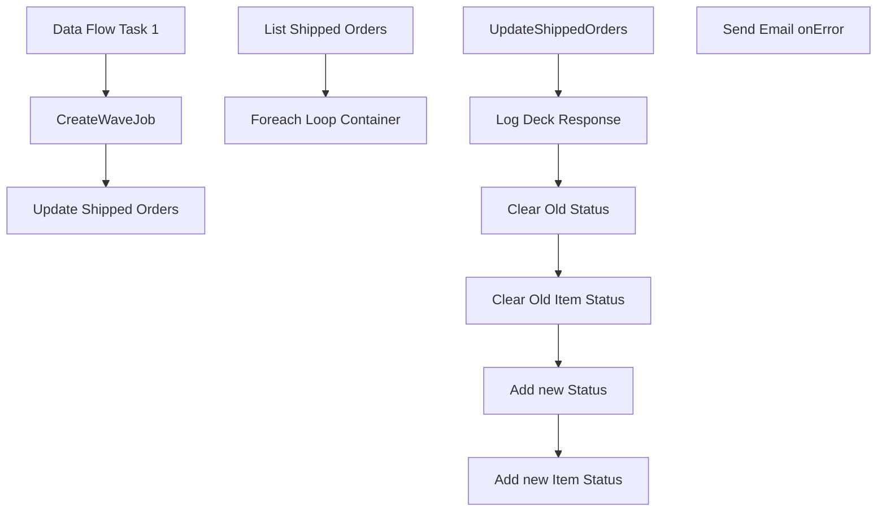

# SSIS Package: setShipped

**Project:** WebOrderProcessing  
**Folder:** SSIS  
**Server:** STL-SSIS-P-01  

## Connection Managers

| Name | Type | Server | Catalog | Connection (sanitized) |
|---|---|---|---|---|
| Azure Service Bus Connection Manager | Azure Service Bus (KingswaySoft) |  |  |  |

## Control Flow Tasks

| Task | Type |
|---|---|
| setShipped | Package |
| CreateWaveJob | Pipeline |
| Data Flow Task 1 | Pipeline |
| Update Shipped Orders | SEQUENCE |
| Foreach Loop Container | FOREACHLOOP |
| Add new Item Status | ExecuteSQLTask |
| Add new Status | ExecuteSQLTask |
| Clear Old Item Status | ExecuteSQLTask |
| Clear Old Status | ExecuteSQLTask |
| Log Deck Response | ExecuteSQLTask |
| UpdateShippedOrders | ScriptTask |
| List Shipped Orders | ExecuteSQLTask |
| Send Email onError | SendMailTask |

## Control Flow Outline

```text
- Send Email onError [SendMailTask]
- CreateWaveJob [Pipeline]
- Data Flow Task 1 [Pipeline]
- Update Shipped Orders [SEQUENCE]
  - Foreach Loop Container [FOREACHLOOP]
    - Add new Item Status [ExecuteSQLTask]
    - Add new Status [ExecuteSQLTask]
    - Clear Old Item Status [ExecuteSQLTask]
    - Clear Old Status [ExecuteSQLTask]
    - Log Deck Response [ExecuteSQLTask]
    - UpdateShippedOrders [ScriptTask]
  - List Shipped Orders [ExecuteSQLTask]
```

## Architecture Diagram



## Variables

| Namespace | Name | Expression-bound |
|---|---|---|
| System | Propagate | No |
| User | ConnectionString | Yes |
| User | DeckMessage | No |
| User | DeckResponse | No |
| User | DeckUpdateFlag | No |
| User | OrderXML | No |
| User | ShippedOrderId | No |
| User | ShippedOrderNUM | No |
| User | ShippedOrders | No |
| User | UKOrderXML | No |
| User | USShipMethod | No |
| User | UpdateStatusURL | Yes |

### Expression-bound variable values

#### User::ConnectionString

**Expression:**

```sql
"Data Source = " +  @[$Project::ProductionServer]  + "; Initial Catalog = WebOrderProcessing;Integrated Security = SSPI;"
```

**Evaluated value:**

```sql
Data Source = stl-sql-t-02; Initial Catalog = WebOrderProcessing;Integrated Security = SSPI;
```

#### User::UpdateStatusURL

**Expression:**

```sql
@[$Project::DeckOrderManagementServiceAPIURL]
```

**Evaluated value:**

```sql
https://testwebservices.buildabear.com/BABW.Services/DeckOrderManagementServiceAPI.svc
```

## Execute SQL Tasks

### Add new Item Status

**Path:** `Package\Update Shipped Orders\Foreach Loop Container\Add new Item Status`  
**Connection:** {6c71ac67-bc98-46e8-9678-412afb3961fd}  

```sql

Insert into  wm.ItemStatus 
select I.OrderItemId, 'Shipped',GetDate(),1,O.OrderID,SequenceNo,QTY,Price,DiscountedPrice from Wm.Orders O inner join wm.OrderItems I on o.OrderId = I.OrderId
where  O.OrderNum = ? and ? > 0

```

### Add new Status

**Path:** `Package\Update Shipped Orders\Foreach Loop Container\Add new Status`  
**Connection:** {6c71ac67-bc98-46e8-9678-412afb3961fd}  

```sql

Insert into  wm.OrderStatus 
select O.OrderId, 'Shipped',GetDate(),1 from Wm.Orders O
where  O.OrderNum = ?
and ? > 0

```

### Clear Old Item Status

**Path:** `Package\Update Shipped Orders\Foreach Loop Container\Clear Old Item Status`  
**Connection:** {6c71ac67-bc98-46e8-9678-412afb3961fd}  

```sql

Update wm.ItemStatus set CurrentStatus = 0 where orderID = ? and ? > 0  and currentStatus = 1

```

### Clear Old Status

**Path:** `Package\Update Shipped Orders\Foreach Loop Container\Clear Old Status`  
**Connection:** {6c71ac67-bc98-46e8-9678-412afb3961fd}  

```sql

Update wm.OrderStatus set CurrentStatus = 0 where orderID = ? and ? > 0
and currentStatus = 1

```

### Log Deck Response

**Path:** `Package\Update Shipped Orders\Foreach Loop Container\Log Deck Response`  
**Connection:** {F1291F69-7277-411F-B6EC-AF91B8D3B89A}  

```sql
Insert into ServiceLoggingGeneralUsage 
select GetDate(),?,Case ? when 0 then 1 else  0 end,NULL,NULL,NULL,'UpdateShippedOrders|' + ?
```

### List Shipped Orders

**Path:** `Package\Update Shipped Orders\List Shipped Orders`  
**Connection:** {6c71ac67-bc98-46e8-9678-412afb3961fd}  

```sql
  select  OrderNum,count(ItemId) as ItemCount,ShippingMethod,'xxxxxxxxxxxxxxxxxxxxxxxxxxxxxxxxxxxxxxxxxxxxxxxxxxxxxxxxxxxxxxxxxxxxxxxxxxxxxxxxxxxxxxxxxxxxxxxxxxxxxxxxxxxxxxxxxxxxxxxxxxxxxxxxxxxxxxxxxxxxxxxxxxxxxxxxxxxxxxxxxxxxxxxxxxxxxxxxxxxxxxxxxxxxxxxxxxxxxxxxxxxxxxxxxxxxxxxxxxxxxxxxxxxxxxxxxxxxxxxxxxxxxxxxxxxxxxxxxxxxxxxxxxxxxxxxxxxxxxxxxxxxxxxxxxxxxxxxxxxxxxxxxxxxxxxxxxxxxxxxxxxxxxxxxxxxxxxxxxxxxxxxxxxxxxxxxxxxxxxxxxxxxxxxxxxxxxxxxxxxxxxxxxxxxxxxxxxxxxxxxxxxxxxxxxxxxxxxxxxxxxxxxxxxxxxxxxxxxxxxxxxxxxxxxxxxxxxxxxxxxxxxxxxxxxxxxxxxxxxxxxxxxxxxxxxxxxxxxxxxxxxxxxxxxxxxxxxxxxxxxxxxxxxxxxxxxxxxxxxxxxxxxxxxxxxxxxxxxxxxxxxxxxxxxxxxxxxxxxxxxxxxxxxxxxxxxxxxxxxxxxxxxxxxxxxxxxxxxxxxxxxx' as DeckResponse,O.orderID
 from wm.Orders O 
inner join wm.OrderItems I on O.orderId = I.OrderId
inner join wm.OrderStatus S on O.OrderID = s.OrderID and currentStatus = 1
where OrderStatus = 'Shipped' and status <> 'Shipped' and sourceSite = 'BABW-US' 
group by OrderNum,ShippingMethod,O.OrderID

```

## Data Flow: Sources

| Component | Source Object | Type | Data Flow Task | Connection | SQL Kind |
|---|---|---|---|---|---|
| OLE DB Source |  | OLEDBSource | CreateWaveJob | {6c71ac67-bc98-46e8-9678-412afb3961fd}:external | SqlCommand |
| Recently waved cartons |  | OLEDBSource | CreateWaveJob | {744FE313-1064-4E79-9385-E22229882EC8}:external | SqlCommand |

#### OLE DB Source — SqlCommand

```sql
SELECT        WM.Orders.OrderNum, WM.OrderItems.OrderItemID
FROM            WM.Orders INNER JOIN
                         WM.OrderItems ON WM.Orders.OrderId = WM.OrderItems.OrderId
where orderStatus = 'Waved' and trackingNumber is null
```

#### Recently waved cartons — SqlCommand

```sql
SELECT [ContainerId] AS CARTON_NBR
      ,[DeckSalesOrderReferenceNumber] AS PKT_CTRL_NBR
	  ,[WaveId] AS SHIP_WAVE_NBR
	  ,[ItemId] AS STYLE
	  ,[MasterTrackingNumber] AS TRKG_NBR
	  ,[ModeOfDelivery] AS SHIP_VIA
  FROM [IntegrationStaging].[WMS].[SalesOrderStatusUpdateShipped]
  WHERE [ShipConfirmDateTime] >= DATEADD(dd, - 2, GETDATE())
```

## Data Flow: Destinations

| Component | Target Table | Type | Data Flow Task | Connection | SQL Kind |
|---|---|---|---|---|---|
| OLE DB Destination |  | OLEDBDestination | Data Flow Task 1 | {744FE313-1064-4E79-9385-E22229882EC8}:external |  |
