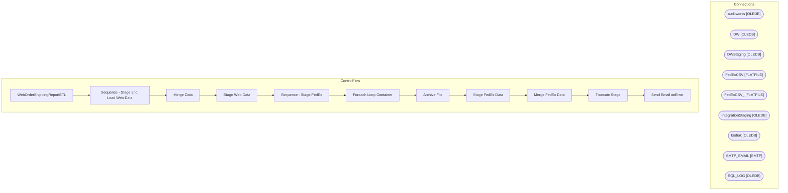

# SSIS Package: WebOrderShippingReportETL

**Project:** WebOrderShippingReportETL  
**Folder:** SSIS  
**Server:** STL-SSIS-P-01  

## Architecture Diagram

## Connection Managers

| Name | Type |
|---|---|
| auditworks | OLEDB |
| DW | OLEDB |
| DWStaging | OLEDB |
| FedExCSV | FLATFILE |
| FedExCSV_ | FLATFILE |
| IntegrationStaging | OLEDB |
| kodiak | OLEDB |
| SMTP_EMAIL | SMTP |
| SQL_LOG | OLEDB |

## Control Flow Tasks

| Task | Type |
|---|---|
| WebOrderShippingReportETL | Microsoft.Package |
| Sequence - Stage and Load Web Data | STOCK:SEQUENCE |
| Merge Data | Microsoft.ExecuteSQLTask |
| Stage Web Data | Microsoft.Pipeline |
| Sequence - Stage FedEx | STOCK:SEQUENCE |
| Foreach Loop Container | STOCK:FOREACHLOOP |
| Archive File | Microsoft.FileSystemTask |
| Stage FedEx Data | Microsoft.Pipeline |
| Merge FedEx Data | Microsoft.ExecuteSQLTask |
| Truncate Stage | Microsoft.ExecuteSQLTask |
| Send Email onError | Microsoft.SendMailTask |

## Data Flow: Sources

| Component | SQL Preview |
|---|---|
|  | select distinct  	cast(ProductionOrderDateTimeCreated as date) CreateDate, 	ProductionOrderNumber OrderNumber, 	ProductionOrderShippingStateProvince as ShipToState, 	ProductionOrderShippingCountry as ShipToCountry, 	max(ProductionOrderTrackingNumber) as TrackingNumber, 	ProductionOrderShippingAndHandling as Shipping, cast(ProductionOrderSiteCode as varchar(10)) as SiteCode, cast(ProductionOrderDat |
|  | select * from [dbo].[WebOrderFedExData] |
|  | select 	cast(cast(th.transaction_id as nvarchar) COLLATE Latin1_General_CI_AS as int) as transaction_id, 	--cast(ltrim(rtrim(right(line_note,len(line_note)-charindex(':',line_note)))) as varchar) COLLATE Latin1_General_CI_AS as OrderNumber	 	cast(left(substring(line_note, (11+ charindex('Web Order: ', line_note, 1)), 30),8) as varchar) COLLATE Latin1_General_CI_AS as OrderNumber	 from transaction_ |
|  | select distinct  	cast(ProductionOrderDateTimeCreated as date) CreateDate, 	ProductionOrderNumber OrderNumber, 	left(ProductionOrderNumber,8) as LookUpNumber, 	ProductionOrderShippingStateProvince as ShipToState, 	ProductionOrderShippingCountry as ShipToCountry, 	ProductionOrderTrackingNumber as TrackingNumber, 	ProductionOrderShippingAndHandling as Shipping, 	cast(ProductionOrderSiteCode as varch |

## Data Flow: Destinations

| Component | Destination |
|---|---|
|  | [WebShippingFactsStage] |
|  | [dbo].[rtpWebOrderDataFedExStage] |

