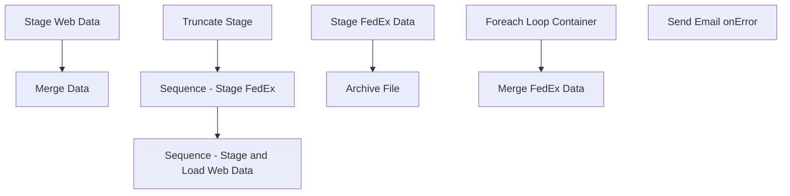

# SSIS Package: WebOrderShippingReportETL

**Project:** WebOrderShippingReportETL  
**Folder:** SSIS  
**Server:** STL-SSIS-P-01  

## Connection Managers

| Name | Type | Server | Catalog | Connection (sanitized) |
|---|---|---|---|---|
| DW | OLEDB | papamart | dw | Data Source=papamart; Initial Catalog=dw; Provider=SQLNCLI11.1; Integrated Security=SSPI; Auto Translate=False |
| DWStaging | OLEDB | papamart | DWStaging | Data Source=papamart; Initial Catalog=DWStaging; Provider=SQLNCLI11.1; Integrated Security=SSPI; Auto Translate=False |
| FedExCSV | FLATFILE |  |  |  |
| FedExCSV_ | FLATFILE |  |  |  |
| IntegrationStaging | OLEDB | STL-SSIS-P-01 | IntegrationStaging | Data Source=STL-SSIS-P-01; Initial Catalog=IntegrationStaging; Provider=SQLNCLI11.1; Integrated Security=SSPI; Auto Translate=False |
| SMTP_EMAIL | SMTP |  |  |  |
| SQL_LOG | OLEDB | stl-ssis-p-01 | msdb | Data Source=stl-ssis-p-01; Initial Catalog=msdb; Provider=SQLNCLI11.1; Integrated Security=SSPI; Auto Translate=False |
| auditworks | OLEDB | bedrockdb01 | auditworks | Data Source=bedrockdb01; Initial Catalog=auditworks; Provider=SQLNCLI11.1; Integrated Security=SSPI; Auto Translate=False |
| kodiak | OLEDB | kodiak | BABWPMS | Data Source=kodiak; Initial Catalog=BABWPMS; Provider=SQLNCLI11.1; Integrated Security=SSPI; Auto Translate=False |

## Control Flow Tasks

| Task | Type |
|---|---|
| WebOrderShippingReportETL | Package |
| Sequence - Stage and Load Web Data | SEQUENCE |
| Merge Data | ExecuteSQLTask |
| Stage Web Data | Pipeline |
| Sequence - Stage FedEx | SEQUENCE |
| Foreach Loop Container | FOREACHLOOP |
| Archive File | FileSystemTask |
| Stage FedEx Data | Pipeline |
| Merge FedEx Data | ExecuteSQLTask |
| Truncate Stage | ExecuteSQLTask |
| Send Email onError | SendMailTask |

## Control Flow Outline

```text
- Send Email onError [SendMailTask]
- Sequence - Stage FedEx [SEQUENCE]
  - Foreach Loop Container [FOREACHLOOP]
    - Archive File [FileSystemTask]
    - Stage FedEx Data [Pipeline]
  - Merge FedEx Data [ExecuteSQLTask]
- Sequence - Stage and Load Web Data [SEQUENCE]
  - Merge Data [ExecuteSQLTask]
  - Stage Web Data [Pipeline]
- Truncate Stage [ExecuteSQLTask]
```

## Architecture Diagram



## Variables

| Namespace | Name | Expression-bound |
|---|---|---|
| System | Propagate | No |
| User | FedExFile | No |
| User | FedExFileRename | Yes |
| User | KodiakQuery | Yes |

### Expression-bound variable values

#### User::FedExFileRename

**Expression:**

```sql
"\\\\stl-ssis-p-01\\IntegrationStaging\\WEB\\FedEx\\History\\FedEx" +  REPLACE((DT_WSTR, 10)(DT_DBDATE)GETDATE(),"-","") + ".csv"
```

**Evaluated value:**

```sql
\\stl-ssis-p-01\IntegrationStaging\WEB\FedEx\History\FedEx20180917.csv
```

#### User::KodiakQuery

**Expression:**

```sql
"select distinct 
	cast(ProductionOrderDateTimeCreated as date) CreateDate,
	ProductionOrderNumber OrderNumber,
	left(ProductionOrderNumber,8) as LookupNumber, ProductionOrderShippingStateProvince as ShipToState,
	ProductionOrderShippingCountry as ShipToCountry,
	max(ProductionOrderTrackingNumber) as TrackingNumber,
	ProductionOrderShippingAndHandling as Shipping,
cast(ProductionOrderSiteCode as varchar(10)) as SiteCode,
min(cast(ProductionOrderDateTimeShipped as date)) as StatusDate
from archive_productionorder with (nolock)
where left(ProductionOrderNumber,1) <> 'C'
  and cast(ProductionOrderDateTimeCreated as date) >= cast(getdate()-" + (DT_STR, 4, 1252) @[$Package::DaysToCapture]  + " as date)
group by cast(ProductionOrderDateTimeCreated as date),
	ProductionOrderNumber,
	ProductionOrderShippingStateProvince,
	ProductionOrderShippingCountry,
	ProductionOrderShippingAndHandling,
	cast(ProductionOrderSiteCode as varchar(10))"
```

**Evaluated value:**

```sql
select distinct 
	cast(ProductionOrderDateTimeCreated as date) CreateDate,
	ProductionOrderNumber OrderNumber,
	left(ProductionOrderNumber,8) as LookupNumber, ProductionOrderShippingStateProvince as ShipToState,
	ProductionOrderShippingCountry as ShipToCountry,
	max(ProductionOrderTrackingNumber) as TrackingNumber,
	ProductionOrderShippingAndHandling as Shipping,
cast(ProductionOrderSiteCode as varchar(10)) as SiteCode,
min(cast(ProductionOrderDateTimeShipped as date)) as StatusDate
from archive_productionorder with (nolock)
where left(ProductionOrderNumber,1) <> 'C'
  and cast(ProductionOrderDateTimeCreated as date) >= cast(getdate()-700 as date)
group by cast(ProductionOrderDateTimeCreated as date),
	ProductionOrderNumber,
	ProductionOrderShippingStateProvince,
	ProductionOrderShippingCountry,
	ProductionOrderShippingAndHandling,
	cast(ProductionOrderSiteCode as varchar(10))
```

## Execute SQL Tasks

### Merge FedEx Data

**Path:** `Package\Sequence - Stage FedEx\Merge FedEx Data`  
**Connection:** DWStaging (papamart/DWStaging)  

```sql
exec spMergeWebOrderFedExData
```

### Merge Data

**Path:** `Package\Sequence - Stage and Load Web Data\Merge Data`  
**Connection:** DWStaging (papamart/DWStaging)  

```sql
exec spMergeWebShippingFacts
```

### Truncate Stage

**Path:** `Package\Truncate Stage`  
**Connection:** DWStaging (papamart/DWStaging)  

```sql
TRUNCATE TABLE rtpWebOrderDataFedExStage
TRUNCATE TABLE WebShippingFactsStage
```

## Data Flow: Sources

| Component | Source Object | Type | Data Flow Task | Connection | SQL Kind |
|---|---|---|---|---|---|
| archive_productionorder |  | OLEDBSource | Stage Web Data | kodiak | SqlCommand |
| WebProductionOrderSummary |  | OLEDBSource | Stage Web Data | DW | SqlCommand |
| FedEx CSV |  | FlatFileSource | Stage FedEx Data | FedExCSV_ |  |

#### archive_productionorder — SqlCommand

```sql
select distinct 
	cast(ProductionOrderDateTimeCreated as date) CreateDate,
	ProductionOrderNumber OrderNumber,
	ProductionOrderShippingStateProvince as ShipToState,
	ProductionOrderShippingCountry as ShipToCountry,
	max(ProductionOrderTrackingNumber) as TrackingNumber,
	ProductionOrderShippingAndHandling as Shipping,
cast(ProductionOrderSiteCode as varchar(10)) as SiteCode,
cast(ProductionOrderDateTimeShipped as date) as StatusDate
from archive_productionorder with (nolock)
where left(ProductionOrderNumber,1) <> 'C'
and cast(ProductionOrderDateTimeCreated as date) >= cast(getdate()-730 as date)
group by cast(ProductionOrderDateTimeCreated as date),
	ProductionOrderNumber,
	ProductionOrderShippingStateProvince,
	ProductionOrderShippingCountry,
	ProductionOrderShippingAndHandling,
	cast(ProductionOrderSiteCode as varchar(10)),
	cast(ProductionOrderDateTimeShipped as date)
```

#### WebProductionOrderSummary — SqlCommand

```sql
select distinct 
	cast(ProductionOrderDateTimeCreated as date) CreateDate,
	ProductionOrderNumber OrderNumber,
	left(ProductionOrderNumber,8) as LookUpNumber,
	ProductionOrderShippingStateProvince as ShipToState,
	ProductionOrderShippingCountry as ShipToCountry,
	ProductionOrderTrackingNumber as TrackingNumber,
	ProductionOrderShippingAndHandling as Shipping,
	cast(ProductionOrderSiteCode as varchar(10)) as SiteCode,
	cast(StatusDate as date) as StatusDate
from WebProductionOrderSummary with (nolock)
where left(ProductionOrderNumber,1) <> 'C'
--and substring(ProductionOrderNumber, 9,1) = '_'
and ProductionOrderWebOrderStatus = 'Shipped'
and cast(ProductionOrderDateTimeCreated as date) >= cast(getdate()-? as date)
```

## Data Flow: Destinations

| Component | Target Table | Type | Data Flow Task | Connection | SQL Kind |
|---|---|---|---|---|---|
| WebShippingFactsStage |  | OLEDBDestination | Stage Web Data | DWStaging |  |
| rtpWebOrderDataFedExStage |  | OLEDBDestination | Stage FedEx Data | DWStaging |  |
