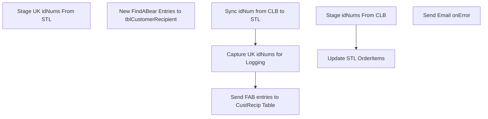

# SSIS Package: ExtractFindABearOrders

**Project:** WebOrders  
**Folder:** SSIS  
**Server:** STL-SSIS-P-01  

## Connection Managers

| Name | Type | Server | Catalog | Connection (sanitized) |
|---|---|---|---|---|
| BEARCLUSTER01.SQL.Buildabear.com.WebOrderProcessing | OLEDB | BEARCLUSTER01.SQL.Buildabear.com | WebOrderProcessing | Data Source=BEARCLUSTER01.SQL.Buildabear.com; Initial Catalog=WebOrderProcessing; Provider=SQLNCLI11.1; Integrated Security=SSPI; Auto Translate=False |
| CLB-SQL-P-01.BABWOrderManagement | OLEDB | CLB-SQL-P-01 | BABWOrderManagement | Data Source=CLB-SQL-P-01; Initial Catalog=BABWOrderManagement; Provider=SQLNCLI11.1; Integrated Security=SSPI; Auto Translate=False |
| KODIAK.babw | OLEDB | KODIAK | babw | Data Source=KODIAK; Initial Catalog=babw; Provider=SQLNCLI11.1; Integrated Security=SSPI; Auto Translate=False |
| KODIAKTEST.babw | OLEDB | KODIAKTEST | babw | Data Source=KODIAKTEST; Initial Catalog=babw; Provider=SQLNCLI11.1; Integrated Security=SSPI; Auto Translate=False |
| SMTP_EMAIL | SMTP |  |  |  |
| SQL_LOG | OLEDB | stl-ssis-p-01 | msdb | Data Source=stl-ssis-p-01; Initial Catalog=msdb; Provider=SQLNCLI11.1; Integrated Security=SSPI; Auto Translate=False |
| STL-SQL-T-02.WebOrderProcessing | OLEDB | STL-SQL-T-02 | WebOrderProcessing | Data Source=STL-SQL-T-02; Initial Catalog=WebOrderProcessing; Provider=SQLNCLI11.1; Integrated Security=SSPI; Auto Translate=False |
| STL-SSIS-P-01 | ADO.NET:SQL | STL-SSIS-P-01 |  | Data Source=STL-SSIS-P-01; Integrated Security=SSPI; Connect Timeout=30 |
| STL-SSIS-P-01.IntegrationStaging | OLEDB | STL-SSIS-P-01 | IntegrationStaging | Data Source=STL-SSIS-P-01; Initial Catalog=IntegrationStaging; Provider=SQLNCLI11.1; Integrated Security=SSPI; Auto Translate=False |

## Control Flow Tasks

| Task | Type |
|---|---|
| ExtractFindABearOrders | Package |
| Capture UK idNums for Logging | SEQUENCE |
| Stage UK idNums From STL | Pipeline |
| Send FAB entries to CustRecip Table | SEQUENCE |
| New FindABear Entries to tblCustomerRecipient | Pipeline |
| Sync idNum from CLB to STL | SEQUENCE |
| Stage idNums From CLB | Pipeline |
| Update STL OrderItems | ExecuteSQLTask |
| Send Email onError | SendMailTask |

## Control Flow Outline

```text
- Send Email onError [SendMailTask]
- Capture UK idNums for Logging [SEQUENCE]
  - Stage UK idNums From STL [Pipeline]
- Send FAB entries to CustRecip Table [SEQUENCE]
  - New FindABear Entries to tblCustomerRecipient [Pipeline]
- Sync idNum from CLB to STL [SEQUENCE]
  - Stage idNums From CLB [Pipeline]
  - Update STL OrderItems [ExecuteSQLTask]
```

## Architecture Diagram



## Variables

| Namespace | Name | Expression-bound |
|---|---|---|
| System | Propagate | No |
| User | NewFABEntries | No |

## Execute SQL Tasks

### Update STL OrderItems

**Path:** `Package\Sync idNum from CLB to STL\Update STL OrderItems`  
**Connection:** BEARCLUSTER01.SQL.Buildabear.com.WebOrderProcessing (BEARCLUSTER01.SQL.Buildabear.com/WebOrderProcessing)  

```sql
UPDATE oi
SET oi.idNum = log.idNum
from OrderItemFABIds log
LEFT JOIN WM.OrderItems oi with (NOLOCK)
	ON log.OrderItemID = oi.OrderItemID 
    AND CAST(GETDATE() as Date) = CAST(log.PullDate as Date)
WHERE oi.idNum IS NULL
```

## Data Flow: Sources

| Component | Source Object | Type | Data Flow Task | Connection | SQL Kind |
|---|---|---|---|---|---|
| STL UK OrderItems |  | OLEDBSource | Stage UK idNums From STL | BEARCLUSTER01.SQL.Buildabear.com.WebOrderProcessing | SqlCommand |
| STL WebOrderProcessing |  | OLEDBSource | New FindABear Entries to tblCustomerRecipient | BEARCLUSTER01.SQL.Buildabear.com.WebOrderProcessing | SqlCommand |
| CLB OrderItems |  | OLEDBSource | Stage idNums From CLB | CLB-SQL-P-01.BABWOrderManagement | SqlCommand |

#### STL UK OrderItems — SqlCommand

```sql
SELECT  OrderItemID,
                idNum,
                GETDATE() as PullDate
FROM WM.OrderItems WITH (NOLOCK)
WHERE idNum IS NOT NULL
AND ParentItem IS NULL
AND idNUM LIKE 'K%'
AND idNUM NOT LIKE '00000%'
```

#### STL WebOrderProcessing — SqlCommand

```sql
SELECT 
        DISTINCT(oi.OrderItemID),
		CAST(GETDATE() as datetime) as Pull_DateStamp,
		CASE
			WHEN (o.SourceSite = 'BABW-UK') THEN 2013
			ELSE 13
		END	as Pull_StoreID,
		CAST(o.BillToFName as nvarchar(50)) as sSFirstName,
		CAST(o.BillToLName as nvarchar(50)) as sSLastName,
		CAST(o.BillToAddress1 as nvarchar(50)) as sSAddress1,
		CAST(o.BillToAddress2 as nvarchar(50)) as sSAddress2,
		CAST(o.BillToCity as nvarchar(50)) as sSCity,
        CAST(o.BillToState as nvarchar(50)) as sSState,
		CAST(o.BillToPostalCode as nvarchar(30)) as sSPostCode,
		CAST(o.BillToCountry as nvarchar(50)) as sSCountry,
		CAST(o.BillToEmail as nvarchar(50)) as sSEmail,
		CAST(oi.idNum as nvarchar(25)) as sRBarCodeNumber,
		CAST(oi.sku as nvarchar(20)) as sRAnimalID,
		CAST(oi.ItemDescription as nvarchar(50)) as sRAnimalName,
		CONVERT(nvarchar(10),o.DatePrinted,110) as sRAnimalBirthDate,
		CAST(oi.Height as nvarchar(5)) as sRAnimalHeight, 
		CAST(oi.Weight as nvarchar(5)) as sRAnimalWeight, 
		CAST(oi.EyeColor as nvarchar(50)) as sRAnimalEyeColor,
		CAST(oi.FurColor as nvarchar(50)) as sRAnimalFurColor,
		CAST(o.ShipToFName as nvarchar(50)) as sRFirstName,
		CAST(o.ShipToLName as nvarchar(50)) as sRLastName,
		CAST(o.ShipToAddress1 as nvarchar(50)) as sRAddress1,
		CAST(o.ShipToAddress2 as nvarchar(50)) as sRAddress2,
		CAST(o.ShipToCity as nvarchar(50)) as sRCity,
		CAST(o.ShipToPostalCode as nvarchar(30)) as sRPostCode,
		CAST(o.ShipToState as nvarchar(50)) as sRState,
		CAST(o.ShipToCountry as nvarchar(50)) as sRCountry,
		CAST(o.ShipToEmail as nvarchar(50)) as sREMail,
		CAST(oi.idNum as nvarchar(25)) as EarTagID,
                                      1 as ISRecordStatus,
                                      1 as IRRecordStatus
	FROM WM.OrderItems oi
	LEFT JOIN WM.Orders o
		ON oi.OrderId = o.OrderId
	LEFT JOIN dbo.OrderItemFABIds fabids
		ON oi.OrderItemID = fabids.OrderItemID
	WHERE oi.ParentItem IS NULL
        AND oi.idNum IS NOT NULL
		AND CAST(fabids.PullDate as date) = CAST(GETDATE() as date)
```

#### CLB OrderItems — SqlCommand

```sql
SELECT  OrderItemID,
                idNum,
                GETDATE() as PullDate
FROM WM.OrderItems WITH (NOLOCK)
WHERE idNum IS NOT NULL
AND ParentItem IS NULL
AND idNUM NOT LIKE 'K%'
AND idNUM NOT LIKE '00000%'
AND LEN(idNUM) >= 17
```

## Data Flow: Destinations

| Component | Target Table | Type | Data Flow Task | Connection | SQL Kind |
|---|---|---|---|---|---|
| OrderItemFABIds |  | OLEDBDestination | Stage UK idNums From STL | BEARCLUSTER01.SQL.Buildabear.com.WebOrderProcessing |  |
| tblCustomerRecipient |  | OLEDBDestination | New FindABear Entries to tblCustomerRecipient | KODIAK.babw |  |
| OrderItemFABIds |  | OLEDBDestination | Stage idNums From CLB | BEARCLUSTER01.SQL.Buildabear.com.WebOrderProcessing |  |
