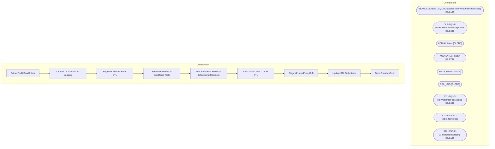

# SSIS Package: ExtractFindABearOrders

**Project:** WebOrders  
**Folder:** SSIS  
**Server:** STL-SSIS-P-01  

## Architecture Diagram

## Connection Managers

| Name | Type |
|---|---|
| BEARCLUSTER01.SQL.Buildabear.com.WebOrderProcessing | OLEDB |
| CLB-SQL-P-01.BABWOrderManagement | OLEDB |
| KODIAK.babw | OLEDB |
| KODIAKTEST.babw | OLEDB |
| SMTP_EMAIL | SMTP |
| SQL_LOG | OLEDB |
| STL-SQL-T-02.WebOrderProcessing | OLEDB |
| STL-SSIS-P-01 | ADO.NET:SQL |
| STL-SSIS-P-01.IntegrationStaging | OLEDB |

## Control Flow Tasks

| Task | Type |
|---|---|
| ExtractFindABearOrders | Microsoft.Package |
| Capture UK idNums for Logging | STOCK:SEQUENCE |
| Stage UK idNums From STL | Microsoft.Pipeline |
| Send FAB entries to CustRecip Table | STOCK:SEQUENCE |
| New FindABear Entries to tblCustomerRecipient | Microsoft.Pipeline |
| Sync idNum from CLB to STL | STOCK:SEQUENCE |
| Stage idNums From CLB | Microsoft.Pipeline |
| Update STL OrderItems | Microsoft.ExecuteSQLTask |
| Send Email onError | Microsoft.SendMailTask |

## Data Flow: Sources

| Component | SQL Preview |
|---|---|
|  | select * from [dbo].[OrderItemFABIds] |
|  | SELECT  OrderItemID,                 idNum,                 GETDATE() as PullDate FROM WM.OrderItems WITH (NOLOCK) WHERE idNum IS NOT NULL AND ParentItem IS NULL AND idNUM LIKE 'K%' AND idNUM NOT LIKE '00000%' |
|  | SELECT          DISTINCT(oi.OrderItemID), 		CAST(GETDATE() as datetime) as Pull_DateStamp, 		CASE 			WHEN (o.SourceSite = 'BABW-UK') THEN 2013 			ELSE 13 		END	as Pull_StoreID, 		CAST(o.BillToFName as nvarchar(50)) as sSFirstName, 		CAST(o.BillToLName as nvarchar(50)) as sSLastName, 		CAST(o.BillToAddress1 as nvarchar(50)) as sSAddress1, 		CAST(o.BillToAddress2 as nvarchar(50)) as sSAddress2, 		CA |
|  | SELECT  OrderItemID,                 idNum,                 GETDATE() as PullDate FROM WM.OrderItems WITH (NOLOCK) WHERE idNum IS NOT NULL AND ParentItem IS NULL AND idNUM NOT LIKE 'K%' AND idNUM NOT LIKE '00000%' AND LEN(idNUM) >= 17 |
|  | select * from [dbo].[OrderItemFABIds] |

## Data Flow: Destinations

| Component | Destination |
|---|---|
|  | [OrderItemFABIds] |
|  | [WM].[OrderItems] |
|  | [dbo].[tblCustomerRecipient] |
|  | [WM].[OrderItems] |
|  | [OrderItemFABIds] |

