# SSIS Package: WebOrdersDataWarehouse

**Project:** WebOrdersDataWarehouse  
**Folder:** SSIS  
**Server:** STL-SSIS-P-01  

## Connection Managers

| Name | Type | Server | Catalog | Connection (sanitized) |
|---|---|---|---|---|
| BearClusterO1 | OLEDB | bearcluster01.sql.buildabear.com | WebOrderProcessing | Data Source=bearcluster01.sql.buildabear.com; Initial Catalog=WebOrderProcessing; Provider=SQLNCLI11.1; Integrated Security=SSPI; Auto Translate=False |
| DW | OLEDB | papamart | dw | Data Source=papamart; Initial Catalog=dw; Provider=SQLNCLI11.1; Integrated Security=SSPI; Auto Translate=False |
| DWStaging | OLEDB | papamart | DWStaging | Data Source=papamart; Initial Catalog=DWStaging; Provider=SQLNCLI11.1; Integrated Security=SSPI; Auto Translate=False |
| FedExCSV_ | FLATFILE |  |  |  |
| IntegrationStaging | OLEDB | STL-SSIS-P-01 | IntegrationStaging | Data Source=STL-SSIS-P-01; Initial Catalog=IntegrationStaging; Provider=SQLNCLI11.1; Integrated Security=SSPI; Auto Translate=False |
| Papamart.MSDB | OLEDB | papamart | msdb | Data Source=papamart; Initial Catalog=msdb; Provider=SQLNCLI11.1; Integrated Security=SSPI; Auto Translate=False |
| SMTP_EMAIL | SMTP |  |  |  |
| SQL_LOG | OLEDB | stl-ssis-p-01 | msdb | Data Source=stl-ssis-p-01; Initial Catalog=msdb; Provider=SQLNCLI11.1; Integrated Security=SSPI; Auto Translate=False |
| auditworks | OLEDB | bedrockdb01 | auditworks | Data Source=bedrockdb01; Initial Catalog=auditworks; Provider=SQLNCLI11.1; Integrated Security=SSPI; Auto Translate=False |
| kodiak | OLEDB | kodiak | BABWPMS | Data Source=kodiak; Initial Catalog=BABWPMS; Provider=SQLNCLI11.1; Integrated Security=SSPI; Auto Translate=False |

## Control Flow Tasks

| Task | Type |
|---|---|
| WebOrdersDataWarehouse | Package |
| Sequence Container | SEQUENCE |
| Merge Orders Sequence | SEQUENCE |
| Merge ItemDiscounts | ExecuteSQLTask |
| Merge OrderItems | ExecuteSQLTask |
| Merge Orders | ExecuteSQLTask |
| Merge ShippingDiscounts | ExecuteSQLTask |
| Merge Transactions | ExecuteSQLTask |
| Shipping Facts ETL | SEQUENCE |
| Sequence - Stage and Load Web Data | SEQUENCE |
| Merge Data | ExecuteSQLTask |
| Stage Web Data | Pipeline |
| Sequence - Stage FedEx | SEQUENCE |
| Foreach Loop Container | FOREACHLOOP |
| Archive File | FileSystemTask |
| Stage FedEx Data | Pipeline |
| Merge FedEx Data | ExecuteSQLTask |
| Truncate Stage | ExecuteSQLTask |
| Stage Sequence | SEQUENCE |
| Stage Discounts | Pipeline |
| Stage Order Items | Pipeline |
| Stage Orders | Pipeline |
| Stage Shipping Discounts | Pipeline |
| Stage Transactions | Pipeline |
| Truncate Stage | ExecuteSQLTask |
| Web Order Summary Sequence | SEQUENCE |
| Merge ProductionOrderSummary | ExecuteSQLTask |
| Stage ProductionOrderSummary | Pipeline |
| Send Email onError | SendMailTask |

## Control Flow Outline

```text
- Send Email onError [SendMailTask]
- Sequence Container [SEQUENCE]
  - Merge Orders Sequence [SEQUENCE]
    - Merge ItemDiscounts [ExecuteSQLTask]
    - Merge OrderItems [ExecuteSQLTask]
    - Merge Orders [ExecuteSQLTask]
    - Merge ShippingDiscounts [ExecuteSQLTask]
    - Merge Transactions [ExecuteSQLTask]
  - Shipping Facts ETL [SEQUENCE]
    - Sequence - Stage FedEx [SEQUENCE]
      - Foreach Loop Container [FOREACHLOOP]
        - Archive File [FileSystemTask]
        - Stage FedEx Data [Pipeline]
      - Merge FedEx Data [ExecuteSQLTask]
    - Sequence - Stage and Load Web Data [SEQUENCE]
      - Merge Data [ExecuteSQLTask]
      - Stage Web Data [Pipeline]
    - Truncate Stage [ExecuteSQLTask]
  - Stage Sequence [SEQUENCE]
    - Stage Discounts [Pipeline]
    - Stage Order Items [Pipeline]
    - Stage Orders [Pipeline]
    - Stage Shipping Discounts [Pipeline]
    - Stage Transactions [Pipeline]
  - Truncate Stage [ExecuteSQLTask]
  - Web Order Summary Sequence [SEQUENCE]
    - Merge ProductionOrderSummary [ExecuteSQLTask]
    - Stage ProductionOrderSummary [Pipeline]
```

## Architecture Diagram

```mermaid
flowchart TD
    n_Package_Sequence_Container["Sequence Container"]
    n_Package_Sequence_Container_Merge_Orders_Sequence["Merge Orders Sequence"]
    n_Package_Sequence_Container_Merge_Orders_Sequence_Merge_ItemDiscounts["Merge ItemDiscounts"]
    n_Package_Sequence_Container_Merge_Orders_Sequence_Merge_OrderItems["Merge OrderItems"]
    n_Package_Sequence_Container_Merge_Orders_Sequence_Merge_Orders["Merge Orders"]
    n_Package_Sequence_Container_Merge_Orders_Sequence_Merge_ShippingDiscounts["Merge ShippingDiscounts"]
    n_Package_Sequence_Container_Merge_Orders_Sequence_Merge_Transactions["Merge Transactions"]
    n_Package_Sequence_Container_Shipping_Facts_ETL["Shipping Facts ETL"]
    n_Package_Sequence_Container_Shipping_Facts_ETL_Sequence___Stage_and_Load_Web_Data["Sequence - Stage and Load Web Data"]
    n_Package_Sequence_Container_Shipping_Facts_ETL_Sequence___Stage_and_Load_Web_Data_Merge_Data["Merge Data"]
    n_Package_Sequence_Container_Shipping_Facts_ETL_Sequence___Stage_and_Load_Web_Data_Stage_Web_Data["Stage Web Data"]
    n_Package_Sequence_Container_Shipping_Facts_ETL_Sequence___Stage_FedEx["Sequence - Stage FedEx"]
    n_Package_Sequence_Container_Shipping_Facts_ETL_Sequence___Stage_FedEx_Foreach_Loop_Container["Foreach Loop Container"]
    n_Package_Sequence_Container_Shipping_Facts_ETL_Sequence___Stage_FedEx_Foreach_Loop_Container_Archive_File["Archive File"]
    n_Package_Sequence_Container_Shipping_Facts_ETL_Sequence___Stage_FedEx_Foreach_Loop_Container_Stage_FedEx_Data["Stage FedEx Data"]
    n_Package_Sequence_Container_Shipping_Facts_ETL_Sequence___Stage_FedEx_Merge_FedEx_Data["Merge FedEx Data"]
    n_Package_Sequence_Container_Shipping_Facts_ETL_Truncate_Stage["Truncate Stage"]
    n_Package_Sequence_Container_Stage_Sequence["Stage Sequence"]
    n_Package_Sequence_Container_Stage_Sequence_Stage_Discounts["Stage Discounts"]
    n_Package_Sequence_Container_Stage_Sequence_Stage_Order_Items["Stage Order Items"]
    n_Package_Sequence_Container_Stage_Sequence_Stage_Orders["Stage Orders"]
    n_Package_Sequence_Container_Stage_Sequence_Stage_Shipping_Discounts["Stage Shipping Discounts"]
    n_Package_Sequence_Container_Stage_Sequence_Stage_Transactions["Stage Transactions"]
    n_Package_Sequence_Container_Truncate_Stage["Truncate Stage"]
    n_Package_Sequence_Container_Web_Order_Summary_Sequence["Web Order Summary Sequence"]
    n_Package_Sequence_Container_Web_Order_Summary_Sequence_Merge_ProductionOrderSummary["Merge ProductionOrderSummary"]
    n_Package_Sequence_Container_Web_Order_Summary_Sequence_Stage_ProductionOrderSummary["Stage ProductionOrderSummary"]
    n_Package_EventHandlers_OnError__Send_Email_onError["Send Email onError"]
    n_Package_Sequence_Container_Merge_Orders_Sequence_Merge_ItemDiscounts --> n_Package_Sequence_Container_Merge_Orders_Sequence_Merge_ShippingDiscounts
    n_Package_Sequence_Container_Merge_Orders_Sequence_Merge_OrderItems --> n_Package_Sequence_Container_Merge_Orders_Sequence_Merge_ItemDiscounts
    n_Package_Sequence_Container_Merge_Orders_Sequence_Merge_Orders --> n_Package_Sequence_Container_Merge_Orders_Sequence_Merge_OrderItems
    n_Package_Sequence_Container_Merge_Orders_Sequence_Merge_Transactions --> n_Package_Sequence_Container_Merge_Orders_Sequence_Merge_Orders
    n_Package_Sequence_Container_Shipping_Facts_ETL_Sequence___Stage_and_Load_Web_Data_Stage_Web_Data --> n_Package_Sequence_Container_Shipping_Facts_ETL_Sequence___Stage_and_Load_Web_Data_Merge_Data
    n_Package_Sequence_Container_Shipping_Facts_ETL_Sequence___Stage_FedEx_Foreach_Loop_Container_Stage_FedEx_Data --> n_Package_Sequence_Container_Shipping_Facts_ETL_Sequence___Stage_FedEx_Foreach_Loop_Container_Archive_File
    n_Package_Sequence_Container_Shipping_Facts_ETL_Sequence___Stage_FedEx_Foreach_Loop_Container --> n_Package_Sequence_Container_Shipping_Facts_ETL_Sequence___Stage_FedEx_Merge_FedEx_Data
    n_Package_Sequence_Container_Shipping_Facts_ETL_Truncate_Stage --> n_Package_Sequence_Container_Shipping_Facts_ETL_Sequence___Stage_FedEx
    n_Package_Sequence_Container_Shipping_Facts_ETL_Sequence___Stage_FedEx --> n_Package_Sequence_Container_Shipping_Facts_ETL_Sequence___Stage_and_Load_Web_Data
    n_Package_Sequence_Container_Web_Order_Summary_Sequence_Stage_ProductionOrderSummary --> n_Package_Sequence_Container_Web_Order_Summary_Sequence_Merge_ProductionOrderSummary
    n_Package_Sequence_Container_Stage_Sequence --> n_Package_Sequence_Container_Merge_Orders_Sequence
    n_Package_Sequence_Container_Merge_Orders_Sequence --> n_Package_Sequence_Container_Web_Order_Summary_Sequence
    n_Package_Sequence_Container_Web_Order_Summary_Sequence --> n_Package_Sequence_Container_Shipping_Facts_ETL
    n_Package_Sequence_Container_Truncate_Stage --> n_Package_Sequence_Container_Stage_Sequence
```



## Variables

| Namespace | Name | Expression-bound |
|---|---|---|
| System | Propagate | No |
| User | FTPSQL | Yes |
| User | FedExFile | No |
| User | FedExFileRename | Yes |
| User | ItemDiscountsSQL | Yes |
| User | KodiakQuery | Yes |
| User | OrderItemsSQL | Yes |
| User | OrdersSQL | Yes |
| User | SQL_ProductionOrderSummary | Yes |
| User | ShippingDiscountsSQL | Yes |
| User | TransactionsSQL | Yes |

### Expression-bound variable values

#### User::FTPSQL

**Expression:**

```sql
"select 
	substring(ftpLog,64,8) as OrderNumber,
	substring(ftpLog,49,43) as OrderFileName,
	case 
		when right(ftpLog,4) = '100%'
			then 'YES'
			else 'NO'
	end as SuccessfullyUploaded,
	LogDateTime,
cast(LogDateTime as date) as LogDate
from WEB.UKFTPTransmissionLogDump  with (nolock)
where ftplog like '%OMSInBoundOrder%'
and datediff(dd, LogDateTime, getdate()) <= "+  (DT_STR, 3,1252) @[$Package::DaysToPull]
```

**Evaluated value:**

```sql
select 
	substring(ftpLog,64,8) as OrderNumber,
	substring(ftpLog,49,43) as OrderFileName,
	case 
		when right(ftpLog,4) = '100%'
			then 'YES'
			else 'NO'
	end as SuccessfullyUploaded,
	LogDateTime,
cast(LogDateTime as date) as LogDate
from WEB.UKFTPTransmissionLogDump  with (nolock)
where ftplog like '%OMSInBoundOrder%'
and datediff(dd, LogDateTime, getdate()) <= 800
```

#### User::FedExFileRename

**Expression:**

```sql
"\\\\stl-ssis-p-01\\IntegrationStaging\\WEB\\FedEx\\History\\FedEx" +  REPLACE((DT_WSTR, 10)(DT_DBDATE)GETDATE(),"-","") + ".csv"
```

**Evaluated value:**

```sql
\\stl-ssis-p-01\IntegrationStaging\WEB\FedEx\History\FedEx20220818.csv
```

#### User::ItemDiscountsSQL

**Expression:**

```sql
"select 
	id.DiscountID,
	id.PromoCode,
	id.OrderID,
	id.OrderItemID,
	id.DiscountAmount,
	id.IsOrderDiscount,
	id.DiscountName
from WM.ItemDiscounts id with (nolock)
join WM.Orders o with (nolock) on id.OrderID = o.OrderID and substring(o.OrderNum , 9,1) = '_' 
where exists (select OrderItemID from WM.OrderItems oi where oi.OrderItemID = id.OrderItemID and oi.OrderID = o.OrderID)
and datediff(dd, o.OrderDate, getdate()) <=" +  (DT_STR, 10,1252) @[$Package::DaysToPull]
```

**Evaluated value:**

```sql
select 
	id.DiscountID,
	id.PromoCode,
	id.OrderID,
	id.OrderItemID,
	id.DiscountAmount,
	id.IsOrderDiscount,
	id.DiscountName
from WM.ItemDiscounts id with (nolock)
join WM.Orders o with (nolock) on id.OrderID = o.OrderID and substring(o.OrderNum , 9,1) = '_' 
where exists (select OrderItemID from WM.OrderItems oi where oi.OrderItemID = id.OrderItemID and oi.OrderID = o.OrderID)
and datediff(dd, o.OrderDate, getdate()) <=1000
```

#### User::KodiakQuery

**Expression:**

```sql
"select distinct 
	cast(ProductionOrderDateTimeCreated as date) CreateDate,
	ProductionOrderNumber OrderNumber,
	left(ProductionOrderNumber,8) as LookupNumber, ProductionOrderShippingStateProvince as ShipToState,
	ProductionOrderShippingCountry as ShipToCountry,
	max(ProductionOrderTrackingNumber) as TrackingNumber,
	ProductionOrderShippingAndHandling as Shipping,
cast(ProductionOrderSiteCode as varchar(10)) as SiteCode,
min(cast(ProductionOrderDateTimeShipped as date)) as StatusDate, cast(NULL as varchar(19)) as ESReferenceNbr 
from archive_productionorder with (nolock)
where left(ProductionOrderNumber,1) <> 'C'
  and datediff(dd,ProductionOrderDateTimeShipped, getdate()) <= " + (DT_STR, 4, 1252) @[$Package::DaysToPull]  + " 
group by cast(ProductionOrderDateTimeCreated as date),
	ProductionOrderNumber,
	ProductionOrderShippingStateProvince,
	ProductionOrderShippingCountry,
	ProductionOrderShippingAndHandling,
	cast(ProductionOrderSiteCode as varchar(10))"
```

**Evaluated value:**

```sql
select distinct 
	cast(ProductionOrderDateTimeCreated as date) CreateDate,
	ProductionOrderNumber OrderNumber,
	left(ProductionOrderNumber,8) as LookupNumber, ProductionOrderShippingStateProvince as ShipToState,
	ProductionOrderShippingCountry as ShipToCountry,
	max(ProductionOrderTrackingNumber) as TrackingNumber,
	ProductionOrderShippingAndHandling as Shipping,
cast(ProductionOrderSiteCode as varchar(10)) as SiteCode,
min(cast(ProductionOrderDateTimeShipped as date)) as StatusDate, cast(NULL as varchar(19)) as ESReferenceNbr 
from archive_productionorder with (nolock)
where left(ProductionOrderNumber,1) <> 'C'
  and datediff(dd,ProductionOrderDateTimeShipped, getdate()) <= 1000 
group by cast(ProductionOrderDateTimeCreated as date),
	ProductionOrderNumber,
	ProductionOrderShippingStateProvince,
	ProductionOrderShippingCountry,
	ProductionOrderShippingAndHandling,
	cast(ProductionOrderSiteCode as varchar(10))
```

#### User::OrderItemsSQL

**Expression:**

```sql
"select 
	oi.TransactionID,
	oi.OrderID,
	oi.OrderItemID,
	oi.Qty,
	cast(oi.SKU as varchar(6)) as SKU,
	oi.ItemDescription,
	oi.Price,
	oi.DiscountedPrice, TrackingNumber, right(o.SourceSite,2) as JurisdictionCode  
from WM.OrderItems oi with (nolock)
join WM.Orders o with (nolock) on oi.OrderID = o.OrderID and substring(o.OrderNum , 9,1) = '_' 
where len(sku) = 6
and datediff(dd, o.OrderDate,getdate()) <= " +  (DT_STR,10,1252) @[$Package::DaysToPull]
```

**Evaluated value:**

```sql
select 
	oi.TransactionID,
	oi.OrderID,
	oi.OrderItemID,
	oi.Qty,
	cast(oi.SKU as varchar(6)) as SKU,
	oi.ItemDescription,
	oi.Price,
	oi.DiscountedPrice, TrackingNumber, right(o.SourceSite,2) as JurisdictionCode  
from WM.OrderItems oi with (nolock)
join WM.Orders o with (nolock) on oi.OrderID = o.OrderID and substring(o.OrderNum , 9,1) = '_' 
where len(sku) = 6
and datediff(dd, o.OrderDate,getdate()) <= 1000
```

#### User::OrdersSQL

**Expression:**

```sql
"select 
	right(O.SourceSite,2) as SourceSite,
	O.TransactionID,
	O.OrderID,
	O.OrderNum,
	O.OrderDate,
	O.ShippingAmount,
	OS.Status,
	OS.StatusDate,
	case 
		when substring(o.OrderNum, 9,1) = '_'
			then 'YES'
		else 'NO'
	end as Physical,
	case os.Status
		when 'New' then 1
		when 'Pending' then 2
		when 'Waved' then 3
		when 'Shipped' then 4
		when 'Complete' then 5
		when 'Cancelled' then 6
	end as StatusSortOrder, o.ShipToState,
	cast(o.ShipToPostalCode as varchar(12)) as ShipToPostalCode,
	o.ShipToCountry, cast(left(o.EnterpriseSellingID, 19) as varchar(19)) as ESReferenceNbr,
	o.BillToFName,
	o.BillToLName,
	o.BillToCity,
	o.BillToState,
	o.BillToPostalCode,
	o.BillToCountry,
	o.BillToEmail,
	o.ShipToEmail 
from WM.Orders o with (nolock)
join WM.OrderStatus os with (nolock) on o.OrderID = os.OrderID and os.CurrentStatus = 1
where substring(o.OrderNum , 9,1) = '_' and datediff(dd, os.StatusDate, getdate())<=" +  (DT_STR, 10,1252) @[$Package::DaysToPull]
```

**Evaluated value:**

```sql
select 
	right(O.SourceSite,2) as SourceSite,
	O.TransactionID,
	O.OrderID,
	O.OrderNum,
	O.OrderDate,
	O.ShippingAmount,
	OS.Status,
	OS.StatusDate,
	case 
		when substring(o.OrderNum, 9,1) = '_'
			then 'YES'
		else 'NO'
	end as Physical,
	case os.Status
		when 'New' then 1
		when 'Pending' then 2
		when 'Waved' then 3
		when 'Shipped' then 4
		when 'Complete' then 5
		when 'Cancelled' then 6
	end as StatusSortOrder, o.ShipToState,
	cast(o.ShipToPostalCode as varchar(12)) as ShipToPostalCode,
	o.ShipToCountry, cast(left(o.EnterpriseSellingID, 19) as varchar(19)) as ESReferenceNbr,
	o.BillToFName,
	o.BillToLName,
	o.BillToCity,
	o.BillToState,
	o.BillToPostalCode,
	o.BillToCountry,
	o.BillToEmail,
	o.ShipToEmail 
from WM.Orders o with (nolock)
join WM.OrderStatus os with (nolock) on o.OrderID = os.OrderID and os.CurrentStatus = 1
where substring(o.OrderNum , 9,1) = '_' and datediff(dd, os.StatusDate, getdate())<=1000
```

#### User::SQL_ProductionOrderSummary

**Expression:**

```sql
"select * from vwWebProductionOrderSummary
where datediff(dd, StatusDate, getdate()) <= " + (DT_STR, 10, 1252) @[$Package::DaysToPull]
```

**Evaluated value:**

```sql
select * from vwWebProductionOrderSummary
where datediff(dd, StatusDate, getdate()) <= 1000
```

#### User::ShippingDiscountsSQL

**Expression:**

```sql
"select 
	sd.ShippingDiscountID,
	sd.OrderID,
	sd.PromoCode,
	sd.DiscountAmount,
	sd.DiscountName
from WM.ShippingDiscounts sd with (nolock)
join WM.Orders o with (nolock) on sd.OrderID = o.OrderID and substring(o.OrderNum , 9,1) = '_' 
where datediff(dd, o.OrderDate, getdate()) <=" + (DT_STR, 10, 1252)  @[$Package::DaysToPull]
```

**Evaluated value:**

```sql
select 
	sd.ShippingDiscountID,
	sd.OrderID,
	sd.PromoCode,
	sd.DiscountAmount,
	sd.DiscountName
from WM.ShippingDiscounts sd with (nolock)
join WM.Orders o with (nolock) on sd.OrderID = o.OrderID and substring(o.OrderNum , 9,1) = '_' 
where datediff(dd, o.OrderDate, getdate()) <=1000
```

#### User::TransactionsSQL

**Expression:**

```sql
"select
		TransactionID,
		TransactionNum,
		TransactionDateTime,
		TaxAmount,
		TaxJurisdiction
	from WM.Transactions with (nolock)
	where datediff(dd, TransactionDateTime, getdate()) <= " + (DT_STR, 10, 1252)  @[$Package::DaysToPull]
```

**Evaluated value:**

```sql
select
		TransactionID,
		TransactionNum,
		TransactionDateTime,
		TaxAmount,
		TaxJurisdiction
	from WM.Transactions with (nolock)
	where datediff(dd, TransactionDateTime, getdate()) <= 1000
```

## Execute SQL Tasks

### Merge ItemDiscounts

**Path:** `Package\Sequence Container\Merge Orders Sequence\Merge ItemDiscounts`  
**Connection:** DWStaging (papamart/DWStaging)  

```sql
exec spMergeWebItemDiscounts
```

### Merge OrderItems

**Path:** `Package\Sequence Container\Merge Orders Sequence\Merge OrderItems`  
**Connection:** DWStaging (papamart/DWStaging)  

```sql
exec spMergeWebOrderItems
```

### Merge Orders

**Path:** `Package\Sequence Container\Merge Orders Sequence\Merge Orders`  
**Connection:** DWStaging (papamart/DWStaging)  

```sql
exec spMergeWebOrders
```

### Merge ShippingDiscounts

**Path:** `Package\Sequence Container\Merge Orders Sequence\Merge ShippingDiscounts`  
**Connection:** DWStaging (papamart/DWStaging)  

```sql
exec spMergeWebShippingDiscounts
```

### Merge Transactions

**Path:** `Package\Sequence Container\Merge Orders Sequence\Merge Transactions`  
**Connection:** DWStaging (papamart/DWStaging)  

```sql
exec spMergeWebTransactions
```

### Merge FedEx Data

**Path:** `Package\Sequence Container\Shipping Facts ETL\Sequence - Stage FedEx\Merge FedEx Data`  
**Connection:** DWStaging (papamart/DWStaging)  

```sql
exec spMergeWebOrderFedExData
```

### Merge Data

**Path:** `Package\Sequence Container\Shipping Facts ETL\Sequence - Stage and Load Web Data\Merge Data`  
**Connection:** DWStaging (papamart/DWStaging)  

```sql
exec spMergeWebShippingFacts
```

### Truncate Stage

**Path:** `Package\Sequence Container\Shipping Facts ETL\Truncate Stage`  
**Connection:** DWStaging (papamart/DWStaging)  

```sql
TRUNCATE TABLE rtpWebOrderDataFedExStage
TRUNCATE TABLE WebShippingFactsStage
```

### Truncate Stage

**Path:** `Package\Sequence Container\Truncate Stage`  
**Connection:** DWStaging (papamart/DWStaging)  

```sql
TRUNCATE TABLE WebTransactions
TRUNCATE TABLE WebOrders
TRUNCATE TABLE WebOrderItems
TRUNCATE TABLE WebItemDiscounts
TRUNCATE TABLE WebShippingDiscounts
TRUNCATE TABLE WebProductionOrderSummary

```

### Merge ProductionOrderSummary

**Path:** `Package\Sequence Container\Web Order Summary Sequence\Merge ProductionOrderSummary`  
**Connection:** DWStaging (papamart/DWStaging)  

```sql
exec spMergeWebProductionOrderSummary
```

## Data Flow: Sources

| Component | Source Object | Type | Data Flow Task | Connection | SQL Kind |
|---|---|---|---|---|---|
| archive_productionorder |  | OLEDBSource | Stage Web Data | kodiak | SqlCommand |
| WebProductionOrderSummary |  | OLEDBSource | Stage Web Data | DW | SqlCommand |
| FedEx CSV |  | FlatFileSource | Stage FedEx Data | FedExCSV_ |  |
| ItemDiscounts |  | OLEDBSource | Stage Discounts | BearClusterO1 |  |
| Web OrderItems |  | OLEDBSource | Stage Order Items | BearClusterO1 |  |
| Web Orders |  | OLEDBSource | Stage Orders | BearClusterO1 |  |
| ShippingDiscounts |  | OLEDBSource | Stage Shipping Discounts | BearClusterO1 |  |
| Web Transactions |  | OLEDBSource | Stage Transactions | BearClusterO1 |  |
| vwProductionOrderSummary |  | OLEDBSource | Stage ProductionOrderSummary | DW |  |

#### archive_productionorder — SqlCommand

```sql
select distinct 
	cast(ProductionOrderDateTimeCreated as date) CreateDate,
	ProductionOrderNumber OrderNumber,
	ProductionOrderShippingStateProvince as ShipToState,
	ProductionOrderShippingCountry as ShipToCountry,
	max(ProductionOrderTrackingNumber) as TrackingNumber,
	ProductionOrderShippingAndHandling as Shipping,
cast(ProductionOrderSiteCode as varchar(10)) as SiteCode,
cast(ProductionOrderDateTimeShipped as date) as StatusDate
from archive_productionorder with (nolock)
where left(ProductionOrderNumber,1) <> 'C'
and cast(ProductionOrderDateTimeCreated as date) >= cast(getdate()-730 as date)
group by cast(ProductionOrderDateTimeCreated as date),
	ProductionOrderNumber,
	ProductionOrderShippingStateProvince,
	ProductionOrderShippingCountry,
	ProductionOrderShippingAndHandling,
	cast(ProductionOrderSiteCode as varchar(10)),
	cast(ProductionOrderDateTimeShipped as date)
```

#### WebProductionOrderSummary — SqlCommand

```sql
select distinct 
	cast(ProductionOrderDateTimeCreated as date) CreateDate,
	ProductionOrderNumber OrderNumber,
	left(ProductionOrderNumber,8) as LookUpNumber,
	ProductionOrderShippingStateProvince as ShipToState,
	ProductionOrderShippingCountry as ShipToCountry,
	ProductionOrderTrackingNumber as TrackingNumber,
	ProductionOrderShippingAndHandling as Shipping,
	cast(ProductionOrderSiteCode as varchar(10)) as SiteCode,
	cast(StatusDate as date) as StatusDate,
ESReferenceNbr
from WebProductionOrderSummary with (nolock)
where left(ProductionOrderNumber,1) <> 'C'
and ProductionOrderWebOrderStatus = 'Shipped'
and datediff(dd, StatusDate, getdate()) <= ?
```

## Data Flow: Destinations

| Component | Target Table | Type | Data Flow Task | Connection | SQL Kind |
|---|---|---|---|---|---|
| WebShippingFactsStage |  | OLEDBDestination | Stage Web Data | DWStaging |  |
| rtpWebOrderDataFedExStage |  | OLEDBDestination | Stage FedEx Data | DWStaging |  |
| WebItemDiscounts |  | OLEDBDestination | Stage Discounts | DWStaging |  |
| WebOrderItems |  | OLEDBDestination | Stage Order Items | DWStaging |  |
| WebOrders |  | OLEDBDestination | Stage Orders | DWStaging |  |
| WebShippingDiscounts |  | OLEDBDestination | Stage Shipping Discounts | DWStaging |  |
| WebTransactions |  | OLEDBDestination | Stage Transactions | DWStaging |  |
| WebProductionOrderSummary |  | OLEDBDestination | Stage ProductionOrderSummary | DWStaging |  |
