# SSIS Package: WebPricebook

**Project:** WebPricebook  
**Folder:** SSIS  
**Server:** STL-SSIS-P-01  

## Connection Managers

| Name | Type | Server | Catalog | Connection (sanitized) |
|---|---|---|---|---|
| Archive | FILE |  |  |  |
| Archive_FULL | FILE |  |  |  |
| DW | OLEDB | papamart | dw | Data Source=papamart; Initial Catalog=dw; Provider=SQLNCLI11.1; Integrated Security=SSPI; Auto Translate=False |
| IntegrationStaging | OLEDB | STL-SSIS-P-01 | IntegrationStaging | Data Source=STL-SSIS-P-01; Initial Catalog=IntegrationStaging; Provider=SQLNCLI11.1; Integrated Security=SSPI; Auto Translate=False |
| ME_01 | OLEDB | bedrockdb02 | me_01 | Data Source=bedrockdb02; Initial Catalog=me_01; Provider=SQLNCLI11.1; Integrated Security=SSPI; Auto Translate=False |
| SMTP | SMTP |  |  |  |
| SQL_LOG | OLEDB | stl-ssis-p-01 | msdb | Data Source=stl-ssis-p-01; Initial Catalog=msdb; Provider=SQLNCLI11.1; Integrated Security=SSPI; Auto Translate=False |
| XML FILE | FILE |  |  |  |
| XML_FULL | FILE |  |  |  |
| pricebook.xsd | FILE |  |  |  |

## Control Flow Tasks

| Task | Type |
|---|---|
| WebPricebook | Package |
| Faux Control | ExecuteSQLTask |
| SeqCont - Deck Integration | SEQUENCE |
| SeqCont - Check For Duplicate Pricebook Entries | SEQUENCE |
| Execute SQL Task - Check Dupe Count | ExecuteSQLTask |
| Send Mail Task - Dup Records Exist | SendMailTask |
| SeqCont - Email  No  Price Records To Send | SEQUENCE |
| Send Mail Task | SendMailTask |
| SeqCont - File Generation and Move | SEQUENCE |
| Execute SQL Task - Update Records As Exported | ExecuteSQLTask |
| PricebookList | SEQUENCE |
| Delete Old Files | ExecuteSQLTask |
| Foreach Loop Container | FOREACHLOOP |
| Archive Files | FileSystemTask |
| Copy File to FTP Stage | FileSystemTask |
| spOutputPricebooks | ExecuteSQLTask |
| SeqCont - Stage Data | SEQUENCE |
| Execute SQL Task - Set Export Count | ExecuteSQLTask |
| Merge PricebookFact | ExecuteSQLTask |
| PreStage Price Data | ExecuteSQLTask |
| SeqCont - Stage and Merge Bundle Pricing - Added Aug 2024 | SEQUENCE |
| Data Flow Task - BundleSkuExtract to PricebookFactBundlePreStage | Pipeline |
| Execute SQL Task - Truncate Stage | ExecuteSQLTask |
| spMergePricebookBundleSkuFact | ExecuteSQLTask |
| Sequence Container | SEQUENCE |
| Push Pricebooks to DW | Pipeline |
| Truncate Stage | ExecuteSQLTask |
| Stage Price Data | Pipeline |
| Truncate Stage | ExecuteSQLTask |
| SeqCont - Feedonomics Integration | SEQUENCE |
| SeqCont - File Generation and Upload | SEQUENCE |
| FEL - Archive Files | FOREACHLOOP |
| Archive Files | FileSystemTask |
| SeqCont - SFTP Files | SEQUENCE |
| WinSCP - Upload Files to Feedonomics FTP | ExecuteProcess |
| Sequence Container | SEQUENCE |
| WEB_spOutputPricebooks_FULL | ExecuteSQLTask |
| SeqCont - Stage Data | SEQUENCE |
| Execute SQL Task - Set Export Count | ExecuteSQLTask |
| Merge PricebookFact | ExecuteSQLTask |
| PreStage Price Data | ExecuteSQLTask |
| Sequence Container | SEQUENCE |
| Push Pricebooks to DW | Pipeline |
| Truncate Stage | ExecuteSQLTask |
| Stage Price Data | Pipeline |
| Truncate Stage | ExecuteSQLTask |
| Send Email onError | SendMailTask |

## Control Flow Outline

```text
- Send Email onError [SendMailTask]
- Faux Control [ExecuteSQLTask]
- SeqCont - Deck Integration [SEQUENCE]
  - SeqCont - Check For Duplicate Pricebook Entries [SEQUENCE]
    - Execute SQL Task - Check Dupe Count [ExecuteSQLTask]
    - Send Mail Task - Dup Records Exist [SendMailTask]
  - SeqCont - Email  No  Price Records To Send [SEQUENCE]
    - Send Mail Task [SendMailTask]
  - SeqCont - File Generation and Move [SEQUENCE]
    - Execute SQL Task - Update Records As Exported [ExecuteSQLTask]
    - PricebookList [SEQUENCE]
      - Delete Old Files [ExecuteSQLTask]
      - Foreach Loop Container [FOREACHLOOP]
        - Archive Files [FileSystemTask]
        - Copy File to FTP Stage [FileSystemTask]
      - spOutputPricebooks [ExecuteSQLTask]
  - SeqCont - Stage Data [SEQUENCE]
    - Execute SQL Task - Set Export Count [ExecuteSQLTask]
    - Merge PricebookFact [ExecuteSQLTask]
    - PreStage Price Data [ExecuteSQLTask]
    - SeqCont - Stage and Merge Bundle Pricing - Added Aug 2024 [SEQUENCE]
      - Data Flow Task - BundleSkuExtract to PricebookFactBundlePreStage [Pipeline]
      - Execute SQL Task - Truncate Stage [ExecuteSQLTask]
      - spMergePricebookBundleSkuFact [ExecuteSQLTask]
    - Sequence Container [SEQUENCE]
      - Push Pricebooks to DW [Pipeline]
      - Truncate Stage [ExecuteSQLTask]
    - Stage Price Data [Pipeline]
    - Truncate Stage [ExecuteSQLTask]
- SeqCont - Feedonomics Integration [SEQUENCE]
  - SeqCont - File Generation and Upload [SEQUENCE]
    - FEL - Archive Files [FOREACHLOOP]
      - Archive Files [FileSystemTask]
    - SeqCont - SFTP Files [SEQUENCE]
      - WinSCP - Upload Files to Feedonomics FTP [ExecuteProcess]
    - Sequence Container [SEQUENCE]
      - WEB_spOutputPricebooks_FULL [ExecuteSQLTask]
  - SeqCont - Stage Data [SEQUENCE]
    - Execute SQL Task - Set Export Count [ExecuteSQLTask]
    - Merge PricebookFact [ExecuteSQLTask]
    - PreStage Price Data [ExecuteSQLTask]
    - Sequence Container [SEQUENCE]
      - Push Pricebooks to DW [Pipeline]
      - Truncate Stage [ExecuteSQLTask]
    - Stage Price Data [Pipeline]
    - Truncate Stage [ExecuteSQLTask]
```

## Architecture Diagram

```mermaid
flowchart TD
    n_Package_Faux_Control["Faux Control"]
    n_Package_SeqCont___Deck_Integration["SeqCont - Deck Integration"]
    n_Package_SeqCont___Deck_Integration_SeqCont___Check_For_Duplicate_Pricebook_Entries["SeqCont - Check For Duplicate Pricebook Entries"]
    n_Package_SeqCont___Deck_Integration_SeqCont___Check_For_Duplicate_Pricebook_Entries_Execute_SQL_Task___Check_Dupe_Count["Execute SQL Task - Check Dupe Count"]
    n_Package_SeqCont___Deck_Integration_SeqCont___Check_For_Duplicate_Pricebook_Entries_Send_Mail_Task___Dup_Records_Exist["Send Mail Task - Dup Records Exist"]
    n_Package_SeqCont___Deck_Integration_SeqCont___Email__No__Price_Records_To_Send["SeqCont - Email  No  Price Records To Send"]
    n_Package_SeqCont___Deck_Integration_SeqCont___Email__No__Price_Records_To_Send_Send_Mail_Task["Send Mail Task"]
    n_Package_SeqCont___Deck_Integration_SeqCont___File_Generation_and_Move["SeqCont - File Generation and Move"]
    n_Package_SeqCont___Deck_Integration_SeqCont___File_Generation_and_Move_Execute_SQL_Task___Update_Records_As_Exported["Execute SQL Task - Update Records As Exported"]
    n_Package_SeqCont___Deck_Integration_SeqCont___File_Generation_and_Move_PricebookList["PricebookList"]
    n_Package_SeqCont___Deck_Integration_SeqCont___File_Generation_and_Move_PricebookList_Delete_Old_Files["Delete Old Files"]
    n_Package_SeqCont___Deck_Integration_SeqCont___File_Generation_and_Move_PricebookList_Foreach_Loop_Container["Foreach Loop Container"]
    n_Package_SeqCont___Deck_Integration_SeqCont___File_Generation_and_Move_PricebookList_Foreach_Loop_Container_Archive_Files["Archive Files"]
    n_Package_SeqCont___Deck_Integration_SeqCont___File_Generation_and_Move_PricebookList_Foreach_Loop_Container_Copy_File_to_FTP_Stage["Copy File to FTP Stage"]
    n_Package_SeqCont___Deck_Integration_SeqCont___File_Generation_and_Move_PricebookList_spOutputPricebooks["spOutputPricebooks"]
    n_Package_SeqCont___Deck_Integration_SeqCont___Stage_Data["SeqCont - Stage Data"]
    n_Package_SeqCont___Deck_Integration_SeqCont___Stage_Data_Execute_SQL_Task___Set_Export_Count["Execute SQL Task - Set Export Count"]
    n_Package_SeqCont___Deck_Integration_SeqCont___Stage_Data_Merge_PricebookFact["Merge PricebookFact"]
    n_Package_SeqCont___Deck_Integration_SeqCont___Stage_Data_PreStage_Price_Data["PreStage Price Data"]
    n_Package_SeqCont___Deck_Integration_SeqCont___Stage_Data_SeqCont___Stage_and_Merge_Bundle_Pricing___Added_Aug_2024["SeqCont - Stage and Merge Bundle Pricing - Added Aug 2024"]
    n_Package_SeqCont___Deck_Integration_SeqCont___Stage_Data_SeqCont___Stage_and_Merge_Bundle_Pricing___Added_Aug_2024_Data_Flow_Task___BundleSkuExtract_to_PricebookFactBundlePreStage["Data Flow Task - BundleSkuExtract to PricebookFactBundlePreStage"]
    n_Package_SeqCont___Deck_Integration_SeqCont___Stage_Data_SeqCont___Stage_and_Merge_Bundle_Pricing___Added_Aug_2024_Execute_SQL_Task___Truncate_Stage["Execute SQL Task - Truncate Stage"]
    n_Package_SeqCont___Deck_Integration_SeqCont___Stage_Data_SeqCont___Stage_and_Merge_Bundle_Pricing___Added_Aug_2024_spMergePricebookBundleSkuFact["spMergePricebookBundleSkuFact"]
    n_Package_SeqCont___Deck_Integration_SeqCont___Stage_Data_Sequence_Container["Sequence Container"]
    n_Package_SeqCont___Deck_Integration_SeqCont___Stage_Data_Sequence_Container_Push_Pricebooks_to_DW["Push Pricebooks to DW"]
    n_Package_SeqCont___Deck_Integration_SeqCont___Stage_Data_Sequence_Container_Truncate_Stage["Truncate Stage"]
    n_Package_SeqCont___Deck_Integration_SeqCont___Stage_Data_Stage_Price_Data["Stage Price Data"]
    n_Package_SeqCont___Deck_Integration_SeqCont___Stage_Data_Truncate_Stage["Truncate Stage"]
    n_Package_SeqCont___Feedonomics_Integration["SeqCont - Feedonomics Integration"]
    n_Package_SeqCont___Feedonomics_Integration_SeqCont___File_Generation_and_Upload["SeqCont - File Generation and Upload"]
    n_Package_SeqCont___Feedonomics_Integration_SeqCont___File_Generation_and_Upload_FEL___Archive_Files["FEL - Archive Files"]
    n_Package_SeqCont___Feedonomics_Integration_SeqCont___File_Generation_and_Upload_FEL___Archive_Files_Archive_Files["Archive Files"]
    n_Package_SeqCont___Feedonomics_Integration_SeqCont___File_Generation_and_Upload_SeqCont___SFTP_Files["SeqCont - SFTP Files"]
    n_Package_SeqCont___Feedonomics_Integration_SeqCont___File_Generation_and_Upload_SeqCont___SFTP_Files_WinSCP___Upload_Files_to_Feedonomics_FTP["WinSCP - Upload Files to Feedonomics FTP"]
    n_Package_SeqCont___Feedonomics_Integration_SeqCont___File_Generation_and_Upload_Sequence_Container["Sequence Container"]
    n_Package_SeqCont___Feedonomics_Integration_SeqCont___File_Generation_and_Upload_Sequence_Container_WEB_spOutputPricebooks_FULL["WEB_spOutputPricebooks_FULL"]
    n_Package_SeqCont___Feedonomics_Integration_SeqCont___Stage_Data["SeqCont - Stage Data"]
    n_Package_SeqCont___Feedonomics_Integration_SeqCont___Stage_Data_Execute_SQL_Task___Set_Export_Count["Execute SQL Task - Set Export Count"]
    n_Package_SeqCont___Feedonomics_Integration_SeqCont___Stage_Data_Merge_PricebookFact["Merge PricebookFact"]
    n_Package_SeqCont___Feedonomics_Integration_SeqCont___Stage_Data_PreStage_Price_Data["PreStage Price Data"]
    n_Package_SeqCont___Feedonomics_Integration_SeqCont___Stage_Data_Sequence_Container["Sequence Container"]
    n_Package_SeqCont___Feedonomics_Integration_SeqCont___Stage_Data_Sequence_Container_Push_Pricebooks_to_DW["Push Pricebooks to DW"]
    n_Package_SeqCont___Feedonomics_Integration_SeqCont___Stage_Data_Sequence_Container_Truncate_Stage["Truncate Stage"]
    n_Package_SeqCont___Feedonomics_Integration_SeqCont___Stage_Data_Stage_Price_Data["Stage Price Data"]
    n_Package_SeqCont___Feedonomics_Integration_SeqCont___Stage_Data_Truncate_Stage["Truncate Stage"]
    n_Package_EventHandlers_OnError__Send_Email_onError["Send Email onError"]
    n_Package_SeqCont___Deck_Integration_SeqCont___Check_For_Duplicate_Pricebook_Entries_Execute_SQL_Task___Check_Dupe_Count --> n_Package_SeqCont___Deck_Integration_SeqCont___Check_For_Duplicate_Pricebook_Entries_Send_Mail_Task___Dup_Records_Exist
    n_Package_SeqCont___Deck_Integration_SeqCont___File_Generation_and_Move_PricebookList_Foreach_Loop_Container_Copy_File_to_FTP_Stage --> n_Package_SeqCont___Deck_Integration_SeqCont___File_Generation_and_Move_PricebookList_Foreach_Loop_Container_Archive_Files
    n_Package_SeqCont___Deck_Integration_SeqCont___File_Generation_and_Move_PricebookList_spOutputPricebooks --> n_Package_SeqCont___Deck_Integration_SeqCont___File_Generation_and_Move_PricebookList_Foreach_Loop_Container
    n_Package_SeqCont___Deck_Integration_SeqCont___File_Generation_and_Move_PricebookList_Foreach_Loop_Container --> n_Package_SeqCont___Deck_Integration_SeqCont___File_Generation_and_Move_PricebookList_Delete_Old_Files
    n_Package_SeqCont___Deck_Integration_SeqCont___File_Generation_and_Move_PricebookList --> n_Package_SeqCont___Deck_Integration_SeqCont___File_Generation_and_Move_Execute_SQL_Task___Update_Records_As_Exported
    n_Package_SeqCont___Deck_Integration_SeqCont___Stage_Data_SeqCont___Stage_and_Merge_Bundle_Pricing___Added_Aug_2024_Execute_SQL_Task___Truncate_Stage --> n_Package_SeqCont___Deck_Integration_SeqCont___Stage_Data_SeqCont___Stage_and_Merge_Bundle_Pricing___Added_Aug_2024_Data_Flow_Task___BundleSkuExtract_to_PricebookFactBundlePreStage
    n_Package_SeqCont___Deck_Integration_SeqCont___Stage_Data_SeqCont___Stage_and_Merge_Bundle_Pricing___Added_Aug_2024_Data_Flow_Task___BundleSkuExtract_to_PricebookFactBundlePreStage --> n_Package_SeqCont___Deck_Integration_SeqCont___Stage_Data_SeqCont___Stage_and_Merge_Bundle_Pricing___Added_Aug_2024_spMergePricebookBundleSkuFact
    n_Package_SeqCont___Deck_Integration_SeqCont___Stage_Data_Sequence_Container_Truncate_Stage --> n_Package_SeqCont___Deck_Integration_SeqCont___Stage_Data_Sequence_Container_Push_Pricebooks_to_DW
    n_Package_SeqCont___Deck_Integration_SeqCont___Stage_Data_Truncate_Stage --> n_Package_SeqCont___Deck_Integration_SeqCont___Stage_Data_PreStage_Price_Data
    n_Package_SeqCont___Deck_Integration_SeqCont___Stage_Data_Stage_Price_Data --> n_Package_SeqCont___Deck_Integration_SeqCont___Stage_Data_Merge_PricebookFact
    n_Package_SeqCont___Deck_Integration_SeqCont___Stage_Data_PreStage_Price_Data --> n_Package_SeqCont___Deck_Integration_SeqCont___Stage_Data_Stage_Price_Data
    n_Package_SeqCont___Deck_Integration_SeqCont___Stage_Data_Merge_PricebookFact --> n_Package_SeqCont___Deck_Integration_SeqCont___Stage_Data_Sequence_Container
    n_Package_SeqCont___Deck_Integration_SeqCont___Stage_Data_Sequence_Container --> n_Package_SeqCont___Deck_Integration_SeqCont___Stage_Data_SeqCont___Stage_and_Merge_Bundle_Pricing___Added_Aug_2024
    n_Package_SeqCont___Deck_Integration_SeqCont___Stage_Data_SeqCont___Stage_and_Merge_Bundle_Pricing___Added_Aug_2024 --> n_Package_SeqCont___Deck_Integration_SeqCont___Stage_Data_Execute_SQL_Task___Set_Export_Count
    n_Package_SeqCont___Deck_Integration_SeqCont___Stage_Data --> n_Package_SeqCont___Deck_Integration_SeqCont___File_Generation_and_Move
    n_Package_SeqCont___Deck_Integration_SeqCont___Stage_Data --> n_Package_SeqCont___Deck_Integration_SeqCont___Email__No__Price_Records_To_Send
    n_Package_SeqCont___Deck_Integration_SeqCont___File_Generation_and_Move --> n_Package_SeqCont___Deck_Integration_SeqCont___Check_For_Duplicate_Pricebook_Entries
    n_Package_SeqCont___Feedonomics_Integration_SeqCont___File_Generation_and_Upload_SeqCont___SFTP_Files --> n_Package_SeqCont___Feedonomics_Integration_SeqCont___File_Generation_and_Upload_FEL___Archive_Files
    n_Package_SeqCont___Feedonomics_Integration_SeqCont___File_Generation_and_Upload_Sequence_Container --> n_Package_SeqCont___Feedonomics_Integration_SeqCont___File_Generation_and_Upload_SeqCont___SFTP_Files
    n_Package_SeqCont___Feedonomics_Integration_SeqCont___Stage_Data_Sequence_Container_Truncate_Stage --> n_Package_SeqCont___Feedonomics_Integration_SeqCont___Stage_Data_Sequence_Container_Push_Pricebooks_to_DW
    n_Package_SeqCont___Feedonomics_Integration_SeqCont___Stage_Data_Truncate_Stage --> n_Package_SeqCont___Feedonomics_Integration_SeqCont___Stage_Data_PreStage_Price_Data
    n_Package_SeqCont___Feedonomics_Integration_SeqCont___Stage_Data_Stage_Price_Data --> n_Package_SeqCont___Feedonomics_Integration_SeqCont___Stage_Data_Merge_PricebookFact
    n_Package_SeqCont___Feedonomics_Integration_SeqCont___Stage_Data_PreStage_Price_Data --> n_Package_SeqCont___Feedonomics_Integration_SeqCont___Stage_Data_Stage_Price_Data
    n_Package_SeqCont___Feedonomics_Integration_SeqCont___Stage_Data_Merge_PricebookFact --> n_Package_SeqCont___Feedonomics_Integration_SeqCont___Stage_Data_Sequence_Container
    n_Package_SeqCont___Feedonomics_Integration_SeqCont___Stage_Data_Sequence_Container --> n_Package_SeqCont___Feedonomics_Integration_SeqCont___Stage_Data_Execute_SQL_Task___Set_Export_Count
    n_Package_SeqCont___Feedonomics_Integration_SeqCont___Stage_Data --> n_Package_SeqCont___Feedonomics_Integration_SeqCont___File_Generation_and_Upload
    n_Package_Faux_Control --> n_Package_SeqCont___Deck_Integration
    n_Package_Faux_Control --> n_Package_SeqCont___Feedonomics_Integration
```



## Variables

| Namespace | Name | Expression-bound |
|---|---|---|
| System | Propagate | No |
| User | CountDuplicateRecords | No |
| User | CountRecordsToExport | No |
| User | DateString | Yes |
| User | FTPStageDirectory | No |
| User | FeedonomicsArchivePath | No |
| User | FelFileNameFeedonomics | No |
| User | FileName | No |

### Expression-bound variable values

#### User::DateString

**Expression:**

```sql
(DT_STR, 4, 1252) DATEPART("yy" , GETDATE()) + RIGHT("0" + (DT_STR, 2, 1252) DATEPART("mm" , GETDATE()), 2) + (DT_STR, 2, 1252) DATEPART("dd" , GETDATE()) + (DT_STR, 2, 1252) DATEPART("hh" , GETDATE()) + (DT_STR, 2, 1252) DATEPART("mi" , GETDATE())+ (DT_STR, 2, 1252) DATEPART("ss" , GETDATE()) +  (DT_STR, 3, 1252) DATEPART("ms" , GETDATE())
```

**Evaluated value:**

```sql
2024103103948327
```

## Execute SQL Tasks

### Faux Control

**Path:** `Package\Faux Control`  
**Connection:** IntegrationStaging (STL-SSIS-P-01/IntegrationStaging)  

```sql
select getdate ()
```

### Execute SQL Task - Check Dupe Count

**Path:** `Package\SeqCont - Deck Integration\SeqCont - Check For Duplicate Pricebook Entries\Execute SQL Task - Check Dupe Count`  
**Connection:** IntegrationStaging (STL-SSIS-P-01/IntegrationStaging)  

```sql
use IntegrationStaging;
with DataStage as 
(
select 
pf.style_code
,pf.Catalog
, count (*) as Row_Count
from web.PricebookFact pf (nolock)
where 1=1
group by 
pf.style_code
,pf.Catalog

) 

Select count (*) as DuplicateCount
from DataStage ds
where 1=1
and ds.Row_Count > 1

-- For Testing Only 
--Select 1 as DuplicateCount 
```

### Execute SQL Task - Update Records As Exported

**Path:** `Package\SeqCont - Deck Integration\SeqCont - File Generation and Move\Execute SQL Task - Update Records As Exported`  
**Connection:** IntegrationStaging (STL-SSIS-P-01/IntegrationStaging)  

```sql
-- Pre Bundle Sku Command 
/*
update web.PricebookFact
Set Exported =1 , ExportDate = getdate()
where 1=1 
and Exported is null 
and ExportDate is null 
*/

-- With Bundle Skus Command 

update web.PricebookFact
Set Exported =1 , ExportDate = getdate()
where 1=1 
and Exported is null 
and ExportDate is null 
;

update web.PricebookBundleSkuFact 
Set Exported =1 , ExportDate = getdate()
where  1=1 
and Exported is null
and ExportDate is null 
; 
```

### Delete Old Files

**Path:** `Package\SeqCont - Deck Integration\SeqCont - File Generation and Move\PricebookList\Delete Old Files`  
**Connection:** IntegrationStaging (STL-SSIS-P-01/IntegrationStaging)  

```sql
exec spDeleteOldFiles @path = '\\STL-SSIS-P-01\IntegrationStaging\WEB\Outbound\Pricebook\Archive', @filemask = '*.xml', @retention = 30
```

### spOutputPricebooks

**Path:** `Package\SeqCont - Deck Integration\SeqCont - File Generation and Move\PricebookList\spOutputPricebooks`  
**Connection:** IntegrationStaging (STL-SSIS-P-01/IntegrationStaging)  

> ⚠️ `SqlStatementSource` is overridden at runtime by a property expression (shown below); the static SQL may not be what executes.

**Static SqlStatementSource:**

```sql
exec WEB.spOutputPricebooks
```

**Property expression (runtime override):**

```sql
"exec WEB.spOutputPricebooks" +  @[$Package::PricebookRunDate]
```

### Execute SQL Task - Set Export Count

**Path:** `Package\SeqCont - Deck Integration\SeqCont - Stage Data\Execute SQL Task - Set Export Count`  
**Connection:** IntegrationStaging (STL-SSIS-P-01/IntegrationStaging)  

```sql
-- Pre Bundle Sku Command 
/*
select count (*) as RecordCount
from web.PricebookFact (nolock) 
where 1=1 
and Exported is null 
and ExportDate is null 
*/

-- With Bundle Skus Command 

(
select sum (RecordCount) as RecordCount 
from 
	(
	select count (*) as RecordCount
	from web.PricebookFact
	where 1=1 
	and Exported is null 
	and ExportDate is null 
		union 
	select count (*) as RecordCount
	from web.PricebookBundleSkuFact 
	where 1=1 
	and Exported is null 
	and ExportDate is null 
	)  x
)

```

### Merge PricebookFact

**Path:** `Package\SeqCont - Deck Integration\SeqCont - Stage Data\Merge PricebookFact`  
**Connection:** IntegrationStaging (STL-SSIS-P-01/IntegrationStaging)  

```sql
exec WEB.spMergePricebookFact
```

### PreStage Price Data

**Path:** `Package\SeqCont - Deck Integration\SeqCont - Stage Data\PreStage Price Data`  
**Connection:** ME_01 (bedrockdb02/me_01)  

> ⚠️ `SqlStatementSource` is overridden at runtime by a property expression (shown below); the static SQL may not be what executes.

**Static SqlStatementSource:**

```sql
exec spWEBPricebookStage 
```

**Property expression (runtime override):**

```sql
"exec spWEBPricebookStage " +  @[$Package::PricebookRunDate]
```

### Execute SQL Task - Truncate Stage

**Path:** `Package\SeqCont - Deck Integration\SeqCont - Stage Data\SeqCont - Stage and Merge Bundle Pricing - Added Aug 2024\Execute SQL Task - Truncate Stage`  
**Connection:** IntegrationStaging (STL-SSIS-P-01/IntegrationStaging)  

```sql
truncate table web.BundlePricebookFactPreStage
```

### spMergePricebookBundleSkuFact

**Path:** `Package\SeqCont - Deck Integration\SeqCont - Stage Data\SeqCont - Stage and Merge Bundle Pricing - Added Aug 2024\spMergePricebookBundleSkuFact`  
**Connection:** IntegrationStaging (STL-SSIS-P-01/IntegrationStaging)  

```sql
exec [WEB].[spMergePricebookBundleSkuFact]
```

### Truncate Stage

**Path:** `Package\SeqCont - Deck Integration\SeqCont - Stage Data\Sequence Container\Truncate Stage`  
**Connection:** DW (papamart/dw)  

```sql
TRUNCATE TABLE Azure.WebPriceBooks 
```

### Truncate Stage

**Path:** `Package\SeqCont - Deck Integration\SeqCont - Stage Data\Truncate Stage`  
**Connection:** IntegrationStaging (STL-SSIS-P-01/IntegrationStaging)  

```sql
TRUNCATE TABLE WEB.PricebookStage
```

### WEB_spOutputPricebooks_FULL

**Path:** `Package\SeqCont - Feedonomics Integration\SeqCont - File Generation and Upload\Sequence Container\WEB_spOutputPricebooks_FULL`  
**Connection:** IntegrationStaging (STL-SSIS-P-01/IntegrationStaging)  

> ⚠️ `SqlStatementSource` is overridden at runtime by a property expression (shown below); the static SQL may not be what executes.

**Static SqlStatementSource:**

```sql
exec WEB.spOutputPricebooks_FULL
```

**Property expression (runtime override):**

```sql
"exec WEB.spOutputPricebooks_FULL" +  @[$Package::PricebookRunDate]
```

### Execute SQL Task - Set Export Count

**Path:** `Package\SeqCont - Feedonomics Integration\SeqCont - Stage Data\Execute SQL Task - Set Export Count`  
**Connection:** IntegrationStaging (STL-SSIS-P-01/IntegrationStaging)  

```sql
select count (*) as RecordCount
from web.PricebookFact (nolock) 
where Exported is null and ExportDate is null 

```

### Merge PricebookFact

**Path:** `Package\SeqCont - Feedonomics Integration\SeqCont - Stage Data\Merge PricebookFact`  
**Connection:** IntegrationStaging (STL-SSIS-P-01/IntegrationStaging)  

```sql
exec WEB.spMergePricebookFact
```

### PreStage Price Data

**Path:** `Package\SeqCont - Feedonomics Integration\SeqCont - Stage Data\PreStage Price Data`  
**Connection:** ME_01 (bedrockdb02/me_01)  

> ⚠️ `SqlStatementSource` is overridden at runtime by a property expression (shown below); the static SQL may not be what executes.

**Static SqlStatementSource:**

```sql
exec spWEBPricebookStage 
```

**Property expression (runtime override):**

```sql
"exec spWEBPricebookStage " +  @[$Package::PricebookRunDate]
```

### Truncate Stage

**Path:** `Package\SeqCont - Feedonomics Integration\SeqCont - Stage Data\Sequence Container\Truncate Stage`  
**Connection:** DW (papamart/dw)  

```sql
TRUNCATE TABLE Azure.WebPriceBooks 
```

### Truncate Stage

**Path:** `Package\SeqCont - Feedonomics Integration\SeqCont - Stage Data\Truncate Stage`  
**Connection:** IntegrationStaging (STL-SSIS-P-01/IntegrationStaging)  

```sql
TRUNCATE TABLE WEB.PricebookStage
```

## Data Flow: Sources

| Component | Source Object | Type | Data Flow Task | Connection | SQL Kind |
|---|---|---|---|---|---|
| OLE DB Source - IntStaging - SqlCommand |  | OLEDBSource | Data Flow Task - BundleSkuExtract to PricebookFactBundlePreStage | IntegrationStaging | SqlCommand |
| PricebooksFact |  | OLEDBSource | Push Pricebooks to DW | IntegrationStaging |  |
| ME_01 vwWebProductPrice |  | OLEDBSource | Stage Price Data | ME_01 |  |
| PricebooksFact |  | OLEDBSource | Push Pricebooks to DW | IntegrationStaging |  |
| ME_01 vwWebProductPrice |  | OLEDBSource | Stage Price Data | ME_01 |  |

#### OLE DB Source - IntStaging - SqlCommand — SqlCommand

```sql
with EligibleBundleStage as (
select 
p.PrimaryId 
,p.CountComponentProducts
,pf.Catalog
,sum (case when pf.style_code is null then 0 
		when pf.style_code is not null then 1
		end ) as PricebookFactRowCount
from [dbo].[PimBundleSkuExtract] p (nolock) 
join web.PricebookFact pf (nolock) on pf.style_code = p.ComponentProducts and pf.Catalog =  p.Catalog 
where 1=1
--and 
--(
--	p.LocalProductCode = '32498_32495_22920_22920' -- Example of new qty bundle 
-- or
-- p.LocalProductCode = '225448_25681_25626' -- non qty bundle, do not break 
--or 
-- p.localproductcode = '21991_28442_28212_28198_28443_27970_28445_27025' -- Example of an incomplete bundle , we do not have pricebook entries for all records

-- ) -- Testing Purposes 
group by 
p.primaryid, 
p.CountComponentProducts,
pf.Catalog


), 

EligibleBundles as 
(

select
eb.PrimaryId, 
eb.Catalog

from EligibleBundleStage eb 
where 1=1
and eb.PricebookFactRowCount = eb.CountComponentProducts
group by 
eb.PrimaryId, 
eb.Catalog

), 

Summary1 as 
(

select
p.PrimaryId as BundleSku, 
p.KeyStory, 
p.GroupingType, 
p.LocalProductCode as BundleLocalProductCode, 
p.ComponentProducts as BundleComponentProducts, 
p.DisplayName as BundleDisplayName, 
p.CountComponentProducts,
pf.style_code as PriceBookStyleCode, 
pf.CurrentPrice, 
pf.OriginalPrice, 
pf.SalePrice, 
pf.Catalog as PriceBookCatalog, 
p.ComponentQuantity
from [dbo].[PimBundleSkuExtract] p (nolock) 
join EligibleBundles e on e.PrimaryId = p.PrimaryId and e.Catalog = p.catalog 
join web.PricebookFact pf (nolock) on pf.style_code = p.ComponentProducts  and pf.Catalog = p.catalog 
	
)

Select 
--s.BundleSku, 
case when s.BundleLocalProductCode = ''
		then s.BundleSku 
	else s.BundleLocalProductCode 
end as BundleSku,   -- Bryce Ahrens Advised that they will Need the Local Product Code for the Bundle Sku , in addition had to work through when local product code may be empty
s.KeyStory, 
s.GroupingType, 
s.BundleLocalProductCode, 
s.BundleComponentProducts, 
s.BundleDisplayName, 
s.CountComponentProducts, 
s.PriceBookStyleCode, 
s.CurrentPrice as PriceBookCurrentPrice, 
s.OriginalPrice as PriceBookOriginalPrice, 
s.SalePrice as PriceBookSalePrice, 
s.PriceBookCatalog, 
s.ComponentQuantity
from Summary1 s
where 1=1
group by 
case when s.BundleLocalProductCode = ''
		then s.BundleSku 
	else s.BundleLocalProductCode 
end ,   -- Bryce Ahrens Advised that they will Need the Local Product Code for the Bundle Sku , in addition had to work through when local product code may be empty
s.KeyStory, 
s.GroupingType, 
s.BundleLocalProductCode, 
s.BundleComponentProducts, 
s.BundleDisplayName, 
s.CountComponentProducts, 
s.PriceBookStyleCode, 
s.CurrentPrice , 
s.OriginalPrice , 
s.SalePrice, 
s.PriceBookCatalog,
s.ComponentQuantity
order by 1
```

## Data Flow: Destinations

| Component | Target Table | Type | Data Flow Task | Connection | SQL Kind |
|---|---|---|---|---|---|
| OLE DB Destination - IntStaging - Web-BundlePricebookFactPreStage |  | OLEDBDestination | Data Flow Task - BundleSkuExtract to PricebookFactBundlePreStage | IntegrationStaging |  |
| WebPriceBooks |  | OLEDBDestination | Push Pricebooks to DW | DW |  |
| PricebookStage |  | OLEDBDestination | Stage Price Data | IntegrationStaging |  |
| WebPriceBooks |  | OLEDBDestination | Push Pricebooks to DW | DW |  |
| PricebookStage |  | OLEDBDestination | Stage Price Data | IntegrationStaging |  |
