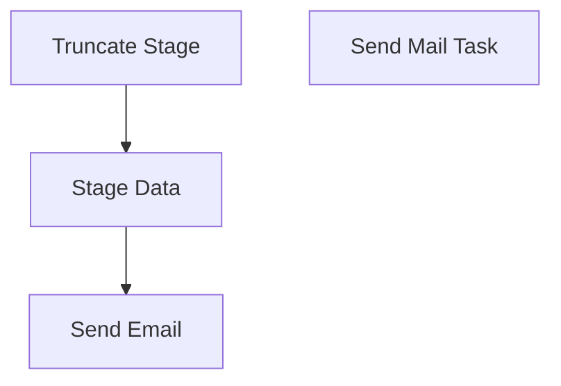

# SSIS Package: PrintingValidations

**Project:** WebPrintingValidations  
**Folder:** SSIS  
**Server:** STL-SSIS-P-01  

## Connection Managers

| Name | Type | Server | Catalog | Connection (sanitized) |
|---|---|---|---|---|
| CLB-BABWOrderManagement | OLEDB | clb-sql-p-01 | BABWOrderManagement | Data Source=clb-sql-p-01; Initial Catalog=BABWOrderManagement; Provider=SQLNCLI11.1; Integrated Security=SSPI; Auto Translate=False |
| SMTP | SMTP |  |  |  |
| WM | OLEDB | wmdb01 | WMPROD | Data Source=wmdb01; Initial Catalog=WMPROD; Provider=SQLNCLI10.1; Integrated Security=SSPI; Application Name=SSIS-Package-{6F2A8C07-F96A-46A9-B82A-A0AB10FC2013}wmdb01.WMPROD; Auto Translate=False |
| WebOrderProcessing | OLEDB | BEARCLUSTER01.SQL.BUILDABEAR.COM | WebOrderProcessing | Data Source=BEARCLUSTER01.SQL.BUILDABEAR.COM; Initial Catalog=WebOrderProcessing; Provider=SQLNCLI11.1; Integrated Security=SSPI; Auto Translate=False |

## Control Flow Tasks

| Task | Type |
|---|---|
| Package | Package |
| Send Email | ExecuteSQLTask |
| Stage Data | Pipeline |
| Truncate Stage | ExecuteSQLTask |
| Send Mail Task | SendMailTask |

## Control Flow Outline

```text
- Send Mail Task [SendMailTask]
- Send Email [ExecuteSQLTask]
- Stage Data [Pipeline]
- Truncate Stage [ExecuteSQLTask]
```

## Architecture Diagram



## Variables

| Namespace | Name | Expression-bound |
|---|---|---|
| System | Propagate | No |
| User | DateTimeStamp | Yes |
| User | EndDate | Yes |
| User | EndDateAsDATE | Yes |
| User | GetDate | Yes |
| User | GetDateAsDATE | Yes |
| User | StartDate | Yes |
| User | StartDateAsDATE | Yes |

### Expression-bound variable values

#### User::DateTimeStamp

**Expression:**

```sql
(DT_WSTR,4)DATEPART("yyyy",GetDate()) 
+ (DT_WSTR,4)DATEPART("mm",GetDate()) 
+ (DT_WSTR,4)DATEPART("dd",GetDate()) 
+ (DT_WSTR,4)DATEPART("hh",GetDate()) 
+ (DT_WSTR,4)DATEPART("mi",GetDate()) 
+ (DT_WSTR,4)DATEPART("ss",GetDate()) 
+ (DT_WSTR,4)DATEPART("ms",GetDate())
```

**Evaluated value:**

```sql
2019371064697
```

#### User::EndDate

**Expression:**

```sql
dateadd("dd", @[$Package::DaysToInclude], @[User::StartDate])
```

**Evaluated value:**

```sql
3/7/2019
```

#### User::EndDateAsDATE

**Expression:**

```sql
(DT_WSTR, 4) datepart("year", @[User::EndDate])  + "-" + 
(DT_WSTR, 2) datepart("mm", @[User::EndDate])  + "-" + 
(DT_WSTR, 2) datepart("dd",  @[User::EndDate])
```

**Evaluated value:**

```sql
2019-3-7
```

#### User::GetDate

**Expression:**

```sql
(DT_DATE)DATEDIFF("Day", (DT_DATE) 0, GETDATE())
```

**Evaluated value:**

```sql
3/7/2019
```

#### User::GetDateAsDATE

**Expression:**

```sql
(DT_WSTR, 4) datepart("year", @[User::GetDate])  + "-" + 
(DT_WSTR, 2) datepart("mm", @[User::GetDate])  + "-" + 
(DT_WSTR, 2) datepart("dd",  @[User::GetDate])
```

**Evaluated value:**

```sql
2019-3-7
```

#### User::StartDate

**Expression:**

```sql
dateadd("dd", -@[$Package::DaysToGoBack] , @[User::GetDate] )
```

**Evaluated value:**

```sql
3/6/2019
```

#### User::StartDateAsDATE

**Expression:**

```sql
(DT_WSTR, 4) datepart("year", @[User::StartDate])  + "-" + 
(DT_WSTR, 2) datepart("mm", @[User::StartDate])  + "-" + 
(DT_WSTR, 2) datepart("dd",  @[User::StartDate])
```

**Evaluated value:**

```sql
2019-3-6
```

## Execute SQL Tasks

### Send Email

**Path:** `Package\Send Email`  
**Connection:** WebOrderProcessing (BEARCLUSTER01.SQL.BUILDABEAR.COM/WebOrderProcessing)  

```sql
exec WM.spEmailOrdersNotOnColumbusDB
```

### Truncate Stage

**Path:** `Package\Truncate Stage`  
**Connection:** WebOrderProcessing (BEARCLUSTER01.SQL.BUILDABEAR.COM/WebOrderProcessing)  

```sql
TRUNCATE TABLE WM.OrdersNotOnColumbusDB
```

## Data Flow: Sources

| Component | Source Object | Type | Data Flow Task | Connection | SQL Kind |
|---|---|---|---|---|---|
| WM Waved Orders |  | OLEDBSource | Stage Data | WM | SqlCommand |

#### WM Waved Orders — SqlCommand

```sql
select distinct 
	phi.pkt_ctrl_nbr as OrderNumber, 
	dateadd(hh, -1, phi.mod_date_time) as WaveDateTime,
getdate() as CheckDateTime
from pkt_hdr_intrnl phi with (nolock)
where substring(phi.pkt_ctrl_nbr, 9,1) = '_' 
and phi.stat_code >= 20
and phi.stat_code <> 99
and left(phi.pkt_ctrl_nbr, 1) in ('W', '7')
and datediff(dd, phi.mod_date_time, getdate()) <1
and datediff(mi, phi.mod_date_time, getdate()) > 5
```

## Data Flow: Destinations

| Component | Target Table | Type | Data Flow Task | Connection | SQL Kind |
|---|---|---|---|---|---|
| OrdersNotOnColumbusDB |  | OLEDBDestination | Stage Data | WebOrderProcessing |  |
