# SSIS Package: WebCatalogMaster

**Project:** WebProductCatalogMaster  
**Folder:** SSIS  
**Server:** STL-SSIS-P-01  

## Connection Managers

| Name | Type | Server | Catalog | Connection (sanitized) |
|---|---|---|---|---|
| ATGProductExportCSV | FLATFILE |  |  |  |
| AltImageTagsCSV | FLATFILE |  |  |  |
| AltImageTagz.csv | FLATFILE |  |  |  |
| AltImagesCSV | FLATFILE |  |  |  |
| Archive | FILE |  |  |  |
| ArchiveFolder | FILE |  |  |  |
| DW | OLEDB | papamart | dw | Data Source=papamart; Initial Catalog=dw; Provider=SQLNCLI11.1; Integrated Security=SSPI; Auto Translate=False |
| IntegrationStaging | OLEDB | stl-ssis-p-01 | IntegrationStaging | Data Source=stl-ssis-p-01; Initial Catalog=IntegrationStaging; Provider=SQLNCLI11.1; Integrated Security=SSPI; Auto Translate=False |
| ItemAttributeExceptions | FLATFILE |  |  |  |
| SMTP_EMAIL | SMTP |  |  |  |
| SQL_LOG | OLEDB | stl-ssis-p-01 | msdb | Data Source=stl-ssis-p-01; Initial Catalog=msdb; Provider=SQLNCLI11.1; Integrated Security=SSPI; Auto Translate=False |
| Validate.xml | FILE |  |  |  |
| WebOrderProcessing | OLEDB | BEARCLUSTER01.SQL.BUILDABEAR.COM | WebOrderProcessing | Data Source=BEARCLUSTER01.SQL.BUILDABEAR.COM; Initial Catalog=WebOrderProcessing; Provider=SQLNCLI11.1; Integrated Security=SSPI; Auto Translate=False |
| WebOrderProcessing_CLB_Mirror | OLEDB | clb-sql-p-01 | WebOrderProcessing | Data Source=clb-sql-p-01; Initial Catalog=WebOrderProcessing; Provider=SQLNCLI11.1; Integrated Security=SSPI; Auto Translate=False |
| XML FILES | FILE |  |  |  |
| catalog.xsd | FILE |  |  |  |
| me_01 | OLEDB | bedrockdb02 | me_01 | Data Source=bedrockdb02; Initial Catalog=me_01; Provider=SQLNCLI11.1; Integrated Security=SSPI; Auto Translate=False |

## Control Flow Tasks

| Task | Type |
|---|---|
| WebCatalogMaster | Package |
| Attributes Reload after Table Rebuild | Pipeline |
| Data Flow Task | Pipeline |
| File Generation and Move | SEQUENCE |
| Delete Old Files | ExecuteSQLTask |
| Foreach Loop Container | FOREACHLOOP |
| Archive Files | FileSystemTask |
| Copy Files to FTP Server | FileSystemTask |
| spOutputMasterCatalog | ExecuteSQLTask |
| Stage Data | SEQUENCE |
| Attributes | SEQUENCE |
| Foreach Loop - AltImageTags | FOREACHLOOP |
| AltImageTags Dataflow | Pipeline |
| Archive File | FileSystemTask |
| spMergeAltImageTags | ExecuteSQLTask |
| Truncate Stage | ExecuteSQLTask |
| Merge ProductCatalogMasterAttributes | ExecuteSQLTask |
| Online and Searchable Flags | ExecuteSQLTask |
| Pre Stage Web Attributes | ExecuteSQLTask |
| Stage Web Attributes | Pipeline |
| Update Descriptions from ATG File | SEQUENCE |
| Clean XTRAs - Update Attributes Table | ExecuteSQLTask |
| Import Master Data Xtras | Pipeline |
| Merge AlternateImages | ExecuteSQLTask |
| Categories | SEQUENCE |
| Merge Categories | ExecuteSQLTask |
| Stage Categories | Pipeline |
| ProductCategoryMap | SEQUENCE |
| Merge ProductCategoryMap | ExecuteSQLTask |
| Stage ProductCategory Map | Pipeline |
| Sequence - Master Data to DW | SEQUENCE |
| Load Master Data to DW | Pipeline |
| Truncate DW | ExecuteSQLTask |
| Sequence - Merge ProductCatalogMasterAttributes to WebOrderProcessing | SEQUENCE |
| Merge ProductCatalogMasterAttributesMirror | ExecuteSQLTask |
| Stage ProductCatalogMasterAttributes Mirror | Pipeline |
| Truncate Stage - WebOrderProcessing | ExecuteSQLTask |
| Sequence - Merge ProductCatalogMasterAttributes to WebOrderProcessing_CLB_Mirror | SEQUENCE |
| Merge ProductCatalogMasterAttributesMirror | ExecuteSQLTask |
| Stage ProductCatalogMasterAttributes Mirror | Pipeline |
| Truncate Stage - WebOrderProcessing | ExecuteSQLTask |
| Truncate Staging | ExecuteSQLTask |
| Send Email onError | SendMailTask |

## Control Flow Outline

```text
- Send Email onError [SendMailTask]
- Attributes Reload after Table Rebuild [Pipeline]
- Data Flow Task [Pipeline]
- File Generation and Move [SEQUENCE]
  - Delete Old Files [ExecuteSQLTask]
  - Foreach Loop Container [FOREACHLOOP]
    - Archive Files [FileSystemTask]
    - Copy Files to FTP Server [FileSystemTask]
  - spOutputMasterCatalog [ExecuteSQLTask]
- Stage Data [SEQUENCE]
  - Attributes [SEQUENCE]
    - Foreach Loop - AltImageTags [FOREACHLOOP]
      - AltImageTags Dataflow [Pipeline]
      - Archive File [FileSystemTask]
      - Truncate Stage [ExecuteSQLTask]
      - spMergeAltImageTags [ExecuteSQLTask]
    - Merge ProductCatalogMasterAttributes [ExecuteSQLTask]
    - Online and Searchable Flags [ExecuteSQLTask]
    - Pre Stage Web Attributes [ExecuteSQLTask]
    - Stage Web Attributes [Pipeline]
    - Update Descriptions from ATG File [SEQUENCE]
      - Clean XTRAs - Update Attributes Table [ExecuteSQLTask]
      - Import Master Data Xtras [Pipeline]
      - Merge AlternateImages [ExecuteSQLTask]
  - Categories [SEQUENCE]
    - Merge Categories [ExecuteSQLTask]
    - Stage Categories [Pipeline]
  - ProductCategoryMap [SEQUENCE]
    - Merge ProductCategoryMap [ExecuteSQLTask]
    - Stage ProductCategory Map [Pipeline]
  - Sequence - Master Data to DW [SEQUENCE]
    - Load Master Data to DW [Pipeline]
    - Truncate DW [ExecuteSQLTask]
  - Sequence - Merge ProductCatalogMasterAttributes to WebOrderProcessing [SEQUENCE]
    - Merge ProductCatalogMasterAttributesMirror [ExecuteSQLTask]
    - Stage ProductCatalogMasterAttributes Mirror [Pipeline]
    - Truncate Stage - WebOrderProcessing [ExecuteSQLTask]
  - Sequence - Merge ProductCatalogMasterAttributes to WebOrderProcessing_CLB_Mirror [SEQUENCE]
    - Merge ProductCatalogMasterAttributesMirror [ExecuteSQLTask]
    - Stage ProductCatalogMasterAttributes Mirror [Pipeline]
    - Truncate Stage - WebOrderProcessing [ExecuteSQLTask]
  - Truncate Staging [ExecuteSQLTask]
```

## Architecture Diagram

```mermaid
flowchart TD
    n_Package_Attributes_Reload_after_Table_Rebuild["Attributes Reload after Table Rebuild"]
    n_Package_Data_Flow_Task["Data Flow Task"]
    n_Package_File_Generation_and_Move["File Generation and Move"]
    n_Package_File_Generation_and_Move_Delete_Old_Files["Delete Old Files"]
    n_Package_File_Generation_and_Move_Foreach_Loop_Container["Foreach Loop Container"]
    n_Package_File_Generation_and_Move_Foreach_Loop_Container_Archive_Files["Archive Files"]
    n_Package_File_Generation_and_Move_Foreach_Loop_Container_Copy_Files_to_FTP_Server["Copy Files to FTP Server"]
    n_Package_File_Generation_and_Move_spOutputMasterCatalog["spOutputMasterCatalog"]
    n_Package_Stage_Data["Stage Data"]
    n_Package_Stage_Data_Attributes["Attributes"]
    n_Package_Stage_Data_Attributes_Foreach_Loop___AltImageTags["Foreach Loop - AltImageTags"]
    n_Package_Stage_Data_Attributes_Foreach_Loop___AltImageTags_AltImageTags_Dataflow["AltImageTags Dataflow"]
    n_Package_Stage_Data_Attributes_Foreach_Loop___AltImageTags_Archive_File["Archive File"]
    n_Package_Stage_Data_Attributes_Foreach_Loop___AltImageTags_spMergeAltImageTags["spMergeAltImageTags"]
    n_Package_Stage_Data_Attributes_Foreach_Loop___AltImageTags_Truncate_Stage["Truncate Stage"]
    n_Package_Stage_Data_Attributes_Merge_ProductCatalogMasterAttributes["Merge ProductCatalogMasterAttributes"]
    n_Package_Stage_Data_Attributes_Online_and_Searchable_Flags["Online and Searchable Flags"]
    n_Package_Stage_Data_Attributes_Pre_Stage_Web_Attributes["Pre Stage Web Attributes"]
    n_Package_Stage_Data_Attributes_Stage_Web_Attributes["Stage Web Attributes"]
    n_Package_Stage_Data_Attributes_Update_Descriptions_from_ATG_File["Update Descriptions from ATG File"]
    n_Package_Stage_Data_Attributes_Update_Descriptions_from_ATG_File_Clean_XTRAs___Update_Attributes_Table["Clean XTRAs - Update Attributes Table"]
    n_Package_Stage_Data_Attributes_Update_Descriptions_from_ATG_File_Import_Master_Data_Xtras["Import Master Data Xtras"]
    n_Package_Stage_Data_Attributes_Update_Descriptions_from_ATG_File_Merge_AlternateImages["Merge AlternateImages"]
    n_Package_Stage_Data_Categories["Categories"]
    n_Package_Stage_Data_Categories_Merge_Categories["Merge Categories"]
    n_Package_Stage_Data_Categories_Stage_Categories["Stage Categories"]
    n_Package_Stage_Data_ProductCategoryMap["ProductCategoryMap"]
    n_Package_Stage_Data_ProductCategoryMap_Merge_ProductCategoryMap["Merge ProductCategoryMap"]
    n_Package_Stage_Data_ProductCategoryMap_Stage_ProductCategory_Map["Stage ProductCategory Map"]
    n_Package_Stage_Data_Sequence___Master_Data_to_DW["Sequence - Master Data to DW"]
    n_Package_Stage_Data_Sequence___Master_Data_to_DW_Load_Master_Data_to_DW["Load Master Data to DW"]
    n_Package_Stage_Data_Sequence___Master_Data_to_DW_Truncate_DW["Truncate DW"]
    n_Package_Stage_Data_Sequence___Merge_ProductCatalogMasterAttributes_to_WebOrderProcessing["Sequence - Merge ProductCatalogMasterAttributes to WebOrderProcessing"]
    n_Package_Stage_Data_Sequence___Merge_ProductCatalogMasterAttributes_to_WebOrderProcessing_Merge_ProductCatalogMasterAttributesMirror["Merge ProductCatalogMasterAttributesMirror"]
    n_Package_Stage_Data_Sequence___Merge_ProductCatalogMasterAttributes_to_WebOrderProcessing_Stage_ProductCatalogMasterAttributes_Mirror["Stage ProductCatalogMasterAttributes Mirror"]
    n_Package_Stage_Data_Sequence___Merge_ProductCatalogMasterAttributes_to_WebOrderProcessing_Truncate_Stage___WebOrderProcessing["Truncate Stage - WebOrderProcessing"]
    n_Package_Stage_Data_Sequence___Merge_ProductCatalogMasterAttributes_to_WebOrderProcessing_CLB_Mirror["Sequence - Merge ProductCatalogMasterAttributes to WebOrderProcessing_CLB_Mirror"]
    n_Package_Stage_Data_Sequence___Merge_ProductCatalogMasterAttributes_to_WebOrderProcessing_CLB_Mirror_Merge_ProductCatalogMasterAttributesMirror["Merge ProductCatalogMasterAttributesMirror"]
    n_Package_Stage_Data_Sequence___Merge_ProductCatalogMasterAttributes_to_WebOrderProcessing_CLB_Mirror_Stage_ProductCatalogMasterAttributes_Mirror["Stage ProductCatalogMasterAttributes Mirror"]
    n_Package_Stage_Data_Sequence___Merge_ProductCatalogMasterAttributes_to_WebOrderProcessing_CLB_Mirror_Truncate_Stage___WebOrderProcessing["Truncate Stage - WebOrderProcessing"]
    n_Package_Stage_Data_Truncate_Staging["Truncate Staging"]
    n_Package_EventHandlers_OnError__Send_Email_onError["Send Email onError"]
    n_Package_File_Generation_and_Move_Foreach_Loop_Container_Copy_Files_to_FTP_Server --> n_Package_File_Generation_and_Move_Foreach_Loop_Container_Archive_Files
    n_Package_File_Generation_and_Move_Foreach_Loop_Container --> n_Package_File_Generation_and_Move_Delete_Old_Files
    n_Package_File_Generation_and_Move_spOutputMasterCatalog --> n_Package_File_Generation_and_Move_Foreach_Loop_Container
    n_Package_Stage_Data_Attributes_Foreach_Loop___AltImageTags_AltImageTags_Dataflow --> n_Package_Stage_Data_Attributes_Foreach_Loop___AltImageTags_spMergeAltImageTags
    n_Package_Stage_Data_Attributes_Foreach_Loop___AltImageTags_spMergeAltImageTags --> n_Package_Stage_Data_Attributes_Foreach_Loop___AltImageTags_Archive_File
    n_Package_Stage_Data_Attributes_Foreach_Loop___AltImageTags_Truncate_Stage --> n_Package_Stage_Data_Attributes_Foreach_Loop___AltImageTags_AltImageTags_Dataflow
    n_Package_Stage_Data_Attributes_Update_Descriptions_from_ATG_File_Clean_XTRAs___Update_Attributes_Table --> n_Package_Stage_Data_Attributes_Update_Descriptions_from_ATG_File_Merge_AlternateImages
    n_Package_Stage_Data_Attributes_Update_Descriptions_from_ATG_File_Import_Master_Data_Xtras --> n_Package_Stage_Data_Attributes_Update_Descriptions_from_ATG_File_Clean_XTRAs___Update_Attributes_Table
    n_Package_Stage_Data_Attributes_Pre_Stage_Web_Attributes --> n_Package_Stage_Data_Attributes_Stage_Web_Attributes
    n_Package_Stage_Data_Attributes_Stage_Web_Attributes --> n_Package_Stage_Data_Attributes_Online_and_Searchable_Flags
    n_Package_Stage_Data_Attributes_Update_Descriptions_from_ATG_File --> n_Package_Stage_Data_Attributes_Pre_Stage_Web_Attributes
    n_Package_Stage_Data_Attributes_Online_and_Searchable_Flags --> n_Package_Stage_Data_Attributes_Merge_ProductCatalogMasterAttributes
    n_Package_Stage_Data_Attributes_Foreach_Loop___AltImageTags --> n_Package_Stage_Data_Attributes_Update_Descriptions_from_ATG_File
    n_Package_Stage_Data_Categories_Stage_Categories --> n_Package_Stage_Data_Categories_Merge_Categories
    n_Package_Stage_Data_ProductCategoryMap_Stage_ProductCategory_Map --> n_Package_Stage_Data_ProductCategoryMap_Merge_ProductCategoryMap
    n_Package_Stage_Data_Sequence___Master_Data_to_DW_Truncate_DW --> n_Package_Stage_Data_Sequence___Master_Data_to_DW_Load_Master_Data_to_DW
    n_Package_Stage_Data_Sequence___Merge_ProductCatalogMasterAttributes_to_WebOrderProcessing_Truncate_Stage___WebOrderProcessing --> n_Package_Stage_Data_Sequence___Merge_ProductCatalogMasterAttributes_to_WebOrderProcessing_Stage_ProductCatalogMasterAttributes_Mirror
    n_Package_Stage_Data_Sequence___Merge_ProductCatalogMasterAttributes_to_WebOrderProcessing_Stage_ProductCatalogMasterAttributes_Mirror --> n_Package_Stage_Data_Sequence___Merge_ProductCatalogMasterAttributes_to_WebOrderProcessing_Merge_ProductCatalogMasterAttributesMirror
    n_Package_Stage_Data_Sequence___Merge_ProductCatalogMasterAttributes_to_WebOrderProcessing_CLB_Mirror_Truncate_Stage___WebOrderProcessing --> n_Package_Stage_Data_Sequence___Merge_ProductCatalogMasterAttributes_to_WebOrderProcessing_CLB_Mirror_Stage_ProductCatalogMasterAttributes_Mirror
    n_Package_Stage_Data_Sequence___Merge_ProductCatalogMasterAttributes_to_WebOrderProcessing_CLB_Mirror_Stage_ProductCatalogMasterAttributes_Mirror --> n_Package_Stage_Data_Sequence___Merge_ProductCatalogMasterAttributes_to_WebOrderProcessing_CLB_Mirror_Merge_ProductCatalogMasterAttributesMirror
    n_Package_Stage_Data_Truncate_Staging --> n_Package_Stage_Data_Categories
    n_Package_Stage_Data_Categories --> n_Package_Stage_Data_Attributes
    n_Package_Stage_Data_Attributes --> n_Package_Stage_Data_ProductCategoryMap
    n_Package_Stage_Data_ProductCategoryMap --> n_Package_Stage_Data_Sequence___Merge_ProductCatalogMasterAttributes_to_WebOrderProcessing
    n_Package_Stage_Data_Sequence___Merge_ProductCatalogMasterAttributes_to_WebOrderProcessing --> n_Package_Stage_Data_Sequence___Master_Data_to_DW
    n_Package_Stage_Data_Sequence___Master_Data_to_DW --> n_Package_Stage_Data_Sequence___Merge_ProductCatalogMasterAttributes_to_WebOrderProcessing_CLB_Mirror
    n_Package_Stage_Data --> n_Package_File_Generation_and_Move
```



## Variables

| Namespace | Name | Expression-bound |
|---|---|---|
| System | Propagate | No |
| User | AltImageTagsFileName | No |
| User | AltImageTagsFileRename | Yes |
| User | DateString | Yes |
| User | FTPStageDirectory | No |
| User | FileName | No |
| User | LoadType | Yes |
| User | Variable | No |

### Expression-bound variable values

#### User::AltImageTagsFileRename

**Expression:**

```sql
"\\\\stl-ssis-p-01\\IntegrationStaging\\WEB\\MasterDataXtras\\AltImageTagsArchive\\AltImageTags" +  @[User::DateString] + ".csv"
```

**Evaluated value:**

```sql
\\stl-ssis-p-01\IntegrationStaging\WEB\MasterDataXtras\AltImageTagsArchive\AltImageTags20230130152856540.csv
```

#### User::DateString

**Expression:**

```sql
(DT_STR, 4, 1252) DATEPART("yy" , GETDATE()) + RIGHT("0" + (DT_STR, 2, 1252) DATEPART("mm" , GETDATE()), 2) + (DT_STR, 2, 1252) DATEPART("dd" , GETDATE()) + (DT_STR, 2, 1252) DATEPART("hh" , GETDATE()) + (DT_STR, 2, 1252) DATEPART("mi" , GETDATE())+ (DT_STR, 2, 1252) DATEPART("ss" , GETDATE()) +  (DT_STR, 3, 1252) DATEPART("ms" , GETDATE())
```

**Evaluated value:**

```sql
20230130152856543
```

#### User::LoadType

**Expression:**

```sql
@[$Package::LoadType]
```

**Evaluated value:**

```sql
FULL
```

## Execute SQL Tasks

### Delete Old Files

**Path:** `Package\File Generation and Move\Delete Old Files`  
**Connection:** IntegrationStaging (stl-ssis-p-01/IntegrationStaging)  

```sql
exec spDeleteOldFiles @path = '\\STL-SSIS-P-01\IntegrationStaging\WEB\Outbound\ProductCatalogMaster\Archive', @filemask = '*.xml', @retention = 14
```

### spOutputMasterCatalog

**Path:** `Package\File Generation and Move\spOutputMasterCatalog`  
**Connection:** IntegrationStaging (stl-ssis-p-01/IntegrationStaging)  

> ⚠️ `SqlStatementSource` is overridden at runtime by a property expression (shown below); the static SQL may not be what executes.

**Static SqlStatementSource:**

```sql
exec WEB.spOutputMasterCatalog 'FULL'
```

**Property expression (runtime override):**

```sql
"exec WEB.spOutputMasterCatalog " +  "'" + @[$Package::LoadType] + "'"
```

### Truncate Stage

**Path:** `Package\Stage Data\Attributes\Foreach Loop - AltImageTags\Truncate Stage`  
**Connection:** IntegrationStaging (stl-ssis-p-01/IntegrationStaging)  

```sql
TRUNCATE TABLE Web.AltImageTagsStage
```

### spMergeAltImageTags

**Path:** `Package\Stage Data\Attributes\Foreach Loop - AltImageTags\spMergeAltImageTags`  
**Connection:** IntegrationStaging (stl-ssis-p-01/IntegrationStaging)  

```sql
exec WEB.spMergeAltImageTags 
```

### Merge ProductCatalogMasterAttributes

**Path:** `Package\Stage Data\Attributes\Merge ProductCatalogMasterAttributes`  
**Connection:** IntegrationStaging (stl-ssis-p-01/IntegrationStaging)  

> ⚠️ `SqlStatementSource` is overridden at runtime by a property expression (shown below); the static SQL may not be what executes.

**Static SqlStatementSource:**

```sql
exec WEB.spMergeProductCatalogMasterAttributes 
 @LoadType = 'FULL'
```

**Property expression (runtime override):**

```sql
"exec WEB.spMergeProductCatalogMasterAttributes 
 @LoadType = '" +  @[User::LoadType] + "'"
```

### Online and Searchable Flags

**Path:** `Package\Stage Data\Attributes\Online and Searchable Flags`  
**Connection:** IntegrationStaging (stl-ssis-p-01/IntegrationStaging)  

```sql
exec WEB.spUpdateProductMasterCatalogOnlineFlag
```

### Pre Stage Web Attributes

**Path:** `Package\Stage Data\Attributes\Pre Stage Web Attributes`  
**Connection:** me_01 (bedrockdb02/me_01)  

```sql
exec spWEBSelectProductCatalogMasterAttributes 
```

### Clean XTRAs - Update Attributes Table

**Path:** `Package\Stage Data\Attributes\Update Descriptions from ATG File\Clean XTRAs - Update Attributes Table`  
**Connection:** IntegrationStaging (stl-ssis-p-01/IntegrationStaging)  

```sql
exec  WEB.spUpdateProductMasterDataXtras
```

### Merge AlternateImages

**Path:** `Package\Stage Data\Attributes\Update Descriptions from ATG File\Merge AlternateImages`  
**Connection:** IntegrationStaging (stl-ssis-p-01/IntegrationStaging)  

> ⚠️ `SqlStatementSource` is overridden at runtime by a property expression (shown below); the static SQL may not be what executes.

**Static SqlStatementSource:**

```sql
exec WEB.spMergeAlternateImages 'FULL'
```

**Property expression (runtime override):**

```sql
"exec WEB.spMergeAlternateImages " +  "'" + @[$Package::LoadType] + "'"
```

### Merge Categories

**Path:** `Package\Stage Data\Categories\Merge Categories`  
**Connection:** IntegrationStaging (stl-ssis-p-01/IntegrationStaging)  

> ⚠️ `SqlStatementSource` is overridden at runtime by a property expression (shown below); the static SQL may not be what executes.

**Static SqlStatementSource:**

```sql
exec WEB.spMergeProductCatalogMasterCategory 'FULL'
```

**Property expression (runtime override):**

```sql
"exec WEB.spMergeProductCatalogMasterCategory " +  "'" + @[$Package::LoadType] + "'"
```

### Merge ProductCategoryMap

**Path:** `Package\Stage Data\ProductCategoryMap\Merge ProductCategoryMap`  
**Connection:** IntegrationStaging (stl-ssis-p-01/IntegrationStaging)  

> ⚠️ `SqlStatementSource` is overridden at runtime by a property expression (shown below); the static SQL may not be what executes.

**Static SqlStatementSource:**

```sql
exec WEB.spMergeProductCategoryMap 
 @LoadType = 'FULL'
```

**Property expression (runtime override):**

```sql
"exec WEB.spMergeProductCategoryMap 
 @LoadType = '" +  @[User::LoadType] + "'"
```

### Truncate DW

**Path:** `Package\Stage Data\Sequence - Master Data to DW\Truncate DW`  
**Connection:** DW (papamart/dw)  

```sql
TRUNCATE TABLE Azure.WebProductCatalogMasterAttributes
```

### Merge ProductCatalogMasterAttributesMirror

**Path:** `Package\Stage Data\Sequence - Merge ProductCatalogMasterAttributes to WebOrderProcessing\Merge ProductCatalogMasterAttributesMirror`  
**Connection:** WebOrderProcessing (BEARCLUSTER01.SQL.BUILDABEAR.COM/WebOrderProcessing)  

```sql
exec WM.spMergeProductCatalogMasterAttributes_Mirror 
```

### Truncate Stage - WebOrderProcessing

**Path:** `Package\Stage Data\Sequence - Merge ProductCatalogMasterAttributes to WebOrderProcessing\Truncate Stage - WebOrderProcessing`  
**Connection:** WebOrderProcessing (BEARCLUSTER01.SQL.BUILDABEAR.COM/WebOrderProcessing)  

```sql
TRUNCATE TABLE WM.ProductCatalogMasterAttributes_MirrorStage
```

### Merge ProductCatalogMasterAttributesMirror

**Path:** `Package\Stage Data\Sequence - Merge ProductCatalogMasterAttributes to WebOrderProcessing_CLB_Mirror\Merge ProductCatalogMasterAttributesMirror`  
**Connection:** WebOrderProcessing_CLB_Mirror (clb-sql-p-01/WebOrderProcessing)  

```sql
exec WM.spMergeProductCatalogMasterAttributes_Mirror 
```

### Truncate Stage - WebOrderProcessing

**Path:** `Package\Stage Data\Sequence - Merge ProductCatalogMasterAttributes to WebOrderProcessing_CLB_Mirror\Truncate Stage - WebOrderProcessing`  
**Connection:** WebOrderProcessing_CLB_Mirror (clb-sql-p-01/WebOrderProcessing)  

```sql
TRUNCATE TABLE WM.ProductCatalogMasterAttributes_MirrorStage
```

### Truncate Staging

**Path:** `Package\Stage Data\Truncate Staging`  
**Connection:** IntegrationStaging (stl-ssis-p-01/IntegrationStaging)  

```sql
TRUNCATE TABLE WEB.ProductCatalogMasterCategoryStage
TRUNCATE TABLE WEB.ProductMasterDataXtras
TRUNCATE TABLE WEB.ProductCatalogMasterDataExceptions
TRUNCATE TABLE WEB.AlternateImagesStage
TRUNCATE TABLE WEB.ProductCatalogMasterAttributesStage
TRUNCATE TABLE WEB.ProductCategoryMapStage
```

## Data Flow: Sources

| Component | Source Object | Type | Data Flow Task | Connection | SQL Kind |
|---|---|---|---|---|---|
| OLE DB Source |  | OLEDBSource | Attributes Reload after Table Rebuild | IntegrationStaging |  |
| OLE DB Source |  | OLEDBSource | Data Flow Task | me_01 | SqlCommand |
| AltImageTags CSV |  | FlatFileSource | AltImageTags Dataflow | AltImageTagz.csv |  |
| WebProductCatalogMasterAttributes |  | OLEDBSource | Stage Web Attributes | me_01 |  |
| AltImagesCSV |  | FlatFileSource | Import Master Data Xtras | AltImagesCSV |  |
| Item Attribute Exceptions csv |  | FlatFileSource | Import Master Data Xtras | ItemAttributeExceptions |  |
| product-export_csv |  | FlatFileSource | Import Master Data Xtras | ATGProductExportCSV |  |
| ME_01 vwWebProductMasterCatalogCategories |  | OLEDBSource | Stage Categories | me_01 |  |
| vwProductCategoryMap |  | OLEDBSource | Stage ProductCategory Map | IntegrationStaging |  |
| ProductCatalogMasterAttributes |  | OLEDBSource | Load Master Data to DW | IntegrationStaging |  |
| ProductCatalogMasterAttributes - Source |  | OLEDBSource | Stage ProductCatalogMasterAttributes Mirror | IntegrationStaging |  |
| ProductCatalogMasterAttributes - Source |  | OLEDBSource | Stage ProductCatalogMasterAttributes Mirror | IntegrationStaging |  |

#### OLE DB Source — SqlCommand

```sql
select cast(style_code as varchar(6)) as StyleCode
from style
```

## Data Flow: Destinations

| Component | Target Table | Type | Data Flow Task | Connection | SQL Kind |
|---|---|---|---|---|---|
| OLE DB Destination |  | OLEDBDestination | Attributes Reload after Table Rebuild | IntegrationStaging |  |
| OLE DB Destination |  | OLEDBDestination | Data Flow Task | IntegrationStaging |  |
| WEB AltImageTagsStage |  | OLEDBDestination | AltImageTags Dataflow | IntegrationStaging |  |
| ProductCatalogMasterAttributesStage |  | OLEDBDestination | Stage Web Attributes | IntegrationStaging |  |
| AlternateImagesStage |  | OLEDBDestination | Import Master Data Xtras | IntegrationStaging |  |
| ProductCatalogMasterDataExceptions |  | OLEDBDestination | Import Master Data Xtras | IntegrationStaging |  |
| ProductMasterDataXtras |  | OLEDBDestination | Import Master Data Xtras | IntegrationStaging |  |
| ProductCatalogMasterCategoryStage |  | OLEDBDestination | Stage Categories | IntegrationStaging |  |
| ProductCategoryMapStage |  | OLEDBDestination | Stage ProductCategory Map | IntegrationStaging |  |
| WebProductCatalogMasterAttributes |  | OLEDBDestination | Load Master Data to DW | DW |  |
| ProductCatalogMasterAttributes_MirrorStage |  | OLEDBDestination | Stage ProductCatalogMasterAttributes Mirror | WebOrderProcessing |  |
| ProductCatalogMasterAttributes_MirrorStage |  | OLEDBDestination | Stage ProductCatalogMasterAttributes Mirror | WebOrderProcessing_CLB_Mirror |  |
