# SSIS Package: WebCatalogStoreFront

**Project:** WebProductCatalogStorefront  
**Folder:** SSIS  
**Server:** STL-SSIS-P-01  

## Architecture Diagram

```mermaid
flowchart TD
    subgraph Connections
        ArchiveFolder_conn(["ArchiveFolder [FILE]"])
        AttributeNullExceptionsStage_csv_conn(["AttributeNullExceptionsStage.csv [FLATFILE]"])
        CategoryExceptions_conn(["CategoryExceptions [FLATFILE]"])
        CategoryXREF_csv_conn(["CategoryXREF.csv [FLATFILE]"])
        DW_conn(["DW [OLEDB]"])
        EMAIL_conn(["EMAIL [SMTP]"])
        FTP_Connection_Manager_conn(["FTP Connection Manager [FTP]"])
        IntegrationStaging_conn(["IntegrationStaging [OLEDB]"])
        ME_01_conn(["ME_01 [OLEDB]"])
        SiteCatalystClassification_conn(["SiteCatalystClassification [FLATFILE]"])
        SMTP_EMAIL_conn(["SMTP_EMAIL [SMTP]"])
        SQL_LOG_conn(["SQL_LOG [OLEDB]"])
        XML_Files_conn(["XML Files [FLATFILE]"])
    end
    subgraph ControlFlow
        WebCatalogStoreFront_task["WebCatalogStoreFront"]
        File_Generation_and_Move_task["File Generation and Move"]
        WebCatalogStoreFront_task --> File_Generation_and_Move_task
        Delete_Old_Files_task["Delete Old Files"]
        File_Generation_and_Move_task --> Delete_Old_Files_task
        Foreach_Loop_Container_task["Foreach Loop Container"]
        Delete_Old_Files_task --> Foreach_Loop_Container_task
        Archive_Files_task["Archive Files"]
        Foreach_Loop_Container_task --> Archive_Files_task
        Copy_Files_to_FTP_Server_task["Copy Files to FTP Server"]
        Archive_Files_task --> Copy_Files_to_FTP_Server_task
        spOutputStorefrontCatalogs_task["spOutputStorefrontCatalogs"]
        Copy_Files_to_FTP_Server_task --> spOutputStorefrontCatalogs_task
        Foreach_Loop_Log_File_Size_task["Foreach Loop Log File Size"]
        spOutputStorefrontCatalogs_task --> Foreach_Loop_Log_File_Size_task
        Get_File_and_Size_task["Get File and Size"]
        Foreach_Loop_Log_File_Size_task --> Get_File_and_Size_task
        Load_File_and_Size_task["Load File and Size"]
        Get_File_and_Size_task --> Load_File_and_Size_task
        Send_File_Stage_Summary_Email_task["Send File Stage Summary Email"]
        Load_File_and_Size_task --> Send_File_Stage_Summary_Email_task
        Stage_Data_task["Stage Data"]
        Send_File_Stage_Summary_Email_task --> Stage_Data_task
        Categories_task["Categories"]
        Stage_Data_task --> Categories_task
        Merge_Categories_task["Merge Categories"]
        Categories_task --> Merge_Categories_task
        Stage_Categories_task["Stage Categories"]
        Merge_Categories_task --> Stage_Categories_task
        Omniture_Sequence_task["Omniture Sequence"]
        Stage_Categories_task --> Omniture_Sequence_task
        Append_Data_to_Template_File_task["Append Data to Template File"]
        Omniture_Sequence_task --> Append_Data_to_Template_File_task
        For_Each_FTP_task["For Each FTP"]
        Append_Data_to_Template_File_task --> For_Each_FTP_task
        FTP_Task_task["FTP Task"]
        For_Each_FTP_task --> FTP_Task_task
        Foreach_Loop_Container_task["Foreach Loop Container"]
        FTP_Task_task --> Foreach_Loop_Container_task
        Copy_Omniture_Template_File_to_Stage_task["Copy Omniture Template File to Stage"]
        Foreach_Loop_Container_task --> Copy_Omniture_Template_File_to_Stage_task
        ProductCategoryMap_task["ProductCategoryMap"]
        Copy_Omniture_Template_File_to_Stage_task --> ProductCategoryMap_task
        Merge_ProductStorefrontCategoryMap_task["Merge ProductStorefrontCategoryMap"]
        ProductCategoryMap_task --> Merge_ProductStorefrontCategoryMap_task
        Stage_ProductCategoryMap_task["Stage ProductCategoryMap"]
        Merge_ProductStorefrontCategoryMap_task --> Stage_ProductCategoryMap_task
        Sequence_Load_Product_Category_Map_to_DW_task["Sequence Load Product Category Map to DW"]
        Stage_ProductCategoryMap_task --> Sequence_Load_Product_Category_Map_to_DW_task
        Load_Product_Category_Map_to_DW_task["Load Product Category Map to DW"]
        Sequence_Load_Product_Category_Map_to_DW_task --> Load_Product_Category_Map_to_DW_task
        Truncate_Stage_task["Truncate Stage"]
        Load_Product_Category_Map_to_DW_task --> Truncate_Stage_task
        Truncate_Staging_task["Truncate Staging"]
        Truncate_Stage_task --> Truncate_Staging_task
        XREF_CSVs_task["XREF CSVs"]
        Truncate_Staging_task --> XREF_CSVs_task
        Import_Category_Lookups_task["Import Category Lookups"]
        XREF_CSVs_task --> Import_Category_Lookups_task
        Merge_CategoryXREF_task["Merge CategoryXREF"]
        Import_Category_Lookups_task --> Merge_CategoryXREF_task
        Send_Email_onError_task["Send Email onError"]
        Merge_CategoryXREF_task --> Send_Email_onError_task
    end
```

## Connection Managers

| Name | Type |
|---|---|
| ArchiveFolder | FILE |
| AttributeNullExceptionsStage.csv | FLATFILE |
| CategoryExceptions | FLATFILE |
| CategoryXREF.csv | FLATFILE |
| DW | OLEDB |
| EMAIL | SMTP |
| FTP Connection Manager | FTP |
| IntegrationStaging | OLEDB |
| ME_01 | OLEDB |
| SiteCatalystClassification | FLATFILE |
| SMTP_EMAIL | SMTP |
| SQL_LOG | OLEDB |
| XML Files | FLATFILE |

## Control Flow Tasks

| Task | Type |
|---|---|
| WebCatalogStoreFront | Microsoft.Package |
| File Generation and Move | STOCK:SEQUENCE |
| Delete Old Files | Microsoft.ExecuteSQLTask |
| Foreach Loop Container | STOCK:FOREACHLOOP |
| Archive Files | Microsoft.FileSystemTask |
| Copy Files to FTP Server | Microsoft.FileSystemTask |
| spOutputStorefrontCatalogs | Microsoft.ExecuteSQLTask |
| Foreach Loop Log File Size | STOCK:FOREACHLOOP |
| Get File and Size | Microsoft.ExecuteProcess |
| Load File and Size | Microsoft.Pipeline |
| Send File Stage Summary Email | Microsoft.ExecuteSQLTask |
| Stage Data | STOCK:SEQUENCE |
| Categories | STOCK:SEQUENCE |
| Merge Categories | Microsoft.ExecuteSQLTask |
| Stage Categories | Microsoft.Pipeline |
| Omniture Sequence | STOCK:SEQUENCE |
| Append Data to Template File | Microsoft.Pipeline |
| For Each FTP | STOCK:FOREACHLOOP |
| FTP Task | Microsoft.FtpTask |
| Foreach Loop Container | STOCK:FOREACHLOOP |
| Copy Omniture Template File to Stage | Microsoft.FileSystemTask |
| ProductCategoryMap | STOCK:SEQUENCE |
| Merge ProductStorefrontCategoryMap | Microsoft.ExecuteSQLTask |
| Stage ProductCategoryMap | Microsoft.Pipeline |
| Sequence Load Product Category Map to DW | STOCK:SEQUENCE |
| Load Product Category Map to DW | Microsoft.Pipeline |
| Truncate Stage | Microsoft.ExecuteSQLTask |
| Truncate Staging | Microsoft.ExecuteSQLTask |
| XREF CSVs | STOCK:SEQUENCE |
| Import Category Lookups | Microsoft.Pipeline |
| Merge CategoryXREF | Microsoft.ExecuteSQLTask |
| Send Email onError | Microsoft.SendMailTask |

## Data Flow: Sources

| Component | SQL Preview |
|---|---|
|  | select  	BABWProductID, 	substring(Category,4,100) as Category, 	SubCategory, 	Collection, 	ProductName from Web.OmnitureProductStorefrontCategoryStage where left(Category,2) = 'US' |
|  | select 	BABWProductID, 	min(PrimaryCategoryDesignation) PrimaryCategoryDesignation  from WEB.vwProductStorefrontCategoryMap  where substring(CategoryID,4,12) <> 'bear-builder'  group by BABWProductID |
|  | select   	style_code, 	jurisdiction_code, 	product_key  from product_dim with (nolock) where style_code is not null and jurisdiction_code in ('US', 'UK') |
|  | select  	cast(left(Category,2) as nvarchar(2)) SiteCountry, 	BABWProductID, 	substring(Category,4,100) as Category, 	SubCategory, 	Collection, 	ProductName, cast(left(Category,2) as varchar(2)) JurisdictionCode from Web.OmnitureProductStorefrontCategoryStage where left(Category,2) in ('US', 'UK') |

## Data Flow: Destinations

| Component | Destination |
|---|---|
|  | [WEB].[FileSizeData] |
|  | [WEB].[ProductCatalogStorefrontCategoryStage] |
|  | [WEB].[vwProductStorefrontCatalogCategories] |
|  | [WEB].[OmnitureProductStorefrontCategoryStage] |
|  | [WEB].[OmnitureProductStorefrontCategoryStage] |
|  | [WEB].[ProductStorefrontCategoryMapStage] |
|  | [WEB].[vwProductStorefrontCategoryMap] |
|  | [Azure].[WebProductStorefrontCategoryMap] |
|  | [WEB].[AttributeNullExceptions] |
|  | [WEB].[CategoryExceptions] |
|  | [WEB].[CategoryXREFstage] |

