# SSIS Package: WebCatalogStoreFront

**Project:** WebProductCatalogStorefront  
**Folder:** SSIS  
**Server:** STL-SSIS-P-01  

## Connection Managers

| Name | Type | Server | Catalog | Connection (sanitized) |
|---|---|---|---|---|
| ArchiveFolder | FILE |  |  |  |
| AttributeNullExceptionsStage.csv | FLATFILE |  |  |  |
| CategoryExceptions | FLATFILE |  |  |  |
| CategoryXREF.csv | FLATFILE |  |  |  |
| DW | OLEDB | papamart | dw | Data Source=papamart; Initial Catalog=dw; Provider=SQLNCLI11.1; Integrated Security=SSPI; Auto Translate=False |
| EMAIL | SMTP |  |  |  |
| FTP Connection Manager | FTP |  |  |  |
| IntegrationStaging | OLEDB | STL-SSIS-P-01 | IntegrationStaging | Data Source=STL-SSIS-P-01; Initial Catalog=IntegrationStaging; Provider=SQLNCLI11.1; Integrated Security=SSPI; Auto Translate=False |
| ME_01 | OLEDB | bedrockdb02 | me_01 | Data Source=bedrockdb02; Initial Catalog=me_01; Provider=SQLNCLI11.1; Integrated Security=SSPI; Auto Translate=False |
| SMTP_EMAIL | SMTP |  |  |  |
| SQL_LOG | OLEDB | stl-ssis-p-01 | msdb | Data Source=stl-ssis-p-01; Initial Catalog=msdb; Provider=SQLNCLI11.1; Integrated Security=SSPI; Auto Translate=False |
| SiteCatalystClassification | FLATFILE |  |  |  |
| XML Files | FLATFILE |  |  |  |

## Control Flow Tasks

| Task | Type |
|---|---|
| WebCatalogStoreFront | Package |
| File Generation and Move | SEQUENCE |
| Delete Old Files | ExecuteSQLTask |
| Foreach Loop Container | FOREACHLOOP |
| Archive Files | FileSystemTask |
| Copy Files to FTP Server | FileSystemTask |
| spOutputStorefrontCatalogs | ExecuteSQLTask |
| Foreach Loop Log File Size | FOREACHLOOP |
| Get File and Size | ExecuteProcess |
| Load File and Size | Pipeline |
| Send File Stage Summary Email | ExecuteSQLTask |
| Stage Data | SEQUENCE |
| Categories | SEQUENCE |
| Merge Categories | ExecuteSQLTask |
| Stage Categories | Pipeline |
| Omniture Sequence | SEQUENCE |
| Append Data to Template File | Pipeline |
| For Each FTP | FOREACHLOOP |
| FTP Task | FtpTask |
| Foreach Loop Container | FOREACHLOOP |
| Copy Omniture Template File to Stage | FileSystemTask |
| ProductCategoryMap | SEQUENCE |
| Merge ProductStorefrontCategoryMap | ExecuteSQLTask |
| Stage ProductCategoryMap | Pipeline |
| Sequence Load Product Category Map to DW | SEQUENCE |
| Load Product Category Map to DW | Pipeline |
| Truncate Stage | ExecuteSQLTask |
| Truncate Staging | ExecuteSQLTask |
| XREF CSVs | SEQUENCE |
| Import Category Lookups | Pipeline |
| Merge CategoryXREF | ExecuteSQLTask |
| Send Email onError | SendMailTask |

## Control Flow Outline

```text
- Send Email onError [SendMailTask]
- File Generation and Move [SEQUENCE]
  - Delete Old Files [ExecuteSQLTask]
  - Foreach Loop Container [FOREACHLOOP]
    - Archive Files [FileSystemTask]
    - Copy Files to FTP Server [FileSystemTask]
  - spOutputStorefrontCatalogs [ExecuteSQLTask]
- Foreach Loop Log File Size [FOREACHLOOP]
  - Get File and Size [ExecuteProcess]
  - Load File and Size [Pipeline]
- Send File Stage Summary Email [ExecuteSQLTask]
- Stage Data [SEQUENCE]
  - Categories [SEQUENCE]
    - Merge Categories [ExecuteSQLTask]
    - Stage Categories [Pipeline]
  - Omniture Sequence [SEQUENCE]
    - Append Data to Template File [Pipeline]
    - For Each FTP [FOREACHLOOP]
      - FTP Task [FtpTask]
    - Foreach Loop Container [FOREACHLOOP]
      - Copy Omniture Template File to Stage [FileSystemTask]
  - ProductCategoryMap [SEQUENCE]
    - Merge ProductStorefrontCategoryMap [ExecuteSQLTask]
    - Stage ProductCategoryMap [Pipeline]
  - Sequence Load Product Category Map to DW [SEQUENCE]
    - Load Product Category Map to DW [Pipeline]
    - Truncate Stage [ExecuteSQLTask]
  - Truncate Staging [ExecuteSQLTask]
  - XREF CSVs [SEQUENCE]
    - Import Category Lookups [Pipeline]
    - Merge CategoryXREF [ExecuteSQLTask]
```

## Architecture Diagram

```mermaid
flowchart TD
    n_Package_File_Generation_and_Move["File Generation and Move"]
    n_Package_File_Generation_and_Move_Delete_Old_Files["Delete Old Files"]
    n_Package_File_Generation_and_Move_Foreach_Loop_Container["Foreach Loop Container"]
    n_Package_File_Generation_and_Move_Foreach_Loop_Container_Archive_Files["Archive Files"]
    n_Package_File_Generation_and_Move_Foreach_Loop_Container_Copy_Files_to_FTP_Server["Copy Files to FTP Server"]
    n_Package_File_Generation_and_Move_spOutputStorefrontCatalogs["spOutputStorefrontCatalogs"]
    n_Package_Foreach_Loop_Log_File_Size["Foreach Loop Log File Size"]
    n_Package_Foreach_Loop_Log_File_Size_Get_File_and_Size["Get File and Size"]
    n_Package_Foreach_Loop_Log_File_Size_Load_File_and_Size["Load File and Size"]
    n_Package_Send_File_Stage_Summary_Email["Send File Stage Summary Email"]
    n_Package_Stage_Data["Stage Data"]
    n_Package_Stage_Data_Categories["Categories"]
    n_Package_Stage_Data_Categories_Merge_Categories["Merge Categories"]
    n_Package_Stage_Data_Categories_Stage_Categories["Stage Categories"]
    n_Package_Stage_Data_Omniture_Sequence["Omniture Sequence"]
    n_Package_Stage_Data_Omniture_Sequence_Append_Data_to_Template_File["Append Data to Template File"]
    n_Package_Stage_Data_Omniture_Sequence_For_Each_FTP["For Each FTP"]
    n_Package_Stage_Data_Omniture_Sequence_For_Each_FTP_FTP_Task["FTP Task"]
    n_Package_Stage_Data_Omniture_Sequence_Foreach_Loop_Container["Foreach Loop Container"]
    n_Package_Stage_Data_Omniture_Sequence_Foreach_Loop_Container_Copy_Omniture_Template_File_to_Stage["Copy Omniture Template File to Stage"]
    n_Package_Stage_Data_ProductCategoryMap["ProductCategoryMap"]
    n_Package_Stage_Data_ProductCategoryMap_Merge_ProductStorefrontCategoryMap["Merge ProductStorefrontCategoryMap"]
    n_Package_Stage_Data_ProductCategoryMap_Stage_ProductCategoryMap["Stage ProductCategoryMap"]
    n_Package_Stage_Data_Sequence_Load_Product_Category_Map_to_DW["Sequence Load Product Category Map to DW"]
    n_Package_Stage_Data_Sequence_Load_Product_Category_Map_to_DW_Load_Product_Category_Map_to_DW["Load Product Category Map to DW"]
    n_Package_Stage_Data_Sequence_Load_Product_Category_Map_to_DW_Truncate_Stage["Truncate Stage"]
    n_Package_Stage_Data_Truncate_Staging["Truncate Staging"]
    n_Package_Stage_Data_XREF_CSVs["XREF CSVs"]
    n_Package_Stage_Data_XREF_CSVs_Import_Category_Lookups["Import Category Lookups"]
    n_Package_Stage_Data_XREF_CSVs_Merge_CategoryXREF["Merge CategoryXREF"]
    n_Package_EventHandlers_OnError__Send_Email_onError["Send Email onError"]
    n_Package_File_Generation_and_Move_Foreach_Loop_Container_Copy_Files_to_FTP_Server --> n_Package_File_Generation_and_Move_Foreach_Loop_Container_Archive_Files
    n_Package_File_Generation_and_Move_spOutputStorefrontCatalogs --> n_Package_File_Generation_and_Move_Foreach_Loop_Container
    n_Package_File_Generation_and_Move_Foreach_Loop_Container --> n_Package_File_Generation_and_Move_Delete_Old_Files
    n_Package_Foreach_Loop_Log_File_Size_Get_File_and_Size --> n_Package_Foreach_Loop_Log_File_Size_Load_File_and_Size
    n_Package_Stage_Data_Categories_Stage_Categories --> n_Package_Stage_Data_Categories_Merge_Categories
    n_Package_Stage_Data_Omniture_Sequence_Foreach_Loop_Container --> n_Package_Stage_Data_Omniture_Sequence_Append_Data_to_Template_File
    n_Package_Stage_Data_Omniture_Sequence_Append_Data_to_Template_File --> n_Package_Stage_Data_Omniture_Sequence_For_Each_FTP
    n_Package_Stage_Data_ProductCategoryMap_Stage_ProductCategoryMap --> n_Package_Stage_Data_ProductCategoryMap_Merge_ProductStorefrontCategoryMap
    n_Package_Stage_Data_Sequence_Load_Product_Category_Map_to_DW_Truncate_Stage --> n_Package_Stage_Data_Sequence_Load_Product_Category_Map_to_DW_Load_Product_Category_Map_to_DW
    n_Package_Stage_Data_XREF_CSVs_Import_Category_Lookups --> n_Package_Stage_Data_XREF_CSVs_Merge_CategoryXREF
    n_Package_Stage_Data_Truncate_Staging --> n_Package_Stage_Data_XREF_CSVs
    n_Package_Stage_Data_XREF_CSVs --> n_Package_Stage_Data_Categories
    n_Package_Stage_Data_Categories --> n_Package_Stage_Data_ProductCategoryMap
    n_Package_Stage_Data_ProductCategoryMap --> n_Package_Stage_Data_Omniture_Sequence
    n_Package_Stage_Data_Omniture_Sequence --> n_Package_Stage_Data_Sequence_Load_Product_Category_Map_to_DW
    n_Package_Stage_Data --> n_Package_File_Generation_and_Move
    n_Package_File_Generation_and_Move --> n_Package_Foreach_Loop_Log_File_Size
    n_Package_Foreach_Loop_Log_File_Size --> n_Package_Send_File_Stage_Summary_Email
```



## Variables

| Namespace | Name | Expression-bound |
|---|---|---|
| System | Propagate | No |
| User | FTPStageDirectory | No |
| User | FileData | No |
| User | FileName | No |
| User | FileQuery | Yes |
| User | FileSizeData | No |
| User | FileSizePowerShell | Yes |
| User | OmnitureFTPFile | No |
| User | OmnitureStageDirectory | No |
| User | OmnitureTemplateFile | No |
| User | datestring | Yes |

### Expression-bound variable values

#### User::FileQuery

**Expression:**

```sql
"select '" +  @[User::FileData] + "' as FileData, '" +  @[User::FileSizeData] + "' as FileSize"
```

**Evaluated value:**

```sql
select '' as FileData, '' as FileSize
```

#### User::FileSizePowerShell

**Expression:**

```sql
"(Get-Item '" + @[User::FileData] + "').length"
```

**Evaluated value:**

```sql
(Get-Item '').length
```

#### User::datestring

**Expression:**

```sql
(DT_STR, 4, 1252) DATEPART("yy" , GETDATE()) + RIGHT("0" + (DT_STR, 2, 1252) DATEPART("mm" , GETDATE()), 2) + (DT_STR, 2, 1252) DATEPART("dd" , GETDATE()) + (DT_STR, 2, 1252) DATEPART("hh" , GETDATE()) + (DT_STR, 2, 1252) DATEPART("mi" , GETDATE())+ (DT_STR, 2, 1252) DATEPART("ss" , GETDATE()) +  (DT_STR, 3, 1252) DATEPART("ms" , GETDATE())
```

**Evaluated value:**

```sql
20181128144440163
```

## Execute SQL Tasks

### Delete Old Files

**Path:** `Package\File Generation and Move\Delete Old Files`  
**Connection:** IntegrationStaging (STL-SSIS-P-01/IntegrationStaging)  

```sql
exec spDeleteOldFiles @path = '\\STL-SSIS-P-01\IntegrationStaging\WEB\Outbound\ProductCatalogStorefront\Archive', @filemask = '*.xml', @retention = 14
```

### spOutputStorefrontCatalogs

**Path:** `Package\File Generation and Move\spOutputStorefrontCatalogs`  
**Connection:** IntegrationStaging (STL-SSIS-P-01/IntegrationStaging)  

> ⚠️ `SqlStatementSource` is overridden at runtime by a property expression (shown below); the static SQL may not be what executes.

**Static SqlStatementSource:**

```sql
exec WEB.spOutputStorefrontCatalogs 'FULL'
```

**Property expression (runtime override):**

```sql
"exec WEB.spOutputStorefrontCatalogs " +  "'" + @[$Package::LoadType] + "'"
```

### Send File Stage Summary Email

**Path:** `Package\Send File Stage Summary Email`  
**Connection:** IntegrationStaging (STL-SSIS-P-01/IntegrationStaging)  

```sql

declare @text nvarchar(max)
set @text = 
'The Web Storefront Catalog Files have been staged for upload to SFCC. <br> <br>'+
'<font face =arial size = 2><B>File Details</B><br>' +
'</font>' +
'<table border="1">' +
'<tr><th>Process Name</th>' +
'		<th>File Path and Name</th>' +
'<th>File Size</th>' +
'<th>InsertDate</th>'  +
'<font face =arial size = 2>' +
CAST ( ( SELECT 
td = Process, '',
td = FileNamed,'',
td = FileSize, '',
td = InsertDate, ''
from Web.FileSizeData 
where Process = 'WebCatalogStoreFront'
order by FileNamed, FileSize
FOR XML PATH('tr'), TYPE 
) AS NVARCHAR(MAX) ) +
'</font></table></font></p></p>
<br>
<br>
<br>' 

	

exec msdb.dbo.sp_send_dbmail
@profile_name = 'BIAdmin',
@recipients = 'biadmin@buildabear.com;arth@buildabear.com;michaelg@buildabear.com',
@body = @text,
@subject = 'Web Catalog File Stage Summary',
@body_format = 'html'
```

### Merge Categories

**Path:** `Package\Stage Data\Categories\Merge Categories`  
**Connection:** IntegrationStaging (STL-SSIS-P-01/IntegrationStaging)  

> ⚠️ `SqlStatementSource` is overridden at runtime by a property expression (shown below); the static SQL may not be what executes.

**Static SqlStatementSource:**

```sql
exec WEB.spMergeProductCatalogStorefrontCategory 'FULL'
```

**Property expression (runtime override):**

```sql
"exec WEB.spMergeProductCatalogStorefrontCategory " + "'" +  @[$Package::LoadType] + "'"
```

### Merge ProductStorefrontCategoryMap

**Path:** `Package\Stage Data\ProductCategoryMap\Merge ProductStorefrontCategoryMap`  
**Connection:** IntegrationStaging (STL-SSIS-P-01/IntegrationStaging)  

> ⚠️ `SqlStatementSource` is overridden at runtime by a property expression (shown below); the static SQL may not be what executes.

**Static SqlStatementSource:**

```sql
exec WEB.spMergeProductStorefrontCategoryMap 'FULL'
```

**Property expression (runtime override):**

```sql
"exec WEB.spMergeProductStorefrontCategoryMap " + "'" +  @[$Package::LoadType] + "'"
```

### Truncate Stage

**Path:** `Package\Stage Data\Sequence Load Product Category Map to DW\Truncate Stage`  
**Connection:** DW (papamart/dw)  

```sql
TRUNCATE TABLE Azure.WebProductStorefrontCategoryMap
```

### Truncate Staging

**Path:** `Package\Stage Data\Truncate Staging`  
**Connection:** IntegrationStaging (STL-SSIS-P-01/IntegrationStaging)  

```sql
TRUNCATE TABLE WEB.CategoryXREFstage
TRUNCATE TABLE WEB.AttributeNullExceptions
TRUNCATE TABLE WEB.ProductCatalogStorefrontCategoryStage
TRUNCATE TABLE WEB.ProductStorefrontCategoryMapStage
TRUNCATE TABLE WEB.CategoryExceptions
TRUNCATE TABLE  WEB.OmnitureProductStorefrontCategoryStage
TRUNCATE TABLE Web.FileSizeData
```

### Merge CategoryXREF

**Path:** `Package\Stage Data\XREF CSVs\Merge CategoryXREF`  
**Connection:** IntegrationStaging (STL-SSIS-P-01/IntegrationStaging)  

> ⚠️ `SqlStatementSource` is overridden at runtime by a property expression (shown below); the static SQL may not be what executes.

**Static SqlStatementSource:**

```sql
exec WEB.spMergeCategoryXREF 'FULL'
```

**Property expression (runtime override):**

```sql
"exec WEB.spMergeCategoryXREF " +  "'" + @[$Package::LoadType] + "'"
```

## Data Flow: Sources

| Component | Source Object | Type | Data Flow Task | Connection | SQL Kind |
|---|---|---|---|---|---|
| ForEachLoopData |  | OLEDBSource | Load File and Size | IntegrationStaging |  |
| vwProductStorefrontCatalogCategories |  | OLEDBSource | Stage Categories | IntegrationStaging |  |
| OmnitureProductStorefrontCategoryStage |  | OLEDBSource | Append Data to Template File | IntegrationStaging | SqlCommand |
| vwProductStorefrontCategoryMap |  | OLEDBSource | Stage ProductCategoryMap | IntegrationStaging |  |
| OmnitureProductStorefrontCategoryStage |  | OLEDBSource | Load Product Category Map to DW | IntegrationStaging | SqlCommand |
| AttributeNullExceptions csv |  | FlatFileSource | Import Category Lookups | AttributeNullExceptionsStage.csv |  |
| CategoryExceptions csv |  | FlatFileSource | Import Category Lookups | CategoryExceptions |  |
| CategoryXREF csv |  | FlatFileSource | Import Category Lookups | CategoryXREF.csv |  |

#### OmnitureProductStorefrontCategoryStage — SqlCommand

```sql
select 
	BABWProductID,
	substring(Category,4,100) as Category,
	SubCategory,
	Collection,
	ProductName
from Web.OmnitureProductStorefrontCategoryStage
where left(Category,2) = 'US'
```

#### OmnitureProductStorefrontCategoryStage — SqlCommand

```sql
select 
	cast(left(Category,2) as nvarchar(2)) SiteCountry,
	BABWProductID,
	substring(Category,4,100) as Category,
	SubCategory,
	Collection,
	ProductName,
cast(left(Category,2) as varchar(2)) JurisdictionCode
from Web.OmnitureProductStorefrontCategoryStage
where left(Category,2) in ('US', 'UK')
```

## Data Flow: Destinations

| Component | Target Table | Type | Data Flow Task | Connection | SQL Kind |
|---|---|---|---|---|---|
| FileSizeData |  | OLEDBDestination | Load File and Size | IntegrationStaging |  |
| ProductCatalogStorefrontCategoryStage |  | OLEDBDestination | Stage Categories | IntegrationStaging |  |
| SiteCatalystClassification |  | FlatFileDestination | Append Data to Template File | SiteCatalystClassification |  |
| OmnitureProductStorefrontCategoryStage |  | OLEDBDestination | Stage ProductCategoryMap | IntegrationStaging |  |
| ProductStorefrontCategoryMapStage |  | OLEDBDestination | Stage ProductCategoryMap | IntegrationStaging |  |
| WebProductStorefrontCategoryMap |  | OLEDBDestination | Load Product Category Map to DW | DW |  |
| AttributeNullExceptions |  | OLEDBDestination | Import Category Lookups | IntegrationStaging |  |
| CategoryExceptions |  | OLEDBDestination | Import Category Lookups | IntegrationStaging |  |
| CategoryXREFstage |  | OLEDBDestination | Import Category Lookups | IntegrationStaging |  |
