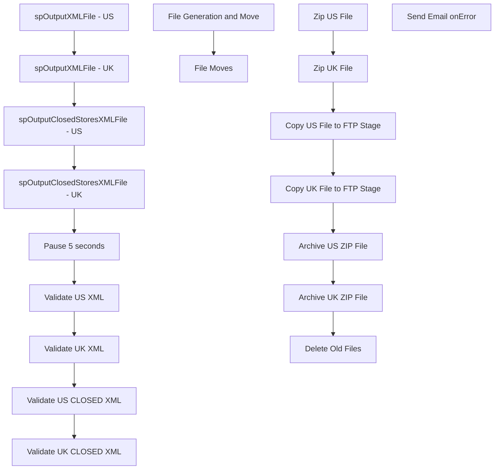

# SSIS Package: ExportStoresPackage

**Project:** WebStores  
**Folder:** SSIS  
**Server:** STL-SSIS-P-01  

## Connection Managers

| Name | Type | Server | Catalog | Connection (sanitized) |
|---|---|---|---|---|
| ClosedStores-UK.xml | FILE |  |  |  |
| ClosedStores-US.xml | FILE |  |  |  |
| Kodiak.BABWMstrData | OLEDB | Kodiak | BABWMstrData | Data Source=Kodiak; Initial Catalog=BABWMstrData; Provider=SQLNCLI11.1; Integrated Security=SSPI; Auto Translate=False |
| SMTP_EMAIL | SMTP |  |  |  |
| SQL_LOG | OLEDB | stl-ssis-p-01 | msdb | Data Source=stl-ssis-p-01; Initial Catalog=msdb; Provider=SQLNCLI11.1; Integrated Security=SSPI; Auto Translate=False |
| STL-SSIS-P-01.IntegrationStaging | OLEDB | STL-SSIS-P-01 | IntegrationStaging | Data Source=STL-SSIS-P-01; Initial Catalog=IntegrationStaging; Provider=SQLNCLI11.1; Integrated Security=SSPI; Auto Translate=False |
| Stores-UK.xml | FILE |  |  |  |
| Stores-UK.zip | FILE |  |  |  |
| Stores-US.xml | FILE |  |  |  |
| Stores-US.zip | FILE |  |  |  |
| Stores.xsd | FILE |  |  |  |

## Control Flow Tasks

| Task | Type |
|---|---|
| ExportStoresPackage | Package |
| File Generation and Move | SEQUENCE |
| Pause 5 seconds | FORLOOP |
| spOutputClosedStoresXMLFile - UK | ExecuteSQLTask |
| spOutputClosedStoresXMLFile - US | ExecuteSQLTask |
| spOutputXMLFile - UK | ExecuteSQLTask |
| spOutputXMLFile - US | ExecuteSQLTask |
| Validate UK CLOSED XML | XMLTask |
| Validate UK XML | XMLTask |
| Validate US CLOSED XML | XMLTask |
| Validate US XML | XMLTask |
| File Moves | SEQUENCE |
| Archive UK ZIP File | FileSystemTask |
| Archive US ZIP File | FileSystemTask |
| Copy UK File to FTP Stage | FileSystemTask |
| Copy US File to FTP Stage | FileSystemTask |
| Delete Old Files | ExecuteSQLTask |
| Zip UK File | ExecuteProcess |
| Zip US File | ExecuteProcess |
| Send Email onError | SendMailTask |

## Control Flow Outline

```text
- Send Email onError [SendMailTask]
- File Generation and Move [SEQUENCE]
  - Pause 5 seconds [FORLOOP]
  - Validate UK CLOSED XML [XMLTask]
  - Validate UK XML [XMLTask]
  - Validate US CLOSED XML [XMLTask]
  - Validate US XML [XMLTask]
  - spOutputClosedStoresXMLFile - UK [ExecuteSQLTask]
  - spOutputClosedStoresXMLFile - US [ExecuteSQLTask]
  - spOutputXMLFile - UK [ExecuteSQLTask]
  - spOutputXMLFile - US [ExecuteSQLTask]
- File Moves [SEQUENCE]
  - Archive UK ZIP File [FileSystemTask]
  - Archive US ZIP File [FileSystemTask]
  - Copy UK File to FTP Stage [FileSystemTask]
  - Copy US File to FTP Stage [FileSystemTask]
  - Delete Old Files [ExecuteSQLTask]
  - Zip UK File [ExecuteProcess]
  - Zip US File [ExecuteProcess]
```

## Architecture Diagram



## Variables

| Namespace | Name | Expression-bound |
|---|---|---|
| System | Propagate | No |
| User | FTPStageDirectory | No |
| User | StoresFileRenameUK | Yes |
| User | StoresFileRenameUS | Yes |
| User | ZipCommandUK | Yes |
| User | ZipCommandUS | Yes |
| User | ZipDestUK | No |
| User | ZipDestUS | No |
| User | ZipSourceUK | No |
| User | ZipSourceUS | No |

### Expression-bound variable values

#### User::StoresFileRenameUK

**Expression:**

```sql
"\\\\STL-SSIS-P-01\\IntegrationStaging\\WEB\\Outbound\\Stores\\Archive\\" + "Stores-UK" + 
(DT_WSTR, 4) YEAR( @[System::ContainerStartTime]  ) +  (DT_WSTR, 2) MONTH( @[System::ContainerStartTime]  ) + (DT_WSTR, 2) DAY( @[System::ContainerStartTime]  ) +  (DT_WSTR, 2) DATEPART("Hh", @[System::ContainerStartTime] ) + (DT_WSTR, 2) DATEPART("mi", @[System::ContainerStartTime] ) + (DT_WSTR, 2) DATEPART("ss", @[System::ContainerStartTime] ) + (DT_WSTR, 2) DATEPART("Ms", @[System::ContainerStartTime] ) + ".zip"
```

**Evaluated value:**

```sql
\\STL-SSIS-P-01\IntegrationStaging\WEB\Outbound\Stores\Archive\Stores-UK201710301051400.zip
```

#### User::StoresFileRenameUS

**Expression:**

```sql
"\\\\STL-SSIS-P-01\\IntegrationStaging\\WEB\\Outbound\\Stores\\Archive\\" + "Stores-US" + 
(DT_WSTR, 4) YEAR( @[System::ContainerStartTime]  ) +  (DT_WSTR, 2) MONTH( @[System::ContainerStartTime]  ) + (DT_WSTR, 2) DAY( @[System::ContainerStartTime]  ) +  (DT_WSTR, 2) DATEPART("Hh", @[System::ContainerStartTime] ) + (DT_WSTR, 2) DATEPART("mi", @[System::ContainerStartTime] ) + (DT_WSTR, 2) DATEPART("ss", @[System::ContainerStartTime] ) + (DT_WSTR, 2) DATEPART("Ms", @[System::ContainerStartTime] ) + ".zip"
```

**Evaluated value:**

```sql
\\STL-SSIS-P-01\IntegrationStaging\WEB\Outbound\Stores\Archive\Stores-US201710301051400.zip
```

#### User::ZipCommandUK

**Expression:**

```sql
"a -tzip \""+ @[User::ZipDestUK]  + "\"  \"" +  @[User::ZipSourceUK]  +"\" -sdel"
```

**Evaluated value:**

```sql
a -tzip "\\STL-SSIS-P-01\IntegrationStaging\WEB\Outbound\Stores\Stores-UK.zip"  "\\STL-SSIS-P-01\IntegrationStaging\WEB\Outbound\Stores\*Stores-UK.xml" -sdel
```

#### User::ZipCommandUS

**Expression:**

```sql
"a -tzip \""+ @[User::ZipDestUS]  + "\"  \"" +  @[User::ZipSourceUS]  +"\" -sdel"
```

**Evaluated value:**

```sql
a -tzip "\\STL-SSIS-P-01\IntegrationStaging\WEB\Outbound\Stores\Stores-US.zip"  "\\STL-SSIS-P-01\IntegrationStaging\WEB\Outbound\Stores\*Stores-US.xml" -sdel
```

## Execute SQL Tasks

### spOutputClosedStoresXMLFile - UK

**Path:** `Package\File Generation and Move\spOutputClosedStoresXMLFile - UK`  
**Connection:** Kodiak.BABWMstrData (Kodiak/BABWMstrData)  

```sql
EXEC [BABWMstrData].[dbo].[spExportClosedStoresXML] @Country = 'UK'
```

### spOutputClosedStoresXMLFile - US

**Path:** `Package\File Generation and Move\spOutputClosedStoresXMLFile - US`  
**Connection:** Kodiak.BABWMstrData (Kodiak/BABWMstrData)  

```sql
EXEC [BABWMstrData].[dbo].[spExportClosedStoresXML] @Country = 'US'
```

### spOutputXMLFile - UK

**Path:** `Package\File Generation and Move\spOutputXMLFile - UK`  
**Connection:** Kodiak.BABWMstrData (Kodiak/BABWMstrData)  

```sql
EXEC [BABWMstrData].[dbo].[spExportStoresXML] @Country = 'UK'
```

### spOutputXMLFile - US

**Path:** `Package\File Generation and Move\spOutputXMLFile - US`  
**Connection:** Kodiak.BABWMstrData (Kodiak/BABWMstrData)  

```sql
EXEC [BABWMstrData].[dbo].[spExportStoresXML] @Country = 'US'
```

### Delete Old Files

**Path:** `Package\File Moves\Delete Old Files`  
**Connection:** STL-SSIS-P-01.IntegrationStaging (STL-SSIS-P-01/IntegrationStaging)  

```sql
exec spDeleteOldFiles @path = '\\STL-SSIS-P-01\IntegrationStaging\WEB\Outbound\Stores\Archive', @filemask = '*.zip', @retention = 14
```

## Data Flow: Sources

_None detected._

## Data Flow: Destinations

_None detected._
