# SSIS Package: ExportStoresPackage

**Project:** WebStores  
**Folder:** SSIS  
**Server:** STL-SSIS-P-01  

## Architecture Diagram

```mermaid
flowchart TD
    subgraph Connections
        ClosedStores_UK_xml_conn(["ClosedStores-UK.xml [FILE]"])
        ClosedStores_US_xml_conn(["ClosedStores-US.xml [FILE]"])
        Kodiak_BABWMstrData_conn(["Kodiak.BABWMstrData [OLEDB]"])
        SMTP_EMAIL_conn(["SMTP_EMAIL [SMTP]"])
        SQL_LOG_conn(["SQL_LOG [OLEDB]"])
        STL_SSIS_P_01_IntegrationStaging_conn(["STL-SSIS-P-01.IntegrationStaging [OLEDB]"])
        Stores_UK_xml_conn(["Stores-UK.xml [FILE]"])
        Stores_UK_zip_conn(["Stores-UK.zip [FILE]"])
        Stores_US_xml_conn(["Stores-US.xml [FILE]"])
        Stores_US_zip_conn(["Stores-US.zip [FILE]"])
        Stores_xsd_conn(["Stores.xsd [FILE]"])
    end
    subgraph ControlFlow
        ExportStoresPackage_task["ExportStoresPackage"]
        File_Generation_and_Move_task["File Generation and Move"]
        ExportStoresPackage_task --> File_Generation_and_Move_task
        Pause_5_seconds_task["Pause 5 seconds"]
        File_Generation_and_Move_task --> Pause_5_seconds_task
        spOutputClosedStoresXMLFile___UK_task["spOutputClosedStoresXMLFile - UK"]
        Pause_5_seconds_task --> spOutputClosedStoresXMLFile___UK_task
        spOutputClosedStoresXMLFile___US_task["spOutputClosedStoresXMLFile - US"]
        spOutputClosedStoresXMLFile___UK_task --> spOutputClosedStoresXMLFile___US_task
        spOutputXMLFile___UK_task["spOutputXMLFile - UK"]
        spOutputClosedStoresXMLFile___US_task --> spOutputXMLFile___UK_task
        spOutputXMLFile___US_task["spOutputXMLFile - US"]
        spOutputXMLFile___UK_task --> spOutputXMLFile___US_task
        Validate_UK_CLOSED_XML_task["Validate UK CLOSED XML"]
        spOutputXMLFile___US_task --> Validate_UK_CLOSED_XML_task
        Validate_UK_XML_task["Validate UK XML"]
        Validate_UK_CLOSED_XML_task --> Validate_UK_XML_task
        Validate_US_CLOSED_XML_task["Validate US CLOSED XML"]
        Validate_UK_XML_task --> Validate_US_CLOSED_XML_task
        Validate_US_XML_task["Validate US XML"]
        Validate_US_CLOSED_XML_task --> Validate_US_XML_task
        File_Moves_task["File Moves"]
        Validate_US_XML_task --> File_Moves_task
        Archive_UK_ZIP_File_task["Archive UK ZIP File"]
        File_Moves_task --> Archive_UK_ZIP_File_task
        Archive_US_ZIP_File_task["Archive US ZIP File"]
        Archive_UK_ZIP_File_task --> Archive_US_ZIP_File_task
        Copy_UK_File_to_FTP_Stage_task["Copy UK File to FTP Stage"]
        Archive_US_ZIP_File_task --> Copy_UK_File_to_FTP_Stage_task
        Copy_US_File_to_FTP_Stage_task["Copy US File to FTP Stage"]
        Copy_UK_File_to_FTP_Stage_task --> Copy_US_File_to_FTP_Stage_task
        Delete_Old_Files_task["Delete Old Files"]
        Copy_US_File_to_FTP_Stage_task --> Delete_Old_Files_task
        Zip_UK_File_task["Zip UK File"]
        Delete_Old_Files_task --> Zip_UK_File_task
        Zip_US_File_task["Zip US File"]
        Zip_UK_File_task --> Zip_US_File_task
        Send_Email_onError_task["Send Email onError"]
        Zip_US_File_task --> Send_Email_onError_task
    end
```

## Connection Managers

| Name | Type |
|---|---|
| ClosedStores-UK.xml | FILE |
| ClosedStores-US.xml | FILE |
| Kodiak.BABWMstrData | OLEDB |
| SMTP_EMAIL | SMTP |
| SQL_LOG | OLEDB |
| STL-SSIS-P-01.IntegrationStaging | OLEDB |
| Stores-UK.xml | FILE |
| Stores-UK.zip | FILE |
| Stores-US.xml | FILE |
| Stores-US.zip | FILE |
| Stores.xsd | FILE |

## Control Flow Tasks

| Task | Type |
|---|---|
| ExportStoresPackage | Microsoft.Package |
| File Generation and Move | STOCK:SEQUENCE |
| Pause 5 seconds | STOCK:FORLOOP |
| spOutputClosedStoresXMLFile - UK | Microsoft.ExecuteSQLTask |
| spOutputClosedStoresXMLFile - US | Microsoft.ExecuteSQLTask |
| spOutputXMLFile - UK | Microsoft.ExecuteSQLTask |
| spOutputXMLFile - US | Microsoft.ExecuteSQLTask |
| Validate UK CLOSED XML | Microsoft.XMLTask |
| Validate UK XML | Microsoft.XMLTask |
| Validate US CLOSED XML | Microsoft.XMLTask |
| Validate US XML | Microsoft.XMLTask |
| File Moves | STOCK:SEQUENCE |
| Archive UK ZIP File | Microsoft.FileSystemTask |
| Archive US ZIP File | Microsoft.FileSystemTask |
| Copy UK File to FTP Stage | Microsoft.FileSystemTask |
| Copy US File to FTP Stage | Microsoft.FileSystemTask |
| Delete Old Files | Microsoft.ExecuteSQLTask |
| Zip UK File | Microsoft.ExecuteProcess |
| Zip US File | Microsoft.ExecuteProcess |
| Send Email onError | Microsoft.SendMailTask |

## Data Flow: Sources

_None detected._

## Data Flow: Destinations

_None detected._

