# SSIS Package: WebToESOrderQty

**Project:** WebToESOrderQty  
**Folder:** SSIS  
**Server:** STL-SSIS-P-01  

## Architecture Diagram

```mermaid
flowchart TD
    subgraph Connections
        ESELL_conn(["ESELL [OLEDB]"])
        IntegrationStaging_conn(["IntegrationStaging [OLEDB]"])
        SMTP_conn(["SMTP [SMTP]"])
        WebOrderQtyCSV_conn(["WebOrderQtyCSV [FLATFILE]"])
        WM_conn(["WM [OLEDB]"])
    end
    subgraph ControlFlow
        WebToESOrderQty_task["WebToESOrderQty"]
        Load_Data_From_File_task["Load Data From File"]
        WebToESOrderQty_task --> Load_Data_From_File_task
        Foreach_Loop_Container_task["Foreach Loop Container"]
        Load_Data_From_File_task --> Foreach_Loop_Container_task
        Archive_File_task["Archive File"]
        Foreach_Loop_Container_task --> Archive_File_task
        WebOrderQtyCSV_Dataflow_task["WebOrderQtyCSV Dataflow"]
        Archive_File_task --> WebOrderQtyCSV_Dataflow_task
        spMergeWebOrderQtyToEnterpriseSelling_task["spMergeWebOrderQtyToEnterpriseSelling"]
        WebOrderQtyCSV_Dataflow_task --> spMergeWebOrderQtyToEnterpriseSelling_task
        Truncate_Stage_task["Truncate Stage"]
        spMergeWebOrderQtyToEnterpriseSelling_task --> Truncate_Stage_task
        Set_TransmittedDate_task["Set TransmittedDate"]
        Truncate_Stage_task --> Set_TransmittedDate_task
        Set_TransmitDate_on_SFCC_data_task["Set TransmitDate on SFCC data"]
        Set_TransmittedDate_task --> Set_TransmitDate_on_SFCC_data_task
        Set_TransmitDate_on_WM_task["Set TransmitDate on WM"]
        Set_TransmitDate_on_SFCC_data_task --> Set_TransmitDate_on_WM_task
        Stage_to_Enterprise_Selling_task["Stage to Enterprise Selling"]
        Set_TransmitDate_on_WM_task --> Stage_to_Enterprise_Selling_task
        Merge_Update_ES_task["Merge Update ES"]
        Stage_to_Enterprise_Selling_task --> Merge_Update_ES_task
        PreStage_OrderQty_to_ES_task["PreStage OrderQty to ES"]
        Merge_Update_ES_task --> PreStage_OrderQty_to_ES_task
        Truncate_Stage_task["Truncate Stage"]
        PreStage_OrderQty_to_ES_task --> Truncate_Stage_task
        Send_Mail_Task_task["Send Mail Task"]
        Truncate_Stage_task --> Send_Mail_Task_task
    end
```

## Connection Managers

| Name | Type |
|---|---|
| ESELL | OLEDB |
| IntegrationStaging | OLEDB |
| SMTP | SMTP |
| WebOrderQtyCSV | FLATFILE |
| WM | OLEDB |

## Control Flow Tasks

| Task | Type |
|---|---|
| WebToESOrderQty | Microsoft.Package |
| Load Data From File | STOCK:SEQUENCE |
| Foreach Loop Container | STOCK:FOREACHLOOP |
| Archive File | Microsoft.FileSystemTask |
| WebOrderQtyCSV Dataflow | Microsoft.Pipeline |
| spMergeWebOrderQtyToEnterpriseSelling | Microsoft.ExecuteSQLTask |
| Truncate Stage | Microsoft.ExecuteSQLTask |
| Set TransmittedDate | STOCK:SEQUENCE |
| Set TransmitDate on SFCC data | Microsoft.ExecuteSQLTask |
| Set TransmitDate on WM | Microsoft.Pipeline |
| Stage to Enterprise Selling | STOCK:SEQUENCE |
| Merge Update ES | Microsoft.ExecuteSQLTask |
| PreStage OrderQty to ES | Microsoft.Pipeline |
| Truncate Stage | Microsoft.ExecuteSQLTask |
| Send Mail Task | Microsoft.SendMailTask |

## Data Flow: Sources

| Component | SQL Preview |
|---|---|
|  | update WebUnselectedOrderQtyStage set TransmitDate = getdate() where ID = ? |
|  | select ID  from WEB.WebToESProcessControl  where DataSource = 'WM' |
|  | select  ID, 	case  		when Site = 'US'  			then 'U0013'  		when Site = 'UK' 			then 'G2013' 	end as OutletID, 	SKU as Style, 	 OrderQty, 'SFCC' as DataSource from web.WebOrderQtyToEnterpriseSelling  where TransmitDate is NULL order by ID |
|  | select ID,  'U0013' as OutletID, Style, OrderQty, 'WM' as DataSource from WebUnselectedOrderQtyStage where TransmitDate is NULL  order by ID |

## Data Flow: Destinations

| Component | Destination |
|---|---|
|  | [WEB].[WebOrderQtyStage] |
|  | [WebOrderQtyStage] |
|  | [WEB].[WebToESProcessControl] |

