# SSIS Package: WebToESOrderQty

**Project:** WebToESOrderQty  
**Folder:** SSIS  
**Server:** STL-SSIS-P-01  

## Connection Managers

| Name | Type | Server | Catalog | Connection (sanitized) |
|---|---|---|---|---|
| ESELL | OLEDB | bedrocktestdb02 | esell | Data Source=bedrocktestdb02; Initial Catalog=esell; Provider=SQLNCLI11.1; Integrated Security=SSPI; Auto Translate=False |
| IntegrationStaging | OLEDB | STL-SSIS-P-01 | IntegrationStaging | Data Source=STL-SSIS-P-01; Initial Catalog=IntegrationStaging; Provider=SQLNCLI11.1; Integrated Security=SSPI; Auto Translate=False |
| SMTP | SMTP |  |  |  |
| WM | OLEDB | wmdb01 | WMPROD | Data Source=wmdb01; Initial Catalog=WMPROD; Provider=SQLNCLI10.1; Integrated Security=SSPI; Application Name=SSIS-WebToESOrderQty-{2B877089-8EE3-4700-B84E-07541C65138F}wmdb01.WMPROD; Auto Translate=False |
| WebOrderQtyCSV | FLATFILE |  |  |  |

## Control Flow Tasks

| Task | Type |
|---|---|
| WebToESOrderQty | Package |
| Load Data From File | SEQUENCE |
| Foreach Loop Container | FOREACHLOOP |
| Archive File | FileSystemTask |
| WebOrderQtyCSV Dataflow | Pipeline |
| spMergeWebOrderQtyToEnterpriseSelling | ExecuteSQLTask |
| Truncate Stage | ExecuteSQLTask |
| Set TransmittedDate | SEQUENCE |
| Set TransmitDate on SFCC data | ExecuteSQLTask |
| Set TransmitDate on WM | Pipeline |
| Stage to Enterprise Selling | SEQUENCE |
| Merge Update ES | ExecuteSQLTask |
| PreStage OrderQty to ES | Pipeline |
| Truncate Stage | ExecuteSQLTask |
| Send Mail Task | SendMailTask |

## Control Flow Outline

```text
- Send Mail Task [SendMailTask]
- Load Data From File [SEQUENCE]
  - Foreach Loop Container [FOREACHLOOP]
    - Archive File [FileSystemTask]
    - WebOrderQtyCSV Dataflow [Pipeline]
  - Truncate Stage [ExecuteSQLTask]
  - spMergeWebOrderQtyToEnterpriseSelling [ExecuteSQLTask]
- Set TransmittedDate [SEQUENCE]
  - Set TransmitDate on SFCC data [ExecuteSQLTask]
  - Set TransmitDate on WM [Pipeline]
- Stage to Enterprise Selling [SEQUENCE]
  - Merge Update ES [ExecuteSQLTask]
  - PreStage OrderQty to ES [Pipeline]
  - Truncate Stage [ExecuteSQLTask]
```

## Architecture Diagram

```mermaid
flowchart TD
    n_Package_Load_Data_From_File["Load Data From File"]
    n_Package_Load_Data_From_File_Foreach_Loop_Container["Foreach Loop Container"]
    n_Package_Load_Data_From_File_Foreach_Loop_Container_Archive_File["Archive File"]
    n_Package_Load_Data_From_File_Foreach_Loop_Container_WebOrderQtyCSV_Dataflow["WebOrderQtyCSV Dataflow"]
    n_Package_Load_Data_From_File_spMergeWebOrderQtyToEnterpriseSelling["spMergeWebOrderQtyToEnterpriseSelling"]
    n_Package_Load_Data_From_File_Truncate_Stage["Truncate Stage"]
    n_Package_Set_TransmittedDate["Set TransmittedDate"]
    n_Package_Set_TransmittedDate_Set_TransmitDate_on_SFCC_data["Set TransmitDate on SFCC data"]
    n_Package_Set_TransmittedDate_Set_TransmitDate_on_WM["Set TransmitDate on WM"]
    n_Package_Stage_to_Enterprise_Selling["Stage to Enterprise Selling"]
    n_Package_Stage_to_Enterprise_Selling_Merge_Update_ES["Merge Update ES"]
    n_Package_Stage_to_Enterprise_Selling_PreStage_OrderQty_to_ES["PreStage OrderQty to ES"]
    n_Package_Stage_to_Enterprise_Selling_Truncate_Stage["Truncate Stage"]
    n_Package_EventHandlers_OnError__Send_Mail_Task["Send Mail Task"]
    n_Package_Load_Data_From_File_Foreach_Loop_Container_WebOrderQtyCSV_Dataflow --> n_Package_Load_Data_From_File_Foreach_Loop_Container_Archive_File
    n_Package_Load_Data_From_File_Truncate_Stage --> n_Package_Load_Data_From_File_Foreach_Loop_Container
    n_Package_Load_Data_From_File_Foreach_Loop_Container --> n_Package_Load_Data_From_File_spMergeWebOrderQtyToEnterpriseSelling
    n_Package_Set_TransmittedDate_Set_TransmitDate_on_SFCC_data --> n_Package_Set_TransmittedDate_Set_TransmitDate_on_WM
    n_Package_Stage_to_Enterprise_Selling_Truncate_Stage --> n_Package_Stage_to_Enterprise_Selling_PreStage_OrderQty_to_ES
    n_Package_Stage_to_Enterprise_Selling_PreStage_OrderQty_to_ES --> n_Package_Stage_to_Enterprise_Selling_Merge_Update_ES
    n_Package_Load_Data_From_File --> n_Package_Stage_to_Enterprise_Selling
    n_Package_Stage_to_Enterprise_Selling --> n_Package_Set_TransmittedDate
```



## Variables

| Namespace | Name | Expression-bound |
|---|---|---|
| System | Propagate | No |
| User | DateTimeStamp | Yes |
| User | EndDate | Yes |
| User | EndDateAsDATE | Yes |
| User | GetDate | Yes |
| User | GetDateAsDATE | Yes |
| User | StartDate | Yes |
| User | StartDateAsDATE | Yes |
| User | WebOrderQtyCSVArchive | Yes |
| User | WebOrderQtyCSVFileName | No |

### Expression-bound variable values

#### User::DateTimeStamp

**Expression:**

```sql
(DT_WSTR,4)DATEPART("yyyy",GetDate()) 
+ (DT_WSTR,4)DATEPART("mm",GetDate()) 
+ (DT_WSTR,4)DATEPART("dd",GetDate()) 
+ (DT_WSTR,4)DATEPART("hh",GetDate()) 
+ (DT_WSTR,4)DATEPART("mi",GetDate()) 
+ (DT_WSTR,4)DATEPART("ss",GetDate()) 
+ (DT_WSTR,4)DATEPART("ms",GetDate())
```

**Evaluated value:**

```sql
2018111913643510
```

#### User::EndDate

**Expression:**

```sql
dateadd("dd", @[$Package::DaysToInclude], @[User::StartDate])
```

**Evaluated value:**

```sql
11/19/2018
```

#### User::EndDateAsDATE

**Expression:**

```sql
(DT_WSTR, 4) datepart("year", @[User::EndDate])  + "-" + 
(DT_WSTR, 2) datepart("mm", @[User::EndDate])  + "-" + 
(DT_WSTR, 2) datepart("dd",  @[User::EndDate])
```

**Evaluated value:**

```sql
2018-11-19
```

#### User::GetDate

**Expression:**

```sql
(DT_DATE)DATEDIFF("Day", (DT_DATE) 0, GETDATE())
```

**Evaluated value:**

```sql
11/19/2018
```

#### User::GetDateAsDATE

**Expression:**

```sql
(DT_WSTR, 4) datepart("year", @[User::GetDate])  + "-" + 
(DT_WSTR, 2) datepart("mm", @[User::GetDate])  + "-" + 
(DT_WSTR, 2) datepart("dd",  @[User::GetDate])
```

**Evaluated value:**

```sql
2018-11-19
```

#### User::StartDate

**Expression:**

```sql
dateadd("dd", -@[$Package::DaysToGoBack] , @[User::GetDate] )
```

**Evaluated value:**

```sql
11/18/2018
```

#### User::StartDateAsDATE

**Expression:**

```sql
(DT_WSTR, 4) datepart("year", @[User::StartDate])  + "-" + 
(DT_WSTR, 2) datepart("mm", @[User::StartDate])  + "-" + 
(DT_WSTR, 2) datepart("dd",  @[User::StartDate])
```

**Evaluated value:**

```sql
2018-11-18
```

#### User::WebOrderQtyCSVArchive

**Expression:**

```sql
@[$Package::WebOrderCSVFilePath] + "Archive\\"
```

**Evaluated value:**

```sql
\\stl-sftp-p-01\ecommerce\to-bab\from-SFCC\WebOnOrder\Archive\
```

## Execute SQL Tasks

### Truncate Stage

**Path:** `Package\Load Data From File\Truncate Stage`  
**Connection:** IntegrationStaging (STL-SSIS-P-01/IntegrationStaging)  

```sql
TRUNCATE TABLE WEB.WebOrderQtyStage
TRUNCATE TABLE WEB.WebToESProcessControl
```

### spMergeWebOrderQtyToEnterpriseSelling

**Path:** `Package\Load Data From File\spMergeWebOrderQtyToEnterpriseSelling`  
**Connection:** IntegrationStaging (STL-SSIS-P-01/IntegrationStaging)  

```sql
exec WEB.spMergeWebOrderQtyToEnterpriseSelling 
```

### Set TransmitDate on SFCC data

**Path:** `Package\Set TransmittedDate\Set TransmitDate on SFCC data`  
**Connection:** IntegrationStaging (STL-SSIS-P-01/IntegrationStaging)  

```sql
update WEB.WebOrderQtyToEnterpriseSelling 
set TransmitDate = getdate()
where TransmitDate is NULL 
and ID in (select ID from WEB.WebToESProcessControl where DataSource = 'SFCC')

```

### Merge Update ES

**Path:** `Package\Stage to Enterprise Selling\Merge Update ES`  
**Connection:** ESELL (bedrocktestdb02/esell)  

```sql
EXEC spMergeEnterpriseSellingWebOrderQty 
```

### Truncate Stage

**Path:** `Package\Stage to Enterprise Selling\Truncate Stage`  
**Connection:** ESELL (bedrocktestdb02/esell)  

```sql
TRUNCATE TABLE WebOrderQtyStage
```

## Data Flow: Sources

| Component | Source Object | Type | Data Flow Task | Connection | SQL Kind |
|---|---|---|---|---|---|
| WebOrderQtyCSV |  | FlatFileSource | WebOrderQtyCSV Dataflow | WebOrderQtyCSV |  |
| WebToESProcessControl  - DataSource WM |  | OLEDBSource | Set TransmitDate on WM | IntegrationStaging | SqlCommand |
| WebOrderQtyToEnterpriseSelling |  | OLEDBSource | PreStage OrderQty to ES | IntegrationStaging | SqlCommand |
| WebUnselectedOrderQtyStage |  | OLEDBSource | PreStage OrderQty to ES | WM | SqlCommand |

#### WebToESProcessControl  - DataSource WM — SqlCommand

```sql
select ID 
from WEB.WebToESProcessControl 
where DataSource = 'WM'
```

#### WebOrderQtyToEnterpriseSelling — SqlCommand

```sql
select  ID,
	case 
		when Site = 'US' 
			then 'U0013' 
		when Site = 'UK'
			then 'G2013'
	end as OutletID,
	SKU as Style,
	 OrderQty,
'SFCC' as DataSource
from web.WebOrderQtyToEnterpriseSelling 
where TransmitDate is NULL
order by ID
```

#### WebUnselectedOrderQtyStage — SqlCommand

```sql
select ID,  'U0013' as OutletID, Style, OrderQty, 'WM' as DataSource
from WebUnselectedOrderQtyStage
where TransmitDate is NULL 
order by ID
```

## Data Flow: Destinations

| Component | Target Table | Type | Data Flow Task | Connection | SQL Kind |
|---|---|---|---|---|---|
| WebOrderQtyStage |  | OLEDBDestination | WebOrderQtyCSV Dataflow | IntegrationStaging |  |
| WebOrderQtyStage |  | OLEDBDestination | PreStage OrderQty to ES | ESELL |  |
| WebToESProcessControl |  | OLEDBDestination | PreStage OrderQty to ES | IntegrationStaging |  |
