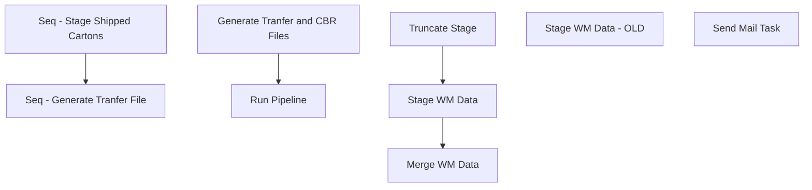

# SSIS Package: WebToStoreTransferAndReceipts

**Project:** WebToStoreTransferAndReceipts  
**Folder:** SSIS  
**Server:** STL-SSIS-P-01  

## Connection Managers

| Name | Type | Server | Catalog | Connection (sanitized) |
|---|---|---|---|---|
| BABWPartyPlanner | OLEDB | bearcluster01.sql.buildabear.com | BABWPartyPlanner | Data Source=bearcluster01.sql.buildabear.com; Initial Catalog=BABWPartyPlanner; Provider=SQLNCLI11.1; Integrated Security=SSPI; Auto Translate=False |
| IntegrationStaging | OLEDB | STL-SSIS-P-01 | IntegrationStaging | Data Source=STL-SSIS-P-01; Initial Catalog=IntegrationStaging; Provider=SQLNCLI11.1; Integrated Security=SSPI; Auto Translate=False |
| PipelineServer | OLEDB | pipeapp01 | master | Data Source=pipeapp01; Initial Catalog=master; Provider=SQLNCLI11.1; Integrated Security=SSPI; Auto Translate=False |
| SMTP | SMTP |  |  |  |
| WM | OLEDB | wmdb01 | wmprod | Data Source=wmdb01; Initial Catalog=wmprod; Provider=SQLNCLI10.1; Integrated Security=SSPI; Auto Translate=False; Application Name=SSIS-WebToStoreTransferAndReceipts-{7F7F0FE9-A443-4FCF-82B5-63B33DCBA20E}wmdbtest.PKMSTEST |
| WebOrderProcessing | OLEDB | bearcluster01.sql.buildabear.com | WebOrderProcessing | Data Source=bearcluster01.sql.buildabear.com; Initial Catalog=WebOrderProcessing; Provider=SQLNCLI11.1; Integrated Security=SSPI; Auto Translate=False |
| me_01 | OLEDB | bedrockdb02 | me_01 | Data Source=bedrockdb02; Initial Catalog=me_01; Provider=SQLNCLI11.1; Integrated Security=SSPI; Auto Translate=False |

## Control Flow Tasks

| Task | Type |
|---|---|
| WebToStoreTransferAndReceipts | Package |
| Seq - Generate Tranfer File | SEQUENCE |
| Generate Tranfer and CBR Files | ExecuteSQLTask |
| Run Pipeline | ExecuteSQLTask |
| Seq - Stage Shipped Cartons | SEQUENCE |
| Merge WM Data | ExecuteSQLTask |
| Stage WM Data | Pipeline |
| Truncate Stage | ExecuteSQLTask |
| Stage WM Data - OLD | Pipeline |
| Send Mail Task | SendMailTask |

## Control Flow Outline

```text
- Send Mail Task [SendMailTask]
- Seq - Generate Tranfer File [SEQUENCE]
  - Generate Tranfer and CBR Files [ExecuteSQLTask]
  - Run Pipeline [ExecuteSQLTask]
- Seq - Stage Shipped Cartons [SEQUENCE]
  - Merge WM Data [ExecuteSQLTask]
  - Stage WM Data [Pipeline]
  - Truncate Stage [ExecuteSQLTask]
- Stage WM Data - OLD [Pipeline]
```

## Architecture Diagram



## Variables

| Namespace | Name | Expression-bound |
|---|---|---|
| System | Propagate | No |
| User | DateTimeStamp | Yes |
| User | EndDate | Yes |
| User | EndDateAsDATE | Yes |
| User | GetDate | Yes |
| User | GetDateAsDATE | Yes |
| User | StartDate | Yes |
| User | StartDateAsDATE | Yes |

### Expression-bound variable values

#### User::DateTimeStamp

**Expression:**

```sql
(DT_WSTR,4)DATEPART("yyyy",GetDate()) 
+ (DT_WSTR,4)DATEPART("mm",GetDate()) 
+ (DT_WSTR,4)DATEPART("dd",GetDate()) 
+ (DT_WSTR,4)DATEPART("hh",GetDate()) 
+ (DT_WSTR,4)DATEPART("mi",GetDate()) 
+ (DT_WSTR,4)DATEPART("ss",GetDate()) 
+ (DT_WSTR,4)DATEPART("ms",GetDate())
```

**Evaluated value:**

```sql
20225280583340
```

#### User::EndDate

**Expression:**

```sql
dateadd("dd", @[$Package::DaysToInclude], @[User::StartDate])
```

**Evaluated value:**

```sql
5/28/2022
```

#### User::EndDateAsDATE

**Expression:**

```sql
(DT_WSTR, 4) datepart("year", @[User::EndDate])  + "-" + 
(DT_WSTR, 2) datepart("mm", @[User::EndDate])  + "-" + 
(DT_WSTR, 2) datepart("dd",  @[User::EndDate])
```

**Evaluated value:**

```sql
2022-5-28
```

#### User::GetDate

**Expression:**

```sql
(DT_DATE)DATEDIFF("Day", (DT_DATE) 0, GETDATE())
```

**Evaluated value:**

```sql
5/28/2022
```

#### User::GetDateAsDATE

**Expression:**

```sql
(DT_WSTR, 4) datepart("year", @[User::GetDate])  + "-" + 
(DT_WSTR, 2) datepart("mm", @[User::GetDate])  + "-" + 
(DT_WSTR, 2) datepart("dd",  @[User::GetDate])
```

**Evaluated value:**

```sql
2022-5-28
```

#### User::StartDate

**Expression:**

```sql
dateadd("dd", -@[$Package::DaysToGoBack] , @[User::GetDate] )
```

**Evaluated value:**

```sql
5/27/2022
```

#### User::StartDateAsDATE

**Expression:**

```sql
(DT_WSTR, 4) datepart("year", @[User::StartDate])  + "-" + 
(DT_WSTR, 2) datepart("mm", @[User::StartDate])  + "-" + 
(DT_WSTR, 2) datepart("dd",  @[User::StartDate])
```

**Evaluated value:**

```sql
2022-5-27
```

## Execute SQL Tasks

### Generate Tranfer and CBR Files

**Path:** `Package\Seq - Generate Tranfer File\Generate Tranfer and CBR Files`  
**Connection:** IntegrationStaging (STL-SSIS-P-01/IntegrationStaging)  

> ⚠️ `SqlStatementSource` is overridden at runtime by a property expression (shown below); the static SQL may not be what executes.

**Static SqlStatementSource:**

```sql
exec WEB.spExportFileGirlScoutWebToStorePipelineTransferData 'pipeapp01'
```

**Property expression (runtime override):**

```sql
"exec WEB.spExportFileGirlScoutWebToStorePipelineTransferData '" +  @[$Package::Pipeline_ServerName] + "'"
```

### Run Pipeline

**Path:** `Package\Seq - Generate Tranfer File\Run Pipeline`  
**Connection:** PipelineServer (pipeapp01/master)  

```sql
EXEC xp_cmdshell 'PipelineScheduleClient Start 16002 0'
EXEC xp_cmdshell 'PipelineScheduleClient Start 19000 0'
```

### Merge WM Data

**Path:** `Package\Seq - Stage Shipped Cartons\Merge WM Data`  
**Connection:** IntegrationStaging (STL-SSIS-P-01/IntegrationStaging)  

```sql
exec WEB.spMergeWMShippedCartons
```

### Truncate Stage

**Path:** `Package\Seq - Stage Shipped Cartons\Truncate Stage`  
**Connection:** IntegrationStaging (STL-SSIS-P-01/IntegrationStaging)  

```sql
TRUNCATE TABLE WEB.WMShippedCartonsStage
```

## Data Flow: Sources

| Component | Source Object | Type | Data Flow Task | Connection | SQL Kind |
|---|---|---|---|---|---|
| WM Shipped Cartons |  | OLEDBSource | Stage WM Data | WebOrderProcessing | SqlCommand |
| WM Shipped Cartons |  | OLEDBSource | Stage WM Data - OLD | WM | SqlCommand |

#### WM Shipped Cartons — SqlCommand

```sql
with 
Shipments as
	(
		SELECT 
			o.OrderType as ord_type, 
			substring(o.ShipToLName, charindex('BuildaBear - ', o.ShipToLName)+13, 4) as ShipTo,
			'' as carton_nbr, --- need to get carton nuber
			oi.sku as style,
			oi.ItemDescription as sku_desc,
			sum(qty) as qty,
			os.StatusDate as ship_date_time,
			O.OrderNum as WebOrderNumber,
			'GirlScout' as PartyType,
			o.ShippingMethod as ship_via_desc,
			oi.TrackingNumber as trkg_nbr
		FROM  WM.OrderItems oi
		join WM.Orders O ON oi.OrderId = o.OrderId
		join WM.OrderStatus os on oi.OrderID=os.OrderID and os.CurrentStatus=1
		left join babwPartyPlanner.dbo.PartyEnterpriseSellingXref x on o.Orderid = x.Orderid
		left join babwpartyplanner.dbo.party p on x.partyid = p.partyid
		left join babwpartyplanner.dbo.Customer c on p.customerid = c.customerid
		left join BABWPartyPlanner.dbo.Event E on P.EventID = E.EventID
		---WHERE O.OrderNum = '70063928_1'
		where os.Status = 'Shipped'
		and substring(O.OrderNum, 9, 1) = '_'
		and o.ShipToLName like '%buildaBear%'
		and datediff(dd, os.StatusDate, getdate()) <= 1
		and isnumeric(substring(o.ShipToLName, charindex('BuildaBear - ', o.ShipToLName)+13, 4)) = 1
		group by 
			o.OrderType,
			substring(o.ShipToLName, charindex('BuildaBear - ', o.ShipToLName)+13, 4),
			oi.sku,
			oi.ItemDescription,
			os.StatusDate,
			o.OrderNum,
			o.ShippingMethod,
			oi.TrackingNumber
	)
select
	ord_type,
	ShipTo,
	concat(ShipTo, Style, replace(cast(ship_date_time as date),'-','')) as carton_nbr, 
	style,
	sku_desc,
	qty,
	ship_date_time,
	WebOrderNumber,
	PartyType,
	ship_via_desc,
	trkg_nbr
from Shipments
```

#### WM Shipped Cartons — SqlCommand

```sql
select 
	ph.ord_type,
	substring(shipto_name, charindex('BuildaBear - ', ph.shipto_name)+13, 4) as ShipTo,
	cd.carton_nbr,
	cd.style,
	im.sku_desc,
	sum(cd.units_pakd) Qty,
	ch.create_date_time as ship_date_time,
ph.pkt_ctrl_nbr as WebOrderNumber,
'GirlScout' as PartyType,
sv.ship_via_desc,
ch.trkg_nbr
from outpt_carton_dtl cd with (nolock)
join pkt_hdr ph with (nolock) on cd.pkt_ctrl_nbr = ph.pkt_ctrl_nbr
join outpt_carton_hdr ch with (nolock) on cd.carton_nbr = ch.carton_nbr
join outpt_pkt_hdr oph with (nolock) on ph.pkt_ctrl_nbr = oph.pkt_ctrl_nbr
join item_master im with (nolock) on cd.style = im.style 
join ship_via sv with (nolock) on ch.ship_via = sv.ship_via
where substring(ph.pkt_ctrl_nbr, 9, 1) = '_'
and ph.shipto_name like '%buildaBear%'
and datediff(dd, cd.create_date_time, getdate()) <= 7
and isnumeric(substring(shipto_name, charindex('BuildaBear - ', ph.shipto_name)+13, 4)) = 1
group by 
	ph.ord_type,
	substring(shipto_name, charindex('BuildaBear - ', ph.shipto_name)+13, 4),
	cd.carton_nbr,
	cd.style,
	im.sku_desc,
	ch.create_date_time,
	ph.pkt_ctrl_nbr,
	sv.ship_via_desc,
	ch.trkg_nbr
```

## Data Flow: Destinations

| Component | Target Table | Type | Data Flow Task | Connection | SQL Kind |
|---|---|---|---|---|---|
| WMShippedCartonsStage |  | OLEDBDestination | Stage WM Data | IntegrationStaging |  |
| WMShippedCartonsStage |  | OLEDBDestination | Stage WM Data - OLD | IntegrationStaging |  |
