# SSIS Package: ShopperTrackFactETL

**Project:** ShopperTrackFactETL  
**Folder:** ShopperTrak  
**Server:** STL-SSIS-P-01  

## Connection Managers

| Name | Type | Server | Catalog | Connection (sanitized) |
|---|---|---|---|---|
| DW | OLEDB | papamart | dw | Data Source=papamart; Initial Catalog=dw; Provider=SQLNCLI11.1; Integrated Security=SSPI; Auto Translate=False |
| DWStaging | OLEDB | papamart | DWStaging | Data Source=papamart; Initial Catalog=DWStaging; Provider=SQLNCLI11.1; Integrated Security=SSPI; Auto Translate=False |
| ShopperTrakSourceFile | FLATFILE |  |  |  |

## Control Flow Tasks

| Task | Type |
|---|---|
| ShopperTrackFactETL | Package |
| Exec Control Merge and  SFTP Fille Pull | SEQUENCE |
| Traffic Contral Table Merge | ExecuteSQLTask |
| WinSCP - Get files and Archive | ExecuteProcess |
| Send Mail Task | SendMailTask |
| Stage and Merge Data | SEQUENCE |
| Foreach Loop - Foreach Shopper Trak File | FOREACHLOOP |
| DFT - ShopperTrak File to ShopperTrackStage | Pipeline |
| Execute SQL  - Merge to ShopperTrackFact | ExecuteSQLTask |
| Move ShopperTrak File to Archive | FileSystemTask |
| Reload HasTraffic | ExecuteSQLTask |
| Truncate Staging Tables | ExecuteSQLTask |
| Send Mail Task | SendMailTask |

## Control Flow Outline

```text
- Send Mail Task [SendMailTask]
- Exec Control Merge and  SFTP Fille Pull [SEQUENCE]
  - Traffic Contral Table Merge [ExecuteSQLTask]
  - WinSCP - Get files and Archive [ExecuteProcess]
    - Send Mail Task [SendMailTask]
- Stage and Merge Data [SEQUENCE]
  - Foreach Loop - Foreach Shopper Trak File [FOREACHLOOP]
    - DFT - ShopperTrak File to ShopperTrackStage [Pipeline]
    - Execute SQL  - Merge to ShopperTrackFact [ExecuteSQLTask]
    - Move ShopperTrak File to Archive [FileSystemTask]
  - Reload HasTraffic [ExecuteSQLTask]
  - Truncate Staging Tables [ExecuteSQLTask]
```

## Architecture Diagram

```mermaid
flowchart TD
    n_Package_Exec_Control_Merge_and__SFTP_Fille_Pull["Exec Control Merge and  SFTP Fille Pull"]
    n_Package_Exec_Control_Merge_and__SFTP_Fille_Pull_Traffic_Contral_Table_Merge["Traffic Contral Table Merge"]
    n_Package_Exec_Control_Merge_and__SFTP_Fille_Pull_WinSCP___Get_files_and_Archive["WinSCP - Get files and Archive"]
    n_Package_Exec_Control_Merge_and__SFTP_Fille_Pull_WinSCP___Get_files_and_Archive_EventHandlers_OnError__Send_Mail_Task["Send Mail Task"]
    n_Package_Stage_and_Merge_Data["Stage and Merge Data"]
    n_Package_Stage_and_Merge_Data_Foreach_Loop___Foreach_Shopper_Trak_File["Foreach Loop - Foreach Shopper Trak File"]
    n_Package_Stage_and_Merge_Data_Foreach_Loop___Foreach_Shopper_Trak_File_DFT___ShopperTrak_File_to_ShopperTrackStage["DFT - ShopperTrak File to ShopperTrackStage"]
    n_Package_Stage_and_Merge_Data_Foreach_Loop___Foreach_Shopper_Trak_File_Execute_SQL____Merge_to_ShopperTrackFact["Execute SQL  - Merge to ShopperTrackFact"]
    n_Package_Stage_and_Merge_Data_Foreach_Loop___Foreach_Shopper_Trak_File_Move_ShopperTrak_File_to_Archive["Move ShopperTrak File to Archive"]
    n_Package_Stage_and_Merge_Data_Reload_HasTraffic["Reload HasTraffic"]
    n_Package_Stage_and_Merge_Data_Truncate_Staging_Tables["Truncate Staging Tables"]
    n_Package_EventHandlers_OnError__Send_Mail_Task["Send Mail Task"]
    n_Package_Exec_Control_Merge_and__SFTP_Fille_Pull_Traffic_Contral_Table_Merge --> n_Package_Exec_Control_Merge_and__SFTP_Fille_Pull_WinSCP___Get_files_and_Archive
    n_Package_Stage_and_Merge_Data_Foreach_Loop___Foreach_Shopper_Trak_File_DFT___ShopperTrak_File_to_ShopperTrackStage --> n_Package_Stage_and_Merge_Data_Foreach_Loop___Foreach_Shopper_Trak_File_Move_ShopperTrak_File_to_Archive
    n_Package_Stage_and_Merge_Data_Foreach_Loop___Foreach_Shopper_Trak_File_Move_ShopperTrak_File_to_Archive --> n_Package_Stage_and_Merge_Data_Foreach_Loop___Foreach_Shopper_Trak_File_Execute_SQL____Merge_to_ShopperTrackFact
    n_Package_Stage_and_Merge_Data_Truncate_Staging_Tables --> n_Package_Stage_and_Merge_Data_Foreach_Loop___Foreach_Shopper_Trak_File
    n_Package_Stage_and_Merge_Data_Foreach_Loop___Foreach_Shopper_Trak_File --> n_Package_Stage_and_Merge_Data_Reload_HasTraffic
    n_Package_Exec_Control_Merge_and__SFTP_Fille_Pull --> n_Package_Stage_and_Merge_Data
```



## Variables

| Namespace | Name | Expression-bound |
|---|---|---|
| System | Propagate | No |
| System | Propagate | No |
| User | CurrentSourceFile | Yes |
| User | CurrentSourceFileName | Yes |
| User | DateTimeStamp | Yes |
| User | EndDate | Yes |
| User | EndDateAsDATE | Yes |
| User | GetDate | Yes |
| User | GetDateAsDATE | Yes |
| User | RootArchiveDir | No |
| User | RootSourceDir | No |
| User | StartDate | Yes |
| User | StartDateAsDATE | Yes |

### Expression-bound variable values

#### User::CurrentSourceFile

**Expression:**

```sql
@[User::RootSourceDir] +  @[User::CurrentSourceFileName]
```

**Evaluated value:**

```sql
\\stl-ssis-p-01\IntegrationStaging\ShopperTrak\Download\
```

#### User::CurrentSourceFileName

**Expression:**

```sql
@[User::CurrentSourceFileName]
```

#### User::DateTimeStamp

**Expression:**

```sql
(DT_WSTR,4)DATEPART("yyyy",GetDate()) 
+ (DT_WSTR,4)DATEPART("mm",GetDate()) 
+ (DT_WSTR,4)DATEPART("dd",GetDate()) 
+ (DT_WSTR,4)DATEPART("hh",GetDate()) 
+ (DT_WSTR,4)DATEPART("mi",GetDate()) 
+ (DT_WSTR,4)DATEPART("ss",GetDate()) 
+ (DT_WSTR,4)DATEPART("ms",GetDate())
```

**Evaluated value:**

```sql
20216319837137
```

#### User::EndDate

**Expression:**

```sql
dateadd("dd", @[$Package::DaysToInclude], @[User::StartDate])
```

**Evaluated value:**

```sql
6/3/2021
```

#### User::EndDateAsDATE

**Expression:**

```sql
(DT_WSTR, 4) datepart("year", @[User::EndDate])  + "-" + 
(DT_WSTR, 2) datepart("mm", @[User::EndDate])  + "-" + 
(DT_WSTR, 2) datepart("dd",  @[User::EndDate])
```

**Evaluated value:**

```sql
2021-6-3
```

#### User::GetDate

**Expression:**

```sql
(DT_DATE)DATEDIFF("Day", (DT_DATE) 0, GETDATE())
```

**Evaluated value:**

```sql
6/3/2021
```

#### User::GetDateAsDATE

**Expression:**

```sql
(DT_WSTR, 4) datepart("year", @[User::GetDate])  + "-" + 
(DT_WSTR, 2) datepart("mm", @[User::GetDate])  + "-" + 
(DT_WSTR, 2) datepart("dd",  @[User::GetDate])
```

**Evaluated value:**

```sql
2021-6-3
```

#### User::StartDate

**Expression:**

```sql
dateadd("dd", -@[$Package::DaysToGoBack] , @[User::GetDate] )
```

**Evaluated value:**

```sql
6/2/2021
```

#### User::StartDateAsDATE

**Expression:**

```sql
(DT_WSTR, 4) datepart("year", @[User::StartDate])  + "-" + 
(DT_WSTR, 2) datepart("mm", @[User::StartDate])  + "-" + 
(DT_WSTR, 2) datepart("dd",  @[User::StartDate])
```

**Evaluated value:**

```sql
2021-6-2
```

## Execute SQL Tasks

### Traffic Contral Table Merge

**Path:** `Package\Exec Control Merge and  SFTP Fille Pull\Traffic Contral Table Merge`  
**Connection:** DWStaging (papamart/DWStaging)  

```sql
exec spTrafficControlMerge
```

### Execute SQL  - Merge to ShopperTrackFact

**Path:** `Package\Stage and Merge Data\Foreach Loop - Foreach Shopper Trak File\Execute SQL  - Merge to ShopperTrackFact`  
**Connection:** DW (papamart/dw)  

```sql
exec spMergeShopperTrackFact
```

### Reload HasTraffic

**Path:** `Package\Stage and Merge Data\Reload HasTraffic`  
**Connection:** DW (papamart/dw)  

```sql
exec spReloadHasTraffic
```

### Truncate Staging Tables

**Path:** `Package\Stage and Merge Data\Truncate Staging Tables`  
**Connection:** DWStaging (papamart/DWStaging)  

```sql
truncate table ShopperTrackStage

```

## Data Flow: Sources

| Component | Source Object | Type | Data Flow Task | Connection | SQL Kind |
|---|---|---|---|---|---|
| Flat File Source |  | FlatFileSource | DFT - ShopperTrak File to ShopperTrackStage | ShopperTrakSourceFile |  |

## Data Flow: Destinations

| Component | Target Table | Type | Data Flow Task | Connection | SQL Kind |
|---|---|---|---|---|---|
| OLE DB Dest - ShopperTrackStage |  | OLEDBDestination | DFT - ShopperTrak File to ShopperTrackStage | DWStaging |  |
