# SSIS Package: HR_StoreForcePosSalesExtract

**Project:** HR_StoreForcePosSalesExtract  
**Folder:** StoreForce  
**Server:** STL-SSIS-P-01  

## Connection Managers

| Name | Type | Server | Catalog | Connection (sanitized) |
|---|---|---|---|---|
| Auditworks | OLEDB | bedrockdb01 | auditworks | Data Source=bedrockdb01; Initial Catalog=auditworks; Provider=SQLNCLI11.1; Integrated Security=SSPI; Auto Translate=False |
| BABWPartyPlanner | OLEDB | stl-sqlaag-p-01 | BABWPartyPlanner | Data Source=stl-sqlaag-p-01; Initial Catalog=BABWPartyPlanner; Provider=SQLNCLI11.1; Integrated Security=SSPI; Auto Translate=False |
| CRM | OLEDB | stl-crmdb-p-01 | crm | Data Source=stl-crmdb-p-01; Initial Catalog=crm; Provider=SQLNCLI11.1; Auto Translate=False |
| DW | OLEDB | papamart | dw | Data Source=papamart; Initial Catalog=dw; Provider=SQLNCLI11.1; Integrated Security=SSPI; Auto Translate=False |
| DWStaging | OLEDB | papamart | DWStaging | Data Source=papamart; Initial Catalog=DWStaging; Provider=SQLNCLI11.1; Integrated Security=SSPI; Auto Translate=False |
| IngestExportedFilesCSV | FLATFILE |  |  |  |
| IntegrationStaging | OLEDB | STL-SSIS-p-01 | IntegrationStaging | Data Source=STL-SSIS-p-01; Initial Catalog=IntegrationStaging; Provider=SQLNCLI11.1; Integrated Security=SSPI; Auto Translate=False |
| ME_01 | OLEDB | bedrockdb02 | me_01 | Data Source=bedrockdb02; Initial Catalog=me_01; Provider=SQLNCLI11.1; Integrated Security=SSPI; Auto Translate=False |
| SMTP | SMTP |  |  |  |
| StoreSalesCSV | FLATFILE |  |  |  |
| StoreServer1 | OLEDB | 10.0.1.101 | USICOAL | Data Source=10.0.1.101; Initial Catalog=USICOAL; Provider=SQLNCLI11.1; Connect Timeout=3; General Timeout=60; Auto Translate=False |
| StoreServer2 | OLEDB | 10.0.1.101 | USICOAL | Data Source=10.0.1.101; Initial Catalog=USICOAL; Provider=SQLNCLI11.1; Connect Timeout=3; General Timeout=60; Auto Translate=False |
| StoreServer3 | OLEDB | 10.0.1.101 | USICOAL | Data Source=10.0.1.101; Initial Catalog=USICOAL; Provider=SQLNCLI11.1; Connect Timeout=3; General Timeout=60; Auto Translate=False |
| StoreServer4 | OLEDB | 10.0.1.101 | USICOAL | Data Source=10.0.1.101; Initial Catalog=USICOAL; Provider=SQLNCLI11.1; Connect Timeout=3; General Timeout=60; Auto Translate=False |
| StoreServer5 | OLEDB | 10.0.1.101 | USICOAL | Data Source=10.0.1.101; Initial Catalog=USICOAL; Provider=SQLNCLI11.1; Connect Timeout=3; General Timeout=60; Auto Translate=False |
| WebOrderProcessing | OLEDB | bearcluster01.sql.buildabear.com | WebOrderProcessing | Data Source=bearcluster01.sql.buildabear.com; Initial Catalog=WebOrderProcessing; Provider=SQLNCLI11.1; Integrated Security=SSPI; Auto Translate=False |
| babwmstrdata | OLEDB | kodiak | BABWMstrData | Data Source=kodiak; Initial Catalog=BABWMstrData; Provider=SQLNCLI11.1; Integrated Security=SSPI; Auto Translate=False |

## Control Flow Tasks

| Task | Type |
|---|---|
| HR_StoreForcePosSalesExtract | Package |
| Generate CSV | Pipeline |
| OnDemandCSV | Pipeline |
| ONE TIME USE FOR HISTORY DATA FILES | SEQUENCE |
| SEQ - Multi CSV Loop | SEQUENCE |
| Foreach Loop Container | FOREACHLOOP |
| Foreach Loop Container | FOREACHLOOP |
| File System Task | FileSystemTask |
| Rename File | FileSystemTask |
| Send Mail Task | SendMailTask |
| Generate CSV | Pipeline |
| Stage Dates | ExecuteSQLTask |
| Sequence Container | SEQUENCE |
| Foreach Loop Container | FOREACHLOOP |
| Stage DeptItemStyle | Pipeline |
| Store List Load | ExecuteSQLTask |
| Truncate Stage | ExecuteSQLTask |
| SEQ - All Store Sales Stage | SEQUENCE |
| SEQ 1 | SEQUENCE |
| Foreach Loop Container | FOREACHLOOP |
| Data Flow from Store Stage | Pipeline |
| Failure Log | ExecuteSQLTask |
| PreStage GiftCardBonus | ExecuteSQLTask |
| Store List Load | ExecuteSQLTask |
| SEQ 2 | SEQUENCE |
| Foreach Loop Container | FOREACHLOOP |
| Data Flow from Store Stage | Pipeline |
| Failure Log | ExecuteSQLTask |
| PreStage GiftCardBonus | ExecuteSQLTask |
| Store List Load | ExecuteSQLTask |
| SEQ 3 | SEQUENCE |
| Foreach Loop Container | FOREACHLOOP |
| Data Flow from Store Stage | Pipeline |
| Failure Log | ExecuteSQLTask |
| PreStage GiftCardBonus | ExecuteSQLTask |
| Store List Load | ExecuteSQLTask |
| SEQ 4 | SEQUENCE |
| Foreach Loop Container | FOREACHLOOP |
| Data Flow from Store Stage | Pipeline |
| Failure Log | ExecuteSQLTask |
| PreStage GiftCardBonus | ExecuteSQLTask |
| Store List Load | ExecuteSQLTask |
| SEQ 5 | SEQUENCE |
| Foreach Loop Container | FOREACHLOOP |
| Data Flow from Store Stage | Pipeline |
| Failure Log | ExecuteSQLTask |
| PreStage GiftCardBonus | ExecuteSQLTask |
| Store List Load | ExecuteSQLTask |
| SEQ - CSV | SEQUENCE |
| Foreach Loop - Archive file | FOREACHLOOP |
| Archive File | FileSystemTask |
| Foreach Loop Container | FOREACHLOOP |
| Rename File | FileSystemTask |
| Generate CSV | Pipeline |
| sFTP Upload | ExecuteSQLTask |
| SEQ - CSV 1 | SEQUENCE |
| Foreach Loop - Archive file | FOREACHLOOP |
| Archive File | FileSystemTask |
| Foreach Loop Container | FOREACHLOOP |
| Rename File | FileSystemTask |
| Generate CSV | Pipeline |
| sFTP Upload | ExecuteSQLTask |
| SEQ - CSV 2 | SEQUENCE |
| Foreach Loop - Archive file | FOREACHLOOP |
| Archive File | FileSystemTask |
| Foreach Loop Container | FOREACHLOOP |
| Rename File | FileSystemTask |
| Generate CSV | Pipeline |
| sFTP Upload | ExecuteSQLTask |
| SEQ - Merge Fact Table | SEQUENCE |
| Merge from JumpMind | ExecuteSQLTask |
| Merge HR_StoreForcePosSalesFact | ExecuteSQLTask |
| Merge HR_StoreForcePosSalesFactFromDW | ExecuteSQLTask |
| MergeHR_StoreForcePosSalesFactFromDWDynamics | ExecuteSQLTask |
| MergeStoreForcePosSalesFactWithPartyBookings | ExecuteSQLTask |
| SEQ - Merge Fact Table 1 | SEQUENCE |
| Merge HR_StoreForcePosSalesFact | ExecuteSQLTask |
| Merge HR_StoreForcePosSalesFactFromDW | ExecuteSQLTask |
| MergeStoreForcePosSalesFactWithPartyBookings | ExecuteSQLTask |
| SEQ - Merge Historical Fact | SEQUENCE |
| Merge HR_StoreForcePosSalesFactFromDW | ExecuteSQLTask |
| MergeStoreForcePosSalesFactWithPartyBookings | ExecuteSQLTask |
| SEQ - Store List | SEQUENCE |
| BOPIS | Pipeline |
| CRM | Pipeline |
| Get BackPack Styles | ExecuteSQLTask |
| Stage Parties Booked | Pipeline |
| Stage Store List - New | Pipeline |
| Stage WebToStoreLookup | ExecuteSQLTask |
| Truncate Stage | ExecuteSQLTask |
| Sequence Container | SEQUENCE |
| Foreach Loop Container | FOREACHLOOP |
| Ingest Exported Files | Pipeline |
| Truncate Stage | ExecuteSQLTask |
| Start Here | ExecuteSQLTask |
| Send Mail Task | SendMailTask |

## Control Flow Outline

```text
- Send Mail Task [SendMailTask]
- Generate CSV [Pipeline]
- ONE TIME USE FOR HISTORY DATA FILES [SEQUENCE]
  - SEQ - Multi CSV Loop [SEQUENCE]
    - Foreach Loop Container [FOREACHLOOP]
      - Foreach Loop Container [FOREACHLOOP]
        - File System Task [FileSystemTask]
        - Rename File [FileSystemTask]
        - Send Mail Task [SendMailTask]
      - Generate CSV [Pipeline]
    - Stage Dates [ExecuteSQLTask]
  - Sequence Container [SEQUENCE]
    - Foreach Loop Container [FOREACHLOOP]
      - Stage DeptItemStyle [Pipeline]
    - Store List Load [ExecuteSQLTask]
    - Truncate Stage [ExecuteSQLTask]
- OnDemandCSV [Pipeline]
- SEQ - All Store Sales Stage [SEQUENCE]
  - SEQ 1 [SEQUENCE]
    - Foreach Loop Container [FOREACHLOOP]
      - Data Flow from Store Stage [Pipeline]
      - Failure Log [ExecuteSQLTask]
      - PreStage GiftCardBonus [ExecuteSQLTask]
    - Store List Load [ExecuteSQLTask]
  - SEQ 2 [SEQUENCE]
    - Foreach Loop Container [FOREACHLOOP]
      - Data Flow from Store Stage [Pipeline]
      - Failure Log [ExecuteSQLTask]
      - PreStage GiftCardBonus [ExecuteSQLTask]
    - Store List Load [ExecuteSQLTask]
  - SEQ 3 [SEQUENCE]
    - Foreach Loop Container [FOREACHLOOP]
      - Data Flow from Store Stage [Pipeline]
      - Failure Log [ExecuteSQLTask]
      - PreStage GiftCardBonus [ExecuteSQLTask]
    - Store List Load [ExecuteSQLTask]
  - SEQ 4 [SEQUENCE]
    - Foreach Loop Container [FOREACHLOOP]
      - Data Flow from Store Stage [Pipeline]
      - Failure Log [ExecuteSQLTask]
      - PreStage GiftCardBonus [ExecuteSQLTask]
    - Store List Load [ExecuteSQLTask]
  - SEQ 5 [SEQUENCE]
    - Foreach Loop Container [FOREACHLOOP]
      - Data Flow from Store Stage [Pipeline]
      - Failure Log [ExecuteSQLTask]
      - PreStage GiftCardBonus [ExecuteSQLTask]
    - Store List Load [ExecuteSQLTask]
- SEQ - CSV [SEQUENCE]
- SEQ - CSV 1 [SEQUENCE]
  - Foreach Loop - Archive file [FOREACHLOOP]
    - Archive File [FileSystemTask]
  - Foreach Loop Container [FOREACHLOOP]
    - Rename File [FileSystemTask]
  - Generate CSV [Pipeline]
  - sFTP Upload [ExecuteSQLTask]
- SEQ - CSV 2 [SEQUENCE]
  - Foreach Loop - Archive file [FOREACHLOOP]
    - Archive File [FileSystemTask]
  - Foreach Loop Container [FOREACHLOOP]
    - Rename File [FileSystemTask]
  - Generate CSV [Pipeline]
  - sFTP Upload [ExecuteSQLTask]
  - Foreach Loop - Archive file [FOREACHLOOP]
    - Archive File [FileSystemTask]
  - Foreach Loop Container [FOREACHLOOP]
    - Rename File [FileSystemTask]
  - Generate CSV [Pipeline]
  - sFTP Upload [ExecuteSQLTask]
- SEQ - Merge Fact Table [SEQUENCE]
- SEQ - Merge Fact Table 1 [SEQUENCE]
  - Merge HR_StoreForcePosSalesFact [ExecuteSQLTask]
  - Merge HR_StoreForcePosSalesFactFromDW [ExecuteSQLTask]
  - MergeStoreForcePosSalesFactWithPartyBookings [ExecuteSQLTask]
  - Merge HR_StoreForcePosSalesFact [ExecuteSQLTask]
  - Merge HR_StoreForcePosSalesFactFromDW [ExecuteSQLTask]
  - Merge from JumpMind [ExecuteSQLTask]
  - MergeHR_StoreForcePosSalesFactFromDWDynamics [ExecuteSQLTask]
  - MergeStoreForcePosSalesFactWithPartyBookings [ExecuteSQLTask]
- SEQ - Merge Historical Fact [SEQUENCE]
  - Merge HR_StoreForcePosSalesFactFromDW [ExecuteSQLTask]
  - MergeStoreForcePosSalesFactWithPartyBookings [ExecuteSQLTask]
- SEQ - Store List [SEQUENCE]
  - BOPIS [Pipeline]
  - CRM [Pipeline]
  - Get BackPack Styles [ExecuteSQLTask]
  - Stage Parties Booked [Pipeline]
  - Stage Store List - New [Pipeline]
  - Stage WebToStoreLookup [ExecuteSQLTask]
  - Truncate Stage [ExecuteSQLTask]
- Sequence Container [SEQUENCE]
  - Foreach Loop Container [FOREACHLOOP]
    - Ingest Exported Files [Pipeline]
  - Truncate Stage [ExecuteSQLTask]
- Start Here [ExecuteSQLTask]
```

## Architecture Diagram

```mermaid
flowchart TD
    n_Package_Generate_CSV["Generate CSV"]
    n_Package_OnDemandCSV["OnDemandCSV"]
    n_Package_ONE_TIME_USE_FOR_HISTORY_DATA_FILES["ONE TIME USE FOR HISTORY DATA FILES"]
    n_Package_ONE_TIME_USE_FOR_HISTORY_DATA_FILES_SEQ___Multi_CSV_Loop["SEQ - Multi CSV Loop"]
    n_Package_ONE_TIME_USE_FOR_HISTORY_DATA_FILES_SEQ___Multi_CSV_Loop_Foreach_Loop_Container["Foreach Loop Container"]
    n_Package_ONE_TIME_USE_FOR_HISTORY_DATA_FILES_SEQ___Multi_CSV_Loop_Foreach_Loop_Container_Foreach_Loop_Container["Foreach Loop Container"]
    n_Package_ONE_TIME_USE_FOR_HISTORY_DATA_FILES_SEQ___Multi_CSV_Loop_Foreach_Loop_Container_Foreach_Loop_Container_File_System_Task["File System Task"]
    n_Package_ONE_TIME_USE_FOR_HISTORY_DATA_FILES_SEQ___Multi_CSV_Loop_Foreach_Loop_Container_Foreach_Loop_Container_Rename_File["Rename File"]
    n_Package_ONE_TIME_USE_FOR_HISTORY_DATA_FILES_SEQ___Multi_CSV_Loop_Foreach_Loop_Container_Foreach_Loop_Container_Send_Mail_Task["Send Mail Task"]
    n_Package_ONE_TIME_USE_FOR_HISTORY_DATA_FILES_SEQ___Multi_CSV_Loop_Foreach_Loop_Container_Generate_CSV["Generate CSV"]
    n_Package_ONE_TIME_USE_FOR_HISTORY_DATA_FILES_SEQ___Multi_CSV_Loop_Stage_Dates["Stage Dates"]
    n_Package_ONE_TIME_USE_FOR_HISTORY_DATA_FILES_Sequence_Container["Sequence Container"]
    n_Package_ONE_TIME_USE_FOR_HISTORY_DATA_FILES_Sequence_Container_Foreach_Loop_Container["Foreach Loop Container"]
    n_Package_ONE_TIME_USE_FOR_HISTORY_DATA_FILES_Sequence_Container_Foreach_Loop_Container_Stage_DeptItemStyle["Stage DeptItemStyle"]
    n_Package_ONE_TIME_USE_FOR_HISTORY_DATA_FILES_Sequence_Container_Store_List_Load["Store List Load"]
    n_Package_ONE_TIME_USE_FOR_HISTORY_DATA_FILES_Sequence_Container_Truncate_Stage["Truncate Stage"]
    n_Package_SEQ___All_Store_Sales_Stage["SEQ - All Store Sales Stage"]
    n_Package_SEQ___All_Store_Sales_Stage_SEQ_1["SEQ 1"]
    n_Package_SEQ___All_Store_Sales_Stage_SEQ_1_Foreach_Loop_Container["Foreach Loop Container"]
    n_Package_SEQ___All_Store_Sales_Stage_SEQ_1_Foreach_Loop_Container_Data_Flow_from_Store_Stage["Data Flow from Store Stage"]
    n_Package_SEQ___All_Store_Sales_Stage_SEQ_1_Foreach_Loop_Container_Failure_Log["Failure Log"]
    n_Package_SEQ___All_Store_Sales_Stage_SEQ_1_Foreach_Loop_Container_PreStage_GiftCardBonus["PreStage GiftCardBonus"]
    n_Package_SEQ___All_Store_Sales_Stage_SEQ_1_Store_List_Load["Store List Load"]
    n_Package_SEQ___All_Store_Sales_Stage_SEQ_2["SEQ 2"]
    n_Package_SEQ___All_Store_Sales_Stage_SEQ_2_Foreach_Loop_Container["Foreach Loop Container"]
    n_Package_SEQ___All_Store_Sales_Stage_SEQ_2_Foreach_Loop_Container_Data_Flow_from_Store_Stage["Data Flow from Store Stage"]
    n_Package_SEQ___All_Store_Sales_Stage_SEQ_2_Foreach_Loop_Container_Failure_Log["Failure Log"]
    n_Package_SEQ___All_Store_Sales_Stage_SEQ_2_Foreach_Loop_Container_PreStage_GiftCardBonus["PreStage GiftCardBonus"]
    n_Package_SEQ___All_Store_Sales_Stage_SEQ_2_Store_List_Load["Store List Load"]
    n_Package_SEQ___All_Store_Sales_Stage_SEQ_3["SEQ 3"]
    n_Package_SEQ___All_Store_Sales_Stage_SEQ_3_Foreach_Loop_Container["Foreach Loop Container"]
    n_Package_SEQ___All_Store_Sales_Stage_SEQ_3_Foreach_Loop_Container_Data_Flow_from_Store_Stage["Data Flow from Store Stage"]
    n_Package_SEQ___All_Store_Sales_Stage_SEQ_3_Foreach_Loop_Container_Failure_Log["Failure Log"]
    n_Package_SEQ___All_Store_Sales_Stage_SEQ_3_Foreach_Loop_Container_PreStage_GiftCardBonus["PreStage GiftCardBonus"]
    n_Package_SEQ___All_Store_Sales_Stage_SEQ_3_Store_List_Load["Store List Load"]
    n_Package_SEQ___All_Store_Sales_Stage_SEQ_4["SEQ 4"]
    n_Package_SEQ___All_Store_Sales_Stage_SEQ_4_Foreach_Loop_Container["Foreach Loop Container"]
    n_Package_SEQ___All_Store_Sales_Stage_SEQ_4_Foreach_Loop_Container_Data_Flow_from_Store_Stage["Data Flow from Store Stage"]
    n_Package_SEQ___All_Store_Sales_Stage_SEQ_4_Foreach_Loop_Container_Failure_Log["Failure Log"]
    n_Package_SEQ___All_Store_Sales_Stage_SEQ_4_Foreach_Loop_Container_PreStage_GiftCardBonus["PreStage GiftCardBonus"]
    n_Package_SEQ___All_Store_Sales_Stage_SEQ_4_Store_List_Load["Store List Load"]
    n_Package_SEQ___All_Store_Sales_Stage_SEQ_5["SEQ 5"]
    n_Package_SEQ___All_Store_Sales_Stage_SEQ_5_Foreach_Loop_Container["Foreach Loop Container"]
    n_Package_SEQ___All_Store_Sales_Stage_SEQ_5_Foreach_Loop_Container_Data_Flow_from_Store_Stage["Data Flow from Store Stage"]
    n_Package_SEQ___All_Store_Sales_Stage_SEQ_5_Foreach_Loop_Container_Failure_Log["Failure Log"]
    n_Package_SEQ___All_Store_Sales_Stage_SEQ_5_Foreach_Loop_Container_PreStage_GiftCardBonus["PreStage GiftCardBonus"]
    n_Package_SEQ___All_Store_Sales_Stage_SEQ_5_Store_List_Load["Store List Load"]
    n_Package_SEQ___CSV["SEQ - CSV"]
    n_Package_SEQ___CSV_Foreach_Loop___Archive_file["Foreach Loop - Archive file"]
    n_Package_SEQ___CSV_Foreach_Loop___Archive_file_Archive_File["Archive File"]
    n_Package_SEQ___CSV_Foreach_Loop_Container["Foreach Loop Container"]
    n_Package_SEQ___CSV_Foreach_Loop_Container_Rename_File["Rename File"]
    n_Package_SEQ___CSV_Generate_CSV["Generate CSV"]
    n_Package_SEQ___CSV_sFTP_Upload["sFTP Upload"]
    n_Package_SEQ___CSV_1["SEQ - CSV 1"]
    n_Package_SEQ___CSV_1_Foreach_Loop___Archive_file["Foreach Loop - Archive file"]
    n_Package_SEQ___CSV_1_Foreach_Loop___Archive_file_Archive_File["Archive File"]
    n_Package_SEQ___CSV_1_Foreach_Loop_Container["Foreach Loop Container"]
    n_Package_SEQ___CSV_1_Foreach_Loop_Container_Rename_File["Rename File"]
    n_Package_SEQ___CSV_1_Generate_CSV["Generate CSV"]
    n_Package_SEQ___CSV_1_sFTP_Upload["sFTP Upload"]
    n_Package_SEQ___CSV_2["SEQ - CSV 2"]
    n_Package_SEQ___CSV_2_Foreach_Loop___Archive_file["Foreach Loop - Archive file"]
    n_Package_SEQ___CSV_2_Foreach_Loop___Archive_file_Archive_File["Archive File"]
    n_Package_SEQ___CSV_2_Foreach_Loop_Container["Foreach Loop Container"]
    n_Package_SEQ___CSV_2_Foreach_Loop_Container_Rename_File["Rename File"]
    n_Package_SEQ___CSV_2_Generate_CSV["Generate CSV"]
    n_Package_SEQ___CSV_2_sFTP_Upload["sFTP Upload"]
    n_Package_SEQ___Merge_Fact_Table["SEQ - Merge Fact Table"]
    n_Package_SEQ___Merge_Fact_Table_Merge_from_JumpMind["Merge from JumpMind"]
    n_Package_SEQ___Merge_Fact_Table_Merge_HR_StoreForcePosSalesFact["Merge HR_StoreForcePosSalesFact"]
    n_Package_SEQ___Merge_Fact_Table_Merge_HR_StoreForcePosSalesFactFromDW["Merge HR_StoreForcePosSalesFactFromDW"]
    n_Package_SEQ___Merge_Fact_Table_MergeHR_StoreForcePosSalesFactFromDWDynamics["MergeHR_StoreForcePosSalesFactFromDWDynamics"]
    n_Package_SEQ___Merge_Fact_Table_MergeStoreForcePosSalesFactWithPartyBookings["MergeStoreForcePosSalesFactWithPartyBookings"]
    n_Package_SEQ___Merge_Fact_Table_1["SEQ - Merge Fact Table 1"]
    n_Package_SEQ___Merge_Fact_Table_1_Merge_HR_StoreForcePosSalesFact["Merge HR_StoreForcePosSalesFact"]
    n_Package_SEQ___Merge_Fact_Table_1_Merge_HR_StoreForcePosSalesFactFromDW["Merge HR_StoreForcePosSalesFactFromDW"]
    n_Package_SEQ___Merge_Fact_Table_1_MergeStoreForcePosSalesFactWithPartyBookings["MergeStoreForcePosSalesFactWithPartyBookings"]
    n_Package_SEQ___Merge_Historical_Fact["SEQ - Merge Historical Fact"]
    n_Package_SEQ___Merge_Historical_Fact_Merge_HR_StoreForcePosSalesFactFromDW["Merge HR_StoreForcePosSalesFactFromDW"]
    n_Package_SEQ___Merge_Historical_Fact_MergeStoreForcePosSalesFactWithPartyBookings["MergeStoreForcePosSalesFactWithPartyBookings"]
    n_Package_SEQ___Store_List["SEQ - Store List"]
    n_Package_SEQ___Store_List_BOPIS["BOPIS"]
    n_Package_SEQ___Store_List_CRM["CRM"]
    n_Package_SEQ___Store_List_Get_BackPack_Styles["Get BackPack Styles"]
    n_Package_SEQ___Store_List_Stage_Parties_Booked["Stage Parties Booked"]
    n_Package_SEQ___Store_List_Stage_Store_List___New["Stage Store List - New"]
    n_Package_SEQ___Store_List_Stage_WebToStoreLookup["Stage WebToStoreLookup"]
    n_Package_SEQ___Store_List_Truncate_Stage["Truncate Stage"]
    n_Package_Sequence_Container["Sequence Container"]
    n_Package_Sequence_Container_Foreach_Loop_Container["Foreach Loop Container"]
    n_Package_Sequence_Container_Foreach_Loop_Container_Ingest_Exported_Files["Ingest Exported Files"]
    n_Package_Sequence_Container_Truncate_Stage["Truncate Stage"]
    n_Package_Start_Here["Start Here"]
    n_Package_EventHandlers_OnError__Send_Mail_Task["Send Mail Task"]
    n_Package_ONE_TIME_USE_FOR_HISTORY_DATA_FILES_SEQ___Multi_CSV_Loop_Foreach_Loop_Container_Foreach_Loop_Container_Send_Mail_Task --> n_Package_ONE_TIME_USE_FOR_HISTORY_DATA_FILES_SEQ___Multi_CSV_Loop_Foreach_Loop_Container_Foreach_Loop_Container_File_System_Task
    n_Package_ONE_TIME_USE_FOR_HISTORY_DATA_FILES_SEQ___Multi_CSV_Loop_Foreach_Loop_Container_Foreach_Loop_Container_Rename_File --> n_Package_ONE_TIME_USE_FOR_HISTORY_DATA_FILES_SEQ___Multi_CSV_Loop_Foreach_Loop_Container_Foreach_Loop_Container_Send_Mail_Task
    n_Package_ONE_TIME_USE_FOR_HISTORY_DATA_FILES_SEQ___Multi_CSV_Loop_Foreach_Loop_Container_Generate_CSV --> n_Package_ONE_TIME_USE_FOR_HISTORY_DATA_FILES_SEQ___Multi_CSV_Loop_Foreach_Loop_Container_Foreach_Loop_Container
    n_Package_ONE_TIME_USE_FOR_HISTORY_DATA_FILES_SEQ___Multi_CSV_Loop_Stage_Dates --> n_Package_ONE_TIME_USE_FOR_HISTORY_DATA_FILES_SEQ___Multi_CSV_Loop_Foreach_Loop_Container
    n_Package_ONE_TIME_USE_FOR_HISTORY_DATA_FILES_Sequence_Container_Truncate_Stage --> n_Package_ONE_TIME_USE_FOR_HISTORY_DATA_FILES_Sequence_Container_Store_List_Load
    n_Package_ONE_TIME_USE_FOR_HISTORY_DATA_FILES_Sequence_Container_Store_List_Load --> n_Package_ONE_TIME_USE_FOR_HISTORY_DATA_FILES_Sequence_Container_Foreach_Loop_Container
    n_Package_SEQ___All_Store_Sales_Stage_SEQ_1_Foreach_Loop_Container_Data_Flow_from_Store_Stage --> n_Package_SEQ___All_Store_Sales_Stage_SEQ_1_Foreach_Loop_Container_Failure_Log
    n_Package_SEQ___All_Store_Sales_Stage_SEQ_1_Foreach_Loop_Container_PreStage_GiftCardBonus --> n_Package_SEQ___All_Store_Sales_Stage_SEQ_1_Foreach_Loop_Container_Data_Flow_from_Store_Stage
    n_Package_SEQ___All_Store_Sales_Stage_SEQ_1_Store_List_Load --> n_Package_SEQ___All_Store_Sales_Stage_SEQ_1_Foreach_Loop_Container
    n_Package_SEQ___All_Store_Sales_Stage_SEQ_2_Foreach_Loop_Container_PreStage_GiftCardBonus --> n_Package_SEQ___All_Store_Sales_Stage_SEQ_2_Foreach_Loop_Container_Data_Flow_from_Store_Stage
    n_Package_SEQ___All_Store_Sales_Stage_SEQ_2_Foreach_Loop_Container_Data_Flow_from_Store_Stage --> n_Package_SEQ___All_Store_Sales_Stage_SEQ_2_Foreach_Loop_Container_Failure_Log
    n_Package_SEQ___All_Store_Sales_Stage_SEQ_2_Store_List_Load --> n_Package_SEQ___All_Store_Sales_Stage_SEQ_2_Foreach_Loop_Container
    n_Package_SEQ___All_Store_Sales_Stage_SEQ_3_Foreach_Loop_Container_PreStage_GiftCardBonus --> n_Package_SEQ___All_Store_Sales_Stage_SEQ_3_Foreach_Loop_Container_Data_Flow_from_Store_Stage
    n_Package_SEQ___All_Store_Sales_Stage_SEQ_3_Foreach_Loop_Container_Data_Flow_from_Store_Stage --> n_Package_SEQ___All_Store_Sales_Stage_SEQ_3_Foreach_Loop_Container_Failure_Log
    n_Package_SEQ___All_Store_Sales_Stage_SEQ_3_Store_List_Load --> n_Package_SEQ___All_Store_Sales_Stage_SEQ_3_Foreach_Loop_Container
    n_Package_SEQ___All_Store_Sales_Stage_SEQ_4_Foreach_Loop_Container_PreStage_GiftCardBonus --> n_Package_SEQ___All_Store_Sales_Stage_SEQ_4_Foreach_Loop_Container_Data_Flow_from_Store_Stage
    n_Package_SEQ___All_Store_Sales_Stage_SEQ_4_Foreach_Loop_Container_Data_Flow_from_Store_Stage --> n_Package_SEQ___All_Store_Sales_Stage_SEQ_4_Foreach_Loop_Container_Failure_Log
    n_Package_SEQ___All_Store_Sales_Stage_SEQ_4_Store_List_Load --> n_Package_SEQ___All_Store_Sales_Stage_SEQ_4_Foreach_Loop_Container
    n_Package_SEQ___All_Store_Sales_Stage_SEQ_5_Foreach_Loop_Container_PreStage_GiftCardBonus --> n_Package_SEQ___All_Store_Sales_Stage_SEQ_5_Foreach_Loop_Container_Data_Flow_from_Store_Stage
    n_Package_SEQ___All_Store_Sales_Stage_SEQ_5_Foreach_Loop_Container_Data_Flow_from_Store_Stage --> n_Package_SEQ___All_Store_Sales_Stage_SEQ_5_Foreach_Loop_Container_Failure_Log
    n_Package_SEQ___All_Store_Sales_Stage_SEQ_5_Store_List_Load --> n_Package_SEQ___All_Store_Sales_Stage_SEQ_5_Foreach_Loop_Container
    n_Package_SEQ___CSV_Generate_CSV --> n_Package_SEQ___CSV_Foreach_Loop_Container
    n_Package_SEQ___CSV_Foreach_Loop_Container --> n_Package_SEQ___CSV_sFTP_Upload
    n_Package_SEQ___CSV_sFTP_Upload --> n_Package_SEQ___CSV_Foreach_Loop___Archive_file
    n_Package_SEQ___CSV_1_Generate_CSV --> n_Package_SEQ___CSV_1_Foreach_Loop_Container
    n_Package_SEQ___CSV_1_Foreach_Loop_Container --> n_Package_SEQ___CSV_1_sFTP_Upload
    n_Package_SEQ___CSV_1_sFTP_Upload --> n_Package_SEQ___CSV_1_Foreach_Loop___Archive_file
    n_Package_SEQ___CSV_2_Generate_CSV --> n_Package_SEQ___CSV_2_Foreach_Loop_Container
    n_Package_SEQ___CSV_2_Foreach_Loop_Container --> n_Package_SEQ___CSV_2_sFTP_Upload
    n_Package_SEQ___CSV_2_sFTP_Upload --> n_Package_SEQ___CSV_2_Foreach_Loop___Archive_file
    n_Package_SEQ___Merge_Fact_Table_Merge_HR_StoreForcePosSalesFact --> n_Package_SEQ___Merge_Fact_Table_MergeHR_StoreForcePosSalesFactFromDWDynamics
    n_Package_SEQ___Merge_Fact_Table_MergeStoreForcePosSalesFactWithPartyBookings --> n_Package_SEQ___Merge_Fact_Table_Merge_HR_StoreForcePosSalesFactFromDW
    n_Package_SEQ___Merge_Fact_Table_MergeHR_StoreForcePosSalesFactFromDWDynamics --> n_Package_SEQ___Merge_Fact_Table_MergeStoreForcePosSalesFactWithPartyBookings
    n_Package_SEQ___Merge_Fact_Table_Merge_HR_StoreForcePosSalesFactFromDW --> n_Package_SEQ___Merge_Fact_Table_Merge_from_JumpMind
    n_Package_SEQ___Merge_Fact_Table_1_Merge_HR_StoreForcePosSalesFact --> n_Package_SEQ___Merge_Fact_Table_1_MergeStoreForcePosSalesFactWithPartyBookings
    n_Package_SEQ___Merge_Fact_Table_1_MergeStoreForcePosSalesFactWithPartyBookings --> n_Package_SEQ___Merge_Fact_Table_1_Merge_HR_StoreForcePosSalesFactFromDW
    n_Package_SEQ___Merge_Historical_Fact_MergeStoreForcePosSalesFactWithPartyBookings --> n_Package_SEQ___Merge_Historical_Fact_Merge_HR_StoreForcePosSalesFactFromDW
    n_Package_SEQ___Store_List_Truncate_Stage --> n_Package_SEQ___Store_List_Stage_Store_List___New
    n_Package_SEQ___Store_List_Stage_Store_List___New --> n_Package_SEQ___Store_List_Stage_Parties_Booked
    n_Package_SEQ___Store_List_Stage_Parties_Booked --> n_Package_SEQ___Store_List_Get_BackPack_Styles
    n_Package_SEQ___Store_List_Get_BackPack_Styles --> n_Package_SEQ___Store_List_Stage_WebToStoreLookup
    n_Package_SEQ___Store_List_Stage_WebToStoreLookup --> n_Package_SEQ___Store_List_BOPIS
    n_Package_SEQ___Store_List_BOPIS --> n_Package_SEQ___Store_List_CRM
    n_Package_Sequence_Container_Truncate_Stage --> n_Package_Sequence_Container_Foreach_Loop_Container
    n_Package_SEQ___Store_List --> n_Package_SEQ___All_Store_Sales_Stage
    n_Package_SEQ___All_Store_Sales_Stage --> n_Package_SEQ___Merge_Fact_Table
    n_Package_SEQ___Merge_Fact_Table --> n_Package_SEQ___CSV
    n_Package_SEQ___Store_List --> n_Package_SEQ___Merge_Historical_Fact
    n_Package_SEQ___Merge_Historical_Fact --> n_Package_SEQ___CSV_1
    n_Package_Start_Here --> n_Package_SEQ___Store_List
    n_Package_Start_Here --> n_Package_SEQ___Merge_Fact_Table_1
    n_Package_SEQ___Merge_Fact_Table_1 --> n_Package_SEQ___CSV_2
```



## Variables

| Namespace | Name | Expression-bound |
|---|---|---|
| System | Propagate | No |
| User | BackPackStyles | No |
| User | CSVArchiveFilename | Yes |
| User | CSVDailyFilename | No |
| User | CSVFileName | Yes |
| User | CSVHourlyFilename | No |
| User | DateRanges | No |
| User | DateTimeStamp | Yes |
| User | EndDate | Yes |
| User | EndDateAsDATE | Yes |
| User | FileNameForLoop_IngestExportedFiles | No |
| User | GetDate | Yes |
| User | GetDateAsDATE | Yes |
| User | SQLStageStoreList | Yes |
| User | SQLStoreSlots | Yes |
| User | SQL_CSVQuery | Yes |
| User | SQL_CSVQuery_DailyReload | Yes |
| User | SQL_StoreDataFlowQuery | Yes |
| User | StartDate | Yes |
| User | StartDateAsDATE | Yes |
| User | StoreForceCSVOutputFile | No |
| User | StoreID1 | No |
| User | StoreID2 | No |
| User | StoreID3 | No |
| User | StoreID4 | No |
| User | StoreID5 | No |
| User | StoreIP1 | No |
| User | StoreIP2 | No |
| User | StoreIP3 | No |
| User | StoreIP4 | No |
| User | StoreIP5 | No |
| User | StoreList1 | No |
| User | StoreList2 | No |
| User | StoreList3 | No |
| User | StoreList4 | No |
| User | StoreList5 | No |
| User | StorePW | No |
| User | zzzzzCSVFleRename | Yes |
| User | zzzzzDATES | No |
| User | zzzzzSQL_CSVQuery | Yes |
| User | zzzzzSTARTDATE | No |
| User | zzzzzSTOPDATE | No |
| User | zzzzzWeek | No |
| User | zzzzzYear | No |

### Expression-bound variable values

#### User::CSVArchiveFilename

**Expression:**

```sql
@[$Package::DaysToInclude] > 1 ? @[$Package::StoreForceCSVPath] + "Archive\\Daily_POS_" + @[User::DateTimeStamp] + ".csv" : @[$Package::StoreForceCSVPath] + "Archive\\POS_" + @[User::DateTimeStamp] + ".csv"
```

**Evaluated value:**

```sql
\\stl-ssis-p-01\IntegrationStaging\HR\StoreForceSalesExtract\Archive\POS_202421991143177.csv
```

#### User::CSVFileName

**Expression:**

```sql
@[$Package::DaysToInclude] > 1 ? @[$Package::StoreForceCSVPath] + "Daily_POS.csv" : @[$Package::StoreForceCSVPath] + "POS.csv"
```

**Evaluated value:**

```sql
\\stl-ssis-p-01\IntegrationStaging\HR\StoreForceSalesExtract\POS.csv
```

#### User::DateTimeStamp

**Expression:**

```sql
(DT_WSTR,4)DATEPART("yyyy",GetDate()) 
+ (DT_WSTR,4)DATEPART("mm",GetDate()) 
+ (DT_WSTR,4)DATEPART("dd",GetDate()) 
+ (DT_WSTR,4)DATEPART("hh",GetDate()) 
+ (DT_WSTR,4)DATEPART("mi",GetDate()) 
+ (DT_WSTR,4)DATEPART("ss",GetDate()) 
+ (DT_WSTR,4)DATEPART("ms",GetDate())
```

**Evaluated value:**

```sql
202421991143177
```

#### User::EndDate

**Expression:**

```sql
dateadd("dd", @[$Package::DaysToInclude], @[User::StartDate])
```

**Evaluated value:**

```sql
2/19/2024
```

#### User::EndDateAsDATE

**Expression:**

```sql
(DT_WSTR, 4) datepart("year", @[User::EndDate])  + "-" + 
(DT_WSTR, 2) datepart("mm", @[User::EndDate])  + "-" + 
(DT_WSTR, 2) datepart("dd",  @[User::EndDate])
```

**Evaluated value:**

```sql
2024-2-19
```

#### User::GetDate

**Expression:**

```sql
(DT_DATE)DATEDIFF("Day", (DT_DATE) 0, GETDATE())
```

**Evaluated value:**

```sql
2/19/2024
```

#### User::GetDateAsDATE

**Expression:**

```sql
(DT_WSTR, 4) datepart("year", @[User::GetDate])  + "-" + 
(DT_WSTR, 2) datepart("mm", @[User::GetDate])  + "-" + 
(DT_WSTR, 2) datepart("dd",  @[User::GetDate])
```

**Evaluated value:**

```sql
2024-2-19
```

#### User::SQLStageStoreList

**Expression:**

```sql
"/*if datepart(hh, getdate()) between 0 AND 8 --between midnight and 9am, we will only pull UK, unless we are doing the 3 day backload at 7
 and " + (DT_STR, 5, 1252) @[$Package::DaysToGoBack] + " = 0 
select 
	* , 
	('SW0' + right(('0000' + cast(StoreID as varchar)),4) + '00001') StoreServerName
from vwDW_StoreGroupIPs 
where StoreID between 2000 and 2999
order by StoreID
else */
select 
	* , 
	('SW0' + right(('0000' + cast(StoreID as varchar)),4) + '00001') StoreServerName
from vwDW_StoreGroupIPs 
order by StoreID"
```

**Evaluated value:**

```sql
/*if datepart(hh, getdate()) between 0 AND 8 --between midnight and 9am, we will only pull UK, unless we are doing the 3 day backload at 7
 and 0 = 0 
select 
	* , 
	('SW0' + right(('0000' + cast(StoreID as varchar)),4) + '00001') StoreServerName
from vwDW_StoreGroupIPs 
where StoreID between 2000 and 2999
order by StoreID
else */
select 
	* , 
	('SW0' + right(('0000' + cast(StoreID as varchar)),4) + '00001') StoreServerName
from vwDW_StoreGroupIPs 
order by StoreID
```

#### User::SQLStoreSlots

**Expression:**

```sql
"with 
AllTime (TimeSlot) as
(
			select '00:00'	UNION	select '00:30'	UNION	select '01:00'	UNION	select '01:30'	UNION	select '02:00'	UNION	select '02:30'	UNION	select '03:00'	UNION	select '03:30'
	UNION	select '04:00'	UNION	select '04:30'	UNION	select '05:00'	UNION	select '05:30'	UNION	select '06:00'	UNION	select '06:30'	UNION	select '07:00'	UNION	select '07:30'
	UNION	select '08:00'	UNION	select '08:30'	UNION	select '09:00'	UNION	select '09:30'	UNION	select '10:00'	UNION	select '10:30'	UNION	select '11:00'	UNION	select '11:30'
	UNION	select '12:00'	UNION	select '12:30'	UNION	select '13:00'	UNION	select '13:30'	UNION	select '14:00'	UNION	select '14:30'	UNION	select '15:00'  UNION	select '15:30'
	UNION	select '16:00'	UNION	select '16:30'	UNION	select '17:00'	UNION	select '17:30'	UNION	select '18:00'	UNION	select '18:30'	UNION	select '19:00'	UNION	select '19:30'
	UNION	select '20:00'	UNION	select '20:30'	UNION	select '21:00'	UNION	select '21:30'	UNION	select '22:00'	UNION	select '22:30'	UNION	select '23:00'	UNION	select '23:30'
)
select distinct
	s.LocationCode,
	cast(dd.actual_date as date) as RawDate,
	convert(varchar, dd.actual_date, 103) as Date,
	alt.TimeSlot
from vwDW_StoreGroupIPs s
cross join papamart.dw.dbo.date_dim dd with (nolock) 
cross join AllTime alt
where cast(dd.actual_date as date) between '" +  @[User::StartDateAsDATE] + "' and '" +  @[User::EndDateAsDATE] + "'"
```

**Evaluated value:**

```sql
with 
AllTime (TimeSlot) as
(
			select '00:00'	UNION	select '00:30'	UNION	select '01:00'	UNION	select '01:30'	UNION	select '02:00'	UNION	select '02:30'	UNION	select '03:00'	UNION	select '03:30'
	UNION	select '04:00'	UNION	select '04:30'	UNION	select '05:00'	UNION	select '05:30'	UNION	select '06:00'	UNION	select '06:30'	UNION	select '07:00'	UNION	select '07:30'
	UNION	select '08:00'	UNION	select '08:30'	UNION	select '09:00'	UNION	select '09:30'	UNION	select '10:00'	UNION	select '10:30'	UNION	select '11:00'	UNION	select '11:30'
	UNION	select '12:00'	UNION	select '12:30'	UNION	select '13:00'	UNION	select '13:30'	UNION	select '14:00'	UNION	select '14:30'	UNION	select '15:00'  UNION	select '15:30'
	UNION	select '16:00'	UNION	select '16:30'	UNION	select '17:00'	UNION	select '17:30'	UNION	select '18:00'	UNION	select '18:30'	UNION	select '19:00'	UNION	select '19:30'
	UNION	select '20:00'	UNION	select '20:30'	UNION	select '21:00'	UNION	select '21:30'	UNION	select '22:00'	UNION	select '22:30'	UNION	select '23:00'	UNION	select '23:30'
)
select distinct
	s.LocationCode,
	cast(dd.actual_date as date) as RawDate,
	convert(varchar, dd.actual_date, 103) as Date,
	alt.TimeSlot
from vwDW_StoreGroupIPs s
cross join papamart.dw.dbo.date_dim dd with (nolock) 
cross join AllTime alt
where cast(dd.actual_date as date) between '2024-2-19' and '2024-2-19'
```

#### User::SQL_CSVQuery

**Expression:**

```sql
"with 
AllTime (TimeSlot) as
(
			select '00:00'	UNION	select '00:30'	UNION	select '01:00'	UNION	select '01:30'	UNION	select '02:00'	UNION	select '02:30'	UNION	select '03:00'	UNION	select '03:30'
	UNION	select '04:00'	UNION	select '04:30'	UNION	select '05:00'	UNION	select '05:30'	UNION	select '06:00'	UNION	select '06:30'	UNION	select '07:00'	UNION	select '07:30'
	UNION	select '08:00'	UNION	select '08:30'	UNION	select '09:00'	UNION	select '09:30'	UNION	select '10:00'	UNION	select '10:30'	UNION	select '11:00'	UNION	select '11:30'
	UNION	select '12:00'	UNION	select '12:30'	UNION	select '13:00'	UNION	select '13:30'	UNION	select '14:00'	UNION	select '14:30'	UNION	select '15:00'  UNION	select '15:30'
	UNION	select '16:00'	UNION	select '16:30'	UNION	select '17:00'	UNION	select '17:30'	UNION	select '18:00'	UNION	select '18:30'	UNION	select '19:00'	UNION	select '19:30'
	UNION	select '20:00'	UNION	select '20:30'	UNION	select '21:00'	UNION	select '21:30'	UNION	select '22:00'	UNION	select '22:30'	UNION	select '23:00'	UNION	select '23:30'
),
DateTimes as
(
	select distinct
		cast(dd.actual_date as date) as RawDate,
		convert(varchar, dd.actual_date, 103) as Date,
		alt.TimeSlot
	from date_dim dd with (nolock) 
	cross join AllTime alt
	where cast(dd.actual_date as date) between '" + @[User::StartDateAsDATE] +  "' and '" + @[User::EndDateAsDATE] + "'
	or (datepart(hh,getdate())<=2 and cast(dd.actual_date as date)=cast(getdate()-1 as date))
),
StoreDateTime as
(
	select 
		dt.RawDate,
		dt.Date,
		sl.LocationCode as StoreCode,
		dt.TimeSlot,
		case 
			when dt.RawDate = cast(getdate() as date)
				then 
					case 
						when sl.StoreID between 3000 and 3999 then 1.17
						when sl.StoreID in (2036,2054,2075,2076) then 1.23
						when sl.StoreID = 2301 then 1.25
						when sl.StoreID >= 2000 then 1.2
						else 1
					end 
				else 1 
		end as VatPercent  --we only need to calculate out vat if we are pushing flash data from POS, which is today's data only. If we are pushing historical DW data, the VAT is already calculated out.
	from dwStaging.dbo.HR_StoreForcePosStoreListStage sl
	cross join DateTimes dt
	UNION
	select 
		dt.RawDate,
		dt.Date,
		--right(concat(cast('0000' as varchar), jm.StoreID),4) as StoreCode,
		business_unit_id as StoreCode,
		dt.TimeSlot,
		case 
			when dt.RawDate = cast(getdate() as date)
				then 
					case 
						when business_unit_id between 3000 and 3999 then 1.17
						when business_unit_id in (2036,2054,2075,2076) then 1.23
						when business_unit_id = 2301 then 1.25
						when business_unit_id >= 2000 then 1.2
						else 1
					end 
				else 1 
		end as VatPercent
	from dw.dbo.vwPOSActiveJumpMindStores jm
	cross join DateTimes dt
)
select 
	case when sdt.StoreCode='1437' then '1437C' else sdt.StoreCode end as StoreCode,	
	--sdt.RawDate,
	sdt.Date,	
	sdt.TimeSlot as Slot,	
	sum(isnull(d.SaleTrans,0)) as SaleTrans,
	sum((isnull(d.SaleValue,0) / sdt.VatPercent)) as SaleValue,
	sum(isnull(d.SaleUnits,0)) as SaleUnits,
	--sum(
	--	isnull(d.SaleTrans,0) +
	--	isnull(d.ShipFromStoreTransactions,0) +
	--	isnull(d.PickupFromStoreTransactions,0) +
	--	isnull(d.CurbsideTransactions,0)
	--	) SaleTrans,	
	--sum(
	--	(isnull(d.SaleValue,0) / sdt.VatPercent) +
	--	(isnull(d.ShipFromStoreSales,0) / sdt.VatPercent) +
	--	(isnull(d.PickupFromStoreSales,0) / sdt.VatPercent) +
	--	(isnull(d.CurbsideSales,0) / sdt.VatPercent)
	--	) as SaleValue,	
	--sum(
	--	isnull(d.SaleUnits,0) + 
	--	isnull(d.ShipFromStoreUnits,0) + 
	--	isnull(d.PickupFromStoreUnits,0) +
	--	isnull(d.CurbsideUnits,0)
	--	) SaleUnits,	
	sum(isnull(d.RefundTrans,0)) RefundTrans,
	sum(isnull(d.RefundValue,0)) / sdt.VatPercent as RefundValue,	
	sum(isnull(d.RefundUnits,0)) RefundUnits,
	sum(isnull(d.PartySaleValue,0)) / sdt.VatPercent as PartySaleValue,	
	sum(isnull(d.PartyTrans,0)) PartyTrans,	
	sum(isnull(d.PartyBookings,0)) PartyBookings,	
	sum(isnull(d.PartyCount,0)) PartyCount,	
	sum(isnull(d.StufferTrans,0)) StufferTrans,	
	sum(isnull(d.SkinsTrans,0)) SkinsTrans,	
	sum(isnull(d.StuffersUnits,0)) StuffersUnits,	
	sum(isnull(d.SkinsUnits,0)) SkinsUnits,	
	sum(isnull(d.BackpackTrans,0)) BackpackTrans,	
	sum(isnull(d.BackpackUnits,0)) BackpackUnits,	
	sum(isnull(d.BonusClubTrans,0)) BonusClubTrans,	
	sum(isnull(d.GiftCardValue,0)) / sdt.VatPercent as GiftCardValue,	
	sum(isnull(d.GiftCardUnits,0)) GiftCardUnits,	
	sum(isnull(d.EnterpriseSellingValue,0)) / sdt.VatPercent as EnterpriseSellingValue,	
	sum(isnull(d.EnterpriseSellingTrans,0)) EnterpriseSellingTrans,	
	sum(isnull(d.EnterpriseSellingUnits,0)) EnterpriseSellingUnits,
	sum(isnull(d.ShipFromStoreSales,0)) ShipFromStoreSales,
	sum(isnull(d.ShipFromStoreTransactions,0)) ShipFromStoreTransactions,
	sum(isnull(d.ShipFromStoreUnits,0)) ShipFromStoreUnits,
	sum(isnull(d.PickupFromStoreSales,0)) PickupFromStoreSales,
	sum(isnull(d.PickupFromStoreTransactions,0)) PickupFromStoreTransactions,
	sum(isnull(d.PickupFromStoreUnits,0)) PickupFromStoreUnits,
	sum(isnull(d.CurbsideSales,0)) CurbsideSales,
	sum(isnull(d.CurbsideTransactions,0)) CurbsideTransactions,
	sum(isnull(d.CurbsideUnits,0)) CurbsideUnits,
	sum(isnull(d.GiftCardBonusSales,0)) GiftCardBonusSales,
	sum(isnull(d.GiftCardBonusUnits,0)) GiftCardBonusUnits,
	sum(isnull(d.GiftCardBonusQualifying,0)) GiftCardBonusQualifying,
	sum(isnull(d.MobileCaptureCount,0)) MobileCaptureCount,
	sum(isnull(d.MobileEmailOptInCount,0)) MobileEmailOptInCount
from StoreDateTime sdt
left join HR_StoreForcePosSalesFact d 
	on sdt.StoreCode=d.StoreCode
	and sdt.Date=d.date
	and sdt.TimeSlot=d.Slot
group by 
	sdt.StoreCode,	
	sdt.RawDate,
	sdt.Date,	
	sdt.TimeSlot,
	sdt.VatPercent
 order by sdt.StoreCode,	
	sdt.RawDate,
	sdt.Date,	
	sdt.TimeSlot	
"
```

**Evaluated value:**

```sql
with 
AllTime (TimeSlot) as
(
			select '00:00'	UNION	select '00:30'	UNION	select '01:00'	UNION	select '01:30'	UNION	select '02:00'	UNION	select '02:30'	UNION	select '03:00'	UNION	select '03:30'
	UNION	select '04:00'	UNION	select '04:30'	UNION	select '05:00'	UNION	select '05:30'	UNION	select '06:00'	UNION	select '06:30'	UNION	select '07:00'	UNION	select '07:30'
	UNION	select '08:00'	UNION	select '08:30'	UNION	select '09:00'	UNION	select '09:30'	UNION	select '10:00'	UNION	select '10:30'	UNION	select '11:00'	UNION	select '11:30'
	UNION	select '12:00'	UNION	select '12:30'	UNION	select '13:00'	UNION	select '13:30'	UNION	select '14:00'	UNION	select '14:30'	UNION	select '15:00'  UNION	select '15:30'
	UNION	select '16:00'	UNION	select '16:30'	UNION	select '17:00'	UNION	select '17:30'	UNION	select '18:00'	UNION	select '18:30'	UNION	select '19:00'	UNION	select '19:30'
	UNION	select '20:00'	UNION	select '20:30'	UNION	select '21:00'	UNION	select '21:30'	UNION	select '22:00'	UNION	select '22:30'	UNION	select '23:00'	UNION	select '23:30'
),
DateTimes as
(
	select distinct
		cast(dd.actual_date as date) as RawDate,
		convert(varchar, dd.actual_date, 103) as Date,
		alt.TimeSlot
	from date_dim dd with (nolock) 
	cross join AllTime alt
	where cast(dd.actual_date as date) between '2024-2-19' and '2024-2-19'
	or (datepart(hh,getdate())<=2 and cast(dd.actual_date as date)=cast(getdate()-1 as date))
),
StoreDateTime as
(
	select 
		dt.RawDate,
		dt.Date,
		sl.LocationCode as StoreCode,
		dt.TimeSlot,
		case 
			when dt.RawDate = cast(getdate() as date)
				then 
					case 
						when sl.StoreID between 3000 and 3999 then 1.17
						when sl.StoreID in (2036,2054,2075,2076) then 1.23
						when sl.StoreID = 2301 then 1.25
						when sl.StoreID >= 2000 then 1.2
						else 1
					end 
				else 1 
		end as VatPercent  --we only need to calculate out vat if we are pushing flash data from POS, which is today's data only. If we are pushing historical DW data, the VAT is already calculated out.
	from dwStaging.dbo.HR_StoreForcePosStoreListStage sl
	cross join DateTimes dt
	UNION
	select 
		dt.RawDate,
		dt.Date,
		--right(concat(cast('0000' as varchar), jm.StoreID),4) as StoreCode,
		business_unit_id as StoreCode,
		dt.TimeSlot,
		case 
			when dt.RawDate = cast(getdate() as date)
				then 
					case 
						when business_unit_id between 3000 and 3999 then 1.17
						when business_unit_id in (2036,2054,2075,2076) then 1.23
						when business_unit_id = 2301 then 1.25
						when business_unit_id >= 2000 then 1.2
						else 1
					end 
				else 1 
		end as VatPercent
	from dw.dbo.vwPOSActiveJumpMindStores jm
	cross join DateTimes dt
)
select 
	case when sdt.StoreCode='1437' then '1437C' else sdt.StoreCode end as StoreCode,	
	--sdt.RawDate,
	sdt.Date,	
	sdt.TimeSlot as Slot,	
	sum(isnull(d.SaleTrans,0)) as SaleTrans,
	sum((isnull(d.SaleValue,0) / sdt.VatPercent)) as SaleValue,
	sum(isnull(d.SaleUnits,0)) as SaleUnits,
	--sum(
	--	isnull(d.SaleTrans,0) +
	--	isnull(d.ShipFromStoreTransactions,0) +
	--	isnull(d.PickupFromStoreTransactions,0) +
	--	isnull(d.CurbsideTransactions,0)
	--	) SaleTrans,	
	--sum(
	--	(isnull(d.SaleValue,0) / sdt.VatPercent) +
	--	(isnull(d.ShipFromStoreSales,0) / sdt.VatPercent) +
	--	(isnull(d.PickupFromStoreSales,0) / sdt.VatPercent) +
	--	(isnull(d.CurbsideSales,0) / sdt.VatPercent)
	--	) as SaleValue,	
	--sum(
	--	isnull(d.SaleUnits,0) + 
	--	isnull(d.ShipFromStoreUnits,0) + 
	--	isnull(d.PickupFromStoreUnits,0) +
	--	isnull(d.CurbsideUnits,0)
	--	) SaleUnits,	
	sum(isnull(d.RefundTrans,0)) RefundTrans,
	sum(isnull(d.RefundValue,0)) / sdt.VatPercent as RefundValue,	
	sum(isnull(d.RefundUnits,0)) RefundUnits,
	sum(isnull(d.PartySaleValue,0)) / sdt.VatPercent as PartySaleValue,	
	sum(isnull(d.PartyTrans,0)) PartyTrans,	
	sum(isnull(d.PartyBookings,0)) PartyBookings,	
	sum(isnull(d.PartyCount,0)) PartyCount,	
	sum(isnull(d.StufferTrans,0)) StufferTrans,	
	sum(isnull(d.SkinsTrans,0)) SkinsTrans,	
	sum(isnull(d.StuffersUnits,0)) StuffersUnits,	
	sum(isnull(d.SkinsUnits,0)) SkinsUnits,	
	sum(isnull(d.BackpackTrans,0)) BackpackTrans,	
	sum(isnull(d.BackpackUnits,0)) BackpackUnits,	
	sum(isnull(d.BonusClubTrans,0)) BonusClubTrans,	
	sum(isnull(d.GiftCardValue,0)) / sdt.VatPercent as GiftCardValue,	
	sum(isnull(d.GiftCardUnits,0)) GiftCardUnits,	
	sum(isnull(d.EnterpriseSellingValue,0)) / sdt.VatPercent as EnterpriseSellingValue,	
	sum(isnull(d.EnterpriseSellingTrans,0)) EnterpriseSellingTrans,	
	sum(isnull(d.EnterpriseSellingUnits,0)) EnterpriseSellingUnits,
	sum(isnull(d.ShipFromStoreSales,0)) ShipFromStoreSales,
	sum(isnull(d.ShipFromStoreTransactions,0)) ShipFromStoreTransactions,
	sum(isnull(d.ShipFromStoreUnits,0)) ShipFromStoreUnits,
	sum(isnull(d.PickupFromStoreSales,0)) PickupFromStoreSales,
	sum(isnull(d.PickupFromStoreTransactions,0)) PickupFromStoreTransactions,
	sum(isnull(d.PickupFromStoreUnits,0)) PickupFromStoreUnits,
	sum(isnull(d.CurbsideSales,0)) CurbsideSales,
	sum(isnull(d.CurbsideTransactions,0)) CurbsideTransactions,
	sum(isnull(d.CurbsideUnits,0)) CurbsideUnits,
	sum(isnull(d.GiftCardBonusSales,0)) GiftCardBonusSales,
	sum(isnull(d.GiftCardBonusUnits,0)) GiftCardBonusUnits,
	sum(isnull(d.GiftCardBonusQualifying,0)) GiftCardBonusQualifying,
	sum(isnull(d.MobileCaptureCount,0)) MobileCaptureCount,
	sum(isnull(d.MobileEmailOptInCount,0)) MobileEmailOptInCount
from StoreDateTime sdt
left join HR_StoreForcePosSalesFact d 
	on sdt.StoreCode=d.StoreCode
	and sdt.Date=d.date
	and sdt.TimeSlot=d.Slot
group by 
	sdt.StoreCode,	
	sdt.RawDate,
	sdt.Date,	
	sdt.TimeSlot,
	sdt.VatPercent
 order by sdt.StoreCode,	
	sdt.RawDate,
	sdt.Date,	
	sdt.TimeSlot	

```

#### User::SQL_CSVQuery_DailyReload

**Expression:**

```sql
"with 
AllTime (TimeSlot) as
(
			select '00:00'	UNION	select '00:30'	UNION	select '01:00'	UNION	select '01:30'	UNION	select '02:00'	UNION	select '02:30'	UNION	select '03:00'	UNION	select '03:30'
	UNION	select '04:00'	UNION	select '04:30'	UNION	select '05:00'	UNION	select '05:30'	UNION	select '06:00'	UNION	select '06:30'	UNION	select '07:00'	UNION	select '07:30'
	UNION	select '08:00'	UNION	select '08:30'	UNION	select '09:00'	UNION	select '09:30'	UNION	select '10:00'	UNION	select '10:30'	UNION	select '11:00'	UNION	select '11:30'
	UNION	select '12:00'	UNION	select '12:30'	UNION	select '13:00'	UNION	select '13:30'	UNION	select '14:00'	UNION	select '14:30'	UNION	select '15:00'  UNION	select '15:30'
	UNION	select '16:00'	UNION	select '16:30'	UNION	select '17:00'	UNION	select '17:30'	UNION	select '18:00'	UNION	select '18:30'	UNION	select '19:00'	UNION	select '19:30'
	UNION	select '20:00'	UNION	select '20:30'	UNION	select '21:00'	UNION	select '21:30'	UNION	select '22:00'	UNION	select '22:30'	UNION	select '23:00'	UNION	select '23:30'
),
DateTimes as
(
	select distinct
		cast(dd.actual_date as date) as RawDate,
		convert(varchar, dd.actual_date, 103) as Date,
		alt.TimeSlot
	from date_dim dd with (nolock) 
	cross join AllTime alt
	where cast(dd.actual_date as date) between '" + @[User::StartDateAsDATE] +  "' and dateadd(dd,+0,'" + @[User::EndDateAsDATE] + "')
),
StoreDateTime as
(
	select 
		dt.RawDate,
		dt.Date,
		sl.LocationCode as StoreCode,
		dt.TimeSlot,
		case 
			when dt.RawDate = cast(getdate() as date)
				then 
					case 
						when sl.StoreID between 3000 and 3999 then 1.17
						when sl.StoreID in (2036,2054,2075,2076) then 1.23
						when sl.StoreID = 2301 then 1.25
						when sl.StoreID >= 2000 then 1.2
						else 1
					end 
				else 1 
		end as VatPercent  --we only need to calculate out vat if we are pushing flash data from POS, which is today's data only. If we are pushing historical DW data, the VAT is already calculated out.
	from dwStaging.dbo.HR_StoreForcePosStoreListStage sl
	cross join DateTimes dt
	UNION
	select 
		dt.RawDate,
		dt.Date,
		--right(concat(cast('0000' as varchar), jm.StoreID),4) as StoreCode,
		business_unit_id as StoreCode,
		dt.TimeSlot,
		case 
			when dt.RawDate = cast(getdate() as date)
				then 
					case 
						when business_unit_id between 3000 and 3999 then 1.17
						when business_unit_id in (2036,2054,2075,2076) then 1.23
						when business_unit_id = 2301 then 1.25
						when business_unit_id >= 2000 then 1.2
						else 1
					end 
				else 1 
		end as VatPercent
	from dw.dbo.vwPOSActiveJumpMindStores jm
	cross join DateTimes dt
)
select 
	case when cast(sdt.StoreCode as varchar(5))='1437' then cast('1437C' as varchar(5)) else cast(sdt.StoreCode as varchar(5)) end as StoreCode,	
	--sdt.RawDate,
	sdt.Date,	
	sdt.TimeSlot as Slot,	
	sum(isnull(d.SaleTrans,0)) + sum(cast(isnull(d.RefundTrans,0) as int)) as SaleTrans,	
	sum((isnull(d.SaleValue,0) / sdt.VatPercent)) + (sum(isnull(d.RefundValue,0)) / sdt.VatPercent) as SaleValue,	
	sum(isnull(d.SaleUnits,0)) + sum(isnull(d.RefundUnits,0)) as SaleUnits,	
	sum(isnull(d.RefundTrans,0)) RefundTrans,
	sum(isnull(d.RefundValue,0)) / sdt.VatPercent as RefundValue,	
	sum(isnull(d.RefundUnits,0)) RefundUnits,
	sum(isnull(d.PartySaleValue,0)) / sdt.VatPercent as PartySaleValue,	
	sum(isnull(d.PartyTrans,0)) PartyTrans,	
	sum(isnull(d.PartyBookings,0)) PartyBookings,	
	sum(isnull(d.PartyCount,0)) PartyCount,	
	sum(isnull(d.StufferTrans,0)) StufferTrans,	
	sum(isnull(d.SkinsTrans,0)) SkinsTrans,	
	sum(isnull(d.StuffersUnits,0)) StuffersUnits,	
	sum(isnull(d.SkinsUnits,0)) SkinsUnits,	
	sum(isnull(d.BackpackTrans,0)) BackpackTrans,	
	sum(isnull(d.BackpackUnits,0)) BackpackUnits,	
	sum(isnull(d.BonusClubTrans,0)) BonusClubTrans,	
	sum(isnull(d.GiftCardValue,0)) / sdt.VatPercent as GiftCardValue,	
	sum(isnull(d.GiftCardUnits,0)) GiftCardUnits,	
	sum(isnull(d.EnterpriseSellingValue,0)) / sdt.VatPercent as EnterpriseSellingValue,	
	sum(isnull(d.EnterpriseSellingTrans,0)) EnterpriseSellingTrans,	
	sum(isnull(d.EnterpriseSellingUnits,0)) EnterpriseSellingUnits,
	sum(isnull(d.ShipFromStoreSales,0)) ShipFromStoreSales,
	sum(isnull(d.ShipFromStoreTransactions,0)) ShipFromStoreTransactions,
	sum(isnull(d.ShipFromStoreUnits,0)) ShipFromStoreUnits,
	sum(isnull(d.PickupFromStoreSales,0)) PickupFromStoreSales,
	sum(isnull(d.PickupFromStoreTransactions,0)) PickupFromStoreTransactions,
	sum(isnull(d.PickupFromStoreUnits,0)) PickupFromStoreUnits,
	sum(isnull(d.CurbsideSales,0)) CurbsideSales,
	sum(isnull(d.CurbsideTransactions,0)) CurbsideTransactions,
	sum(isnull(d.CurbsideUnits,0)) CurbsideUnits,
	sum(isnull(d.GiftCardBonusSales,0)) GiftCardBonusSales,
	sum(isnull(d.GiftCardBonusUnits,0)) GiftCardBonusUnits,
	sum(isnull(d.GiftCardBonusQualifying,0)) GiftCardBonusQualifying,
	sum(isnull(d.MobileCaptureCount,0)) MobileCaptureCount,
	sum(isnull(d.MobileEmailOptInCount,0)) MobileEmailOptInCount
from StoreDateTime sdt
left join HR_StoreForcePosSalesFact d 
	on sdt.StoreCode=d.StoreCode
	and sdt.Date=d.date
	and sdt.TimeSlot=d.Slot
group by 
	sdt.StoreCode,	
	sdt.RawDate,
	sdt.Date,	
	sdt.TimeSlot,
	sdt.VatPercent
 order by sdt.StoreCode,	
	sdt.RawDate,
	sdt.Date,	
	sdt.TimeSlot	
"
```

**Evaluated value:**

```sql
with 
AllTime (TimeSlot) as
(
			select '00:00'	UNION	select '00:30'	UNION	select '01:00'	UNION	select '01:30'	UNION	select '02:00'	UNION	select '02:30'	UNION	select '03:00'	UNION	select '03:30'
	UNION	select '04:00'	UNION	select '04:30'	UNION	select '05:00'	UNION	select '05:30'	UNION	select '06:00'	UNION	select '06:30'	UNION	select '07:00'	UNION	select '07:30'
	UNION	select '08:00'	UNION	select '08:30'	UNION	select '09:00'	UNION	select '09:30'	UNION	select '10:00'	UNION	select '10:30'	UNION	select '11:00'	UNION	select '11:30'
	UNION	select '12:00'	UNION	select '12:30'	UNION	select '13:00'	UNION	select '13:30'	UNION	select '14:00'	UNION	select '14:30'	UNION	select '15:00'  UNION	select '15:30'
	UNION	select '16:00'	UNION	select '16:30'	UNION	select '17:00'	UNION	select '17:30'	UNION	select '18:00'	UNION	select '18:30'	UNION	select '19:00'	UNION	select '19:30'
	UNION	select '20:00'	UNION	select '20:30'	UNION	select '21:00'	UNION	select '21:30'	UNION	select '22:00'	UNION	select '22:30'	UNION	select '23:00'	UNION	select '23:30'
),
DateTimes as
(
	select distinct
		cast(dd.actual_date as date) as RawDate,
		convert(varchar, dd.actual_date, 103) as Date,
		alt.TimeSlot
	from date_dim dd with (nolock) 
	cross join AllTime alt
	where cast(dd.actual_date as date) between '2024-2-19' and dateadd(dd,+0,'2024-2-19')
),
StoreDateTime as
(
	select 
		dt.RawDate,
		dt.Date,
		sl.LocationCode as StoreCode,
		dt.TimeSlot,
		case 
			when dt.RawDate = cast(getdate() as date)
				then 
					case 
						when sl.StoreID between 3000 and 3999 then 1.17
						when sl.StoreID in (2036,2054,2075,2076) then 1.23
						when sl.StoreID = 2301 then 1.25
						when sl.StoreID >= 2000 then 1.2
						else 1
					end 
				else 1 
		end as VatPercent  --we only need to calculate out vat if we are pushing flash data from POS, which is today's data only. If we are pushing historical DW data, the VAT is already calculated out.
	from dwStaging.dbo.HR_StoreForcePosStoreListStage sl
	cross join DateTimes dt
	UNION
	select 
		dt.RawDate,
		dt.Date,
		--right(concat(cast('0000' as varchar), jm.StoreID),4) as StoreCode,
		business_unit_id as StoreCode,
		dt.TimeSlot,
		case 
			when dt.RawDate = cast(getdate() as date)
				then 
					case 
						when business_unit_id between 3000 and 3999 then 1.17
						when business_unit_id in (2036,2054,2075,2076) then 1.23
						when business_unit_id = 2301 then 1.25
						when business_unit_id >= 2000 then 1.2
						else 1
					end 
				else 1 
		end as VatPercent
	from dw.dbo.vwPOSActiveJumpMindStores jm
	cross join DateTimes dt
)
select 
	case when cast(sdt.StoreCode as varchar(5))='1437' then cast('1437C' as varchar(5)) else cast(sdt.StoreCode as varchar(5)) end as StoreCode,	
	--sdt.RawDate,
	sdt.Date,	
	sdt.TimeSlot as Slot,	
	sum(isnull(d.SaleTrans,0)) + sum(cast(isnull(d.RefundTrans,0) as int)) as SaleTrans,	
	sum((isnull(d.SaleValue,0) / sdt.VatPercent)) + (sum(isnull(d.RefundValue,0)) / sdt.VatPercent) as SaleValue,	
	sum(isnull(d.SaleUnits,0)) + sum(isnull(d.RefundUnits,0)) as SaleUnits,	
	sum(isnull(d.RefundTrans,0)) RefundTrans,
	sum(isnull(d.RefundValue,0)) / sdt.VatPercent as RefundValue,	
	sum(isnull(d.RefundUnits,0)) RefundUnits,
	sum(isnull(d.PartySaleValue,0)) / sdt.VatPercent as PartySaleValue,	
	sum(isnull(d.PartyTrans,0)) PartyTrans,	
	sum(isnull(d.PartyBookings,0)) PartyBookings,	
	sum(isnull(d.PartyCount,0)) PartyCount,	
	sum(isnull(d.StufferTrans,0)) StufferTrans,	
	sum(isnull(d.SkinsTrans,0)) SkinsTrans,	
	sum(isnull(d.StuffersUnits,0)) StuffersUnits,	
	sum(isnull(d.SkinsUnits,0)) SkinsUnits,	
	sum(isnull(d.BackpackTrans,0)) BackpackTrans,	
	sum(isnull(d.BackpackUnits,0)) BackpackUnits,	
	sum(isnull(d.BonusClubTrans,0)) BonusClubTrans,	
	sum(isnull(d.GiftCardValue,0)) / sdt.VatPercent as GiftCardValue,	
	sum(isnull(d.GiftCardUnits,0)) GiftCardUnits,	
	sum(isnull(d.EnterpriseSellingValue,0)) / sdt.VatPercent as EnterpriseSellingValue,	
	sum(isnull(d.EnterpriseSellingTrans,0)) EnterpriseSellingTrans,	
	sum(isnull(d.EnterpriseSellingUnits,0)) EnterpriseSellingUnits,
	sum(isnull(d.ShipFromStoreSales,0)) ShipFromStoreSales,
	sum(isnull(d.ShipFromStoreTransactions,0)) ShipFromStoreTransactions,
	sum(isnull(d.ShipFromStoreUnits,0)) ShipFromStoreUnits,
	sum(isnull(d.PickupFromStoreSales,0)) PickupFromStoreSales,
	sum(isnull(d.PickupFromStoreTransactions,0)) PickupFromStoreTransactions,
	sum(isnull(d.PickupFromStoreUnits,0)) PickupFromStoreUnits,
	sum(isnull(d.CurbsideSales,0)) CurbsideSales,
	sum(isnull(d.CurbsideTransactions,0)) CurbsideTransactions,
	sum(isnull(d.CurbsideUnits,0)) CurbsideUnits,
	sum(isnull(d.GiftCardBonusSales,0)) GiftCardBonusSales,
	sum(isnull(d.GiftCardBonusUnits,0)) GiftCardBonusUnits,
	sum(isnull(d.GiftCardBonusQualifying,0)) GiftCardBonusQualifying,
	sum(isnull(d.MobileCaptureCount,0)) MobileCaptureCount,
	sum(isnull(d.MobileEmailOptInCount,0)) MobileEmailOptInCount
from StoreDateTime sdt
left join HR_StoreForcePosSalesFact d 
	on sdt.StoreCode=d.StoreCode
	and sdt.Date=d.date
	and sdt.TimeSlot=d.Slot
group by 
	sdt.StoreCode,	
	sdt.RawDate,
	sdt.Date,	
	sdt.TimeSlot,
	sdt.VatPercent
 order by sdt.StoreCode,	
	sdt.RawDate,
	sdt.Date,	
	sdt.TimeSlot	

```

#### User::SQL_StoreDataFlowQuery

**Expression:**

```sql
"
with 
AllTime (TimeSlot) as
(
			select '00:00'	UNION	select '00:30'	UNION	select '01:00'	UNION	select '01:30'	UNION	select '02:00'	UNION	select '02:30'	UNION	select '03:00'	UNION	select '03:30'
	UNION	select '04:00'	UNION	select '04:30'	UNION	select '05:00'	UNION	select '05:30'	UNION	select '06:00'	UNION	select '06:30'	UNION	select '07:00'	UNION	select '07:30'
	UNION	select '08:00'	UNION	select '08:30'	UNION	select '09:00'	UNION	select '09:30'	UNION	select '10:00'	UNION	select '10:30'	UNION	select '11:00'	UNION	select '11:30'
	UNION	select '12:00'	UNION	select '12:30'	UNION	select '13:00'	UNION	select '13:30'	UNION	select '14:00'	UNION	select '14:30'	UNION	select '15:00'  UNION	select '15:30'
	UNION	select '16:00'	UNION	select '16:30'	UNION	select '17:00'	UNION	select '17:30'	UNION	select '18:00'	UNION	select '18:30'	UNION	select '19:00'	UNION	select '19:30'
	UNION	select '20:00'	UNION	select '20:30'	UNION	select '21:00'	UNION	select '21:30'	UNION	select '22:00'	UNION	select '22:30'	UNION	select '23:00'	UNION	select '23:30'
),
RTL_TRN as
	(
		select
			RT.RTL_TRN_ID,
			RT.STORE_NO,
			RT.RTL_TRN_TYPE_CODE,
			RT.END_DATETIME,
			LI.DEPT_NO,
			LI.Item_POS_No as UPC,
			LI.ITEM_NO,	
			LI.Sale_Item_Comment as SkuDescription,
			LI.QUANTITY,
			LI.EXT_NET_PRICE,
			LI.VOID_FLG,
			LI.Line_Item_No,
			LI.RETURN_FLG,
			p.EXT_VALUE as PartyID,
			RT.CUSTOMER_NO, es.CUSTOMER_ORDER_NO  ,
			li.style_code
		from
			RETAIL_TRANSACTION RT with (nolock)
			join SALE_RTRN_LN_ITEM LI with (nolock)
				on (RT.RTL_TRN_ID = LI.RTL_TRN_ID)
				AND (RT.STORE_NO = LI.STORE_NO)
			left join SALE_RTRN_LN_ITEM_EXT P with (nolock)
				on P.EXT_GROUP_NAME = 'UserInputs'
				AND P.EXT_NAME = 'PARTYID'
				and RT.rtl_trn_id=p.rtl_trn_id
				and LI.line_item_no=p.line_item_no
				and RT.STORE_NO=p.STORE_NO
		left join cust_ord_ln_item es with (nolock) 
				on (RT.RTL_TRN_ID = es.RTL_TRN_ID)
				AND (RT.STORE_NO = es.STORE_NO
				and li.line_item_no = es.line_item_no)
					
		where 1=1
			and RTL_TRN_TYPE_CODE = 'SALE'
			and SUSPENDED_FLG=0
			and TRAINING_FLG=0
			and RT.VOID_FLG=0
			and RT.VOIDED_FLG=0
			and RT.VOIDING_FLG=0
			and LI.VOID_FLG=0
			and datediff(day, '" + @[User::StartDateAsDATE] + "',END_DATETIME) >= 0
			and datediff(day,END_DATETIME, '" + @[User::EndDateAsDATE] + "') >= 0
	),
DataStage1 as
	(
		select
			RT.StoreCode,
			RT.TransactionDate,
			RT.TransactionDateRaw,
			RT.TransactionHour,
			RT.TransactionMinute,
			RT.RTL_TRN_ID,
			RT.Line_Item_No,
			RT.SalesFlag,
			RT.ReturnFlag,
			RT.PartyFlag,
			RT.PartyID,
			RT.PartyBook,
			RT.StuffersFlag,
			RT.SkinsFlag,
			RT.BackpackFlag,
			RT.BonusClubFlag,
			RT.GiftCardFlag,
			RT.EnterpriseSellingFlag,
			RT.DEPT_NO,
			RT.UPC,
			RT.ITEM_NO,
			RT.SkuDescription,
			RT.SaleValue,
			RT.SaleUnits,
			isnull(TN.REDEEMED_AMOUNT,0) REDEEMED_AMOUNT,
			RT.Excluded_Items,
			RT.TranUnits,
			RT.TranValue
		from
			(
			select
				STORE_NO as StoreCode, 
				convert(varchar, End_DateTime, 103) as TransactionDate,
				cast(End_DateTime as date) as TransactionDateRaw,
				right(cast('00' as varchar) + cast(datepart(hh, End_DateTime) as varchar),2) as TransactionHour,
				right(cast('00' as varchar) + cast(datepart(mi, End_DateTime) as varchar),2) as TransactionMinute,
				RTL_TRN_ID,
				Line_Item_No,
				case 
					when (
							ITEM_NO IN ('1','2','4','17') 
							or 
							DEPT_NO IN ('145','245','445','146','246','446','147','247','447','148','157','248','257','448','457')
						)
					then 0
					else 1
				end as SalesFlag, ---excludes giftcards, donations, etc
				RETURN_FLG as ReturnFlag,
				case 
					when PartyID is null 
					then 0 
					else 1 
				end as PartyFlag,
				PartyID,
				0 as PartyBook, --WILL LOOKUP FROM PARTY DB VIS SSIS
				case 
					when DEPT_NO in ('905','914','923','932','355','364','373','382')
					then 1
					else 0
				end as StuffersFlag,
				case
					when DEPT_NO IN ('125','225','325','425','525','900','909','918','927')
					then 1
					else 0
				end as SkinsFlag,
				case 
when style_code in (" + @[User::BackPackStyles] + ")
					
					then 1
 
					else 0
				
				end as BackPackFlag,
				case 
					when CUSTOMER_NO is NULL
					then 0
					else 1
				end as BonusClubFlag,
				case 
					when ITEM_NO = '4'
					then 1
					else 0
				end as GiftCardFlag,
				case 
					when CUSTOMER_ORDER_NO is NULL
					then 0
					else 1
				end as EnterpriseSellingFlag,
				case 
					when (
							ITEM_NO IN ('1','2','4','17') 
							or 
							DEPT_NO IN ('145','245','445','146','246','446','147','247','447','148','157','248','257','448','457')
						)
						then 0
					else abs(EXT_NET_PRICE)
				end as SaleValue, ---excludes giftcards, donations, etc
				case 
					when (
							ITEM_NO IN ('1','2','4','17') 
							or 
							DEPT_NO IN ('145','245','445','146','246','446','147','247','447','148','157','248','257','448','457')
						)
						then 0
					else abs(QUANTITY)
				end as SaleUnits, ---excludes giftcards, donations, etc
				case	
					when 
						(
							ITEM_NO IN ('1','2','4','17') 
							or 
							DEPT_NO IN ('145','245','445','146','246','446','147','247','447','148','157','248','257','448','457')
						)
						then abs(QUANTITY)
					else	0
				end as Excluded_Items,
				cast(abs(QUANTITY) as int) as TranUnits,
				abs(EXT_NET_PRICE) as TranValue,--regardless of if giftcard, donation, merch, etc
				DEPT_NO,
				UPC,
				ITEM_NO,
				SkuDescription
			from
				RTL_TRN
			) RT
		left outer join
			( 
			select
				RTL_TRN_ID,
				sum( case when (TENDER_TYPE_ID IN ('13','17'))
					  then TENDER_AMOUNT
	 					  else 0
					 end
				) as REDEEMED_AMOUNT,
				Line_Item_No
			from				
				TENDER_LINE_ITEM 
			group by RTL_TRN_ID, Line_Item_No	
			) as TN
		on (RT.RTL_TRN_ID = TN.RTL_TRN_ID and RT.Line_Item_No=TN.Line_Item_No)
	),
AllDateTime as
	(
		select distinct 
			StoreCode,
			td.TransactionDate as Date, 
			TransactionDateRaw,
			t.TimeSlot as Slot
		from DataStage1 td
		cross join AllTime t 
	) ,
SalesAndReturns as
	(
		select 
			StoreCode,
			Date,
			TransactionDateRaw,
			Slot,
			sum(SaleTrans) SaleTrans,
			sum(SaleValue) SaleValue,
			sum(SaleUnits) SaleUnits,
			sum(RefundTrans) RefundTrans,
			sum(RefundValue) RefundValue,
			sum(RefundUnits) RefundUnits
		from 
			(
				select 
					ds.StoreCode,
					ds.TransactionDate as Date,
					ds.TransactionDateRaw,
					ds.TransactionHour + ':' + case when ds.TransactionMinute < 30 then '00' else '30' end as Slot,
					case 
						when 
							ds.SalesFlag = 1
							and ds.ReturnFlag = 0
							then count(distinct ds.RTL_TRN_ID)
						else 0 
					end SaleTrans,
					case 
						when 
							ds.SalesFlag = 1
							and ds.ReturnFlag = 0
							then sum(ds.SaleValue)
						else 0
					end as SaleValue,
					case 
						when 
							ds.SalesFlag = 1
							and ds.ReturnFlag = 0
							then sum(ds.SaleUnits)
						else 0
					end as SaleUnits,
					case 
						when 
							ds.SalesFlag = 1
							and ds.ReturnFlag = 1
						then count(distinct ds.RTL_TRN_ID)
						else 0
					end as RefundTrans,
					case 
						when 
							ds.SalesFlag = 1
							and ds.ReturnFlag = 1
						then sum(ds.SaleValue)
						else 0
					end as RefundValue,
					case 
						when 
							ds.SalesFlag = 1
							and ds.ReturnFlag = 1
							then sum(ds.SaleUnits)
						else 0
					end as RefundUnits
				from DataStage1 ds 
				group by 
					ds.StoreCode,
					ds.TransactionDate,
					ds.TransactionDateRaw,
					ds.TransactionHour + ':' + case when ds.TransactionMinute < 30 then '00' else '30' end,
					ds.SalesFlag,
					ds.ReturnFlag
			) sr
		group by 
			StoreCode,
			Date,
			TransactionDateRaw,
			Slot
	),
Party as
	(
		select
			StoreCode,
			Date,
			TransactionDateRaw,
			Slot,
			sum(PartySaleValue) PartySaleValue,
			sum(PartyTrans) PartyTrans,
			sum(PartyBookings) PartyBookings,
			sum(PartyCount) PartyCount
		from 
			(
				select
					ds.StoreCode,
					ds.TransactionDate as Date,
					ds.TransactionDateRaw,
					ds.TransactionHour + ':' + case when ds.TransactionMinute < 30 then '00' else '30' end as Slot,
					case 
						when 
							ds.SalesFlag = 1
							and ds.ReturnFlag = 0
							and ds.PartyFlag = 1
							then sum(ds.SaleValue)
						else 0
					end as PartySaleValue,
					case 
						when 
							ds.SalesFlag = 1
							and ds.ReturnFlag = 0
							and ds.PartyFlag = 1
							then count(distinct ds.RTL_TRN_ID)
						else 0 
					end PartyTrans,
					0 as PartyBookings, 
					count(distinct ds.PartyID) PartyCount
					from DataStage1 ds 
				group by 
					ds.StoreCode,
					ds.TransactionDate,
					ds.TransactionDateRaw,
					ds.TransactionHour + ':' + case when TransactionMinute < 30 then '00' else '30' end,
					ds.SalesFlag,
					ds.ReturnFlag,
					ds.PartyFlag
			) p
		group by 
			StoreCode,
			Date,
			TransactionDateRaw,
			Slot
	), 
Stuffer as
	(
		select
			StoreCode,
			Date,
			TransactionDateRaw,
			Slot,
			sum(StufferTrans) StufferTrans,
			sum(StuffersUnits) StuffersUnits
		from
			(		
				select
					ds.StoreCode,
					ds.TransactionDate as Date,
					ds.TransactionDateRaw,
					ds.TransactionHour + ':' + case when ds.TransactionMinute < 30 then '00' else '30' end as Slot,
					case 
						when 
							ds.SalesFlag = 1
							and ds.ReturnFlag = 0
							and ds.StuffersFlag = 1
							then count(distinct ds.RTL_TRN_ID)
						else 0 
					end StufferTrans,
					case 
						when 
							ds.SalesFlag = 1
							and ds.ReturnFlag = 0
							and ds.StuffersFlag = 1
							then sum(ds.SaleUnits)
						else 0
					end as StuffersUnits
				from DataStage1 ds 
				group by 
					ds.StoreCode,
					ds.TransactionDate,
					ds.TransactionDateRaw,
					ds.TransactionHour + ':' + case when ds.TransactionMinute < 30 then '00' else '30' end,
					ds.SalesFlag,
					ds.ReturnFlag,
					ds.StuffersFlag
			) st
		group by 
			StoreCode,
			Date,
			TransactionDateRaw,
			Slot
	),
Skin as
	(
		select
			StoreCode,
			Date,
			TransactionDateRaw,
			Slot,
			sum(SkinsTrans) SkinsTrans,
			sum(SkinsUnits) SkinsUnits
		from 
			(	
				select
					ds.StoreCode,
					ds.TransactionDate as Date,
					ds.TransactionDateRaw,
					ds.TransactionHour + ':' + case when ds.TransactionMinute < 30 then '00' else '30' end as Slot,
					case 
						when 
							ds.SalesFlag = 1
							and ds.ReturnFlag = 0
							and ds.SkinsFlag = 1
							then count(distinct ds.RTL_TRN_ID)
						else 0 
					end SkinsTrans,
					case 
						when 
							ds.SalesFlag = 1
							and ds.ReturnFlag = 0
							and ds.SkinsFlag = 1
							then sum(ds.SaleUnits)
						else 0
					end as SkinsUnits
				from DataStage1 ds 
				group by 
					ds.StoreCode,
					ds.TransactionDate,
					ds.TransactionDateRaw,
					ds.TransactionHour + ':' + case when ds.TransactionMinute < 30 then '00' else '30' end,
					ds.SalesFlag,
					ds.ReturnFlag,
					ds.SkinsFlag
			) sk
		group by 
			StoreCode,
			Date,
			TransactionDateRaw,
			Slot
	),
BackPack as
	(
		select 
			StoreCode,
			Date,
			TransactionDateRaw,
			Slot,
			sum(BackPackTrans) BackPackTrans,
			sum(BackPackUnits) BackPackUnits
		from 
			(
				select
					ds.StoreCode,
					ds.TransactionDate as Date,
					ds.TransactionDateRaw,
					ds.TransactionHour + ':' + case when ds.TransactionMinute < 30 then '00' else '30' end as Slot,
					case 
						when 
							ds.SalesFlag = 1
							and ds.ReturnFlag = 0
							and ds.BackpackFlag = 1
							then count(distinct ds.RTL_TRN_ID)
						else 0 
					end BackpackTrans,
					case 
						when 
							ds.SalesFlag = 1
							and ds.ReturnFlag = 0
							and ds.BackpackFlag = 1
							then sum(ds.SaleUnits)
						else 0
					end as BackpackUnits
				from DataStage1 ds 
				group by 
					ds.StoreCode,
					ds.TransactionDate,
					ds.TransactionDateRaw,
					ds.TransactionHour + ':' + case when TransactionMinute < 30 then '00' else '30' end,
					ds.SalesFlag,
					ds.ReturnFlag,
					ds.BackpackFlag
			) bp
		group by 
			StoreCode,
			Date,
			TransactionDateRaw,
			Slot
	),
BonusClub as
	(
		select 
			StoreCode,
			Date,
			TransactionDateRaw,
			Slot,
			sum(BonusClubTrans) BonusClubTrans
		from 
			(
				select
					ds.StoreCode,
					ds.TransactionDate as Date,
					ds.TransactionDateRaw,
					ds.TransactionHour + ':' + case when TransactionMinute < 30 then '00' else '30' end as Slot,
					case 
						when 
							ds.SalesFlag = 1
							and ds.ReturnFlag = 0
							and ds.BonusClubFlag = 1
							then count(distinct ds.RTL_TRN_ID)
						else 0 
					end BonusClubTrans
				from DataStage1 ds 
				group by 
					ds.StoreCode,
					ds.TransactionDate,
					ds.TransactionDateRaw,
					ds.TransactionHour + ':' + case when ds.TransactionMinute < 30 then '00' else '30' end,
					ds.SalesFlag,
					ds.ReturnFlag,
					ds.BonusClubFlag
			) bc
		group by 
			StoreCode,
			Date,
			TransactionDateRaw,
			Slot
	),
GiftCard as
	(
		select
			StoreCode,
			Date,
			TransactionDateRaw,
			Slot,
			sum(GiftCardValue) GiftCardValue,
			sum(GiftCardUnits) GiftCardUnits
		from 
			(
				select
					ds.StoreCode,
					ds.TransactionDate as Date,
					ds.TransactionDateRaw,
					ds.TransactionHour + ':' + case when ds.TransactionMinute < 30 then '00' else '30' end as Slot,
					case 
						when 
							ds.GiftCardFlag = 1
							and ds.ReturnFlag = 0
							then sum(ds.TranValue)
						else 0
					end as GiftCardValue,
					case 
						when 
							ds.GiftCardFlag = 1
							and ds.ReturnFlag = 0
							then sum(ds.TranUnits)
						else 0
					end as GiftCardUnits
				from DataStage1 ds 
				group by 
					ds.StoreCode,
					ds.TransactionDate,
					ds.TransactionDateRaw,
					ds.TransactionHour + ':' + case when ds.TransactionMinute < 30 then '00' else '30' end,
					ds.ReturnFlag,
					ds.GiftCardFlag
			) gc 
		group by 
			StoreCode,
			Date,
			TransactionDateRaw,
			Slot
	),
EnterpriseSelling as
	(
		select
			StoreCode,
			Date,
			TransactionDateRaw,
			Slot,
			sum(EnterpriseSellingValue) EnterpriseSellingValue,
			sum(EnterpriseSellingTrans) EnterpriseSellingTrans,
			sum(EnterpriseSellingUnits) EnterpriseSellingUnits
		from 
			(
				select 	
					ds.StoreCode,
					ds.TransactionDate as Date,
					ds.TransactionDateRaw,
					ds.TransactionHour + ':' + case when ds.TransactionMinute < 30 then '00' else '30' end as Slot,
					case 
						when 
							ds.SalesFlag = 1
							and ds.ReturnFlag = 0
							and ds.EnterpriseSellingFlag = 1
							then sum(ds.SaleValue)
						else 0
					end as EnterpriseSellingValue,
					case 
						when 
							ds.SalesFlag = 1
							and ds.ReturnFlag = 0
							and ds.EnterpriseSellingFlag = 1
							then count(distinct ds.RTL_TRN_ID)
						else 0 
					end EnterpriseSellingTrans,
					case 
						when 
							ds.SalesFlag = 1
							and ds.ReturnFlag = 0
							and ds.EnterpriseSellingFlag = 1
							then sum(ds.SaleUnits)
						else 0
					end as EnterpriseSellingUnits
				from DataStage1 ds 
				group by 
					ds.StoreCode,
					ds.TransactionDate,
					ds.TransactionDateRaw,
					ds.TransactionHour + ':' + case when TransactionMinute < 30 then '00' else '30' end,
					ds.SalesFlag,
					ds.ReturnFlag,
					ds.EnterpriseSellingFlag
			) es
		group by 
			StoreCode,
			Date,
			TransactionDateRaw,
			Slot
	),
RollItUp as
	(
		select 
			case 
				when cast(adt.StoreCode as int) < 2000 
					then 1000 + cast(adt.StoreCode as int)
				else cast(adt.StoreCode as int)
			end as StoreCode,	
			adt.Date,	
			adt.Slot,	
			sum(isnull(sr.SaleTrans,0)) SaleTrans,	
			sum(isnull(sr.SaleValue,0)) SaleValue,	
			sum(isnull(sr.SaleUnits,0)) SaleUnits,	
			sum(isnull(sr.RefundTrans,0)) RefundTrans,
			sum(isnull(sr.RefundValue,0)) RefundValue,	
			sum(isnull(sr.RefundUnits,0)) RefundUnits,
			sum(isnull(p.PartySaleValue,0)) PartySaleValue,	
			sum(isnull(p.PartyTrans,0)) PartyTrans,	
			sum(isnull(p.PartyBookings,0)) PartyBookings,	
			sum(isnull(p.PartyCount,0)) PartyCount,	
			sum(isnull(st.StufferTrans,0)) StufferTrans,	
			sum(isnull(sk.SkinsTrans,0)) SkinsTrans,	
			sum(isnull(st.StuffersUnits,0)) StuffersUnits,	
			sum(isnull(sk.SkinsUnits,0)) SkinsUnits,	
			sum(isnull(bp.BackpackTrans,0)) BackpackTrans,	
			sum(isnull(bp.BackpackUnits,0)) BackpackUnits,	
			sum(isnull(bc.BonusClubTrans,0)) BonusClubTrans,	
			sum(isnull(gc.GiftCardValue,0)) GiftCardValue,	
			sum(isnull(gc.GiftCardUnits,0)) GiftCardUnits,	
			sum(isnull(es.EnterpriseSellingValue,0)) EnterpriseSellingValue,	
			sum(isnull(es.EnterpriseSellingTrans,0)) EnterpriseSellingTrans,	
			sum(isnull(es.EnterpriseSellingUnits,0)) EnterpriseSellingUnits,
			adt.StoreCode as StoreCodeRaw,
			adt.TransactionDateRaw
		from AllDateTime adt
		left join SalesAndReturns sr 
			on adt.StoreCode=sr.StoreCode
			and adt.Date=sr.Date
			and adt.Slot=sr.Slot
		left join Party p
			on adt.StoreCode=p.StoreCode
			and adt.Date=p.Date
			and adt.Slot=p.Slot
		left join Stuffer st
			on adt.StoreCode=st.StoreCode
			and adt.Date=st.Date
			and adt.Slot=st.Slot
		left join Skin sk
			on adt.StoreCode=sk.StoreCode
			and adt.Date=sk.Date
			and adt.Slot=sk.Slot
		left join BackPack bp
			on adt.StoreCode=bp.StoreCode
			and adt.Date=bp.Date
			and adt.Slot=bp.Slot
		left join BonusClub bc
			on adt.StoreCode=bc.StoreCode
			and adt.Date=bc.Date
			and adt.Slot=bc.Slot
		left join GiftCard gc
			on adt.StoreCode=gc.StoreCode
			and adt.Date=gc.Date
			and adt.Slot=gc.Slot
		left join EnterpriseSelling es 
			on adt.StoreCode=es.StoreCode
			and adt.Date=es.Date
			and adt.Slot=es.Slot
		group by 
			adt.StoreCode,	
			adt.Date,	
			adt.TransactionDateRaw,
			adt.Slot		
	)
select *
from RollItUp
 order by 
		StoreCode,
		TransactionDateRaw,
		Slot
"
```

**Evaluated value:**

```sql

with 
AllTime (TimeSlot) as
(
			select '00:00'	UNION	select '00:30'	UNION	select '01:00'	UNION	select '01:30'	UNION	select '02:00'	UNION	select '02:30'	UNION	select '03:00'	UNION	select '03:30'
	UNION	select '04:00'	UNION	select '04:30'	UNION	select '05:00'	UNION	select '05:30'	UNION	select '06:00'	UNION	select '06:30'	UNION	select '07:00'	UNION	select '07:30'
	UNION	select '08:00'	UNION	select '08:30'	UNION	select '09:00'	UNION	select '09:30'	UNION	select '10:00'	UNION	select '10:30'	UNION	select '11:00'	UNION	select '11:30'
	UNION	select '12:00'	UNION	select '12:30'	UNION	select '13:00'	UNION	select '13:30'	UNION	select '14:00'	UNION	select '14:30'	UNION	select '15:00'  UNION	select '15:30'
	UNION	select '16:00'	UNION	select '16:30'	UNION	select '17:00'	UNION	select '17:30'	UNION	select '18:00'	UNION	select '18:30'	UNION	select '19:00'	UNION	select '19:30'
	UNION	select '20:00'	UNION	select '20:30'	UNION	select '21:00'	UNION	select '21:30'	UNION	select '22:00'	UNION	select '22:30'	UNION	select '23:00'	UNION	select '23:30'
),
RTL_TRN as
	(
		select
			RT.RTL_TRN_ID,
			RT.STORE_NO,
			RT.RTL_TRN_TYPE_CODE,
			RT.END_DATETIME,
			LI.DEPT_NO,
			LI.Item_POS_No as UPC,
			LI.ITEM_NO,	
			LI.Sale_Item_Comment as SkuDescription,
			LI.QUANTITY,
			LI.EXT_NET_PRICE,
			LI.VOID_FLG,
			LI.Line_Item_No,
			LI.RETURN_FLG,
			p.EXT_VALUE as PartyID,
			RT.CUSTOMER_NO, es.CUSTOMER_ORDER_NO  ,
			li.style_code
		from
			RETAIL_TRANSACTION RT with (nolock)
			join SALE_RTRN_LN_ITEM LI with (nolock)
				on (RT.RTL_TRN_ID = LI.RTL_TRN_ID)
				AND (RT.STORE_NO = LI.STORE_NO)
			left join SALE_RTRN_LN_ITEM_EXT P with (nolock)
				on P.EXT_GROUP_NAME = 'UserInputs'
				AND P.EXT_NAME = 'PARTYID'
				and RT.rtl_trn_id=p.rtl_trn_id
				and LI.line_item_no=p.line_item_no
				and RT.STORE_NO=p.STORE_NO
		left join cust_ord_ln_item es with (nolock) 
				on (RT.RTL_TRN_ID = es.RTL_TRN_ID)
				AND (RT.STORE_NO = es.STORE_NO
				and li.line_item_no = es.line_item_no)
					
		where 1=1
			and RTL_TRN_TYPE_CODE = 'SALE'
			and SUSPENDED_FLG=0
			and TRAINING_FLG=0
			and RT.VOID_FLG=0
			and RT.VOIDED_FLG=0
			and RT.VOIDING_FLG=0
			and LI.VOID_FLG=0
			and datediff(day, '2024-2-19',END_DATETIME) >= 0
			and datediff(day,END_DATETIME, '2024-2-19') >= 0
	),
DataStage1 as
	(
		select
			RT.StoreCode,
			RT.TransactionDate,
			RT.TransactionDateRaw,
			RT.TransactionHour,
			RT.TransactionMinute,
			RT.RTL_TRN_ID,
			RT.Line_Item_No,
			RT.SalesFlag,
			RT.ReturnFlag,
			RT.PartyFlag,
			RT.PartyID,
			RT.PartyBook,
			RT.StuffersFlag,
			RT.SkinsFlag,
			RT.BackpackFlag,
			RT.BonusClubFlag,
			RT.GiftCardFlag,
			RT.EnterpriseSellingFlag,
			RT.DEPT_NO,
			RT.UPC,
			RT.ITEM_NO,
			RT.SkuDescription,
			RT.SaleValue,
			RT.SaleUnits,
			isnull(TN.REDEEMED_AMOUNT,0) REDEEMED_AMOUNT,
			RT.Excluded_Items,
			RT.TranUnits,
			RT.TranValue
		from
			(
			select
				STORE_NO as StoreCode, 
				convert(varchar, End_DateTime, 103) as TransactionDate,
				cast(End_DateTime as date) as TransactionDateRaw,
				right(cast('00' as varchar) + cast(datepart(hh, End_DateTime) as varchar),2) as TransactionHour,
				right(cast('00' as varchar) + cast(datepart(mi, End_DateTime) as varchar),2) as TransactionMinute,
				RTL_TRN_ID,
				Line_Item_No,
				case 
					when (
							ITEM_NO IN ('1','2','4','17') 
							or 
							DEPT_NO IN ('145','245','445','146','246','446','147','247','447','148','157','248','257','448','457')
						)
					then 0
					else 1
				end as SalesFlag, ---excludes giftcards, donations, etc
				RETURN_FLG as ReturnFlag,
				case 
					when PartyID is null 
					then 0 
					else 1 
				end as PartyFlag,
				PartyID,
				0 as PartyBook, --WILL LOOKUP FROM PARTY DB VIS SSIS
				case 
					when DEPT_NO in ('905','914','923','932','355','364','373','382')
					then 1
					else 0
				end as StuffersFlag,
				case
					when DEPT_NO IN ('125','225','325','425','525','900','909','918','927')
					then 1
					else 0
				end as SkinsFlag,
				case 
when style_code in ('427634','427582','427152','426821','426749','426378','426369','426286','426259','426219','426132','425617','425354','425152','424965','424685','424443','424286','424244','422963','422962','422824','422823','422049','421816','421815','420551','420550','415836','127634','127582','127152','126821','126749','126378','126286','126132','125617','125354','125152','124965','124685','124443','124244','122824','122823','122049','121816','121815','120551','120550','027634','027582','027217','027152','026980','026838','026821','026749','026603','026378','026369','026286','026166','026132','025617','025354','025152','024965','024685','024443','024290','024286','024244','023842','023834','022889','022888','022887','022886','022831','022830','022829','022828','022824','022823','022141','022049','021816','021815','020559','020558','020557','020556','020555','020554','020553','020552','020551','020550','018194','017295','015833','015831','015830','015281','014258','031829','027765','026378','025617','030306','031696','031659','028925','028552','025354','028895','022831','022830','022888','030394','027217','026603','022829','030418','028855','022886','026166','031977','022887','031451','031510','031408','031059','026915','024290','030174','028741','032063','028559','029984','026749','022824','028403','026980','027910','024244','021815','022141','032078','032096','032008','028473','027582','028405','027893','027634','029842','024965','026838','030548','131829','127765','126378','125617','130306','131696','131659','128925','128552','125354','128895','130394','130418','131977','131451','131408','131059','130174','128741','132063','129984','126749','122824','128403','127910','124244','121815','132078','132008','128473','127582','128405','127893','127634','129842','124965','130548','431829','427765','426378','425617','430306','431696','431659','428925','428552','425354','428895','430394','430418','431977','431451','431408','431059','430174','428741','432063','429984','426749','422824','428403','427910','424244','421815','432078','432008','428473','427582','428405','427893','427634','429842','424965','430548','426369','422963','422962','432067')
					
					then 1
 
					else 0
				
				end as BackPackFlag,
				case 
					when CUSTOMER_NO is NULL
					then 0
					else 1
				end as BonusClubFlag,
				case 
					when ITEM_NO = '4'
					then 1
					else 0
				end as GiftCardFlag,
				case 
					when CUSTOMER_ORDER_NO is NULL
					then 0
					else 1
				end as EnterpriseSellingFlag,
				case 
					when (
							ITEM_NO IN ('1','2','4','17') 
							or 
							DEPT_NO IN ('145','245','445','146','246','446','147','247','447','148','157','248','257','448','457')
						)
						then 0
					else abs(EXT_NET_PRICE)
				end as SaleValue, ---excludes giftcards, donations, etc
				case 
					when (
							ITEM_NO IN ('1','2','4','17') 
							or 
							DEPT_NO IN ('145','245','445','146','246','446','147','247','447','148','157','248','257','448','457')
						)
						then 0
					else abs(QUANTITY)
				end as SaleUnits, ---excludes giftcards, donations, etc
				case	
					when 
						(
							ITEM_NO IN ('1','2','4','17') 
							or 
							DEPT_NO IN ('145','245','445','146','246','446','147','247','447','148','157','248','257','448','457')
						)
						then abs(QUANTITY)
					else	0
				end as Excluded_Items,
				cast(abs(QUANTITY) as int) as TranUnits,
				abs(EXT_NET_PRICE) as TranValue,--regardless of if giftcard, donation, merch, etc
				DEPT_NO,
				UPC,
				ITEM_NO,
				SkuDescription
			from
				RTL_TRN
			) RT
		left outer join
			( 
			select
				RTL_TRN_ID,
				sum( case when (TENDER_TYPE_ID IN ('13','17'))
					  then TENDER_AMOUNT
	 					  else 0
					 end
				) as REDEEMED_AMOUNT,
				Line_Item_No
			from				
				TENDER_LINE_ITEM 
			group by RTL_TRN_ID, Line_Item_No	
			) as TN
		on (RT.RTL_TRN_ID = TN.RTL_TRN_ID and RT.Line_Item_No=TN.Line_Item_No)
	),
AllDateTime as
	(
		select distinct 
			StoreCode,
			td.TransactionDate as Date, 
			TransactionDateRaw,
			t.TimeSlot as Slot
		from DataStage1 td
		cross join AllTime t 
	) ,
SalesAndReturns as
	(
		select 
			StoreCode,
			Date,
			TransactionDateRaw,
			Slot,
			sum(SaleTrans) SaleTrans,
			sum(SaleValue) SaleValue,
			sum(SaleUnits) SaleUnits,
			sum(RefundTrans) RefundTrans,
			sum(RefundValue) RefundValue,
			sum(RefundUnits) RefundUnits
		from 
			(
				select 
					ds.StoreCode,
					ds.TransactionDate as Date,
					ds.TransactionDateRaw,
					ds.TransactionHour + ':' + case when ds.TransactionMinute < 30 then '00' else '30' end as Slot,
					case 
						when 
							ds.SalesFlag = 1
							and ds.ReturnFlag = 0
							then count(distinct ds.RTL_TRN_ID)
						else 0 
					end SaleTrans,
					case 
						when 
							ds.SalesFlag = 1
							and ds.ReturnFlag = 0
							then sum(ds.SaleValue)
						else 0
					end as SaleValue,
					case 
						when 
							ds.SalesFlag = 1
							and ds.ReturnFlag = 0
							then sum(ds.SaleUnits)
						else 0
					end as SaleUnits,
					case 
						when 
							ds.SalesFlag = 1
							and ds.ReturnFlag = 1
						then count(distinct ds.RTL_TRN_ID)
						else 0
					end as RefundTrans,
					case 
						when 
							ds.SalesFlag = 1
							and ds.ReturnFlag = 1
						then sum(ds.SaleValue)
						else 0
					end as RefundValue,
					case 
						when 
							ds.SalesFlag = 1
							and ds.ReturnFlag = 1
							then sum(ds.SaleUnits)
						else 0
					end as RefundUnits
				from DataStage1 ds 
				group by 
					ds.StoreCode,
					ds.TransactionDate,
					ds.TransactionDateRaw,
					ds.TransactionHour + ':' + case when ds.TransactionMinute < 30 then '00' else '30' end,
					ds.SalesFlag,
					ds.ReturnFlag
			) sr
		group by 
			StoreCode,
			Date,
			TransactionDateRaw,
			Slot
	),
Party as
	(
		select
			StoreCode,
			Date,
			TransactionDateRaw,
			Slot,
			sum(PartySaleValue) PartySaleValue,
			sum(PartyTrans) PartyTrans,
			sum(PartyBookings) PartyBookings,
			sum(PartyCount) PartyCount
		from 
			(
				select
					ds.StoreCode,
					ds.TransactionDate as Date,
					ds.TransactionDateRaw,
					ds.TransactionHour + ':' + case when ds.TransactionMinute < 30 then '00' else '30' end as Slot,
					case 
						when 
							ds.SalesFlag = 1
							and ds.ReturnFlag = 0
							and ds.PartyFlag = 1
							then sum(ds.SaleValue)
						else 0
					end as PartySaleValue,
					case 
						when 
							ds.SalesFlag = 1
							and ds.ReturnFlag = 0
							and ds.PartyFlag = 1
							then count(distinct ds.RTL_TRN_ID)
						else 0 
					end PartyTrans,
					0 as PartyBookings, 
					count(distinct ds.PartyID) PartyCount
					from DataStage1 ds 
				group by 
					ds.StoreCode,
					ds.TransactionDate,
					ds.TransactionDateRaw,
					ds.TransactionHour + ':' + case when TransactionMinute < 30 then '00' else '30' end,
					ds.SalesFlag,
					ds.ReturnFlag,
					ds.PartyFlag
			) p
		group by 
			StoreCode,
			Date,
			TransactionDateRaw,
			Slot
	), 
Stuffer as
	(
		select
			StoreCode,
			Date,
			TransactionDateRaw,
			Slot,
			sum(StufferTrans) StufferTrans,
			sum(StuffersUnits) StuffersUnits
		from
			(		
				select
					ds.StoreCode,
					ds.TransactionDate as Date,
					ds.TransactionDateRaw,
					ds.TransactionHour + ':' + case when ds.TransactionMinute < 30 then '00' else '30' end as Slot,
					case 
						when 
							ds.SalesFlag = 1
							and ds.ReturnFlag = 0
							and ds.StuffersFlag = 1
							then count(distinct ds.RTL_TRN_ID)
						else 0 
					end StufferTrans,
					case 
						when 
							ds.SalesFlag = 1
							and ds.ReturnFlag = 0
							and ds.StuffersFlag = 1
							then sum(ds.SaleUnits)
						else 0
					end as StuffersUnits
				from DataStage1 ds 
				group by 
					ds.StoreCode,
					ds.TransactionDate,
					ds.TransactionDateRaw,
					ds.TransactionHour + ':' + case when ds.TransactionMinute < 30 then '00' else '30' end,
					ds.SalesFlag,
					ds.ReturnFlag,
					ds.StuffersFlag
			) st
		group by 
			StoreCode,
			Date,
			TransactionDateRaw,
			Slot
	),
Skin as
	(
		select
			StoreCode,
			Date,
			TransactionDateRaw,
			Slot,
			sum(SkinsTrans) SkinsTrans,
			sum(SkinsUnits) SkinsUnits
		from 
			(	
				select
					ds.StoreCode,
					ds.TransactionDate as Date,
					ds.TransactionDateRaw,
					ds.TransactionHour + ':' + case when ds.TransactionMinute < 30 then '00' else '30' end as Slot,
					case 
						when 
							ds.SalesFlag = 1
							and ds.ReturnFlag = 0
							and ds.SkinsFlag = 1
							then count(distinct ds.RTL_TRN_ID)
						else 0 
					end SkinsTrans,
					case 
						when 
							ds.SalesFlag = 1
							and ds.ReturnFlag = 0
							and ds.SkinsFlag = 1
							then sum(ds.SaleUnits)
						else 0
					end as SkinsUnits
				from DataStage1 ds 
				group by 
					ds.StoreCode,
					ds.TransactionDate,
					ds.TransactionDateRaw,
					ds.TransactionHour + ':' + case when ds.TransactionMinute < 30 then '00' else '30' end,
					ds.SalesFlag,
					ds.ReturnFlag,
					ds.SkinsFlag
			) sk
		group by 
			StoreCode,
			Date,
			TransactionDateRaw,
			Slot
	),
BackPack as
	(
		select 
			StoreCode,
			Date,
			TransactionDateRaw,
			Slot,
			sum(BackPackTrans) BackPackTrans,
			sum(BackPackUnits) BackPackUnits
		from 
			(
				select
					ds.StoreCode,
					ds.TransactionDate as Date,
					ds.TransactionDateRaw,
					ds.TransactionHour + ':' + case when ds.TransactionMinute < 30 then '00' else '30' end as Slot,
					case 
						when 
							ds.SalesFlag = 1
							and ds.ReturnFlag = 0
							and ds.BackpackFlag = 1
							then count(distinct ds.RTL_TRN_ID)
						else 0 
					end BackpackTrans,
					case 
						when 
							ds.SalesFlag = 1
							and ds.ReturnFlag = 0
							and ds.BackpackFlag = 1
							then sum(ds.SaleUnits)
						else 0
					end as BackpackUnits
				from DataStage1 ds 
				group by 
					ds.StoreCode,
					ds.TransactionDate,
					ds.TransactionDateRaw,
					ds.TransactionHour + ':' + case when TransactionMinute < 30 then '00' else '30' end,
					ds.SalesFlag,
					ds.ReturnFlag,
					ds.BackpackFlag
			) bp
		group by 
			StoreCode,
			Date,
			TransactionDateRaw,
			Slot
	),
BonusClub as
	(
		select 
			StoreCode,
			Date,
			TransactionDateRaw,
			Slot,
			sum(BonusClubTrans) BonusClubTrans
		from 
			(
				select
					ds.StoreCode,
					ds.TransactionDate as Date,
					ds.TransactionDateRaw,
					ds.TransactionHour + ':' + case when TransactionMinute < 30 then '00' else '30' end as Slot,
					case 
						when 
							ds.SalesFlag = 1
							and ds.ReturnFlag = 0
							and ds.BonusClubFlag = 1
							then count(distinct ds.RTL_TRN_ID)
						else 0 
					end BonusClubTrans
				from DataStage1 ds 
				group by 
					ds.StoreCode,
					ds.TransactionDate,
					ds.TransactionDateRaw,
					ds.TransactionHour + ':' + case when ds.TransactionMinute < 30 then '00' else '30' end,
					ds.SalesFlag,
					ds.ReturnFlag,
					ds.BonusClubFlag
			) bc
		group by 
			StoreCode,
			Date,
			TransactionDateRaw,
			Slot
	),
GiftCard as
	(
		select
			StoreCode,
			Date,
			TransactionDateRaw,
			Slot,
			sum(GiftCardValue) GiftCardValue,
			sum(GiftCardUnits) GiftCardUnits
		from 
			(
				select
					ds.StoreCode,
					ds.TransactionDate as Date,
					ds.TransactionDateRaw,
					ds.TransactionHour + ':' + case when ds.TransactionMinute < 30 then '00' else '30' end as Slot,
					case 
						when 
							ds.GiftCardFlag = 1
							and ds.ReturnFlag = 0
							then sum(ds.TranValue)
						else 0
					end as GiftCardValue,
					case 
						when 
							ds.GiftCardFlag = 1
							and ds.ReturnFlag = 0
							then sum(ds.TranUnits)
						else 0
					end as GiftCardUnits
				from DataStage1 ds 
				group by 
					ds.StoreCode,
					ds.TransactionDate,
					ds.TransactionDateRaw,
					ds.TransactionHour + ':' + case when ds.TransactionMinute < 30 then '00' else '30' end,
					ds.ReturnFlag,
					ds.GiftCardFlag
			) gc 
		group by 
			StoreCode,
			Date,
			TransactionDateRaw,
			Slot
	),
EnterpriseSelling as
	(
		select
			StoreCode,
			Date,
			TransactionDateRaw,
			Slot,
			sum(EnterpriseSellingValue) EnterpriseSellingValue,
			sum(EnterpriseSellingTrans) EnterpriseSellingTrans,
			sum(EnterpriseSellingUnits) EnterpriseSellingUnits
		from 
			(
				select 	
					ds.StoreCode,
					ds.TransactionDate as Date,
					ds.TransactionDateRaw,
					ds.TransactionHour + ':' + case when ds.TransactionMinute < 30 then '00' else '30' end as Slot,
					case 
						when 
							ds.SalesFlag = 1
							and ds.ReturnFlag = 0
							and ds.EnterpriseSellingFlag = 1
							then sum(ds.SaleValue)
						else 0
					end as EnterpriseSellingValue,
					case 
						when 
							ds.SalesFlag = 1
							and ds.ReturnFlag = 0
							and ds.EnterpriseSellingFlag = 1
							then count(distinct ds.RTL_TRN_ID)
						else 0 
					end EnterpriseSellingTrans,
					case 
						when 
							ds.SalesFlag = 1
							and ds.ReturnFlag = 0
							and ds.EnterpriseSellingFlag = 1
							then sum(ds.SaleUnits)
						else 0
					end as EnterpriseSellingUnits
				from DataStage1 ds 
				group by 
					ds.StoreCode,
					ds.TransactionDate,
					ds.TransactionDateRaw,
					ds.TransactionHour + ':' + case when TransactionMinute < 30 then '00' else '30' end,
					ds.SalesFlag,
					ds.ReturnFlag,
					ds.EnterpriseSellingFlag
			) es
		group by 
			StoreCode,
			Date,
			TransactionDateRaw,
			Slot
	),
RollItUp as
	(
		select 
			case 
				when cast(adt.StoreCode as int) < 2000 
					then 1000 + cast(adt.StoreCode as int)
				else cast(adt.StoreCode as int)
			end as StoreCode,	
			adt.Date,	
			adt.Slot,	
			sum(isnull(sr.SaleTrans,0)) SaleTrans,	
			sum(isnull(sr.SaleValue,0)) SaleValue,	
			sum(isnull(sr.SaleUnits,0)) SaleUnits,	
			sum(isnull(sr.RefundTrans,0)) RefundTrans,
			sum(isnull(sr.RefundValue,0)) RefundValue,	
			sum(isnull(sr.RefundUnits,0)) RefundUnits,
			sum(isnull(p.PartySaleValue,0)) PartySaleValue,	
			sum(isnull(p.PartyTrans,0)) PartyTrans,	
			sum(isnull(p.PartyBookings,0)) PartyBookings,	
			sum(isnull(p.PartyCount,0)) PartyCount,	
			sum(isnull(st.StufferTrans,0)) StufferTrans,	
			sum(isnull(sk.SkinsTrans,0)) SkinsTrans,	
			sum(isnull(st.StuffersUnits,0)) StuffersUnits,	
			sum(isnull(sk.SkinsUnits,0)) SkinsUnits,	
			sum(isnull(bp.BackpackTrans,0)) BackpackTrans,	
			sum(isnull(bp.BackpackUnits,0)) BackpackUnits,	
			sum(isnull(bc.BonusClubTrans,0)) BonusClubTrans,	
			sum(isnull(gc.GiftCardValue,0)) GiftCardValue,	
			sum(isnull(gc.GiftCardUnits,0)) GiftCardUnits,	
			sum(isnull(es.EnterpriseSellingValue,0)) EnterpriseSellingValue,	
			sum(isnull(es.EnterpriseSellingTrans,0)) EnterpriseSellingTrans,	
			sum(isnull(es.EnterpriseSellingUnits,0)) EnterpriseSellingUnits,
			adt.StoreCode as StoreCodeRaw,
			adt.TransactionDateRaw
		from AllDateTime adt
		left join SalesAndReturns sr 
			on adt.StoreCode=sr.StoreCode
			and adt.Date=sr.Date
			and adt.Slot=sr.Slot
		left join Party p
			on adt.StoreCode=p.StoreCode
			and adt.Date=p.Date
			and adt.Slot=p.Slot
		left join Stuffer st
			on adt.StoreCode=st.StoreCode
			and adt.Date=st.Date
			and adt.Slot=st.Slot
		left join Skin sk
			on adt.StoreCode=sk.StoreCode
			and adt.Date=sk.Date
			and adt.Slot=sk.Slot
		left join BackPack bp
			on adt.StoreCode=bp.StoreCode
			and adt.Date=bp.Date
			and adt.Slot=bp.Slot
		left join BonusClub bc
			on adt.StoreCode=bc.StoreCode
			and adt.Date=bc.Date
			and adt.Slot=bc.Slot
		left join GiftCard gc
			on adt.StoreCode=gc.StoreCode
			and adt.Date=gc.Date
			and adt.Slot=gc.Slot
		left join EnterpriseSelling es 
			on adt.StoreCode=es.StoreCode
			and adt.Date=es.Date
			and adt.Slot=es.Slot
		group by 
			adt.StoreCode,	
			adt.Date,	
			adt.TransactionDateRaw,
			adt.Slot		
	)
select *
from RollItUp
 order by 
		StoreCode,
		TransactionDateRaw,
		Slot

```

#### User::StartDate

**Expression:**

```sql
dateadd("dd", -@[$Package::DaysToGoBack] , @[User::GetDate] )
```

**Evaluated value:**

```sql
2/19/2024
```

#### User::StartDateAsDATE

**Expression:**

```sql
(DT_WSTR, 4) datepart("year", @[User::StartDate])  + "-" + 
(DT_WSTR, 2) datepart("mm", @[User::StartDate])  + "-" + 
(DT_WSTR, 2) datepart("dd",  @[User::StartDate])
```

**Evaluated value:**

```sql
2024-2-19
```

#### User::zzzzzCSVFleRename

**Expression:**

```sql
"\\\\stl-ssis-p-01\\IntegrationStaging\\HR\\StoreForceSalesExtract\\YearlyFiles\\YearlyPOS_" +  @[User::zzzzzYear] + "_" +  @[User::zzzzzWeek] + ".csv"
```

**Evaluated value:**

```sql
\\stl-ssis-p-01\IntegrationStaging\HR\StoreForceSalesExtract\YearlyFiles\YearlyPOS__.csv
```

#### User::zzzzzSQL_CSVQuery

**Expression:**

```sql
"with 
AllTime (TimeSlot) as
(
			select '00:00'	UNION	select '00:30'	UNION	select '01:00'	UNION	select '01:30'	UNION	select '02:00'	UNION	select '02:30'	UNION	select '03:00'	UNION	select '03:30'
	UNION	select '04:00'	UNION	select '04:30'	UNION	select '05:00'	UNION	select '05:30'	UNION	select '06:00'	UNION	select '06:30'	UNION	select '07:00'	UNION	select '07:30'
	UNION	select '08:00'	UNION	select '08:30'	UNION	select '09:00'	UNION	select '09:30'	UNION	select '10:00'	UNION	select '10:30'	UNION	select '11:00'	UNION	select '11:30'
	UNION	select '12:00'	UNION	select '12:30'	UNION	select '13:00'	UNION	select '13:30'	UNION	select '14:00'	UNION	select '14:30'	UNION	select '15:00'  UNION	select '15:30'
	UNION	select '16:00'	UNION	select '16:30'	UNION	select '17:00'	UNION	select '17:30'	UNION	select '18:00'	UNION	select '18:30'	UNION	select '19:00'	UNION	select '19:30'
	UNION	select '20:00'	UNION	select '20:30'	UNION	select '21:00'	UNION	select '21:30'	UNION	select '22:00'	UNION	select '22:30'	UNION	select '23:00'	UNION	select '23:30'
),
DateTimes as
(
	select distinct
		cast(dd.actual_date as date) as RawDate,
		convert(varchar, dd.actual_date, 103) as Date,
		alt.TimeSlot
	from date_dim dd with (nolock) 
	cross join AllTime alt
	where cast(dd.actual_date as date) between '" + @[User::zzzzzSTARTDATE] +  "' and '" + @[User::zzzzzSTOPDATE] + "'
),
StoreDateTime as
(
	select 
		dt.RawDate,
		dt.Date,
		sl.LocationCode as StoreCode,
		dt.TimeSlot,
		case 
			when dt.RawDate = cast(getdate() as date)
				then 
					case 
						when sl.StoreID between 3000 and 3999 then 1.17
						when sl.StoreID in (2036,2054,2075,2076) then 1.23
						when sl.StoreID = 2301 then 1.25
						when sl.StoreID >= 2000 then 1.2
						else 1
					end 
				else 1 
		end as VatPercent  --we only need to calculate out vat if we are pushing flash data from POS, which is today's data only. If we are pushing historical DW data, the VAT is already calculated out.
	from dwStaging.dbo.HR_StoreForcePosStoreListStage sl
	cross join DateTimes dt
)
select 
	sdt.StoreCode,	
	--sdt.RawDate,
	sdt.Date,	
	sdt.TimeSlot as Slot,	
	sum(isnull(d.SaleTrans,0)) SaleTrans,	
	sum(isnull(d.SaleValue,0)) / sdt.VatPercent as SaleValue,	
	sum(isnull(d.SaleUnits,0)) SaleUnits,	
	sum(isnull(d.RefundTrans,0)) RefundTrans,
	sum(isnull(d.RefundValue,0)) / sdt.VatPercent as RefundValue,	
	sum(isnull(d.RefundUnits,0)) RefundUnits,
	sum(isnull(d.PartySaleValue,0)) / sdt.VatPercent as PartySaleValue,	
	sum(isnull(d.PartyTrans,0)) PartyTrans,	
	sum(isnull(d.PartyBookings,0)) PartyBookings,	
	sum(isnull(d.PartyCount,0)) PartyCount,	
	sum(isnull(d.StufferTrans,0)) StufferTrans,	
	sum(isnull(d.SkinsTrans,0)) SkinsTrans,	
	sum(isnull(d.StuffersUnits,0)) StuffersUnits,	
	sum(isnull(d.SkinsUnits,0)) SkinsUnits,	
	sum(isnull(d.BackpackTrans,0)) BackpackTrans,	
	sum(isnull(d.BackpackUnits,0)) BackpackUnits,	
	sum(isnull(d.BonusClubTrans,0)) BonusClubTrans,	
	sum(isnull(d.GiftCardValue,0)) / sdt.VatPercent as GiftCardValue,	
	sum(isnull(d.GiftCardUnits,0)) GiftCardUnits,	
	sum(isnull(d.EnterpriseSellingValue,0)) / sdt.VatPercent as EnterpriseSellingValue,	
	sum(isnull(d.EnterpriseSellingTrans,0)) EnterpriseSellingTrans,	
	sum(isnull(d.EnterpriseSellingUnits,0)) EnterpriseSellingUnits
from StoreDateTime sdt
left join HR_StoreForcePosSalesFact d 
	on sdt.StoreCode=d.StoreCode
	and sdt.Date=d.date
	and sdt.TimeSlot=d.Slot
group by 
	sdt.StoreCode,	
	sdt.RawDate,
	sdt.Date,	
	sdt.TimeSlot,
	sdt.VatPercent
 order by sdt.StoreCode,	
	sdt.RawDate,
	sdt.Date,	
	sdt.TimeSlot	
"
```

**Evaluated value:**

```sql
with 
AllTime (TimeSlot) as
(
			select '00:00'	UNION	select '00:30'	UNION	select '01:00'	UNION	select '01:30'	UNION	select '02:00'	UNION	select '02:30'	UNION	select '03:00'	UNION	select '03:30'
	UNION	select '04:00'	UNION	select '04:30'	UNION	select '05:00'	UNION	select '05:30'	UNION	select '06:00'	UNION	select '06:30'	UNION	select '07:00'	UNION	select '07:30'
	UNION	select '08:00'	UNION	select '08:30'	UNION	select '09:00'	UNION	select '09:30'	UNION	select '10:00'	UNION	select '10:30'	UNION	select '11:00'	UNION	select '11:30'
	UNION	select '12:00'	UNION	select '12:30'	UNION	select '13:00'	UNION	select '13:30'	UNION	select '14:00'	UNION	select '14:30'	UNION	select '15:00'  UNION	select '15:30'
	UNION	select '16:00'	UNION	select '16:30'	UNION	select '17:00'	UNION	select '17:30'	UNION	select '18:00'	UNION	select '18:30'	UNION	select '19:00'	UNION	select '19:30'
	UNION	select '20:00'	UNION	select '20:30'	UNION	select '21:00'	UNION	select '21:30'	UNION	select '22:00'	UNION	select '22:30'	UNION	select '23:00'	UNION	select '23:30'
),
DateTimes as
(
	select distinct
		cast(dd.actual_date as date) as RawDate,
		convert(varchar, dd.actual_date, 103) as Date,
		alt.TimeSlot
	from date_dim dd with (nolock) 
	cross join AllTime alt
	where cast(dd.actual_date as date) between '' and ''
),
StoreDateTime as
(
	select 
		dt.RawDate,
		dt.Date,
		sl.LocationCode as StoreCode,
		dt.TimeSlot,
		case 
			when dt.RawDate = cast(getdate() as date)
				then 
					case 
						when sl.StoreID between 3000 and 3999 then 1.17
						when sl.StoreID in (2036,2054,2075,2076) then 1.23
						when sl.StoreID = 2301 then 1.25
						when sl.StoreID >= 2000 then 1.2
						else 1
					end 
				else 1 
		end as VatPercent  --we only need to calculate out vat if we are pushing flash data from POS, which is today's data only. If we are pushing historical DW data, the VAT is already calculated out.
	from dwStaging.dbo.HR_StoreForcePosStoreListStage sl
	cross join DateTimes dt
)
select 
	sdt.StoreCode,	
	--sdt.RawDate,
	sdt.Date,	
	sdt.TimeSlot as Slot,	
	sum(isnull(d.SaleTrans,0)) SaleTrans,	
	sum(isnull(d.SaleValue,0)) / sdt.VatPercent as SaleValue,	
	sum(isnull(d.SaleUnits,0)) SaleUnits,	
	sum(isnull(d.RefundTrans,0)) RefundTrans,
	sum(isnull(d.RefundValue,0)) / sdt.VatPercent as RefundValue,	
	sum(isnull(d.RefundUnits,0)) RefundUnits,
	sum(isnull(d.PartySaleValue,0)) / sdt.VatPercent as PartySaleValue,	
	sum(isnull(d.PartyTrans,0)) PartyTrans,	
	sum(isnull(d.PartyBookings,0)) PartyBookings,	
	sum(isnull(d.PartyCount,0)) PartyCount,	
	sum(isnull(d.StufferTrans,0)) StufferTrans,	
	sum(isnull(d.SkinsTrans,0)) SkinsTrans,	
	sum(isnull(d.StuffersUnits,0)) StuffersUnits,	
	sum(isnull(d.SkinsUnits,0)) SkinsUnits,	
	sum(isnull(d.BackpackTrans,0)) BackpackTrans,	
	sum(isnull(d.BackpackUnits,0)) BackpackUnits,	
	sum(isnull(d.BonusClubTrans,0)) BonusClubTrans,	
	sum(isnull(d.GiftCardValue,0)) / sdt.VatPercent as GiftCardValue,	
	sum(isnull(d.GiftCardUnits,0)) GiftCardUnits,	
	sum(isnull(d.EnterpriseSellingValue,0)) / sdt.VatPercent as EnterpriseSellingValue,	
	sum(isnull(d.EnterpriseSellingTrans,0)) EnterpriseSellingTrans,	
	sum(isnull(d.EnterpriseSellingUnits,0)) EnterpriseSellingUnits
from StoreDateTime sdt
left join HR_StoreForcePosSalesFact d 
	on sdt.StoreCode=d.StoreCode
	and sdt.Date=d.date
	and sdt.TimeSlot=d.Slot
group by 
	sdt.StoreCode,	
	sdt.RawDate,
	sdt.Date,	
	sdt.TimeSlot,
	sdt.VatPercent
 order by sdt.StoreCode,	
	sdt.RawDate,
	sdt.Date,	
	sdt.TimeSlot	

```

## Execute SQL Tasks

### Stage Dates

**Path:** `Package\ONE TIME USE FOR HISTORY DATA FILES\SEQ - Multi CSV Loop\Stage Dates`  
**Connection:** DW (papamart/dw)  

```sql
select 
	cast(cast(min(actual_date) as date) as varchar) as StartDate,
	cast(cast(max(actual_date) as date) as varchar) as StopDate,
	cast(Year as varchar) as Year,
	cast(week_id as varchar) as WeekID
from date_dim 
where year in (2018, 2019)
and actual_date <= getdate()
/*and (
	(cast(actual_date as date) between '2018-01-01' and '2018-03-15')
or cast(actual_date as date) >= '2019-03-30'
	)
*/
group by year, week_id
order by 1

```

### Store List Load

**Path:** `Package\ONE TIME USE FOR HISTORY DATA FILES\Sequence Container\Store List Load`  
**Connection:** DWStaging (papamart/DWStaging)  

```sql
Select cast(StoreID as int) as StoreID, StoreIP
from HR_StoreForcePosStoreListStage with (nolock) 

```

### Truncate Stage

**Path:** `Package\ONE TIME USE FOR HISTORY DATA FILES\Sequence Container\Truncate Stage`  
**Connection:** DWStaging (papamart/DWStaging)  

```sql
TRUNCATE TABLE HR_StoreDeptItemStyleLookup
```

### Failure Log

**Path:** `Package\SEQ - All Store Sales Stage\SEQ 1\Foreach Loop Container\Failure Log`  
**Connection:** DWStaging (papamart/DWStaging)  

> ⚠️ `SqlStatementSource` is overridden at runtime by a property expression (shown below); the static SQL may not be what executes.

**Static SqlStatementSource:**

```sql
Insert StoreForcePosSalesExtractErrorLog (StoreID, StoreIP, LogDate, LogMessage)
Values ( '0','10.0.1.101', getdate(), 'Unable To Connect')

```

**Property expression (runtime override):**

```sql
"Insert StoreForcePosSalesExtractErrorLog (StoreID, StoreIP, LogDate, LogMessage)
Values ( '" + (DT_STR, 4, 1252) @[User::StoreID1] +"','" + @[User::StoreIP1] +"', getdate(), 'Unable To Connect')
"
```

### PreStage GiftCardBonus

**Path:** `Package\SEQ - All Store Sales Stage\SEQ 1\Foreach Loop Container\PreStage GiftCardBonus`  
**Connection:** StoreServer1 (10.0.1.101/USICOAL)  

```sql


IF (Object_ID('usicoal..tmpStoreForceGCBonusStage') IS NOT null) DROP TABLE tmpStoreForceGCBonusStage

declare    
	@PRM_BEGIN_DT datetime,   
	@PRM_END_DT datetime

	
select    
	@PRM_BEGIN_DT = cast(cast(getdate()-4 as date) as datetime),	 
	@PRM_END_DT = cast(cast(getdate() as date) as datetime)      

--exec BEAR_SP_BEAR_BUCK_PROMOTIONS @PRM_BEGIN_DT, @PRM_END_DT --original proc from which the sql is derived

IF (Object_ID('tempdb..#RTL_TRN') IS NOT null) DROP TABLE #RTL_TRN	
create table #RTL_TRN     
	(
		RTL_TRN_ID int,   
		STORE_NO int,   
		RTL_TRN_TYPE_CODE char(4),   
		AMOUNT money,   
		OPERATOR_NO int,   
		BEGIN_DATETIME datetime,   
		END_DATETIME datetime,   
		VOID_FLG smallint,   
		VOIDED_FLG smallint,   
		VOIDING_FLG smallint
	)    

insert into #RTL_TRN     
	(
		RTL_TRN_ID,   
		STORE_NO,   
		RTL_TRN_TYPE_CODE,   
		AMOUNT,   
		OPERATOR_NO,   
		BEGIN_DATETIME,   
		END_DATETIME,   
		VOID_FLG,   
		VOIDED_FLG,   
		VOIDING_FLG
	)    
	
select   
	RTL_TRN_ID,   
	RT.STORE_NO,   
	RTL_TRN_TYPE_CODE,   
	AMOUNT,   
	RT.OPERATOR_NO,   
	BEGIN_DATETIME,   
	END_DATETIME,   
	VOID_FLG,   
	VOIDED_FLG,   
	VOIDING_FLG  
from RETAIL_TRANSACTION RT    
where   RT.RTL_TRN_TYPE_CODE='SALE'   
and SUSPENDED_FLG=0   
and TRAINING_FLG=0        
--and END_DATETIME between @PRM_BEGIN_DT and @PRM_END_DT 
and datediff(day,@PRM_BEGIN_DT,END_DATETIME) >= 0
and datediff(day,END_DATETIME,@PRM_END_DT) >= 0

IF (Object_ID('tempdb..#RTL_TRN_1') IS NOT null) DROP TABLE #RTL_TRN_1	
create table #RTL_TRN_1     
	(
		RTL_TRN_ID int,   
		OPERATOR_NO int,   
		OPERATOR_NAME char(40),   
		TRANS_COUNT decimal,   
		AMOUNT money,   
		HASBB int
	)    

DECLARE 
	@BBItemNumber nvarchar(500), 
	@BBPromoAmount numeric(13,2), 
	@GCUpsellThreshold numeric(13,2)  
	
SET @BBItemNumber = 
	(
		SELECT VARIABLE_TEXT 
		FROM STORE_TEXT_VARIABLE                 
		WHERE VARIABLE_CODE = 'GCUpsellItemNumber'
	);                   
	
SET @BBPromoAmount = 
	(
		SELECT CAST(VARIABLE_TEXT AS numeric(13,2))             
		FROM STORE_TEXT_VARIABLE             
		WHERE VARIABLE_CODE = 'GCUpsellCardAmount'
	)               
	
SET @GCUpsellThreshold = 
	(
		SELECT CAST(VARIABLE_TEXT AS numeric(13,2))       
		FROM STORE_TEXT_VARIABLE       
		WHERE VARIABLE_CODE = 'GCUpsellThreshold'
	)    
	
insert into #RTL_TRN_1     
	(
		RTL_TRN_ID,    
		OPERATOR_NO,    
		OPERATOR_NAME,    
		TRANS_COUNT,    
		AMOUNT,    
		HASBB   
	)    
	
select   
	TD.RTL_TRN_ID,   
	TD.OPERATOR_NO,   
	isnull(E.LAST_NAME + ', ',' ')+ isnull(E.FIRST_NAME,' ') as OPERATOR_NAME,   
	TD.TRANS_COUNT,   
	TD.GROSS_SALES + DS.SALE_ITEM_DISC + TD.GROSS_RETURNS + IsNull(DS.RET_ITEM_DISC,0) as SALES,   
	TD.HASBB  
from   
	(   
		select     
			RT.OPERATOR_NO,    
			RT.RTL_TRN_ID,    
			RT.STORE_NO,         
			sum (
					case 
						when (LI.RETURN_FLG = 0) and (LI.VOID_FLG = 0)     
							then  LI.QUANTITY * IsNull (PO.OVERRIDE_PRICE,LI.PLU_PRICE)      
						else  0     
					end    
			) as GROSS_SALES,      
			sum (     
					case  
						when (LI.RETURN_FLG=1) and (LI.VOID_FLG=0)
							then LI.QUANTITY * IsNull (PO.OVERRIDE_PRICE,LI.PLU_PRICE)      
						else 0     
					end    
			) as GROSS_RETURNS,    
			count (DISTINCT RT.RTL_TRN_ID) as TRANS_COUNT,    
			sum (     
					case  
						when (LI.ITEM_NO=@BBItemNumber)       
							and (LI.VOID_FLG=0)       
							and (LI.PLU_PRICE = @BBPromoAmount)      
							then 1      
						else 0     
					end    
			) as HASBB     
		from    #RTL_TRN RT     
		join SALE_RTRN_LN_ITEM as LI 
			on (RT.RTL_TRN_ID=LI.RTL_TRN_ID)      
			and (RT.STORE_NO=LI.STORE_NO)      
		left outer join PRICE_OVERRIDE PO       
			on (PO.RTL_TRN_ID=LI.RTL_TRN_ID)       
			and (LI.STORE_NO = PO.STORE_NO)       
			and (LI.LINE_ITEM_NO = PO.LINE_ITEM_NO)   
		where    
			RT.VOID_FLG=0    
			and RT.VOIDED_FLG=0    
			and RT.VOIDING_FLG=0       
		group by    
			RT.RTL_TRN_ID,    
			RT.OPERATOR_NO,    
			RT.STORE_NO   
	)  as TD  
left outer join   
	(   
		select     
			RT.RTL_TRN_ID,    
			RT.STORE_NO,    
			sum (     
					case 
						when LI.VOID_FLG=0  and LI.RETURN_FLG=0 and DI.TRN_LEVEL_FLG=0      
							then isnull(DI.DISCOUNT_AMOUNT,0)      
						else 0     
					end    
			) as SALE_ITEM_DISC,    
			sum (     
					case when LI.VOID_FLG=0 and LI.RETURN_FLG = 1 and DI.TRN_LEVEL_FLG=0      
						then isnull(DI.DISCOUNT_AMOUNT,0)      
					else 0    
					end    
			)as RET_ITEM_DISC   
		from    #RTL_TRN RT    
		join SALE_RTRN_LN_ITEM LI     
			on (RT.RTL_TRN_ID=LI.RTL_TRN_ID)     
			and (RT.STORE_NO=LI.STORE_NO)     
		left outer join ITEM_DISCOUNT DI      
			on (DI.RTL_TRN_ID=LI.RTL_TRN_ID)      
			and (DI.STORE_NO=LI.STORE_NO)      
			and (DI.LINE_ITEM_NO=LI.LINE_ITEM_NO)   
		where    
			RT.VOID_FLG=0    
			and RT.VOIDED_FLG=0    
			and RT.VOIDING_FLG=0   
		group by    
			RT.RTL_TRN_ID,    
				RT.STORE_NO  
	) as DS  on (DS.RTL_TRN_ID=TD.RTL_TRN_ID)    
inner join OPERATOR as O  
	on (O.OPERATOR_NO=TD.OPERATOR_NO)  
	and (O.STORE_NO = TD.STORE_NO)   
inner join EMPLOYEE E   on (E.EMPLOYEE_ID=O.EMPLOYEE_ID)  


;  
with  
AllTime (TimeSlot) as  
	(     
		select '00:00' UNION select '00:30' UNION select '01:00' UNION select '01:30' UNION select '02:00' UNION select '02:30' UNION select '03:00' UNION select '03:30'   
		UNION select '04:00' UNION select '04:30' UNION select '05:00' UNION select '05:30' UNION select '06:00' UNION select '06:30' UNION select '07:00' UNION select '07:30'   
		UNION select '08:00' UNION select '08:30' UNION select '09:00' UNION select '09:30' UNION select '10:00' UNION select '10:30' UNION select '11:00' UNION select '11:30'   
		UNION select '12:00' UNION select '12:30' UNION select '13:00' UNION select '13:30' UNION select '14:00' UNION select '14:30' UNION select '15:00'  UNION select '15:30'   
		UNION select '16:00' UNION select '16:30' UNION select '17:00' UNION select '17:30' UNION select '18:00' UNION select '18:30' UNION select '19:00' UNION select '19:30'   
		UNION select '20:00' UNION select '20:30' UNION select '21:00' UNION select '21:30' UNION select '22:00' UNION select '22:30' UNION select '23:00' UNION select '23:30'  
	),  
TranSlot as   
	(    
		select distinct    
			RTL_TRN_ID,     
			STORE_NO as StoreCode,     
			convert(varchar, End_DateTime, 103) as TransactionDate,     
			cast(End_DateTime as date) as TransactionDateRaw,     
			right(cast('00' as varchar) + cast(datepart(hh, End_DateTime) as varchar),2) as TransactionHour,     
			right(cast('00' as varchar) + cast(datepart(mi, End_DateTime) as varchar),2) as TransactionMinute    
		from #RTL_TRN   
	),  
AllDateTime as   
	(    
		select distinct      
			td.StoreCode,     
			td.TransactionDate as Date,      
			td.TransactionDateRaw,     
			t.TimeSlot as Slot    
		from TranSlot td    
		cross join AllTime t    
	),  
PreStage as   
	(    
		select       
			t1.OPERATOR_NO,        
			t1.OPERATOR_NAME,       
			count (DISTINCT t1.RTL_TRN_ID) as TRANS_COUNT,      
			sum (t1.AMOUNT) as TOTAL_TRAN_AMOUNT,      
			sum (       
					case         
						when (t1.AMOUNT >= @GCUpsellThreshold)        
							then t1.AMOUNT        
						else 0       
					end      
			) as AMOUNT_QF_BB,      
			sum (       
					case         
						when (t1.AMOUNT >= @GCUpsellThreshold)        
							then 1        
						else 0       
					end      
			) as COUNT_QF_BB,      
			sum (       
					case         
						when (t1.AMOUNT >= @GCUpsellThreshold) and t1.HASBB > 0         
							then 1        
						else 0       
					end      
			) as COUNT_BB,      
			sum (       
					case         
						when (t1.AMOUNT >= @GCUpsellThreshold) and t1.HASBB > 0         
							then t1.AMOUNT        
						else 0       
					end      
			) as AMOUNT_BB,      
			ts.StoreCode,      
			ts.TransactionDate,      
			ts.TransactionDateRaw,      
			ts.TransactionHour + ':' + case when ts.TransactionMinute < 30 then '00' else '30' end as Slot
		from #RTL_TRN_1 t1    
		join TranSlot ts on t1.RTL_TRN_ID=ts.RTL_TRN_ID    
		group by     
			t1.OPERATOR_NO,     
			t1.OPERATOR_NAME,     
			ts.StoreCode,     
			ts.TransactionDate,     
			ts.TransactionDateRaw,     
			ts.TransactionHour,     
			ts.TransactionMinute   
	)  
select    
	case
		when cast(adt.StoreCode as int) < 2000 
			then 1000 + cast(adt.StoreCode as int)
		else cast(adt.StoreCode as int)
	end as StoreCode,
	adt.Date,    
	adt.TransactionDateRaw,   
	adt.Slot,   
	--ps.OPERATOR_NO,   
	--ps.OPERATOR_NAME,   
	--sum(isnull(ps.TRANS_COUNT,0)) TRANS_COUNT,   
	--sum(isnull(ps.TOTAL_TRAN_AMOUNT,0)) TOTAL_TRAN_AMOUNT,   
	--sum(isnull(ps.AMOUNT_QF_BB,0)) AMOUNT_QF_BB,   	
	sum(isnull(ps.AMOUNT_BB,0)) GiftCardBonusValue,
	sum(isnull(ps.COUNT_BB,0)) GiftCardBonusUnits,
	sum(isnull(ps.COUNT_QF_BB,0)) GiftCardBonusQualifying
into tmpStoreForceGCBonusStage
from AllDateTime adt  
left join PreStage ps   
	on adt.StoreCode=ps.StoreCode   
	and adt.Date=ps.TransactionDate   
	and adt.Slot=ps.Slot  
group by    
	adt.StoreCode,   
	adt.Date,
	adt.TransactionDateRaw,   
	adt.Slot


```

### Store List Load

**Path:** `Package\SEQ - All Store Sales Stage\SEQ 1\Store List Load`  
**Connection:** DWStaging (papamart/DWStaging)  

```sql
Select cast(StoreID as int) as StoreID, StoreIP
from HR_StoreForcePosStoreListStage with (nolock) 
where StoreGroup = 1
and cast(StoreID as int) not in (select StoreID from dw.dbo.vwPOSActiveJumpMindStores)
order by 1
```

### Failure Log

**Path:** `Package\SEQ - All Store Sales Stage\SEQ 2\Foreach Loop Container\Failure Log`  
**Connection:** DWStaging (papamart/DWStaging)  

> ⚠️ `SqlStatementSource` is overridden at runtime by a property expression (shown below); the static SQL may not be what executes.

**Static SqlStatementSource:**

```sql
Insert StoreForcePosSalesExtractErrorLog (StoreID, StoreIP, LogDate, LogMessage)
Values ( '0','10.0.1.101', getdate(), 'Unable To Connect')

```

**Property expression (runtime override):**

```sql
"Insert StoreForcePosSalesExtractErrorLog (StoreID, StoreIP, LogDate, LogMessage)
Values ( '" + (DT_STR, 4, 1252) @[User::StoreID2] +"','" + @[User::StoreIP2] +"', getdate(), 'Unable To Connect')
"
```

### PreStage GiftCardBonus

**Path:** `Package\SEQ - All Store Sales Stage\SEQ 2\Foreach Loop Container\PreStage GiftCardBonus`  
**Connection:** StoreServer2 (10.0.1.101/USICOAL)  

```sql


IF (Object_ID('usicoal..tmpStoreForceGCBonusStage') IS NOT null) DROP TABLE tmpStoreForceGCBonusStage

declare    
	@PRM_BEGIN_DT datetime,   
	@PRM_END_DT datetime

	
select    
	@PRM_BEGIN_DT = cast(cast(getdate()-4 as date) as datetime),	 
	@PRM_END_DT = cast(cast(getdate() as date) as datetime)      

--exec BEAR_SP_BEAR_BUCK_PROMOTIONS @PRM_BEGIN_DT, @PRM_END_DT --original proc from which the sql is derived

IF (Object_ID('tempdb..#RTL_TRN') IS NOT null) DROP TABLE #RTL_TRN	
create table #RTL_TRN     
	(
		RTL_TRN_ID int,   
		STORE_NO int,   
		RTL_TRN_TYPE_CODE char(4),   
		AMOUNT money,   
		OPERATOR_NO int,   
		BEGIN_DATETIME datetime,   
		END_DATETIME datetime,   
		VOID_FLG smallint,   
		VOIDED_FLG smallint,   
		VOIDING_FLG smallint
	)    

insert into #RTL_TRN     
	(
		RTL_TRN_ID,   
		STORE_NO,   
		RTL_TRN_TYPE_CODE,   
		AMOUNT,   
		OPERATOR_NO,   
		BEGIN_DATETIME,   
		END_DATETIME,   
		VOID_FLG,   
		VOIDED_FLG,   
		VOIDING_FLG
	)    
	
select   
	RTL_TRN_ID,   
	RT.STORE_NO,   
	RTL_TRN_TYPE_CODE,   
	AMOUNT,   
	RT.OPERATOR_NO,   
	BEGIN_DATETIME,   
	END_DATETIME,   
	VOID_FLG,   
	VOIDED_FLG,   
	VOIDING_FLG  
from RETAIL_TRANSACTION RT    
where   RT.RTL_TRN_TYPE_CODE='SALE'   
and SUSPENDED_FLG=0   
and TRAINING_FLG=0        
--and END_DATETIME between @PRM_BEGIN_DT and @PRM_END_DT 
and datediff(day,@PRM_BEGIN_DT,END_DATETIME) >= 0
and datediff(day,END_DATETIME,@PRM_END_DT) >= 0

IF (Object_ID('tempdb..#RTL_TRN_1') IS NOT null) DROP TABLE #RTL_TRN_1	
create table #RTL_TRN_1     
	(
		RTL_TRN_ID int,   
		OPERATOR_NO int,   
		OPERATOR_NAME char(40),   
		TRANS_COUNT decimal,   
		AMOUNT money,   
		HASBB int
	)    

DECLARE 
	@BBItemNumber nvarchar(500), 
	@BBPromoAmount numeric(13,2), 
	@GCUpsellThreshold numeric(13,2)  
	
SET @BBItemNumber = 
	(
		SELECT VARIABLE_TEXT 
		FROM STORE_TEXT_VARIABLE                 
		WHERE VARIABLE_CODE = 'GCUpsellItemNumber'
	);                   
	
SET @BBPromoAmount = 
	(
		SELECT CAST(VARIABLE_TEXT AS numeric(13,2))             
		FROM STORE_TEXT_VARIABLE             
		WHERE VARIABLE_CODE = 'GCUpsellCardAmount'
	)               
	
SET @GCUpsellThreshold = 
	(
		SELECT CAST(VARIABLE_TEXT AS numeric(13,2))       
		FROM STORE_TEXT_VARIABLE       
		WHERE VARIABLE_CODE = 'GCUpsellThreshold'
	)    
	
insert into #RTL_TRN_1     
	(
		RTL_TRN_ID,    
		OPERATOR_NO,    
		OPERATOR_NAME,    
		TRANS_COUNT,    
		AMOUNT,    
		HASBB   
	)    
	
select   
	TD.RTL_TRN_ID,   
	TD.OPERATOR_NO,   
	isnull(E.LAST_NAME + ', ',' ')+ isnull(E.FIRST_NAME,' ') as OPERATOR_NAME,   
	TD.TRANS_COUNT,   
	TD.GROSS_SALES + DS.SALE_ITEM_DISC + TD.GROSS_RETURNS + IsNull(DS.RET_ITEM_DISC,0) as SALES,   
	TD.HASBB  
from   
	(   
		select     
			RT.OPERATOR_NO,    
			RT.RTL_TRN_ID,    
			RT.STORE_NO,         
			sum (
					case 
						when (LI.RETURN_FLG = 0) and (LI.VOID_FLG = 0)     
							then  LI.QUANTITY * IsNull (PO.OVERRIDE_PRICE,LI.PLU_PRICE)      
						else  0     
					end    
			) as GROSS_SALES,      
			sum (     
					case  
						when (LI.RETURN_FLG=1) and (LI.VOID_FLG=0)
							then LI.QUANTITY * IsNull (PO.OVERRIDE_PRICE,LI.PLU_PRICE)      
						else 0     
					end    
			) as GROSS_RETURNS,    
			count (DISTINCT RT.RTL_TRN_ID) as TRANS_COUNT,    
			sum (     
					case  
						when (LI.ITEM_NO=@BBItemNumber)       
							and (LI.VOID_FLG=0)       
							and (LI.PLU_PRICE = @BBPromoAmount)      
							then 1      
						else 0     
					end    
			) as HASBB     
		from    #RTL_TRN RT     
		join SALE_RTRN_LN_ITEM as LI 
			on (RT.RTL_TRN_ID=LI.RTL_TRN_ID)      
			and (RT.STORE_NO=LI.STORE_NO)      
		left outer join PRICE_OVERRIDE PO       
			on (PO.RTL_TRN_ID=LI.RTL_TRN_ID)       
			and (LI.STORE_NO = PO.STORE_NO)       
			and (LI.LINE_ITEM_NO = PO.LINE_ITEM_NO)   
		where    
			RT.VOID_FLG=0    
			and RT.VOIDED_FLG=0    
			and RT.VOIDING_FLG=0       
		group by    
			RT.RTL_TRN_ID,    
			RT.OPERATOR_NO,    
			RT.STORE_NO   
	)  as TD  
left outer join   
	(   
		select     
			RT.RTL_TRN_ID,    
			RT.STORE_NO,    
			sum (     
					case 
						when LI.VOID_FLG=0  and LI.RETURN_FLG=0 and DI.TRN_LEVEL_FLG=0      
							then isnull(DI.DISCOUNT_AMOUNT,0)      
						else 0     
					end    
			) as SALE_ITEM_DISC,    
			sum (     
					case when LI.VOID_FLG=0 and LI.RETURN_FLG = 1 and DI.TRN_LEVEL_FLG=0      
						then isnull(DI.DISCOUNT_AMOUNT,0)      
					else 0    
					end    
			)as RET_ITEM_DISC   
		from    #RTL_TRN RT    
		join SALE_RTRN_LN_ITEM LI     
			on (RT.RTL_TRN_ID=LI.RTL_TRN_ID)     
			and (RT.STORE_NO=LI.STORE_NO)     
		left outer join ITEM_DISCOUNT DI      
			on (DI.RTL_TRN_ID=LI.RTL_TRN_ID)      
			and (DI.STORE_NO=LI.STORE_NO)      
			and (DI.LINE_ITEM_NO=LI.LINE_ITEM_NO)   
		where    
			RT.VOID_FLG=0    
			and RT.VOIDED_FLG=0    
			and RT.VOIDING_FLG=0   
		group by    
			RT.RTL_TRN_ID,    
				RT.STORE_NO  
	) as DS  on (DS.RTL_TRN_ID=TD.RTL_TRN_ID)    
inner join OPERATOR as O  
	on (O.OPERATOR_NO=TD.OPERATOR_NO)  
	and (O.STORE_NO = TD.STORE_NO)   
inner join EMPLOYEE E   on (E.EMPLOYEE_ID=O.EMPLOYEE_ID)  


;  
with  
AllTime (TimeSlot) as  
	(     
		select '00:00' UNION select '00:30' UNION select '01:00' UNION select '01:30' UNION select '02:00' UNION select '02:30' UNION select '03:00' UNION select '03:30'   
		UNION select '04:00' UNION select '04:30' UNION select '05:00' UNION select '05:30' UNION select '06:00' UNION select '06:30' UNION select '07:00' UNION select '07:30'   
		UNION select '08:00' UNION select '08:30' UNION select '09:00' UNION select '09:30' UNION select '10:00' UNION select '10:30' UNION select '11:00' UNION select '11:30'   
		UNION select '12:00' UNION select '12:30' UNION select '13:00' UNION select '13:30' UNION select '14:00' UNION select '14:30' UNION select '15:00'  UNION select '15:30'   
		UNION select '16:00' UNION select '16:30' UNION select '17:00' UNION select '17:30' UNION select '18:00' UNION select '18:30' UNION select '19:00' UNION select '19:30'   
		UNION select '20:00' UNION select '20:30' UNION select '21:00' UNION select '21:30' UNION select '22:00' UNION select '22:30' UNION select '23:00' UNION select '23:30'  
	),  
TranSlot as   
	(    
		select distinct    
			RTL_TRN_ID,     
			STORE_NO as StoreCode,     
			convert(varchar, End_DateTime, 103) as TransactionDate,     
			cast(End_DateTime as date) as TransactionDateRaw,     
			right(cast('00' as varchar) + cast(datepart(hh, End_DateTime) as varchar),2) as TransactionHour,     
			right(cast('00' as varchar) + cast(datepart(mi, End_DateTime) as varchar),2) as TransactionMinute    
		from #RTL_TRN   
	),  
AllDateTime as   
	(    
		select distinct      
			td.StoreCode,     
			td.TransactionDate as Date,      
			td.TransactionDateRaw,     
			t.TimeSlot as Slot    
		from TranSlot td    
		cross join AllTime t    
	),  
PreStage as   
	(    
		select       
			t1.OPERATOR_NO,        
			t1.OPERATOR_NAME,       
			count (DISTINCT t1.RTL_TRN_ID) as TRANS_COUNT,      
			sum (t1.AMOUNT) as TOTAL_TRAN_AMOUNT,      
			sum (       
					case         
						when (t1.AMOUNT >= @GCUpsellThreshold)        
							then t1.AMOUNT        
						else 0       
					end      
			) as AMOUNT_QF_BB,      
			sum (       
					case         
						when (t1.AMOUNT >= @GCUpsellThreshold)        
							then 1        
						else 0       
					end      
			) as COUNT_QF_BB,      
			sum (       
					case         
						when (t1.AMOUNT >= @GCUpsellThreshold) and t1.HASBB > 0         
							then 1        
						else 0       
					end      
			) as COUNT_BB,      
			sum (       
					case         
						when (t1.AMOUNT >= @GCUpsellThreshold) and t1.HASBB > 0         
							then t1.AMOUNT        
						else 0       
					end      
			) as AMOUNT_BB,      
			ts.StoreCode,      
			ts.TransactionDate,      
			ts.TransactionDateRaw,      
			ts.TransactionHour + ':' + case when ts.TransactionMinute < 30 then '00' else '30' end as Slot
		from #RTL_TRN_1 t1    
		join TranSlot ts on t1.RTL_TRN_ID=ts.RTL_TRN_ID    
		group by     
			t1.OPERATOR_NO,     
			t1.OPERATOR_NAME,     
			ts.StoreCode,     
			ts.TransactionDate,     
			ts.TransactionDateRaw,     
			ts.TransactionHour,     
			ts.TransactionMinute   
	)  
select    
	case
		when cast(adt.StoreCode as int) < 2000 
			then 1000 + cast(adt.StoreCode as int)
		else cast(adt.StoreCode as int)
	end as StoreCode,
	adt.Date,    
	adt.TransactionDateRaw,   
	adt.Slot,   
	--ps.OPERATOR_NO,   
	--ps.OPERATOR_NAME,   
	--sum(isnull(ps.TRANS_COUNT,0)) TRANS_COUNT,   
	--sum(isnull(ps.TOTAL_TRAN_AMOUNT,0)) TOTAL_TRAN_AMOUNT,   
	--sum(isnull(ps.AMOUNT_QF_BB,0)) AMOUNT_QF_BB,   	
	sum(isnull(ps.AMOUNT_BB,0)) GiftCardBonusValue,
	sum(isnull(ps.COUNT_BB,0)) GiftCardBonusUnits,
	sum(isnull(ps.COUNT_QF_BB,0)) GiftCardBonusQualifying
into tmpStoreForceGCBonusStage
from AllDateTime adt  
left join PreStage ps   
	on adt.StoreCode=ps.StoreCode   
	and adt.Date=ps.TransactionDate   
	and adt.Slot=ps.Slot  
group by    
	adt.StoreCode,   
	adt.Date,
	adt.TransactionDateRaw,   
	adt.Slot


```

### Store List Load

**Path:** `Package\SEQ - All Store Sales Stage\SEQ 2\Store List Load`  
**Connection:** DWStaging (papamart/DWStaging)  

```sql
Select cast(StoreID as int) as StoreID, StoreIP
from HR_StoreForcePosStoreListStage with (nolock) 
where StoreGroup = 2
and cast(StoreID as int) not in (select StoreID from dw.dbo.vwPOSActiveJumpMindStores)
order by 1
```

### Failure Log

**Path:** `Package\SEQ - All Store Sales Stage\SEQ 3\Foreach Loop Container\Failure Log`  
**Connection:** DWStaging (papamart/DWStaging)  

> ⚠️ `SqlStatementSource` is overridden at runtime by a property expression (shown below); the static SQL may not be what executes.

**Static SqlStatementSource:**

```sql
Insert StoreForcePosSalesExtractErrorLog (StoreID, StoreIP, LogDate, LogMessage)
Values ( '0','10.0.1.101', getdate(), 'Unable To Connect')

```

**Property expression (runtime override):**

```sql
"Insert StoreForcePosSalesExtractErrorLog (StoreID, StoreIP, LogDate, LogMessage)
Values ( '" + (DT_STR, 4, 1252) @[User::StoreID3] +"','" + @[User::StoreIP3] +"', getdate(), 'Unable To Connect')
"
```

### PreStage GiftCardBonus

**Path:** `Package\SEQ - All Store Sales Stage\SEQ 3\Foreach Loop Container\PreStage GiftCardBonus`  
**Connection:** StoreServer3 (10.0.1.101/USICOAL)  

```sql


IF (Object_ID('usicoal..tmpStoreForceGCBonusStage') IS NOT null) DROP TABLE tmpStoreForceGCBonusStage

declare    
	@PRM_BEGIN_DT datetime,   
	@PRM_END_DT datetime

	
select    
	@PRM_BEGIN_DT = cast(cast(getdate()-4 as date) as datetime),	 
	@PRM_END_DT = cast(cast(getdate() as date) as datetime)      

--exec BEAR_SP_BEAR_BUCK_PROMOTIONS @PRM_BEGIN_DT, @PRM_END_DT --original proc from which the sql is derived

IF (Object_ID('tempdb..#RTL_TRN') IS NOT null) DROP TABLE #RTL_TRN	
create table #RTL_TRN     
	(
		RTL_TRN_ID int,   
		STORE_NO int,   
		RTL_TRN_TYPE_CODE char(4),   
		AMOUNT money,   
		OPERATOR_NO int,   
		BEGIN_DATETIME datetime,   
		END_DATETIME datetime,   
		VOID_FLG smallint,   
		VOIDED_FLG smallint,   
		VOIDING_FLG smallint
	)    

insert into #RTL_TRN     
	(
		RTL_TRN_ID,   
		STORE_NO,   
		RTL_TRN_TYPE_CODE,   
		AMOUNT,   
		OPERATOR_NO,   
		BEGIN_DATETIME,   
		END_DATETIME,   
		VOID_FLG,   
		VOIDED_FLG,   
		VOIDING_FLG
	)    
	
select   
	RTL_TRN_ID,   
	RT.STORE_NO,   
	RTL_TRN_TYPE_CODE,   
	AMOUNT,   
	RT.OPERATOR_NO,   
	BEGIN_DATETIME,   
	END_DATETIME,   
	VOID_FLG,   
	VOIDED_FLG,   
	VOIDING_FLG  
from RETAIL_TRANSACTION RT    
where   RT.RTL_TRN_TYPE_CODE='SALE'   
and SUSPENDED_FLG=0   
and TRAINING_FLG=0        
--and END_DATETIME between @PRM_BEGIN_DT and @PRM_END_DT 
and datediff(day,@PRM_BEGIN_DT,END_DATETIME) >= 0
and datediff(day,END_DATETIME,@PRM_END_DT) >= 0

IF (Object_ID('tempdb..#RTL_TRN_1') IS NOT null) DROP TABLE #RTL_TRN_1	
create table #RTL_TRN_1     
	(
		RTL_TRN_ID int,   
		OPERATOR_NO int,   
		OPERATOR_NAME char(40),   
		TRANS_COUNT decimal,   
		AMOUNT money,   
		HASBB int
	)    

DECLARE 
	@BBItemNumber nvarchar(500), 
	@BBPromoAmount numeric(13,2), 
	@GCUpsellThreshold numeric(13,2)  
	
SET @BBItemNumber = 
	(
		SELECT VARIABLE_TEXT 
		FROM STORE_TEXT_VARIABLE                 
		WHERE VARIABLE_CODE = 'GCUpsellItemNumber'
	);                   
	
SET @BBPromoAmount = 
	(
		SELECT CAST(VARIABLE_TEXT AS numeric(13,2))             
		FROM STORE_TEXT_VARIABLE             
		WHERE VARIABLE_CODE = 'GCUpsellCardAmount'
	)               
	
SET @GCUpsellThreshold = 
	(
		SELECT CAST(VARIABLE_TEXT AS numeric(13,2))       
		FROM STORE_TEXT_VARIABLE       
		WHERE VARIABLE_CODE = 'GCUpsellThreshold'
	)    
	
insert into #RTL_TRN_1     
	(
		RTL_TRN_ID,    
		OPERATOR_NO,    
		OPERATOR_NAME,    
		TRANS_COUNT,    
		AMOUNT,    
		HASBB   
	)    
	
select   
	TD.RTL_TRN_ID,   
	TD.OPERATOR_NO,   
	isnull(E.LAST_NAME + ', ',' ')+ isnull(E.FIRST_NAME,' ') as OPERATOR_NAME,   
	TD.TRANS_COUNT,   
	TD.GROSS_SALES + DS.SALE_ITEM_DISC + TD.GROSS_RETURNS + IsNull(DS.RET_ITEM_DISC,0) as SALES,   
	TD.HASBB  
from   
	(   
		select     
			RT.OPERATOR_NO,    
			RT.RTL_TRN_ID,    
			RT.STORE_NO,         
			sum (
					case 
						when (LI.RETURN_FLG = 0) and (LI.VOID_FLG = 0)     
							then  LI.QUANTITY * IsNull (PO.OVERRIDE_PRICE,LI.PLU_PRICE)      
						else  0     
					end    
			) as GROSS_SALES,      
			sum (     
					case  
						when (LI.RETURN_FLG=1) and (LI.VOID_FLG=0)
							then LI.QUANTITY * IsNull (PO.OVERRIDE_PRICE,LI.PLU_PRICE)      
						else 0     
					end    
			) as GROSS_RETURNS,    
			count (DISTINCT RT.RTL_TRN_ID) as TRANS_COUNT,    
			sum (     
					case  
						when (LI.ITEM_NO=@BBItemNumber)       
							and (LI.VOID_FLG=0)       
							and (LI.PLU_PRICE = @BBPromoAmount)      
							then 1      
						else 0     
					end    
			) as HASBB     
		from    #RTL_TRN RT     
		join SALE_RTRN_LN_ITEM as LI 
			on (RT.RTL_TRN_ID=LI.RTL_TRN_ID)      
			and (RT.STORE_NO=LI.STORE_NO)      
		left outer join PRICE_OVERRIDE PO       
			on (PO.RTL_TRN_ID=LI.RTL_TRN_ID)       
			and (LI.STORE_NO = PO.STORE_NO)       
			and (LI.LINE_ITEM_NO = PO.LINE_ITEM_NO)   
		where    
			RT.VOID_FLG=0    
			and RT.VOIDED_FLG=0    
			and RT.VOIDING_FLG=0       
		group by    
			RT.RTL_TRN_ID,    
			RT.OPERATOR_NO,    
			RT.STORE_NO   
	)  as TD  
left outer join   
	(   
		select     
			RT.RTL_TRN_ID,    
			RT.STORE_NO,    
			sum (     
					case 
						when LI.VOID_FLG=0  and LI.RETURN_FLG=0 and DI.TRN_LEVEL_FLG=0      
							then isnull(DI.DISCOUNT_AMOUNT,0)      
						else 0     
					end    
			) as SALE_ITEM_DISC,    
			sum (     
					case when LI.VOID_FLG=0 and LI.RETURN_FLG = 1 and DI.TRN_LEVEL_FLG=0      
						then isnull(DI.DISCOUNT_AMOUNT,0)      
					else 0    
					end    
			)as RET_ITEM_DISC   
		from    #RTL_TRN RT    
		join SALE_RTRN_LN_ITEM LI     
			on (RT.RTL_TRN_ID=LI.RTL_TRN_ID)     
			and (RT.STORE_NO=LI.STORE_NO)     
		left outer join ITEM_DISCOUNT DI      
			on (DI.RTL_TRN_ID=LI.RTL_TRN_ID)      
			and (DI.STORE_NO=LI.STORE_NO)      
			and (DI.LINE_ITEM_NO=LI.LINE_ITEM_NO)   
		where    
			RT.VOID_FLG=0    
			and RT.VOIDED_FLG=0    
			and RT.VOIDING_FLG=0   
		group by    
			RT.RTL_TRN_ID,    
				RT.STORE_NO  
	) as DS  on (DS.RTL_TRN_ID=TD.RTL_TRN_ID)    
inner join OPERATOR as O  
	on (O.OPERATOR_NO=TD.OPERATOR_NO)  
	and (O.STORE_NO = TD.STORE_NO)   
inner join EMPLOYEE E   on (E.EMPLOYEE_ID=O.EMPLOYEE_ID)  


;  
with  
AllTime (TimeSlot) as  
	(     
		select '00:00' UNION select '00:30' UNION select '01:00' UNION select '01:30' UNION select '02:00' UNION select '02:30' UNION select '03:00' UNION select '03:30'   
		UNION select '04:00' UNION select '04:30' UNION select '05:00' UNION select '05:30' UNION select '06:00' UNION select '06:30' UNION select '07:00' UNION select '07:30'   
		UNION select '08:00' UNION select '08:30' UNION select '09:00' UNION select '09:30' UNION select '10:00' UNION select '10:30' UNION select '11:00' UNION select '11:30'   
		UNION select '12:00' UNION select '12:30' UNION select '13:00' UNION select '13:30' UNION select '14:00' UNION select '14:30' UNION select '15:00'  UNION select '15:30'   
		UNION select '16:00' UNION select '16:30' UNION select '17:00' UNION select '17:30' UNION select '18:00' UNION select '18:30' UNION select '19:00' UNION select '19:30'   
		UNION select '20:00' UNION select '20:30' UNION select '21:00' UNION select '21:30' UNION select '22:00' UNION select '22:30' UNION select '23:00' UNION select '23:30'  
	),  
TranSlot as   
	(    
		select distinct    
			RTL_TRN_ID,     
			STORE_NO as StoreCode,     
			convert(varchar, End_DateTime, 103) as TransactionDate,     
			cast(End_DateTime as date) as TransactionDateRaw,     
			right(cast('00' as varchar) + cast(datepart(hh, End_DateTime) as varchar),2) as TransactionHour,     
			right(cast('00' as varchar) + cast(datepart(mi, End_DateTime) as varchar),2) as TransactionMinute    
		from #RTL_TRN   
	),  
AllDateTime as   
	(    
		select distinct      
			td.StoreCode,     
			td.TransactionDate as Date,      
			td.TransactionDateRaw,     
			t.TimeSlot as Slot    
		from TranSlot td    
		cross join AllTime t    
	),  
PreStage as   
	(    
		select       
			t1.OPERATOR_NO,        
			t1.OPERATOR_NAME,       
			count (DISTINCT t1.RTL_TRN_ID) as TRANS_COUNT,      
			sum (t1.AMOUNT) as TOTAL_TRAN_AMOUNT,      
			sum (       
					case         
						when (t1.AMOUNT >= @GCUpsellThreshold)        
							then t1.AMOUNT        
						else 0       
					end      
			) as AMOUNT_QF_BB,      
			sum (       
					case         
						when (t1.AMOUNT >= @GCUpsellThreshold)        
							then 1        
						else 0       
					end      
			) as COUNT_QF_BB,      
			sum (       
					case         
						when (t1.AMOUNT >= @GCUpsellThreshold) and t1.HASBB > 0         
							then 1        
						else 0       
					end      
			) as COUNT_BB,      
			sum (       
					case         
						when (t1.AMOUNT >= @GCUpsellThreshold) and t1.HASBB > 0         
							then t1.AMOUNT        
						else 0       
					end      
			) as AMOUNT_BB,      
			ts.StoreCode,      
			ts.TransactionDate,      
			ts.TransactionDateRaw,      
			ts.TransactionHour + ':' + case when ts.TransactionMinute < 30 then '00' else '30' end as Slot
		from #RTL_TRN_1 t1    
		join TranSlot ts on t1.RTL_TRN_ID=ts.RTL_TRN_ID    
		group by     
			t1.OPERATOR_NO,     
			t1.OPERATOR_NAME,     
			ts.StoreCode,     
			ts.TransactionDate,     
			ts.TransactionDateRaw,     
			ts.TransactionHour,     
			ts.TransactionMinute   
	)  
select    
	case
		when cast(adt.StoreCode as int) < 2000 
			then 1000 + cast(adt.StoreCode as int)
		else cast(adt.StoreCode as int)
	end as StoreCode,
	adt.Date,    
	adt.TransactionDateRaw,   
	adt.Slot,   
	--ps.OPERATOR_NO,   
	--ps.OPERATOR_NAME,   
	--sum(isnull(ps.TRANS_COUNT,0)) TRANS_COUNT,   
	--sum(isnull(ps.TOTAL_TRAN_AMOUNT,0)) TOTAL_TRAN_AMOUNT,   
	--sum(isnull(ps.AMOUNT_QF_BB,0)) AMOUNT_QF_BB,   	
	sum(isnull(ps.AMOUNT_BB,0)) GiftCardBonusValue,
	sum(isnull(ps.COUNT_BB,0)) GiftCardBonusUnits,
	sum(isnull(ps.COUNT_QF_BB,0)) GiftCardBonusQualifying
into tmpStoreForceGCBonusStage
from AllDateTime adt  
left join PreStage ps   
	on adt.StoreCode=ps.StoreCode   
	and adt.Date=ps.TransactionDate   
	and adt.Slot=ps.Slot  
group by    
	adt.StoreCode,   
	adt.Date,
	adt.TransactionDateRaw,   
	adt.Slot


```

### Store List Load

**Path:** `Package\SEQ - All Store Sales Stage\SEQ 3\Store List Load`  
**Connection:** DWStaging (papamart/DWStaging)  

```sql
Select cast(StoreID as int) as StoreID, StoreIP
from HR_StoreForcePosStoreListStage with (nolock) 
where StoreGroup = 3
and cast(StoreID as int) not in (select StoreID from dw.dbo.vwPOSActiveJumpMindStores)
order by 1
```

### Failure Log

**Path:** `Package\SEQ - All Store Sales Stage\SEQ 4\Foreach Loop Container\Failure Log`  
**Connection:** DWStaging (papamart/DWStaging)  

> ⚠️ `SqlStatementSource` is overridden at runtime by a property expression (shown below); the static SQL may not be what executes.

**Static SqlStatementSource:**

```sql
Insert StoreForcePosSalesExtractErrorLog (StoreID, StoreIP, LogDate, LogMessage)
Values ( '0','10.0.1.101', getdate(), 'Unable To Connect')

```

**Property expression (runtime override):**

```sql
"Insert StoreForcePosSalesExtractErrorLog (StoreID, StoreIP, LogDate, LogMessage)
Values ( '" + (DT_STR, 4, 1252) @[User::StoreID4] +"','" + @[User::StoreIP4] +"', getdate(), 'Unable To Connect')
"
```

### PreStage GiftCardBonus

**Path:** `Package\SEQ - All Store Sales Stage\SEQ 4\Foreach Loop Container\PreStage GiftCardBonus`  
**Connection:** StoreServer4 (10.0.1.101/USICOAL)  

```sql


IF (Object_ID('usicoal..tmpStoreForceGCBonusStage') IS NOT null) DROP TABLE tmpStoreForceGCBonusStage

declare    
	@PRM_BEGIN_DT datetime,   
	@PRM_END_DT datetime

	
select    
	@PRM_BEGIN_DT = cast(cast(getdate()-4 as date) as datetime),	 
	@PRM_END_DT = cast(cast(getdate() as date) as datetime)      

--exec BEAR_SP_BEAR_BUCK_PROMOTIONS @PRM_BEGIN_DT, @PRM_END_DT --original proc from which the sql is derived

IF (Object_ID('tempdb..#RTL_TRN') IS NOT null) DROP TABLE #RTL_TRN	
create table #RTL_TRN     
	(
		RTL_TRN_ID int,   
		STORE_NO int,   
		RTL_TRN_TYPE_CODE char(4),   
		AMOUNT money,   
		OPERATOR_NO int,   
		BEGIN_DATETIME datetime,   
		END_DATETIME datetime,   
		VOID_FLG smallint,   
		VOIDED_FLG smallint,   
		VOIDING_FLG smallint
	)    

insert into #RTL_TRN     
	(
		RTL_TRN_ID,   
		STORE_NO,   
		RTL_TRN_TYPE_CODE,   
		AMOUNT,   
		OPERATOR_NO,   
		BEGIN_DATETIME,   
		END_DATETIME,   
		VOID_FLG,   
		VOIDED_FLG,   
		VOIDING_FLG
	)    
	
select   
	RTL_TRN_ID,   
	RT.STORE_NO,   
	RTL_TRN_TYPE_CODE,   
	AMOUNT,   
	RT.OPERATOR_NO,   
	BEGIN_DATETIME,   
	END_DATETIME,   
	VOID_FLG,   
	VOIDED_FLG,   
	VOIDING_FLG  
from RETAIL_TRANSACTION RT    
where   RT.RTL_TRN_TYPE_CODE='SALE'   
and SUSPENDED_FLG=0   
and TRAINING_FLG=0        
--and END_DATETIME between @PRM_BEGIN_DT and @PRM_END_DT 
and datediff(day,@PRM_BEGIN_DT,END_DATETIME) >= 0
and datediff(day,END_DATETIME,@PRM_END_DT) >= 0

IF (Object_ID('tempdb..#RTL_TRN_1') IS NOT null) DROP TABLE #RTL_TRN_1	
create table #RTL_TRN_1     
	(
		RTL_TRN_ID int,   
		OPERATOR_NO int,   
		OPERATOR_NAME char(40),   
		TRANS_COUNT decimal,   
		AMOUNT money,   
		HASBB int
	)    

DECLARE 
	@BBItemNumber nvarchar(500), 
	@BBPromoAmount numeric(13,2), 
	@GCUpsellThreshold numeric(13,2)  
	
SET @BBItemNumber = 
	(
		SELECT VARIABLE_TEXT 
		FROM STORE_TEXT_VARIABLE                 
		WHERE VARIABLE_CODE = 'GCUpsellItemNumber'
	);                   
	
SET @BBPromoAmount = 
	(
		SELECT CAST(VARIABLE_TEXT AS numeric(13,2))             
		FROM STORE_TEXT_VARIABLE             
		WHERE VARIABLE_CODE = 'GCUpsellCardAmount'
	)               
	
SET @GCUpsellThreshold = 
	(
		SELECT CAST(VARIABLE_TEXT AS numeric(13,2))       
		FROM STORE_TEXT_VARIABLE       
		WHERE VARIABLE_CODE = 'GCUpsellThreshold'
	)    
	
insert into #RTL_TRN_1     
	(
		RTL_TRN_ID,    
		OPERATOR_NO,    
		OPERATOR_NAME,    
		TRANS_COUNT,    
		AMOUNT,    
		HASBB   
	)    
	
select   
	TD.RTL_TRN_ID,   
	TD.OPERATOR_NO,   
	isnull(E.LAST_NAME + ', ',' ')+ isnull(E.FIRST_NAME,' ') as OPERATOR_NAME,   
	TD.TRANS_COUNT,   
	TD.GROSS_SALES + DS.SALE_ITEM_DISC + TD.GROSS_RETURNS + IsNull(DS.RET_ITEM_DISC,0) as SALES,   
	TD.HASBB  
from   
	(   
		select     
			RT.OPERATOR_NO,    
			RT.RTL_TRN_ID,    
			RT.STORE_NO,         
			sum (
					case 
						when (LI.RETURN_FLG = 0) and (LI.VOID_FLG = 0)     
							then  LI.QUANTITY * IsNull (PO.OVERRIDE_PRICE,LI.PLU_PRICE)      
						else  0     
					end    
			) as GROSS_SALES,      
			sum (     
					case  
						when (LI.RETURN_FLG=1) and (LI.VOID_FLG=0)
							then LI.QUANTITY * IsNull (PO.OVERRIDE_PRICE,LI.PLU_PRICE)      
						else 0     
					end    
			) as GROSS_RETURNS,    
			count (DISTINCT RT.RTL_TRN_ID) as TRANS_COUNT,    
			sum (     
					case  
						when (LI.ITEM_NO=@BBItemNumber)       
							and (LI.VOID_FLG=0)       
							and (LI.PLU_PRICE = @BBPromoAmount)      
							then 1      
						else 0     
					end    
			) as HASBB     
		from    #RTL_TRN RT     
		join SALE_RTRN_LN_ITEM as LI 
			on (RT.RTL_TRN_ID=LI.RTL_TRN_ID)      
			and (RT.STORE_NO=LI.STORE_NO)      
		left outer join PRICE_OVERRIDE PO       
			on (PO.RTL_TRN_ID=LI.RTL_TRN_ID)       
			and (LI.STORE_NO = PO.STORE_NO)       
			and (LI.LINE_ITEM_NO = PO.LINE_ITEM_NO)   
		where    
			RT.VOID_FLG=0    
			and RT.VOIDED_FLG=0    
			and RT.VOIDING_FLG=0       
		group by    
			RT.RTL_TRN_ID,    
			RT.OPERATOR_NO,    
			RT.STORE_NO   
	)  as TD  
left outer join   
	(   
		select     
			RT.RTL_TRN_ID,    
			RT.STORE_NO,    
			sum (     
					case 
						when LI.VOID_FLG=0  and LI.RETURN_FLG=0 and DI.TRN_LEVEL_FLG=0      
							then isnull(DI.DISCOUNT_AMOUNT,0)      
						else 0     
					end    
			) as SALE_ITEM_DISC,    
			sum (     
					case when LI.VOID_FLG=0 and LI.RETURN_FLG = 1 and DI.TRN_LEVEL_FLG=0      
						then isnull(DI.DISCOUNT_AMOUNT,0)      
					else 0    
					end    
			)as RET_ITEM_DISC   
		from    #RTL_TRN RT    
		join SALE_RTRN_LN_ITEM LI     
			on (RT.RTL_TRN_ID=LI.RTL_TRN_ID)     
			and (RT.STORE_NO=LI.STORE_NO)     
		left outer join ITEM_DISCOUNT DI      
			on (DI.RTL_TRN_ID=LI.RTL_TRN_ID)      
			and (DI.STORE_NO=LI.STORE_NO)      
			and (DI.LINE_ITEM_NO=LI.LINE_ITEM_NO)   
		where    
			RT.VOID_FLG=0    
			and RT.VOIDED_FLG=0    
			and RT.VOIDING_FLG=0   
		group by    
			RT.RTL_TRN_ID,    
				RT.STORE_NO  
	) as DS  on (DS.RTL_TRN_ID=TD.RTL_TRN_ID)    
inner join OPERATOR as O  
	on (O.OPERATOR_NO=TD.OPERATOR_NO)  
	and (O.STORE_NO = TD.STORE_NO)   
inner join EMPLOYEE E   on (E.EMPLOYEE_ID=O.EMPLOYEE_ID)  


;  
with  
AllTime (TimeSlot) as  
	(     
		select '00:00' UNION select '00:30' UNION select '01:00' UNION select '01:30' UNION select '02:00' UNION select '02:30' UNION select '03:00' UNION select '03:30'   
		UNION select '04:00' UNION select '04:30' UNION select '05:00' UNION select '05:30' UNION select '06:00' UNION select '06:30' UNION select '07:00' UNION select '07:30'   
		UNION select '08:00' UNION select '08:30' UNION select '09:00' UNION select '09:30' UNION select '10:00' UNION select '10:30' UNION select '11:00' UNION select '11:30'   
		UNION select '12:00' UNION select '12:30' UNION select '13:00' UNION select '13:30' UNION select '14:00' UNION select '14:30' UNION select '15:00'  UNION select '15:30'   
		UNION select '16:00' UNION select '16:30' UNION select '17:00' UNION select '17:30' UNION select '18:00' UNION select '18:30' UNION select '19:00' UNION select '19:30'   
		UNION select '20:00' UNION select '20:30' UNION select '21:00' UNION select '21:30' UNION select '22:00' UNION select '22:30' UNION select '23:00' UNION select '23:30'  
	),  
TranSlot as   
	(    
		select distinct    
			RTL_TRN_ID,     
			STORE_NO as StoreCode,     
			convert(varchar, End_DateTime, 103) as TransactionDate,     
			cast(End_DateTime as date) as TransactionDateRaw,     
			right(cast('00' as varchar) + cast(datepart(hh, End_DateTime) as varchar),2) as TransactionHour,     
			right(cast('00' as varchar) + cast(datepart(mi, End_DateTime) as varchar),2) as TransactionMinute    
		from #RTL_TRN   
	),  
AllDateTime as   
	(    
		select distinct      
			td.StoreCode,     
			td.TransactionDate as Date,      
			td.TransactionDateRaw,     
			t.TimeSlot as Slot    
		from TranSlot td    
		cross join AllTime t    
	),  
PreStage as   
	(    
		select       
			t1.OPERATOR_NO,        
			t1.OPERATOR_NAME,       
			count (DISTINCT t1.RTL_TRN_ID) as TRANS_COUNT,      
			sum (t1.AMOUNT) as TOTAL_TRAN_AMOUNT,      
			sum (       
					case         
						when (t1.AMOUNT >= @GCUpsellThreshold)        
							then t1.AMOUNT        
						else 0       
					end      
			) as AMOUNT_QF_BB,      
			sum (       
					case         
						when (t1.AMOUNT >= @GCUpsellThreshold)        
							then 1        
						else 0       
					end      
			) as COUNT_QF_BB,      
			sum (       
					case         
						when (t1.AMOUNT >= @GCUpsellThreshold) and t1.HASBB > 0         
							then 1        
						else 0       
					end      
			) as COUNT_BB,      
			sum (       
					case         
						when (t1.AMOUNT >= @GCUpsellThreshold) and t1.HASBB > 0         
							then t1.AMOUNT        
						else 0       
					end      
			) as AMOUNT_BB,      
			ts.StoreCode,      
			ts.TransactionDate,      
			ts.TransactionDateRaw,      
			ts.TransactionHour + ':' + case when ts.TransactionMinute < 30 then '00' else '30' end as Slot
		from #RTL_TRN_1 t1    
		join TranSlot ts on t1.RTL_TRN_ID=ts.RTL_TRN_ID    
		group by     
			t1.OPERATOR_NO,     
			t1.OPERATOR_NAME,     
			ts.StoreCode,     
			ts.TransactionDate,     
			ts.TransactionDateRaw,     
			ts.TransactionHour,     
			ts.TransactionMinute   
	)  
select    
	case
		when cast(adt.StoreCode as int) < 2000 
			then 1000 + cast(adt.StoreCode as int)
		else cast(adt.StoreCode as int)
	end as StoreCode,
	adt.Date,    
	adt.TransactionDateRaw,   
	adt.Slot,   
	--ps.OPERATOR_NO,   
	--ps.OPERATOR_NAME,   
	--sum(isnull(ps.TRANS_COUNT,0)) TRANS_COUNT,   
	--sum(isnull(ps.TOTAL_TRAN_AMOUNT,0)) TOTAL_TRAN_AMOUNT,   
	--sum(isnull(ps.AMOUNT_QF_BB,0)) AMOUNT_QF_BB,   	
	sum(isnull(ps.AMOUNT_BB,0)) GiftCardBonusValue,
	sum(isnull(ps.COUNT_BB,0)) GiftCardBonusUnits,
	sum(isnull(ps.COUNT_QF_BB,0)) GiftCardBonusQualifying
into tmpStoreForceGCBonusStage
from AllDateTime adt  
left join PreStage ps   
	on adt.StoreCode=ps.StoreCode   
	and adt.Date=ps.TransactionDate   
	and adt.Slot=ps.Slot  
group by    
	adt.StoreCode,   
	adt.Date,
	adt.TransactionDateRaw,   
	adt.Slot


```

### Store List Load

**Path:** `Package\SEQ - All Store Sales Stage\SEQ 4\Store List Load`  
**Connection:** DWStaging (papamart/DWStaging)  

```sql
Select cast(StoreID as int) as StoreID, StoreIP
from HR_StoreForcePosStoreListStage with (nolock) 
where StoreGroup = 4
and cast(StoreID as int) not in (select StoreID from dw.dbo.vwPOSActiveJumpMindStores)
order by 1
```

### Failure Log

**Path:** `Package\SEQ - All Store Sales Stage\SEQ 5\Foreach Loop Container\Failure Log`  
**Connection:** DWStaging (papamart/DWStaging)  

> ⚠️ `SqlStatementSource` is overridden at runtime by a property expression (shown below); the static SQL may not be what executes.

**Static SqlStatementSource:**

```sql
Insert StoreForcePosSalesExtractErrorLog (StoreID, StoreIP, LogDate, LogMessage)
Values ( '0','10.0.1.101', getdate(), 'Unable To Connect')

```

**Property expression (runtime override):**

```sql
"Insert StoreForcePosSalesExtractErrorLog (StoreID, StoreIP, LogDate, LogMessage)
Values ( '" + (DT_STR, 4, 1252) @[User::StoreID5] +"','" + @[User::StoreIP5] +"', getdate(), 'Unable To Connect')
"
```

### PreStage GiftCardBonus

**Path:** `Package\SEQ - All Store Sales Stage\SEQ 5\Foreach Loop Container\PreStage GiftCardBonus`  
**Connection:** StoreServer5 (10.0.1.101/USICOAL)  

```sql


IF (Object_ID('usicoal..tmpStoreForceGCBonusStage') IS NOT null) DROP TABLE tmpStoreForceGCBonusStage

declare    
	@PRM_BEGIN_DT datetime,   
	@PRM_END_DT datetime

	
select    
	@PRM_BEGIN_DT = cast(cast(getdate()-4 as date) as datetime),	 
	@PRM_END_DT = cast(cast(getdate() as date) as datetime)      

--exec BEAR_SP_BEAR_BUCK_PROMOTIONS @PRM_BEGIN_DT, @PRM_END_DT --original proc from which the sql is derived

IF (Object_ID('tempdb..#RTL_TRN') IS NOT null) DROP TABLE #RTL_TRN	
create table #RTL_TRN     
	(
		RTL_TRN_ID int,   
		STORE_NO int,   
		RTL_TRN_TYPE_CODE char(4),   
		AMOUNT money,   
		OPERATOR_NO int,   
		BEGIN_DATETIME datetime,   
		END_DATETIME datetime,   
		VOID_FLG smallint,   
		VOIDED_FLG smallint,   
		VOIDING_FLG smallint
	)    

insert into #RTL_TRN     
	(
		RTL_TRN_ID,   
		STORE_NO,   
		RTL_TRN_TYPE_CODE,   
		AMOUNT,   
		OPERATOR_NO,   
		BEGIN_DATETIME,   
		END_DATETIME,   
		VOID_FLG,   
		VOIDED_FLG,   
		VOIDING_FLG
	)    
	
select   
	RTL_TRN_ID,   
	RT.STORE_NO,   
	RTL_TRN_TYPE_CODE,   
	AMOUNT,   
	RT.OPERATOR_NO,   
	BEGIN_DATETIME,   
	END_DATETIME,   
	VOID_FLG,   
	VOIDED_FLG,   
	VOIDING_FLG  
from RETAIL_TRANSACTION RT    
where   RT.RTL_TRN_TYPE_CODE='SALE'   
and SUSPENDED_FLG=0   
and TRAINING_FLG=0        
--and END_DATETIME between @PRM_BEGIN_DT and @PRM_END_DT 
and datediff(day,@PRM_BEGIN_DT,END_DATETIME) >= 0
and datediff(day,END_DATETIME,@PRM_END_DT) >= 0

IF (Object_ID('tempdb..#RTL_TRN_1') IS NOT null) DROP TABLE #RTL_TRN_1	
create table #RTL_TRN_1     
	(
		RTL_TRN_ID int,   
		OPERATOR_NO int,   
		OPERATOR_NAME char(40),   
		TRANS_COUNT decimal,   
		AMOUNT money,   
		HASBB int
	)    

DECLARE 
	@BBItemNumber nvarchar(500), 
	@BBPromoAmount numeric(13,2), 
	@GCUpsellThreshold numeric(13,2)  
	
SET @BBItemNumber = 
	(
		SELECT VARIABLE_TEXT 
		FROM STORE_TEXT_VARIABLE                 
		WHERE VARIABLE_CODE = 'GCUpsellItemNumber'
	);                   
	
SET @BBPromoAmount = 
	(
		SELECT CAST(VARIABLE_TEXT AS numeric(13,2))             
		FROM STORE_TEXT_VARIABLE             
		WHERE VARIABLE_CODE = 'GCUpsellCardAmount'
	)               
	
SET @GCUpsellThreshold = 
	(
		SELECT CAST(VARIABLE_TEXT AS numeric(13,2))       
		FROM STORE_TEXT_VARIABLE       
		WHERE VARIABLE_CODE = 'GCUpsellThreshold'
	)    
	
insert into #RTL_TRN_1     
	(
		RTL_TRN_ID,    
		OPERATOR_NO,    
		OPERATOR_NAME,    
		TRANS_COUNT,    
		AMOUNT,    
		HASBB   
	)    
	
select   
	TD.RTL_TRN_ID,   
	TD.OPERATOR_NO,   
	isnull(E.LAST_NAME + ', ',' ')+ isnull(E.FIRST_NAME,' ') as OPERATOR_NAME,   
	TD.TRANS_COUNT,   
	TD.GROSS_SALES + DS.SALE_ITEM_DISC + TD.GROSS_RETURNS + IsNull(DS.RET_ITEM_DISC,0) as SALES,   
	TD.HASBB  
from   
	(   
		select     
			RT.OPERATOR_NO,    
			RT.RTL_TRN_ID,    
			RT.STORE_NO,         
			sum (
					case 
						when (LI.RETURN_FLG = 0) and (LI.VOID_FLG = 0)     
							then  LI.QUANTITY * IsNull (PO.OVERRIDE_PRICE,LI.PLU_PRICE)      
						else  0     
					end    
			) as GROSS_SALES,      
			sum (     
					case  
						when (LI.RETURN_FLG=1) and (LI.VOID_FLG=0)
							then LI.QUANTITY * IsNull (PO.OVERRIDE_PRICE,LI.PLU_PRICE)      
						else 0     
					end    
			) as GROSS_RETURNS,    
			count (DISTINCT RT.RTL_TRN_ID) as TRANS_COUNT,    
			sum (     
					case  
						when (LI.ITEM_NO=@BBItemNumber)       
							and (LI.VOID_FLG=0)       
							and (LI.PLU_PRICE = @BBPromoAmount)      
							then 1      
						else 0     
					end    
			) as HASBB     
		from    #RTL_TRN RT     
		join SALE_RTRN_LN_ITEM as LI 
			on (RT.RTL_TRN_ID=LI.RTL_TRN_ID)      
			and (RT.STORE_NO=LI.STORE_NO)      
		left outer join PRICE_OVERRIDE PO       
			on (PO.RTL_TRN_ID=LI.RTL_TRN_ID)       
			and (LI.STORE_NO = PO.STORE_NO)       
			and (LI.LINE_ITEM_NO = PO.LINE_ITEM_NO)   
		where    
			RT.VOID_FLG=0    
			and RT.VOIDED_FLG=0    
			and RT.VOIDING_FLG=0       
		group by    
			RT.RTL_TRN_ID,    
			RT.OPERATOR_NO,    
			RT.STORE_NO   
	)  as TD  
left outer join   
	(   
		select     
			RT.RTL_TRN_ID,    
			RT.STORE_NO,    
			sum (     
					case 
						when LI.VOID_FLG=0  and LI.RETURN_FLG=0 and DI.TRN_LEVEL_FLG=0      
							then isnull(DI.DISCOUNT_AMOUNT,0)      
						else 0     
					end    
			) as SALE_ITEM_DISC,    
			sum (     
					case when LI.VOID_FLG=0 and LI.RETURN_FLG = 1 and DI.TRN_LEVEL_FLG=0      
						then isnull(DI.DISCOUNT_AMOUNT,0)      
					else 0    
					end    
			)as RET_ITEM_DISC   
		from    #RTL_TRN RT    
		join SALE_RTRN_LN_ITEM LI     
			on (RT.RTL_TRN_ID=LI.RTL_TRN_ID)     
			and (RT.STORE_NO=LI.STORE_NO)     
		left outer join ITEM_DISCOUNT DI      
			on (DI.RTL_TRN_ID=LI.RTL_TRN_ID)      
			and (DI.STORE_NO=LI.STORE_NO)      
			and (DI.LINE_ITEM_NO=LI.LINE_ITEM_NO)   
		where    
			RT.VOID_FLG=0    
			and RT.VOIDED_FLG=0    
			and RT.VOIDING_FLG=0   
		group by    
			RT.RTL_TRN_ID,    
				RT.STORE_NO  
	) as DS  on (DS.RTL_TRN_ID=TD.RTL_TRN_ID)    
inner join OPERATOR as O  
	on (O.OPERATOR_NO=TD.OPERATOR_NO)  
	and (O.STORE_NO = TD.STORE_NO)   
inner join EMPLOYEE E   on (E.EMPLOYEE_ID=O.EMPLOYEE_ID)  


;  
with  
AllTime (TimeSlot) as  
	(     
		select '00:00' UNION select '00:30' UNION select '01:00' UNION select '01:30' UNION select '02:00' UNION select '02:30' UNION select '03:00' UNION select '03:30'   
		UNION select '04:00' UNION select '04:30' UNION select '05:00' UNION select '05:30' UNION select '06:00' UNION select '06:30' UNION select '07:00' UNION select '07:30'   
		UNION select '08:00' UNION select '08:30' UNION select '09:00' UNION select '09:30' UNION select '10:00' UNION select '10:30' UNION select '11:00' UNION select '11:30'   
		UNION select '12:00' UNION select '12:30' UNION select '13:00' UNION select '13:30' UNION select '14:00' UNION select '14:30' UNION select '15:00'  UNION select '15:30'   
		UNION select '16:00' UNION select '16:30' UNION select '17:00' UNION select '17:30' UNION select '18:00' UNION select '18:30' UNION select '19:00' UNION select '19:30'   
		UNION select '20:00' UNION select '20:30' UNION select '21:00' UNION select '21:30' UNION select '22:00' UNION select '22:30' UNION select '23:00' UNION select '23:30'  
	),  
TranSlot as   
	(    
		select distinct    
			RTL_TRN_ID,     
			STORE_NO as StoreCode,     
			convert(varchar, End_DateTime, 103) as TransactionDate,     
			cast(End_DateTime as date) as TransactionDateRaw,     
			right(cast('00' as varchar) + cast(datepart(hh, End_DateTime) as varchar),2) as TransactionHour,     
			right(cast('00' as varchar) + cast(datepart(mi, End_DateTime) as varchar),2) as TransactionMinute    
		from #RTL_TRN   
	),  
AllDateTime as   
	(    
		select distinct      
			td.StoreCode,     
			td.TransactionDate as Date,      
			td.TransactionDateRaw,     
			t.TimeSlot as Slot    
		from TranSlot td    
		cross join AllTime t    
	),  
PreStage as   
	(    
		select       
			t1.OPERATOR_NO,        
			t1.OPERATOR_NAME,       
			count (DISTINCT t1.RTL_TRN_ID) as TRANS_COUNT,      
			sum (t1.AMOUNT) as TOTAL_TRAN_AMOUNT,      
			sum (       
					case         
						when (t1.AMOUNT >= @GCUpsellThreshold)        
							then t1.AMOUNT        
						else 0       
					end      
			) as AMOUNT_QF_BB,      
			sum (       
					case         
						when (t1.AMOUNT >= @GCUpsellThreshold)        
							then 1        
						else 0       
					end      
			) as COUNT_QF_BB,      
			sum (       
					case         
						when (t1.AMOUNT >= @GCUpsellThreshold) and t1.HASBB > 0         
							then 1        
						else 0       
					end      
			) as COUNT_BB,      
			sum (       
					case         
						when (t1.AMOUNT >= @GCUpsellThreshold) and t1.HASBB > 0         
							then t1.AMOUNT        
						else 0       
					end      
			) as AMOUNT_BB,      
			ts.StoreCode,      
			ts.TransactionDate,      
			ts.TransactionDateRaw,      
			ts.TransactionHour + ':' + case when ts.TransactionMinute < 30 then '00' else '30' end as Slot
		from #RTL_TRN_1 t1    
		join TranSlot ts on t1.RTL_TRN_ID=ts.RTL_TRN_ID    
		group by     
			t1.OPERATOR_NO,     
			t1.OPERATOR_NAME,     
			ts.StoreCode,     
			ts.TransactionDate,     
			ts.TransactionDateRaw,     
			ts.TransactionHour,     
			ts.TransactionMinute   
	)  
select    
	case
		when cast(adt.StoreCode as int) < 2000 
			then 1000 + cast(adt.StoreCode as int)
		else cast(adt.StoreCode as int)
	end as StoreCode,
	adt.Date,    
	adt.TransactionDateRaw,   
	adt.Slot,   
	--ps.OPERATOR_NO,   
	--ps.OPERATOR_NAME,   
	--sum(isnull(ps.TRANS_COUNT,0)) TRANS_COUNT,   
	--sum(isnull(ps.TOTAL_TRAN_AMOUNT,0)) TOTAL_TRAN_AMOUNT,   
	--sum(isnull(ps.AMOUNT_QF_BB,0)) AMOUNT_QF_BB,   	
	sum(isnull(ps.AMOUNT_BB,0)) GiftCardBonusValue,
	sum(isnull(ps.COUNT_BB,0)) GiftCardBonusUnits,
	sum(isnull(ps.COUNT_QF_BB,0)) GiftCardBonusQualifying
into tmpStoreForceGCBonusStage
from AllDateTime adt  
left join PreStage ps   
	on adt.StoreCode=ps.StoreCode   
	and adt.Date=ps.TransactionDate   
	and adt.Slot=ps.Slot  
group by    
	adt.StoreCode,   
	adt.Date,
	adt.TransactionDateRaw,   
	adt.Slot


```

### Store List Load

**Path:** `Package\SEQ - All Store Sales Stage\SEQ 5\Store List Load`  
**Connection:** DWStaging (papamart/DWStaging)  

```sql
Select cast(StoreID as int) as StoreID, StoreIP
from HR_StoreForcePosStoreListStage with (nolock) 
where StoreGroup = 5
and cast(StoreID as int) not in (select StoreID from dw.dbo.vwPOSActiveJumpMindStores)
order by 1
```

### sFTP Upload

**Path:** `Package\SEQ - CSV 1\sFTP Upload`  
**Connection:** IntegrationStaging (STL-SSIS-p-01/IntegrationStaging)  

```sql
declare 
 @winSCP varchar(1000),
 @script varchar(1000),
 @log varchar(1000),
 @FTP varchar(4000),
 @Log_query varchar(1000),
 @Log_filename varchar(100),
 @Log_file_location varchar(100),
 @Log_bcp varchar(1000),
 @body varchar(4000)
select
 @winSCP = '"\\stl-ssis-p-01\C$\Program Files (x86)\WinSCP\WinSCP.exe"',
 @script = ' /script=\\stl-ssis-p-01\IntegrationStaging\HR\StoreForceSalesExtract\FTP\sFTPuploadScript.txt',
 @log = ' /log=\\stl-ssis-p-01\IntegrationStaging\HR\StoreForceSalesExtract\FTP\Upload.log',
 @FTP = (@winSCP + @script + @log)
   
   
exec master..xp_cmdshell @FTP
```

### sFTP Upload

**Path:** `Package\SEQ - CSV 2\sFTP Upload`  
**Connection:** IntegrationStaging (STL-SSIS-p-01/IntegrationStaging)  

```sql
declare 
 @winSCP varchar(1000),
 @script varchar(1000),
 @log varchar(1000),
 @FTP varchar(4000),
 @Log_query varchar(1000),
 @Log_filename varchar(100),
 @Log_file_location varchar(100),
 @Log_bcp varchar(1000),
 @body varchar(4000)
select
 @winSCP = '"\\stl-ssis-p-01\C$\Program Files (x86)\WinSCP\WinSCP.exe"',
 @script = ' /script=\\stl-ssis-p-01\IntegrationStaging\HR\StoreForceSalesExtract\FTP\sFTPuploadScript.txt',
 @log = ' /log=\\stl-ssis-p-01\IntegrationStaging\HR\StoreForceSalesExtract\FTP\Upload.log',
 @FTP = (@winSCP + @script + @log)
   
   
exec master..xp_cmdshell @FTP
```

### sFTP Upload

**Path:** `Package\SEQ - CSV\sFTP Upload`  
**Connection:** IntegrationStaging (STL-SSIS-p-01/IntegrationStaging)  

```sql
declare 
	@winSCP varchar(1000),
	@script varchar(1000),
	@log varchar(1000),
	@FTP varchar(4000),
	@Log_query varchar(1000),
	@Log_filename varchar(100),
	@Log_file_location varchar(100),
	@Log_bcp varchar(1000),
	@body varchar(4000)
select
	@winSCP = '"\\stl-ssis-p-01\C$\Program Files (x86)\WinSCP\WinSCP.exe"',
	@script = ' /script=\\stl-ssis-p-01\IntegrationStaging\HR\StoreForceSalesExtract\FTP\sFTPuploadScript.txt',
	@log = ' /log=\\stl-ssis-p-01\IntegrationStaging\HR\StoreForceSalesExtract\FTP\Upload.log',
	@FTP = (@winSCP + @script + @log)
			
			
exec master..xp_cmdshell @FTP
```

### Merge HR_StoreForcePosSalesFact

**Path:** `Package\SEQ - Merge Fact Table 1\Merge HR_StoreForcePosSalesFact`  
**Connection:** DWStaging (papamart/DWStaging)  

```sql
exec spMergeStoreForcePosSalesFact
```

### Merge HR_StoreForcePosSalesFactFromDW

**Path:** `Package\SEQ - Merge Fact Table 1\Merge HR_StoreForcePosSalesFactFromDW`  
**Connection:** DW (papamart/dw)  

> ⚠️ `SqlStatementSource` is overridden at runtime by a property expression (shown below); the static SQL may not be what executes.

**Static SqlStatementSource:**

```sql
exec spMergeHR_StoreForcePosSalesFactFromDW @StartDate = '2024-2-19', @EndDate = '2024-2-19'
```

**Property expression (runtime override):**

```sql
"exec spMergeHR_StoreForcePosSalesFactFromDW @StartDate = '" +  @[User::StartDateAsDATE] + "', @EndDate = '" + @[User::EndDateAsDATE] + "'"
```

### MergeStoreForcePosSalesFactWithPartyBookings

**Path:** `Package\SEQ - Merge Fact Table 1\MergeStoreForcePosSalesFactWithPartyBookings`  
**Connection:** DWStaging (papamart/DWStaging)  

```sql
exec spMergeStoreForcePosSalesFactWithPartyBookings
```

### Merge HR_StoreForcePosSalesFact

**Path:** `Package\SEQ - Merge Fact Table\Merge HR_StoreForcePosSalesFact`  
**Connection:** DWStaging (papamart/DWStaging)  

```sql
exec spMergeStoreForcePosSalesFact
```

### Merge HR_StoreForcePosSalesFactFromDW

**Path:** `Package\SEQ - Merge Fact Table\Merge HR_StoreForcePosSalesFactFromDW`  
**Connection:** DW (papamart/dw)  

> ⚠️ `SqlStatementSource` is overridden at runtime by a property expression (shown below); the static SQL may not be what executes.

**Static SqlStatementSource:**

```sql
exec spMergeHR_StoreForcePosSalesFactFromDW @StartDate = '2024-2-19', @EndDate = '2024-2-19'
```

**Property expression (runtime override):**

```sql
"exec spMergeHR_StoreForcePosSalesFactFromDW @StartDate = '" +  @[User::StartDateAsDATE] + "', @EndDate = '" + @[User::EndDateAsDATE] + "'"
```

### Merge from JumpMind

**Path:** `Package\SEQ - Merge Fact Table\Merge from JumpMind`  
**Connection:** DW (papamart/dw)  

```sql

exec spMergeHR_StoreForcePosSalesFactFromJumpMind
```

### MergeHR_StoreForcePosSalesFactFromDWDynamics

**Path:** `Package\SEQ - Merge Fact Table\MergeHR_StoreForcePosSalesFactFromDWDynamics`  
**Connection:** DW (papamart/dw)  

```sql
exec spMergeHR_StoreForcePosSalesFactFromDWDynamics
```

### MergeStoreForcePosSalesFactWithPartyBookings

**Path:** `Package\SEQ - Merge Fact Table\MergeStoreForcePosSalesFactWithPartyBookings`  
**Connection:** DWStaging (papamart/DWStaging)  

```sql
exec spMergeStoreForcePosSalesFactWithPartyBookings
```

### Merge HR_StoreForcePosSalesFactFromDW

**Path:** `Package\SEQ - Merge Historical Fact\Merge HR_StoreForcePosSalesFactFromDW`  
**Connection:** DW (papamart/dw)  

> ⚠️ `SqlStatementSource` is overridden at runtime by a property expression (shown below); the static SQL may not be what executes.

**Static SqlStatementSource:**

```sql
exec spMergeHR_StoreForcePosSalesFactFromDW @StartDate = '2024-2-19', @EndDate = '2024-2-19'
```

**Property expression (runtime override):**

```sql
"exec spMergeHR_StoreForcePosSalesFactFromDW @StartDate = '" +  @[User::StartDateAsDATE] + "', @EndDate = '" + @[User::EndDateAsDATE] + "'"
```

### MergeStoreForcePosSalesFactWithPartyBookings

**Path:** `Package\SEQ - Merge Historical Fact\MergeStoreForcePosSalesFactWithPartyBookings`  
**Connection:** DWStaging (papamart/DWStaging)  

```sql
exec spMergeStoreForcePosSalesFactWithPartyBookings
```

### Get BackPack Styles

**Path:** `Package\SEQ - Store List\Get BackPack Styles`  
**Connection:** ME_01 (bedrockdb02/me_01)  

```sql
declare 
	@Styles table (Style varchar(6))
declare 
	@Total int,
	@CurrentStyle varchar(6)
declare
	@StyleString table (StyleString varchar(4000))
		

insert @Styles 
select distinct s.style_code
from style s with (nolock)
join entity_attribute_set eas with (nolock)
	on s.style_id=eas.parent_id
	and eas.parent_type=1
join attribute_set ats with (nolock) 
	on eas.attribute_id=ats.attribute_id
	and eas.attribute_set_id=ats.attribute_set_id
	and ats.attribute_set_code in ('3BCKPK','4BCKPK')
join attribute a with (nolock) 
	on ats.attribute_id=a.attribute_id
	and a.attribute_code in ('3pp aa', '4pp uc') 

select @CurrentStyle = max(Style) from @Styles
insert @StyleString 
select '''' + @CurrentStyle + ''''
delete from @Styles where Style = @CurrentStyle
	
select @Total = count(*) from @Styles
While @Total > 0
begin
	select @CurrentStyle = max(Style) from @Styles
	update @StyleString
	set StyleString = StyleString + ',''' + @CurrentStyle + ''''
	delete from @Styles where style=@CurrentStyle
	select @Total = count(*) from @Styles
if @Total = 0
	break
		else
	continue
end
		
select StyleString 
from @StyleString

```

### Stage WebToStoreLookup

**Path:** `Package\SEQ - Store List\Stage WebToStoreLookup`  
**Connection:** DWStaging (papamart/DWStaging)  

```sql
if datepart(hh, getdate()) not between 6 AND 9 --no need to slow down the process at this hour (it normally runs in a few min, but I've seen it drag)-- this was otherwise last run with the daily sales posting or last time this job ran before 6am
exec spWebToStoreTransactionLookupStage
```

### Truncate Stage

**Path:** `Package\SEQ - Store List\Truncate Stage`  
**Connection:** DWStaging (papamart/DWStaging)  

```sql
TRUNCATE TABLE HR_StoreForcePosStoreListStage 
TRUNCATE TABLE HR_StoreForcePosSalesStage
TRUNCATE TABLE HR_StoreForcePartiesBookedStage
TRUNCATE TABLE HR_StoreForceBopisStage
TRUNCATE TABLE HR_StoreforceCustomerMetricsStage
TRUNCATE TABLE StoreForcePosSalesExtractErrorLog
```

### Truncate Stage

**Path:** `Package\Sequence Container\Truncate Stage`  
**Connection:** DWStaging (papamart/DWStaging)  

```sql
TRUNCATE TABLE StoreForceIngestedExportedFile

```

### Start Here

**Path:** `Package\Start Here`  
**Connection:** IntegrationStaging (STL-SSIS-p-01/IntegrationStaging)  

```sql
--do nothing --
```

## Data Flow: Sources

| Component | Source Object | Type | Data Flow Task | Connection | SQL Kind |
|---|---|---|---|---|---|
| All Store Sales |  | OLEDBSource | Generate CSV | DW | SqlCommand |
| All Store Sales |  | OLEDBSource | OnDemandCSV | DW | SqlCommand |
| All Store Sales |  | OLEDBSource | Generate CSV | DW |  |
| DeptItemStyle |  | OLEDBSource | Stage DeptItemStyle | StoreServer1 | SqlCommand |
| GiftCardBonus |  | OLEDBSource | Data Flow from Store Stage | StoreServer1 |  |
| HR_StoreForceBopisStage |  | OLEDBSource | Data Flow from Store Stage | DWStaging | SqlCommand |
| HR_StoreforceCustomerMetricsStage |  | OLEDBSource | Data Flow from Store Stage | DWStaging | SqlCommand |
| StoreForceSalesStage |  | OLEDBSource | Data Flow from Store Stage | StoreServer1 |  |
| GiftCardBonus |  | OLEDBSource | Data Flow from Store Stage | StoreServer2 |  |
| HR_StoreForceBopisStage |  | OLEDBSource | Data Flow from Store Stage | DWStaging | SqlCommand |
| HR_StoreforceCustomerMetricsStage |  | OLEDBSource | Data Flow from Store Stage | DWStaging | SqlCommand |
| StoreForceSalesStage |  | OLEDBSource | Data Flow from Store Stage | StoreServer2 |  |
| GiftCardBonus |  | OLEDBSource | Data Flow from Store Stage | StoreServer3 |  |
| HR_StoreForceBopisStage |  | OLEDBSource | Data Flow from Store Stage | DWStaging | SqlCommand |
| HR_StoreforceCustomerMetricsStage |  | OLEDBSource | Data Flow from Store Stage | DWStaging | SqlCommand |
| StoreForceSalesStage |  | OLEDBSource | Data Flow from Store Stage | StoreServer3 |  |
| GiftCardBonus |  | OLEDBSource | Data Flow from Store Stage | StoreServer4 |  |
| HR_StoreForceBopisStage |  | OLEDBSource | Data Flow from Store Stage | DWStaging | SqlCommand |
| HR_StoreforceCustomerMetricsStage |  | OLEDBSource | Data Flow from Store Stage | DWStaging | SqlCommand |
| StoreForceSalesStage |  | OLEDBSource | Data Flow from Store Stage | StoreServer4 |  |
| GiftCardBonus |  | OLEDBSource | Data Flow from Store Stage | StoreServer5 |  |
| HR_StoreForceBopisStage |  | OLEDBSource | Data Flow from Store Stage | DWStaging | SqlCommand |
| HR_StoreforceCustomerMetricsStage |  | OLEDBSource | Data Flow from Store Stage | DWStaging | SqlCommand |
| StoreForceSalesStage |  | OLEDBSource | Data Flow from Store Stage | StoreServer5 |  |
| All Store Sales |  | OLEDBSource | Generate CSV | DW |  |
| All Store Sales |  | OLEDBSource | Generate CSV | DW |  |
| All Store Sales |  | OLEDBSource | Generate CSV | DW |  |
| SalesAuditSales |  | OLEDBSource | BOPIS | Auditworks | SqlCommand |
| CustomerMetricsBySlot |  | OLEDBSource | CRM | CRM | SqlCommand |
| vwPartiesBookedEvery30Minutes |  | OLEDBSource | Stage Parties Booked | BABWPartyPlanner |  |
| StoreMDM |  | OLEDBSource | Stage Store List - New | babwmstrdata | SqlCommand |
| Flat File Source |  | FlatFileSource | Ingest Exported Files | IngestExportedFilesCSV |  |

#### All Store Sales — SqlCommand

```sql
with 
AllTime (TimeSlot) as
(
			select '00:00'	UNION	select '00:30'	UNION	select '01:00'	UNION	select '01:30'	UNION	select '02:00'	UNION	select '02:30'	UNION	select '03:00'	UNION	select '03:30'
	UNION	select '04:00'	UNION	select '04:30'	UNION	select '05:00'	UNION	select '05:30'	UNION	select '06:00'	UNION	select '06:30'	UNION	select '07:00'	UNION	select '07:30'
	UNION	select '08:00'	UNION	select '08:30'	UNION	select '09:00'	UNION	select '09:30'	UNION	select '10:00'	UNION	select '10:30'	UNION	select '11:00'	UNION	select '11:30'
	UNION	select '12:00'	UNION	select '12:30'	UNION	select '13:00'	UNION	select '13:30'	UNION	select '14:00'	UNION	select '14:30'	UNION	select '15:00'  UNION	select '15:30'
	UNION	select '16:00'	UNION	select '16:30'	UNION	select '17:00'	UNION	select '17:30'	UNION	select '18:00'	UNION	select '18:30'	UNION	select '19:00'	UNION	select '19:30'
	UNION	select '20:00'	UNION	select '20:30'	UNION	select '21:00'	UNION	select '21:30'	UNION	select '22:00'	UNION	select '22:30'	UNION	select '23:00'	UNION	select '23:30'
),
DateTimes as
(
	select distinct
		cast(dd.actual_date as date) as RawDate,
		convert(varchar, dd.actual_date, 103) as Date,
		alt.TimeSlot
	from date_dim dd with (nolock) 
	cross join AllTime alt
	where cast(dd.actual_date as date) between '2022-06-26' and '2022-07-02'
),
StoreDateTime as
(
	select 
		dt.RawDate,
		dt.Date,
		sl.LocationCode as StoreCode,
		dt.TimeSlot,
		case 
			when dt.RawDate = cast(getdate() as date)
				then 
					case 
						when sl.StoreID between 3000 and 3999 then 1.17
						when sl.StoreID in (2036,2054,2075,2076) then 1.23
						when sl.StoreID = 2301 then 1.25
						when sl.StoreID >= 2000 then 1.2
						else 1
					end 
				else 1 
		end as VatPercent  --we only need to calculate out vat if we are pushing flash data from POS, which is today's data only. If we are pushing historical DW data, the VAT is already calculated out.
	from dwStaging.dbo.HR_StoreForcePosStoreListStage sl
	cross join DateTimes dt
	where sl.LocationCode between 2000 and 2999
) 
select 
	sdt.StoreCode,	
	--sdt.RawDate,
	sdt.Date,	
	sdt.TimeSlot as Slot,	
	sum(isnull(d.SaleTrans,0)) + sum(cast(isnull(d.RefundTrans,0) as int)) as SaleTrans,
	sum((isnull(d.SaleValue,0) / sdt.VatPercent)) + (sum(isnull(d.RefundValue,0)) / sdt.VatPercent) as SaleValue,	
	sum(isnull(d.SaleUnits,0)) + sum(isnull(d.RefundUnits,0)) as SaleUnits,	
	sum(isnull(d.RefundTrans,0)) RefundTrans,
	sum(isnull(d.RefundValue,0)) / sdt.VatPercent as RefundValue,	
	sum(isnull(d.RefundUnits,0)) RefundUnits,
	sum(isnull(d.PartySaleValue,0)) / sdt.VatPercent as PartySaleValue,	
	sum(isnull(d.PartyTrans,0)) PartyTrans,	
	sum(isnull(d.PartyBookings,0)) PartyBookings,	
	sum(isnull(d.PartyCount,0)) PartyCount,	
	sum(isnull(d.StufferTrans,0)) StufferTrans,	
	sum(isnull(d.SkinsTrans,0)) SkinsTrans,	
	sum(isnull(d.StuffersUnits,0)) StuffersUnits,	
	sum(isnull(d.SkinsUnits,0)) SkinsUnits,	
	sum(isnull(d.BackpackTrans,0)) BackpackTrans,	
	sum(isnull(d.BackpackUnits,0)) BackpackUnits,	
	sum(isnull(d.BonusClubTrans,0)) BonusClubTrans,	
	sum(isnull(d.GiftCardValue,0)) / sdt.VatPercent as GiftCardValue,	
	sum(isnull(d.GiftCardUnits,0)) GiftCardUnits,	
	sum(isnull(d.EnterpriseSellingValue,0)) / sdt.VatPercent as EnterpriseSellingValue,	
	sum(isnull(d.EnterpriseSellingTrans,0)) EnterpriseSellingTrans,	
	sum(isnull(d.EnterpriseSellingUnits,0)) EnterpriseSellingUnits,
	sum(isnull(d.ShipFromStoreSales,0)) ShipFromStoreSales,
	sum(isnull(d.ShipFromStoreTransactions,0)) ShipFromStoreTransactions,
	sum(isnull(d.ShipFromStoreUnits,0)) ShipFromStoreUnits,
	sum(isnull(d.PickupFromStoreSales,0)) PickupFromStoreSales,
	sum(isnull(d.PickupFromStoreTransactions,0)) PickupFromStoreTransactions,
	sum(isnull(d.PickupFromStoreUnits,0)) PickupFromStoreUnits,
	sum(isnull(d.CurbsideSales,0)) CurbsideSales,
	sum(isnull(d.CurbsideTransactions,0)) CurbsideTransactions,
	sum(isnull(d.CurbsideUnits,0)) CurbsideUnits,
	sum(isnull(d.GiftCardBonusSales,0)) GiftCardBonusSales,
	sum(isnull(d.GiftCardBonusUnits,0)) GiftCardBonusUnits,
	sum(isnull(d.GiftCardBonusQualifying,0)) GiftCardBonusQualifying,
	sum(isnull(d.MobileCaptureCount,0)) MobileCaptureCount,
	sum(isnull(d.MobileEmailOptInCount,0)) MobileEmailOptInCount

from StoreDateTime sdt
left join HR_StoreForcePosSalesFact d 
	on sdt.StoreCode=d.StoreCode
	and sdt.Date=d.date
	and sdt.TimeSlot=d.Slot
group by 
	sdt.StoreCode,	
	sdt.RawDate,
	sdt.Date,	
	sdt.TimeSlot,
	sdt.VatPercent
 order by sdt.StoreCode,	
	sdt.RawDate,
	sdt.Date,	
	sdt.TimeSlot
```

#### All Store Sales — SqlCommand

```sql
with 
AllTime (TimeSlot) as
(
			select '00:00'	UNION	select '00:30'	UNION	select '01:00'	UNION	select '01:30'	UNION	select '02:00'	UNION	select '02:30'	UNION	select '03:00'	UNION	select '03:30'
	UNION	select '04:00'	UNION	select '04:30'	UNION	select '05:00'	UNION	select '05:30'	UNION	select '06:00'	UNION	select '06:30'	UNION	select '07:00'	UNION	select '07:30'
	UNION	select '08:00'	UNION	select '08:30'	UNION	select '09:00'	UNION	select '09:30'	UNION	select '10:00'	UNION	select '10:30'	UNION	select '11:00'	UNION	select '11:30'
	UNION	select '12:00'	UNION	select '12:30'	UNION	select '13:00'	UNION	select '13:30'	UNION	select '14:00'	UNION	select '14:30'	UNION	select '15:00'  UNION	select '15:30'
	UNION	select '16:00'	UNION	select '16:30'	UNION	select '17:00'	UNION	select '17:30'	UNION	select '18:00'	UNION	select '18:30'	UNION	select '19:00'	UNION	select '19:30'
	UNION	select '20:00'	UNION	select '20:30'	UNION	select '21:00'	UNION	select '21:30'	UNION	select '22:00'	UNION	select '22:30'	UNION	select '23:00'	UNION	select '23:30'
),
DateTimes as
(
	select distinct
		cast(dd.actual_date as date) as RawDate,
		convert(varchar, dd.actual_date, 103) as Date,
		alt.TimeSlot
	from date_dim dd with (nolock) 
	cross join AllTime alt
),
StoreDateTime as
(
	select 
		dt.RawDate,
		dt.Date,
		sl.LocationCode as StoreCode,
		dt.TimeSlot,
		case 
			when dt.RawDate = cast(getdate() as date)
				then 
					case 
						when sl.StoreID between 3000 and 3999 then 1.17
						when sl.StoreID in (2036,2054,2075,2076) then 1.23
						when sl.StoreID = 2301 then 1.25
						when sl.StoreID >= 2000 then 1.2
						else 1
					end 
				else 1 
		end as VatPercent  --we only need to calculate out vat if we are pushing flash data from POS, which is today's data only. If we are pushing historical DW data, the VAT is already calculated out.
	from dwStaging.dbo.HR_StoreForcePosStoreListStage sl
	cross join DateTimes dt
) 
select 
	sdt.StoreCode,	
	--sdt.RawDate,
	sdt.Date,	
	sdt.TimeSlot as Slot,	
	sum(isnull(d.SaleTrans,0)) SaleTrans,	
	sum(isnull(d.SaleValue,0)) / sdt.VatPercent as SaleValue,	
	sum(isnull(d.SaleUnits,0)) SaleUnits,	
	sum(isnull(d.RefundTrans,0)) RefundTrans,
	sum(isnull(d.RefundValue,0)) / sdt.VatPercent as RefundValue,	
	sum(isnull(d.RefundUnits,0)) RefundUnits,
	sum(isnull(d.PartySaleValue,0)) / sdt.VatPercent as PartySaleValue,	
	sum(isnull(d.PartyTrans,0)) PartyTrans,	
	sum(isnull(d.PartyBookings,0)) PartyBookings,	
	sum(isnull(d.PartyCount,0)) PartyCount,	
	sum(isnull(d.StufferTrans,0)) StufferTrans,	
	sum(isnull(d.SkinsTrans,0)) SkinsTrans,	
	sum(isnull(d.StuffersUnits,0)) StuffersUnits,	
	sum(isnull(d.SkinsUnits,0)) SkinsUnits,	
	sum(isnull(d.BackpackTrans,0)) BackpackTrans,	
	sum(isnull(d.BackpackUnits,0)) BackpackUnits,	
	sum(isnull(d.BonusClubTrans,0)) BonusClubTrans,	
	sum(isnull(d.GiftCardValue,0)) / sdt.VatPercent as GiftCardValue,	
	sum(isnull(d.GiftCardUnits,0)) GiftCardUnits,	
	sum(isnull(d.EnterpriseSellingValue,0)) / sdt.VatPercent as EnterpriseSellingValue,	
	sum(isnull(d.EnterpriseSellingTrans,0)) EnterpriseSellingTrans,	
	sum(isnull(d.EnterpriseSellingUnits,0)) EnterpriseSellingUnits
from StoreDateTime sdt
left join HR_StoreForcePosSalesFact d 
	on sdt.StoreCode=d.StoreCode
	and sdt.Date=d.date
	and sdt.TimeSlot=d.Slot
where 
	(sdt.StoreCode=2003 and convert(varchar, sdt.RawDate, 101) in ('02/08/2019','02/09/2019','02/10/2019'))
	or
	(sdt.StoreCode=2016 and convert(varchar, sdt.RawDate, 101) in ('02/10/2019','02/11/2019','02/12/2019','02/13/2019','02/14/2019','02/15/2019','02/16/2019','03/10/2019','03/11/2019','03/12/2019','03/13/2019','03/14/2019','03/15/2019','03/16/2019'))
	or
	(sdt.StoreCode=2038 and convert(varchar, sdt.RawDate, 101) in ('12/15/2019','12/16/2019','12/17/2019','12/18/2019'))
	or
	(sdt.StoreCode=2061 and convert(varchar, sdt.RawDate, 101) in ('02/27/2019','08/11/2019','08/12/2019','08/13/2019'))
	or
	(sdt.StoreCode=2062 and convert(varchar, sdt.RawDate, 101) in ('01/24/2020','01/25/2020','01/26/2020'))
	or
	(sdt.StoreCode=2079 and convert(varchar, sdt.RawDate, 101) in 
		(
			'02/03/2019','02/04/2019','02/05/2019','02/06/2019','02/07/2019','02/08/2019','02/09/2019','02/10/2019','02/11/2019','02/12/2019','02/13/2019','02/14/2019','02/15/2019','02/16/2019','02/17/2019','02/18/2019','02/19/2019',
			'02/20/2019','02/21/2019','02/22/2019','02/23/2019','02/24/2019','02/25/2019','02/26/2019','02/27/2019','02/28/2019','03/01/2019','03/02/2019','03/03/2019','03/04/2019','03/05/2019','03/06/2019','03/07/2019','03/08/2019',
			'03/09/2019','03/10/2019','03/11/2019','03/12/2019','03/13/2019','03/14/2019','03/15/2019','03/16/2019','03/17/2019','03/18/2019','03/19/2019','03/20/2019','03/21/2019','03/22/2019','03/23/2019','03/24/2019',
			'03/25/2019','03/26/2019','03/27/2019','03/28/2019','03/29/2019','03/30/2019','03/31/2019','04/01/2019','04/02/2019','04/03/2019','04/04/2019','04/05/2019','04/06/2019','04/07/2019','04/08/2019','04/09/2019',
			'04/10/2019','04/11/2019','04/12/2019','04/13/2019','04/14/2019','04/15/2019','04/16/2019','04/17/2019','04/18/2019','04/19/2019','04/20/2019','04/21/2019','04/22/2019','04/23/2019','04/24/2019','04/25/2019',
			'04/26/2019','04/27/2019','04/28/2019','04/29/2019','04/30/2019','05/01/2019','05/02/2019','05/03/2019','05/04/2019','05/05/2019','05/06/2019','05/07/2019','05/08/2019','05/09/2019','05/10/2019','05/11/2019',
			'05/12/2019','05/13/2019','05/14/2019','05/15/2019','05/16/2019','05/17/2019','05/18/2019','05/19/2019','05/20/2019','05/21/2019','05/22/2019','05/23/2019','05/24/2019','05/25/2019','05/26/2019','05/27/2019',
			'05/28/2019','05/29/2019','05/30/2019','05/31/2019','06/01/2019','06/02/2019','06/03/2019','06/04/2019','06/05/2019','06/06/2019','06/07/2019','06/08/2019','06/09/2019','06/10/2019','06/11/2019','06/12/2019',
			'06/13/2019','06/14/2019','06/15/2019','06/16/2019','06/17/2019','06/18/2019','06/19/2019','06/20/2019','06/21/2019','06/22/2019','06/23/2019','06/24/2019','06/25/2019','06/26/2019','06/27/2019','06/28/2019',
			'06/29/2019','06/30/2019','07/01/2019','07/02/2019','07/03/2019','07/04/2019','07/05/2019','07/06/2019','07/07/2019','07/08/2019','07/09/2019','07/10/2019','07/11/2019','07/12/2019','07/13/2019','07/14/2019',
			'07/15/2019','07/16/2019','07/17/2019','07/18/2019','07/19/2019','07/20/2019','07/21/2019','07/22/2019','07/23/2019','07/24/2019','07/25/2019','07/26/2019','07/27/2019','07/28/2019','07/29/2019','07/30/2019',
			'07/31/2019','08/01/2019','08/02/2019','08/03/2019','08/04/2019','08/05/2019','08/06/2019','08/07/2019','08/08/2019','08/09/2019','08/10/2019','08/11/2019','08/12/2019','08/13/2019','08/14/2019','08/15/2019',
			'08/16/2019','08/17/2019','08/18/2019','08/19/2019','08/20/2019','08/21/2019','08/22/2019','08/23/2019','08/24/2019','08/25/2019','08/26/2019','08/27/2019','08/28/2019','08/29/2019','08/30/2019','08/31/2019',
			'09/01/2019','09/02/2019','09/03/2019','09/04/2019','09/05/2019','09/06/2019','09/07/2019','09/08/2019','09/09/2019','09/10/2019','09/11/2019','09/12/2019','09/13/2019','09/14/2019','09/15/2019','09/16/2019',
			'09/17/2019','09/18/2019','09/19/2019','09/20/2019','09/21/2019','09/22/2019','09/23/2019','09/24/2019','09/25/2019','09/26/2019','09/27/2019','09/28/2019','09/29/2019','09/30/2019','10/01/2019','10/02/2019',
			'10/03/2019','10/04/2019','10/05/2019','10/06/2019','10/07/2019','10/08/2019','10/09/2019','10/10/2019','10/11/2019','10/12/2019','10/13/2019','10/14/2019','10/15/2019','10/16/2019','10/17/2019','10/18/2019',
			'10/19/2019','10/20/2019','12/25/2019'
		)
	)
group by 
	sdt.StoreCode,	
	sdt.RawDate,
	sdt.Date,	
	sdt.TimeSlot,
	sdt.VatPercent
 order by sdt.StoreCode,	
	sdt.RawDate,
	sdt.Date,	
	sdt.TimeSlot
```

#### DeptItemStyle — SqlCommand

```sql
select distinct dept_no, item_no, style_code
from SALE_RTRN_LN_ITEM
```

#### HR_StoreForceBopisStage — SqlCommand

```sql
select *
from HR_StoreForceBopisStage with (nolock)
```

#### HR_StoreforceCustomerMetricsStage — SqlCommand

```sql
select *
from HR_StoreforceCustomerMetricsStage with (nolock)
```

#### SalesAuditSales — SqlCommand

```sql
declare
	 @StartDate date,
     @EndDate date

select 
	@StartDate=getdate()-90,
	@EndDate=getdate()+1 

select * 
from fnGaapSalesByTimeSlot(@StartDate,@EndDate)
where StoreNo not in (13,2013)
and WebOrderNumber is not null
```

#### CustomerMetricsBySlot — SqlCommand

```sql
declare
	 @StartDate date,
     @EndDate date

select 
	@StartDate=getdate()-45,
	@EndDate=getdate()+1 

select * 
from fnCustomerMetricsBySlot(@StartDate,@EndDate)
where StoreNo not in (13,2013)
```

#### StoreMDM — SqlCommand

```sql
select * , ('SW0' + right(('0000' + cast(StoreID as varchar)),4) + '00001') StoreServerName
from vwDW_StoreGroupIPs
--where StoreID not in  (select StoreCodeRaw from papamart.dwstaging.dbo.HR_StoreForcePosSalesStage)
--where StoreID in (212,355,441,2017,2043)
```

## Data Flow: Destinations

| Component | Target Table | Type | Data Flow Task | Connection | SQL Kind |
|---|---|---|---|---|---|
| CSV |  | FlatFileDestination | Generate CSV | StoreSalesCSV |  |
| CSV |  | FlatFileDestination | OnDemandCSV | StoreSalesCSV |  |
| CSV |  | FlatFileDestination | Generate CSV | StoreSalesCSV |  |
| HR_StoreDeptItemStyleLookup |  | OLEDBDestination | Stage DeptItemStyle | DWStaging |  |
| HR_StoreForcePosSalesStage |  | OLEDBDestination | Data Flow from Store Stage | DWStaging |  |
| HR_StoreForcePosSalesStage |  | OLEDBDestination | Data Flow from Store Stage | DWStaging |  |
| HR_StoreForcePosSalesStage |  | OLEDBDestination | Data Flow from Store Stage | DWStaging |  |
| HR_StoreForcePosSalesStage |  | OLEDBDestination | Data Flow from Store Stage | DWStaging |  |
| HR_StoreForcePosSalesStage |  | OLEDBDestination | Data Flow from Store Stage | DWStaging |  |
| CSV |  | FlatFileDestination | Generate CSV | StoreSalesCSV |  |
| CSV |  | FlatFileDestination | Generate CSV | StoreSalesCSV |  |
| CSV |  | FlatFileDestination | Generate CSV | StoreSalesCSV |  |
| HR_StoreForceBopisStage |  | OLEDBDestination | BOPIS | DWStaging |  |
| HR_StoreforceCustomerMetricsStage |  | OLEDBDestination | CRM | DWStaging |  |
| HR_StoreForcePartiesBookedStage |  | OLEDBDestination | Stage Parties Booked | DWStaging |  |
| HR_StoreForcePosStoreListStage |  | OLEDBDestination | Stage Store List - New | DWStaging |  |
| StoreForceIngestedExportedFile |  | OLEDBDestination | Ingest Exported Files | DWStaging |  |
