# SSIS Package: StoreForceHoursOfOperationExtract

**Project:** StoreForceHoursOfOperationExtract  
**Folder:** StoreForce  
**Server:** STL-SSIS-P-01  

## Architecture Diagram

```mermaid
flowchart TD
    subgraph Connections
        BABWMstrData_conn(["BABWMstrData [OLEDB]"])
        IntegrationStaging_conn(["IntegrationStaging [OLEDB]"])
        SMTP_conn(["SMTP [SMTP]"])
        StoreForceAPI_conn(["StoreForceAPI [HTTP (KingswaySoft)]"])
    end
    subgraph ControlFlow
        StoreForceHoursOfOperationExtract_task["StoreForceHoursOfOperationExtract"]
        Sequence___Download_StoreHours_task["Sequence - Download StoreHours"]
        StoreForceHoursOfOperationExtract_task --> Sequence___Download_StoreHours_task
        DataFlow_StoreHours_XML_Source_task["DataFlow StoreHours XML Source"]
        Sequence___Download_StoreHours_task --> DataFlow_StoreHours_XML_Source_task
        Merge_StoreHours_task["Merge StoreHours"]
        DataFlow_StoreHours_XML_Source_task --> Merge_StoreHours_task
        StoreForce_StoreHours_API_task["StoreForce StoreHours API"]
        Merge_StoreHours_task --> StoreForce_StoreHours_API_task
        Truncate_Stage_task["Truncate Stage"]
        StoreForce_StoreHours_API_task --> Truncate_Stage_task
        Sequence___Download_StoreHours_1_task["Sequence - Download StoreHours 1"]
        Truncate_Stage_task --> Sequence___Download_StoreHours_1_task
        DataFlow_StoreHours_XML_Source_task["DataFlow StoreHours XML Source"]
        Sequence___Download_StoreHours_1_task --> DataFlow_StoreHours_XML_Source_task
        Merge_StoreHours_task["Merge StoreHours"]
        DataFlow_StoreHours_XML_Source_task --> Merge_StoreHours_task
        StoreForce_StoreHours_API_task["StoreForce StoreHours API"]
        Merge_StoreHours_task --> StoreForce_StoreHours_API_task
        Truncate_Stage_task["Truncate Stage"]
        StoreForce_StoreHours_API_task --> Truncate_Stage_task
        Sequence___Push_to_StoreMDM_task["Sequence - Push to StoreMDM"]
        Truncate_Stage_task --> Sequence___Push_to_StoreMDM_task
        Merge_str_tmp_oprnl_hr_dim_task["Merge str_tmp_oprnl_hr_dim"]
        Sequence___Push_to_StoreMDM_task --> Merge_str_tmp_oprnl_hr_dim_task
        StoreMDM_Stage_task["StoreMDM Stage"]
        Merge_str_tmp_oprnl_hr_dim_task --> StoreMDM_Stage_task
        Truncate_MDM_Stage_task["Truncate MDM Stage"]
        StoreMDM_Stage_task --> Truncate_MDM_Stage_task
        Send_Mail_Task_task["Send Mail Task"]
        Truncate_MDM_Stage_task --> Send_Mail_Task_task
    end
```

## Connection Managers

| Name | Type |
|---|---|
| BABWMstrData | OLEDB |
| IntegrationStaging | OLEDB |
| SMTP | SMTP |
| StoreForceAPI | HTTP (KingswaySoft) |

## Control Flow Tasks

| Task | Type |
|---|---|
| StoreForceHoursOfOperationExtract | Microsoft.Package |
| Sequence - Download StoreHours | STOCK:SEQUENCE |
| DataFlow StoreHours XML Source | Microsoft.Pipeline |
| Merge StoreHours | Microsoft.ExecuteSQLTask |
| StoreForce StoreHours API | KingswaySoft.IntegrationToolkit.ProductivityPack.HttpRequesterTask |
| Truncate Stage | Microsoft.ExecuteSQLTask |
| Sequence - Download StoreHours 1 | STOCK:SEQUENCE |
| DataFlow StoreHours XML Source | Microsoft.Pipeline |
| Merge StoreHours | Microsoft.ExecuteSQLTask |
| StoreForce StoreHours API | KingswaySoft.IntegrationToolkit.ProductivityPack.HttpRequesterTask |
| Truncate Stage | Microsoft.ExecuteSQLTask |
| Sequence - Push to StoreMDM | STOCK:SEQUENCE |
| Merge str_tmp_oprnl_hr_dim | Microsoft.ExecuteSQLTask |
| StoreMDM Stage | Microsoft.Pipeline |
| Truncate MDM Stage | Microsoft.ExecuteSQLTask |
| Send Mail Task | Microsoft.SendMailTask |

## Data Flow: Sources

| Component | SQL Preview |
|---|---|
|  | select str_id, str_num from str_dim |
|  | select  	cast(case when left(Code, 1) = '1' 		then cast(right(Code,3) as int) 		else Code 	end as int) as StoreNumber, 	cast(Date as datetime) ScheduleDate, 	case  		when OpenTime = '--:--'  			--then cast(concat(Date, ' ', '00:00') as datetime)  			then NULL 		else cast(concat(Date, ' ', OpenTime) as datetime)  	end as StartTime, 	case  		when Closetime = '--:--'  			--then cast(concat(Date, ' ', |

## Data Flow: Destinations

| Component | Destination |
|---|---|
|  | [StoreForce].[StoreHoursStage] |
|  | [StoreForce].[StoreHoursStage] |
|  | [StoreForceTempStoreHoursStage] |

