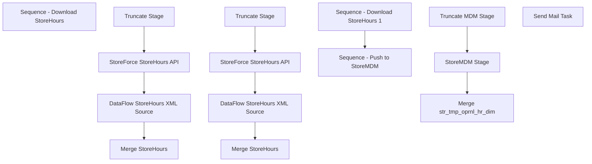

# SSIS Package: StoreForceHoursOfOperationExtract

**Project:** StoreForceHoursOfOperationExtract  
**Folder:** StoreForce  
**Server:** STL-SSIS-P-01  

## Connection Managers

| Name | Type | Server | Catalog | Connection (sanitized) |
|---|---|---|---|---|
| BABWMstrData | OLEDB | kodiak | BABWMstrData | Data Source=kodiak; Initial Catalog=BABWMstrData; Provider=SQLNCLI11.1; Integrated Security=SSPI; Auto Translate=False |
| IntegrationStaging | OLEDB | STL-SSIS-P-01 | IntegrationStaging | Data Source=STL-SSIS-P-01; Initial Catalog=IntegrationStaging; Provider=SQLNCLI11.1; Integrated Security=SSPI; Auto Translate=False |
| SMTP | SMTP |  |  |  |
| StoreForceAPI | HTTP (KingswaySoft) |  |  |  |

## Control Flow Tasks

| Task | Type |
|---|---|
| StoreForceHoursOfOperationExtract | Package |
| Sequence - Download StoreHours | SEQUENCE |
| DataFlow StoreHours XML Source | Pipeline |
| Merge StoreHours | ExecuteSQLTask |
| StoreForce StoreHours API | KingswaySoft.IntegrationToolkit.ProductivityPack.HttpRequesterTask |
| Truncate Stage | ExecuteSQLTask |
| Sequence - Download StoreHours 1 | SEQUENCE |
| DataFlow StoreHours XML Source | Pipeline |
| Merge StoreHours | ExecuteSQLTask |
| StoreForce StoreHours API | KingswaySoft.IntegrationToolkit.ProductivityPack.HttpRequesterTask |
| Truncate Stage | ExecuteSQLTask |
| Sequence - Push to StoreMDM | SEQUENCE |
| Merge str_tmp_oprnl_hr_dim | ExecuteSQLTask |
| StoreMDM Stage | Pipeline |
| Truncate MDM Stage | ExecuteSQLTask |
| Send Mail Task | SendMailTask |

## Control Flow Outline

```text
- Send Mail Task [SendMailTask]
- Sequence - Download StoreHours [SEQUENCE]
- Sequence - Download StoreHours 1 [SEQUENCE]
  - DataFlow StoreHours XML Source [Pipeline]
  - Merge StoreHours [ExecuteSQLTask]
  - StoreForce StoreHours API [KingswaySoft.IntegrationToolkit.ProductivityPack.HttpRequesterTask]
  - Truncate Stage [ExecuteSQLTask]
  - DataFlow StoreHours XML Source [Pipeline]
  - Merge StoreHours [ExecuteSQLTask]
  - StoreForce StoreHours API [KingswaySoft.IntegrationToolkit.ProductivityPack.HttpRequesterTask]
  - Truncate Stage [ExecuteSQLTask]
- Sequence - Push to StoreMDM [SEQUENCE]
  - Merge str_tmp_oprnl_hr_dim [ExecuteSQLTask]
  - StoreMDM Stage [Pipeline]
  - Truncate MDM Stage [ExecuteSQLTask]
```

## Architecture Diagram



## Variables

| Namespace | Name | Expression-bound |
|---|---|---|
| System | Propagate | No |
| User | DateTimeStamp | Yes |
| User | EndDate | Yes |
| User | EndDateAsDATE | Yes |
| User | GetDate | Yes |
| User | GetDateAsDATE | Yes |
| User | StartDate | Yes |
| User | StartDateAsDATE | Yes |
| User | StoreHoursXMLFile | No |
| User | StoreHoursXMLObject | No |

### Expression-bound variable values

#### User::DateTimeStamp

**Expression:**

```sql
(DT_WSTR,4)DATEPART("yyyy",GetDate()) 
+ (DT_WSTR,4)DATEPART("mm",GetDate()) 
+ (DT_WSTR,4)DATEPART("dd",GetDate()) 
+ (DT_WSTR,4)DATEPART("hh",GetDate()) 
+ (DT_WSTR,4)DATEPART("mi",GetDate()) 
+ (DT_WSTR,4)DATEPART("ss",GetDate()) 
+ (DT_WSTR,4)DATEPART("ms",GetDate())
```

**Evaluated value:**

```sql
202222134350350
```

#### User::EndDate

**Expression:**

```sql
dateadd("dd", @[$Package::DaysToInclude], @[User::StartDate])
```

**Evaluated value:**

```sql
2/2/2022
```

#### User::EndDateAsDATE

**Expression:**

```sql
(DT_WSTR, 4) datepart("year", @[User::EndDate])  + "-" + 
(DT_WSTR, 2) datepart("mm", @[User::EndDate])  + "-" + 
(DT_WSTR, 2) datepart("dd",  @[User::EndDate])
```

**Evaluated value:**

```sql
2022-2-2
```

#### User::GetDate

**Expression:**

```sql
(DT_DATE)DATEDIFF("Day", (DT_DATE) 0, GETDATE())
```

**Evaluated value:**

```sql
2/2/2022
```

#### User::GetDateAsDATE

**Expression:**

```sql
(DT_WSTR, 4) datepart("year", @[User::GetDate])  + "-" + 
(DT_WSTR, 2) datepart("mm", @[User::GetDate])  + "-" + 
(DT_WSTR, 2) datepart("dd",  @[User::GetDate])
```

**Evaluated value:**

```sql
2022-2-2
```

#### User::StartDate

**Expression:**

```sql
dateadd("dd", -@[$Package::DaysToGoBack] , @[User::GetDate] )
```

**Evaluated value:**

```sql
2/1/2022
```

#### User::StartDateAsDATE

**Expression:**

```sql
(DT_WSTR, 4) datepart("year", @[User::StartDate])  + "-" + 
(DT_WSTR, 2) datepart("mm", @[User::StartDate])  + "-" + 
(DT_WSTR, 2) datepart("dd",  @[User::StartDate])
```

**Evaluated value:**

```sql
2022-2-1
```

## Execute SQL Tasks

### Merge StoreHours

**Path:** `Package\Sequence - Download StoreHours 1\Merge StoreHours`  
**Connection:** IntegrationStaging (STL-SSIS-P-01/IntegrationStaging)  

```sql
exec StoreForce.spMergeStoreHours
```

### Truncate Stage

**Path:** `Package\Sequence - Download StoreHours 1\Truncate Stage`  
**Connection:** IntegrationStaging (STL-SSIS-P-01/IntegrationStaging)  

```sql
TRUNCATE TABLE StoreForce.StoreHoursStage
```

### Merge StoreHours

**Path:** `Package\Sequence - Download StoreHours\Merge StoreHours`  
**Connection:** IntegrationStaging (STL-SSIS-P-01/IntegrationStaging)  

```sql
exec StoreForce.spMergeStoreHours
```

### Truncate Stage

**Path:** `Package\Sequence - Download StoreHours\Truncate Stage`  
**Connection:** IntegrationStaging (STL-SSIS-P-01/IntegrationStaging)  

```sql
TRUNCATE TABLE StoreForce.StoreHoursStage
```

### Merge str_tmp_oprnl_hr_dim

**Path:** `Package\Sequence - Push to StoreMDM\Merge str_tmp_oprnl_hr_dim`  
**Connection:** BABWMstrData (kodiak/BABWMstrData)  

```sql
exec spMerge_str_tmp_oprnl_hr_dim
```

### Truncate MDM Stage

**Path:** `Package\Sequence - Push to StoreMDM\Truncate MDM Stage`  
**Connection:** BABWMstrData (kodiak/BABWMstrData)  

```sql
TRUNCATE TABLE StoreForceTempStoreHoursStage
```

## Data Flow: Sources

| Component | Source Object | Type | Data Flow Task | Connection | SQL Kind |
|---|---|---|---|---|---|
| StoreHours |  | OLEDBSource | StoreMDM Stage | IntegrationStaging | SqlCommand |

#### StoreHours — SqlCommand

```sql
select 
	cast(case when left(Code, 1) = '1'
		then cast(right(Code,3) as int)
		else Code
	end as int) as StoreNumber,
	cast(Date as datetime) ScheduleDate,
	case 
		when OpenTime = '--:--' 
			--then cast(concat(Date, ' ', '00:00') as datetime) 
			then NULL
		else cast(concat(Date, ' ', OpenTime) as datetime) 
	end as StartTime,
	case 
		when Closetime = '--:--' 
			--then cast(concat(Date, ' ', '00:00') as datetime)
			then NULL
		else cast(concat(Date, ' ', CloseTime) as datetime)
	end as EndTime
from StoreForce.StoreHours
where 1=1
and isHoliday='Y'
```

## Data Flow: Destinations

| Component | Target Table | Type | Data Flow Task | Connection | SQL Kind |
|---|---|---|---|---|---|
| StoreHoursStage |  | OLEDBDestination | DataFlow StoreHours XML Source | IntegrationStaging |  |
| StoreHoursStage |  | OLEDBDestination | DataFlow StoreHours XML Source | IntegrationStaging |  |
| StoreForceTempStoreHoursStage |  | OLEDBDestination | StoreMDM Stage | BABWMstrData |  |
