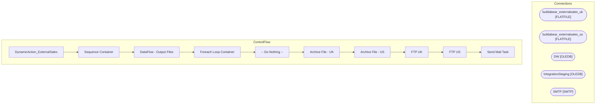

# SSIS Package: DynamicAction_ExternalSales

**Project:** DynamicAction_ExternalSales  
**Folder:** WEB  
**Server:** STL-SSIS-P-01  

## Architecture Diagram

## Connection Managers

| Name | Type |
|---|---|
| buildabear_externalsales_uk | FLATFILE |
| buildabear_externalsales_us | FLATFILE |
| DW | OLEDB |
| IntegrationStaging | OLEDB |
| SMTP | SMTP |

## Control Flow Tasks

| Task | Type |
|---|---|
| DynamicAction_ExternalSales | Microsoft.Package |
| Sequence Container | STOCK:SEQUENCE |
| DataFlow - Output Files | Microsoft.Pipeline |
| Foreach Loop Container | STOCK:FOREACHLOOP |
| -- Do Nothing -- | Microsoft.ExecuteSQLTask |
| Archive File - UK | Microsoft.FileSystemTask |
| Archive File - US | Microsoft.FileSystemTask |
| FTP UK | Microsoft.ExecuteProcess |
| FTP US | Microsoft.ExecuteProcess |
| Send Mail Task | Microsoft.SendMailTask |

## Data Flow: Sources

| Component | SQL Preview |
|---|---|
|  | with  ExcludeES as 	( 		--table is loaded during the morning load into transaction_facts, vis spdw_build_transaction_facts 		select transaction_id 		from tmpESRef  		group by transaction_id 	) select  	cast(pd.style_code as varchar(6)) as SKU, 	right((cast('0000' as varchar) + cast(sd.store_id as varchar)),4) as StockLocationID, 	sum(cast(tdf.units as int)) as ExternalUnitsSold, 	case when sd.stor |
|  | select style_code, catalog from web.pricebookfact |

## Data Flow: Destinations

_None detected._

