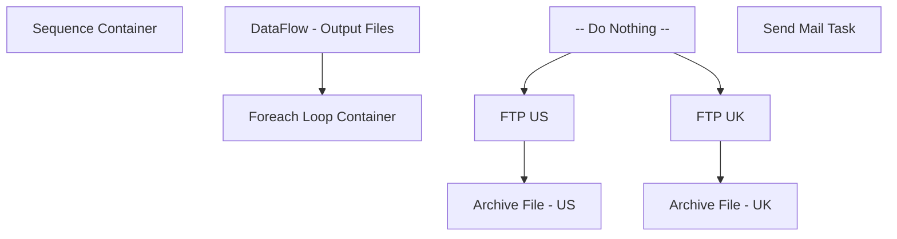

# SSIS Package: DynamicAction_ExternalSales

**Project:** DynamicAction_ExternalSales  
**Folder:** WEB  
**Server:** STL-SSIS-P-01  

## Connection Managers

| Name | Type | Server | Catalog | Connection (sanitized) |
|---|---|---|---|---|
| DW | OLEDB | papamart | dw | Data Source=papamart; Initial Catalog=dw; Provider=SQLNCLI11.1; Integrated Security=SSPI; Auto Translate=False |
| IntegrationStaging | OLEDB | STL-SSIS-P-01 | IntegrationStaging | Data Source=STL-SSIS-P-01; Initial Catalog=IntegrationStaging; Provider=SQLNCLI11.1; Integrated Security=SSPI; Auto Translate=False |
| SMTP | SMTP |  |  |  |
| buildabear_externalsales_uk | FLATFILE |  |  |  |
| buildabear_externalsales_us | FLATFILE |  |  |  |

## Control Flow Tasks

| Task | Type |
|---|---|
| DynamicAction_ExternalSales | Package |
| Sequence Container | SEQUENCE |
| DataFlow - Output Files | Pipeline |
| Foreach Loop Container | FOREACHLOOP |
| -- Do Nothing -- | ExecuteSQLTask |
| Archive File - UK | FileSystemTask |
| Archive File - US | FileSystemTask |
| FTP UK | ExecuteProcess |
| FTP US | ExecuteProcess |
| Send Mail Task | SendMailTask |

## Control Flow Outline

```text
- Send Mail Task [SendMailTask]
- Sequence Container [SEQUENCE]
  - DataFlow - Output Files [Pipeline]
  - Foreach Loop Container [FOREACHLOOP]
    - -- Do Nothing -- [ExecuteSQLTask]
    - Archive File - UK [FileSystemTask]
    - Archive File - US [FileSystemTask]
    - FTP UK [ExecuteProcess]
    - FTP US [ExecuteProcess]
```

## Architecture Diagram



## Variables

| Namespace | Name | Expression-bound |
|---|---|---|
| System | Propagate | No |
| User | DateTimeStamp | Yes |
| User | EndDate | Yes |
| User | EndDateAsDATE | Yes |
| User | FileArchiveLocation | Yes |
| User | FileNameForLoop | No |
| User | GetDate | Yes |
| User | GetDateAsDATE | Yes |
| User | StartDate | Yes |
| User | StartDateAsDATE | Yes |

### Expression-bound variable values

#### User::DateTimeStamp

**Expression:**

```sql
(DT_WSTR,4)DATEPART("yyyy",GetDate()) 
+ (DT_WSTR,4)DATEPART("mm",GetDate()) 
+ (DT_WSTR,4)DATEPART("dd",GetDate()) 
+ (DT_WSTR,4)DATEPART("hh",GetDate()) 
+ (DT_WSTR,4)DATEPART("mi",GetDate()) 
+ (DT_WSTR,4)DATEPART("ss",GetDate()) 
+ (DT_WSTR,4)DATEPART("ms",GetDate())
```

**Evaluated value:**

```sql
202231719156853
```

#### User::EndDate

**Expression:**

```sql
dateadd("dd", @[$Package::DaysToInclude], @[User::StartDate])
```

**Evaluated value:**

```sql
3/17/2022
```

#### User::EndDateAsDATE

**Expression:**

```sql
(DT_WSTR, 4) datepart("year", @[User::EndDate])  + "-" +
right("0"+ (DT_WSTR, 2) datepart("mm", @[User::EndDate]),2)  + "-" +
right("0" +(DT_WSTR, 2) datepart("dd",  @[User::EndDate]),2)
```

**Evaluated value:**

```sql
2022-03-17
```

#### User::FileArchiveLocation

**Expression:**

```sql
@[$Package::DynamicActionFileStageLocation] + "Archive\\"
```

**Evaluated value:**

```sql
\\stl-ssis-p-01\integrationStaging\DynamicAction\Archive\
```

#### User::GetDate

**Expression:**

```sql
(DT_DATE)DATEDIFF("Day", (DT_DATE) 0, GETDATE())
```

**Evaluated value:**

```sql
3/17/2022
```

#### User::GetDateAsDATE

**Expression:**

```sql
(DT_WSTR, 4) datepart("year", @[User::GetDate])  + "-" +
right("0"+ (DT_WSTR, 2) datepart("mm", @[User::GetDate]),2)  + "-" +
right("0" +(DT_WSTR, 2) datepart("dd",  @[User::GetDate]),2)
```

**Evaluated value:**

```sql
2022-03-17
```

#### User::StartDate

**Expression:**

```sql
dateadd("dd", -@[$Package::DaysToGoBack] , @[User::GetDate] )
```

**Evaluated value:**

```sql
3/16/2022
```

#### User::StartDateAsDATE

**Expression:**

```sql
(DT_WSTR, 4) datepart("year", @[User::StartDate])  + "-" +
right("0"+ (DT_WSTR, 2) datepart("mm", @[User::StartDate]),2)  + "-" +
right("0" +(DT_WSTR, 2) datepart("dd",  @[User::StartDate]),2)
```

**Evaluated value:**

```sql
2022-03-16
```

## Execute SQL Tasks

### -- Do Nothing --

**Path:** `Package\Sequence Container\Foreach Loop Container\-- Do Nothing --`  
**Connection:** DW (papamart/dw)  

```sql
--DO NOTHING -- 
```

## Data Flow: Sources

| Component | Source Object | Type | Data Flow Task | Connection | SQL Kind |
|---|---|---|---|---|---|
| ExternalSales |  | OLEDBSource | DataFlow - Output Files | DW | SqlCommand |

#### ExternalSales — SqlCommand

```sql
with 
ExcludeES as
	(
		--table is loaded during the morning load into transaction_facts, vis spdw_build_transaction_facts
		select transaction_id
		from tmpESRef 
		group by transaction_id
	)
select 
	cast(pd.style_code as varchar(6)) as SKU,
	right((cast('0000' as varchar) + cast(sd.store_id as varchar)),4) as StockLocationID,
	sum(cast(tdf.units as int)) as ExternalUnitsSold,
	case when sd.store_id<2000 then 'USD' else 'GBP' end as CurrencyCode,
	case when sd.store_id<2000 then 'US' else 'UK' end as SellingGeography
from vwDW_Transactions_Cube_V3 tf 
join store_dim sd with (nolock) on tf.store_key=sd.store_key
join date_dim dd with (nolock) on tf.date_key=dd.date_key
join transaction_detail_facts tdf with (nolock) on tf.transaction_id=tdf.transaction_id
join product_dim pd with (nolock) on tdf.product_key=pd.product_key
where cast(dd.actual_date as date) = cast(getdate()-1 as date)
and isShipFromStore=0
and isPickupFromStore=0
and isCurbside=0
and isSameDayShipt=0
and sd.store_id not in (13,2013)
and not exists (select es.transaction_id from ExcludeES es where es.transaction_id=tdf.transaction_id)
group by 
	cast(pd.style_code as varchar(6)),
	right((cast('0000' as varchar) + cast(sd.store_id as varchar)),4),
	cast(dd.actual_date as date),
	sd.store_id
```

## Data Flow: Destinations

| Component | Target Table | Type | Data Flow Task | Connection | SQL Kind |
|---|---|---|---|---|---|
| buildabear_externalsales_uk |  | FlatFileDestination | DataFlow - Output Files | buildabear_externalsales_uk |  |
| buildabear_externalsales_us |  | FlatFileDestination | DataFlow - Output Files | buildabear_externalsales_us |  |
