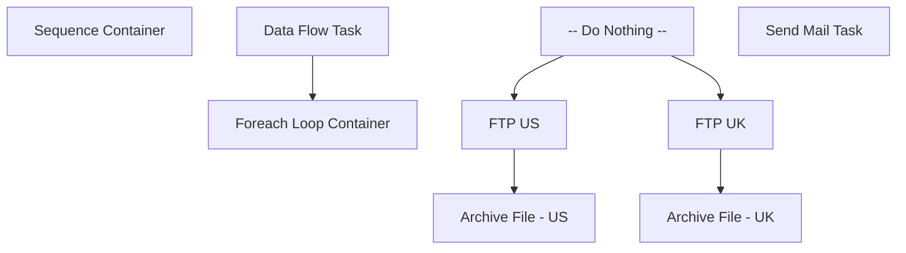

# SSIS Package: DynamicAction_ProductAttributes

**Project:** DynamicAction_ProductAttributes  
**Folder:** WEB  
**Server:** STL-SSIS-P-01  

## Connection Managers

| Name | Type | Server | Catalog | Connection (sanitized) |
|---|---|---|---|---|
| DW | OLEDB | papamart | dw | Data Source=papamart; Initial Catalog=dw; Provider=SQLNCLI11.1; Integrated Security=SSPI; Auto Translate=False |
| IntegrationStaging | OLEDB | STL-SSIS-P-01 | IntegrationStaging | Data Source=STL-SSIS-P-01; Initial Catalog=IntegrationStaging; Provider=SQLNCLI11.1; Integrated Security=SSPI; Auto Translate=False |
| SMTP | SMTP |  |  |  |
| buildabear_productattributes_uk | FLATFILE |  |  |  |
| buildabear_productattributes_us | FLATFILE |  |  |  |
| me_01 | OLEDB | bedrockdb02 | me_01 | Data Source=bedrockdb02; Initial Catalog=me_01; Provider=SQLNCLI11.1; Integrated Security=SSPI; Auto Translate=False |

## Control Flow Tasks

| Task | Type |
|---|---|
| DynamicAction_ProductAttributes | Package |
| Sequence Container | SEQUENCE |
| Data Flow Task | Pipeline |
| Foreach Loop Container | FOREACHLOOP |
| -- Do Nothing -- | ExecuteSQLTask |
| Archive File - UK | FileSystemTask |
| Archive File - US | FileSystemTask |
| FTP UK | ExecuteProcess |
| FTP US | ExecuteProcess |
| Send Mail Task | SendMailTask |

## Control Flow Outline

```text
- Send Mail Task [SendMailTask]
- Sequence Container [SEQUENCE]
  - Data Flow Task [Pipeline]
  - Foreach Loop Container [FOREACHLOOP]
    - -- Do Nothing -- [ExecuteSQLTask]
    - Archive File - UK [FileSystemTask]
    - Archive File - US [FileSystemTask]
    - FTP UK [ExecuteProcess]
    - FTP US [ExecuteProcess]
```

## Architecture Diagram



## Variables

| Namespace | Name | Expression-bound |
|---|---|---|
| System | Propagate | No |
| User | DateTimeStamp | Yes |
| User | EndDate | Yes |
| User | EndDateAsDATE | Yes |
| User | FileArchiveLocation | Yes |
| User | FileNameForLoop | No |
| User | GetDate | Yes |
| User | GetDateAsDATE | Yes |
| User | StartDate | Yes |
| User | StartDateAsDATE | Yes |

### Expression-bound variable values

#### User::DateTimeStamp

**Expression:**

```sql
(DT_WSTR,4)DATEPART("yyyy",GetDate()) 
+ (DT_WSTR,4)DATEPART("mm",GetDate()) 
+ (DT_WSTR,4)DATEPART("dd",GetDate()) 
+ (DT_WSTR,4)DATEPART("hh",GetDate()) 
+ (DT_WSTR,4)DATEPART("mi",GetDate()) 
+ (DT_WSTR,4)DATEPART("ss",GetDate()) 
+ (DT_WSTR,4)DATEPART("ms",GetDate())
```

**Evaluated value:**

```sql
202212723828300
```

#### User::EndDate

**Expression:**

```sql
dateadd("dd", @[$Package::DaysToInclude], @[User::StartDate])
```

**Evaluated value:**

```sql
1/27/2022
```

#### User::EndDateAsDATE

**Expression:**

```sql
(DT_WSTR, 4) datepart("year", @[User::EndDate])  + "-" +
right("0"+ (DT_WSTR, 2) datepart("mm", @[User::EndDate]),2)  + "-" +
right("0" +(DT_WSTR, 2) datepart("dd",  @[User::EndDate]),2)
```

**Evaluated value:**

```sql
2022-01-27
```

#### User::FileArchiveLocation

**Expression:**

```sql
@[$Package::DynamicActionFileStageLocation] + "Archive\\"
```

**Evaluated value:**

```sql
\\stl-ssis-p-01\integrationStaging\DynamicAction\Archive\
```

#### User::GetDate

**Expression:**

```sql
(DT_DATE)DATEDIFF("Day", (DT_DATE) 0, GETDATE())
```

**Evaluated value:**

```sql
1/27/2022
```

#### User::GetDateAsDATE

**Expression:**

```sql
(DT_WSTR, 4) datepart("year", @[User::GetDate])  + "-" +
right("0"+ (DT_WSTR, 2) datepart("mm", @[User::GetDate]),2)  + "-" +
right("0" +(DT_WSTR, 2) datepart("dd",  @[User::GetDate]),2)
```

**Evaluated value:**

```sql
2022-01-27
```

#### User::StartDate

**Expression:**

```sql
dateadd("dd", -@[$Package::DaysToGoBack] , @[User::GetDate] )
```

**Evaluated value:**

```sql
1/26/2022
```

#### User::StartDateAsDATE

**Expression:**

```sql
(DT_WSTR, 4) datepart("year", @[User::StartDate])  + "-" +
right("0"+ (DT_WSTR, 2) datepart("mm", @[User::StartDate]),2)  + "-" +
right("0" +(DT_WSTR, 2) datepart("dd",  @[User::StartDate]),2)
```

**Evaluated value:**

```sql
2022-01-26
```

## Execute SQL Tasks

### -- Do Nothing --

**Path:** `Package\Sequence Container\Foreach Loop Container\-- Do Nothing --`  
**Connection:** DW (papamart/dw)  

```sql
--DO NOTHING -- 
```

## Data Flow: Sources

| Component | Source Object | Type | Data Flow Task | Connection | SQL Kind |
|---|---|---|---|---|---|
| ProductAttributes |  | OLEDBSource | Data Flow Task | me_01 | SqlCommand |

#### ProductAttributes — SqlCommand

```sql
WITH 
OnOrder as
	(
		select 
			s.style_code
		from ma_01.dbo.oo_all_style_chn_li oo
		join style s on oo.style_id = s.style_id
		where oo.on_order_units >  100
	),
ONote as
	(
		select 
			s.style_code,
			cp.cust_prop_code,
			replace(ecp.custom_property_value,',','') CustomProperty
		from Style s 
		join entity_custom_property ecp on s.style_id = ecp.parent_id and ecp.parent_type = 1
		join custom_property cp (nolock) on cp.custom_property_id = ecp.custom_property_id 
		where cp.cust_prop_code IN 
			(
				'ONOTE'
			)
		group by 
			s.style_code,
			cp.cust_prop_code,
			ecp.custom_property_value
	),
HasInv as
	(
		select 
			s.style_code,
			s.short_desc,
			sum(case when iit.total_on_hand_units > 0 then 1 else 0 end) as HasInventory	
		from ib_inventory_total iit with (nolock)
		join sku sk 
			on iit.sku_id = sk.sku_id
			and	iit.location_id IN ('59') 
			and	iit.inventory_status_id = 1
		join style s with (nolock) on	sk.style_id = s.style_id
		where	s.active_flag = 1
		group by 
			s.style_code,
			s.short_desc
	)
select 
	cast(s.style_code as varchar(6)) as SKU,
	case 
		when ss.SellingGeography is null 
			then 
				case 
					when left(s.style_code,1) in ('4','5','6') 
						then 'UK' 
						else 'US' 
				end
			else ss.SellingGeography
	end as SellingGeography,
	replace(s.long_desc,',','') as MerchDescription,
	h.ConsumerGroup,
	h.SubClass,
	Onote.CustomProperty as MerchOutComments,
	case when oo.style_code is null then 0 else 1 end as ItemHasOnOrder,
	sum(isnull(hi.HasInventory,0)) as ItemHas980Inventory
from style s
join vwWebIncludedStyles ss on s.style_code=ss.style_code
join vwHierarchy h on ss.hierarchy_group_id = h.SubClassHierarchyGroupID
left join OnOrder oo on s.style_code = oo.style_code
left join Onote on s.style_code=Onote.style_code
left join HasInv hi on s.style_code=hi.style_code
where s.active_flag=1
group by 
	s.style_code,
	ss.SellingGeography,
	s.long_desc,
	h.SubClass,
	h.ConsumerGroup,
	case when oo.style_code is null then 0 else 1 end,
	Onote.CustomProperty
```

## Data Flow: Destinations

| Component | Target Table | Type | Data Flow Task | Connection | SQL Kind |
|---|---|---|---|---|---|
| buildabear_productattributes_uk |  | FlatFileDestination | Data Flow Task | buildabear_productattributes_uk |  |
| buildabear_productattributes_us |  | FlatFileDestination | Data Flow Task | buildabear_productattributes_us |  |
