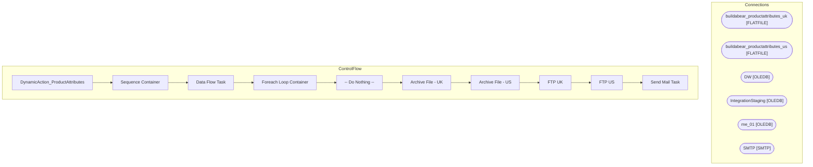

# SSIS Package: DynamicAction_ProductAttributes

**Project:** DynamicAction_ProductAttributes  
**Folder:** WEB  
**Server:** STL-SSIS-P-01  

## Architecture Diagram

## Connection Managers

| Name | Type |
|---|---|
| buildabear_productattributes_uk | FLATFILE |
| buildabear_productattributes_us | FLATFILE |
| DW | OLEDB |
| IntegrationStaging | OLEDB |
| me_01 | OLEDB |
| SMTP | SMTP |

## Control Flow Tasks

| Task | Type |
|---|---|
| DynamicAction_ProductAttributes | Microsoft.Package |
| Sequence Container | STOCK:SEQUENCE |
| Data Flow Task | Microsoft.Pipeline |
| Foreach Loop Container | STOCK:FOREACHLOOP |
| -- Do Nothing -- | Microsoft.ExecuteSQLTask |
| Archive File - UK | Microsoft.FileSystemTask |
| Archive File - US | Microsoft.FileSystemTask |
| FTP UK | Microsoft.ExecuteProcess |
| FTP US | Microsoft.ExecuteProcess |
| Send Mail Task | Microsoft.SendMailTask |

## Data Flow: Sources

| Component | SQL Preview |
|---|---|
|  | WITH  OnOrder as 	( 		select  			s.style_code 		from ma_01.dbo.oo_all_style_chn_li oo 		join style s on oo.style_id = s.style_id 		where oo.on_order_units >  100 	), ONote as 	( 		select  			s.style_code, 			cp.cust_prop_code, 			replace(ecp.custom_property_value,',','') CustomProperty 		from Style s  		join entity_custom_property ecp on s.style_id = ecp.parent_id and ecp.parent_type = 1 		join cu |

## Data Flow: Destinations

_None detected._

