# SSIS Package: DynamicAction_StockInventory

**Project:** DynamicAction_StockInventory  
**Folder:** WEB  
**Server:** STL-SSIS-P-01  

## Architecture Diagram

```mermaid
flowchart TD
    subgraph Connections
        buildabear_stocklocation_inventory_uk_conn(["buildabear_stocklocation_inventory_uk [FLATFILE]"])
        buildabear_stocklocation_inventory_us_conn(["buildabear_stocklocation_inventory_us [FLATFILE]"])
        IntegrationStaging_conn(["IntegrationStaging [OLEDB]"])
        SMTP_conn(["SMTP [SMTP]"])
    end
    subgraph ControlFlow
        DynamicAction_StockInventory_task["DynamicAction_StockInventory"]
        Sequence_Container_task["Sequence Container"]
        DynamicAction_StockInventory_task --> Sequence_Container_task
        Data_Flow_Task_task["Data Flow Task"]
        Sequence_Container_task --> Data_Flow_Task_task
        Foreach_Loop_Container_task["Foreach Loop Container"]
        Data_Flow_Task_task --> Foreach_Loop_Container_task
        Foreach_Loop_Container_task["Foreach Loop Container"]
        Foreach_Loop_Container_task --> Foreach_Loop_Container_task
        ___Do_Nothing____task["-- Do Nothing --"]
        Foreach_Loop_Container_task --> ___Do_Nothing____task
        Archive_File___UK_task["Archive File - UK"]
        ___Do_Nothing____task --> Archive_File___UK_task
        Archive_File___US_task["Archive File - US"]
        Archive_File___UK_task --> Archive_File___US_task
        FTP_UK_task["FTP UK"]
        Archive_File___US_task --> FTP_UK_task
        FTP_US_task["FTP US"]
        FTP_UK_task --> FTP_US_task
        Send_Mail_Task_task["Send Mail Task"]
        FTP_US_task --> Send_Mail_Task_task
    end
```

## Connection Managers

| Name | Type |
|---|---|
| buildabear_stocklocation_inventory_uk | FLATFILE |
| buildabear_stocklocation_inventory_us | FLATFILE |
| IntegrationStaging | OLEDB |
| SMTP | SMTP |

## Control Flow Tasks

| Task | Type |
|---|---|
| DynamicAction_StockInventory | Microsoft.Package |
| Sequence Container | STOCK:SEQUENCE |
| Data Flow Task | Microsoft.Pipeline |
| Foreach Loop Container | STOCK:FOREACHLOOP |
| Foreach Loop Container | STOCK:FOREACHLOOP |
| -- Do Nothing -- | Microsoft.ExecuteSQLTask |
| Archive File - UK | Microsoft.FileSystemTask |
| Archive File - US | Microsoft.FileSystemTask |
| FTP UK | Microsoft.ExecuteProcess |
| FTP US | Microsoft.ExecuteProcess |
| Send Mail Task | Microsoft.SendMailTask |

## Data Flow: Sources

| Component | SQL Preview |
|---|---|
|  | with  Cost as  	( 		select  			pd.style_code, 			p.ChainAverageOnHandCost, 			p.ChainAverageOnHandCostGBP 		from papamart.dw.azure.ProductChainOnHandCost p  with (nolock) 		join papamart.dw.dbo.product_dim pd  with (nolock) on p.ProductKey=pd.Product_Key 	) select  	inv.SellingGeography, 	convert(varchar, getdate(), 101) as Date, 	inv.LocationCode as LocationID, 	inv.StyleCode as ProductID, 	inv.S |

## Data Flow: Destinations

_None detected._

