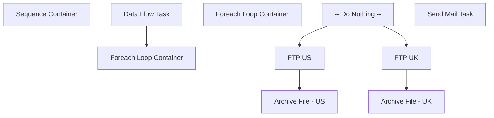

# SSIS Package: DynamicAction_StockInventory

**Project:** DynamicAction_StockInventory  
**Folder:** WEB  
**Server:** STL-SSIS-P-01  

## Connection Managers

| Name | Type | Server | Catalog | Connection (sanitized) |
|---|---|---|---|---|
| IntegrationStaging | OLEDB | STL-SSIS-P-01 | IntegrationStaging | Data Source=STL-SSIS-P-01; Initial Catalog=IntegrationStaging; Provider=SQLNCLI11.1; Integrated Security=SSPI; Auto Translate=False |
| SMTP | SMTP |  |  |  |
| buildabear_stocklocation_inventory_uk | FLATFILE |  |  |  |
| buildabear_stocklocation_inventory_us | FLATFILE |  |  |  |

## Control Flow Tasks

| Task | Type |
|---|---|
| DynamicAction_StockInventory | Package |
| Sequence Container | SEQUENCE |
| Data Flow Task | Pipeline |
| Foreach Loop Container | FOREACHLOOP |
| Foreach Loop Container | FOREACHLOOP |
| -- Do Nothing -- | ExecuteSQLTask |
| Archive File - UK | FileSystemTask |
| Archive File - US | FileSystemTask |
| FTP UK | ExecuteProcess |
| FTP US | ExecuteProcess |
| Send Mail Task | SendMailTask |

## Control Flow Outline

```text
- Send Mail Task [SendMailTask]
- Sequence Container [SEQUENCE]
  - Data Flow Task [Pipeline]
  - Foreach Loop Container [FOREACHLOOP]
    - Foreach Loop Container [FOREACHLOOP]
      - -- Do Nothing -- [ExecuteSQLTask]
      - Archive File - UK [FileSystemTask]
      - Archive File - US [FileSystemTask]
      - FTP UK [ExecuteProcess]
      - FTP US [ExecuteProcess]
```

## Architecture Diagram



## Variables

| Namespace | Name | Expression-bound |
|---|---|---|
| System | Propagate | No |
| User | DateTimeStamp | Yes |
| User | EndDate | Yes |
| User | EndDateAsDATE | Yes |
| User | FileArchiveLocation | Yes |
| User | FileNameForLoop | No |
| User | GetDate | Yes |
| User | GetDateAsDATE | Yes |
| User | StartDate | Yes |
| User | StartDateAsDATE | Yes |

### Expression-bound variable values

#### User::DateTimeStamp

**Expression:**

```sql
(DT_WSTR,4)DATEPART("yyyy",GetDate()) 
+ (DT_WSTR,4)DATEPART("mm",GetDate()) 
+ (DT_WSTR,4)DATEPART("dd",GetDate()) 
+ (DT_WSTR,4)DATEPART("hh",GetDate()) 
+ (DT_WSTR,4)DATEPART("mi",GetDate()) 
+ (DT_WSTR,4)DATEPART("ss",GetDate()) 
+ (DT_WSTR,4)DATEPART("ms",GetDate())
```

**Evaluated value:**

```sql
20211221103536917
```

#### User::EndDate

**Expression:**

```sql
dateadd("dd", @[$Package::DaysToInclude], @[User::StartDate])
```

**Evaluated value:**

```sql
12/21/2021
```

#### User::EndDateAsDATE

**Expression:**

```sql
(DT_WSTR, 4) datepart("year", @[User::EndDate])  + "-" +
right("0"+ (DT_WSTR, 2) datepart("mm", @[User::EndDate]),2)  + "-" +
right("0" +(DT_WSTR, 2) datepart("dd",  @[User::EndDate]),2)
```

**Evaluated value:**

```sql
2021-12-21
```

#### User::FileArchiveLocation

**Expression:**

```sql
@[$Package::DynamicActionFileStageLocation] + "Archive\\"
```

**Evaluated value:**

```sql
\\stl-ssis-p-01\integrationStaging\DynamicAction\Archive\
```

#### User::GetDate

**Expression:**

```sql
(DT_DATE)DATEDIFF("Day", (DT_DATE) 0, GETDATE())
```

**Evaluated value:**

```sql
12/21/2021
```

#### User::GetDateAsDATE

**Expression:**

```sql
(DT_WSTR, 4) datepart("year", @[User::GetDate])  + "-" +
right("0"+ (DT_WSTR, 2) datepart("mm", @[User::GetDate]),2)  + "-" +
right("0" +(DT_WSTR, 2) datepart("dd",  @[User::GetDate]),2)
```

**Evaluated value:**

```sql
2021-12-21
```

#### User::StartDate

**Expression:**

```sql
dateadd("dd", -@[$Package::DaysToGoBack] , @[User::GetDate] )
```

**Evaluated value:**

```sql
12/20/2021
```

#### User::StartDateAsDATE

**Expression:**

```sql
(DT_WSTR, 4) datepart("year", @[User::StartDate])  + "-" +
right("0"+ (DT_WSTR, 2) datepart("mm", @[User::StartDate]),2)  + "-" +
right("0" +(DT_WSTR, 2) datepart("dd",  @[User::StartDate]),2)
```

**Evaluated value:**

```sql
2021-12-20
```

## Execute SQL Tasks

### -- Do Nothing --

**Path:** `Package\Sequence Container\Foreach Loop Container\Foreach Loop Container\-- Do Nothing --`  
**Connection:** IntegrationStaging (STL-SSIS-P-01/IntegrationStaging)  

```sql
--DO NOTHING -- 
```

## Data Flow: Sources

| Component | Source Object | Type | Data Flow Task | Connection | SQL Kind |
|---|---|---|---|---|---|
| InventoryFact |  | OLEDBSource | Data Flow Task | IntegrationStaging | SqlCommand |

#### InventoryFact — SqlCommand

```sql
with 
Cost as 
	(
		select 
			pd.style_code,
			p.ChainAverageOnHandCost,
			p.ChainAverageOnHandCostGBP
		from papamart.dw.azure.ProductChainOnHandCost p  with (nolock)
		join papamart.dw.dbo.product_dim pd  with (nolock) on p.ProductKey=pd.Product_Key
	)
select 
	inv.SellingGeography,
	convert(varchar, getdate(), 101) as Date,
	inv.LocationCode as LocationID,
	inv.StyleCode as ProductID,
	inv.StyleCode as SKU,
	'NO' as isSupplierOwned,
	case 
		when inv.Qty >=99999 
			then 'YES' 
		else 'NO'
	end as isNonStockable,
	inv.Qty,
	case 
		when inv.SellingGeography='US' then isnull(c.ChainAverageOnHandCost,0)
		when inv.SellingGeography='UK' then isnull(c.ChainAverageOnHandCostGBP,0)
	end as UnitCost,
	'NO' as isReorderable,
	case
		when inv.LocationCode in ('0013','2013') 
		then 'Web' 
		else 'Store' 
	end LocationType
from web.InventoryFact inv with (nolock)
join web.ProductCatalogMasterAttributes pc with (nolock) on inv.StyleCode=pc.BABWProductID
left join cost c on inv.StyleCode=c.style_code
where pc.StorefrontEligible=1
order by 
	inv.SellingGeography,
	case
		when inv.LocationCode in ('0013','2013') 
		then 'Web' 
		else 'Store' 
	end desc,
	inv.LocationCode,
	inv.StyleCode
```

## Data Flow: Destinations

| Component | Target Table | Type | Data Flow Task | Connection | SQL Kind |
|---|---|---|---|---|---|
| buildabear_stocklocation_inventory_uk |  | FlatFileDestination | Data Flow Task | buildabear_stocklocation_inventory_uk |  |
| buildabear_stocklocation_inventory_us |  | FlatFileDestination | Data Flow Task | buildabear_stocklocation_inventory_us |  |
