# SSIS Package: GoogleLocalStoreInventoryFile

**Project:** GoogleLocalStoreInventoryFile  
**Folder:** WEB  
**Server:** STL-SSIS-P-01  

## Architecture Diagram

```mermaid
flowchart TD
    subgraph Connections
        GoogleAdsStoreInvTabDelim_conn(["GoogleAdsStoreInvTabDelim [FLATFILE]"])
        IntegrationStaging_conn(["IntegrationStaging [OLEDB]"])
        SMTP_conn(["SMTP [SMTP]"])
    end
    subgraph ControlFlow
        GoogleLocalStoreInventoryFile_task["GoogleLocalStoreInventoryFile"]
        Export_to_Tab_Delim_File___UK_task["Export to Tab Delim File - UK"]
        GoogleLocalStoreInventoryFile_task --> Export_to_Tab_Delim_File___UK_task
        FEL___Rename_File_task["FEL - Rename File"]
        Export_to_Tab_Delim_File___UK_task --> FEL___Rename_File_task
        Rename_File_task["Rename File"]
        FEL___Rename_File_task --> Rename_File_task
        Generate_Inventory_File___UK_task["Generate Inventory File - UK"]
        Rename_File_task --> Generate_Inventory_File___UK_task
        Export_to_Tab_Delim_File___US_task["Export to Tab Delim File - US"]
        Generate_Inventory_File___UK_task --> Export_to_Tab_Delim_File___US_task
        FEL___Rename_File_task["FEL - Rename File"]
        Export_to_Tab_Delim_File___US_task --> FEL___Rename_File_task
        Rename_File_task["Rename File"]
        FEL___Rename_File_task --> Rename_File_task
        Generate_Inventory_File___US_task["Generate Inventory File - US"]
        Rename_File_task --> Generate_Inventory_File___US_task
        Process_PricebookFiles_task["Process PricebookFiles"]
        Generate_Inventory_File___US_task --> Process_PricebookFiles_task
        FEL___Move_Files_from_FTP_to_IntStaging_task["FEL - Move Files from FTP to IntStaging"]
        Process_PricebookFiles_task --> FEL___Move_Files_from_FTP_to_IntStaging_task
        Move_Files_Task_task["Move Files Task"]
        FEL___Move_Files_from_FTP_to_IntStaging_task --> Move_Files_Task_task
        FEL___Process_PriceBook_XML_Files_task["FEL - Process PriceBook XML Files"]
        Move_Files_Task_task --> FEL___Process_PriceBook_XML_Files_task
        Archive_File_task["Archive File"]
        FEL___Process_PriceBook_XML_Files_task --> Archive_File_task
        Process_Pricebook_XML_File_task["Process Pricebook XML File"]
        Archive_File_task --> Process_Pricebook_XML_File_task
        Truncate_Staging_task["Truncate Staging"]
        Process_Pricebook_XML_File_task --> Truncate_Staging_task
        Send_eMail_No_FTP_File_Present_task["Send eMail No FTP File Present"]
        Truncate_Staging_task --> Send_eMail_No_FTP_File_Present_task
        Send_Mail_Task_task["Send Mail Task"]
        Send_eMail_No_FTP_File_Present_task --> Send_Mail_Task_task
        Sequence_Container___File_Count_task["Sequence Container - File Count"]
        Send_Mail_Task_task --> Sequence_Container___File_Count_task
        Script_Task___Get_FTP_File_Count_task["Script Task - Get FTP File Count"]
        Sequence_Container___File_Count_task --> Script_Task___Get_FTP_File_Count_task
        SFTP_and_Archive_Files_task["SFTP and Archive Files"]
        Script_Task___Get_FTP_File_Count_task --> SFTP_and_Archive_Files_task
        FEL___Archive_Files_task["FEL - Archive Files"]
        SFTP_and_Archive_Files_task --> FEL___Archive_Files_task
        Archive_Files_task["Archive Files"]
        FEL___Archive_Files_task --> Archive_Files_task
        FEL___Rename_before_Archive_task["FEL - Rename before Archive"]
        Archive_Files_task --> FEL___Rename_before_Archive_task
        Rename_File___Append_Date_and_Time_task["Rename File - Append Date and Time"]
        FEL___Rename_before_Archive_task --> Rename_File___Append_Date_and_Time_task
        WinScp___Upload_Files_to_Google____UK_task["WinScp - Upload Files to Google  - UK"]
        Rename_File___Append_Date_and_Time_task --> WinScp___Upload_Files_to_Google____UK_task
        WinScp___Upload_Files_to_Google___US_task["WinScp - Upload Files to Google - US"]
        WinScp___Upload_Files_to_Google____UK_task --> WinScp___Upload_Files_to_Google___US_task
        Send_Mail_Task_task["Send Mail Task"]
        WinScp___Upload_Files_to_Google___US_task --> Send_Mail_Task_task
    end
```

## Connection Managers

| Name | Type |
|---|---|
| GoogleAdsStoreInvTabDelim | FLATFILE |
| IntegrationStaging | OLEDB |
| SMTP | SMTP |

## Control Flow Tasks

| Task | Type |
|---|---|
| GoogleLocalStoreInventoryFile | Microsoft.Package |
| Export to Tab Delim File - UK | STOCK:SEQUENCE |
| FEL - Rename File | STOCK:FOREACHLOOP |
| Rename File | Microsoft.FileSystemTask |
| Generate Inventory File - UK | Microsoft.Pipeline |
| Export to Tab Delim File - US | STOCK:SEQUENCE |
| FEL - Rename File | STOCK:FOREACHLOOP |
| Rename File | Microsoft.FileSystemTask |
| Generate Inventory File - US | Microsoft.Pipeline |
| Process PricebookFiles | STOCK:SEQUENCE |
| FEL - Move Files from FTP to IntStaging | STOCK:FOREACHLOOP |
| Move Files Task | Microsoft.FileSystemTask |
| FEL - Process PriceBook XML Files | STOCK:FOREACHLOOP |
| Archive File | Microsoft.FileSystemTask |
| Process Pricebook XML File | Microsoft.Pipeline |
| Truncate Staging | Microsoft.ExecuteSQLTask |
| Send eMail No FTP File Present | STOCK:SEQUENCE |
| Send Mail Task | Microsoft.SendMailTask |
| Sequence Container - File Count | STOCK:SEQUENCE |
| Script Task - Get FTP File Count | Microsoft.ScriptTask |
| SFTP and Archive Files | STOCK:SEQUENCE |
| FEL - Archive Files | STOCK:FOREACHLOOP |
| Archive Files | Microsoft.FileSystemTask |
| FEL - Rename before Archive | STOCK:FOREACHLOOP |
| Rename File - Append Date and Time | Microsoft.FileSystemTask |
| WinScp - Upload Files to Google  - UK | Microsoft.ExecuteProcess |
| WinScp - Upload Files to Google - US | Microsoft.ExecuteProcess |
| Send Mail Task | Microsoft.SendMailTask |

## Data Flow: Sources

| Component | SQL Preview |
|---|---|
|  | exec [WEB].[spGoogleAdsInventoryLoad] ? , 'UK' |
|  | exec [WEB].[spGoogleAdsInventoryLoad] ? , 'US' |

## Data Flow: Destinations

| Component | Destination |
|---|---|
|  | [WEB].[GoogleAdsPricebookStage] |

