# SSIS Package: GoogleLocalStoreInventoryFile

**Project:** GoogleLocalStoreInventoryFile  
**Folder:** WEB  
**Server:** STL-SSIS-P-01  

## Connection Managers

| Name | Type | Server | Catalog | Connection (sanitized) |
|---|---|---|---|---|
| GoogleAdsStoreInvTabDelim | FLATFILE |  |  |  |
| IntegrationStaging | OLEDB | stl-ssis-p-01 | IntegrationStaging | Data Source=stl-ssis-p-01; Initial Catalog=IntegrationStaging; Provider=SQLNCLI11.1; Integrated Security=SSPI; Auto Translate=False |
| SMTP | SMTP |  |  |  |

## Control Flow Tasks

| Task | Type |
|---|---|
| GoogleLocalStoreInventoryFile | Package |
| Export to Tab Delim File - UK | SEQUENCE |
| FEL - Rename File | FOREACHLOOP |
| Rename File | FileSystemTask |
| Generate Inventory File - UK | Pipeline |
| Export to Tab Delim File - US | SEQUENCE |
| FEL - Rename File | FOREACHLOOP |
| Rename File | FileSystemTask |
| Generate Inventory File - US | Pipeline |
| Process PricebookFiles | SEQUENCE |
| FEL - Move Files from FTP to IntStaging | FOREACHLOOP |
| Move Files Task | FileSystemTask |
| FEL - Process PriceBook XML Files | FOREACHLOOP |
| Archive File | FileSystemTask |
| Process Pricebook XML File | Pipeline |
| Truncate Staging | ExecuteSQLTask |
| Send eMail No FTP File Present | SEQUENCE |
| Send Mail Task | SendMailTask |
| Sequence Container - File Count | SEQUENCE |
| Script Task - Get FTP File Count | ScriptTask |
| SFTP and Archive Files | SEQUENCE |
| FEL - Archive Files | FOREACHLOOP |
| Archive Files | FileSystemTask |
| FEL - Rename before Archive | FOREACHLOOP |
| Rename File - Append Date and Time | FileSystemTask |
| WinScp - Upload Files to Google  - UK | ExecuteProcess |
| WinScp - Upload Files to Google - US | ExecuteProcess |
| Send Mail Task | SendMailTask |

## Control Flow Outline

```text
- Send Mail Task [SendMailTask]
- Export to Tab Delim File - UK [SEQUENCE]
  - FEL - Rename File [FOREACHLOOP]
    - Rename File [FileSystemTask]
  - Generate Inventory File - UK [Pipeline]
- Export to Tab Delim File - US [SEQUENCE]
  - FEL - Rename File [FOREACHLOOP]
    - Rename File [FileSystemTask]
  - Generate Inventory File - US [Pipeline]
- Process PricebookFiles [SEQUENCE]
  - FEL - Move Files from FTP to IntStaging [FOREACHLOOP]
    - Move Files Task [FileSystemTask]
  - FEL - Process PriceBook XML Files [FOREACHLOOP]
    - Archive File [FileSystemTask]
    - Process Pricebook XML File [Pipeline]
  - Truncate Staging [ExecuteSQLTask]
- SFTP and Archive Files [SEQUENCE]
  - FEL - Archive Files [FOREACHLOOP]
    - Archive Files [FileSystemTask]
  - FEL - Rename before Archive [FOREACHLOOP]
    - Rename File - Append Date and Time [FileSystemTask]
  - WinScp - Upload Files to Google  - UK [ExecuteProcess]
  - WinScp - Upload Files to Google - US [ExecuteProcess]
- Send eMail No FTP File Present [SEQUENCE]
  - Send Mail Task [SendMailTask]
- Sequence Container - File Count [SEQUENCE]
  - Script Task - Get FTP File Count [ScriptTask]
```

## Architecture Diagram

```mermaid
flowchart TD
    n_Package_Export_to_Tab_Delim_File___UK["Export to Tab Delim File - UK"]
    n_Package_Export_to_Tab_Delim_File___UK_FEL___Rename_File["FEL - Rename File"]
    n_Package_Export_to_Tab_Delim_File___UK_FEL___Rename_File_Rename_File["Rename File"]
    n_Package_Export_to_Tab_Delim_File___UK_Generate_Inventory_File___UK["Generate Inventory File - UK"]
    n_Package_Export_to_Tab_Delim_File___US["Export to Tab Delim File - US"]
    n_Package_Export_to_Tab_Delim_File___US_FEL___Rename_File["FEL - Rename File"]
    n_Package_Export_to_Tab_Delim_File___US_FEL___Rename_File_Rename_File["Rename File"]
    n_Package_Export_to_Tab_Delim_File___US_Generate_Inventory_File___US["Generate Inventory File - US"]
    n_Package_Process_PricebookFiles["Process PricebookFiles"]
    n_Package_Process_PricebookFiles_FEL___Move_Files_from_FTP_to_IntStaging["FEL - Move Files from FTP to IntStaging"]
    n_Package_Process_PricebookFiles_FEL___Move_Files_from_FTP_to_IntStaging_Move_Files_Task["Move Files Task"]
    n_Package_Process_PricebookFiles_FEL___Process_PriceBook_XML_Files["FEL - Process PriceBook XML Files"]
    n_Package_Process_PricebookFiles_FEL___Process_PriceBook_XML_Files_Archive_File["Archive File"]
    n_Package_Process_PricebookFiles_FEL___Process_PriceBook_XML_Files_Process_Pricebook_XML_File["Process Pricebook XML File"]
    n_Package_Process_PricebookFiles_Truncate_Staging["Truncate Staging"]
    n_Package_Send_eMail_No_FTP_File_Present["Send eMail No FTP File Present"]
    n_Package_Send_eMail_No_FTP_File_Present_Send_Mail_Task["Send Mail Task"]
    n_Package_Sequence_Container___File_Count["Sequence Container - File Count"]
    n_Package_Sequence_Container___File_Count_Script_Task___Get_FTP_File_Count["Script Task - Get FTP File Count"]
    n_Package_SFTP_and_Archive_Files["SFTP and Archive Files"]
    n_Package_SFTP_and_Archive_Files_FEL___Archive_Files["FEL - Archive Files"]
    n_Package_SFTP_and_Archive_Files_FEL___Archive_Files_Archive_Files["Archive Files"]
    n_Package_SFTP_and_Archive_Files_FEL___Rename_before_Archive["FEL - Rename before Archive"]
    n_Package_SFTP_and_Archive_Files_FEL___Rename_before_Archive_Rename_File___Append_Date_and_Time["Rename File - Append Date and Time"]
    n_Package_SFTP_and_Archive_Files_WinScp___Upload_Files_to_Google____UK["WinScp - Upload Files to Google  - UK"]
    n_Package_SFTP_and_Archive_Files_WinScp___Upload_Files_to_Google___US["WinScp - Upload Files to Google - US"]
    n_Package_EventHandlers_OnError__Send_Mail_Task["Send Mail Task"]
    n_Package_Export_to_Tab_Delim_File___UK_Generate_Inventory_File___UK --> n_Package_Export_to_Tab_Delim_File___UK_FEL___Rename_File
    n_Package_Export_to_Tab_Delim_File___US_Generate_Inventory_File___US --> n_Package_Export_to_Tab_Delim_File___US_FEL___Rename_File
    n_Package_Process_PricebookFiles_FEL___Process_PriceBook_XML_Files_Process_Pricebook_XML_File --> n_Package_Process_PricebookFiles_FEL___Process_PriceBook_XML_Files_Archive_File
    n_Package_Process_PricebookFiles_FEL___Move_Files_from_FTP_to_IntStaging --> n_Package_Process_PricebookFiles_FEL___Process_PriceBook_XML_Files
    n_Package_Process_PricebookFiles_Truncate_Staging --> n_Package_Process_PricebookFiles_FEL___Move_Files_from_FTP_to_IntStaging
    n_Package_SFTP_and_Archive_Files_WinScp___Upload_Files_to_Google___US --> n_Package_SFTP_and_Archive_Files_WinScp___Upload_Files_to_Google____UK
    n_Package_SFTP_and_Archive_Files_FEL___Rename_before_Archive --> n_Package_SFTP_and_Archive_Files_FEL___Archive_Files
    n_Package_SFTP_and_Archive_Files_WinScp___Upload_Files_to_Google____UK --> n_Package_SFTP_and_Archive_Files_FEL___Rename_before_Archive
    n_Package_Sequence_Container___File_Count --> n_Package_Process_PricebookFiles
    n_Package_Sequence_Container___File_Count --> n_Package_Export_to_Tab_Delim_File___US
    n_Package_Process_PricebookFiles --> n_Package_Export_to_Tab_Delim_File___US
    n_Package_Export_to_Tab_Delim_File___US --> n_Package_Export_to_Tab_Delim_File___UK
    n_Package_Export_to_Tab_Delim_File___UK --> n_Package_SFTP_and_Archive_Files
    n_Package_SFTP_and_Archive_Files --> n_Package_Send_eMail_No_FTP_File_Present
```



## Variables

| Namespace | Name | Expression-bound |
|---|---|---|
| System | Propagate | No |
| User | ArchiveDir | Yes |
| User | ArchiveFileName | Yes |
| User | ArchiveGoogleFileDir | Yes |
| User | ArchiveGoogleFileName | No |
| User | CurrentSourceFile | Yes |
| User | CurrentSourceFileDir | Yes |
| User | CurrentSourceFileName | No |
| User | DateTimeStamp | Yes |
| User | EndDate | Yes |
| User | EndDateAsDATE | Yes |
| User | FileCount | No |
| User | FileCountDir | Yes |
| User | FtpCurrentSourceFileDir | Yes |
| User | FtpCurrentSourceFileName | No |
| User | FtpFilePickupDir | No |
| User | FtpMoveFileName | Yes |
| User | GetDate | Yes |
| User | GetDateAsDATE | Yes |
| User | OutputFileName | No |
| User | RenameFileArchive | No |
| User | RenameFileDest | Yes |
| User | RenameFileDestArchive | Yes |
| User | RenameFileDestUk | Yes |
| User | RenameFilePickupDir | No |
| User | RenameFileSource | Yes |
| User | RenameFileSourceArchive | Yes |
| User | SourceFilePickupDir | No |
| User | StartDate | Yes |
| User | StartDateAsDATE | Yes |

### Expression-bound variable values

#### User::ArchiveDir

**Expression:**

```sql
"\\"+"\\"+ @[$Package::IntegrationStaging_ServerName]+"\\" + @[User::SourceFilePickupDir]+"Archive"+"\\"
```

**Evaluated value:**

```sql
\\stl-ssis-p-01\IntegrationStaging\WEB\Inbound\PriceBookGoogleAds\Archive\
```

#### User::ArchiveFileName

**Expression:**

```sql
@[User::CurrentSourceFileDir] +  @[User::CurrentSourceFileName]
```

**Evaluated value:**

```sql
\\stl-ssis-p-01\IntegrationStaging\WEB\Inbound\PriceBookGoogleAds\TestSourceFileName
```

#### User::ArchiveGoogleFileDir

**Expression:**

```sql
"\\"+"\\" +@[$Package::IntegrationStaging_ServerName]+  @[User::RenameFilePickupDir]+"Archive"+"\\"
```

**Evaluated value:**

```sql
\\stl-ssis-p-01\IntegrationStaging\WEB\Outbound\GoogleAdsStoreInventory\Archive\
```

#### User::CurrentSourceFile

**Expression:**

```sql
@[User::CurrentSourceFileDir] +  @[User::CurrentSourceFileName]
```

**Evaluated value:**

```sql
\\stl-ssis-p-01\IntegrationStaging\WEB\Inbound\PriceBookGoogleAds\TestSourceFileName
```

#### User::CurrentSourceFileDir

**Expression:**

```sql
"\\"+"\\"+ @[$Package::IntegrationStaging_ServerName]+"\\" + @[User::SourceFilePickupDir]
```

**Evaluated value:**

```sql
\\stl-ssis-p-01\IntegrationStaging\WEB\Inbound\PriceBookGoogleAds\
```

#### User::DateTimeStamp

**Expression:**

```sql
(DT_WSTR,4)DATEPART("yyyy",GetDate()) 
+ (DT_WSTR,4)DATEPART("mm",GetDate()) 
+ (DT_WSTR,4)DATEPART("dd",GetDate()) 
+ (DT_WSTR,4)DATEPART("hh",GetDate()) 
+ (DT_WSTR,4)DATEPART("mi",GetDate()) 
+ (DT_WSTR,4)DATEPART("ss",GetDate()) 
+ (DT_WSTR,4)DATEPART("ms",GetDate())
```

**Evaluated value:**

```sql
2023927104441483
```

#### User::EndDate

**Expression:**

```sql
dateadd("dd", @[$Package::DaysToInclude], @[User::StartDate])
```

**Evaluated value:**

```sql
9/27/2023
```

#### User::EndDateAsDATE

**Expression:**

```sql
(DT_WSTR, 4) datepart("year", @[User::EndDate])  + "-" + 
(DT_WSTR, 2) datepart("mm", @[User::EndDate])  + "-" + 
(DT_WSTR, 2) datepart("dd",  @[User::EndDate])
```

**Evaluated value:**

```sql
2023-9-27
```

#### User::FileCountDir

**Expression:**

```sql
"\\"+"\\"+  @[$Package::FtpServerName]+ @[User::FtpFilePickupDir]
```

**Evaluated value:**

```sql
\\stl-sftp-p-01\ecommerce\to-bab\from-SFCC\PricebookExtract\
```

#### User::FtpCurrentSourceFileDir

**Expression:**

```sql
"\\"+"\\"+  @[$Package::FtpServerName]+ @[User::FtpFilePickupDir]
```

**Evaluated value:**

```sql
\\stl-sftp-p-01\ecommerce\to-bab\from-SFCC\PricebookExtract\
```

#### User::FtpMoveFileName

**Expression:**

```sql
@[User::FtpCurrentSourceFileDir]+ @[User::FtpCurrentSourceFileName]
```

**Evaluated value:**

```sql
\\stl-sftp-p-01\ecommerce\to-bab\from-SFCC\PricebookExtract\TestFtpFileName.xml
```

#### User::GetDate

**Expression:**

```sql
(DT_DATE)DATEDIFF("Day", (DT_DATE) 0, GETDATE())
```

**Evaluated value:**

```sql
9/27/2023
```

#### User::GetDateAsDATE

**Expression:**

```sql
(DT_WSTR, 4) datepart("year", @[User::GetDate])  + "-" + 
(DT_WSTR, 2) datepart("mm", @[User::GetDate])  + "-" + 
(DT_WSTR, 2) datepart("dd",  @[User::GetDate])
```

**Evaluated value:**

```sql
2023-9-27
```

#### User::RenameFileDest

**Expression:**

```sql
"\\"+"\\"+ @[$Package::IntegrationStaging_ServerName] + @[User::RenameFilePickupDir]+"USLocalInventory"+".txt"
```

**Evaluated value:**

```sql
\\stl-ssis-p-01\IntegrationStaging\WEB\Outbound\GoogleAdsStoreInventory\USLocalInventory.txt
```

#### User::RenameFileDestArchive

**Expression:**

```sql
"\\"+"\\"+ @[$Package::IntegrationStaging_ServerName]
 + @[User::RenameFilePickupDir]
+ @[User::ArchiveGoogleFileName] 
+(DT_WSTR, 4) DATEPART( "YY",GETDATE()) +
RIGHT("0"+ (DT_WSTR, 2) DATEPART( "MM",GETDATE()),2)+
RIGHT("0"+ (DT_WSTR, 2) DATEPART( "DD",GETDATE()),2)+"_"+
RIGHT("0"+ (DT_WSTR, 50) DATEPART( "HH",GETDATE()),2)+
RIGHT("0"+ (DT_WSTR, 50) DATEPART( "MI",GETDATE()),2)+
RIGHT("0"+ (DT_WSTR, 50) DATEPART( "SS",GETDATE()),2)
+".txt"
```

**Evaluated value:**

```sql
\\stl-ssis-p-01\IntegrationStaging\WEB\Outbound\GoogleAdsStoreInventory\FileName20230927_104441.txt
```

#### User::RenameFileDestUk

**Expression:**

```sql
"\\"+"\\"+ @[$Package::IntegrationStaging_ServerName] + @[User::RenameFilePickupDir]+"UKLocalInventory"+ ".txt"
```

**Evaluated value:**

```sql
\\stl-ssis-p-01\IntegrationStaging\WEB\Outbound\GoogleAdsStoreInventory\UKLocalInventory.txt
```

#### User::RenameFileSource

**Expression:**

```sql
"\\"+"\\"+ @[$Package::IntegrationStaging_ServerName] + @[User::RenameFilePickupDir]+ @[User::OutputFileName]
```

**Evaluated value:**

```sql
\\stl-ssis-p-01\IntegrationStaging\WEB\Outbound\GoogleAdsStoreInventory\GoogleAdsStoreInventory_.txt
```

#### User::RenameFileSourceArchive

**Expression:**

```sql
"\\"+"\\"+ @[$Package::IntegrationStaging_ServerName] + @[User::RenameFilePickupDir]+  @[User::ArchiveGoogleFileName]
```

**Evaluated value:**

```sql
\\stl-ssis-p-01\IntegrationStaging\WEB\Outbound\GoogleAdsStoreInventory\FileName
```

#### User::StartDate

**Expression:**

```sql
dateadd("dd", -@[$Package::DaysToGoBack] , @[User::GetDate] )
```

**Evaluated value:**

```sql
9/27/2023
```

#### User::StartDateAsDATE

**Expression:**

```sql
(DT_WSTR, 4) datepart("year", @[User::StartDate])  + "-" + 
(DT_WSTR, 2) datepart("mm", @[User::StartDate])  + "-" + 
(DT_WSTR, 2) datepart("dd",  @[User::StartDate])
```

**Evaluated value:**

```sql
2023-9-27
```

## Execute SQL Tasks

### Truncate Staging

**Path:** `Package\Process PricebookFiles\Truncate Staging`  
**Connection:** IntegrationStaging (stl-ssis-p-01/IntegrationStaging)  

```sql
truncate table [WEB].[GoogleAdsPricebookStage] 
```

## Data Flow: Sources

| Component | Source Object | Type | Data Flow Task | Connection | SQL Kind |
|---|---|---|---|---|---|
| OLE DB Source - Create View at Deployment |  | OLEDBSource | Generate Inventory File - UK | IntegrationStaging | SqlCommand |
| OLE DB Source - Create View at Deployment |  | OLEDBSource | Generate Inventory File - US | IntegrationStaging | SqlCommand |

#### OLE DB Source - Create View at Deployment — SqlCommand

```sql
exec [WEB].[spGoogleAdsInventoryLoad] ? , 'UK'
```

#### OLE DB Source - Create View at Deployment — SqlCommand

```sql
exec [WEB].[spGoogleAdsInventoryLoad] ? , 'US'
```

## Data Flow: Destinations

| Component | Target Table | Type | Data Flow Task | Connection | SQL Kind |
|---|---|---|---|---|---|
| Dest - GoogleAdsStoreInvTabDelim |  | FlatFileDestination | Generate Inventory File - UK | GoogleAdsStoreInvTabDelim |  |
| Dest - GoogleAdsStoreInvTabDelim |  | FlatFileDestination | Generate Inventory File - US | GoogleAdsStoreInvTabDelim |  |
| GoogleAdsPricebookStage |  | OLEDBDestination | Process Pricebook XML File | IntegrationStaging |  |
