# SSIS Package: UKWebInventory

**Project:** UKWebInventory  
**Folder:** WEB  
**Server:** STL-SSIS-P-01  

## Connection Managers

| Name | Type | Server | Catalog | Connection (sanitized) |
|---|---|---|---|---|
| IntegrationStaging | OLEDB | STL-SSIS-T-01 | IntegrationStaging | Data Source=STL-SSIS-T-01; Initial Catalog=IntegrationStaging; Provider=SQLNCLI11.1; Integrated Security=SSPI; Auto Translate=False |
| ME_01 | OLEDB | bedrocktestdb02 | me_01 | Data Source=bedrocktestdb02; Initial Catalog=me_01; Provider=SQLNCLI11.1; Integrated Security=SSPI; Auto Translate=False |
| ProdBal  File | FLATFILE |  |  |  |
| SMTP | SMTP |  |  |  |

## Control Flow Tasks

| Task | Type |
|---|---|
| UKWebInventory | Package |
| SFTP - Get Clipper Prodbal File | SEQUENCE |
| spMerchandisingFTPgetUKfiles_Web_WinSCP | ExecuteSQLTask |
| WinSCP - Get ProdBal Files | ExecuteProcess |
| Stage and Merge UK ProdBal File | SEQUENCE |
| FEL - UK Web Prod Bal File | FOREACHLOOP |
| Data Flow Task | Pipeline |
| Delete Trailer Row | ExecuteSQLTask |
| Move Product Balance File to Archive | FileSystemTask |
| Send Mail Task | SendMailTask |
| Send Mail Task | SendMailTask |
| spMergeUKWebProductBalance | ExecuteSQLTask |
| Truncate UKWebstoreProductBalanceStage | ExecuteSQLTask |
| Send Mail Task | SendMailTask |

## Control Flow Outline

```text
- Send Mail Task [SendMailTask]
- SFTP - Get Clipper Prodbal File [SEQUENCE]
  - WinSCP - Get ProdBal Files [ExecuteProcess]
  - spMerchandisingFTPgetUKfiles_Web_WinSCP [ExecuteSQLTask]
- Stage and Merge UK ProdBal File [SEQUENCE]
  - FEL - UK Web Prod Bal File [FOREACHLOOP]
    - Data Flow Task [Pipeline]
    - Delete Trailer Row [ExecuteSQLTask]
    - Move Product Balance File to Archive [FileSystemTask]
    - Send Mail Task [SendMailTask]
  - Send Mail Task [SendMailTask]
  - Truncate UKWebstoreProductBalanceStage [ExecuteSQLTask]
  - spMergeUKWebProductBalance [ExecuteSQLTask]
```

## Architecture Diagram

```mermaid
flowchart TD
    n_Package_SFTP___Get_Clipper_Prodbal_File["SFTP - Get Clipper Prodbal File"]
    n_Package_SFTP___Get_Clipper_Prodbal_File_spMerchandisingFTPgetUKfiles_Web_WinSCP["spMerchandisingFTPgetUKfiles_Web_WinSCP"]
    n_Package_SFTP___Get_Clipper_Prodbal_File_WinSCP___Get_ProdBal_Files["WinSCP - Get ProdBal Files"]
    n_Package_Stage_and_Merge_UK_ProdBal_File["Stage and Merge UK ProdBal File"]
    n_Package_Stage_and_Merge_UK_ProdBal_File_FEL___UK_Web_Prod_Bal_File["FEL - UK Web Prod Bal File"]
    n_Package_Stage_and_Merge_UK_ProdBal_File_FEL___UK_Web_Prod_Bal_File_Data_Flow_Task["Data Flow Task"]
    n_Package_Stage_and_Merge_UK_ProdBal_File_FEL___UK_Web_Prod_Bal_File_Delete_Trailer_Row["Delete Trailer Row"]
    n_Package_Stage_and_Merge_UK_ProdBal_File_FEL___UK_Web_Prod_Bal_File_Move_Product_Balance_File_to_Archive["Move Product Balance File to Archive"]
    n_Package_Stage_and_Merge_UK_ProdBal_File_FEL___UK_Web_Prod_Bal_File_Send_Mail_Task["Send Mail Task"]
    n_Package_Stage_and_Merge_UK_ProdBal_File_Send_Mail_Task["Send Mail Task"]
    n_Package_Stage_and_Merge_UK_ProdBal_File_spMergeUKWebProductBalance["spMergeUKWebProductBalance"]
    n_Package_Stage_and_Merge_UK_ProdBal_File_Truncate_UKWebstoreProductBalanceStage["Truncate UKWebstoreProductBalanceStage"]
    n_Package_EventHandlers_OnError__Send_Mail_Task["Send Mail Task"]
    n_Package_Stage_and_Merge_UK_ProdBal_File_FEL___UK_Web_Prod_Bal_File_Data_Flow_Task --> n_Package_Stage_and_Merge_UK_ProdBal_File_FEL___UK_Web_Prod_Bal_File_Move_Product_Balance_File_to_Archive
    n_Package_Stage_and_Merge_UK_ProdBal_File_FEL___UK_Web_Prod_Bal_File_Move_Product_Balance_File_to_Archive --> n_Package_Stage_and_Merge_UK_ProdBal_File_FEL___UK_Web_Prod_Bal_File_Delete_Trailer_Row
    n_Package_Stage_and_Merge_UK_ProdBal_File_FEL___UK_Web_Prod_Bal_File_Data_Flow_Task --> n_Package_Stage_and_Merge_UK_ProdBal_File_FEL___UK_Web_Prod_Bal_File_Send_Mail_Task
    n_Package_Stage_and_Merge_UK_ProdBal_File_Truncate_UKWebstoreProductBalanceStage --> n_Package_Stage_and_Merge_UK_ProdBal_File_FEL___UK_Web_Prod_Bal_File
    n_Package_Stage_and_Merge_UK_ProdBal_File_FEL___UK_Web_Prod_Bal_File --> n_Package_Stage_and_Merge_UK_ProdBal_File_spMergeUKWebProductBalance
    n_Package_Stage_and_Merge_UK_ProdBal_File_FEL___UK_Web_Prod_Bal_File --> n_Package_Stage_and_Merge_UK_ProdBal_File_Send_Mail_Task
    n_Package_SFTP___Get_Clipper_Prodbal_File --> n_Package_Stage_and_Merge_UK_ProdBal_File
```



## Variables

| Namespace | Name | Expression-bound |
|---|---|---|
| System | Propagate | No |
| User | CurrentSourceFile | Yes |
| User | CurrentSourceFileName | Yes |
| User | DateTimeStamp | Yes |
| User | EndDate | Yes |
| User | EndDateAsDATE | Yes |
| User | GetDate | Yes |
| User | GetDateAsDATE | Yes |
| User | ProdBalFileRowCount | No |
| User | StartDate | Yes |
| User | StartDateAsDATE | Yes |

### Expression-bound variable values

#### User::CurrentSourceFile

**Expression:**

```sql
@[$Package::ProdBalFileStageLocation]+ @[User::CurrentSourceFileName]
```

**Evaluated value:**

```sql
\\kermodetest\FileRepository\MERCHANDISING\UK_Distro\PRODBAL\WEB\
```

#### User::CurrentSourceFileName

**Expression:**

```sql
@[User::CurrentSourceFileName]
```

#### User::DateTimeStamp

**Expression:**

```sql
(DT_WSTR,4)DATEPART("yyyy",GetDate()) 
+ (DT_WSTR,4)DATEPART("mm",GetDate()) 
+ (DT_WSTR,4)DATEPART("dd",GetDate()) 
+ (DT_WSTR,4)DATEPART("hh",GetDate()) 
+ (DT_WSTR,4)DATEPART("mi",GetDate()) 
+ (DT_WSTR,4)DATEPART("ss",GetDate()) 
+ (DT_WSTR,4)DATEPART("ms",GetDate())
```

**Evaluated value:**

```sql
2025411431297
```

#### User::EndDate

**Expression:**

```sql
dateadd("dd", @[$Package::DaysToInclude], @[User::StartDate])
```

**Evaluated value:**

```sql
4/1/2025
```

#### User::EndDateAsDATE

**Expression:**

```sql
(DT_WSTR, 4) datepart("year", @[User::EndDate])  + "-" + 
(DT_WSTR, 2) datepart("mm", @[User::EndDate])  + "-" + 
(DT_WSTR, 2) datepart("dd",  @[User::EndDate])
```

**Evaluated value:**

```sql
2025-4-1
```

#### User::GetDate

**Expression:**

```sql
(DT_DATE)DATEDIFF("Day", (DT_DATE) 0, GETDATE())
```

**Evaluated value:**

```sql
4/1/2025
```

#### User::GetDateAsDATE

**Expression:**

```sql
(DT_WSTR, 4) datepart("year", @[User::GetDate])  + "-" + 
(DT_WSTR, 2) datepart("mm", @[User::GetDate])  + "-" + 
(DT_WSTR, 2) datepart("dd",  @[User::GetDate])
```

**Evaluated value:**

```sql
2025-4-1
```

#### User::StartDate

**Expression:**

```sql
dateadd("dd", -@[$Package::DaysToGoBack] , @[User::GetDate] )
```

**Evaluated value:**

```sql
3/31/2025
```

#### User::StartDateAsDATE

**Expression:**

```sql
(DT_WSTR, 4) datepart("year", @[User::StartDate])  + "-" + 
(DT_WSTR, 2) datepart("mm", @[User::StartDate])  + "-" + 
(DT_WSTR, 2) datepart("dd",  @[User::StartDate])
```

**Evaluated value:**

```sql
2025-3-31
```

## Execute SQL Tasks

### spMerchandisingFTPgetUKfiles_Web_WinSCP

**Path:** `Package\SFTP - Get Clipper Prodbal File\spMerchandisingFTPgetUKfiles_Web_WinSCP`  
**Connection:** ME_01 (bedrocktestdb02/me_01)  

```sql
exec spMerchandisingFTPgetUKfiles_Web_WinSCP
```

### Delete Trailer Row

**Path:** `Package\Stage and Merge UK ProdBal File\FEL - UK Web Prod Bal File\Delete Trailer Row`  
**Connection:** IntegrationStaging (STL-SSIS-T-01/IntegrationStaging)  

```sql
delete 
from Web.[UKWebstoreProductBalanceStage] 
where beg = 'trl'
```

### Truncate UKWebstoreProductBalanceStage

**Path:** `Package\Stage and Merge UK ProdBal File\Truncate UKWebstoreProductBalanceStage`  
**Connection:** IntegrationStaging (STL-SSIS-T-01/IntegrationStaging)  

```sql
truncate table Web.[UKWebstoreProductBalanceStage] 
```

### spMergeUKWebProductBalance

**Path:** `Package\Stage and Merge UK ProdBal File\spMergeUKWebProductBalance`  
**Connection:** IntegrationStaging (STL-SSIS-T-01/IntegrationStaging)  

```sql
exec [WEB].[spMergeUKWebProductBalance]
```

## Data Flow: Sources

| Component | Source Object | Type | Data Flow Task | Connection | SQL Kind |
|---|---|---|---|---|---|
| ProdBal File |  | FlatFileSource | Data Flow Task | ProdBal  File |  |

## Data Flow: Destinations

| Component | Target Table | Type | Data Flow Task | Connection | SQL Kind |
|---|---|---|---|---|---|
| UKWebstoreProductBalanceStage |  | OLEDBDestination | Data Flow Task | IntegrationStaging |  |
