# SSIS Package: UKWebInventory

**Project:** UKWebInventory  
**Folder:** WEB  
**Server:** STL-SSIS-P-01  

## Architecture Diagram

```mermaid
flowchart TD
    subgraph Connections
        IntegrationStaging_conn(["IntegrationStaging [OLEDB]"])
        ME_01_conn(["ME_01 [OLEDB]"])
        ProdBal__File_conn(["ProdBal  File [FLATFILE]"])
        SMTP_conn(["SMTP [SMTP]"])
    end
    subgraph ControlFlow
        UKWebInventory_task["UKWebInventory"]
        SFTP___Get_Clipper_Prodbal_File_task["SFTP - Get Clipper Prodbal File"]
        UKWebInventory_task --> SFTP___Get_Clipper_Prodbal_File_task
        spMerchandisingFTPgetUKfiles_Web_WinSCP_task["spMerchandisingFTPgetUKfiles_Web_WinSCP"]
        SFTP___Get_Clipper_Prodbal_File_task --> spMerchandisingFTPgetUKfiles_Web_WinSCP_task
        WinSCP___Get_ProdBal_Files_task["WinSCP - Get ProdBal Files"]
        spMerchandisingFTPgetUKfiles_Web_WinSCP_task --> WinSCP___Get_ProdBal_Files_task
        Stage_and_Merge_UK_ProdBal_File_task["Stage and Merge UK ProdBal File"]
        WinSCP___Get_ProdBal_Files_task --> Stage_and_Merge_UK_ProdBal_File_task
        FEL___UK_Web_Prod_Bal_File_task["FEL - UK Web Prod Bal File"]
        Stage_and_Merge_UK_ProdBal_File_task --> FEL___UK_Web_Prod_Bal_File_task
        Data_Flow_Task_task["Data Flow Task"]
        FEL___UK_Web_Prod_Bal_File_task --> Data_Flow_Task_task
        Delete_Trailer_Row_task["Delete Trailer Row"]
        Data_Flow_Task_task --> Delete_Trailer_Row_task
        Move_Product_Balance_File_to_Archive_task["Move Product Balance File to Archive"]
        Delete_Trailer_Row_task --> Move_Product_Balance_File_to_Archive_task
        Send_Mail_Task_task["Send Mail Task"]
        Move_Product_Balance_File_to_Archive_task --> Send_Mail_Task_task
        Send_Mail_Task_task["Send Mail Task"]
        Send_Mail_Task_task --> Send_Mail_Task_task
        spMergeUKWebProductBalance_task["spMergeUKWebProductBalance"]
        Send_Mail_Task_task --> spMergeUKWebProductBalance_task
        Truncate_UKWebstoreProductBalanceStage_task["Truncate UKWebstoreProductBalanceStage"]
        spMergeUKWebProductBalance_task --> Truncate_UKWebstoreProductBalanceStage_task
        Send_Mail_Task_task["Send Mail Task"]
        Truncate_UKWebstoreProductBalanceStage_task --> Send_Mail_Task_task
    end
```

## Connection Managers

| Name | Type |
|---|---|
| IntegrationStaging | OLEDB |
| ME_01 | OLEDB |
| ProdBal  File | FLATFILE |
| SMTP | SMTP |

## Control Flow Tasks

| Task | Type |
|---|---|
| UKWebInventory | Microsoft.Package |
| SFTP - Get Clipper Prodbal File | STOCK:SEQUENCE |
| spMerchandisingFTPgetUKfiles_Web_WinSCP | Microsoft.ExecuteSQLTask |
| WinSCP - Get ProdBal Files | Microsoft.ExecuteProcess |
| Stage and Merge UK ProdBal File | STOCK:SEQUENCE |
| FEL - UK Web Prod Bal File | STOCK:FOREACHLOOP |
| Data Flow Task | Microsoft.Pipeline |
| Delete Trailer Row | Microsoft.ExecuteSQLTask |
| Move Product Balance File to Archive | Microsoft.FileSystemTask |
| Send Mail Task | Microsoft.SendMailTask |
| Send Mail Task | Microsoft.SendMailTask |
| spMergeUKWebProductBalance | Microsoft.ExecuteSQLTask |
| Truncate UKWebstoreProductBalanceStage | Microsoft.ExecuteSQLTask |
| Send Mail Task | Microsoft.SendMailTask |

## Data Flow: Sources

_None detected._

## Data Flow: Destinations

| Component | Destination |
|---|---|
|  | [WEB].[UKWebstoreProductBalanceStage] |

