# SSIS Package: WEB_EnterpriseSellingStoreInventoryToOMS

**Project:** WEB_EnterpriseSellingStoreInventoryToOMS  
**Folder:** WEB  
**Server:** STL-SSIS-P-01  

## Architecture Diagram

```mermaid
flowchart TD
    subgraph Connections
        ESELL_conn(["ESELL [OLEDB]"])
        IntegrationStaging_conn(["IntegrationStaging [OLEDB]"])
        ProductInventoryCSV_conn(["ProductInventoryCSV [FLATFILE]"])
        SMTP_conn(["SMTP [SMTP]"])
    end
    subgraph ControlFlow
        WEB_EnterpriseSellingStoreInventoryToOMS_task["WEB_EnterpriseSellingStoreInventoryToOMS"]
        SEQ___Stage_Store_Inventory_from_Enterprise_Selling_task["SEQ - Stage Store Inventory from Enterprise Selling"]
        WEB_EnterpriseSellingStoreInventoryToOMS_task --> SEQ___Stage_Store_Inventory_from_Enterprise_Selling_task
        Merge_Inventory_Fact_task["Merge Inventory Fact"]
        SEQ___Stage_Store_Inventory_from_Enterprise_Selling_task --> Merge_Inventory_Fact_task
        PreStage_Store_Inventory_task["PreStage Store Inventory"]
        Merge_Inventory_Fact_task --> PreStage_Store_Inventory_task
        Stage_Inventory_from_Enterprise_Selling_task["Stage Inventory from Enterprise Selling"]
        PreStage_Store_Inventory_task --> Stage_Inventory_from_Enterprise_Selling_task
        Truccate_Stage_task["Truccate Stage"]
        Stage_Inventory_from_Enterprise_Selling_task --> Truccate_Stage_task
        Sequence_Container_task["Sequence Container"]
        Truccate_Stage_task --> Sequence_Container_task
        Foreach_Loop_Container_task["Foreach Loop Container"]
        Sequence_Container_task --> Foreach_Loop_Container_task
        Archive_ZIP_File_task["Archive ZIP File"]
        Foreach_Loop_Container_task --> Archive_ZIP_File_task
        Copy_File_to_FTP_Stage_Prod_task["Copy File to FTP Stage Prod"]
        Archive_ZIP_File_task --> Copy_File_to_FTP_Stage_Prod_task
        Zip_File_task["Zip File"]
        Copy_File_to_FTP_Stage_Prod_task --> Zip_File_task
        Inventory_to_CSV_task["Inventory to CSV"]
        Zip_File_task --> Inventory_to_CSV_task
        Validation_Sequence_task["Validation Sequence"]
        Inventory_to_CSV_task --> Validation_Sequence_task
        Validate_Store_Inv_vs_Merch_task["Validate Store Inv vs Merch"]
        Validation_Sequence_task --> Validate_Store_Inv_vs_Merch_task
        Validate_Stores_w_0_Inv_task["Validate Stores w 0 Inv"]
        Validate_Store_Inv_vs_Merch_task --> Validate_Stores_w_0_Inv_task
        Send_Mail_Task_task["Send Mail Task"]
        Validate_Stores_w_0_Inv_task --> Send_Mail_Task_task
    end
```

## Connection Managers

| Name | Type |
|---|---|
| ESELL | OLEDB |
| IntegrationStaging | OLEDB |
| ProductInventoryCSV | FLATFILE |
| SMTP | SMTP |

## Control Flow Tasks

| Task | Type |
|---|---|
| WEB_EnterpriseSellingStoreInventoryToOMS | Microsoft.Package |
| SEQ - Stage Store Inventory from Enterprise Selling | STOCK:SEQUENCE |
| Merge Inventory Fact | Microsoft.ExecuteSQLTask |
| PreStage Store Inventory | Microsoft.ExecuteSQLTask |
| Stage Inventory from Enterprise Selling | Microsoft.Pipeline |
| Truccate Stage | Microsoft.ExecuteSQLTask |
| Sequence Container | STOCK:SEQUENCE |
| Foreach Loop Container | STOCK:FOREACHLOOP |
| Archive ZIP File | Microsoft.FileSystemTask |
| Copy File to FTP Stage Prod | Microsoft.FileSystemTask |
| Zip File | Microsoft.ExecuteProcess |
| Inventory to CSV | Microsoft.Pipeline |
| Validation Sequence | STOCK:SEQUENCE |
| Validate Store Inv vs Merch | Microsoft.ExecuteSQLTask |
| Validate Stores w 0 Inv | Microsoft.ExecuteSQLTask |
| Send Mail Task | Microsoft.SendMailTask |

## Data Flow: Sources

| Component | SQL Preview |
|---|---|
|  | select x.sku_id, cast(right(x.outlet_id, 4) as varchar(4)) as LocationCode, cast(sum(x.qty) as int) as QTY from esell.outlet_sku_xref x with (nolock) group by x.sku_id, cast(right(x.outlet_id, 4) as varchar(4)) |

## Data Flow: Destinations

| Component | Destination |
|---|---|
|  | [dbo].[StoreInventoryStage] |
|  | [WEB].[StoreInventoryStage] |
|  | [WEB].[vwStoreInventoryCSV] |

