# SSIS Package: WEB_OMSCustomOrderExportETL

**Project:** WEB_OMSCustomOrderExportETL  
**Folder:** WEB  
**Server:** STL-SSIS-P-01  

## Architecture Diagram

```mermaid
flowchart TD
    subgraph Connections
        IntegrationStaging_conn(["IntegrationStaging [OLEDB]"])
        OMSCustomOrderExport_conn(["OMSCustomOrderExport [FLATFILE]"])
        OMSCustomOrderExport_NEW_conn(["OMSCustomOrderExport NEW [FLATFILE]"])
        PendingWaveCSV_conn(["PendingWaveCSV [FLATFILE]"])
        PendingWaveCSV_1_conn(["PendingWaveCSV 1 [FLATFILE]"])
        SMTP_EMAIL_conn(["SMTP_EMAIL [SMTP]"])
        WavedCSV_conn(["WavedCSV [FLATFILE]"])
        WavedCSV_1_conn(["WavedCSV 1 [FLATFILE]"])
        WebOrderProcessing_conn(["WebOrderProcessing [OLEDB]"])
    end
    subgraph ControlFlow
        WEB_OMSCustomOrderExportETL_task["WEB_OMSCustomOrderExportETL"]
        Foreach_Loop___Pending_Wave_task["Foreach Loop - Pending Wave"]
        WEB_OMSCustomOrderExportETL_task --> Foreach_Loop___Pending_Wave_task
        ArchiveFile_task["ArchiveFile"]
        Foreach_Loop___Pending_Wave_task --> ArchiveFile_task
        DataFlow___PendingWave_task["DataFlow - PendingWave"]
        ArchiveFile_task --> DataFlow___PendingWave_task
        Foreach_Loop___Waved_task["Foreach Loop - Waved"]
        DataFlow___PendingWave_task --> Foreach_Loop___Waved_task
        ArchiveFile_task["ArchiveFile"]
        Foreach_Loop___Waved_task --> ArchiveFile_task
        DataFlow___Waved_task["DataFlow - Waved"]
        ArchiveFile_task --> DataFlow___Waved_task
        SEQ___Nightly_Summary_File_task["SEQ - Nightly Summary File"]
        DataFlow___Waved_task --> SEQ___Nightly_Summary_File_task
        Foreach_Loop___Move_Source_Files_to_Stage_task["Foreach Loop - Move Source Files to Stage"]
        SEQ___Nightly_Summary_File_task --> Foreach_Loop___Move_Source_Files_to_Stage_task
        Move_Files_to_Stage_task["Move Files to Stage"]
        Foreach_Loop___Move_Source_Files_to_Stage_task --> Move_Files_to_Stage_task
        Foreach_Loop_Container_task["Foreach Loop Container"]
        Move_Files_to_Stage_task --> Foreach_Loop_Container_task
        Archive_File_task["Archive File"]
        Foreach_Loop_Container_task --> Archive_File_task
        DataFlow___CustomOrderExportCSV_task["DataFlow - CustomOrderExportCSV"]
        Archive_File_task --> DataFlow___CustomOrderExportCSV_task
        Merge_OMSCustomOrderExport_task["Merge OMSCustomOrderExport"]
        DataFlow___CustomOrderExportCSV_task --> Merge_OMSCustomOrderExport_task
        Truncate_Stage_task["Truncate Stage"]
        Merge_OMSCustomOrderExport_task --> Truncate_Stage_task
        Sequence_Container_task["Sequence Container"]
        Truncate_Stage_task --> Sequence_Container_task
        Merge_DeckNightlyWaveStatus_task["Merge DeckNightlyWaveStatus"]
        Sequence_Container_task --> Merge_DeckNightlyWaveStatus_task
        SEQ___Wave___Pending_Wave_Files_task["SEQ - Wave - Pending Wave Files"]
        Merge_DeckNightlyWaveStatus_task --> SEQ___Wave___Pending_Wave_Files_task
        Foreach_Loop___Pending_Wave_task["Foreach Loop - Pending Wave"]
        SEQ___Wave___Pending_Wave_Files_task --> Foreach_Loop___Pending_Wave_task
        ArchiveFile_task["ArchiveFile"]
        Foreach_Loop___Pending_Wave_task --> ArchiveFile_task
        DataFlow___PendingWave_task["DataFlow - PendingWave"]
        ArchiveFile_task --> DataFlow___PendingWave_task
        Foreach_Loop___Waved_task["Foreach Loop - Waved"]
        DataFlow___PendingWave_task --> Foreach_Loop___Waved_task
        ArchiveFile_task["ArchiveFile"]
        Foreach_Loop___Waved_task --> ArchiveFile_task
        DataFlow___Waved_task["DataFlow - Waved"]
        ArchiveFile_task --> DataFlow___Waved_task
        Truncate_Stage___DeckNightlyWaveStatus_task["Truncate Stage - DeckNightlyWaveStatus"]
        DataFlow___Waved_task --> Truncate_Stage___DeckNightlyWaveStatus_task
        Send_Email_onError_task["Send Email onError"]
        Truncate_Stage___DeckNightlyWaveStatus_task --> Send_Email_onError_task
    end
```

## Connection Managers

| Name | Type |
|---|---|
| IntegrationStaging | OLEDB |
| OMSCustomOrderExport | FLATFILE |
| OMSCustomOrderExport NEW | FLATFILE |
| PendingWaveCSV | FLATFILE |
| PendingWaveCSV 1 | FLATFILE |
| SMTP_EMAIL | SMTP |
| WavedCSV | FLATFILE |
| WavedCSV 1 | FLATFILE |
| WebOrderProcessing | OLEDB |

## Control Flow Tasks

| Task | Type |
|---|---|
| WEB_OMSCustomOrderExportETL | Microsoft.Package |
| Foreach Loop - Pending Wave | STOCK:FOREACHLOOP |
| ArchiveFile | Microsoft.FileSystemTask |
| DataFlow - PendingWave | Microsoft.Pipeline |
| Foreach Loop - Waved | STOCK:FOREACHLOOP |
| ArchiveFile | Microsoft.FileSystemTask |
| DataFlow - Waved | Microsoft.Pipeline |
| SEQ - Nightly Summary File | STOCK:SEQUENCE |
| Foreach Loop - Move Source Files to Stage | STOCK:FOREACHLOOP |
| Move Files to Stage | Microsoft.FileSystemTask |
| Foreach Loop Container | STOCK:FOREACHLOOP |
| Archive File | Microsoft.FileSystemTask |
| DataFlow - CustomOrderExportCSV | Microsoft.Pipeline |
| Merge OMSCustomOrderExport | Microsoft.ExecuteSQLTask |
| Truncate Stage | Microsoft.ExecuteSQLTask |
| Sequence Container | STOCK:SEQUENCE |
| Merge DeckNightlyWaveStatus | Microsoft.ExecuteSQLTask |
| SEQ - Wave - Pending Wave Files | STOCK:SEQUENCE |
| Foreach Loop - Pending Wave | STOCK:FOREACHLOOP |
| ArchiveFile | Microsoft.FileSystemTask |
| DataFlow - PendingWave | Microsoft.Pipeline |
| Foreach Loop - Waved | STOCK:FOREACHLOOP |
| ArchiveFile | Microsoft.FileSystemTask |
| DataFlow - Waved | Microsoft.Pipeline |
| Truncate Stage - DeckNightlyWaveStatus | Microsoft.ExecuteSQLTask |
| Send Email onError | Microsoft.SendMailTask |

## Data Flow: Sources

| Component | SQL Preview |
|---|---|
|  | SELECT [TransactionID]       ,[TransactionNum]   FROM [WebOrderProcessing].[WM].[Transactions] |

## Data Flow: Destinations

| Component | Destination |
|---|---|
|  | [dbo].[DeckNightlyWaveStatusStage] |
|  | [dbo].[DeckNightlyWaveStatusStage] |
|  | [WM].[OMSCustomOrderExportStage] |
|  | [dbo].[DeckNightlyWaveStatusStage] |
|  | [dbo].[DeckNightlyWaveStatusStage] |

