# SSIS Package: WEB_OMSCustomOrderExportETL

**Project:** WEB_OMSCustomOrderExportETL  
**Folder:** WEB  
**Server:** STL-SSIS-P-01  

## Connection Managers

| Name | Type | Server | Catalog | Connection (sanitized) |
|---|---|---|---|---|
| IntegrationStaging | OLEDB | STL-SSIS-P-01 | IntegrationStaging | Data Source=STL-SSIS-P-01; Initial Catalog=IntegrationStaging; Provider=SQLNCLI11.1; Integrated Security=SSPI; Auto Translate=False |
| OMSCustomOrderExport | FLATFILE |  |  |  |
| OMSCustomOrderExport NEW | FLATFILE |  |  |  |
| PendingWaveCSV | FLATFILE |  |  |  |
| PendingWaveCSV 1 | FLATFILE |  |  |  |
| SMTP_EMAIL | SMTP |  |  |  |
| WavedCSV | FLATFILE |  |  |  |
| WavedCSV 1 | FLATFILE |  |  |  |
| WebOrderProcessing | OLEDB | BEARCLUSTER01.SQL.BUILDABEAR.COM | WebOrderProcessing | Data Source=BEARCLUSTER01.SQL.BUILDABEAR.COM; Initial Catalog=WebOrderProcessing; Provider=SQLNCLI11.1; Integrated Security=SSPI; Auto Translate=False |

## Control Flow Tasks

| Task | Type |
|---|---|
| WEB_OMSCustomOrderExportETL | Package |
| Foreach Loop - Pending Wave | FOREACHLOOP |
| ArchiveFile | FileSystemTask |
| DataFlow - PendingWave | Pipeline |
| Foreach Loop - Waved | FOREACHLOOP |
| ArchiveFile | FileSystemTask |
| DataFlow - Waved | Pipeline |
| SEQ - Nightly Summary File | SEQUENCE |
| Foreach Loop - Move Source Files to Stage | FOREACHLOOP |
| Move Files to Stage | FileSystemTask |
| Foreach Loop Container | FOREACHLOOP |
| Archive File | FileSystemTask |
| DataFlow - CustomOrderExportCSV | Pipeline |
| Merge OMSCustomOrderExport | ExecuteSQLTask |
| Truncate Stage | ExecuteSQLTask |
| Sequence Container | SEQUENCE |
| Merge DeckNightlyWaveStatus | ExecuteSQLTask |
| SEQ - Wave - Pending Wave Files | SEQUENCE |
| Foreach Loop - Pending Wave | FOREACHLOOP |
| ArchiveFile | FileSystemTask |
| DataFlow - PendingWave | Pipeline |
| Foreach Loop - Waved | FOREACHLOOP |
| ArchiveFile | FileSystemTask |
| DataFlow - Waved | Pipeline |
| Truncate Stage - DeckNightlyWaveStatus | ExecuteSQLTask |
| Send Email onError | SendMailTask |

## Control Flow Outline

```text
- Send Email onError [SendMailTask]
- Foreach Loop - Pending Wave [FOREACHLOOP]
  - ArchiveFile [FileSystemTask]
  - DataFlow - PendingWave [Pipeline]
- Foreach Loop - Waved [FOREACHLOOP]
  - ArchiveFile [FileSystemTask]
  - DataFlow - Waved [Pipeline]
- SEQ - Nightly Summary File [SEQUENCE]
  - Foreach Loop - Move Source Files to Stage [FOREACHLOOP]
    - Move Files to Stage [FileSystemTask]
  - Foreach Loop Container [FOREACHLOOP]
    - Archive File [FileSystemTask]
    - DataFlow - CustomOrderExportCSV [Pipeline]
    - Merge OMSCustomOrderExport [ExecuteSQLTask]
    - Truncate Stage [ExecuteSQLTask]
- Sequence Container [SEQUENCE]
  - Merge DeckNightlyWaveStatus [ExecuteSQLTask]
  - SEQ - Wave - Pending Wave Files [SEQUENCE]
    - Foreach Loop - Pending Wave [FOREACHLOOP]
      - ArchiveFile [FileSystemTask]
      - DataFlow - PendingWave [Pipeline]
    - Foreach Loop - Waved [FOREACHLOOP]
      - ArchiveFile [FileSystemTask]
      - DataFlow - Waved [Pipeline]
  - Truncate Stage - DeckNightlyWaveStatus [ExecuteSQLTask]
```

## Architecture Diagram

```mermaid
flowchart TD
    n_Package_Foreach_Loop___Pending_Wave["Foreach Loop - Pending Wave"]
    n_Package_Foreach_Loop___Pending_Wave_ArchiveFile["ArchiveFile"]
    n_Package_Foreach_Loop___Pending_Wave_DataFlow___PendingWave["DataFlow - PendingWave"]
    n_Package_Foreach_Loop___Waved["Foreach Loop - Waved"]
    n_Package_Foreach_Loop___Waved_ArchiveFile["ArchiveFile"]
    n_Package_Foreach_Loop___Waved_DataFlow___Waved["DataFlow - Waved"]
    n_Package_SEQ___Nightly_Summary_File["SEQ - Nightly Summary File"]
    n_Package_SEQ___Nightly_Summary_File_Foreach_Loop___Move_Source_Files_to_Stage["Foreach Loop - Move Source Files to Stage"]
    n_Package_SEQ___Nightly_Summary_File_Foreach_Loop___Move_Source_Files_to_Stage_Move_Files_to_Stage["Move Files to Stage"]
    n_Package_SEQ___Nightly_Summary_File_Foreach_Loop_Container["Foreach Loop Container"]
    n_Package_SEQ___Nightly_Summary_File_Foreach_Loop_Container_Archive_File["Archive File"]
    n_Package_SEQ___Nightly_Summary_File_Foreach_Loop_Container_DataFlow___CustomOrderExportCSV["DataFlow - CustomOrderExportCSV"]
    n_Package_SEQ___Nightly_Summary_File_Foreach_Loop_Container_Merge_OMSCustomOrderExport["Merge OMSCustomOrderExport"]
    n_Package_SEQ___Nightly_Summary_File_Foreach_Loop_Container_Truncate_Stage["Truncate Stage"]
    n_Package_Sequence_Container["Sequence Container"]
    n_Package_Sequence_Container_Merge_DeckNightlyWaveStatus["Merge DeckNightlyWaveStatus"]
    n_Package_Sequence_Container_SEQ___Wave___Pending_Wave_Files["SEQ - Wave - Pending Wave Files"]
    n_Package_Sequence_Container_SEQ___Wave___Pending_Wave_Files_Foreach_Loop___Pending_Wave["Foreach Loop - Pending Wave"]
    n_Package_Sequence_Container_SEQ___Wave___Pending_Wave_Files_Foreach_Loop___Pending_Wave_ArchiveFile["ArchiveFile"]
    n_Package_Sequence_Container_SEQ___Wave___Pending_Wave_Files_Foreach_Loop___Pending_Wave_DataFlow___PendingWave["DataFlow - PendingWave"]
    n_Package_Sequence_Container_SEQ___Wave___Pending_Wave_Files_Foreach_Loop___Waved["Foreach Loop - Waved"]
    n_Package_Sequence_Container_SEQ___Wave___Pending_Wave_Files_Foreach_Loop___Waved_ArchiveFile["ArchiveFile"]
    n_Package_Sequence_Container_SEQ___Wave___Pending_Wave_Files_Foreach_Loop___Waved_DataFlow___Waved["DataFlow - Waved"]
    n_Package_Sequence_Container_Truncate_Stage___DeckNightlyWaveStatus["Truncate Stage - DeckNightlyWaveStatus"]
    n_Package_EventHandlers_OnError__Send_Email_onError["Send Email onError"]
    n_Package_Foreach_Loop___Pending_Wave_DataFlow___PendingWave --> n_Package_Foreach_Loop___Pending_Wave_ArchiveFile
    n_Package_Foreach_Loop___Waved_DataFlow___Waved --> n_Package_Foreach_Loop___Waved_ArchiveFile
    n_Package_SEQ___Nightly_Summary_File_Foreach_Loop_Container_DataFlow___CustomOrderExportCSV --> n_Package_SEQ___Nightly_Summary_File_Foreach_Loop_Container_Archive_File
    n_Package_SEQ___Nightly_Summary_File_Foreach_Loop_Container_Archive_File --> n_Package_SEQ___Nightly_Summary_File_Foreach_Loop_Container_Merge_OMSCustomOrderExport
    n_Package_SEQ___Nightly_Summary_File_Foreach_Loop_Container_Truncate_Stage --> n_Package_SEQ___Nightly_Summary_File_Foreach_Loop_Container_DataFlow___CustomOrderExportCSV
    n_Package_SEQ___Nightly_Summary_File_Foreach_Loop___Move_Source_Files_to_Stage --> n_Package_SEQ___Nightly_Summary_File_Foreach_Loop_Container
    n_Package_Sequence_Container_SEQ___Wave___Pending_Wave_Files_Foreach_Loop___Pending_Wave_DataFlow___PendingWave --> n_Package_Sequence_Container_SEQ___Wave___Pending_Wave_Files_Foreach_Loop___Pending_Wave_ArchiveFile
    n_Package_Sequence_Container_SEQ___Wave___Pending_Wave_Files_Foreach_Loop___Waved_DataFlow___Waved --> n_Package_Sequence_Container_SEQ___Wave___Pending_Wave_Files_Foreach_Loop___Waved_ArchiveFile
    n_Package_Sequence_Container_Truncate_Stage___DeckNightlyWaveStatus --> n_Package_Sequence_Container_SEQ___Wave___Pending_Wave_Files
    n_Package_Sequence_Container_SEQ___Wave___Pending_Wave_Files --> n_Package_Sequence_Container_Merge_DeckNightlyWaveStatus
    n_Package_SEQ___Nightly_Summary_File --> n_Package_Sequence_Container
```



## Variables

| Namespace | Name | Expression-bound |
|---|---|---|
| System | Propagate | No |
| User | OMSCustomOrderExportArchive | Yes |
| User | OMSFileName | No |
| User | PendingWaveFileNameForLoop | No |
| User | PendingWaveWavedArchiveLocation | Yes |
| User | WaveReportFileNameForLoop | No |

### Expression-bound variable values

#### User::OMSCustomOrderExportArchive

**Expression:**

```sql
@[$Package::OMSCustomOrderExportFileStage] + "Archive"
```

**Evaluated value:**

```sql
\\kermode\FileRepository\OMSCustomOrderExport\Archive
```

#### User::PendingWaveWavedArchiveLocation

**Expression:**

```sql
@[$Package::OMSCustomOrderExportFTPSource] + "\\Archive\\"
```

**Evaluated value:**

```sql
\\stl-sftp-p-01\ecommerce\to-bab\from-Deck\PendingOrders\Archive\
```

## Execute SQL Tasks

### Merge OMSCustomOrderExport

**Path:** `Package\SEQ - Nightly Summary File\Foreach Loop Container\Merge OMSCustomOrderExport`  
**Connection:** WebOrderProcessing (BEARCLUSTER01.SQL.BUILDABEAR.COM/WebOrderProcessing)  

```sql
exec wm.spMergeOMSCustomOrderExport
```

### Truncate Stage

**Path:** `Package\SEQ - Nightly Summary File\Foreach Loop Container\Truncate Stage`  
**Connection:** WebOrderProcessing (BEARCLUSTER01.SQL.BUILDABEAR.COM/WebOrderProcessing)  

```sql
TRUNCATE TABLE wm.OMSCustomOrderExportStage
```

### Merge DeckNightlyWaveStatus

**Path:** `Package\Sequence Container\Merge DeckNightlyWaveStatus`  
**Connection:** WebOrderProcessing (BEARCLUSTER01.SQL.BUILDABEAR.COM/WebOrderProcessing)  

```sql
exec spMergeDeckNightlyWaveStatus
```

### Truncate Stage - DeckNightlyWaveStatus

**Path:** `Package\Sequence Container\Truncate Stage - DeckNightlyWaveStatus`  
**Connection:** WebOrderProcessing (BEARCLUSTER01.SQL.BUILDABEAR.COM/WebOrderProcessing)  

```sql
TRUNCATE TABLE DeckNightlyWaveStatusStage
```

## Data Flow: Sources

| Component | Source Object | Type | Data Flow Task | Connection | SQL Kind |
|---|---|---|---|---|---|
| PendingWaveCSV |  | FlatFileSource | DataFlow - PendingWave | PendingWaveCSV |  |
| WavedCSV |  | FlatFileSource | DataFlow - Waved | WavedCSV |  |
| FFS - Read Custom Order Export |  | FlatFileSource | DataFlow - CustomOrderExportCSV | OMSCustomOrderExport |  |
| PendingWaveCSV |  | FlatFileSource | DataFlow - PendingWave | PendingWaveCSV 1 |  |
| WavedCSV |  | FlatFileSource | DataFlow - Waved | WavedCSV 1 |  |

## Data Flow: Destinations

| Component | Target Table | Type | Data Flow Task | Connection | SQL Kind |
|---|---|---|---|---|---|
| DeckNightlyWaveStatus |  | OLEDBDestination | DataFlow - PendingWave | WebOrderProcessing |  |
| DeckNightlyWaveStatus |  | OLEDBDestination | DataFlow - Waved | WebOrderProcessing |  |
| OMSCustomOrderExportStage |  | OLEDBDestination | DataFlow - CustomOrderExportCSV | WebOrderProcessing |  |
| DeckNightlyWaveStatus |  | OLEDBDestination | DataFlow - PendingWave | WebOrderProcessing |  |
| DeckNightlyWaveStatus |  | OLEDBDestination | DataFlow - Waved | WebOrderProcessing |  |
