# SSIS Package: WEB_PimberlyETL

**Project:** WEB_PimberlyETL  
**Folder:** WEB  
**Server:** STL-SSIS-P-01  

## Architecture Diagram

```mermaid
flowchart TD
    subgraph Connections
        DW_conn(["DW [OLEDB]"])
        IntegrationStaging_conn(["IntegrationStaging [OLEDB]"])
        PimberlyDailyExport_conn(["PimberlyDailyExport [FLATFILE]"])
        PimberlyDailyExportUK_conn(["PimberlyDailyExportUK [FLATFILE]"])
        PimberlyDailyExportUS_conn(["PimberlyDailyExportUS [FLATFILE]"])
    end
    subgraph ControlFlow
        WEB_PimberlyETL_task["WEB_PimberlyETL"]
        archive_and_move_UK_file_task["archive and move UK file"]
        WEB_PimberlyETL_task --> archive_and_move_UK_file_task
        Foreach_Loop_Container_task["Foreach Loop Container"]
        archive_and_move_UK_file_task --> Foreach_Loop_Container_task
        archive_file_task["archive file"]
        Foreach_Loop_Container_task --> archive_file_task
        move_file_to_FTP_folder_task["move file to FTP folder"]
        archive_file_task --> move_file_to_FTP_folder_task
        pause_task["pause"]
        move_file_to_FTP_folder_task --> pause_task
        archive_and_move_US_file_task["archive and move US file"]
        pause_task --> archive_and_move_US_file_task
        Foreach_Loop_Container_task["Foreach Loop Container"]
        archive_and_move_US_file_task --> Foreach_Loop_Container_task
        archive_file_task["archive file"]
        Foreach_Loop_Container_task --> archive_file_task
        move_file_to_FTP_folder_task["move file to FTP folder"]
        archive_file_task --> move_file_to_FTP_folder_task
        pause_task["pause"]
        move_file_to_FTP_folder_task --> pause_task
        Data_Flow_Task_BK_task["Data Flow Task BK"]
        pause_task --> Data_Flow_Task_BK_task
        file_creation_task["file creation"]
        Data_Flow_Task_BK_task --> file_creation_task
        delta_UK_task["delta UK"]
        file_creation_task --> delta_UK_task
        delta_UK_BK_task["delta UK BK"]
        delta_UK_task --> delta_UK_BK_task
        delta_US_task["delta US"]
        delta_UK_BK_task --> delta_US_task
        delta_US_BK_task["delta US BK"]
        delta_US_task --> delta_US_BK_task
        staging_task["staging"]
        delta_US_BK_task --> staging_task
        merge_task["merge"]
        staging_task --> merge_task
        stage_task["stage"]
        merge_task --> stage_task
        truncate_task["truncate"]
        stage_task --> truncate_task
    end
```

## Connection Managers

| Name | Type |
|---|---|
| DW | OLEDB |
| IntegrationStaging | OLEDB |
| PimberlyDailyExport | FLATFILE |
| PimberlyDailyExportUK | FLATFILE |
| PimberlyDailyExportUS | FLATFILE |

## Control Flow Tasks

| Task | Type |
|---|---|
| WEB_PimberlyETL | Microsoft.Package |
| archive and move UK file | STOCK:SEQUENCE |
| Foreach Loop Container | STOCK:FOREACHLOOP |
| archive file | Microsoft.FileSystemTask |
| move file to FTP folder | Microsoft.FileSystemTask |
| pause | STOCK:FORLOOP |
| archive and move US file | STOCK:SEQUENCE |
| Foreach Loop Container | STOCK:FOREACHLOOP |
| archive file | Microsoft.FileSystemTask |
| move file to FTP folder | Microsoft.FileSystemTask |
| pause | STOCK:FORLOOP |
| Data Flow Task BK | Microsoft.Pipeline |
| file creation | STOCK:SEQUENCE |
| delta UK | Microsoft.Pipeline |
| delta UK BK | Microsoft.Pipeline |
| delta US | Microsoft.Pipeline |
| delta US BK | Microsoft.Pipeline |
| staging | STOCK:SEQUENCE |
| merge | Microsoft.ExecuteSQLTask |
| stage | Microsoft.Pipeline |
| truncate | Microsoft.ExecuteSQLTask |

## Data Flow: Sources

| Component | SQL Preview |
|---|---|
|  | with ViewTypes as 	( 		select 			m.BABWProductID, 			case  				when left(m.BABWProductID,1) = 4 and m.BABWProductID not in ('424925','424974','490501','090502', '490502','028284','028285','028287','028288','428284','428285','428287','428288','487179','487180','430376','430383','430396','430986','430438','430393','030383','030396','030986','030438','030393') 					then '/' + cast(cast(right(m.BABWPr |
|  | SELECT [BaseID],[Style_Code],[DisplayName],[UPC],[AccessoryType]       ,[ColorCode],[LicensedCollection],[BirthCertificateRequired],[BodyType],[ClassName],[CommodityCode],[Department],[DepartmentSortOrder],[EyeColor],[WebExclusive],[Outfits]       ,[HierarchyGroupCode],[KeyStory],[ManufacturerCountry],[MerchInDate],[Mini],[Music],[NoInternationalShipping],[SAC],[SNC],[ProductSellingGeography],[Shi |
|  | select * from [WEB].[ProductCatalogPimberly] where left(Style_Code,1) in ('4','5','6') and (cast(InsertDate as date) >= cast(getdate()-1 as date) or cast(UpdateDate as date) >= cast(getdate()-1 as date)) |
|  | SELECT [BaseID],[Style_Code],[DisplayName],[UPC],[AccessoryType]       ,[ColorCode],[LicensedCollection],[BirthCertificateRequired],[BodyType],[ClassName],[CommodityCode],[Department],[DepartmentSortOrder],[EyeColor],[WebExclusive],[Outfits]       ,[HierarchyGroupCode],[KeyStory],[ManufacturerCountry],[MerchInDate],[Mini],[Music],[NoInternationalShipping],[SAC],[SNC],[ProductSellingGeography],[Shi |
|  | select * from [WEB].[ProductCatalogPimberly] where left(Style_Code,1) in ('0','1','2','3') and (cast(InsertDate as date) >= cast(getdate()-1 as date) or cast(UpdateDate as date) >= cast(getdate()-1 as date)) |

## Data Flow: Destinations

| Component | Destination |
|---|---|
|  | [WEB].[ProductCatalogPimberlyStage] |
|  | [WEB].[vwProductCatalogPimberly] |

