# SSIS Package: WEB_PimberlyETL

**Project:** WEB_PimberlyETL  
**Folder:** WEB  
**Server:** STL-SSIS-P-01  

## Connection Managers

| Name | Type | Server | Catalog | Connection (sanitized) |
|---|---|---|---|---|
| DW | OLEDB | papamart | dw | Data Source=papamart; Initial Catalog=dw; Provider=SQLNCLI11.1; Integrated Security=SSPI; Auto Translate=False |
| IntegrationStaging | OLEDB | stl-ssis-p-01 | IntegrationStaging | Data Source=stl-ssis-p-01; Initial Catalog=IntegrationStaging; Provider=SQLNCLI11.1; Integrated Security=SSPI; Auto Translate=False |
| PimberlyDailyExport | FLATFILE |  |  |  |
| PimberlyDailyExportUK | FLATFILE |  |  |  |
| PimberlyDailyExportUS | FLATFILE |  |  |  |

## Control Flow Tasks

| Task | Type |
|---|---|
| WEB_PimberlyETL | Package |
| archive and move UK file | SEQUENCE |
| Foreach Loop Container | FOREACHLOOP |
| archive file | FileSystemTask |
| move file to FTP folder | FileSystemTask |
| pause | FORLOOP |
| archive and move US file | SEQUENCE |
| Foreach Loop Container | FOREACHLOOP |
| archive file | FileSystemTask |
| move file to FTP folder | FileSystemTask |
| pause | FORLOOP |
| Data Flow Task BK | Pipeline |
| file creation | SEQUENCE |
| delta UK | Pipeline |
| delta UK BK | Pipeline |
| delta US | Pipeline |
| delta US BK | Pipeline |
| staging | SEQUENCE |
| merge | ExecuteSQLTask |
| stage | Pipeline |
| truncate | ExecuteSQLTask |

## Control Flow Outline

```text
- Data Flow Task BK [Pipeline]
- archive and move UK file [SEQUENCE]
  - Foreach Loop Container [FOREACHLOOP]
    - archive file [FileSystemTask]
    - move file to FTP folder [FileSystemTask]
    - pause [FORLOOP]
- archive and move US file [SEQUENCE]
  - Foreach Loop Container [FOREACHLOOP]
    - archive file [FileSystemTask]
    - move file to FTP folder [FileSystemTask]
    - pause [FORLOOP]
- file creation [SEQUENCE]
  - delta UK [Pipeline]
  - delta UK BK [Pipeline]
  - delta US [Pipeline]
  - delta US BK [Pipeline]
- staging [SEQUENCE]
  - merge [ExecuteSQLTask]
  - stage [Pipeline]
  - truncate [ExecuteSQLTask]
```

## Architecture Diagram

```mermaid
flowchart TD
    n_Package_archive_and_move_UK_file["archive and move UK file"]
    n_Package_archive_and_move_UK_file_Foreach_Loop_Container["Foreach Loop Container"]
    n_Package_archive_and_move_UK_file_Foreach_Loop_Container_archive_file["archive file"]
    n_Package_archive_and_move_UK_file_Foreach_Loop_Container_move_file_to_FTP_folder["move file to FTP folder"]
    n_Package_archive_and_move_UK_file_Foreach_Loop_Container_pause["pause"]
    n_Package_archive_and_move_US_file["archive and move US file"]
    n_Package_archive_and_move_US_file_Foreach_Loop_Container["Foreach Loop Container"]
    n_Package_archive_and_move_US_file_Foreach_Loop_Container_archive_file["archive file"]
    n_Package_archive_and_move_US_file_Foreach_Loop_Container_move_file_to_FTP_folder["move file to FTP folder"]
    n_Package_archive_and_move_US_file_Foreach_Loop_Container_pause["pause"]
    n_Package_Data_Flow_Task_BK["Data Flow Task BK"]
    n_Package_file_creation["file creation"]
    n_Package_file_creation_delta_UK["delta UK"]
    n_Package_file_creation_delta_UK_BK["delta UK BK"]
    n_Package_file_creation_delta_US["delta US"]
    n_Package_file_creation_delta_US_BK["delta US BK"]
    n_Package_staging["staging"]
    n_Package_staging_merge["merge"]
    n_Package_staging_stage["stage"]
    n_Package_staging_truncate["truncate"]
    n_Package_archive_and_move_UK_file_Foreach_Loop_Container_archive_file --> n_Package_archive_and_move_UK_file_Foreach_Loop_Container_pause
    n_Package_archive_and_move_UK_file_Foreach_Loop_Container_pause --> n_Package_archive_and_move_UK_file_Foreach_Loop_Container_move_file_to_FTP_folder
    n_Package_archive_and_move_US_file_Foreach_Loop_Container_archive_file --> n_Package_archive_and_move_US_file_Foreach_Loop_Container_pause
    n_Package_archive_and_move_US_file_Foreach_Loop_Container_pause --> n_Package_archive_and_move_US_file_Foreach_Loop_Container_move_file_to_FTP_folder
    n_Package_file_creation_delta_US --> n_Package_file_creation_delta_UK
    n_Package_staging_truncate --> n_Package_staging_stage
    n_Package_staging_stage --> n_Package_staging_merge
    n_Package_staging --> n_Package_file_creation
    n_Package_file_creation --> n_Package_archive_and_move_US_file
    n_Package_archive_and_move_US_file --> n_Package_archive_and_move_UK_file
```



## Variables

| Namespace | Name | Expression-bound |
|---|---|---|
| User | Current_cntryAbbr | No |
| User | Current_discountAmount | No |
| User | Current_discountID | No |
| User | Current_endingDate | No |
| User | DateTimeStamp | Yes |
| User | DateTimeStamp2 | Yes |
| User | DateTimeStamp3 | Yes |
| User | varCurrentZipFile | No |
| User | varPimberlyArchiveFile | Yes |
| User | varPimberlyArchiveFile2 | Yes |
| User | varPimberlyFTPfolder | Yes |
| User | varPimberlyFTPfolder2 | Yes |
| User | varRowCount | No |
| User | varRowsUpdated | No |

### Expression-bound variable values

#### User::DateTimeStamp

**Expression:**

```sql
(DT_WSTR,4)DATEPART("yyyy",GetDate()) 
+ (DT_WSTR,4)DATEPART("mm",GetDate()) 
+ (DT_WSTR,4)DATEPART("dd",GetDate()) 
+ (DT_WSTR,4)DATEPART("hh",GetDate()) 
+ (DT_WSTR,4)DATEPART("mi",GetDate()) 
+ (DT_WSTR,4)DATEPART("ss",GetDate()) 
+ (DT_WSTR,4)DATEPART("ms",GetDate())
```

**Evaluated value:**

```sql
20232819012123
```

#### User::DateTimeStamp2

**Expression:**

```sql
LEFT( @[User::DateTimeStamp] , 14 )
```

**Evaluated value:**

```sql
20232819012123
```

#### User::DateTimeStamp3

**Expression:**

```sql
(DT_WSTR,4)DATEPART("yyyy",GetDate()) 
+ RIGHT("0" + (DT_WSTR, 2) DATEPART("mm",GetDate()),2)
+ RIGHT("0" + (DT_WSTR, 2) DATEPART("dd",GetDate()),2)
+ (DT_WSTR,4)DATEPART("hh",GetDate()) 
+ (DT_WSTR,4)DATEPART("mi",GetDate()) 
+ (DT_WSTR,4)DATEPART("ss",GetDate()) 
+ (DT_WSTR,4)DATEPART("ms",GetDate())
```

**Evaluated value:**

```sql
2023020819012123
```

#### User::varPimberlyArchiveFile

**Expression:**

```sql
@[$Package::PimberlyFilePathArchive]  + "PimberlyDailyExportUS_" +  @[User::DateTimeStamp3] + ".csv"
```

**Evaluated value:**

```sql
\\stl-ssis-p-01\IntegrationStaging\Pimberly\archive\PimberlyDailyExportUS_2023020819012123.csv
```

#### User::varPimberlyArchiveFile2

**Expression:**

```sql
@[$Package::PimberlyFilePathArchive]  + "PimberlyDailyExportUK_" +  @[User::DateTimeStamp3] + ".csv"
```

**Evaluated value:**

```sql
\\stl-ssis-p-01\IntegrationStaging\Pimberly\archive\PimberlyDailyExportUK_2023020819012123.csv
```

#### User::varPimberlyFTPfolder

**Expression:**

```sql
@[$Package::PimberlyFTPfilePath]   + "PimberlyDailyExportUS_" +  @[User::DateTimeStamp3] + ".csv"
```

**Evaluated value:**

```sql
\\stl-sftp-p-01\ecommerce\to-pimberly\Prod\PimberlyDailyExportUS_2023020819012123.csv
```

#### User::varPimberlyFTPfolder2

**Expression:**

```sql
@[$Package::PimberlyFTPfilePath]   + "PimberlyDailyExportUK_" +  @[User::DateTimeStamp3] + ".csv"
```

**Evaluated value:**

```sql
\\stl-sftp-p-01\ecommerce\to-pimberly\Prod\PimberlyDailyExportUK_2023020819012123.csv
```

## Execute SQL Tasks

### merge

**Path:** `Package\staging\merge`  
**Connection:** IntegrationStaging (stl-ssis-p-01/IntegrationStaging)  

```sql
exec [WEB].[spMergeProductCatalogPimberly]
```

### truncate

**Path:** `Package\staging\truncate`  
**Connection:** IntegrationStaging (stl-ssis-p-01/IntegrationStaging)  

```sql
truncate table [WEB].[ProductCatalogPimberlyStage]
```

## Data Flow: Sources

| Component | Source Object | Type | Data Flow Task | Connection | SQL Kind |
|---|---|---|---|---|---|
| OLE DB Source |  | OLEDBSource | Data Flow Task BK | IntegrationStaging | SqlCommand |
| OLE DB Source |  | OLEDBSource | delta UK | IntegrationStaging | SqlCommand |
| OLE DB Source |  | OLEDBSource | delta UK BK | IntegrationStaging | SqlCommand |
| OLE DB Source |  | OLEDBSource | delta US | IntegrationStaging | SqlCommand |
| OLE DB Source |  | OLEDBSource | delta US BK | IntegrationStaging | SqlCommand |
| OLE DB Source |  | OLEDBSource | stage | IntegrationStaging |  |

#### OLE DB Source — SqlCommand

```sql
with
ViewTypes as
	(
		select
			m.BABWProductID,
			case 
				when left(m.BABWProductID,1) = 4 and m.BABWProductID not in ('424925','424974','490501','090502', '490502','028284','028285','028287','028288','428284','428285','428287','428288','487179','487180','430376','430383','430396','430986','430438','430393','030383','030396','030986','030438','030393')
					then '/' + cast(cast(right(m.BABWProductID,5) as int) as varchar)+'x.jpg' 
				when m.BABWProductID in ('424925','424974','490501','090502', '490502','028284','028285','028287','028288','428284','428285','428287','428288','487179','487180','430376','030376','430383','430396','430986','430438','430393','030383','030396','030986','030438','030393')
					then '/' + cast(cast(m.BABWProductID as int) as varchar)+'x.jpg' 
				when left(m.BABWProductID,1) in (2,3,5,6) and exists (select x.BABWProductID from web.ProductCatalogMasterAttributes x where x.BABWProductID=m.BABWProductID and (x.SAC='True' or x.SNC='True')) 
					then '/' + cast(right(m.BABWProductID,5) as varchar)+'x.jpg' 
				else '/' + cast(cast(right(m.BABWProductID,6) as int) as varchar)+'x.jpg' 
			end as 'imagePath',
			1 as PrimaryImage,
			a.AltText,
			a.TitleText
		from WEB.ProductCatalogMasterAttributes m
		left join Web.AltImageTags a 
			on m.BABWProductID=a.BABWProductID
			and case 
					when left(m.BABWProductID,1) = 4 and m.BABWProductID not in ('424925','424974','490501','090502', '490502','028284','028285','028287','028288','428284','428285','428287','428288','487179','487180','430376','030376','430383','430396','430986','430438','430393','030383','030396','030986','030438','030393')
						then '/' + cast(cast(right(m.BABWProductID,5) as int) as varchar)+'x.jpg' 
					when m.BABWProductID in ('424925','424974','490501','090502', '490502','028284','028285','028287','028288','428284','428285','428287','428288','487179','487180','430376','030376','430383','430396','430986','430438','430393','030383','030396','030986','030438','030393')
						then '/' + cast(cast(m.BABWProductID as int) as varchar)+'x.jpg' 
					when left(m.BABWProductID,1) in (2,3,5,6) and exists (select x.BABWProductID from web.ProductCatalogMasterAttributes x where x.BABWProductID=m.BABWProductID and (x.SAC='True' or x.SNC='True')) 
						then '/' + cast(right(m.BABWProductID,5) as varchar)+'x.jpg' 
					else '/' + cast(cast(right(m.BABWProductID,6) as int) as varchar)+'x.jpg' 
				end = a.ImagePath
		UNION
		select 
			m.BABWProductID,
			'/' + ImageName as 'imagePath',
			0 as PrimaryImage,
			a.AltText,
			a.TitleText
		from WEB.AlternateImages m
		left join Web.AltImageTags a 
			on m.BABWProductID=a.BABWProductID
			and case 
					when left(m.BABWProductID,1) = 4 and m.BABWProductID not in ('424925','424974','490501','090502', '490502','028284','028285','028287','028288','428284','428285','428287','428288','487179','487180','430376','030376','430383','430396','430986','430438','430393','030383','030396','030986','030438','030393')
						then '/' + cast(cast(right(m.BABWProductID,5) as int) as varchar)+'x.jpg' 
					when m.BABWProductID in ('424925','424974','490501','090502', '490502','028284','028285','028287','028288','428284','428285','428287','428288','487179','487180','430376','030376','430383','430396','430986','430438','430393','030383','030396','030986','030438','030393')
						then '/' + cast(cast(m.BABWProductID as int) as varchar)+'x.jpg' 
					when left(m.BABWProductID,1) in (2,3,5,6) and exists (select x.BABWProductID from web.ProductCatalogMasterAttributes x where x.BABWProductID=m.BABWProductID and (x.SAC='True' or x.SNC='True')) 
						then '/' + cast(right(m.BABWProductID,5) as varchar)+'x.jpg' 
					else '/' + cast(cast(right(m.BABWProductID,6) as int) as varchar)+'x.jpg' 
				end = a.ImagePath
	),
CatalogCountry as
	(
		select 
			Style,
			left(CategoryID,2) CatalogCountry
		from WEB.ProductStorefrontCategoryMap
		where PrimaryCategory = 1
	),
ProductStage as
	(
		select 
			pa.Style_Code,
			--pa.DisplayName,
                                                         left(REPLACE(REPLACE(REPLACE(pa.DisplayName, CHAR(13), ''), CHAR(10), ''),',',''),50) as DisplayName,


                                                        left(REPLACE(REPLACE(REPLACE(pa.ShortDescription, CHAR(13), ''), CHAR(10), ''),',',''),2000) as ShortDescription,
			pa.UPC,
			pa.DefaultDisplayName,
			pa.AccessoryType,
			pa.AnimalSoldSeparately,
			pa.AsthmaFriendly,
			pa.ColorCode,

			--pa.LicensedCollection,
                                                        left(REPLACE(REPLACE(REPLACE(pa.LicensedCollection, CHAR(13), ''), CHAR(10), ''),',',''),6) as LicensedCollection,


			pa.BABWProductID,
			pa.BirthCertificateRequired,
			pa.BodyType,
			pa.Bottoms,
			pa.Boy,
			pa.ClassName,
			pa.CommodityCode,
			pa.Department,
			pa.DepartmentSortOrder,
			pa.DisplayOnAmazon,
			pa.EyeColor,
			pa.WebExclusive,
			pa.Girl,
			pa.Neutral,
			pa.Outfits,
			pa.GiftBoxType,
			pa.HierarchyGroupCode,
			pa.KeyStory,
			pa.ManufacturerCountry,
			pa.MerchInDate,
			pa.Mini,
			pa.Music,
			pa.NoInternationalShipping,
			pa.SAC,
			pa.SNC,
			pa.ProductSellingGeography,
			pa.QuantityRestriction,
			pa.RefundEligible,
			pa.Seasonal,
			pa.ThirdPartySiteEligible,
			pa.ShippingClass,
			pa.Stuffable,
			pa.Tops,
			pa.WarningLabel,
			pa.sportsTeam,
			pa.AccessoryEligible,
			pa.SkinType,
			pa.FriendHeight,
			pa.FriendWeight,
			pa.SoundEligible,
			pa.MSTAT,
			pa.EmbroideryProductList,
			pa.ProductCanBeEmbroidered,
			pa.ProductMustBeEmbroidered,
			pa.Purses,
			--occasion,
			pa.EnableEmailAFriend,
			pa.CopyStatus,
			pa.GoogleTag1,
			pa.GoogleTag2,
			pa.GoogleTag3,
			pa.GoogleTag4,
			pa.GoogleTag5,
			pa.NewProduct,
			pa.PrimaryCategoryDerived,
			pa.ChildSKUs,
			pa.DisplayableSkuAttributes,
			pa.PreOrderable,
			pa.PreorderEndDate,
			pa.DefaultKeywords,
			pa.CategoryTree,
			pa.OnlineFlag,
			NULL as mode,
			pa.StoreFrontEligible,
			pa.SearchableFlag,
			pa.SearchableIfUnavailableFlag,
			pa.IsFirstTransmit,
			pa.giftCardType,
			pa.Web,	
			pa.WebBuf,
			pa.BRF,
			--pa.Inline,

                                                         left(REPLACE(REPLACE(REPLACE(pa.Inline, CHAR(13), ''), CHAR(10), ''),',',''),50) as Inline,
			pa.AvailB,
			pa.WebInStock,
			pa.StoreInStock,
			pa.OriginalRetail,
			pa.CurrentRetail,
			pa.OnOrder,
			case 
				when cc.CatalogCountry = 'US' 
					then 'buildabear-storefront-us'
				when cc.CatalogCountry = 'UK' 
					then 'buildabear-storefront-uk'
				else 'buildabear-master'
			end as 'catalog-id',
			CategoryTree as 'classification-category', --THIS COMES FROM THE STOREFRONT DATA VIA THE ETL
			vt.imagePath,
			vt.PrimaryImage,

			--vt.AltText,
                                                         left(REPLACE(REPLACE(REPLACE(vt.AltText, CHAR(13), ''), CHAR(10), ''),',',''),50) as AltText,


			--vt.TitleText,
                                                         left(REPLACE(REPLACE(REPLACE(vt.TitleText, CHAR(13), ''), CHAR(10), ''),',',''),50) as TitleText,

			--pa.[SubClassLabel]
                                                         left(REPLACE(REPLACE(REPLACE(pa.[SubClassLabel], CHAR(13), ''), CHAR(10), ''),',',''),100) as SubClassLabel

		from WEB.ProductCatalogMasterAttributes pa
		left join CatalogCountry cc on pa.Style_Code = cc.Style
		left join ViewTypes vt on pa.style_code=vt.BABWProductID
	)
--	,
--CategoryAssignment  as 
--	( --haa more than one row per style
--		select 
--			CategoryID,
--			Style
--		from WEB.ProductCategoryMap 
--	)
select *
--into #x
from ProductStage

--select *
--from #x
```

#### OLE DB Source — SqlCommand

```sql
SELECT [BaseID],[Style_Code],[DisplayName],[UPC],[AccessoryType]
      ,[ColorCode],[LicensedCollection],[BirthCertificateRequired],[BodyType],[ClassName],[CommodityCode],[Department],[DepartmentSortOrder],[EyeColor],[WebExclusive],[Outfits]
      ,[HierarchyGroupCode],[KeyStory],[ManufacturerCountry],[MerchInDate],[Mini],[Music],[NoInternationalShipping],[SAC],[SNC],[ProductSellingGeography],[ShippingClass],[Tops]
      ,'WarningLabel' = case when WarningLabel = 'NONE' then '' else WarningLabel end 
      ,[sportsTeam],[AccessoryEligible],[SkinType],[FriendHeight],[FriendWeight]
      ,[SoundEligible],[MSTAT],[ProductCanBeEmbroidered],[ProductMustBeEmbroidered],[NewProduct],[OnlineFlag],[SearchableFlag],[SearchableIfUnavailableFlag],[IsFirstTransmit],[giftCardType]
      ,[Web],[WebBuf],[BRF],[Inline],[AvailB],[WebInStock],[StoreInStock],[OriginalRetail],[CurrentRetail],[OnOrder],[SubClassLabel],[Shoes],[Sound],[fourLeggedAnimal],[merchOutDate]
      ,'MLBTeams' = case when MLBTeams = 'NA' then '' else MLBTeams end
      ,'NBATeams' = case when NBATeams  = 'NA' then '' else NBATeams end
      ,'NFLTeams' = case when NFLTeams  = 'NA' then '' else NFLTeams end
	  ,'NHLTeams' = case when NHLTeams  = 'NA' then '' else NHLTeams end
	  ,'UKFootball' = case when UKFootball  = 'NA' then '' else UKFootball end
	  ,[InsertDate],[UpdateDate]
  FROM [WEB].[ProductCatalogPimberly]
 where left(Style_Code,1) in ('4','5','6') and (cast(InsertDate as date) >= cast(getdate()-1 as date) or cast(UpdateDate as date) >= cast(getdate()-1 as date))
```

#### OLE DB Source — SqlCommand

```sql
select * from [WEB].[ProductCatalogPimberly] where left(Style_Code,1) in ('4','5','6') and (cast(InsertDate as date) >= cast(getdate()-1 as date) or cast(UpdateDate as date) >= cast(getdate()-1 as date))
```

#### OLE DB Source — SqlCommand

```sql
SELECT [BaseID],[Style_Code],[DisplayName],[UPC],[AccessoryType]
      ,[ColorCode],[LicensedCollection],[BirthCertificateRequired],[BodyType],[ClassName],[CommodityCode],[Department],[DepartmentSortOrder],[EyeColor],[WebExclusive],[Outfits]
      ,[HierarchyGroupCode],[KeyStory],[ManufacturerCountry],[MerchInDate],[Mini],[Music],[NoInternationalShipping],[SAC],[SNC],[ProductSellingGeography],[ShippingClass],[Tops]
      ,'WarningLabel' = case when WarningLabel = 'NONE' then '' else WarningLabel end 
      ,[sportsTeam],[AccessoryEligible],[SkinType],[FriendHeight],[FriendWeight]
      ,[SoundEligible],[MSTAT],[ProductCanBeEmbroidered],[ProductMustBeEmbroidered],[NewProduct],[OnlineFlag],[SearchableFlag],[SearchableIfUnavailableFlag],[IsFirstTransmit],[giftCardType]
      ,[Web],[WebBuf],[BRF],[Inline],[AvailB],[WebInStock],[StoreInStock],[OriginalRetail],[CurrentRetail],[OnOrder],[SubClassLabel],[Shoes],[Sound],[fourLeggedAnimal],[merchOutDate]
      ,'MLBTeams' = case when MLBTeams = 'NA' then '' else MLBTeams end
      ,'NBATeams' = case when NBATeams  = 'NA' then '' else NBATeams end
      ,'NFLTeams' = case when NFLTeams  = 'NA' then '' else NFLTeams end
	  ,'NHLTeams' = case when NHLTeams  = 'NA' then '' else NHLTeams end
	  ,'UKFootball' = case when UKFootball  = 'NA' then '' else UKFootball end
	  ,[InsertDate],[UpdateDate]
  FROM [WEB].[ProductCatalogPimberly]
   where left(Style_Code,1) in ('0','1','2','3')
and (cast(InsertDate as date) >= cast(getdate()-1 as date) or cast(UpdateDate as date) >= cast(getdate()-1 as date))
```

#### OLE DB Source — SqlCommand

```sql
select * from [WEB].[ProductCatalogPimberly] where left(Style_Code,1) in ('0','1','2','3')
and (cast(InsertDate as date) >= cast(getdate()-1 as date) or cast(UpdateDate as date) >= cast(getdate()-1 as date))
```

## Data Flow: Destinations

| Component | Target Table | Type | Data Flow Task | Connection | SQL Kind |
|---|---|---|---|---|---|
| Flat File Destination |  | FlatFileDestination | Data Flow Task BK | PimberlyDailyExport |  |
| Flat File Destination |  | FlatFileDestination | delta UK | PimberlyDailyExportUK |  |
| Flat File Destination |  | FlatFileDestination | delta UK BK | PimberlyDailyExportUK |  |
| Flat File Destination |  | FlatFileDestination | delta US | PimberlyDailyExportUS |  |
| Flat File Destination |  | FlatFileDestination | delta US BK | PimberlyDailyExportUS |  |
| OLE DB Destination |  | OLEDBDestination | stage | IntegrationStaging |  |
