# SSIS Package: WebDemandTrackingETL

**Project:** WebDemandTrackingETL  
**Folder:** WEB  
**Server:** STL-SSIS-P-01  

## Architecture Diagram

```mermaid
flowchart TD
    subgraph Connections
        CommerceCloudOrderInfo_conn(["CommerceCloudOrderInfo [FLATFILE]"])
        DW_conn(["DW [OLEDB]"])
        DWStaging_conn(["DWStaging [OLEDB]"])
        OrderItemsUK_conn(["OrderItemsUK [FLATFILE]"])
        OrderItemsUS_conn(["OrderItemsUS [FLATFILE]"])
        OrdersUKCSV_conn(["OrdersUKCSV [FLATFILE]"])
        OrdersUSCSV_conn(["OrdersUSCSV [FLATFILE]"])
        SMTP_conn(["SMTP [SMTP]"])
        WebDemandTrackingCSV_conn(["WebDemandTrackingCSV [FLATFILE]"])
        WebOrderProcessing_conn(["WebOrderProcessing [OLEDB]"])
    end
    subgraph ControlFlow
        WebDemandTrackingETL_task["WebDemandTrackingETL"]
        SEQ___Orders_and_OrderItems_Demand_Files_task["SEQ - Orders and OrderItems Demand Files"]
        WebDemandTrackingETL_task --> SEQ___Orders_and_OrderItems_Demand_Files_task
        Foreach_Loop___Move_to_IntegrationStaging_task["Foreach Loop - Move to IntegrationStaging"]
        SEQ___Orders_and_OrderItems_Demand_Files_task --> Foreach_Loop___Move_to_IntegrationStaging_task
        Move_to_IntegrationStaging_task["Move to IntegrationStaging"]
        Foreach_Loop___Move_to_IntegrationStaging_task --> Move_to_IntegrationStaging_task
        SEQ___Order_Items_task["SEQ - Order Items"]
        Move_to_IntegrationStaging_task --> SEQ___Order_Items_task
        Foreach_Loop___UK_Orders_task["Foreach Loop - UK Orders"]
        SEQ___Order_Items_task --> Foreach_Loop___UK_Orders_task
        Dataflow___OrderItems_UK_task["Dataflow - OrderItems UK"]
        Foreach_Loop___UK_Orders_task --> Dataflow___OrderItems_UK_task
        Merge_WebDemandOrderItemsUK_task["Merge WebDemandOrderItemsUK"]
        Dataflow___OrderItems_UK_task --> Merge_WebDemandOrderItemsUK_task
        Move_to_Archive_task["Move to Archive"]
        Merge_WebDemandOrderItemsUK_task --> Move_to_Archive_task
        Move_to_Error_task["Move to Error"]
        Move_to_Archive_task --> Move_to_Error_task
        Truncate_Stage_task["Truncate Stage"]
        Move_to_Error_task --> Truncate_Stage_task
        Foreach_Loop___US_Orders_task["Foreach Loop - US Orders"]
        Truncate_Stage_task --> Foreach_Loop___US_Orders_task
        Dataflow___OrderItems_US_task["Dataflow - OrderItems US"]
        Foreach_Loop___US_Orders_task --> Dataflow___OrderItems_US_task
        Merge_WebDemandOrderItemsUS_task["Merge WebDemandOrderItemsUS"]
        Dataflow___OrderItems_US_task --> Merge_WebDemandOrderItemsUS_task
        Move_to_Archive_task["Move to Archive"]
        Merge_WebDemandOrderItemsUS_task --> Move_to_Archive_task
        Move_to_Error_task["Move to Error"]
        Move_to_Archive_task --> Move_to_Error_task
        Truncate_Stage_task["Truncate Stage"]
        Move_to_Error_task --> Truncate_Stage_task
        SEQ___Orders_task["SEQ - Orders"]
        Truncate_Stage_task --> SEQ___Orders_task
        Foreach_Loop___UK_Orders_task["Foreach Loop - UK Orders"]
        SEQ___Orders_task --> Foreach_Loop___UK_Orders_task
        Dataflow___Orders_UK_task["Dataflow - Orders UK"]
        Foreach_Loop___UK_Orders_task --> Dataflow___Orders_UK_task
        Merge_WebDemandOrdersUK_task["Merge WebDemandOrdersUK"]
        Dataflow___Orders_UK_task --> Merge_WebDemandOrdersUK_task
        Move_to_Archive_task["Move to Archive"]
        Merge_WebDemandOrdersUK_task --> Move_to_Archive_task
        Truncate_Stage_task["Truncate Stage"]
        Move_to_Archive_task --> Truncate_Stage_task
        Foreach_Loop___US_Orders_task["Foreach Loop - US Orders"]
        Truncate_Stage_task --> Foreach_Loop___US_Orders_task
        Dataflow___Orders_US_task["Dataflow - Orders US"]
        Foreach_Loop___US_Orders_task --> Dataflow___Orders_US_task
        Merge_WebDemandOrdersUS_task["Merge WebDemandOrdersUS"]
        Dataflow___Orders_US_task --> Merge_WebDemandOrdersUS_task
        Move_to_Archive_task["Move to Archive"]
        Merge_WebDemandOrdersUS_task --> Move_to_Archive_task
        Truncate_Stage_task["Truncate Stage"]
        Move_to_Archive_task --> Truncate_Stage_task
        Sequence_Container_task["Sequence Container"]
        Truncate_Stage_task --> Sequence_Container_task
        Delete_Old_Records_task["Delete Old Records"]
        Sequence_Container_task --> Delete_Old_Records_task
        spMergeWebDemandOrderItemz_task["spMergeWebDemandOrderItemz"]
        Delete_Old_Records_task --> spMergeWebDemandOrderItemz_task
        spMergeWebDemandOrderz_task["spMergeWebDemandOrderz"]
        spMergeWebDemandOrderItemz_task --> spMergeWebDemandOrderz_task
        spWebDemandOrderItemsStage_task["spWebDemandOrderItemsStage"]
        spMergeWebDemandOrderz_task --> spWebDemandOrderItemsStage_task
        Stage_WebDemandOrderItems_task["Stage WebDemandOrderItems"]
        spWebDemandOrderItemsStage_task --> Stage_WebDemandOrderItems_task
        Stage_WebDemandOrders_task["Stage WebDemandOrders"]
        Stage_WebDemandOrderItems_task --> Stage_WebDemandOrders_task
        Truncate_Stage_task["Truncate Stage"]
        Stage_WebDemandOrders_task --> Truncate_Stage_task
        SEQ___WebDemandTracking_task["SEQ - WebDemandTracking"]
        Truncate_Stage_task --> SEQ___WebDemandTracking_task
        Foreach_Loop___Ingest_Data_From_Files_task["Foreach Loop - Ingest Data From Files"]
        SEQ___WebDemandTracking_task --> Foreach_Loop___Ingest_Data_From_Files_task
        Data_Flow_Task_task["Data Flow Task"]
        Foreach_Loop___Ingest_Data_From_Files_task --> Data_Flow_Task_task
        Merge_WebDemandTracking_task["Merge WebDemandTracking"]
        Data_Flow_Task_task --> Merge_WebDemandTracking_task
        Move_to_Archive_task["Move to Archive"]
        Merge_WebDemandTracking_task --> Move_to_Archive_task
        Truncate_Stage_task["Truncate Stage"]
        Move_to_Archive_task --> Truncate_Stage_task
        Foreach_Loop___Move_to_IntegrationStaging_task["Foreach Loop - Move to IntegrationStaging"]
        Truncate_Stage_task --> Foreach_Loop___Move_to_IntegrationStaging_task
        Move_to_IntegrationStaging_task["Move to IntegrationStaging"]
        Foreach_Loop___Move_to_IntegrationStaging_task --> Move_to_IntegrationStaging_task
        Send_Mail_Task_task["Send Mail Task"]
        Move_to_IntegrationStaging_task --> Send_Mail_Task_task
    end
```

## Connection Managers

| Name | Type |
|---|---|
| CommerceCloudOrderInfo | FLATFILE |
| DW | OLEDB |
| DWStaging | OLEDB |
| OrderItemsUK | FLATFILE |
| OrderItemsUS | FLATFILE |
| OrdersUKCSV | FLATFILE |
| OrdersUSCSV | FLATFILE |
| SMTP | SMTP |
| WebDemandTrackingCSV | FLATFILE |
| WebOrderProcessing | OLEDB |

## Control Flow Tasks

| Task | Type |
|---|---|
| WebDemandTrackingETL | Microsoft.Package |
| SEQ - Orders and OrderItems Demand Files | STOCK:SEQUENCE |
| Foreach Loop - Move to IntegrationStaging | STOCK:FOREACHLOOP |
| Move to IntegrationStaging | Microsoft.FileSystemTask |
| SEQ - Order Items | STOCK:SEQUENCE |
| Foreach Loop - UK Orders | STOCK:FOREACHLOOP |
| Dataflow - OrderItems UK | Microsoft.Pipeline |
| Merge WebDemandOrderItemsUK | Microsoft.ExecuteSQLTask |
| Move to Archive | Microsoft.FileSystemTask |
| Move to Error | Microsoft.FileSystemTask |
| Truncate Stage | Microsoft.ExecuteSQLTask |
| Foreach Loop - US Orders | STOCK:FOREACHLOOP |
| Dataflow - OrderItems US | Microsoft.Pipeline |
| Merge WebDemandOrderItemsUS | Microsoft.ExecuteSQLTask |
| Move to Archive | Microsoft.FileSystemTask |
| Move to Error | Microsoft.FileSystemTask |
| Truncate Stage | Microsoft.ExecuteSQLTask |
| SEQ - Orders | STOCK:SEQUENCE |
| Foreach Loop - UK Orders | STOCK:FOREACHLOOP |
| Dataflow - Orders UK | Microsoft.Pipeline |
| Merge WebDemandOrdersUK | Microsoft.ExecuteSQLTask |
| Move to Archive | Microsoft.FileSystemTask |
| Truncate Stage | Microsoft.ExecuteSQLTask |
| Foreach Loop - US Orders | STOCK:FOREACHLOOP |
| Dataflow - Orders US | Microsoft.Pipeline |
| Merge WebDemandOrdersUS | Microsoft.ExecuteSQLTask |
| Move to Archive | Microsoft.FileSystemTask |
| Truncate Stage | Microsoft.ExecuteSQLTask |
| Sequence Container | STOCK:SEQUENCE |
| Delete Old Records | Microsoft.ExecuteSQLTask |
| spMergeWebDemandOrderItemz | Microsoft.ExecuteSQLTask |
| spMergeWebDemandOrderz | Microsoft.ExecuteSQLTask |
| spWebDemandOrderItemsStage | Microsoft.ExecuteSQLTask |
| Stage WebDemandOrderItems | Microsoft.Pipeline |
| Stage WebDemandOrders | Microsoft.Pipeline |
| Truncate Stage | Microsoft.ExecuteSQLTask |
| SEQ - WebDemandTracking | STOCK:SEQUENCE |
| Foreach Loop - Ingest Data From Files | STOCK:FOREACHLOOP |
| Data Flow Task | Microsoft.Pipeline |
| Merge WebDemandTracking | Microsoft.ExecuteSQLTask |
| Move to Archive | Microsoft.FileSystemTask |
| Truncate Stage | Microsoft.ExecuteSQLTask |
| Foreach Loop - Move to IntegrationStaging | STOCK:FOREACHLOOP |
| Move to IntegrationStaging | Microsoft.FileSystemTask |
| Send Mail Task | Microsoft.SendMailTask |

## Data Flow: Sources

| Component | SQL Preview |
|---|---|
|  | with  tmpWebOrderMaxUpdate as 	( 		select 			o.OrderNumber, 			max(o.LastUpdateDateUTC) MaxUpdate, 			max(o.InsertDate) MaxInsert 		from WebDemandOrdersUS o with (nolock) 		where OrderStatus='Completed' 		and datediff(dd, o.LastUpdateDateUTC, getdate()) <= 30 		group by OrderNumber 		UNION  		select 			o.OrderNumber, 			max(o.LastUpdateDateUTC) MaxUpdate, 			max(o.InsertDate) MaxInsert 		from WebD |
|  | with  tmpWebOrderMaxUpdate as 	( 		select 			o.OrderNumber, 			max(o.LastUpdateDateUTC) MaxUpdate, 			max(o.InsertDate) MaxInsert 		from WebDemandOrdersUS o with (nolock) 		where OrderStatus='Completed' 		and datediff(dd, o.LastUpdateDateUTC, getdate()) <= 30 		group by OrderNumber 		UNION  		select 			o.OrderNumber, 			max(o.LastUpdateDateUTC) MaxUpdate, 			max(o.InsertDate) MaxInsert 		from WebD |

## Data Flow: Destinations

| Component | Destination |
|---|---|
|  | [dbo].[WebDemandOrderItemsUKStage] |
|  | [dbo].[WebDemandOrderItemsUSStage] |
|  | [WebDemandOrdersUKStage] |
|  | [dbo].[WebDemandOrdersUSStage] |
|  | [WebDemandOrdersUSStageRejects] |
|  | [dbo].[WebDemandOrderItemsStage] |
|  | [WebDemandOrderItemsStage] |
|  | [WebDemandOrdersStage] |
|  | [WebDemandTrackingStage] |

