# SSIS Package: WebDemandTrackingETL

**Project:** WebDemandTrackingETL  
**Folder:** WEB  
**Server:** STL-SSIS-P-01  

## Connection Managers

| Name | Type | Server | Catalog | Connection (sanitized) |
|---|---|---|---|---|
| CommerceCloudOrderInfo | FLATFILE |  |  |  |
| DW | OLEDB | papamart | dw | Data Source=papamart; Initial Catalog=dw; Provider=SQLNCLI11.1; Integrated Security=SSPI; Auto Translate=False |
| DWStaging | OLEDB | papamart | DWStaging | Data Source=papamart; Initial Catalog=DWStaging; Provider=SQLNCLI11.1; Integrated Security=SSPI; Auto Translate=False |
| OrderItemsUK | FLATFILE |  |  |  |
| OrderItemsUS | FLATFILE |  |  |  |
| OrdersUKCSV | FLATFILE |  |  |  |
| OrdersUSCSV | FLATFILE |  |  |  |
| SMTP | SMTP |  |  |  |
| WebDemandTrackingCSV | FLATFILE |  |  |  |
| WebOrderProcessing | OLEDB | bearcluster01.sql.buildabear.com | WebOrderProcessing | Data Source=bearcluster01.sql.buildabear.com; Initial Catalog=WebOrderProcessing; Provider=SQLNCLI11.1; Integrated Security=SSPI; Auto Translate=False |

## Control Flow Tasks

| Task | Type |
|---|---|
| WebDemandTrackingETL | Package |
| SEQ - Orders and OrderItems Demand Files | SEQUENCE |
| Foreach Loop - Move to IntegrationStaging | FOREACHLOOP |
| Move to IntegrationStaging | FileSystemTask |
| SEQ - Order Items | SEQUENCE |
| Foreach Loop - UK Orders | FOREACHLOOP |
| Dataflow - OrderItems UK | Pipeline |
| Merge WebDemandOrderItemsUK | ExecuteSQLTask |
| Move to Archive | FileSystemTask |
| Move to Error | FileSystemTask |
| Truncate Stage | ExecuteSQLTask |
| Foreach Loop - US Orders | FOREACHLOOP |
| Dataflow - OrderItems US | Pipeline |
| Merge WebDemandOrderItemsUS | ExecuteSQLTask |
| Move to Archive | FileSystemTask |
| Move to Error | FileSystemTask |
| Truncate Stage | ExecuteSQLTask |
| SEQ - Orders | SEQUENCE |
| Foreach Loop - UK Orders | FOREACHLOOP |
| Dataflow - Orders UK | Pipeline |
| Merge WebDemandOrdersUK | ExecuteSQLTask |
| Move to Archive | FileSystemTask |
| Truncate Stage | ExecuteSQLTask |
| Foreach Loop - US Orders | FOREACHLOOP |
| Dataflow - Orders US | Pipeline |
| Merge WebDemandOrdersUS | ExecuteSQLTask |
| Move to Archive | FileSystemTask |
| Truncate Stage | ExecuteSQLTask |
| Sequence Container | SEQUENCE |
| Delete Old Records | ExecuteSQLTask |
| spMergeWebDemandOrderItemz | ExecuteSQLTask |
| spMergeWebDemandOrderz | ExecuteSQLTask |
| spWebDemandOrderItemsStage | ExecuteSQLTask |
| Stage WebDemandOrderItems | Pipeline |
| Stage WebDemandOrders | Pipeline |
| Truncate Stage | ExecuteSQLTask |
| SEQ - WebDemandTracking | SEQUENCE |
| Foreach Loop - Ingest Data From Files | FOREACHLOOP |
| Data Flow Task | Pipeline |
| Merge WebDemandTracking | ExecuteSQLTask |
| Move to Archive | FileSystemTask |
| Truncate Stage | ExecuteSQLTask |
| Foreach Loop - Move to IntegrationStaging | FOREACHLOOP |
| Move to IntegrationStaging | FileSystemTask |
| Send Mail Task | SendMailTask |

## Control Flow Outline

```text
- Send Mail Task [SendMailTask]
- SEQ - Orders and OrderItems Demand Files [SEQUENCE]
  - Foreach Loop - Move to IntegrationStaging [FOREACHLOOP]
    - Move to IntegrationStaging [FileSystemTask]
  - SEQ - Order Items [SEQUENCE]
    - Foreach Loop - UK Orders [FOREACHLOOP]
      - Dataflow - OrderItems UK [Pipeline]
      - Merge WebDemandOrderItemsUK [ExecuteSQLTask]
      - Move to Archive [FileSystemTask]
      - Move to Error [FileSystemTask]
      - Truncate Stage [ExecuteSQLTask]
    - Foreach Loop - US Orders [FOREACHLOOP]
      - Dataflow - OrderItems US [Pipeline]
      - Merge WebDemandOrderItemsUS [ExecuteSQLTask]
      - Move to Archive [FileSystemTask]
      - Move to Error [FileSystemTask]
      - Truncate Stage [ExecuteSQLTask]
  - SEQ - Orders [SEQUENCE]
    - Foreach Loop - UK Orders [FOREACHLOOP]
      - Dataflow - Orders UK [Pipeline]
      - Merge WebDemandOrdersUK [ExecuteSQLTask]
      - Move to Archive [FileSystemTask]
      - Truncate Stage [ExecuteSQLTask]
    - Foreach Loop - US Orders [FOREACHLOOP]
      - Dataflow - Orders US [Pipeline]
      - Merge WebDemandOrdersUS [ExecuteSQLTask]
      - Move to Archive [FileSystemTask]
      - Truncate Stage [ExecuteSQLTask]
  - Sequence Container [SEQUENCE]
    - Delete Old Records [ExecuteSQLTask]
    - Stage WebDemandOrderItems [Pipeline]
    - Stage WebDemandOrders [Pipeline]
    - Truncate Stage [ExecuteSQLTask]
    - spMergeWebDemandOrderItemz [ExecuteSQLTask]
    - spMergeWebDemandOrderz [ExecuteSQLTask]
    - spWebDemandOrderItemsStage [ExecuteSQLTask]
- SEQ - WebDemandTracking [SEQUENCE]
  - Foreach Loop - Ingest Data From Files [FOREACHLOOP]
    - Data Flow Task [Pipeline]
    - Merge WebDemandTracking [ExecuteSQLTask]
    - Move to Archive [FileSystemTask]
    - Truncate Stage [ExecuteSQLTask]
  - Foreach Loop - Move to IntegrationStaging [FOREACHLOOP]
    - Move to IntegrationStaging [FileSystemTask]
```

## Architecture Diagram

```mermaid
flowchart TD
    n_Package_SEQ___Orders_and_OrderItems_Demand_Files["SEQ - Orders and OrderItems Demand Files"]
    n_Package_SEQ___Orders_and_OrderItems_Demand_Files_Foreach_Loop___Move_to_IntegrationStaging["Foreach Loop - Move to IntegrationStaging"]
    n_Package_SEQ___Orders_and_OrderItems_Demand_Files_Foreach_Loop___Move_to_IntegrationStaging_Move_to_IntegrationStaging["Move to IntegrationStaging"]
    n_Package_SEQ___Orders_and_OrderItems_Demand_Files_SEQ___Order_Items["SEQ - Order Items"]
    n_Package_SEQ___Orders_and_OrderItems_Demand_Files_SEQ___Order_Items_Foreach_Loop___UK_Orders["Foreach Loop - UK Orders"]
    n_Package_SEQ___Orders_and_OrderItems_Demand_Files_SEQ___Order_Items_Foreach_Loop___UK_Orders_Dataflow___OrderItems_UK["Dataflow - OrderItems UK"]
    n_Package_SEQ___Orders_and_OrderItems_Demand_Files_SEQ___Order_Items_Foreach_Loop___UK_Orders_Merge_WebDemandOrderItemsUK["Merge WebDemandOrderItemsUK"]
    n_Package_SEQ___Orders_and_OrderItems_Demand_Files_SEQ___Order_Items_Foreach_Loop___UK_Orders_Move_to_Archive["Move to Archive"]
    n_Package_SEQ___Orders_and_OrderItems_Demand_Files_SEQ___Order_Items_Foreach_Loop___UK_Orders_Move_to_Error["Move to Error"]
    n_Package_SEQ___Orders_and_OrderItems_Demand_Files_SEQ___Order_Items_Foreach_Loop___UK_Orders_Truncate_Stage["Truncate Stage"]
    n_Package_SEQ___Orders_and_OrderItems_Demand_Files_SEQ___Order_Items_Foreach_Loop___US_Orders["Foreach Loop - US Orders"]
    n_Package_SEQ___Orders_and_OrderItems_Demand_Files_SEQ___Order_Items_Foreach_Loop___US_Orders_Dataflow___OrderItems_US["Dataflow - OrderItems US"]
    n_Package_SEQ___Orders_and_OrderItems_Demand_Files_SEQ___Order_Items_Foreach_Loop___US_Orders_Merge_WebDemandOrderItemsUS["Merge WebDemandOrderItemsUS"]
    n_Package_SEQ___Orders_and_OrderItems_Demand_Files_SEQ___Order_Items_Foreach_Loop___US_Orders_Move_to_Archive["Move to Archive"]
    n_Package_SEQ___Orders_and_OrderItems_Demand_Files_SEQ___Order_Items_Foreach_Loop___US_Orders_Move_to_Error["Move to Error"]
    n_Package_SEQ___Orders_and_OrderItems_Demand_Files_SEQ___Order_Items_Foreach_Loop___US_Orders_Truncate_Stage["Truncate Stage"]
    n_Package_SEQ___Orders_and_OrderItems_Demand_Files_SEQ___Orders["SEQ - Orders"]
    n_Package_SEQ___Orders_and_OrderItems_Demand_Files_SEQ___Orders_Foreach_Loop___UK_Orders["Foreach Loop - UK Orders"]
    n_Package_SEQ___Orders_and_OrderItems_Demand_Files_SEQ___Orders_Foreach_Loop___UK_Orders_Dataflow___Orders_UK["Dataflow - Orders UK"]
    n_Package_SEQ___Orders_and_OrderItems_Demand_Files_SEQ___Orders_Foreach_Loop___UK_Orders_Merge_WebDemandOrdersUK["Merge WebDemandOrdersUK"]
    n_Package_SEQ___Orders_and_OrderItems_Demand_Files_SEQ___Orders_Foreach_Loop___UK_Orders_Move_to_Archive["Move to Archive"]
    n_Package_SEQ___Orders_and_OrderItems_Demand_Files_SEQ___Orders_Foreach_Loop___UK_Orders_Truncate_Stage["Truncate Stage"]
    n_Package_SEQ___Orders_and_OrderItems_Demand_Files_SEQ___Orders_Foreach_Loop___US_Orders["Foreach Loop - US Orders"]
    n_Package_SEQ___Orders_and_OrderItems_Demand_Files_SEQ___Orders_Foreach_Loop___US_Orders_Dataflow___Orders_US["Dataflow - Orders US"]
    n_Package_SEQ___Orders_and_OrderItems_Demand_Files_SEQ___Orders_Foreach_Loop___US_Orders_Merge_WebDemandOrdersUS["Merge WebDemandOrdersUS"]
    n_Package_SEQ___Orders_and_OrderItems_Demand_Files_SEQ___Orders_Foreach_Loop___US_Orders_Move_to_Archive["Move to Archive"]
    n_Package_SEQ___Orders_and_OrderItems_Demand_Files_SEQ___Orders_Foreach_Loop___US_Orders_Truncate_Stage["Truncate Stage"]
    n_Package_SEQ___Orders_and_OrderItems_Demand_Files_Sequence_Container["Sequence Container"]
    n_Package_SEQ___Orders_and_OrderItems_Demand_Files_Sequence_Container_Delete_Old_Records["Delete Old Records"]
    n_Package_SEQ___Orders_and_OrderItems_Demand_Files_Sequence_Container_spMergeWebDemandOrderItemz["spMergeWebDemandOrderItemz"]
    n_Package_SEQ___Orders_and_OrderItems_Demand_Files_Sequence_Container_spMergeWebDemandOrderz["spMergeWebDemandOrderz"]
    n_Package_SEQ___Orders_and_OrderItems_Demand_Files_Sequence_Container_spWebDemandOrderItemsStage["spWebDemandOrderItemsStage"]
    n_Package_SEQ___Orders_and_OrderItems_Demand_Files_Sequence_Container_Stage_WebDemandOrderItems["Stage WebDemandOrderItems"]
    n_Package_SEQ___Orders_and_OrderItems_Demand_Files_Sequence_Container_Stage_WebDemandOrders["Stage WebDemandOrders"]
    n_Package_SEQ___Orders_and_OrderItems_Demand_Files_Sequence_Container_Truncate_Stage["Truncate Stage"]
    n_Package_SEQ___WebDemandTracking["SEQ - WebDemandTracking"]
    n_Package_SEQ___WebDemandTracking_Foreach_Loop___Ingest_Data_From_Files["Foreach Loop - Ingest Data From Files"]
    n_Package_SEQ___WebDemandTracking_Foreach_Loop___Ingest_Data_From_Files_Data_Flow_Task["Data Flow Task"]
    n_Package_SEQ___WebDemandTracking_Foreach_Loop___Ingest_Data_From_Files_Merge_WebDemandTracking["Merge WebDemandTracking"]
    n_Package_SEQ___WebDemandTracking_Foreach_Loop___Ingest_Data_From_Files_Move_to_Archive["Move to Archive"]
    n_Package_SEQ___WebDemandTracking_Foreach_Loop___Ingest_Data_From_Files_Truncate_Stage["Truncate Stage"]
    n_Package_SEQ___WebDemandTracking_Foreach_Loop___Move_to_IntegrationStaging["Foreach Loop - Move to IntegrationStaging"]
    n_Package_SEQ___WebDemandTracking_Foreach_Loop___Move_to_IntegrationStaging_Move_to_IntegrationStaging["Move to IntegrationStaging"]
    n_Package_EventHandlers_OnError__Send_Mail_Task["Send Mail Task"]
    n_Package_SEQ___Orders_and_OrderItems_Demand_Files_SEQ___Order_Items_Foreach_Loop___UK_Orders_Truncate_Stage --> n_Package_SEQ___Orders_and_OrderItems_Demand_Files_SEQ___Order_Items_Foreach_Loop___UK_Orders_Dataflow___OrderItems_UK
    n_Package_SEQ___Orders_and_OrderItems_Demand_Files_SEQ___Order_Items_Foreach_Loop___UK_Orders_Dataflow___OrderItems_UK --> n_Package_SEQ___Orders_and_OrderItems_Demand_Files_SEQ___Order_Items_Foreach_Loop___UK_Orders_Move_to_Archive
    n_Package_SEQ___Orders_and_OrderItems_Demand_Files_SEQ___Order_Items_Foreach_Loop___UK_Orders_Move_to_Archive --> n_Package_SEQ___Orders_and_OrderItems_Demand_Files_SEQ___Order_Items_Foreach_Loop___UK_Orders_Merge_WebDemandOrderItemsUK
    n_Package_SEQ___Orders_and_OrderItems_Demand_Files_SEQ___Order_Items_Foreach_Loop___UK_Orders_Dataflow___OrderItems_UK --> n_Package_SEQ___Orders_and_OrderItems_Demand_Files_SEQ___Order_Items_Foreach_Loop___UK_Orders_Move_to_Error
    n_Package_SEQ___Orders_and_OrderItems_Demand_Files_SEQ___Order_Items_Foreach_Loop___US_Orders_Truncate_Stage --> n_Package_SEQ___Orders_and_OrderItems_Demand_Files_SEQ___Order_Items_Foreach_Loop___US_Orders_Dataflow___OrderItems_US
    n_Package_SEQ___Orders_and_OrderItems_Demand_Files_SEQ___Order_Items_Foreach_Loop___US_Orders_Dataflow___OrderItems_US --> n_Package_SEQ___Orders_and_OrderItems_Demand_Files_SEQ___Order_Items_Foreach_Loop___US_Orders_Move_to_Archive
    n_Package_SEQ___Orders_and_OrderItems_Demand_Files_SEQ___Order_Items_Foreach_Loop___US_Orders_Move_to_Archive --> n_Package_SEQ___Orders_and_OrderItems_Demand_Files_SEQ___Order_Items_Foreach_Loop___US_Orders_Merge_WebDemandOrderItemsUS
    n_Package_SEQ___Orders_and_OrderItems_Demand_Files_SEQ___Order_Items_Foreach_Loop___US_Orders_Dataflow___OrderItems_US --> n_Package_SEQ___Orders_and_OrderItems_Demand_Files_SEQ___Order_Items_Foreach_Loop___US_Orders_Move_to_Error
    n_Package_SEQ___Orders_and_OrderItems_Demand_Files_SEQ___Order_Items_Foreach_Loop___US_Orders --> n_Package_SEQ___Orders_and_OrderItems_Demand_Files_SEQ___Order_Items_Foreach_Loop___UK_Orders
    n_Package_SEQ___Orders_and_OrderItems_Demand_Files_SEQ___Orders_Foreach_Loop___UK_Orders_Truncate_Stage --> n_Package_SEQ___Orders_and_OrderItems_Demand_Files_SEQ___Orders_Foreach_Loop___UK_Orders_Dataflow___Orders_UK
    n_Package_SEQ___Orders_and_OrderItems_Demand_Files_SEQ___Orders_Foreach_Loop___UK_Orders_Dataflow___Orders_UK --> n_Package_SEQ___Orders_and_OrderItems_Demand_Files_SEQ___Orders_Foreach_Loop___UK_Orders_Move_to_Archive
    n_Package_SEQ___Orders_and_OrderItems_Demand_Files_SEQ___Orders_Foreach_Loop___UK_Orders_Move_to_Archive --> n_Package_SEQ___Orders_and_OrderItems_Demand_Files_SEQ___Orders_Foreach_Loop___UK_Orders_Merge_WebDemandOrdersUK
    n_Package_SEQ___Orders_and_OrderItems_Demand_Files_SEQ___Orders_Foreach_Loop___US_Orders_Truncate_Stage --> n_Package_SEQ___Orders_and_OrderItems_Demand_Files_SEQ___Orders_Foreach_Loop___US_Orders_Dataflow___Orders_US
    n_Package_SEQ___Orders_and_OrderItems_Demand_Files_SEQ___Orders_Foreach_Loop___US_Orders_Dataflow___Orders_US --> n_Package_SEQ___Orders_and_OrderItems_Demand_Files_SEQ___Orders_Foreach_Loop___US_Orders_Move_to_Archive
    n_Package_SEQ___Orders_and_OrderItems_Demand_Files_SEQ___Orders_Foreach_Loop___US_Orders_Move_to_Archive --> n_Package_SEQ___Orders_and_OrderItems_Demand_Files_SEQ___Orders_Foreach_Loop___US_Orders_Merge_WebDemandOrdersUS
    n_Package_SEQ___Orders_and_OrderItems_Demand_Files_SEQ___Orders_Foreach_Loop___US_Orders --> n_Package_SEQ___Orders_and_OrderItems_Demand_Files_SEQ___Orders_Foreach_Loop___UK_Orders
    n_Package_SEQ___Orders_and_OrderItems_Demand_Files_Sequence_Container_Truncate_Stage --> n_Package_SEQ___Orders_and_OrderItems_Demand_Files_Sequence_Container_Stage_WebDemandOrders
    n_Package_SEQ___Orders_and_OrderItems_Demand_Files_Sequence_Container_Stage_WebDemandOrders --> n_Package_SEQ___Orders_and_OrderItems_Demand_Files_Sequence_Container_spWebDemandOrderItemsStage
    n_Package_SEQ___Orders_and_OrderItems_Demand_Files_Sequence_Container_spWebDemandOrderItemsStage --> n_Package_SEQ___Orders_and_OrderItems_Demand_Files_Sequence_Container_Stage_WebDemandOrderItems
    n_Package_SEQ___Orders_and_OrderItems_Demand_Files_Sequence_Container_Stage_WebDemandOrders --> n_Package_SEQ___Orders_and_OrderItems_Demand_Files_Sequence_Container_spMergeWebDemandOrderz
    n_Package_SEQ___Orders_and_OrderItems_Demand_Files_Sequence_Container_Stage_WebDemandOrderItems --> n_Package_SEQ___Orders_and_OrderItems_Demand_Files_Sequence_Container_spMergeWebDemandOrderItemz
    n_Package_SEQ___Orders_and_OrderItems_Demand_Files_Sequence_Container_spMergeWebDemandOrderz --> n_Package_SEQ___Orders_and_OrderItems_Demand_Files_Sequence_Container_Delete_Old_Records
    n_Package_SEQ___Orders_and_OrderItems_Demand_Files_Sequence_Container_spMergeWebDemandOrderItemz --> n_Package_SEQ___Orders_and_OrderItems_Demand_Files_Sequence_Container_Delete_Old_Records
    n_Package_SEQ___Orders_and_OrderItems_Demand_Files_Foreach_Loop___Move_to_IntegrationStaging --> n_Package_SEQ___Orders_and_OrderItems_Demand_Files_SEQ___Orders
    n_Package_SEQ___Orders_and_OrderItems_Demand_Files_SEQ___Orders --> n_Package_SEQ___Orders_and_OrderItems_Demand_Files_SEQ___Order_Items
    n_Package_SEQ___Orders_and_OrderItems_Demand_Files_SEQ___Order_Items --> n_Package_SEQ___Orders_and_OrderItems_Demand_Files_Sequence_Container
    n_Package_SEQ___WebDemandTracking_Foreach_Loop___Ingest_Data_From_Files_Data_Flow_Task --> n_Package_SEQ___WebDemandTracking_Foreach_Loop___Ingest_Data_From_Files_Move_to_Archive
    n_Package_SEQ___WebDemandTracking_Foreach_Loop___Ingest_Data_From_Files_Move_to_Archive --> n_Package_SEQ___WebDemandTracking_Foreach_Loop___Ingest_Data_From_Files_Merge_WebDemandTracking
    n_Package_SEQ___WebDemandTracking_Foreach_Loop___Ingest_Data_From_Files_Truncate_Stage --> n_Package_SEQ___WebDemandTracking_Foreach_Loop___Ingest_Data_From_Files_Data_Flow_Task
    n_Package_SEQ___WebDemandTracking_Foreach_Loop___Move_to_IntegrationStaging --> n_Package_SEQ___WebDemandTracking_Foreach_Loop___Ingest_Data_From_Files
    n_Package_SEQ___WebDemandTracking --> n_Package_SEQ___Orders_and_OrderItems_Demand_Files
```



## Variables

| Namespace | Name | Expression-bound |
|---|---|---|
| System | Propagate | No |
| User | DateTimeStamp | Yes |
| User | EndDate | Yes |
| User | EndDateAsDATE | Yes |
| User | GetDate | Yes |
| User | GetDateAsDATE | Yes |
| User | StartDate | Yes |
| User | StartDateAsDATE | Yes |
| User | WebDemandTrackingArchiveFileRename | Yes |
| User | WebDemandTrackingErrorFolder | Yes |
| User | WebDemandTrackingFileNameForLoop | No |

### Expression-bound variable values

#### User::DateTimeStamp

**Expression:**

```sql
(DT_WSTR,4)DATEPART("yyyy",GetDate()) 
+ (DT_WSTR,4)DATEPART("mm",GetDate()) 
+ (DT_WSTR,4)DATEPART("dd",GetDate()) 
+ (DT_WSTR,4)DATEPART("hh",GetDate()) 
+ (DT_WSTR,4)DATEPART("mi",GetDate()) 
+ (DT_WSTR,4)DATEPART("ss",GetDate()) 
+ (DT_WSTR,4)DATEPART("ms",GetDate())
```

**Evaluated value:**

```sql
202622616447697
```

#### User::EndDate

**Expression:**

```sql
dateadd("dd", @[$Package::DaysToInclude], @[User::StartDate])
```

**Evaluated value:**

```sql
2/26/2026
```

#### User::EndDateAsDATE

**Expression:**

```sql
(DT_WSTR, 4) datepart("year", @[User::EndDate])  + "-" +
right("0"+ (DT_WSTR, 2) datepart("mm", @[User::EndDate]),2)  + "-" +
right("0" +(DT_WSTR, 2) datepart("dd",  @[User::EndDate]),2)
```

**Evaluated value:**

```sql
2026-02-26
```

#### User::GetDate

**Expression:**

```sql
(DT_DATE)DATEDIFF("Day", (DT_DATE) 0, GETDATE())
```

**Evaluated value:**

```sql
2/26/2026
```

#### User::GetDateAsDATE

**Expression:**

```sql
(DT_WSTR, 4) datepart("year", @[User::GetDate])  + "-" +
right("0"+ (DT_WSTR, 2) datepart("mm", @[User::GetDate]),2)  + "-" +
right("0" +(DT_WSTR, 2) datepart("dd",  @[User::GetDate]),2)
```

**Evaluated value:**

```sql
2026-02-26
```

#### User::StartDate

**Expression:**

```sql
dateadd("dd", -@[$Package::DaysToGoBack] , @[User::GetDate] )
```

**Evaluated value:**

```sql
2/25/2026
```

#### User::StartDateAsDATE

**Expression:**

```sql
(DT_WSTR, 4) datepart("year", @[User::StartDate])  + "-" +
right("0"+ (DT_WSTR, 2) datepart("mm", @[User::StartDate]),2)  + "-" +
right("0" +(DT_WSTR, 2) datepart("dd",  @[User::StartDate]),2)
```

**Evaluated value:**

```sql
2026-02-25
```

#### User::WebDemandTrackingArchiveFileRename

**Expression:**

```sql
@[$Package::WebDemandTrackingFileDestinationLocation] + "Archive\\"
```

**Evaluated value:**

```sql
\\stl-ssis-p-01\IntegrationStaging\WEB\Inbound\WebDemandTracking\Archive\
```

#### User::WebDemandTrackingErrorFolder

**Expression:**

```sql
@[$Package::WebDemandTrackingFileDestinationLocation] + "Error\\"
```

**Evaluated value:**

```sql
\\stl-ssis-p-01\IntegrationStaging\WEB\Inbound\WebDemandTracking\Error\
```

## Execute SQL Tasks

### Merge WebDemandOrderItemsUK

**Path:** `Package\SEQ - Orders and OrderItems Demand Files\SEQ - Order Items\Foreach Loop - UK Orders\Merge WebDemandOrderItemsUK`  
**Connection:** DWStaging (papamart/DWStaging)  

```sql
exec spMergeWebDemandOrderItemsUK
```

### Truncate Stage

**Path:** `Package\SEQ - Orders and OrderItems Demand Files\SEQ - Order Items\Foreach Loop - UK Orders\Truncate Stage`  
**Connection:** DWStaging (papamart/DWStaging)  

```sql
TRUNCATE TABLE WebDemandOrderItemsUKStage
```

### Merge WebDemandOrderItemsUS

**Path:** `Package\SEQ - Orders and OrderItems Demand Files\SEQ - Order Items\Foreach Loop - US Orders\Merge WebDemandOrderItemsUS`  
**Connection:** DWStaging (papamart/DWStaging)  

```sql
exec spMergeWebDemandOrderItemsUS
```

### Truncate Stage

**Path:** `Package\SEQ - Orders and OrderItems Demand Files\SEQ - Order Items\Foreach Loop - US Orders\Truncate Stage`  
**Connection:** DWStaging (papamart/DWStaging)  

```sql
TRUNCATE TABLE WebDemandOrderItemsUSStage

```

### Merge WebDemandOrdersUK

**Path:** `Package\SEQ - Orders and OrderItems Demand Files\SEQ - Orders\Foreach Loop - UK Orders\Merge WebDemandOrdersUK`  
**Connection:** DWStaging (papamart/DWStaging)  

```sql
exec spMergeWebDemandOrdersUK
```

### Truncate Stage

**Path:** `Package\SEQ - Orders and OrderItems Demand Files\SEQ - Orders\Foreach Loop - UK Orders\Truncate Stage`  
**Connection:** DWStaging (papamart/DWStaging)  

```sql
TRUNCATE TABLE WebDemandOrdersUKStage
```

### Merge WebDemandOrdersUS

**Path:** `Package\SEQ - Orders and OrderItems Demand Files\SEQ - Orders\Foreach Loop - US Orders\Merge WebDemandOrdersUS`  
**Connection:** DWStaging (papamart/DWStaging)  

```sql
exec spMergeWebDemandOrdersUS
```

### Truncate Stage

**Path:** `Package\SEQ - Orders and OrderItems Demand Files\SEQ - Orders\Foreach Loop - US Orders\Truncate Stage`  
**Connection:** DWStaging (papamart/DWStaging)  

```sql
TRUNCATE TABLE WebDemandOrdersUSStage

```

### Delete Old Records

**Path:** `Package\SEQ - Orders and OrderItems Demand Files\Sequence Container\Delete Old Records`  
**Connection:** WebOrderProcessing (bearcluster01.sql.buildabear.com/WebOrderProcessing)  

```sql
delete from WebDemandOrderz 
where cast(InsertDate as date) < cast(getdate()-30 as date)

delete from WebDemandOrderItemz  
where cast(InsertDate as date) < cast(getdate()-30 as date)


```

### Truncate Stage

**Path:** `Package\SEQ - Orders and OrderItems Demand Files\Sequence Container\Truncate Stage`  
**Connection:** WebOrderProcessing (bearcluster01.sql.buildabear.com/WebOrderProcessing)  

```sql
Truncate table WebDemandOrdersStage
Truncate table WebDemandOrderItemsStage
```

### spMergeWebDemandOrderItemz

**Path:** `Package\SEQ - Orders and OrderItems Demand Files\Sequence Container\spMergeWebDemandOrderItemz`  
**Connection:** WebOrderProcessing (bearcluster01.sql.buildabear.com/WebOrderProcessing)  

```sql
exec spMergeWebDemandOrderItemz
```

### spMergeWebDemandOrderz

**Path:** `Package\SEQ - Orders and OrderItems Demand Files\Sequence Container\spMergeWebDemandOrderz`  
**Connection:** WebOrderProcessing (bearcluster01.sql.buildabear.com/WebOrderProcessing)  

```sql
exec spMergeWebDemandOrderz
```

### spWebDemandOrderItemsStage

**Path:** `Package\SEQ - Orders and OrderItems Demand Files\Sequence Container\spWebDemandOrderItemsStage`  
**Connection:** DW (papamart/dw)  

```sql
exec spWebDemandOrderItemsStage
```

### Merge WebDemandTracking

**Path:** `Package\SEQ - WebDemandTracking\Foreach Loop - Ingest Data From Files\Merge WebDemandTracking`  
**Connection:** DWStaging (papamart/DWStaging)  

```sql
exec spMergeOMSCustomOrderExport
```

### Truncate Stage

**Path:** `Package\SEQ - WebDemandTracking\Foreach Loop - Ingest Data From Files\Truncate Stage`  
**Connection:** DWStaging (papamart/DWStaging)  

```sql
TRUNCATE TABLE WebDemandTrackingStage
```

## Data Flow: Sources

| Component | Source Object | Type | Data Flow Task | Connection | SQL Kind |
|---|---|---|---|---|---|
| OrderItemsUK |  | FlatFileSource | Dataflow - OrderItems UK | OrderItemsUK |  |
| OrderItemsUS |  | FlatFileSource | Dataflow - OrderItems US | OrderItemsUS |  |
| Flat File Source |  | FlatFileSource | Dataflow - Orders UK | OrdersUKCSV |  |
| Flat File Source |  | FlatFileSource | Dataflow - Orders US | OrdersUSCSV |  |
| WebDemandOrderItems |  | OLEDBSource | Stage WebDemandOrderItems | DWStaging | SqlCommand |
| WebDemandOrders |  | OLEDBSource | Stage WebDemandOrders | DW | SqlCommand |
| WebDemandTrackingCSV |  | FlatFileSource | Data Flow Task | WebDemandTrackingCSV |  |

#### WebDemandOrderItems — SqlCommand

```sql
with 
tmpWebOrderMaxUpdate as
	(
		select
			o.OrderNumber,
			max(o.LastUpdateDateUTC) MaxUpdate,
			max(o.InsertDate) MaxInsert
		from WebDemandOrdersUS o with (nolock)
		where OrderStatus='Completed'
		and datediff(dd, o.LastUpdateDateUTC, getdate()) <= 30
		group by OrderNumber
		UNION 
		select
			o.OrderNumber,
			max(o.LastUpdateDateUTC) MaxUpdate,
			max(o.InsertDate) MaxInsert
		from WebDemandOrdersUK o with (nolock)
		where OrderStatus='Completed'
		and datediff(dd, o.LastUpdateDateUTC, getdate()) <= 30
		group by OrderNumber
	),
tmpWebOrderItemsMaxUpdate as 
	(
		select
			o.OrderNumber,
			o.OrderLineNumber,
			max(o.LastUpdateDateUTC) MaxUpdate,
			max(o.InsertDate) MaxInsert
		from WebDemandOrderItemsUS o with (nolock)
		join tmpWebOrderMaxUpdate oi on o.OrderNumber=oi.OrderNumber
		where datediff(dd, o.LastUpdateDateUTC, getdate()) <= 30
		group by o.OrderNumber,o.OrderLineNumber
		UNION 
		select
			o.OrderNumber,
			o.OrderLineNumber,
			max(o.LastUpdateDateUTC) MaxUpdate,
			max(o.InsertDate) MaxInsert
		from WebDemandOrderItemsUK o with (nolock)
		join tmpWebOrderMaxUpdate oi on o.OrderNumber=oi.OrderNumber
		where datediff(dd, o.LastUpdateDateUTC, getdate()) <= 30
		group by o.OrderNumber,o.OrderLineNumber
	)
select
	oi.OrderNumber,	
	oi.UPC,	
	oi.ItemStatus,	
	oi.OrderItemTypeName,	
	oi.OrderDiscount,	
	oi.ItemDiscount,	
	oi.GiftCardNumber,	
	oi.ToName,	
	oi.ToEmail,	
	oi.FromName,	
	oi.FromEmail,	
	oi.Message,	
	oi.OrderLineNumber,	
	oi.LastUpdateDateUTC,	
	oi.SKU,	
	oi.Quantity,	
	oi.Price,	
	oi.SubTotal,	
	oi.USSalesTotal as SalesTotal,
	NULL as VAT, 
	oi.Tax,	
	oi.Total,	
	oi.Custom1,	
	oi.Custom2,	
	oi.Custom3,	
	oi.Custom4,	
	oi.Custom5,	
	oi.CustomExtendedAttributes,	
	oi.OrderShipmentID,	
	oi.EstimatedShipDateUTC,	
	oi.EndEstimatedShipDateUTC,	
	oi.ShippingMethod,	
	oi.ShippingMethodCode,	
	oi.ShippedDateUTC,	
	oi.OrderReturnID,	
	oi.DateReturnedUTC,	
	oi.ReturnReason,	
	oi.ReturnType,	
	oi.ItemStatusCode,	
	oi.GiftCardType,	
	oi.Balance,	
	oi.DeliveryType,	
	oi.WarehouseCode,	
	oi.WarehouseLocation,	
	oi.ShippingErrorID,	
	oi.OrderPaymentID,	
	oi.OrderItemPromotionIds,	
	oi.OrderItemCampaignIds,	
	oi.OrderItemCoupons,	
	oi.OrderPromotionIds,	
	oi.OrderCampaignIds,	
	oi.OrderCoupons,	
	oi.OrderPlacementDateUTC,	
	oi.ReturnNodeLocation,	
	oi.ReturnNodeCode,	
	oi.ReturnUser,	
	oi.FulfillmentNodeType,	
	oi.Brand,	
	oi.Cost,	
	oi.SiteCode	
from WebDemandOrderItemsUS oi
join tmpWebOrderItemsMaxUpdate oim 
	on oi.OrderNumber=oim.OrderNumber
	and oi.OrderLineNumber=oim.OrderLineNumber
	and oi.LastUpdateDateUTC=oim.MaxUpdate
	and oi.InsertDate=oim.MaxInsert
UNION
select
	oi.OrderNumber,	
	oi.UPC,	
	oi.ItemStatus,	
	oi.OrderItemTypeName,	
	oi.OrderDiscount,	
	oi.ItemDiscount,	
	oi.GiftCardNumber,	
	oi.ToName,	
	oi.ToEmail,	
	oi.FromName,	
	oi.FromEmail,	
	oi.Message,	
	oi.OrderLineNumber,	
	oi.LastUpdateDateUTC,	
	oi.SKU,	
	oi.Quantity,	
	oi.Price,	
	oi.SubTotal,	
	NULL as SalesTotal,
	oi.VAT, 
	oi.Tax,	
	oi.Total,	
	oi.Custom1,	
	oi.Custom2,	
	oi.Custom3,	
	oi.Custom4,	
	oi.Custom5,	
	oi.CustomExtendedAttributes,	
	oi.OrderShipmentID,	
	oi.EstimatedShipDateUTC,	
	oi.EndEstimatedShipDateUTC,	
	oi.ShippingMethod,	
	oi.ShippingMethodCode,	
	oi.ShippedDateUTC,	
	oi.OrderReturnID,	
	oi.DateReturnedUTC,	
	oi.ReturnReason,	
	oi.ReturnType,	
	oi.ItemStatusCode,	
	oi.GiftCardType,	
	oi.Balance,	
	oi.DeliveryType,	
	oi.WarehouseCode,	
	oi.WarehouseLocation,	
	oi.ShippingErrorID,	
	oi.OrderPaymentID,	
	oi.OrderItemPromotionIds,	
	oi.OrderItemCampaignIds,	
	oi.OrderItemCoupons,	
	oi.OrderPromotionIds,	
	oi.OrderCampaignIds,	
	oi.OrderCoupons,	
	oi.OrderPlacementDateUTC,	
	oi.ReturnNodeLocation,	
	oi.ReturnNodeCode,	
	oi.ReturnUser,	
	oi.FulfillmentNodeType,	
	oi.Brand,	
	oi.Cost,	
	oi.SiteCode	
from WebDemandOrderItemsUK oi
join tmpWebOrderItemsMaxUpdate oim 
	on oi.OrderNumber=oim.OrderNumber
	and oi.OrderLineNumber=oim.OrderLineNumber
	and oi.LastUpdateDateUTC=oim.MaxUpdate
	and oi.InsertDate=oim.MaxInsert
```

#### WebDemandOrders — SqlCommand

```sql
with 
tmpWebOrderMaxUpdate as
	(
		select
			o.OrderNumber,
			max(o.LastUpdateDateUTC) MaxUpdate,
			max(o.InsertDate) MaxInsert
		from WebDemandOrdersUS o with (nolock)
		where OrderStatus='Completed'
		and datediff(dd, o.LastUpdateDateUTC, getdate()) <= 30
		group by OrderNumber
		UNION 
		select
			o.OrderNumber,
			max(o.LastUpdateDateUTC) MaxUpdate,
			max(o.InsertDate) MaxInsert
		from WebDemandOrdersUK o with (nolock)
		where OrderStatus='Completed'
		and datediff(dd, o.LastUpdateDateUTC, getdate()) <= 30
		group by OrderNumber
	)

select 
	o.OrderNumber,	
	o.OrderDateUTC,	
	o.LastUpdateDateUTC,	
	o.CustomerID,	
	o.OrderStatus,	
	o.OrderStatusCode,	
	o.BillingProvince,	
	o.BillingPostalCode,	
	o.BillingCountry,	
	o.ShippingProvince,	
	o.ShippingPostalCode,	
	o.ShippingCountry,	
	o.SubTotal,	
	o.USSalesTotal as SalesTotal,	
	o.USShippingTotal as ShippingTotal,	
	NULL as VAT,
	NULL as VATShipping,
	o.TotalTax,	
	o.ShippingTax,	
	o.OriginalShipping,	
	o.Shipping,	
	o.ShippingMethod,	
	o.ShippingMethodCode,	
	o.OrderDiscount,	
	o.ShippingDiscount,	
	o.OrderGrossTotal,	
	o.GiftReceipt,	
	o.GiftWrap,
	o.OrderSource,	
	o.Source1,	
	o.Source2,	
	o.Source3,
	o.Custom1,	
	o.Custom2,	
	o.Custom3,	
	o.Custom4,	
	o.Custom5,	
	o.CustomOrderAttributes,	
	o.ChannelName,	
	o.OrderPromotionIDs,
	o.OrderCampaignIDs,	
	o.OrderCoupons,		
	o.SiteCode	
from WebDemandOrdersUS o with (nolock)
join tmpWebOrderMaxUpdate m 
	on o.OrderNumber=m.OrderNumber
	and o.LastUpdateDateUTC=MaxUpdate
	and o.InsertDate=m.MaxInsert
UNION
select 
		o.OrderNumber,	
	o.OrderDateUTC,	
	o.LastUpdateDateUTC,	
	o.CustomerID,	
	o.OrderStatus,	
	o.OrderStatusCode,	
	o.BillingProvince,	
	o.BillingPostalCode,	
	o.BillingCountry,	
	o.ShippingProvince,	
	o.ShippingPostalCode,	
	o.ShippingCountry,	
	o.SubTotal,	
	NULL as SalesTotal,	
	NULL as ShippingTotal,	
	o.VAT,
	o.VATShipping,
	o.TotalTax,	
	o.ShippingTax,	
	o.OriginalShipping,	
	o.Shipping,	
	o.ShippingMethod,	
	o.ShippingMethodCode,	
	o.OrderDiscount,	
	o.ShippingDiscount,	
	o.OrderGrossTotal,	
	o.GiftReceipt,	
	o.GiftWrap,
	o.OrderSource,	
	o.Source1,	
	o.Source2,	
	o.Source3,
	o.Custom1,	
	o.Custom2,	
	o.Custom3,	
	o.Custom4,	
	o.Custom5,	
	o.CustomOrderAttributes,	
	o.ChannelName,	
	o.OrderPromotionIDs,
	o.OrderCampaignIDs,	
	o.OrderCoupons,		
	o.SiteCode	
from WebDemandOrdersUK o with (nolock)
join tmpWebOrderMaxUpdate m 
	on o.OrderNumber=m.OrderNumber
	and o.LastUpdateDateUTC=MaxUpdate
	and o.InsertDate=m.MaxInsert
```

## Data Flow: Destinations

| Component | Target Table | Type | Data Flow Task | Connection | SQL Kind |
|---|---|---|---|---|---|
| WebDemandOrderItemsUKStage |  | OLEDBDestination | Dataflow - OrderItems UK | DWStaging |  |
| WebDemandOrderItemsUSStage |  | OLEDBDestination | Dataflow - OrderItems US | DWStaging |  |
| WebDemandOrdersUKStage |  | OLEDBDestination | Dataflow - Orders UK | DWStaging |  |
| WebDemandOrdersUSStage |  | OLEDBDestination | Dataflow - Orders US | DWStaging |  |
| WebDemandOrdersUSStageRejects |  | OLEDBDestination | Dataflow - Orders US | DWStaging |  |
| WebDemandOrderItemsStage |  | OLEDBDestination | Stage WebDemandOrderItems | WebOrderProcessing |  |
| WebDemandOrdersStage |  | OLEDBDestination | Stage WebDemandOrders | WebOrderProcessing |  |
| WebDemandTrackingStage |  | OLEDBDestination | Data Flow Task | DWStaging |  |
