# SSIS Package: WebDynamicActionOrderHeaderAndLines

**Project:** WebDynamicActionOrderHeaderAndLines  
**Folder:** WEB  
**Server:** STL-SSIS-P-01  

## Architecture Diagram

```mermaid
flowchart TD
    subgraph Connections
        dw_conn(["dw [OLEDB]"])
        IntegrationStaging_conn(["IntegrationStaging [OLEDB]"])
        me_01_conn(["me_01 [OLEDB]"])
        ShippingMethods_conn(["ShippingMethods [FLATFILE]"])
        SMTP_conn(["SMTP [SMTP]"])
        UK_ORDERLINES_conn(["UK_ORDERLINES [FLATFILE]"])
        UK_ORDERPROMOS_conn(["UK_ORDERPROMOS [FLATFILE]"])
        UK_ORDERS_conn(["UK_ORDERS [FLATFILE]"])
        US_ORDERLINES_conn(["US_ORDERLINES [FLATFILE]"])
        US_ORDERPROMOS_conn(["US_ORDERPROMOS [FLATFILE]"])
        US_ORDERS_conn(["US_ORDERS [FLATFILE]"])
        WebOrderProcessing_conn(["WebOrderProcessing [OLEDB]"])
    end
    subgraph ControlFlow
        WebDynamicActionOrderHeaderAndLines_task["WebDynamicActionOrderHeaderAndLines"]
        Execute_SQL_Task___Validate_Row_Counts_task["Execute SQL Task - Validate Row Counts"]
        WebDynamicActionOrderHeaderAndLines_task --> Execute_SQL_Task___Validate_Row_Counts_task
        SeqCont___Send_Problem_Email_task["SeqCont - Send Problem Email"]
        Execute_SQL_Task___Validate_Row_Counts_task --> SeqCont___Send_Problem_Email_task
        Execute_SQL_Task___Send_Email_task["Execute SQL Task - Send Email"]
        SeqCont___Send_Problem_Email_task --> Execute_SQL_Task___Send_Email_task
        Sequence_Container____Export_Order_Files_to_CSV_task["Sequence Container  - Export Order Files to CSV"]
        Execute_SQL_Task___Send_Email_task --> Sequence_Container____Export_Order_Files_to_CSV_task
        Sequence_Container___OrderFiles_task["Sequence Container - OrderFiles"]
        Sequence_Container____Export_Order_Files_to_CSV_task --> Sequence_Container___OrderFiles_task
        Data_Flow_Task___Generate__Order_Files_task["Data Flow Task - Generate  Order Files"]
        Sequence_Container___OrderFiles_task --> Data_Flow_Task___Generate__Order_Files_task
        Sequence_Container___UK_only_task["Sequence Container - UK only"]
        Data_Flow_Task___Generate__Order_Files_task --> Sequence_Container___UK_only_task
        Data_Flow_Task___UK_Only_task["Data Flow Task - UK Only"]
        Sequence_Container___UK_only_task --> Data_Flow_Task___UK_Only_task
        Sequence_Container___US_Only_task["Sequence Container - US Only"]
        Data_Flow_Task___UK_Only_task --> Sequence_Container___US_Only_task
        Data_Flow_Task___US_Only_task["Data Flow Task - US Only"]
        Sequence_Container___US_Only_task --> Data_Flow_Task___US_Only_task
        Sequence_Container___Load_Dynamic_Action_Order_and_Lines_Tables_task["Sequence Container - Load Dynamic Action Order and Lines Tables"]
        Data_Flow_Task___US_Only_task --> Sequence_Container___Load_Dynamic_Action_Order_and_Lines_Tables_task
        Data_Flow_Task___Order_Header_task["Data Flow Task - Order Header"]
        Sequence_Container___Load_Dynamic_Action_Order_and_Lines_Tables_task --> Data_Flow_Task___Order_Header_task
        Data_Flow_Task___Order_LInes_task["Data Flow Task - Order LInes"]
        Data_Flow_Task___Order_Header_task --> Data_Flow_Task___Order_LInes_task
        Data_Flow_Task___Order_Promotions___New_task["Data Flow Task - Order Promotions - New"]
        Data_Flow_Task___Order_LInes_task --> Data_Flow_Task___Order_Promotions___New_task
        Data_Flow_Task___Order_Promotions___Orig_task["Data Flow Task - Order Promotions - Orig"]
        Data_Flow_Task___Order_Promotions___New_task --> Data_Flow_Task___Order_Promotions___Orig_task
        Execute_SQL_Task___Truncate_Stage_task["Execute SQL Task - Truncate Stage"]
        Data_Flow_Task___Order_Promotions___Orig_task --> Execute_SQL_Task___Truncate_Stage_task
        Sequence_Container___Load_Shipping_Costs_task["Sequence Container - Load Shipping Costs"]
        Execute_SQL_Task___Truncate_Stage_task --> Sequence_Container___Load_Shipping_Costs_task
        Data_Flow_Task_task["Data Flow Task"]
        Sequence_Container___Load_Shipping_Costs_task --> Data_Flow_Task_task
        Execute_SQL_Task___Truncate_task["Execute SQL Task - Truncate"]
        Data_Flow_Task_task --> Execute_SQL_Task___Truncate_task
        Sequence_Container___Shipping_Cost_Validation_task["Sequence Container - Shipping Cost Validation"]
        Execute_SQL_Task___Truncate_task --> Sequence_Container___Shipping_Cost_Validation_task
        Data_Flow_Task_task["Data Flow Task"]
        Sequence_Container___Shipping_Cost_Validation_task --> Data_Flow_Task_task
        Execute_SQL_Task___Send_Email_task["Execute SQL Task - Send Email"]
        Data_Flow_Task_task --> Execute_SQL_Task___Send_Email_task
        Execute_SQL_Task___Truncate_Table_task["Execute SQL Task - Truncate Table"]
        Execute_SQL_Task___Send_Email_task --> Execute_SQL_Task___Truncate_Table_task
        Sequence_Container___Upload_Files_to_SFTP_Servers_and_Archive_task["Sequence Container - Upload Files to SFTP Servers and Archive"]
        Execute_SQL_Task___Truncate_Table_task --> Sequence_Container___Upload_Files_to_SFTP_Servers_and_Archive_task
        Check_File_Count_task["Check File Count"]
        Sequence_Container___Upload_Files_to_SFTP_Servers_and_Archive_task --> Check_File_Count_task
        FEL___Archive_Files_task["FEL - Archive Files"]
        Check_File_Count_task --> FEL___Archive_Files_task
        Archive_Files_task["Archive Files"]
        FEL___Archive_Files_task --> Archive_Files_task
        SeqCont___Send_Problem_Alert_task["SeqCont - Send Problem Alert"]
        Archive_Files_task --> SeqCont___Send_Problem_Alert_task
        Execute_SQL_Task_task["Execute SQL Task"]
        SeqCont___Send_Problem_Alert_task --> Execute_SQL_Task_task
        SeqCont___SFTP_Files_task["SeqCont - SFTP Files"]
        Execute_SQL_Task_task --> SeqCont___SFTP_Files_task
        WinScp___Upload_UK_Files_to_Dynamic_Action_task["WinScp - Upload UK Files to Dynamic Action"]
        SeqCont___SFTP_Files_task --> WinScp___Upload_UK_Files_to_Dynamic_Action_task
        WinScp___Upload_US_Files_to_Dynamic_Action_task["WinScp - Upload US Files to Dynamic Action"]
        WinScp___Upload_UK_Files_to_Dynamic_Action_task --> WinScp___Upload_US_Files_to_Dynamic_Action_task
        Sequence_Container_task["Sequence Container"]
        WinScp___Upload_US_Files_to_Dynamic_Action_task --> Sequence_Container_task
        FEL___Ensure_Local_Files_Exist_task["FEL - Ensure Local Files Exist"]
        Sequence_Container_task --> FEL___Ensure_Local_Files_Exist_task
        Data_Flow_Task_task["Data Flow Task"]
        FEL___Ensure_Local_Files_Exist_task --> Data_Flow_Task_task
        SeqCont___Truncate_CheckStage_task["SeqCont - Truncate CheckStage"]
        Data_Flow_Task_task --> SeqCont___Truncate_CheckStage_task
        Execute_SQL_Task_task["Execute SQL Task"]
        SeqCont___Truncate_CheckStage_task --> Execute_SQL_Task_task
        Send_Mail_Task_task["Send Mail Task"]
        Execute_SQL_Task_task --> Send_Mail_Task_task
    end
```

## Connection Managers

| Name | Type |
|---|---|
| dw | OLEDB |
| IntegrationStaging | OLEDB |
| me_01 | OLEDB |
| ShippingMethods | FLATFILE |
| SMTP | SMTP |
| UK_ORDERLINES | FLATFILE |
| UK_ORDERPROMOS | FLATFILE |
| UK_ORDERS | FLATFILE |
| US_ORDERLINES | FLATFILE |
| US_ORDERPROMOS | FLATFILE |
| US_ORDERS | FLATFILE |
| WebOrderProcessing | OLEDB |

## Control Flow Tasks

| Task | Type |
|---|---|
| WebDynamicActionOrderHeaderAndLines | Microsoft.Package |
| Execute SQL Task - Validate Row Counts | Microsoft.ExecuteSQLTask |
| SeqCont - Send Problem Email | STOCK:SEQUENCE |
| Execute SQL Task - Send Email | Microsoft.ExecuteSQLTask |
| Sequence Container  - Export Order Files to CSV | STOCK:SEQUENCE |
| Sequence Container - OrderFiles | STOCK:SEQUENCE |
| Data Flow Task - Generate  Order Files | Microsoft.Pipeline |
| Sequence Container - UK only | STOCK:SEQUENCE |
| Data Flow Task - UK Only | Microsoft.Pipeline |
| Sequence Container - US Only | STOCK:SEQUENCE |
| Data Flow Task - US Only | Microsoft.Pipeline |
| Sequence Container - Load Dynamic Action Order and Lines Tables | STOCK:SEQUENCE |
| Data Flow Task - Order Header | Microsoft.Pipeline |
| Data Flow Task - Order LInes | Microsoft.Pipeline |
| Data Flow Task - Order Promotions - New | Microsoft.Pipeline |
| Data Flow Task - Order Promotions - Orig | Microsoft.Pipeline |
| Execute SQL Task - Truncate Stage | Microsoft.ExecuteSQLTask |
| Sequence Container - Load Shipping Costs | STOCK:SEQUENCE |
| Data Flow Task | Microsoft.Pipeline |
| Execute SQL Task - Truncate | Microsoft.ExecuteSQLTask |
| Sequence Container - Shipping Cost Validation | STOCK:SEQUENCE |
| Data Flow Task | Microsoft.Pipeline |
| Execute SQL Task - Send Email | Microsoft.ExecuteSQLTask |
| Execute SQL Task - Truncate Table | Microsoft.ExecuteSQLTask |
| Sequence Container - Upload Files to SFTP Servers and Archive | STOCK:SEQUENCE |
| Check File Count | Microsoft.ExecuteSQLTask |
| FEL - Archive Files | STOCK:FOREACHLOOP |
| Archive Files | Microsoft.FileSystemTask |
| SeqCont - Send Problem Alert | STOCK:SEQUENCE |
| Execute SQL Task | Microsoft.ExecuteSQLTask |
| SeqCont - SFTP Files | STOCK:SEQUENCE |
| WinScp - Upload UK Files to Dynamic Action | Microsoft.ExecuteProcess |
| WinScp - Upload US Files to Dynamic Action | Microsoft.ExecuteProcess |
| Sequence Container | STOCK:SEQUENCE |
| FEL - Ensure Local Files Exist | STOCK:FOREACHLOOP |
| Data Flow Task | Microsoft.Pipeline |
| SeqCont - Truncate CheckStage | STOCK:SEQUENCE |
| Execute SQL Task | Microsoft.ExecuteSQLTask |
| Send Mail Task | Microsoft.SendMailTask |

## Data Flow: Sources

| Component | SQL Preview |
|---|---|
|  | select OrderID,  PlacedTimestamp,  SKU,  ProductID,  Quantity,  CurrencyCode,  Sales,  SalesExTax,  --PromoInfo,  ShippingAmount,  ShippingExTax,  ShippingCost,  ShippingMethod,  OrderItemGrouping from [WEB].[DynamicActionOrderLinesStage] where site = 'UK' order by 1 |
|  | select OrderID,  PlacedTimestamp,  SKU,  ProductID,  Quantity,  CurrencyCode,  Sales,  SalesExTax,  --PromoInfo,  ShippingAmount,  ShippingExTax,  ShippingCost,  ShippingMethod,  OrderItemGrouping from [WEB].[DynamicActionOrderLinesStage] where site = 'US' order by 1 |
|  | select orderid as OrderId,  SKU,  PromoCode,  DiscountAmount,  IsOrderLevelDiscount,  DiscountName from [WEB].[DynamicActionOrderPromotionsStage] where SourceSite = 'BABW-UK' order by 1 |
|  | select * from [WEB].[DynamicActionOrderHeaderStage] where site = 'US' order by 1 |
|  | select orderid,  SKU,  PromoCode,  DiscountAmount,  IsOrderLevelDiscount,  DiscountName from [WEB].[DynamicActionOrderPromotionsStage] where SourceSite = 'BABW-US' order by 1 |
|  | select OrderID,  PlacedTimestamp,  Channel,  Site,  CurrencyCode,  Sales,  SalesExTax, OrderType from [WEB].[DynamicActionOrderHeaderStage] where site = 'UK' order by 1 |
|  | select OrderID,  PlacedTimestamp,  SKU,  ProductID,  Quantity,  CurrencyCode,  Sales,  SalesExTax,  --PromoInfo,  ShippingAmount,  ShippingExTax,  ShippingCost,  ShippingMethod,  OrderItemGrouping from [WEB].[DynamicActionOrderLinesStage] where site = 'UK' order by 1 |
|  | select orderid as OrderId,  SKU,  PromoCode,  DiscountAmount,  IsOrderLevelDiscount,  DiscountName from [WEB].[DynamicActionOrderPromotionsStage] where SourceSite = 'BABW-UK' order by 1 |
|  | select OrderID,  PlacedTimestamp,  Channel,  Site,  CurrencyCode,  Sales,  SalesExTax, OrderType from [WEB].[DynamicActionOrderHeaderStage] where site = 'UK' order by 1 |
|  | select OrderID,  PlacedTimestamp,  SKU,  ProductID,  Quantity,  CurrencyCode,  Sales,  SalesExTax,  --PromoInfo,  ShippingAmount,  ShippingExTax,  ShippingCost,  ShippingMethod,  OrderItemGrouping from [WEB].[DynamicActionOrderLinesStage] where site = 'US' order by 1 |
|  | select * from [WEB].[DynamicActionOrderHeaderStage] where site = 'US' order by 1 |
|  | select orderid,  SKU,  PromoCode,  DiscountAmount,  IsOrderLevelDiscount,  DiscountName from [WEB].[DynamicActionOrderPromotionsStage] where SourceSite = 'BABW-US' order by 1 |
|  | with FulfillmentAttributeLocation as( select cast(l.location_code as varchar) as LocationCode,  att.attribute_set_code from location l join entity_attribute_set eas on l.location_id=eas.parent_id join attribute_set att on eas.attribute_set_id = att.attribute_set_id join attribute a on att.attribute_id = a.attribute_id where a.attribute_code = 'FULFIL' )   select cast(l.location_code as varchar) as |
|  | with UKVatExempt as  ( 	select distinct cast (sku as varchar) as sku 	from product_dim 	where  (right(department_code,2) in ('46') and jurisdiction_code = 'UK') ),  OrderData as (  select OrderNumber,  OrderDate as PlacedTimestamp,  case when f.channel = 'ES' then 'EnterpriseSelling' 	when f.channel = 'ChannelAdvisor' then 'ChannelAdvisor' 	else 'WEB' end as Channel, case when isUK = 1 then 'UK' 	 |
|  | with MaxOrder as  ( 		select  			o.OrderNumber as OrderNumber, 			max(o.OrderNum) as OrderNum 		from wm.Orders o with (nolock) 		where 1=1 		and DATEDIFF(d,cast(getdate () as date),o.OrderDate) >= -7  --		and o.OrderNum like '%[_]%'  		group by o.OrderNumber )  select o.OrderNumber, o.PickupStore from wm.Orders O (nolock)  join MaxOrder mo on o.OrderNum=mo.OrderNum where DATEDIFF(d,cast(getdate () |
|  | select Code, cast (Cost as decimal (14,2)) as Cost  from [WEB].[DynamicActionShippingMethodCost] group by Code,  cast (Cost as decimal (14,2)) |
|  | select o.OrderNumber,  cast (t.TaxAmount as decimal (9,2)) as TaxAmount , Max(o.OrderType) as OrderType, max(o.ShippingMethod) as ShippingMethod from wm.Transactions T (nolock) inner join wm.Orders O (nolock) on T.TransactionID = O.TransactionID where DATEDIFF(d,cast(getdate () as date),o.OrderDate) >= -6 group by o.OrderNumber, t.TaxAmount order by 1 |
|  | select OrderId, SKU from web.DynamicActionOrderLinesStage group by OrderId, SKU  order by 1, 2 |
|  | select distinct OrderID  from [WEB].[DynamicActionOrderLinesStage] order by 1 |
|  | select distinct OrderID  from [WEB].[DynamicActionOrderHeaderStage] order by 1 |
|  | select Code as ShippingCodeCostSource from web.DynamicActionShippingMethodCost order by 1 |
|  | select distinct ShippingMethod from web.DynamicActionOrderLinesStage order by 1 |
|  | select getdate() as CurrentDateTime |

## Data Flow: Destinations

| Component | Destination |
|---|---|
|  | [WEB].[DynamicActionOrderHeaderStage] |
|  | [Azure].[CRMdataDictionary] |
|  | [WEB].[DynamicActionOrderLinesStage] |
|  | [WEB].[DynamicActionOrderPromotionsStage] |
|  | [WEB].[DynamicActionOrderPromotionsStage] |
|  | [WEB].[DynamicActionShippingMethodCost] |
|  | [WEB].[DynamicActionShippingMethodCostMissing] |
|  | [dbo].[tmpDynamicActionFileCheck] |

