# SSIS Package: WebDynamicActionOrderHeaderAndLines

**Project:** WebDynamicActionOrderHeaderAndLines  
**Folder:** WEB  
**Server:** STL-SSIS-P-01  

## Connection Managers

| Name | Type | Server | Catalog | Connection (sanitized) |
|---|---|---|---|---|
| IntegrationStaging | OLEDB | stl-ssis-p-01 | IntegrationStaging | Data Source=stl-ssis-p-01; Initial Catalog=IntegrationStaging; Provider=SQLNCLI11.1; Integrated Security=SSPI; Auto Translate=False |
| SMTP | SMTP |  |  |  |
| ShippingMethods | FLATFILE |  |  |  |
| UK_ORDERLINES | FLATFILE |  |  |  |
| UK_ORDERPROMOS | FLATFILE |  |  |  |
| UK_ORDERS | FLATFILE |  |  |  |
| US_ORDERLINES | FLATFILE |  |  |  |
| US_ORDERPROMOS | FLATFILE |  |  |  |
| US_ORDERS | FLATFILE |  |  |  |
| WebOrderProcessing | OLEDB | BEARCLUSTER01.SQL.BUILDABEAR.COM | WebOrderProcessing | Data Source=BEARCLUSTER01.SQL.BUILDABEAR.COM; Initial Catalog=WebOrderProcessing; Provider=SQLNCLI11.1; Integrated Security=SSPI; Auto Translate=False |
| dw | OLEDB | papamart | dw | Data Source=papamart; Initial Catalog=dw; Provider=SQLNCLI11.1; Integrated Security=SSPI; Auto Translate=False |
| me_01 | OLEDB | BEDROCKDB02 | me_01 | Data Source=BEDROCKDB02; Initial Catalog=me_01; Provider=SQLNCLI11.1; Integrated Security=SSPI; Auto Translate=False |

## Control Flow Tasks

| Task | Type |
|---|---|
| WebDynamicActionOrderHeaderAndLines | Package |
| Execute SQL Task - Validate Row Counts | ExecuteSQLTask |
| SeqCont - Send Problem Email | SEQUENCE |
| Execute SQL Task - Send Email | ExecuteSQLTask |
| Sequence Container  - Export Order Files to CSV | SEQUENCE |
| Sequence Container - OrderFiles | SEQUENCE |
| Data Flow Task - Generate  Order Files | Pipeline |
| Sequence Container - UK only | SEQUENCE |
| Data Flow Task - UK Only | Pipeline |
| Sequence Container - US Only | SEQUENCE |
| Data Flow Task - US Only | Pipeline |
| Sequence Container - Load Dynamic Action Order and Lines Tables | SEQUENCE |
| Data Flow Task - Order Header | Pipeline |
| Data Flow Task - Order LInes | Pipeline |
| Data Flow Task - Order Promotions - New | Pipeline |
| Data Flow Task - Order Promotions - Orig | Pipeline |
| Execute SQL Task - Truncate Stage | ExecuteSQLTask |
| Sequence Container - Load Shipping Costs | SEQUENCE |
| Data Flow Task | Pipeline |
| Execute SQL Task - Truncate | ExecuteSQLTask |
| Sequence Container - Shipping Cost Validation | SEQUENCE |
| Data Flow Task | Pipeline |
| Execute SQL Task - Send Email | ExecuteSQLTask |
| Execute SQL Task - Truncate Table | ExecuteSQLTask |
| Sequence Container - Upload Files to SFTP Servers and Archive | SEQUENCE |
| Check File Count | ExecuteSQLTask |
| FEL - Archive Files | FOREACHLOOP |
| Archive Files | FileSystemTask |
| SeqCont - Send Problem Alert | SEQUENCE |
| Execute SQL Task | ExecuteSQLTask |
| SeqCont - SFTP Files | SEQUENCE |
| WinScp - Upload UK Files to Dynamic Action | ExecuteProcess |
| WinScp - Upload US Files to Dynamic Action | ExecuteProcess |
| Sequence Container | SEQUENCE |
| FEL - Ensure Local Files Exist | FOREACHLOOP |
| Data Flow Task | Pipeline |
| SeqCont - Truncate CheckStage | SEQUENCE |
| Execute SQL Task | ExecuteSQLTask |
| Send Mail Task | SendMailTask |

## Control Flow Outline

```text
- Send Mail Task [SendMailTask]
- Execute SQL Task - Validate Row Counts [ExecuteSQLTask]
- SeqCont - Send Problem Email [SEQUENCE]
  - Execute SQL Task - Send Email [ExecuteSQLTask]
- Sequence Container  - Export Order Files to CSV [SEQUENCE]
  - Sequence Container - OrderFiles [SEQUENCE]
    - Data Flow Task - Generate  Order Files [Pipeline]
    - Sequence Container - UK only [SEQUENCE]
      - Data Flow Task - UK Only [Pipeline]
    - Sequence Container - US Only [SEQUENCE]
      - Data Flow Task - US Only [Pipeline]
- Sequence Container - Load Dynamic Action Order and Lines Tables [SEQUENCE]
  - Data Flow Task - Order Header [Pipeline]
  - Data Flow Task - Order LInes [Pipeline]
  - Data Flow Task - Order Promotions - New [Pipeline]
  - Data Flow Task - Order Promotions - Orig [Pipeline]
  - Execute SQL Task - Truncate Stage [ExecuteSQLTask]
- Sequence Container - Load Shipping Costs [SEQUENCE]
  - Data Flow Task [Pipeline]
  - Execute SQL Task - Truncate [ExecuteSQLTask]
- Sequence Container - Shipping Cost Validation [SEQUENCE]
  - Data Flow Task [Pipeline]
  - Execute SQL Task - Send Email [ExecuteSQLTask]
  - Execute SQL Task - Truncate Table [ExecuteSQLTask]
- Sequence Container - Upload Files to SFTP Servers and Archive [SEQUENCE]
  - Check File Count [ExecuteSQLTask]
  - FEL - Archive Files [FOREACHLOOP]
    - Archive Files [FileSystemTask]
  - SeqCont - SFTP Files [SEQUENCE]
    - WinScp - Upload UK Files to Dynamic Action [ExecuteProcess]
    - WinScp - Upload US Files to Dynamic Action [ExecuteProcess]
  - SeqCont - Send Problem Alert [SEQUENCE]
    - Execute SQL Task [ExecuteSQLTask]
  - Sequence Container [SEQUENCE]
    - FEL - Ensure Local Files Exist [FOREACHLOOP]
      - Data Flow Task [Pipeline]
    - SeqCont - Truncate CheckStage [SEQUENCE]
      - Execute SQL Task [ExecuteSQLTask]
```

## Architecture Diagram

```mermaid
flowchart TD
    n_Package_Execute_SQL_Task___Validate_Row_Counts["Execute SQL Task - Validate Row Counts"]
    n_Package_SeqCont___Send_Problem_Email["SeqCont - Send Problem Email"]
    n_Package_SeqCont___Send_Problem_Email_Execute_SQL_Task___Send_Email["Execute SQL Task - Send Email"]
    n_Package_Sequence_Container____Export_Order_Files_to_CSV["Sequence Container  - Export Order Files to CSV"]
    n_Package_Sequence_Container____Export_Order_Files_to_CSV_Sequence_Container___OrderFiles["Sequence Container - OrderFiles"]
    n_Package_Sequence_Container____Export_Order_Files_to_CSV_Sequence_Container___OrderFiles_Data_Flow_Task___Generate__Order_Files["Data Flow Task - Generate  Order Files"]
    n_Package_Sequence_Container____Export_Order_Files_to_CSV_Sequence_Container___OrderFiles_Sequence_Container___UK_only["Sequence Container - UK only"]
    n_Package_Sequence_Container____Export_Order_Files_to_CSV_Sequence_Container___OrderFiles_Sequence_Container___UK_only_Data_Flow_Task___UK_Only["Data Flow Task - UK Only"]
    n_Package_Sequence_Container____Export_Order_Files_to_CSV_Sequence_Container___OrderFiles_Sequence_Container___US_Only["Sequence Container - US Only"]
    n_Package_Sequence_Container____Export_Order_Files_to_CSV_Sequence_Container___OrderFiles_Sequence_Container___US_Only_Data_Flow_Task___US_Only["Data Flow Task - US Only"]
    n_Package_Sequence_Container___Load_Dynamic_Action_Order_and_Lines_Tables["Sequence Container - Load Dynamic Action Order and Lines Tables"]
    n_Package_Sequence_Container___Load_Dynamic_Action_Order_and_Lines_Tables_Data_Flow_Task___Order_Header["Data Flow Task - Order Header"]
    n_Package_Sequence_Container___Load_Dynamic_Action_Order_and_Lines_Tables_Data_Flow_Task___Order_LInes["Data Flow Task - Order LInes"]
    n_Package_Sequence_Container___Load_Dynamic_Action_Order_and_Lines_Tables_Data_Flow_Task___Order_Promotions___New["Data Flow Task - Order Promotions - New"]
    n_Package_Sequence_Container___Load_Dynamic_Action_Order_and_Lines_Tables_Data_Flow_Task___Order_Promotions___Orig["Data Flow Task - Order Promotions - Orig"]
    n_Package_Sequence_Container___Load_Dynamic_Action_Order_and_Lines_Tables_Execute_SQL_Task___Truncate_Stage["Execute SQL Task - Truncate Stage"]
    n_Package_Sequence_Container___Load_Shipping_Costs["Sequence Container - Load Shipping Costs"]
    n_Package_Sequence_Container___Load_Shipping_Costs_Data_Flow_Task["Data Flow Task"]
    n_Package_Sequence_Container___Load_Shipping_Costs_Execute_SQL_Task___Truncate["Execute SQL Task - Truncate"]
    n_Package_Sequence_Container___Shipping_Cost_Validation["Sequence Container - Shipping Cost Validation"]
    n_Package_Sequence_Container___Shipping_Cost_Validation_Data_Flow_Task["Data Flow Task"]
    n_Package_Sequence_Container___Shipping_Cost_Validation_Execute_SQL_Task___Send_Email["Execute SQL Task - Send Email"]
    n_Package_Sequence_Container___Shipping_Cost_Validation_Execute_SQL_Task___Truncate_Table["Execute SQL Task - Truncate Table"]
    n_Package_Sequence_Container___Upload_Files_to_SFTP_Servers_and_Archive["Sequence Container - Upload Files to SFTP Servers and Archive"]
    n_Package_Sequence_Container___Upload_Files_to_SFTP_Servers_and_Archive_Check_File_Count["Check File Count"]
    n_Package_Sequence_Container___Upload_Files_to_SFTP_Servers_and_Archive_FEL___Archive_Files["FEL - Archive Files"]
    n_Package_Sequence_Container___Upload_Files_to_SFTP_Servers_and_Archive_FEL___Archive_Files_Archive_Files["Archive Files"]
    n_Package_Sequence_Container___Upload_Files_to_SFTP_Servers_and_Archive_SeqCont___Send_Problem_Alert["SeqCont - Send Problem Alert"]
    n_Package_Sequence_Container___Upload_Files_to_SFTP_Servers_and_Archive_SeqCont___Send_Problem_Alert_Execute_SQL_Task["Execute SQL Task"]
    n_Package_Sequence_Container___Upload_Files_to_SFTP_Servers_and_Archive_SeqCont___SFTP_Files["SeqCont - SFTP Files"]
    n_Package_Sequence_Container___Upload_Files_to_SFTP_Servers_and_Archive_SeqCont___SFTP_Files_WinScp___Upload_UK_Files_to_Dynamic_Action["WinScp - Upload UK Files to Dynamic Action"]
    n_Package_Sequence_Container___Upload_Files_to_SFTP_Servers_and_Archive_SeqCont___SFTP_Files_WinScp___Upload_US_Files_to_Dynamic_Action["WinScp - Upload US Files to Dynamic Action"]
    n_Package_Sequence_Container___Upload_Files_to_SFTP_Servers_and_Archive_Sequence_Container["Sequence Container"]
    n_Package_Sequence_Container___Upload_Files_to_SFTP_Servers_and_Archive_Sequence_Container_FEL___Ensure_Local_Files_Exist["FEL - Ensure Local Files Exist"]
    n_Package_Sequence_Container___Upload_Files_to_SFTP_Servers_and_Archive_Sequence_Container_FEL___Ensure_Local_Files_Exist_Data_Flow_Task["Data Flow Task"]
    n_Package_Sequence_Container___Upload_Files_to_SFTP_Servers_and_Archive_Sequence_Container_SeqCont___Truncate_CheckStage["SeqCont - Truncate CheckStage"]
    n_Package_Sequence_Container___Upload_Files_to_SFTP_Servers_and_Archive_Sequence_Container_SeqCont___Truncate_CheckStage_Execute_SQL_Task["Execute SQL Task"]
    n_Package_EventHandlers_OnError__Send_Mail_Task["Send Mail Task"]
    n_Package_Sequence_Container___Load_Dynamic_Action_Order_and_Lines_Tables_Execute_SQL_Task___Truncate_Stage --> n_Package_Sequence_Container___Load_Dynamic_Action_Order_and_Lines_Tables_Data_Flow_Task___Order_Header
    n_Package_Sequence_Container___Load_Dynamic_Action_Order_and_Lines_Tables_Data_Flow_Task___Order_Header --> n_Package_Sequence_Container___Load_Dynamic_Action_Order_and_Lines_Tables_Data_Flow_Task___Order_LInes
    n_Package_Sequence_Container___Load_Dynamic_Action_Order_and_Lines_Tables_Data_Flow_Task___Order_LInes --> n_Package_Sequence_Container___Load_Dynamic_Action_Order_and_Lines_Tables_Data_Flow_Task___Order_Promotions___Orig
    n_Package_Sequence_Container___Load_Dynamic_Action_Order_and_Lines_Tables_Data_Flow_Task___Order_Promotions___Orig --> n_Package_Sequence_Container___Load_Dynamic_Action_Order_and_Lines_Tables_Data_Flow_Task___Order_Promotions___New
    n_Package_Sequence_Container___Load_Shipping_Costs_Execute_SQL_Task___Truncate --> n_Package_Sequence_Container___Load_Shipping_Costs_Data_Flow_Task
    n_Package_Sequence_Container___Shipping_Cost_Validation_Execute_SQL_Task___Truncate_Table --> n_Package_Sequence_Container___Shipping_Cost_Validation_Data_Flow_Task
    n_Package_Sequence_Container___Shipping_Cost_Validation_Data_Flow_Task --> n_Package_Sequence_Container___Shipping_Cost_Validation_Execute_SQL_Task___Send_Email
    n_Package_Sequence_Container___Upload_Files_to_SFTP_Servers_and_Archive_SeqCont___SFTP_Files_WinScp___Upload_US_Files_to_Dynamic_Action --> n_Package_Sequence_Container___Upload_Files_to_SFTP_Servers_and_Archive_SeqCont___SFTP_Files_WinScp___Upload_UK_Files_to_Dynamic_Action
    n_Package_Sequence_Container___Upload_Files_to_SFTP_Servers_and_Archive_Sequence_Container_SeqCont___Truncate_CheckStage --> n_Package_Sequence_Container___Upload_Files_to_SFTP_Servers_and_Archive_Sequence_Container_FEL___Ensure_Local_Files_Exist
    n_Package_Sequence_Container___Upload_Files_to_SFTP_Servers_and_Archive_SeqCont___SFTP_Files --> n_Package_Sequence_Container___Upload_Files_to_SFTP_Servers_and_Archive_FEL___Archive_Files
    n_Package_Sequence_Container___Upload_Files_to_SFTP_Servers_and_Archive_Sequence_Container --> n_Package_Sequence_Container___Upload_Files_to_SFTP_Servers_and_Archive_Check_File_Count
    n_Package_Sequence_Container___Upload_Files_to_SFTP_Servers_and_Archive_Check_File_Count --> n_Package_Sequence_Container___Upload_Files_to_SFTP_Servers_and_Archive_SeqCont___SFTP_Files
    n_Package_Sequence_Container___Upload_Files_to_SFTP_Servers_and_Archive_Check_File_Count --> n_Package_Sequence_Container___Upload_Files_to_SFTP_Servers_and_Archive_SeqCont___Send_Problem_Alert
    n_Package_Sequence_Container___Load_Dynamic_Action_Order_and_Lines_Tables --> n_Package_Execute_SQL_Task___Validate_Row_Counts
    n_Package_Sequence_Container____Export_Order_Files_to_CSV --> n_Package_Sequence_Container___Upload_Files_to_SFTP_Servers_and_Archive
    n_Package_Sequence_Container___Load_Shipping_Costs --> n_Package_Sequence_Container___Load_Dynamic_Action_Order_and_Lines_Tables
    n_Package_Sequence_Container___Load_Dynamic_Action_Order_and_Lines_Tables --> n_Package_Sequence_Container___Shipping_Cost_Validation
    n_Package_Execute_SQL_Task___Validate_Row_Counts --> n_Package_SeqCont___Send_Problem_Email
    n_Package_Execute_SQL_Task___Validate_Row_Counts --> n_Package_Sequence_Container____Export_Order_Files_to_CSV
```



## Variables

| Namespace | Name | Expression-bound |
|---|---|---|
| System | Propagate | No |
| User | ArchiveFileDest | No |
| User | ArchiveFileName | No |
| User | DateTimeStamp | Yes |
| User | DaysBackLookup | Yes |
| User | EndDate | Yes |
| User | EndDateAsDATE | Yes |
| User | FileDestDir | No |
| User | FileNameCheckFolder | Yes |
| User | FileNameFromCheckFolder | No |
| User | FilesAreFoundCount | No |
| User | GetDate | Yes |
| User | GetDateAsDATE | Yes |
| User | GetDateDynamicActionFormat | Yes |
| User | GetDateDynamicActionFormatLookBack | Yes |
| User | GetDateDynamicActionFormatLookBack_BeforeMarch22 | Yes |
| User | GetDateDynamicActionFormat_BeforeMarch22 | Yes |
| User | OrderCountValidation | No |
| User | SqlOrderHeaderString | Yes |
| User | SqlOrderHeaderStringV2TableAsSource | Yes |
| User | SqlOrderLinesString | Yes |
| User | SqlOrderLinesStringV2tableAsSource | Yes |
| User | SqlOrderPromotionShippingString | Yes |
| User | SqlOrderPromotionShippingString20220208 | Yes |
| User | SqlOrderPromotionString | Yes |
| User | SqlOrderPromotionString20220208 | Yes |
| User | SqlOrderPromotionString20220301 | Yes |
| User | SqlPickupStoreSourceString | Yes |
| User | SqlShippingLookupString | Yes |
| User | StartDate | Yes |
| User | StartDateAsDATE | Yes |

### Expression-bound variable values

#### User::DateTimeStamp

**Expression:**

```sql
(DT_WSTR,4)DATEPART("yyyy",GetDate()) 
+ (DT_WSTR,4)DATEPART("mm",GetDate()) 
+ (DT_WSTR,4)DATEPART("dd",GetDate()) 
+ (DT_WSTR,4)DATEPART("hh",GetDate()) 
+ (DT_WSTR,4)DATEPART("mi",GetDate()) 
+ (DT_WSTR,4)DATEPART("ss",GetDate()) 
+ (DT_WSTR,4)DATEPART("ms",GetDate())
```

**Evaluated value:**

```sql
2022122094528873
```

#### User::DaysBackLookup

**Expression:**

```sql
@[$Package::DaysToGoBack]+5
```

**Evaluated value:**

```sql
6
```

#### User::EndDate

**Expression:**

```sql
dateadd("dd", @[$Package::DaysToInclude], @[User::StartDate])
```

**Evaluated value:**

```sql
12/20/2022
```

#### User::EndDateAsDATE

**Expression:**

```sql
(DT_WSTR, 4) datepart("year", @[User::EndDate])  + "-" +
right("0"+ (DT_WSTR, 2) datepart("mm", @[User::EndDate]),2)  + "-" +
right("0" +(DT_WSTR, 2) datepart("dd",  @[User::EndDate]),2)
```

**Evaluated value:**

```sql
2022-12-20
```

#### User::FileNameCheckFolder

**Expression:**

```sql
@[User::FileDestDir]
```

**Evaluated value:**

```sql
\\stl-ssis-p-01\IntegrationStaging\WEB\Outbound\DynamicAction\
```

#### User::GetDate

**Expression:**

```sql
(DT_DATE)DATEDIFF("Day", (DT_DATE) 0, GETDATE())
```

**Evaluated value:**

```sql
12/20/2022
```

#### User::GetDateAsDATE

**Expression:**

```sql
(DT_WSTR, 4) datepart("year", @[User::GetDate])  + "-" +
right("0"+ (DT_WSTR, 2) datepart("mm", @[User::GetDate]),2)  + "-" +
right("0" +(DT_WSTR, 2) datepart("dd",  @[User::GetDate]),2)
```

**Evaluated value:**

```sql
2022-12-20
```

#### User::GetDateDynamicActionFormat

**Expression:**

```sql
(DT_WSTR, 4) datepart("year", @[User::StartDate])+
right("0"+ (DT_WSTR, 2) datepart("mm", @[User::StartDate]),2)+
right("0" +(DT_WSTR, 2) datepart("dd",  @[User::StartDate]),2)
```

**Evaluated value:**

```sql
20221219
```

#### User::GetDateDynamicActionFormatLookBack

**Expression:**

```sql
(DT_WSTR, 4) datepart("year", @[User::StartDate])+
right("0"+ (DT_WSTR, 2) datepart("mm", @[User::StartDate]),2)+
right("0" +(DT_WSTR, 2) datepart("dd",  @[User::StartDate]),2)
```

**Evaluated value:**

```sql
20221219
```

#### User::GetDateDynamicActionFormatLookBack_BeforeMarch22

**Expression:**

```sql
right("0" +(DT_WSTR, 2) datepart("dd",  @[User::StartDate]),2)+
right("0"+ (DT_WSTR, 2) datepart("mm", @[User::StartDate]),2)+ 
(DT_WSTR, 4) datepart("year", @[User::StartDate])
```

**Evaluated value:**

```sql
19122022
```

#### User::GetDateDynamicActionFormat_BeforeMarch22

**Expression:**

```sql
right("0" +(DT_WSTR, 2) datepart("dd",  @[User::StartDate]),2)+
right("0"+ (DT_WSTR, 2) datepart("mm", @[User::StartDate]),2)+ 
(DT_WSTR, 4) datepart("year", @[User::StartDate])
```

**Evaluated value:**

```sql
19122022
```

#### User::SqlOrderHeaderString

**Expression:**

```sql
"with UKVatExempt as 
(
	select distinct cast (sku as varchar) as sku
	from product_dim
	where (department_code in ('R-B-U-46','R-B-U-80') and jurisdiction_code = 'UK')
),

OrderData as (

select OrderNumber, 
OrderDate as PlacedTimestamp, 
case when f.channel = 'ES' then 'EnterpriseSelling'
	when f.channel = 'ChannelAdvisor' then 'ChannelAdvisor'
	else 'WEB' end as Channel,
case when isUK = 1 then 'UK'
	when isUS = 1 then 'US'
end as Site, 
case when isUK = 1 then 'GBP'
	when isUS = 1 then 'USD'
end as CurrencyCode, 
cast (sum(GrossProductSales) as decimal(9,2)) as Sales,
case when u.sku is null and isUK = 1 then cast (sum(GrossProductSales/1.2) as decimal(9,2)) --20% VAT if not VAT Exempt 
		when u.sku is not null and isUK = 1 then cast (sum(GrossProductSales) as decimal(9,2))
		when u.sku is null and isUS = 1 then cast (sum(GrossProductSales) as decimal(9,2))
	end as SalesExVat, 
case when isShipFromStore = 1 then 'StoreFulfillment'
	else  'WebFulfillment'
end as OrderType
from WebOrderInboundDemandTrackingFacts F (nolock) 
left join UKVatExempt u on f.DeckSku=u.sku
where DATEDIFF(d,cast(getdate () -"+ 
 (DT_STR, 3,1252 ) @[$Package::DaysToGoBack]+
"
 as date),OrderDate) = 0 -- Orders Created Yesterday 
and GrossProductSales > 0
group by  OrderNumber, 
OrderDate, 
F.channel, 
isShipFromStore, 
isUK, 
isUS, 
u.sku
having cast (sum(GrossProductSales) as decimal(9,2)) > 0 
)

select OrderNumber, 
PlacedTimestamp, 
Channel,
Site, 
CurrencyCode, 
sum(Sales) as Sales, 
sum(SalesExVat) as SalesExTax, 
OrderType
from OrderData
group by OrderNumber, 
PlacedTimestamp, 
Channel, 
Site, 
CurrencyCode,
OrderType
order by 2, 4, 1"
```

**Evaluated value:**

```sql
with UKVatExempt as 
(
	select distinct cast (sku as varchar) as sku
	from product_dim
	where (department_code in ('R-B-U-46','R-B-U-80') and jurisdiction_code = 'UK')
),

OrderData as (

select OrderNumber, 
OrderDate as PlacedTimestamp, 
case when f.channel = 'ES' then 'EnterpriseSelling'
	when f.channel = 'ChannelAdvisor' then 'ChannelAdvisor'
	else 'WEB' end as Channel,
case when isUK = 1 then 'UK'
	when isUS = 1 then 'US'
end as Site, 
case when isUK = 1 then 'GBP'
	when isUS = 1 then 'USD'
end as CurrencyCode, 
cast (sum(GrossProductSales) as decimal(9,2)) as Sales,
case when u.sku is null and isUK = 1 then cast (sum(GrossProductSales/1.2) as decimal(9,2)) --20% VAT if not VAT Exempt 
		when u.sku is not null and isUK = 1 then cast (sum(GrossProductSales) as decimal(9,2))
		when u.sku is null and isUS = 1 then cast (sum(GrossProductSales) as decimal(9,2))
	end as SalesExVat, 
case when isShipFromStore = 1 then 'StoreFulfillment'
	else  'WebFulfillment'
end as OrderType
from WebOrderInboundDemandTrackingFacts F (nolock) 
left join UKVatExempt u on f.DeckSku=u.sku
where DATEDIFF(d,cast(getdate () -1
 as date),OrderDate) = 0 -- Orders Created Yesterday 
and GrossProductSales > 0
group by  OrderNumber, 
OrderDate, 
F.channel, 
isShipFromStore, 
isUK, 
isUS, 
u.sku
having cast (sum(GrossProductSales) as decimal(9,2)) > 0 
)

select OrderNumber, 
PlacedTimestamp, 
Channel,
Site, 
CurrencyCode, 
sum(Sales) as Sales, 
sum(SalesExVat) as SalesExTax, 
OrderType
from OrderData
group by OrderNumber, 
PlacedTimestamp, 
Channel, 
Site, 
CurrencyCode,
OrderType
order by 2, 4, 1
```

#### User::SqlOrderHeaderStringV2TableAsSource

**Expression:**

```sql
"with UKVatExempt as 
(
	select distinct cast (sku as varchar) as sku
	from product_dim
	where (department_code in ('R-B-U-46','R-B-U-80') and jurisdiction_code = 'UK')
),

OrderData as (

select OrderNumber, 
OrderDate as PlacedTimestamp, 
case when f.channel = 'ES' then 'EnterpriseSelling'
	when f.channel = 'ChannelAdvisor' then 'ChannelAdvisor'
	else 'WEB' end as Channel,
case when isUK = 1 then 'UK'
	when isUS = 1 then 'US'
end as Site, 
case when isUK = 1 then 'GBP'
	when isUS = 1 then 'USD'
end as CurrencyCode, 
cast (sum(GrossProductSales) as decimal(9,2)) as Sales,
case when u.sku is null and isUK = 1 then cast (sum(GrossProductSales/1.2) as decimal(9,2)) --20% VAT if not VAT Exempt 
		when u.sku is not null and isUK = 1 then cast (sum(GrossProductSales) as decimal(9,2))
		when u.sku is null and isUS = 1 then cast (sum(GrossProductSales) as decimal(9,2))
	end as SalesExVat, 
case when isShipFromStore = 1 then 'StoreFulfillment'
	else  'WebFulfillment'
end as OrderType
from WebOrderInboundDemandTrackingFactsV2 F (nolock) 
left join UKVatExempt u on f.DeckSku=u.sku
where DATEDIFF(d,cast(getdate () -"+ 
 (DT_STR, 3,1252 ) @[$Package::DaysToGoBack]+
"
 as date),OrderDate) = 0 -- Orders Created Yesterday 
and GrossProductSales > 0
group by  OrderNumber, 
OrderDate, 
F.channel, 
isShipFromStore, 
isUK, 
isUS, 
u.sku
having cast (sum(GrossProductSales) as decimal(9,2)) > 0 
)

select OrderNumber, 
PlacedTimestamp, 
Channel,
Site, 
CurrencyCode, 
sum(Sales) as Sales, 
sum(SalesExVat) as SalesExTax, 
OrderType
from OrderData
group by OrderNumber, 
PlacedTimestamp, 
Channel, 
Site, 
CurrencyCode,
OrderType
order by 2, 4, 1"
```

**Evaluated value:**

```sql
with UKVatExempt as 
(
	select distinct cast (sku as varchar) as sku
	from product_dim
	where (department_code in ('R-B-U-46','R-B-U-80') and jurisdiction_code = 'UK')
),

OrderData as (

select OrderNumber, 
OrderDate as PlacedTimestamp, 
case when f.channel = 'ES' then 'EnterpriseSelling'
	when f.channel = 'ChannelAdvisor' then 'ChannelAdvisor'
	else 'WEB' end as Channel,
case when isUK = 1 then 'UK'
	when isUS = 1 then 'US'
end as Site, 
case when isUK = 1 then 'GBP'
	when isUS = 1 then 'USD'
end as CurrencyCode, 
cast (sum(GrossProductSales) as decimal(9,2)) as Sales,
case when u.sku is null and isUK = 1 then cast (sum(GrossProductSales/1.2) as decimal(9,2)) --20% VAT if not VAT Exempt 
		when u.sku is not null and isUK = 1 then cast (sum(GrossProductSales) as decimal(9,2))
		when u.sku is null and isUS = 1 then cast (sum(GrossProductSales) as decimal(9,2))
	end as SalesExVat, 
case when isShipFromStore = 1 then 'StoreFulfillment'
	else  'WebFulfillment'
end as OrderType
from WebOrderInboundDemandTrackingFactsV2 F (nolock) 
left join UKVatExempt u on f.DeckSku=u.sku
where DATEDIFF(d,cast(getdate () -1
 as date),OrderDate) = 0 -- Orders Created Yesterday 
and GrossProductSales > 0
group by  OrderNumber, 
OrderDate, 
F.channel, 
isShipFromStore, 
isUK, 
isUS, 
u.sku
having cast (sum(GrossProductSales) as decimal(9,2)) > 0 
)

select OrderNumber, 
PlacedTimestamp, 
Channel,
Site, 
CurrencyCode, 
sum(Sales) as Sales, 
sum(SalesExVat) as SalesExTax, 
OrderType
from OrderData
group by OrderNumber, 
PlacedTimestamp, 
Channel, 
Site, 
CurrencyCode,
OrderType
order by 2, 4, 1
```

#### User::SqlOrderLinesString

**Expression:**

```sql
"with UKVatExempt as 
(
	select distinct cast (sku as varchar) as sku
	from product_dim
	where (department_code in ('R-B-U-46','R-B-U-80') and jurisdiction_code = 'UK')
),
OrderRowCount as 
(
	select distinct OrderNumber, count (*) as OrderRowCount -- Make sure this works with bundle logic 
	from WebOrderInboundDemandTrackingFacts (nolock)  
	where DATEDIFF(d,cast(getdate ()-"+
 (DT_STR, 3,1252) @[$Package::DaysToGoBack]+
" as date),OrderDate) = 0 -- Orders Created Yesterday 
	and GrossProductSales > 0
	group by OrderNumber
)

	select F.OrderNumber, -- Req
	OrderDate as PlacedTimestamp,  -- Req -- Spreadsheet says YyYY-MM-DD and time is optional but example is not that format 
	case when DeckSku = 'eGift' and isUK = 1 then '490502'
		when DeckSku = 'eGift' and isUS = 1 then '090502'
		else DeckSku end as SKU,   -- Req: Need to handle eGift sku and specify a hard coded value:  US 090502 and UK 490502
	case when DeckSku = 'eGift' and isUK = 1 then '490502'
		when DeckSku = 'eGift' and isUS = 1 then '090502'
		else DeckSku end as ProductID,   -- Req: Need to handle eGift sku and specify a hard coded value:  US 090502 and UK 490502
	cast (sum(case when isBundleMaster = 1 then 1 else OrderUnits end ) as int) as Quantity,   -- Req : Bundle is 0, how should this be handled? isBundleMaster field? 
	case when isUK = 1 then 'GBP'
		when isUS = 1 then 'USD'
	end as CurrencyCode, 	
	cast (sum(GrossProductSales) as decimal(9,2)) as Sales,  -- Req - This is the total with discount applied	
	case when u.sku is null and isUK = 1 then cast (sum(GrossProductSales/1.2) as decimal(9,2)) --20% VAT if not VAT Exempt 
		when u.sku is not null and isUK = 1 then cast (sum(GrossProductSales) as decimal(9,2))
		when u.sku is null and isUS = 1 then cast (sum(GrossProductSales) as decimal(9,2))
	end as SalesExVat, 
	'TBD' as PromoInfo,
	case when 
	cast(sum(f.NetShippingRevenue/OrderRowCount) as decimal(9,2)) < 0.00 
		then cast (0.00 as decimal (9,2)) else 
	cast(sum(f.NetShippingRevenue/OrderRowCount) as decimal(9,2))
	end as ShippingAmount,
		case when 
	cast(sum(f.NetShippingRevenue/OrderRowCount) as decimal(9,2)) < 0.00 
		then cast (0.00 as decimal (9,2)) else 
	cast(sum(f.NetShippingRevenue/OrderRowCount) as decimal(9,2))
	end as ShippingExTax, -- Do we really need this? Do we calcultate tax against shipping costs? 
	cast (1.00 as decimal (9,2)) as ShippingCost -- Req, Best Source for lookup ? Hard code if we don't have a source 
	,case when isUK = 1 then 'UK' when isUS = 1 then 'US'end as Site
	--, case when u.sku is not null then 'VATExempt' else 'VATEligible'	end as VATFlag
	,f.OrderItemGrouping
	from WebOrderInboundDemandTrackingFacts F (nolock) 
	join OrderRowCount R on f.OrderNumber=r.OrderNumber
	left join UKVatExempt u on u.sku=f.DeckSku 
	where DATEDIFF(d,cast(getdate ()-"+
 (DT_STR, 3,1252)  @[$Package::DaysToGoBack]+
"as date),OrderDate) = 0 -- Orders Created Yesterday 
	and GrossProductSales > 0	
	group by  
	f.OrderNumber, 
	OrderDate, 
	DeckSku, 
	isUK,
	isUS, 
	NetShippingRevenue,
	u.sku, 
	f.OrderItemGrouping
	having cast (sum(GrossProductSales) as decimal(9,2)) > 0 
	order by 2, 1"
```

**Evaluated value:**

```sql
with UKVatExempt as 
(
	select distinct cast (sku as varchar) as sku
	from product_dim
	where (department_code in ('R-B-U-46','R-B-U-80') and jurisdiction_code = 'UK')
),
OrderRowCount as 
(
	select distinct OrderNumber, count (*) as OrderRowCount -- Make sure this works with bundle logic 
	from WebOrderInboundDemandTrackingFacts (nolock)  
	where DATEDIFF(d,cast(getdate ()-1 as date),OrderDate) = 0 -- Orders Created Yesterday 
	and GrossProductSales > 0
	group by OrderNumber
)

	select F.OrderNumber, -- Req
	OrderDate as PlacedTimestamp,  -- Req -- Spreadsheet says YyYY-MM-DD and time is optional but example is not that format 
	case when DeckSku = 'eGift' and isUK = 1 then '490502'
		when DeckSku = 'eGift' and isUS = 1 then '090502'
		else DeckSku end as SKU,   -- Req: Need to handle eGift sku and specify a hard coded value:  US 090502 and UK 490502
	case when DeckSku = 'eGift' and isUK = 1 then '490502'
		when DeckSku = 'eGift' and isUS = 1 then '090502'
		else DeckSku end as ProductID,   -- Req: Need to handle eGift sku and specify a hard coded value:  US 090502 and UK 490502
	cast (sum(case when isBundleMaster = 1 then 1 else OrderUnits end ) as int) as Quantity,   -- Req : Bundle is 0, how should this be handled? isBundleMaster field? 
	case when isUK = 1 then 'GBP'
		when isUS = 1 then 'USD'
	end as CurrencyCode, 	
	cast (sum(GrossProductSales) as decimal(9,2)) as Sales,  -- Req - This is the total with discount applied	
	case when u.sku is null and isUK = 1 then cast (sum(GrossProductSales/1.2) as decimal(9,2)) --20% VAT if not VAT Exempt 
		when u.sku is not null and isUK = 1 then cast (sum(GrossProductSales) as decimal(9,2))
		when u.sku is null and isUS = 1 then cast (sum(GrossProductSales) as decimal(9,2))
	end as SalesExVat, 
	'TBD' as PromoInfo,
	case when 
	cast(sum(f.NetShippingRevenue/OrderRowCount) as decimal(9,2)) < 0.00 
		then cast (0.00 as decimal (9,2)) else 
	cast(sum(f.NetShippingRevenue/OrderRowCount) as decimal(9,2))
	end as ShippingAmount,
		case when 
	cast(sum(f.NetShippingRevenue/OrderRowCount) as decimal(9,2)) < 0.00 
		then cast (0.00 as decimal (9,2)) else 
	cast(sum(f.NetShippingRevenue/OrderRowCount) as decimal(9,2))
	end as ShippingExTax, -- Do we really need this? Do we calcultate tax against shipping costs? 
	cast (1.00 as decimal (9,2)) as ShippingCost -- Req, Best Source for lookup ? Hard code if we don't have a source 
	,case when isUK = 1 then 'UK' when isUS = 1 then 'US'end as Site
	--, case when u.sku is not null then 'VATExempt' else 'VATEligible'	end as VATFlag
	,f.OrderItemGrouping
	from WebOrderInboundDemandTrackingFacts F (nolock) 
	join OrderRowCount R on f.OrderNumber=r.OrderNumber
	left join UKVatExempt u on u.sku=f.DeckSku 
	where DATEDIFF(d,cast(getdate ()-1as date),OrderDate) = 0 -- Orders Created Yesterday 
	and GrossProductSales > 0	
	group by  
	f.OrderNumber, 
	OrderDate, 
	DeckSku, 
	isUK,
	isUS, 
	NetShippingRevenue,
	u.sku, 
	f.OrderItemGrouping
	having cast (sum(GrossProductSales) as decimal(9,2)) > 0 
	order by 2, 1
```

#### User::SqlOrderLinesStringV2tableAsSource

**Expression:**

```sql
"with UKVatExempt as 
(
	select distinct cast (sku as varchar) as sku
	from product_dim
	where (department_code in ('R-B-U-46','R-B-U-80') and jurisdiction_code = 'UK')
),
OrderRowCount as 
(
	select distinct OrderNumber, count (*) as OrderRowCount -- Make sure this works with bundle logic 
	from WebOrderInboundDemandTrackingFactsv2 (nolock)  
	where DATEDIFF(d,cast(getdate ()-"+
 (DT_STR, 3,1252) @[$Package::DaysToGoBack]+
" as date),OrderDate) = 0 -- Orders Created Yesterday 
	and GrossProductSales > 0
	group by OrderNumber
)

	select F.OrderNumber, -- Req
	OrderDate as PlacedTimestamp,  -- Req -- Spreadsheet says YyYY-MM-DD and time is optional but example is not that format 
	case when DeckSku = 'eGift' and isUK = 1 then '490502'
		when DeckSku = 'eGift' and isUS = 1 then '090502'
		else DeckSku end as SKU,   -- Req: Need to handle eGift sku and specify a hard coded value:  US 090502 and UK 490502
	case when DeckSku = 'eGift' and isUK = 1 then '490502'
		when DeckSku = 'eGift' and isUS = 1 then '090502'
		else DeckSku end as ProductID,   -- Req: Need to handle eGift sku and specify a hard coded value:  US 090502 and UK 490502
	cast (sum(case when isBundleMaster = 1 then 1 else OrderUnits end ) as int) as Quantity,   -- Req : Bundle is 0, how should this be handled? isBundleMaster field? 
	case when isUK = 1 then 'GBP'
		when isUS = 1 then 'USD'
	end as CurrencyCode, 	
	cast (sum(GrossProductSales) as decimal(9,2)) as Sales,  -- Req - This is the total with discount applied	
	case when u.sku is null and isUK = 1 then cast (sum(GrossProductSales/1.2) as decimal(9,2)) --20% VAT if not VAT Exempt 
		when u.sku is not null and isUK = 1 then cast (sum(GrossProductSales) as decimal(9,2))
		when u.sku is null and isUS = 1 then cast (sum(GrossProductSales) as decimal(9,2))
	end as SalesExVat, 
	'TBD' as PromoInfo,
	case when 
	cast(sum(f.NetShippingRevenue/OrderRowCount) as decimal(9,2)) < 0.00 
		then cast (0.00 as decimal (9,2)) else 
	cast(sum(f.NetShippingRevenue/OrderRowCount) as decimal(9,2))
	end as ShippingAmount,
		case when 
	cast(sum(f.NetShippingRevenue/OrderRowCount) as decimal(9,2)) < 0.00 
		then cast (0.00 as decimal (9,2)) else 
	cast(sum(f.NetShippingRevenue/OrderRowCount) as decimal(9,2))
	end as ShippingExTax, -- Do we really need this? Do we calcultate tax against shipping costs? 
	cast (1.00 as decimal (9,2)) as ShippingCost -- Req, Best Source for lookup ? Hard code if we don't have a source 
	,case when isUK = 1 then 'UK' when isUS = 1 then 'US'end as Site
	--, case when u.sku is not null then 'VATExempt' else 'VATEligible'	end as VATFlag
	,f.OrderItemGrouping
	from WebOrderInboundDemandTrackingFactsV2 F (nolock) 
	join OrderRowCount R on f.OrderNumber=r.OrderNumber
	left join UKVatExempt u on u.sku=f.DeckSku 
	where DATEDIFF(d,cast(getdate ()-"+
 (DT_STR, 3,1252)  @[$Package::DaysToGoBack]+
"as date),OrderDate) = 0 -- Orders Created Yesterday 
	and GrossProductSales > 0	
	group by  
	f.OrderNumber, 
	OrderDate, 
	DeckSku, 
	isUK,
	isUS, 
	NetShippingRevenue,
	u.sku, 
	f.OrderItemGrouping
	having cast (sum(GrossProductSales) as decimal(9,2)) > 0 
	order by 2, 1"
```

**Evaluated value:**

```sql
with UKVatExempt as 
(
	select distinct cast (sku as varchar) as sku
	from product_dim
	where (department_code in ('R-B-U-46','R-B-U-80') and jurisdiction_code = 'UK')
),
OrderRowCount as 
(
	select distinct OrderNumber, count (*) as OrderRowCount -- Make sure this works with bundle logic 
	from WebOrderInboundDemandTrackingFactsv2 (nolock)  
	where DATEDIFF(d,cast(getdate ()-1 as date),OrderDate) = 0 -- Orders Created Yesterday 
	and GrossProductSales > 0
	group by OrderNumber
)

	select F.OrderNumber, -- Req
	OrderDate as PlacedTimestamp,  -- Req -- Spreadsheet says YyYY-MM-DD and time is optional but example is not that format 
	case when DeckSku = 'eGift' and isUK = 1 then '490502'
		when DeckSku = 'eGift' and isUS = 1 then '090502'
		else DeckSku end as SKU,   -- Req: Need to handle eGift sku and specify a hard coded value:  US 090502 and UK 490502
	case when DeckSku = 'eGift' and isUK = 1 then '490502'
		when DeckSku = 'eGift' and isUS = 1 then '090502'
		else DeckSku end as ProductID,   -- Req: Need to handle eGift sku and specify a hard coded value:  US 090502 and UK 490502
	cast (sum(case when isBundleMaster = 1 then 1 else OrderUnits end ) as int) as Quantity,   -- Req : Bundle is 0, how should this be handled? isBundleMaster field? 
	case when isUK = 1 then 'GBP'
		when isUS = 1 then 'USD'
	end as CurrencyCode, 	
	cast (sum(GrossProductSales) as decimal(9,2)) as Sales,  -- Req - This is the total with discount applied	
	case when u.sku is null and isUK = 1 then cast (sum(GrossProductSales/1.2) as decimal(9,2)) --20% VAT if not VAT Exempt 
		when u.sku is not null and isUK = 1 then cast (sum(GrossProductSales) as decimal(9,2))
		when u.sku is null and isUS = 1 then cast (sum(GrossProductSales) as decimal(9,2))
	end as SalesExVat, 
	'TBD' as PromoInfo,
	case when 
	cast(sum(f.NetShippingRevenue/OrderRowCount) as decimal(9,2)) < 0.00 
		then cast (0.00 as decimal (9,2)) else 
	cast(sum(f.NetShippingRevenue/OrderRowCount) as decimal(9,2))
	end as ShippingAmount,
		case when 
	cast(sum(f.NetShippingRevenue/OrderRowCount) as decimal(9,2)) < 0.00 
		then cast (0.00 as decimal (9,2)) else 
	cast(sum(f.NetShippingRevenue/OrderRowCount) as decimal(9,2))
	end as ShippingExTax, -- Do we really need this? Do we calcultate tax against shipping costs? 
	cast (1.00 as decimal (9,2)) as ShippingCost -- Req, Best Source for lookup ? Hard code if we don't have a source 
	,case when isUK = 1 then 'UK' when isUS = 1 then 'US'end as Site
	--, case when u.sku is not null then 'VATExempt' else 'VATEligible'	end as VATFlag
	,f.OrderItemGrouping
	from WebOrderInboundDemandTrackingFactsV2 F (nolock) 
	join OrderRowCount R on f.OrderNumber=r.OrderNumber
	left join UKVatExempt u on u.sku=f.DeckSku 
	where DATEDIFF(d,cast(getdate ()-1as date),OrderDate) = 0 -- Orders Created Yesterday 
	and GrossProductSales > 0	
	group by  
	f.OrderNumber, 
	OrderDate, 
	DeckSku, 
	isUK,
	isUS, 
	NetShippingRevenue,
	u.sku, 
	f.OrderItemGrouping
	having cast (sum(GrossProductSales) as decimal(9,2)) > 0 
	order by 2, 1
```

#### User::SqlOrderPromotionShippingString

**Expression:**

```sql
"-- Shipping Discounts 

with discounts as 
(	select 
	o.OrderNumber, 
	'ShippingDiscount' as SKU,
	sd.PromoCode, 
	sum(cast (isnull(sd.DiscountAmount,0.00) as decimal (9,2))) as DiscountAmount, 
	'1' isorderdiscount,
	sd.DiscountName,
	o.SourceSite
	from wm.Orders o
	join [WM].[ShippingDiscounts] sd on o.OrderId=sd.OrderId	
	where DATEDIFF(d,cast(getdate () as date),o.OrderDate) >= -"+(DT_STR, 3,1252)@[User::DaysBackLookup]+"	group by 
	o.OrderNumber, 
	sd.PromoCode, 
	sd.DiscountName,
	o.SourceSite
), 

OrderSumDivider as (
	select OrderNumber, count (distinct OrderNum) as SumDivider
	from wm.Orders o
	where DATEDIFF(d,cast(getdate () as date),o.OrderDate) >= -"+(DT_STR, 3,1252)@[User::DaysBackLookup]+"	group by OrderNumber
)
select d.OrderNumber as OrderId, 
d.sku as SKU, 
d.PromoCode as PromoCode, 
cast (d.DiscountAmount/osd.SumDivider as decimal (9,2)) as DiscountAmount, 
cast (d.IsOrderDiscount as bit) as IsOrderLevelDiscount, 
d.discountname as DiscountName, 
d.SourceSite
from discounts d
join OrderSumDivider OSD ON OSD.OrderNumber=d.OrderNumber
where DiscountAmount > 0
 order by DiscountName
"
```

**Evaluated value:**

```sql
-- Shipping Discounts 

with discounts as 
(	select 
	o.OrderNumber, 
	'ShippingDiscount' as SKU,
	sd.PromoCode, 
	sum(cast (isnull(sd.DiscountAmount,0.00) as decimal (9,2))) as DiscountAmount, 
	'1' isorderdiscount,
	sd.DiscountName,
	o.SourceSite
	from wm.Orders o
	join [WM].[ShippingDiscounts] sd on o.OrderId=sd.OrderId	
	where DATEDIFF(d,cast(getdate () as date),o.OrderDate) >= -6	group by 
	o.OrderNumber, 
	sd.PromoCode, 
	sd.DiscountName,
	o.SourceSite
), 

OrderSumDivider as (
	select OrderNumber, count (distinct OrderNum) as SumDivider
	from wm.Orders o
	where DATEDIFF(d,cast(getdate () as date),o.OrderDate) >= -6	group by OrderNumber
)
select d.OrderNumber as OrderId, 
d.sku as SKU, 
d.PromoCode as PromoCode, 
cast (d.DiscountAmount/osd.SumDivider as decimal (9,2)) as DiscountAmount, 
cast (d.IsOrderDiscount as bit) as IsOrderLevelDiscount, 
d.discountname as DiscountName, 
d.SourceSite
from discounts d
join OrderSumDivider OSD ON OSD.OrderNumber=d.OrderNumber
where DiscountAmount > 0
 order by DiscountName

```

#### User::SqlOrderPromotionShippingString20220208

**Expression:**

```sql
"-- Shipping Discounts 

with discounts as 
(	select 
	o.OrderNumber, 
	'ShippingDiscount' as SKU,
	sd.PromoCode, 
	sum(cast (isnull(sd.DiscountAmount,0.00) as decimal (9,2))) as DiscountAmount, 
	'1' isorderdiscount,
	sd.DiscountName,
	o.SourceSite
	from wm.Orders o
	join [WM].[ShippingDiscounts] sd on o.OrderId=sd.OrderId	
	where DATEDIFF(d,cast(getdate () as date),o.OrderDate) >= -"+(DT_STR, 3,1252)@[User::DaysBackLookup]+"	group by 
	o.OrderNumber, 
	sd.PromoCode, 
	sd.DiscountName,
	o.SourceSite
), 

OrderSumDivider as (
	select OrderNumber, count (distinct OrderNum) as SumDivider
	from wm.Orders o
	where DATEDIFF(d,cast(getdate () as date),o.OrderDate) >= -"+(DT_STR, 3,1252)@[User::DaysBackLookup]+"	and o.OrderNum like '%[_]%' group by OrderNumber
)
select d.OrderNumber as OrderId, 
d.sku as SKU, 
d.PromoCode as PromoCode, 
case when d.IsOrderDiscount = 0  then cast (d.DiscountAmount/isnull(osd.SumDivider,1) as decimal (9,2))
	when d.IsOrderDiscount = 1 then cast (d.DiscountAmount as decimal (9,2))
end as DiscountAmount, 
cast (d.IsOrderDiscount as bit) as IsOrderLevelDiscount, 
d.discountname as DiscountName, 
d.SourceSite
from discounts d
join OrderSumDivider OSD ON OSD.OrderNumber=d.OrderNumber
where DiscountAmount > 0
 order by DiscountName
"
```

**Evaluated value:**

```sql
-- Shipping Discounts 

with discounts as 
(	select 
	o.OrderNumber, 
	'ShippingDiscount' as SKU,
	sd.PromoCode, 
	sum(cast (isnull(sd.DiscountAmount,0.00) as decimal (9,2))) as DiscountAmount, 
	'1' isorderdiscount,
	sd.DiscountName,
	o.SourceSite
	from wm.Orders o
	join [WM].[ShippingDiscounts] sd on o.OrderId=sd.OrderId	
	where DATEDIFF(d,cast(getdate () as date),o.OrderDate) >= -6	group by 
	o.OrderNumber, 
	sd.PromoCode, 
	sd.DiscountName,
	o.SourceSite
), 

OrderSumDivider as (
	select OrderNumber, count (distinct OrderNum) as SumDivider
	from wm.Orders o
	where DATEDIFF(d,cast(getdate () as date),o.OrderDate) >= -6	and o.OrderNum like '%[_]%' group by OrderNumber
)
select d.OrderNumber as OrderId, 
d.sku as SKU, 
d.PromoCode as PromoCode, 
case when d.IsOrderDiscount = 0  then cast (d.DiscountAmount/isnull(osd.SumDivider,1) as decimal (9,2))
	when d.IsOrderDiscount = 1 then cast (d.DiscountAmount as decimal (9,2))
end as DiscountAmount, 
cast (d.IsOrderDiscount as bit) as IsOrderLevelDiscount, 
d.discountname as DiscountName, 
d.SourceSite
from discounts d
join OrderSumDivider OSD ON OSD.OrderNumber=d.OrderNumber
where DiscountAmount > 0
 order by DiscountName

```

#### User::SqlOrderPromotionString

**Expression:**

```sql
"-- Item Discounts 

with discounts as 
(
	select 
	o.OrderNumber,
	oi.sku,
	id.PromoCode, 
	sum(cast (isnull(id.DiscountAmount,0.00) as decimal (9,2))) as DiscountAmount, 
	isnull(id.IsOrderDiscount,0) as IsOrderDiscount,
	id.discountname, 
	o.SourceSite
	from wm.Orders o
	join wm.OrderItems OI on O.OrderID = OI.OrderID
	left join wm.ItemDiscounts id on id.OrderID=o.OrderId
		and oi.OrderItemID=id.OrderItemID
	where DATEDIFF(d,cast(getdate () as date),o.OrderDate) >= -"+(DT_STR, 3,1252)@[User::DaysBackLookup]+"	group by 
	o.OrderNumber,
	oi.sku,
	id.PromoCode, 
	isnull(id.IsOrderDiscount,0),
	id.discountname, 
	o.SourceSite
), 

OrderSumDivider as (
	select OrderNumber, count (distinct OrderNum) as SumDivider
	from wm.Orders o
	where DATEDIFF(d,cast(getdate () as date),o.OrderDate) >= -"+(DT_STR, 3,1252)@[User::DaysBackLookup]+"	group by OrderNumber
)
select d.OrderNumber as OrderId, 
d.sku as SKU, 
d.PromoCode as PromoCode, 
cast (d.DiscountAmount/osd.SumDivider as decimal (9,2)) as DiscountAmount, 
d.IsOrderDiscount as IsOrderLevelDiscount, 
d.discountname as DiscountName, 
d.SourceSite
from discounts d
join OrderSumDivider OSD ON OSD.OrderNumber=d.OrderNumber
where DiscountAmount > 0 
order by DiscountName
"
```

**Evaluated value:**

```sql
-- Item Discounts 

with discounts as 
(
	select 
	o.OrderNumber,
	oi.sku,
	id.PromoCode, 
	sum(cast (isnull(id.DiscountAmount,0.00) as decimal (9,2))) as DiscountAmount, 
	isnull(id.IsOrderDiscount,0) as IsOrderDiscount,
	id.discountname, 
	o.SourceSite
	from wm.Orders o
	join wm.OrderItems OI on O.OrderID = OI.OrderID
	left join wm.ItemDiscounts id on id.OrderID=o.OrderId
		and oi.OrderItemID=id.OrderItemID
	where DATEDIFF(d,cast(getdate () as date),o.OrderDate) >= -6	group by 
	o.OrderNumber,
	oi.sku,
	id.PromoCode, 
	isnull(id.IsOrderDiscount,0),
	id.discountname, 
	o.SourceSite
), 

OrderSumDivider as (
	select OrderNumber, count (distinct OrderNum) as SumDivider
	from wm.Orders o
	where DATEDIFF(d,cast(getdate () as date),o.OrderDate) >= -6	group by OrderNumber
)
select d.OrderNumber as OrderId, 
d.sku as SKU, 
d.PromoCode as PromoCode, 
cast (d.DiscountAmount/osd.SumDivider as decimal (9,2)) as DiscountAmount, 
d.IsOrderDiscount as IsOrderLevelDiscount, 
d.discountname as DiscountName, 
d.SourceSite
from discounts d
join OrderSumDivider OSD ON OSD.OrderNumber=d.OrderNumber
where DiscountAmount > 0 
order by DiscountName

```

#### User::SqlOrderPromotionString20220208

**Expression:**

```sql
"-- Item Discounts 

with discounts as 
(
	select 
	o.OrderNumber,
	oi.sku,
	id.PromoCode, 
	sum(cast (isnull(id.DiscountAmount,0.00) as decimal (9,2))) as DiscountAmount, 
	isnull(id.IsOrderDiscount,0) as IsOrderDiscount,
	id.discountname, 
	o.SourceSite
	from wm.Orders o
	join wm.OrderItems OI on O.OrderID = OI.OrderID
	left join wm.ItemDiscounts id on id.OrderID=o.OrderId
		and oi.OrderItemID=id.OrderItemID
	where DATEDIFF(d,cast(getdate () as date),o.OrderDate) >= -"+(DT_STR, 3,1252)@[User::DaysBackLookup]+"	group by 
	o.OrderNumber,
	oi.sku,
	id.PromoCode, 
	isnull(id.IsOrderDiscount,0),
	id.discountname, 
	o.SourceSite
), 

OrderSumDivider as (
	select OrderNumber, count (distinct OrderNum) as SumDivider
	from wm.Orders o
	where DATEDIFF(d,cast(getdate () as date),o.OrderDate) >= -"+(DT_STR, 3,1252)@[User::DaysBackLookup]+" and o.OrderNum like '%[_]%'	group by OrderNumber
)
select d.OrderNumber as OrderId, 
d.sku as SKU, 
d.PromoCode as PromoCode, 
case when d.IsOrderDiscount = 0  then cast (d.DiscountAmount/isnull(osd.SumDivider,1) as decimal (9,2))
	when d.IsOrderDiscount = 1 then cast (d.DiscountAmount as decimal (9,2))
end as DiscountAmount, 
d.IsOrderDiscount as IsOrderLevelDiscount, 
d.discountname as DiscountName, 
d.SourceSite
from discounts d
left join OrderSumDivider OSD ON OSD.OrderNumber=d.OrderNumber
where DiscountAmount > 0 
order by DiscountName
"
```

**Evaluated value:**

```sql
-- Item Discounts 

with discounts as 
(
	select 
	o.OrderNumber,
	oi.sku,
	id.PromoCode, 
	sum(cast (isnull(id.DiscountAmount,0.00) as decimal (9,2))) as DiscountAmount, 
	isnull(id.IsOrderDiscount,0) as IsOrderDiscount,
	id.discountname, 
	o.SourceSite
	from wm.Orders o
	join wm.OrderItems OI on O.OrderID = OI.OrderID
	left join wm.ItemDiscounts id on id.OrderID=o.OrderId
		and oi.OrderItemID=id.OrderItemID
	where DATEDIFF(d,cast(getdate () as date),o.OrderDate) >= -6	group by 
	o.OrderNumber,
	oi.sku,
	id.PromoCode, 
	isnull(id.IsOrderDiscount,0),
	id.discountname, 
	o.SourceSite
), 

OrderSumDivider as (
	select OrderNumber, count (distinct OrderNum) as SumDivider
	from wm.Orders o
	where DATEDIFF(d,cast(getdate () as date),o.OrderDate) >= -6 and o.OrderNum like '%[_]%'	group by OrderNumber
)
select d.OrderNumber as OrderId, 
d.sku as SKU, 
d.PromoCode as PromoCode, 
case when d.IsOrderDiscount = 0  then cast (d.DiscountAmount/isnull(osd.SumDivider,1) as decimal (9,2))
	when d.IsOrderDiscount = 1 then cast (d.DiscountAmount as decimal (9,2))
end as DiscountAmount, 
d.IsOrderDiscount as IsOrderLevelDiscount, 
d.discountname as DiscountName, 
d.SourceSite
from discounts d
left join OrderSumDivider OSD ON OSD.OrderNumber=d.OrderNumber
where DiscountAmount > 0 
order by DiscountName

```

#### User::SqlOrderPromotionString20220301

**Expression:**

```sql
"-- Item Discounts 

with discounts as 
(
	select 
	o.OrderNumber,
	oi.sku,
	id.PromoCode, 
	cast (isnull(id.DiscountAmount,0.00) as decimal (9,2)) as DiscountAmount, 
	isnull(id.IsOrderDiscount,0) as IsOrderDiscount,
	id.discountname, 
	o.SourceSite
	from wm.Orders o
	join wm.OrderItems OI on O.OrderID = OI.OrderID
	left join wm.ItemDiscounts id on id.OrderID=o.OrderId
		and oi.OrderItemID=id.OrderItemID
	where DATEDIFF(d,cast(getdate () as date),o.OrderDate) >= -"+(DT_STR, 3,1252)@[User::DaysBackLookup]+"	group by 
	o.OrderNumber,
	oi.sku,
	id.PromoCode, 
	isnull(id.IsOrderDiscount,0),
	id.discountname, 
	o.SourceSite,
	cast (isnull(id.DiscountAmount,0.00) as decimal (9,2)),
	oi.OrderItemID
), 

OrderSumDivider as (
	select OrderNumber, count (distinct OrderNum) as SumDivider
	from wm.Orders o
	where DATEDIFF(d,cast(getdate () as date),o.OrderDate) >= -"+(DT_STR, 3,1252)@[User::DaysBackLookup]+" and o.OrderNum like '%[_]%'	group by OrderNumber
),
FinalSummary as (
select d.OrderNumber as OrderId, 
d.sku as SKU, 
d.PromoCode as PromoCode, 
case when d.IsOrderDiscount = 0  then cast (d.DiscountAmount/isnull(osd.SumDivider,1) as decimal (9,2))
	when d.IsOrderDiscount = 1 then cast (d.DiscountAmount as decimal (9,2))
end as DiscountAmount, 
d.IsOrderDiscount as IsOrderLevelDiscount, 
d.discountname as DiscountName, 
d.SourceSite
from discounts d
left join OrderSumDivider OSD ON OSD.OrderNumber=d.OrderNumber
where DiscountAmount > 0 
) 

select OrderId, 
SKU, 
PromoCode, 
sum(DiscountAmount) as DiscountAmount, 
IsOrderLevelDiscount, 
DiscountName, 
SourceSite
from FinalSummary
group  by 
OrderId, 
SKU, 
PromoCode, 
IsOrderLevelDiscount, 
DiscountName, 
SourceSite
order by 1, 3, 2

"
```

**Evaluated value:**

```sql
-- Item Discounts 

with discounts as 
(
	select 
	o.OrderNumber,
	oi.sku,
	id.PromoCode, 
	cast (isnull(id.DiscountAmount,0.00) as decimal (9,2)) as DiscountAmount, 
	isnull(id.IsOrderDiscount,0) as IsOrderDiscount,
	id.discountname, 
	o.SourceSite
	from wm.Orders o
	join wm.OrderItems OI on O.OrderID = OI.OrderID
	left join wm.ItemDiscounts id on id.OrderID=o.OrderId
		and oi.OrderItemID=id.OrderItemID
	where DATEDIFF(d,cast(getdate () as date),o.OrderDate) >= -6	group by 
	o.OrderNumber,
	oi.sku,
	id.PromoCode, 
	isnull(id.IsOrderDiscount,0),
	id.discountname, 
	o.SourceSite,
	cast (isnull(id.DiscountAmount,0.00) as decimal (9,2)),
	oi.OrderItemID
), 

OrderSumDivider as (
	select OrderNumber, count (distinct OrderNum) as SumDivider
	from wm.Orders o
	where DATEDIFF(d,cast(getdate () as date),o.OrderDate) >= -6 and o.OrderNum like '%[_]%'	group by OrderNumber
),
FinalSummary as (
select d.OrderNumber as OrderId, 
d.sku as SKU, 
d.PromoCode as PromoCode, 
case when d.IsOrderDiscount = 0  then cast (d.DiscountAmount/isnull(osd.SumDivider,1) as decimal (9,2))
	when d.IsOrderDiscount = 1 then cast (d.DiscountAmount as decimal (9,2))
end as DiscountAmount, 
d.IsOrderDiscount as IsOrderLevelDiscount, 
d.discountname as DiscountName, 
d.SourceSite
from discounts d
left join OrderSumDivider OSD ON OSD.OrderNumber=d.OrderNumber
where DiscountAmount > 0 
) 

select OrderId, 
SKU, 
PromoCode, 
sum(DiscountAmount) as DiscountAmount, 
IsOrderLevelDiscount, 
DiscountName, 
SourceSite
from FinalSummary
group  by 
OrderId, 
SKU, 
PromoCode, 
IsOrderLevelDiscount, 
DiscountName, 
SourceSite
order by 1, 3, 2


```

#### User::SqlPickupStoreSourceString

**Expression:**

```sql
"with MaxOrder as 
(
		select 
			o.OrderNumber as OrderNumber,
			max(o.OrderNum) as OrderNum
		from wm.Orders o with (nolock)
		where 1=1
		and DATEDIFF(d,cast(getdate () as date),o.OrderDate) >= -"+ 
 (DT_STR, 3, 1252) @[User::DaysBackLookup] +
" 
group by o.OrderNumber
)

select o.OrderNumber, o.PickupStore
from wm.Orders O (nolock) 
join MaxOrder mo on o.OrderNum=mo.OrderNum
where DATEDIFF(d,cast(getdate () as date),o.OrderDate) >= -"+
 (DT_STR, 3, 1252) @[User::DaysBackLookup] +
"
group by O.OrderNumber, o.PickupStore
order by 1"
```

**Evaluated value:**

```sql
with MaxOrder as 
(
		select 
			o.OrderNumber as OrderNumber,
			max(o.OrderNum) as OrderNum
		from wm.Orders o with (nolock)
		where 1=1
		and DATEDIFF(d,cast(getdate () as date),o.OrderDate) >= -6 
group by o.OrderNumber
)

select o.OrderNumber, o.PickupStore
from wm.Orders O (nolock) 
join MaxOrder mo on o.OrderNum=mo.OrderNum
where DATEDIFF(d,cast(getdate () as date),o.OrderDate) >= -6
group by O.OrderNumber, o.PickupStore
order by 1
```

#### User::SqlShippingLookupString

**Expression:**

```sql
"select o.OrderNumber,  cast (t.TaxAmount as decimal (9,2)) as TaxAmount , Max(o.OrderType) as OrderType, max(o.ShippingMethod) as ShippingMethod
from wm.Transactions T (nolock)
inner join wm.Orders O (nolock) on T.TransactionID = O.TransactionID
where DATEDIFF(d,cast(getdate () as date),o.OrderDate) >= -"+
 (DT_STR, 3, 1252) @[User::DaysBackLookup]+
" group by o.OrderNumber, t.TaxAmount
order by 1"
```

**Evaluated value:**

```sql
select o.OrderNumber,  cast (t.TaxAmount as decimal (9,2)) as TaxAmount , Max(o.OrderType) as OrderType, max(o.ShippingMethod) as ShippingMethod
from wm.Transactions T (nolock)
inner join wm.Orders O (nolock) on T.TransactionID = O.TransactionID
where DATEDIFF(d,cast(getdate () as date),o.OrderDate) >= -6 group by o.OrderNumber, t.TaxAmount
order by 1
```

#### User::StartDate

**Expression:**

```sql
dateadd("dd", -@[$Package::DaysToGoBack] , @[User::GetDate] )
```

**Evaluated value:**

```sql
12/19/2022
```

#### User::StartDateAsDATE

**Expression:**

```sql
(DT_WSTR, 4) datepart("year", @[User::StartDate])  + "-" +
right("0"+ (DT_WSTR, 2) datepart("mm", @[User::StartDate]),2)  + "-" +
right("0" +(DT_WSTR, 2) datepart("dd",  @[User::StartDate]),2)
```

**Evaluated value:**

```sql
2022-12-19
```

## Execute SQL Tasks

### Execute SQL Task - Validate Row Counts

**Path:** `Package\Execute SQL Task - Validate Row Counts`  
**Connection:** IntegrationStaging (stl-ssis-p-01/IntegrationStaging)  

```sql
if (select  count (*) from Web.DynamicActionOrderHeaderStage) > 0 

Begin 
		with HeaderCount as (
		select Site, count (distinct orderid) as OrderCountHeader
		from web.DynamicActionOrderHeaderStage
		group by Site 
		) , 

		LineCount as (
		select Site, count (distinct orderid) as OrderCountLines
		from web.DynamicActionOrderLinesStage
		group by Site 
		)  

		Select case when 
			count (*) = 0 then 'Pass'
			when count (*) > 0 then 'Fail'
			end as OrderCountValidation
		from HeaderCount H 
		join LineCount L on h.Site=L.Site
		where h.OrderCountHeader<>l.OrderCountLines
		order by 1 desc 

End 

Else 

	select 'Fail' as OrderCountValidation

```

### Execute SQL Task - Send Email

**Path:** `Package\SeqCont - Send Problem Email\Execute SQL Task - Send Email`  
**Connection:** IntegrationStaging (stl-ssis-p-01/IntegrationStaging)  

```sql
if (select count (*) from [WEB].[vwDynamicActionOrderCountValidation])  > 0 

Begin 

declare @text nvarchar(max)

	set @text = '<font face =arial size = 2> ' +
					 
					'The Distinct Order Counts do not match in the Dynamic Action header and line staging tables' +  
					'<BR>' +
					'Please resolve and run WebDynamicActionOrderHeaderAndLines SSIS as the daily files have not been sent.  '+
					'<BR>' +
					'<BR>'+					
					'<BR>' + 
					'<table border="1">' +
					'<tr><th>Site</th><th>OrderCountHeader</th><th>OrderCountLines</th>' +'</tr>
					<font face =arial size = 2>' +
						CAST ( ( SELECT td = [Site], '', 
									td = [OrderCountHeader],'',
									td = [OrderCountLines],''						
						from [WEB].[vwDynamicActionOrderCountValidation]
						FOR XML PATH('tr'), TYPE 
						) AS NVARCHAR(MAX) ) +
						'</font></table></font></p></p>
						<br>
						<br>
						<br>'

	--select @text 

	exec msdb.dbo.sp_send_dbmail
	@profile_name = 'BIAdmin',
	@recipients = 'BIAdmin@buildabear.com;BIAdminTextAlert@buildabear.com', 
	--@copy_recipients = 'TimC@buildabear.com',
	@body = @text,
	@subject= 'PROBLEM - DynamicAction- Distinct Order Counts Do NOT Match - Order Files NOT Sent', 
	@body_format = 'HTML'

End 

else 


declare @text2 nvarchar(max)

	set @text2 = 'No Deck Data Available for Previous Day. Please investigate Deck Ingestion Process. '

	--select @text 

	exec msdb.dbo.sp_send_dbmail
	@profile_name = 'BIAdmin',
	@recipients = 'BIAdmin@buildabear.com;BIAdminTextAlert@buildabear.com', 
	--@copy_recipients = 'TimC@buildabear.com',
	@body = @text2,
	@subject= 'PROBLEM - DynamicAction - No Data Available for Previous Day - Order Files NOT Sent', 
	@body_format = 'HTML'
```

### Execute SQL Task - Truncate Stage

**Path:** `Package\Sequence Container - Load Dynamic Action Order and Lines Tables\Execute SQL Task - Truncate Stage`  
**Connection:** IntegrationStaging (stl-ssis-p-01/IntegrationStaging)  

```sql
truncate table [Web].[DynamicActionOrderHeaderStage]  
truncate table [Web].[DynamicActionOrderLinesStage]
truncate table [WEB].[DynamicActionOrderPromotionsStage]

```

### Execute SQL Task - Truncate

**Path:** `Package\Sequence Container - Load Shipping Costs\Execute SQL Task - Truncate`  
**Connection:** IntegrationStaging (stl-ssis-p-01/IntegrationStaging)  

```sql
truncate table [WEB].[DynamicActionShippingMethodCost]
```

### Execute SQL Task - Send Email

**Path:** `Package\Sequence Container - Shipping Cost Validation\Execute SQL Task - Send Email`  
**Connection:** IntegrationStaging (stl-ssis-p-01/IntegrationStaging)  

```sql

if (select count(*) from web.DynamicActionShippingMethodCostMissing where ShippingMethod is not NULL) > 0 

Begin 


declare @text nvarchar(max)

	set @text = '<font face =arial size = 2> ' +
					 
					'The following Shipping Methods have no cost associated with them, $0.00 will be sent until the cost is added to the CSV found here:<b>' +  
					'<BR>' +
					' \\stl-ssis-p-01\IntegrationStaging\WEB\Outbound\DynamicAction\ShippingCost ' +
					'<BR>'+					
					'<BR>' + 
					'<table border="1">' +
					'<tr><th>ShippingMethod</th>' +
						'</tr><font face =arial size = 2>' +
						CAST ( ( SELECT td = ShippingMethod, ''				
						from web.DynamicActionShippingMethodCostMissing 						
						FOR XML PATH('tr'), TYPE 
						) AS NVARCHAR(MAX) ) +
						'</font></table></font></p></p>
						<br>
						<br>
						<br>'

	--select @text 

	exec msdb.dbo.sp_send_dbmail
	@profile_name = 'BIAdmin',
	@recipients = 'brysona@buildabear.com',
	@copy_recipients = 'BIAdmin@buildabear.com',
	@body = @text,
	@subject= 'PROBLEM - DynamicAction Integration - No Shipping Cost Defined For Shipping Method(s)', 
	@body_format = 'HTML'

End 
```

### Execute SQL Task - Truncate Table

**Path:** `Package\Sequence Container - Shipping Cost Validation\Execute SQL Task - Truncate Table`  
**Connection:** IntegrationStaging (stl-ssis-p-01/IntegrationStaging)  

```sql
truncate table web.DynamicActionShippingMethodCostMissing
```

### Check File Count

**Path:** `Package\Sequence Container - Upload Files to SFTP Servers and Archive\Check File Count`  
**Connection:** IntegrationStaging (stl-ssis-p-01/IntegrationStaging)  

```sql
select count (*) as CountFilesFound
from tmpDynamicActionFileCheck

```

### Execute SQL Task

**Path:** `Package\Sequence Container - Upload Files to SFTP Servers and Archive\SeqCont - Send Problem Alert\Execute SQL Task`  
**Connection:** IntegrationStaging (stl-ssis-p-01/IntegrationStaging)  

```sql
EXEC msdb.dbo.sp_send_dbmail
	@recipients = 'BIAdmin@buildabear.com',	
	@subject = 'Problem - Edited\Dynamic Action Order Files Did Not Upload',
@body = '
Edited\Dynamic Action Order Files Did Not Upload to the FTP server.
There should be 6 files total for the UK and US.
See files (if any) found enumerated below:

',
	@profile_name = 'BIAdmin',	
	@query = 'select FoundFileName from tmpDynamicActionFileCheck',
	@execute_query_database = 'IntegrationStaging',
	@query_result_no_padding = 1
```

### Execute SQL Task

**Path:** `Package\Sequence Container - Upload Files to SFTP Servers and Archive\Sequence Container\SeqCont - Truncate CheckStage\Execute SQL Task`  
**Connection:** IntegrationStaging (stl-ssis-p-01/IntegrationStaging)  

```sql
truncate table tmpDynamicActionFileCheck
```

## Data Flow: Sources

| Component | Source Object | Type | Data Flow Task | Connection | SQL Kind |
|---|---|---|---|---|---|
| OLE DB Source  - Order Lines UK |  | OLEDBSource | Data Flow Task - Generate  Order Files | IntegrationStaging | SqlCommand |
| OLE DB Source  - Order Lines US |  | OLEDBSource | Data Flow Task - Generate  Order Files | IntegrationStaging | SqlCommand |
| OLE DB Source  - Order Promotions UK |  | OLEDBSource | Data Flow Task - Generate  Order Files | IntegrationStaging | SqlCommand |
| OLE DB Source - Order Header US |  | OLEDBSource | Data Flow Task - Generate  Order Files | IntegrationStaging | SqlCommand |
| OLE DB Source - Order Promotions US |  | OLEDBSource | Data Flow Task - Generate  Order Files | IntegrationStaging | SqlCommand |
| OLE DB Source -Order Header UK |  | OLEDBSource | Data Flow Task - Generate  Order Files | IntegrationStaging | SqlCommand |
| OLE DB Source  - Order Lines UK |  | OLEDBSource | Data Flow Task - UK Only | IntegrationStaging | SqlCommand |
| OLE DB Source  - Order Promotions UK |  | OLEDBSource | Data Flow Task - UK Only | IntegrationStaging | SqlCommand |
| OLE DB Source -Order Header UK |  | OLEDBSource | Data Flow Task - UK Only | IntegrationStaging | SqlCommand |
| OLE DB Source  - Order Lines US |  | OLEDBSource | Data Flow Task - US Only | IntegrationStaging | SqlCommand |
| OLE DB Source - Order Header US |  | OLEDBSource | Data Flow Task - US Only | IntegrationStaging | SqlCommand |
| OLE DB Source - Order Promotions US |  | OLEDBSource | Data Flow Task - US Only | IntegrationStaging | SqlCommand |
| OLE DB Source - DW - WebOrderInboundDemandTrackingFacts |  | OLEDBSource | Data Flow Task - Order Header | dw | SqlCommand |
| OLE DB Source - WOP - PickupStore |  | OLEDBSource | Data Flow Task - Order Header | WebOrderProcessing | SqlCommand |
| OLE DB Source - DW - WebOrderInboundDemandTrackingFacts |  | OLEDBSource | Data Flow Task - Order LInes | dw |  |
| OLE DB Source - DynamicActionOrderLinesStage |  | OLEDBSource | Data Flow Task - Order Promotions - New | IntegrationStaging | SqlCommand |
| OLE DB Source - DynamicActionOrderLinesStage 2 |  | OLEDBSource | Data Flow Task - Order Promotions - New | IntegrationStaging | SqlCommand |
| OLE DB Source - WOP - Discounts - Non Shipping |  | OLEDBSource | Data Flow Task - Order Promotions - New | WebOrderProcessing |  |
| OLE DB Source - WOP - Shipping |  | OLEDBSource | Data Flow Task - Order Promotions - New | WebOrderProcessing |  |
| OLE DB Source - DynamicActionOrderHeaderStage |  | OLEDBSource | Data Flow Task - Order Promotions - Orig | IntegrationStaging | SqlCommand |
| OLE DB Source - WOP - Discounts |  | OLEDBSource | Data Flow Task - Order Promotions - Orig | WebOrderProcessing |  |
| Flat File Source |  | FlatFileSource | Data Flow Task | ShippingMethods |  |
| OLE DB Source - IntStaging - DynamicActionOrderLinesStage |  | OLEDBSource | Data Flow Task | IntegrationStaging | SqlCommand |
| IntStaging - GETDATE |  | OLEDBSource | Data Flow Task | IntegrationStaging | SqlCommand |

#### OLE DB Source  - Order Lines UK — SqlCommand

```sql
select OrderID, 
PlacedTimestamp, 
SKU, 
ProductID, 
Quantity, 
CurrencyCode, 
Sales, 
SalesExTax, 
--PromoInfo, 
ShippingAmount, 
ShippingExTax, 
ShippingCost, 
ShippingMethod, 
OrderItemGrouping
from [WEB].[DynamicActionOrderLinesStage]
where site = 'UK'
order by 1
```

#### OLE DB Source  - Order Lines US — SqlCommand

```sql
select OrderID, 
PlacedTimestamp, 
SKU, 
ProductID, 
Quantity, 
CurrencyCode, 
Sales, 
SalesExTax, 
--PromoInfo, 
ShippingAmount, 
ShippingExTax, 
ShippingCost, 
ShippingMethod, 
OrderItemGrouping
from [WEB].[DynamicActionOrderLinesStage]
where site = 'US'
order by 1
```

#### OLE DB Source  - Order Promotions UK — SqlCommand

```sql
select orderid as OrderId, 
SKU, 
PromoCode, 
DiscountAmount, 
IsOrderLevelDiscount, 
DiscountName
from [WEB].[DynamicActionOrderPromotionsStage]
where SourceSite = 'BABW-UK'
order by 1
```

#### OLE DB Source - Order Header US — SqlCommand

```sql
select *
from [WEB].[DynamicActionOrderHeaderStage]
where site = 'US'
order by 1
```

#### OLE DB Source - Order Promotions US — SqlCommand

```sql
select orderid, 
SKU, 
PromoCode, 
DiscountAmount, 
IsOrderLevelDiscount, 
DiscountName
from [WEB].[DynamicActionOrderPromotionsStage]
where SourceSite = 'BABW-US'
order by 1
```

#### OLE DB Source -Order Header UK — SqlCommand

```sql
select OrderID, 
PlacedTimestamp, 
Channel, 
Site, 
CurrencyCode, 
Sales, 
SalesExTax,
OrderType
from [WEB].[DynamicActionOrderHeaderStage]
where site = 'UK'
order by 1
```

#### OLE DB Source - DW - WebOrderInboundDemandTrackingFacts — SqlCommand

```sql
with UKVatExempt as 
(
	select distinct cast (sku as varchar) as sku
	from product_dim
	where  (right(department_code,2) in ('46') and jurisdiction_code = 'UK')
),

OrderData as (

select OrderNumber, 
OrderDate as PlacedTimestamp, 
case when f.channel = 'ES' then 'EnterpriseSelling'
	when f.channel = 'ChannelAdvisor' then 'ChannelAdvisor'
	else 'WEB' end as Channel,
case when isUK = 1 then 'UK'
	when isUS = 1 then 'US'
end as Site, 
case when isUK = 1 then 'GBP'
	when isUS = 1 then 'USD'
end as CurrencyCode, 
cast (sum(NetProductSales) as decimal(9,2)) as Sales,
case when u.sku is null and isUK = 1 then cast (sum(NetProductSales/1.2) as decimal(9,2)) --20% VAT if not VAT Exempt 
		when u.sku is not null and isUK = 1 then cast (sum(NetProductSales) as decimal(9,2))
		when u.sku is null and isUS = 1 then cast (sum(NetProductSales) as decimal(9,2))
	end as SalesExVat, 
case when isShipFromStore = 1 then 'StoreFulfillment'
	else  'WebFulfillment'
end as OrderType
from WebOrderInboundDemandTrackingFacts F (nolock) 
left join UKVatExempt u on f.DeckSku=u.sku
where DATEDIFF(d,cast(getdate () -? as date),OrderDate) = 0 -- Orders Created Yesterday 
and NetProductSales > 0
group by  OrderNumber, 
OrderDate, 
F.channel, 
isShipFromStore, 
isUK, 
isUS, 
u.sku
having cast (sum(NetProductSales) as decimal(9,2)) > 0 
)

select OrderNumber, 
PlacedTimestamp, 
Channel,
Site, 
CurrencyCode, 
sum(Sales) as Sales, 
sum(SalesExVat) as SalesExTax, 
OrderType
from OrderData
group by OrderNumber, 
PlacedTimestamp, 
Channel, 
Site, 
CurrencyCode,
OrderType
order by 2, 4, 1
```

#### OLE DB Source - WOP - PickupStore — SqlCommand

```sql
with MaxOrder as 
(
		select 
			o.OrderNumber as OrderNumber,
			max(o.OrderNum) as OrderNum
		from wm.Orders o with (nolock)
		where 1=1
		and DATEDIFF(d,cast(getdate () as date),o.OrderDate) >= -7 
--		and o.OrderNum like '%[_]%' 
		group by o.OrderNumber
)

select o.OrderNumber, o.PickupStore
from wm.Orders O (nolock) 
join MaxOrder mo on o.OrderNum=mo.OrderNum
where DATEDIFF(d,cast(getdate () as date),o.OrderDate) >= -7 
group by O.OrderNumber, o.PickupStore
order by 1
```

#### OLE DB Source - DynamicActionOrderLinesStage — SqlCommand

```sql
select OrderId, SKU
from web.DynamicActionOrderLinesStage
group by OrderId, SKU 
order by 1, 2
```

#### OLE DB Source - DynamicActionOrderLinesStage 2 — SqlCommand

```sql
select distinct OrderID 
from [WEB].[DynamicActionOrderLinesStage]
order by 1
```

#### OLE DB Source - DynamicActionOrderHeaderStage — SqlCommand

```sql
select distinct OrderID 
from [WEB].[DynamicActionOrderHeaderStage]
order by 1
```

#### OLE DB Source - IntStaging - DynamicActionOrderLinesStage — SqlCommand

```sql
select distinct ShippingMethod
from web.DynamicActionOrderLinesStage
order by 1
```

#### IntStaging - GETDATE — SqlCommand

```sql
select getdate() as CurrentDateTime
```

## Data Flow: Destinations

| Component | Target Table | Type | Data Flow Task | Connection | SQL Kind |
|---|---|---|---|---|---|
| Flat File Destination - UK ORDER LINES |  | FlatFileDestination | Data Flow Task - Generate  Order Files | UK_ORDERLINES |  |
| Flat File Destination - UK ORDER PROMOS |  | FlatFileDestination | Data Flow Task - Generate  Order Files | UK_ORDERPROMOS |  |
| Flat File Destination - UK ORDERS |  | FlatFileDestination | Data Flow Task - Generate  Order Files | UK_ORDERS |  |
| Flat File Destination - US ORDER LINES |  | FlatFileDestination | Data Flow Task - Generate  Order Files | US_ORDERLINES |  |
| Flat File Destination - US ORDER PROMOS |  | FlatFileDestination | Data Flow Task - Generate  Order Files | US_ORDERPROMOS |  |
| Flat File Destination - US ORDERS |  | FlatFileDestination | Data Flow Task - Generate  Order Files | US_ORDERS |  |
| Flat File Destination - UK ORDER LINES |  | FlatFileDestination | Data Flow Task - UK Only | UK_ORDERLINES |  |
| Flat File Destination - UK ORDER PROMOS |  | FlatFileDestination | Data Flow Task - UK Only | UK_ORDERPROMOS |  |
| Flat File Destination - UK ORDERS |  | FlatFileDestination | Data Flow Task - UK Only | UK_ORDERS |  |
| Flat File Destination - US ORDER LINES |  | FlatFileDestination | Data Flow Task - US Only | US_ORDERLINES |  |
| Flat File Destination - US ORDER PROMOS |  | FlatFileDestination | Data Flow Task - US Only | US_ORDERPROMOS |  |
| Flat File Destination - US ORDERS |  | FlatFileDestination | Data Flow Task - US Only | US_ORDERS |  |
| OLE DB Destination - DynamicActionOrderHeaderStage |  | OLEDBDestination | Data Flow Task - Order Header | IntegrationStaging |  |
| OLE DB Destination  - IntStaging - DynamicActionOrderLinesStage |  | OLEDBDestination | Data Flow Task - Order LInes | IntegrationStaging |  |
| OLE DB Destination - DynamicActionOrderPromotions |  | OLEDBDestination | Data Flow Task - Order Promotions - New | IntegrationStaging |  |
| OLE DB Destination - DynamicActionOrderPromotions |  | OLEDBDestination | Data Flow Task - Order Promotions - Orig | IntegrationStaging |  |
| OLE DB Destination |  | OLEDBDestination | Data Flow Task | IntegrationStaging |  |
| OLE DB Destination |  | OLEDBDestination | Data Flow Task | IntegrationStaging |  |
| OLE DB Destination - IntStaging - tmpDynamicActionFileCheck |  | OLEDBDestination | Data Flow Task | IntegrationStaging |  |
